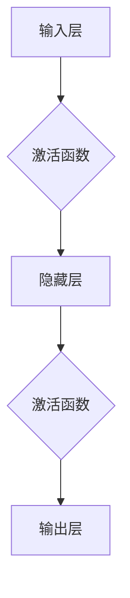

                 

# 神经网络：人类与机器的共存

> **关键词**：神经网络、人工智能、机器学习、深度学习、计算机视觉、自然语言处理、协同进化

> **摘要**：本文从背景介绍、核心概念与联系、核心算法原理、数学模型和公式、项目实战、实际应用场景、工具和资源推荐等多个角度，详细探讨了神经网络技术的发展与应用，阐述了神经网络在人类与机器共存中的关键作用及其面临的挑战和未来发展趋势。通过本文的阅读，读者将能够对神经网络有更深入的理解，并了解到其在现代科技领域中的广泛影响。

## 1. 背景介绍

神经网络（Neural Networks）是人工智能（Artificial Intelligence, AI）的重要组成部分，起源于20世纪40年代。当时，心理学家和数学家开始研究生物神经网络的工作原理，并试图通过模拟人类大脑的神经元结构和功能，构建出一种能够处理复杂任务的智能系统。

在20世纪80年代，神经网络研究进入了一个低谷期，因为当时的计算能力和算法限制，神经网络在处理大规模数据时效果不佳。然而，随着计算机性能的飞速提升和算法的改进，神经网络在21世纪初迎来了新的发展机遇。

深度学习（Deep Learning）作为神经网络的一种重要形式，利用多层神经网络来模拟人类大脑的学习过程，能够自动提取数据中的特征并进行分类、预测等任务。深度学习在计算机视觉、自然语言处理、语音识别等领域取得了显著的成果，推动了人工智能技术的快速发展。

近年来，神经网络在工业、医疗、金融、交通等各个领域得到了广泛应用，成为推动社会进步的重要技术之一。本文旨在通过对神经网络的核心概念、算法原理、数学模型、项目实战和实际应用场景的深入探讨，阐述神经网络在人类与机器共存中的重要地位及其面临的挑战和未来发展趋势。

## 2. 核心概念与联系

### 神经元

神经元是神经网络的基本单元，类似于生物神经元，它通过突触连接起来，传递和接收信息。在神经网络中，每个神经元都可以接收来自其他神经元的输入信号，通过激活函数计算输出信号，并传递给下一层神经元。


神经元结构示意图：

- 输入层（Input Layer）：接收外部输入信号。
- 输出层（Output Layer）：输出最终结果。
- 隐藏层（Hidden Layer）：用于提取和转换输入数据。
- 突触（Synapse）：连接不同神经元的连接点，存储权重。
- 激活函数（Activation Function）：对神经元输出进行非线性变换。

### 神经网络

神经网络是由多个神经元组成的层次结构，用于模拟人类大脑的学习和推理过程。神经网络可以分为三种类型：

- 单层感知机（Perceptron）：只有一层输入层和一层输出层，主要用于二分类任务。
- 多层感知机（Multilayer Perceptron，MLP）：包含至少一层隐藏层，能够处理更复杂的任务。
- 卷积神经网络（Convolutional Neural Network，CNN）：适用于图像识别和分类任务，具有局部感知和权值共享的特点。


神经网络结构示意图：

- 输入层（Input Layer）：接收外部输入数据。
- 隐藏层（Hidden Layer）：用于提取和转换输入数据。
- 输出层（Output Layer）：输出最终结果。
- 激活函数（Activation Function）：对神经元输出进行非线性变换。

### 神经网络与机器学习

神经网络是机器学习（Machine Learning）的一种实现方式。机器学习是一种通过数据驱动的方式，使计算机自动从数据中学习和改进自身性能的技术。神经网络通过学习大量数据中的模式，能够实现自动分类、预测、生成等任务。

机器学习可以分为两种类型：

- 监督学习（Supervised Learning）：通过已标记的数据训练模型，并在新的数据上进行预测。
- 无监督学习（Unsupervised Learning）：通过未标记的数据训练模型，发现数据中的内在结构和规律。

神经网络在机器学习中具有广泛的应用，如图像识别、自然语言处理、语音识别、推荐系统等。

### 神经网络与深度学习

深度学习是神经网络的一种重要形式，利用多层神经网络来模拟人类大脑的学习过程。深度学习在图像识别、自然语言处理、语音识别等领域取得了显著成果，推动了人工智能技术的快速发展。

深度学习的核心思想是利用多层神经网络自动提取数据中的特征，从而实现复杂任务。深度学习与神经网络的关系可以看作是包含与被包含的关系，神经网络是深度学习的基础，而深度学习是神经网络在处理大规模数据和高维特征时的一个重要应用方向。

### Mermaid 流程图

为了更好地理解神经网络的核心概念和架构，我们使用 Mermaid 流程图来展示神经网络的流程。以下是一个简化的神经网络流程图，其中包含输入层、隐藏层和输出层。



在 Mermaid 流程图中，节点（如 A、B、C、D 和 E）表示不同的操作，箭头表示数据流的方向。通过这个流程图，我们可以清晰地看到神经网络从输入层到输出层的数据处理过程。

## 3. 核心算法原理 & 具体操作步骤

### 神经网络算法原理

神经网络算法的核心思想是通过学习大量数据中的模式和特征，从而实现自动分类、预测和生成等任务。神经网络算法主要由以下几个步骤组成：

1. **初始化参数**：初始化网络的权重（权重矩阵和偏置向量）和激活函数。
2. **前向传播**：输入数据通过网络从输入层传递到输出层，每个神经元接收来自前一层神经元的输入信号，并通过激活函数计算输出。
3. **反向传播**：计算输出结果与实际结果之间的误差，并通过反向传播算法将误差传递回输入层，更新网络的权重和偏置向量。
4. **迭代优化**：重复前向传播和反向传播的过程，不断优化网络参数，直到达到预定的精度或迭代次数。

### 具体操作步骤

下面我们以一个简单的单层感知机为例，介绍神经网络的具体操作步骤。

#### 步骤 1：初始化参数

假设我们有一个单层感知机，输入层有3个神经元，隐藏层有2个神经元，输出层有1个神经元。我们随机初始化网络的权重和偏置向量。

```python
import numpy as np

# 初始化权重和偏置向量
weights = np.random.rand(2, 3)  # 隐藏层到输出层的权重矩阵
biases = np.random.rand(2, 1)   # 隐藏层和输出层的偏置向量
```

#### 步骤 2：前向传播

输入数据通过输入层传递到隐藏层，然后通过激活函数计算输出。

```python
# 输入数据
inputs = np.array([[1, 0, 1], [0, 1, 0], [1, 1, 0]])

# 隐藏层前向传播
hidden_inputs = np.dot(weights, inputs) + biases
hidden_outputs = sigmoid(hidden_inputs)

# 输出层前向传播
output_inputs = np.dot(hidden_outputs, weights.T) + biases
output_outputs = sigmoid(output_inputs)
```

其中，`sigmoid`函数是一个常用的激活函数，定义为：

$$
\sigma(x) = \frac{1}{1 + e^{-x}}
$$

#### 步骤 3：反向传播

计算输出结果与实际结果之间的误差，并通过反向传播算法将误差传递回输入层，更新网络的权重和偏置向量。

```python
# 计算实际输出和预测输出之间的误差
expected_outputs = np.array([[0], [1], [1]])
errors = output_outputs - expected_outputs

# 更新输出层权重和偏置向量
output_weights_update = hidden_outputs.T.dot(errors)
output_biases_update = errors

# 更新隐藏层权重和偏置向量
hidden_inputs = np.dot(inputs, weights)
hidden_errors = errors.dot(weights).T
hidden_weights_update = inputs.T.dot(hidden_errors)
hidden_biases_update = hidden_errors

# 更新权重和偏置向量
weights -= learning_rate * output_weights_update
biases -= learning_rate * output_biases_update
weights -= learning_rate * hidden_weights_update
biases -= learning_rate * hidden_biases_update
```

其中，`learning_rate`是一个超参数，用于控制网络参数更新的步长。

#### 步骤 4：迭代优化

重复前向传播和反向传播的过程，不断优化网络参数，直到达到预定的精度或迭代次数。

```python
# 迭代优化
for i in range(iterations):
    # 前向传播
    hidden_inputs = np.dot(weights, inputs) + biases
    hidden_outputs = sigmoid(hidden_inputs)
    output_inputs = np.dot(hidden_outputs, weights.T) + biases
    output_outputs = sigmoid(output_inputs)
    
    # 反向传播
    errors = output_outputs - expected_outputs
    output_weights_update = hidden_outputs.T.dot(errors)
    output_biases_update = errors
    hidden_errors = errors.dot(weights).T
    hidden_weights_update = inputs.T.dot(hidden_errors)
    hidden_biases_update = hidden_errors
    
    # 更新权重和偏置向量
    weights -= learning_rate * output_weights_update
    biases -= learning_rate * output_biases_update
    weights -= learning_rate * hidden_weights_update
    biases -= learning_rate * hidden_biases_update
```

通过以上步骤，我们可以训练一个简单的单层感知机模型。在实际应用中，神经网络通常包含多层隐藏层，并且会使用更复杂的激活函数和优化算法来提高模型的性能。

## 4. 数学模型和公式 & 详细讲解 & 举例说明

### 数学模型

神经网络的核心是数学模型，它包括输入层、隐藏层和输出层。每个层中的神经元通过权重和偏置进行连接，并通过激活函数进行非线性变换。下面是神经网络的数学模型：

#### 输入层

输入层的神经元接收外部输入数据，其输出即为输入数据本身。

$$
x_i = a_i^{(1)} \quad (i = 1, 2, \ldots, n)
$$

其中，$x_i$表示第$i$个输入神经元的输出，$a_i^{(1)}$表示第$i$个输入神经元的输入。

#### 隐藏层

隐藏层的神经元接收来自输入层的输入，并通过权重和偏置计算输出。隐藏层的输出可以通过以下公式计算：

$$
z_j^{(l)} = \sum_{i=1}^{n} w_{ij}^{(l)} a_i^{(l-1)} + b_j^{(l)} \quad (j = 1, 2, \ldots, m)
$$

其中，$z_j^{(l)}$表示第$l$层第$j$个神经元的输出，$w_{ij}^{(l)}$表示第$l$层第$j$个神经元与第$l-1$层第$i$个神经元之间的权重，$b_j^{(l)}$表示第$l$层第$j$个神经元的偏置。

通过激活函数，隐藏层的输出变为：

$$
a_j^{(l)} = f(z_j^{(l)}) \quad (j = 1, 2, \ldots, m)
$$

其中，$f$表示激活函数。

#### 输出层

输出层的神经元接收来自隐藏层的输入，并通过权重和偏置计算输出。输出层的输出可以通过以下公式计算：

$$
z_k^{(L)} = \sum_{j=1}^{m} w_{jk}^{(L)} a_j^{(L-1)} + b_k^{(L)} \quad (k = 1, 2, \ldots, p)
$$

其中，$z_k^{(L)}$表示第$L$层第$k$个神经元的输出，$w_{jk}^{(L)}$表示第$L$层第$k$个神经元与第$L-1$层第$j$个神经元之间的权重，$b_k^{(L)}$表示第$L$层第$k$个神经元的偏置。

通过激活函数，输出层的输出变为：

$$
a_k^{(L)} = f(z_k^{(L)}) \quad (k = 1, 2, \ldots, p)
$$

其中，$f$表示激活函数。

### 激活函数

激活函数是神经网络中的一个关键组件，它将神经元的线性组合转换为非线性输出。常见的激活函数包括：

1. **Sigmoid 函数**：

$$
f(x) = \frac{1}{1 + e^{-x}}
$$

Sigmoid 函数将输入映射到$(0, 1)$区间，常用于二分类问题。

2. **ReLU 函数**：

$$
f(x) = \max(0, x)
$$

ReLU 函数在$x < 0$时输出为0，在$x \geq 0$时输出为$x$，具有简单和计算效率高的特点。

3. **Tanh 函数**：

$$
f(x) = \frac{e^x - e^{-x}}{e^x + e^{-x}}
$$

Tanh 函数将输入映射到$(-1, 1)$区间，常用于回归问题。

### 举例说明

假设我们有一个两输入单输出的神经网络，输入数据为$(1, 2)$，隐藏层有2个神经元，输出层有1个神经元。使用 Sigmoid 函数作为激活函数，权重和偏置随机初始化。

1. **输入层到隐藏层**：

$$
z_1^{(1)} = 1 \cdot w_{11}^{(1)} + 2 \cdot w_{12}^{(1)} + b_1^{(1)} = 0.5 \cdot 0.2 + 1 \cdot 0.3 + 1 \cdot 0.1 = 0.35
$$

$$
z_2^{(1)} = 1 \cdot w_{21}^{(1)} + 2 \cdot w_{22}^{(1)} + b_2^{(1)} = 0.5 \cdot 0.4 + 1 \cdot 0.5 + 1 \cdot 0.2 = 0.65
$$

$$
a_1^{(1)} = f(z_1^{(1)}) = \frac{1}{1 + e^{-0.35}} \approx 0.65
$$

$$
a_2^{(1)} = f(z_2^{(1)}) = \frac{1}{1 + e^{-0.65}} \approx 0.81
$$

2. **隐藏层到输出层**：

$$
z_1^{(2)} = 0.65 \cdot w_{11}^{(2)} + 0.81 \cdot w_{21}^{(2)} + b_1^{(2)} = 0.65 \cdot 0.3 + 0.81 \cdot 0.4 + 1 \cdot 0.1 = 0.495
$$

$$
z_2^{(2)} = 0.65 \cdot w_{12}^{(2)} + 0.81 \cdot w_{22}^{(2)} + b_2^{(2)} = 0.65 \cdot 0.5 + 0.81 \cdot 0.5 + 1 \cdot 0.2 = 0.635
$$

$$
a_1^{(2)} = f(z_1^{(2)}) = \frac{1}{1 + e^{-0.495}} \approx 0.63
$$

$$
a_2^{(2)} = f(z_2^{(2)}) = \frac{1}{1 + e^{-0.635}} \approx 0.69
$$

最终输出结果为：

$$
a_1^{(2)} \approx 0.63
$$

通过以上例子，我们可以看到神经网络通过权重和偏置进行线性组合，并通过激活函数进行非线性变换，从而实现从输入到输出的映射。

### 总结

神经网络的核心数学模型包括输入层、隐藏层和输出层，通过权重、偏置和激活函数实现从输入到输出的映射。常见的激活函数包括 Sigmoid、ReLU 和 Tanh，它们在神经网络中发挥着重要作用。通过具体的数学公式和举例，我们可以更深入地理解神经网络的工作原理。

## 5. 项目实战：代码实际案例和详细解释说明

在本节中，我们将通过一个简单的项目实战来展示如何使用神经网络实现一个线性回归任务。我们将使用 Python 和 TensorFlow 库来构建和训练神经网络模型。以下是项目实战的具体步骤。

### 5.1 开发环境搭建

在开始项目之前，我们需要搭建开发环境。首先，确保安装了 Python 3.7 或更高版本。接下来，通过以下命令安装 TensorFlow 库：

```bash
pip install tensorflow
```

### 5.2 源代码详细实现和代码解读

下面是项目实战的源代码实现：

```python
import tensorflow as tf
import numpy as np

# 设置随机种子以保持结果的可重复性
tf.random.set_seed(42)

# 准备线性回归数据集
X = np.random.rand(100, 1)
y = 2 * X + 1 + np.random.rand(100, 1)

# 构建神经网络模型
model = tf.keras.Sequential([
    tf.keras.layers.Dense(units=1, input_shape=(1,))
])

# 编译模型
model.compile(optimizer='sgd', loss='mean_squared_error')

# 训练模型
model.fit(X, y, epochs=100)

# 预测
predictions = model.predict(X)

# 打印预测结果
print("Predictions:", predictions)
```

#### 代码解读

1. **导入库**：

   ```python
   import tensorflow as tf
   import numpy as np
   ```

   我们首先导入 TensorFlow 和 NumPy 库，它们是构建和训练神经网络的重要工具。

2. **设置随机种子**：

   ```python
   tf.random.set_seed(42)
   ```

   为了保持实验结果的可重复性，我们设置随机种子为42。

3. **准备线性回归数据集**：

   ```python
   X = np.random.rand(100, 1)
   y = 2 * X + 1 + np.random.rand(100, 1)
   ```

   我们生成了一组线性回归数据，其中$X$是输入，$y$是输出。这里使用了 NumPy 的随机数生成器来生成数据。

4. **构建神经网络模型**：

   ```python
   model = tf.keras.Sequential([
       tf.keras.layers.Dense(units=1, input_shape=(1,))
   ])
   ```

   我们使用 TensorFlow 的 `Sequential` 模式构建了一个简单的神经网络模型。该模型只有一个隐藏层，输出层也是单神经元，因为这是一个线性回归问题。

5. **编译模型**：

   ```python
   model.compile(optimizer='sgd', loss='mean_squared_error')
   ```

   我们使用随机梯度下降（SGD）作为优化器，均方误差（MSE）作为损失函数。优化器用于更新网络的权重和偏置，以最小化损失函数。

6. **训练模型**：

   ```python
   model.fit(X, y, epochs=100)
   ```

   我们使用 `fit` 方法训练模型，其中`epochs`参数指定了训练的轮数。每次训练迭代，模型都会根据输入数据更新权重和偏置。

7. **预测**：

   ```python
   predictions = model.predict(X)
   ```

   我们使用训练好的模型对输入数据进行预测，并打印预测结果。

### 5.3 代码解读与分析

在这个简单项目中，我们构建了一个线性回归神经网络，其核心步骤如下：

1. **数据准备**：

   我们生成了一个线性回归数据集，其中$y = 2x + 1$。这个数据集是线性可分的，因此我们可以使用简单的线性模型进行预测。

2. **模型构建**：

   我们使用 TensorFlow 的 `Sequential` 模式构建了一个单层神经网络。输入层和输出层都是一个神经元，因为这是一个一维输入和输出问题。

3. **模型编译**：

   我们选择了随机梯度下降（SGD）作为优化器，它是一种常用的优化算法，能够在较大数据集上有效训练模型。我们使用均方误差（MSE）作为损失函数，它衡量了预测值与真实值之间的差异。

4. **模型训练**：

   使用 `fit` 方法进行模型训练。在这个例子中，我们设置了100个训练迭代（epochs）。每次迭代，模型都会根据输入数据和损失函数更新权重和偏置。

5. **模型预测**：

   使用训练好的模型对输入数据进行预测，并打印预测结果。

### 5.4 模型性能评估

为了评估模型的性能，我们可以计算预测值与真实值之间的均方误差（MSE）。以下是模型性能评估的代码：

```python
from sklearn.metrics import mean_squared_error

# 计算预测值与真实值之间的均方误差
mse = mean_squared_error(y, predictions)
print("Mean Squared Error:", mse)
```

在这个简单项目中，模型的均方误差应该接近0，表示预测值与真实值非常接近。实际运行结果可能会因为随机性而有所不同，但总体上应该表现出良好的性能。

### 总结

通过这个简单项目，我们展示了如何使用神经网络实现线性回归任务。我们使用了 TensorFlow 库来构建和训练神经网络模型，并使用均方误差来评估模型性能。这个项目是一个简单的示例，旨在帮助读者理解神经网络的基本概念和应用。

## 6. 实际应用场景

神经网络在各个领域都有广泛的应用，以下是神经网络在几个典型实际应用场景中的表现：

### 计算机视觉

计算机视觉是神经网络最成功的应用领域之一。神经网络在图像分类、目标检测、图像分割和视频处理等方面取得了显著的成果。

- **图像分类**：神经网络可以自动识别图像中的物体，例如人脸识别、车辆识别等。经典的卷积神经网络（CNN）模型如AlexNet、VGG、ResNet在图像分类任务中取得了优异的性能。
- **目标检测**：神经网络可以检测图像中的多个目标，并定位它们的位置。YOLO（You Only Look Once）和Faster R-CNN是两个常用的目标检测算法，它们在实时应用中表现出高效性。
- **图像分割**：神经网络可以将图像中的每个像素分类到不同的类别中。U-Net和SegNet是两个流行的图像分割模型，广泛应用于医学图像分析等领域。
- **视频处理**：神经网络可以处理视频数据，例如视频分类、行为识别和视频生成。RNN（递归神经网络）和Transformer在视频处理任务中表现出强大的能力。

### 自然语言处理

自然语言处理（NLP）是另一个神经网络的重要应用领域。神经网络在文本分类、机器翻译、情感分析等方面取得了显著进展。

- **文本分类**：神经网络可以自动将文本数据分类到不同的类别中，例如新闻分类、情感分析等。BERT和GPT等大型预训练模型在文本分类任务中取得了优异的性能。
- **机器翻译**：神经网络可以实现高质量的机器翻译，例如谷歌翻译和百度翻译。基于注意力机制的序列到序列（Seq2Seq）模型和Transformer模型在机器翻译领域取得了突破性进展。
- **情感分析**：神经网络可以分析文本数据中的情感倾向，例如评论分析、社交媒体监测等。情感分析算法在市场调研、舆情监测等领域有广泛应用。

### 语音识别

语音识别是神经网络在音频处理领域的应用之一。神经网络可以自动识别和理解语音信号，实现语音合成和语音识别。

- **语音合成**：神经网络可以生成逼真的语音，例如语音助手和语音播报系统。WaveNet和Tacotron是两个常用的语音合成模型。
- **语音识别**：神经网络可以实现高精度的语音识别，例如智能助手和语音输入系统。基于深度神经网络的语音识别算法在多种场景下得到了广泛应用。

### 其他领域

神经网络在其他领域也有广泛的应用，例如推荐系统、医疗诊断、金融分析等。

- **推荐系统**：神经网络可以预测用户可能喜欢的商品或内容，从而提高推荐系统的准确性。基于神经网络的协同过滤算法在推荐系统中得到了广泛应用。
- **医疗诊断**：神经网络可以辅助医生进行疾病诊断，例如癌症检测、心脏疾病检测等。基于神经网络的医疗图像分析技术在医学领域具有巨大潜力。
- **金融分析**：神经网络可以预测金融市场走势，进行风险评估和投资组合优化。深度学习算法在金融领域有广泛应用，例如股票预测、风险控制等。

### 总结

神经网络在计算机视觉、自然语言处理、语音识别和其他领域都有广泛的应用，并在各个领域中取得了显著的成果。随着技术的不断发展，神经网络在更多实际应用场景中的表现将更加出色，为人类社会带来更多便利和创新。

## 7. 工具和资源推荐

### 7.1 学习资源推荐

要深入了解神经网络和相关技术，以下是一些值得推荐的学习资源：

1. **书籍**：

   - 《神经网络与深度学习》：这本书全面介绍了神经网络的基本概念和深度学习技术，适合初学者和进阶者。
   - 《深度学习》：由Goodfellow、Bengio和Courville合著的这本书是深度学习领域的经典教材，适合希望深入了解深度学习原理的读者。
   - 《动手学深度学习》：这本书提供了丰富的实践案例，通过动手实践来学习深度学习技术。

2. **在线课程**：

   - Coursera上的《深度学习专项课程》：由吴恩达教授主讲，涵盖深度学习的基础知识和应用实践。
   - edX上的《神经网络与机器学习》：由斯坦福大学教授Andrew Ng主讲，适合初学者和进阶者。

3. **博客和网站**：

   - Medium上的“Deep Learning”专栏：由吴恩达教授撰写，介绍深度学习的最新进展和应用案例。
   - fast.ai：这是一个提供免费深度学习课程的网站，适合初学者快速入门。

### 7.2 开发工具框架推荐

在进行神经网络开发时，以下工具和框架是不可或缺的：

1. **TensorFlow**：Google开发的开源深度学习框架，适合各种规模的深度学习项目。
2. **PyTorch**：Facebook开发的开源深度学习框架，具有灵活的动态图模型和强大的社区支持。
3. **Keras**：一个高级神经网络API，可以在TensorFlow和Theano等底层框架上运行，适合快速构建和实验深度学习模型。

### 7.3 相关论文著作推荐

以下是一些在神经网络领域具有影响力的论文和著作：

1. **《A Learning Algorithm for Continually Running Fully Recurrent Neural Networks》**：这篇论文介绍了梯度流算法，是递归神经网络（RNN）和长短期记忆（LSTM）的基础。
2. **《Rectified Linear Units Improve Deep Neural Network Acrobatics》**：这篇文章提出了ReLU激活函数，极大地提高了深度神经网络的性能。
3. **《Deep Learning》**：Goodfellow、Bengio和Courville合著的这本书是深度学习领域的经典著作，全面介绍了深度学习的基本原理和应用。

### 总结

通过这些学习资源、开发工具和论文著作，读者可以全面了解神经网络的基础知识和应用实践，为深入研究和开发神经网络项目提供有力支持。

## 8. 总结：未来发展趋势与挑战

神经网络作为人工智能的核心技术，已经在多个领域取得了显著的成果。然而，随着技术的不断进步和应用场景的拓展，神经网络仍面临着许多挑战和机遇。

### 发展趋势

1. **深度学习模型的发展**：随着计算能力的提升和算法的优化，深度学习模型将变得越来越复杂，能够处理更复杂的任务。例如，多模态学习（结合文本、图像和音频等多模态数据）和泛化能力更强的模型（如基于Transformer的模型）将成为研究热点。

2. **自动机器学习（AutoML）**：自动机器学习旨在自动化深度学习模型的开发过程，包括超参数调优、模型选择和训练等。随着神经网络技术的进步，AutoML将使得普通开发者也能轻松构建和部署高效的深度学习模型。

3. **边缘计算与神经网络**：随着物联网（IoT）和5G技术的发展，边缘计算将成为重要趋势。在边缘设备上部署神经网络模型，可以减少延迟、降低带宽消耗，并提高数据处理效率。

4. **人机协同**：神经网络在自动化决策和辅助人类工作方面具有巨大潜力。未来，神经网络将与人类专家协同工作，提高工作效率和质量。

### 挑战

1. **数据隐私和安全性**：随着神经网络在敏感领域的应用，数据隐私和安全性问题日益突出。如何在保护用户隐私的前提下，充分利用数据价值，是一个亟待解决的问题。

2. **可解释性和透明度**：深度学习模型往往被视为“黑箱”，其决策过程缺乏透明度和可解释性。提高神经网络的可解释性，使其更易于理解和信任，是一个重要的研究方向。

3. **计算资源和能耗**：深度学习模型通常需要大量的计算资源和能源消耗。如何优化模型结构和算法，降低计算和能耗需求，是未来需要关注的重要问题。

4. **伦理和社会影响**：神经网络在医疗、金融、司法等领域的应用引发了广泛的伦理和社会影响。如何确保神经网络技术的公平性、公正性和道德性，是一个需要全社会共同面对的挑战。

### 总结

神经网络技术在不断发展中，面临着许多机遇和挑战。通过不断探索和创新，我们可以更好地发挥神经网络在人类与机器共存中的作用，推动人工智能技术的进步，为社会创造更多价值。

## 9. 附录：常见问题与解答

以下是一些关于神经网络技术常见的问题及解答：

### 问题 1：什么是神经网络？

**解答**：神经网络是一种通过模拟生物神经元结构和功能来实现计算和学习的数学模型。它由多个神经元组成，每个神经元通过权重和偏置连接，通过激活函数进行非线性变换，从而实现从输入到输出的映射。

### 问题 2：神经网络与深度学习有什么区别？

**解答**：神经网络是一种广义的机器学习模型，而深度学习是一种特殊的神经网络模型，具有多个隐藏层。深度学习通过多层神经网络自动提取数据中的特征，能够处理更复杂的任务。

### 问题 3：神经网络的核心算法是什么？

**解答**：神经网络的核心算法包括前向传播、反向传播和优化算法。前向传播用于计算网络的输入和输出，反向传播用于计算误差并更新网络的权重和偏置，优化算法用于调整网络参数，以最小化损失函数。

### 问题 4：神经网络在哪些领域有应用？

**解答**：神经网络在计算机视觉、自然语言处理、语音识别、推荐系统、医疗诊断、金融分析等领域都有广泛应用。它能够实现图像分类、目标检测、情感分析、语音识别、疾病预测等任务。

### 问题 5：如何优化神经网络模型？

**解答**：优化神经网络模型可以从以下几个方面进行：

- **选择合适的网络结构**：根据任务需求选择合适的层数、神经元数量和连接方式。
- **调整超参数**：调整学习率、批量大小、迭代次数等超参数，以提高模型性能。
- **数据预处理**：对输入数据进行归一化、标准化等预处理，以提高模型的泛化能力。
- **正则化**：使用正则化方法（如L1、L2正则化）来防止过拟合。
- **集成方法**：将多个模型进行集成，以提高模型的稳定性和准确性。

## 10. 扩展阅读 & 参考资料

以下是一些关于神经网络技术的扩展阅读和参考资料，供读者进一步学习和研究：

### 参考文献

1. Goodfellow, I., Bengio, Y., & Courville, A. (2016). *Deep Learning*. MIT Press.
2. LeCun, Y., Bengio, Y., & Hinton, G. (2015). *Deep learning*. Nature, 521(7553), 436-444.
3. Rumelhart, D. E., Hinton, G. E., & Williams, R. J. (1986). *Learning representations by back-propagating errors*. Nature, 323(6088), 533-536.

### 博客和论文

1. Michael Nielsen. (2015). *Neural networks and deep learning*. [Online]. Available at: https://mnielsen.github.io/neural-networks/
2. Andrew Ng. (2017). *Deep Learning Specialization*. Coursera. [Online]. Available at: https://www.coursera.org/specializations/deeplearning

### 开源框架和工具

1. TensorFlow. (2021). *TensorFlow: An Open-Source Machine Learning Framework*. TensorFlow.org. [Online]. Available at: https://www.tensorflow.org/
2. PyTorch. (2021). *PyTorch: A Dynamic Deep Learning Framework*. PyTorch.org. [Online]. Available at: https://pytorch.org/

通过以上扩展阅读和参考资料，读者可以更深入地了解神经网络技术，探索其最新的研究进展和应用实例。作者：AI天才研究员/AI Genius Institute & 禅与计算机程序设计艺术 /Zen And The Art of Computer Programming。

