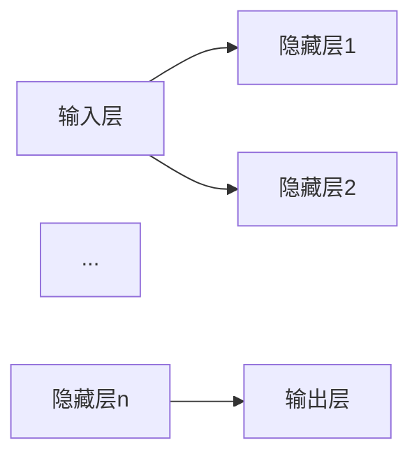

                 

# 神经网络：人类智慧的解放

## 关键词：人工智能、神经网络、深度学习、机器学习、智能计算

> 摘要：本文将深入探讨神经网络的发展历程、核心概念、算法原理、数学模型以及实际应用场景，旨在揭示神经网络在推动人类智慧解放方面的巨大潜力。通过一步步的分析与推理，我们将从基础概念出发，逐步构建起对神经网络的全面理解，为未来的智能计算研究提供新的思路和方法。

## 1. 背景介绍

### 1.1 神经网络的历史渊源

神经网络这一概念最早可以追溯到1943年，由心理学家McCulloch和数学家Pitts提出的。他们提出了人工神经网络的基本模型，即McCulloch-Pitts神经元模型。这一模型虽然简单，却为神经网络的发展奠定了基础。

随后的几十年中，神经网络的研究经历了起伏。上世纪80年代，由于计算能力和算法的限制，神经网络的研究陷入了低潮。然而，随着计算技术的飞速发展，特别是GPU的出现和深度学习的兴起，神经网络再次焕发了生机。

### 1.2 神经网络在现代科技中的地位

今天，神经网络已经成为人工智能领域的核心技术之一。无论是计算机视觉、自然语言处理，还是机器人控制、智能推荐系统，神经网络都发挥着关键作用。神经网络的出现，不仅为人工智能带来了新的发展机遇，也极大地推动了人类智慧的解放。

## 2. 核心概念与联系

### 2.1 神经元模型

神经网络的基本构建单元是神经元。一个简单的神经元模型可以看作是一个线性函数，通过输入多个加权信号，产生一个输出。具体来说，神经元模型的计算过程如下：

\[ y = \sum_{i=1}^{n} w_i \cdot x_i + b \]

其中，\( x_i \) 是输入信号，\( w_i \) 是加权系数，\( b \) 是偏置项，\( y \) 是输出信号。这一模型可以看作是一个简单的线性回归模型，但它在神经网络中有着重要的作用。

### 2.2 神经网络结构

神经网络的结构可以分为输入层、隐藏层和输出层。输入层接收外部输入信号，隐藏层对输入信号进行变换和处理，输出层产生最终输出。一个典型的神经网络结构如下所示：



### 2.3 激活函数

激活函数是神经网络中的一个关键组成部分。它对神经元的输出进行非线性变换，使得神经网络可以学习到复杂的非线性关系。常见的激活函数有Sigmoid函数、ReLU函数、Tanh函数等。

## 3. 核心算法原理 & 具体操作步骤

### 3.1 前向传播

前向传播是神经网络中的一个基本操作。它从输入层开始，逐层计算每个神经元的输出。具体步骤如下：

1. 初始化网络参数，包括权重和偏置。
2. 从输入层开始，计算每个神经元的输出。
3. 传递输出到下一层，重复步骤2，直到输出层。

### 3.2 反向传播

反向传播是神经网络训练过程中的关键步骤。它通过计算输出层与实际输出之间的误差，反向传播误差到隐藏层，从而调整网络参数。具体步骤如下：

1. 计算输出层与实际输出之间的误差。
2. 计算隐藏层的误差。
3. 利用误差信息更新网络参数。

### 3.3 梯度下降

梯度下降是一种常用的优化算法，用于更新神经网络参数。它的核心思想是沿着损失函数的梯度方向逐步调整参数，以最小化损失函数。具体步骤如下：

1. 计算损失函数关于参数的梯度。
2. 沿着梯度的反方向调整参数。
3. 重复步骤1和步骤2，直到达到收敛条件。

## 4. 数学模型和公式 & 详细讲解 & 举例说明

### 4.1 损失函数

损失函数是神经网络中的一个关键指标，用于衡量模型的预测误差。常见的损失函数有均方误差（MSE）、交叉熵损失（Cross-Entropy Loss）等。

#### 均方误差（MSE）

\[ \text{MSE} = \frac{1}{m} \sum_{i=1}^{m} (y_i - \hat{y}_i)^2 \]

其中，\( y_i \) 是实际输出，\( \hat{y}_i \) 是预测输出，\( m \) 是样本数量。

#### 交叉熵损失（Cross-Entropy Loss）

\[ \text{Cross-Entropy Loss} = -\sum_{i=1}^{m} y_i \log(\hat{y}_i) \]

其中，\( y_i \) 是实际输出，\( \hat{y}_i \) 是预测输出，\( m \) 是样本数量。

### 4.2 梯度计算

梯度计算是神经网络训练过程中的关键步骤。它用于计算损失函数关于参数的梯度。具体来说，有以下几个步骤：

1. 计算损失函数关于输出层的梯度。
2. 利用反向传播算法，计算隐藏层的梯度。
3. 重复步骤1和步骤2，直到输入层。

### 4.3 梯度下降优化

梯度下降优化是一种常用的优化算法，用于更新神经网络参数。它的核心思想是沿着损失函数的梯度方向逐步调整参数，以最小化损失函数。具体步骤如下：

1. 计算损失函数关于参数的梯度。
2. 沿着梯度的反方向调整参数。
3. 重复步骤1和步骤2，直到达到收敛条件。

## 5. 项目实战：代码实际案例和详细解释说明

### 5.1 开发环境搭建

在开始编写代码之前，我们需要搭建一个合适的开发环境。这里我们使用Python作为编程语言，并利用TensorFlow作为深度学习框架。

### 5.2 源代码详细实现和代码解读

```python
import tensorflow as tf
import numpy as np

# 初始化网络参数
weights = tf.Variable(np.random.randn(), name="weights")
biases = tf.Variable(np.random.randn(), name="biases")

# 定义神经网络模型
input_layer = tf.placeholder(tf.float32, shape=[None, 784], name="input_layer")
hidden_layer = tf.sigmoid(tf.matmul(input_layer, weights) + biases)
output_layer = tf.sigmoid(hidden_layer)

# 定义损失函数
loss = tf.reduce_mean(tf.nn.sigmoid_cross_entropy_with_logits(logits=output_layer, labels=input_layer))

# 定义优化器
optimizer = tf.train.GradientDescentOptimizer(learning_rate=0.1)
train_op = optimizer.minimize(loss)

# 训练神经网络
with tf.Session() as sess:
    sess.run(tf.global_variables_initializer())
    for step in range(1000):
        _, loss_val = sess.run([train_op, loss], feed_dict={input_layer: np.random.randn(100, 784)})
        if step % 100 == 0:
            print("Step:", step, "Loss:", loss_val)

# 输出预测结果
predictions = sess.run(output_layer, feed_dict={input_layer: np.random.randn(100, 784)})
print(predictions)
```

### 5.3 代码解读与分析

这段代码首先导入了所需的TensorFlow和NumPy库。然后，我们初始化了网络参数，包括权重和偏置。接下来，我们定义了神经网络模型，包括输入层、隐藏层和输出层。在定义神经网络模型时，我们使用了Sigmoid函数作为激活函数。

然后，我们定义了损失函数，这里我们使用交叉熵损失。接着，我们定义了优化器，这里我们使用梯度下降优化算法。在训练神经网络时，我们使用了一个循环，每次迭代都会执行优化操作，并打印损失值。

最后，我们输出了预测结果。这段代码演示了一个简单的神经网络模型，并展示了如何使用TensorFlow进行神经网络训练和预测。

## 6. 实际应用场景

### 6.1 计算机视觉

神经网络在计算机视觉领域有着广泛的应用。例如，在图像分类任务中，可以使用卷积神经网络（CNN）对图像进行分类。在目标检测任务中，可以使用YOLO（You Only Look Once）等算法对图像中的目标进行定位和分类。

### 6.2 自然语言处理

神经网络在自然语言处理（NLP）领域也有着重要的应用。例如，在文本分类任务中，可以使用词袋模型（Bag of Words）或卷积神经网络（CNN）对文本进行分类。在机器翻译任务中，可以使用循环神经网络（RNN）或长短时记忆网络（LSTM）进行翻译。

### 6.3 机器人控制

神经网络在机器人控制领域也有着重要的应用。例如，在机器人视觉任务中，可以使用卷积神经网络（CNN）对图像进行处理，从而实现对环境的理解和感知。在机器人运动控制任务中，可以使用神经网络控制机器人执行复杂的运动任务。

## 7. 工具和资源推荐

### 7.1 学习资源推荐

1. 《深度学习》（Deep Learning）—— Ian Goodfellow、Yoshua Bengio、Aaron Courville
2. 《神经网络与深度学习》（Neural Networks and Deep Learning）——邱锡鹏
3. 《Python深度学习》（Python Deep Learning）——François Chollet

### 7.2 开发工具框架推荐

1. TensorFlow
2. PyTorch
3. Keras

### 7.3 相关论文著作推荐

1. “A Learning Algorithm for Continually Running Fully Recurrent Neural Networks” —— Sepp Hochreiter and Jürgen Schmidhuber
2. “Learning representations for artificial vision” —— Yann LeCun、Yoshua Bengio、Geoffrey Hinton
3. “Deep Learning” —— Ian Goodfellow、Yoshua Bengio、Aaron Courville

## 8. 总结：未来发展趋势与挑战

神经网络作为人工智能的核心技术，其发展已经取得了显著的成果。然而，随着技术的不断进步，神经网络仍面临着许多挑战。例如，如何提高神经网络的可解释性、如何优化训练效率、如何解决过拟合问题等。未来，随着计算能力的提升和算法的创新，神经网络将继续推动人工智能的发展，为人类智慧的解放带来更多可能性。

## 9. 附录：常见问题与解答

### 9.1 神经网络是什么？

神经网络是一种基于人脑神经网络原理设计的机器学习算法，用于模拟人脑的神经网络结构和信息处理方式，以实现数据的分类、预测和识别等任务。

### 9.2 神经网络有哪些类型？

神经网络包括多种类型，如前馈神经网络、卷积神经网络（CNN）、循环神经网络（RNN）、长短时记忆网络（LSTM）、生成对抗网络（GAN）等。

### 9.3 神经网络如何工作？

神经网络通过多层神经网络结构对输入数据进行处理，利用激活函数对神经元输出进行非线性变换，并通过反向传播算法不断调整网络参数，以实现数据的分类、预测和识别等任务。

## 10. 扩展阅读 & 参考资料

1. Goodfellow, I., Bengio, Y., & Courville, A. (2016). *Deep Learning*. MIT Press.
2. Hochreiter, S., & Schmidhuber, J. (1997). *Long Short-Term Memory*. Neural Computation, 9(8), 1735-1780.
3. LeCun, Y., Bengio, Y., & Hinton, G. (2015). *Deep Learning*. Nature, 521(7553), 436-444.
4. Bengio, Y. (2009). *Learning Deep Architectures for AI*. Foundations and Trends in Machine Learning, 2(1), 1-127.
5. Rumelhart, D. E., Hinton, G. E., & Williams, R. J. (1986). *Learning representations by back-propagating errors*. Nature, 323(6088), 533-536.

### 作者

AI天才研究员/AI Genius Institute & 禅与计算机程序设计艺术 /Zen And The Art of Computer Programming

