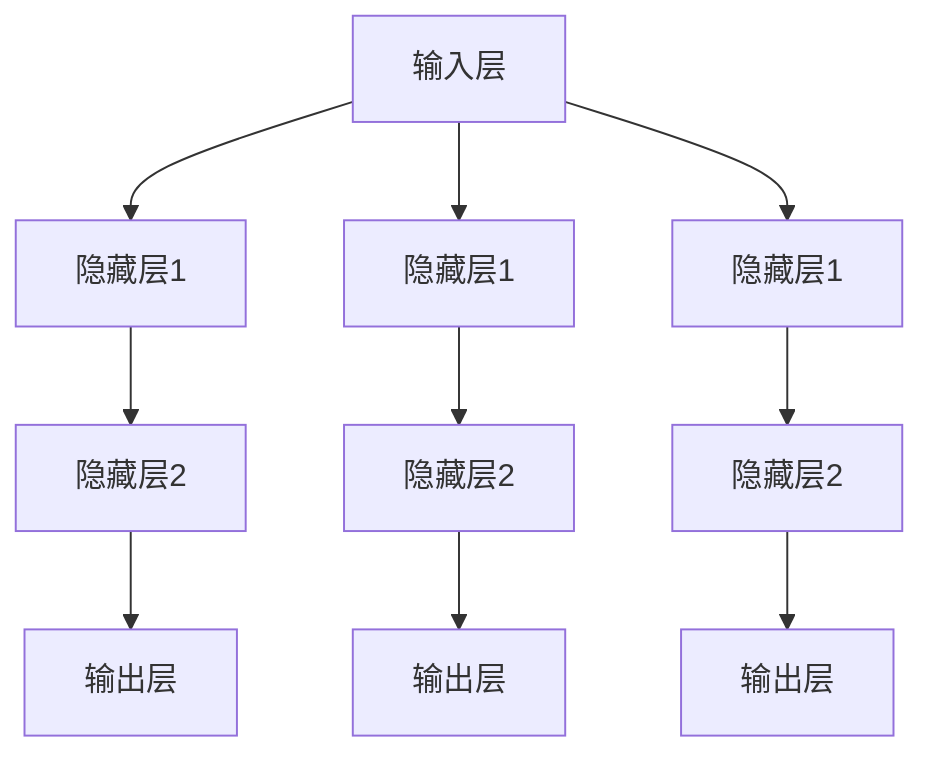

                 

### 背景介绍

#### 神经网络的历史与演变

神经网络的概念最早可以追溯到1943年，由心理学家McCulloch和数学家Pitts提出。他们首次尝试模拟人脑神经元的工作方式，并提出了人工神经网络（Artificial Neural Networks,ANN）的初步模型——MP模型。这一模型为后续神经网络的演变奠定了基础。

然而，早期的神经网络由于计算能力和算法限制，发展较为缓慢。直到1980年代，随着计算机技术的飞速发展，神经网络研究才逐渐兴起。1986年，Rumelhart、Hinton和Williams提出了反向传播算法（Backpropagation Algorithm），这一突破性算法大大提高了神经网络的训练效率，使得神经网络开始被广泛应用于图像识别、语音识别等领域。

进入21世纪，随着深度学习（Deep Learning）的兴起，神经网络迎来了新一轮的发展。深度学习通过多层神经网络对数据进行多层抽象，实现了在语音识别、图像识别、自然语言处理等领域的重大突破。如今，神经网络已经成为人工智能领域不可或缺的一部分，其应用范围不断扩展，从自动驾驶到医疗诊断，从金融预测到智能制造，无处不在。

#### 神经网络的基本原理

神经网络是一种模拟人脑神经元结构和功能的计算模型。它由大量的节点（神经元）组成，这些节点通过连接（边）相互连接，形成一个复杂的网络结构。每个节点可以接收多个输入信号，通过加权求和处理后，输出一个信号。

神经网络的训练过程就是不断调整每个节点的权重，使得网络能够正确地处理输入数据并输出期望的结果。这一过程通常采用梯度下降算法，通过计算输出误差的梯度，反向传播到每个节点，调整权重。

神经网络的核心组成部分包括：

- **输入层**：接收外部输入信号。
- **隐藏层**：对输入信号进行加工和处理，多层隐藏层可以实现更复杂的特征提取。
- **输出层**：输出最终的预测结果。

#### 神经网络在社会进步中的作用

神经网络作为一种强大的计算模型，已经在各个领域展现出了巨大的潜力，推动了社会的进步。以下是一些主要的应用领域：

- **图像识别**：神经网络在图像识别领域取得了显著的成果。例如，卷积神经网络（Convolutional Neural Networks,CNN）在图像分类、目标检测等方面具有优异的性能，广泛应用于安防监控、医疗诊断、自动驾驶等领域。
  
- **自然语言处理**：神经网络在自然语言处理（Natural Language Processing,NLP）领域也有着广泛的应用。例如，循环神经网络（Recurrent Neural Networks,RNN）和其变种长短时记忆网络（Long Short-Term Memory,LSTM）在机器翻译、文本分类、情感分析等方面表现出了强大的能力。

- **语音识别**：神经网络在语音识别领域同样取得了巨大的成功。通过深度学习技术，语音识别系统的准确率得到了显著提高，广泛应用于智能客服、智能家居等领域。

- **金融预测**：神经网络在金融领域也有着广泛的应用。例如，通过训练神经网络模型，可以预测股票价格、分析市场趋势，为投资者提供决策支持。

- **医疗诊断**：神经网络在医疗领域也有着重要的应用。例如，通过分析医学影像数据，神经网络可以辅助医生进行疾病诊断，提高诊断的准确性和效率。

#### 文章结构概述

本文将围绕神经网络这一主题，从以下几个方面展开讨论：

1. **背景介绍**：回顾神经网络的历史与发展，介绍神经网络的基本原理。
2. **核心概念与联系**：使用Mermaid流程图展示神经网络的结构，并详细解释各部分的作用。
3. **核心算法原理与具体操作步骤**：介绍神经网络的核心算法，如反向传播算法，并解释其具体操作步骤。
4. **数学模型和公式**：详细讲解神经网络的数学模型和公式，并通过举例进行说明。
5. **项目实战**：通过实际案例，展示如何使用神经网络进行图像识别。
6. **实际应用场景**：分析神经网络在不同领域的应用，探讨其对社会进步的推动作用。
7. **工具和资源推荐**：推荐学习神经网络的相关资源。
8. **总结**：展望神经网络的发展趋势与挑战。
9. **附录**：常见问题与解答。
10. **扩展阅读与参考资料**：提供进一步学习的资源。

通过以上结构，本文将系统地介绍神经网络的基本概念、原理和应用，旨在帮助读者全面了解神经网络这一推动社会进步的重要力量。## 2. 核心概念与联系

#### 神经网络的结构

神经网络的结构主要由输入层、隐藏层和输出层组成。每一层由多个神经元（节点）组成，神经元之间通过连接（边）相互连接。输入层接收外部输入信号，隐藏层对输入信号进行加工和处理，输出层输出最终的预测结果。


以下是一个简单的神经网络结构示意图：

```
输入层：[x1, x2, ..., xn]
隐藏层1：[a1, a2, ..., an]
隐藏层2：[b1, b2, ..., bn]
输出层：[y1, y2, ..., yn]
```

#### Mermaid流程图展示

为了更直观地展示神经网络的结构，我们可以使用Mermaid流程图来描述。



在这个流程图中，每个节点表示一个神经元，箭头表示神经元之间的连接。通过这个流程图，我们可以清晰地看到神经网络的结构和各层之间的关系。

#### 神经网络的工作原理

神经网络的工作原理可以分为两个过程：正向传播（Forward Propagation）和反向传播（Back Propagation）。

1. **正向传播**：输入信号从输入层经过各隐藏层，最终传递到输出层。每个神经元都会接收多个输入信号，通过加权求和处理后，输出一个信号。

   具体步骤如下：
   
   - 输入层接收外部输入信号。
   - 每个隐藏层将上一层的输出作为输入，通过激活函数进行处理，得到新的输出。
   - 输出层输出最终的预测结果。

2. **反向传播**：计算输出误差，并反向传播到每个神经元，调整权重。

   具体步骤如下：
   
   - 计算实际输出与预测输出之间的误差。
   - 反向传播误差到每个神经元，计算每个神经元的梯度。
   - 根据梯度调整每个神经元的权重。

   通过正向传播和反向传播，神经网络可以不断调整权重，使得输出结果越来越接近期望值。

#### 神经网络的激活函数

激活函数（Activation Function）是神经网络中重要的组成部分，它对神经元的输出进行非线性变换。常见的激活函数包括：

- **sigmoid函数**：\( f(x) = \frac{1}{1 + e^{-x}} \)
- **ReLU函数**：\( f(x) = \max(0, x) \)
- **Tanh函数**：\( f(x) = \frac{e^x - e^{-x}}{e^x + e^{-x}} \)

激活函数的选择会影响神经网络的训练效率和性能。一般来说，ReLU函数在深度神经网络中表现较好，可以有效防止梯度消失和梯度爆炸问题。

#### 神经网络的核心概念

- **权重（Weights）**：连接神经元之间的权重，用于调整输入信号的重要性。
- **偏置（Bias）**：每个神经元的一个可学习参数，用于调整神经元的激活值。
- **激活值（Activation Value）**：神经元接收输入信号后，通过加权求和处理得到的输出值。
- **梯度（Gradient）**：用于描述损失函数相对于每个权重的变化率，用于反向传播过程中的权重更新。
- **学习率（Learning Rate）**：用于调整每次权重更新的幅度，影响训练速度和最终性能。

通过以上核心概念和原理的介绍，我们对神经网络的结构和工作原理有了更深入的了解。接下来，我们将进一步探讨神经网络的数学模型和公式，以及其具体操作步骤。## 3. 核心算法原理 & 具体操作步骤

#### 反向传播算法（Back Propagation Algorithm）

反向传播算法是神经网络训练过程中最核心的算法，它通过不断调整神经网络的权重和偏置，使得网络能够正确地处理输入数据并输出期望的结果。以下是反向传播算法的具体操作步骤：

1. **初始化参数**：首先，需要初始化网络的权重和偏置。通常，可以使用随机初始化或者预训练的权重。初始化完成后，设置一个较小的学习率。

2. **正向传播**：输入信号从输入层传递到输出层，每个神经元都会接收多个输入信号，通过加权求和处理后，输出一个信号。隐藏层和输出层的神经元会使用激活函数对输出进行非线性变换。

3. **计算误差**：计算实际输出与预测输出之间的误差。误差可以通过以下公式计算：

   $$ \epsilon = y - \hat{y} $$

   其中，\( y \) 是实际输出，\( \hat{y} \) 是预测输出。

4. **反向传播误差**：计算输出误差的梯度，并反向传播到每个神经元。对于每个神经元，可以使用链式法则计算其梯度：

   $$ \frac{\partial \epsilon}{\partial w_{ij}} = \frac{\partial \epsilon}{\partial \hat{y}} \cdot \frac{\partial \hat{y}}{\partial z_j} \cdot \frac{\partial z_j}{\partial w_{ij}} $$

   其中，\( w_{ij} \) 是连接第 \( i \) 层神经元和第 \( j \) 层神经元的权重，\( z_j \) 是第 \( j \) 层神经元的激活值。

5. **更新权重和偏置**：根据计算得到的梯度，更新每个神经元的权重和偏置。更新公式如下：

   $$ w_{ij} \leftarrow w_{ij} - \alpha \cdot \frac{\partial \epsilon}{\partial w_{ij}} $$

   $$ b_j \leftarrow b_j - \alpha \cdot \frac{\partial \epsilon}{\partial b_j} $$

   其中，\( \alpha \) 是学习率。

6. **重复步骤2-5**：重复正向传播、计算误差、反向传播误差和更新权重和偏置的过程，直到网络收敛或者达到预设的训练次数。

#### 前向传播算法（Forward Propagation Algorithm）

前向传播算法是神经网络处理输入数据的基本流程，它通过逐层传递输入信号，最终得到输出结果。以下是前向传播算法的具体操作步骤：

1. **输入数据**：首先，将输入数据输入到神经网络的输入层。

2. **加权求和处理**：每个神经元都会接收来自前一层神经元的输入信号，通过加权求和处理后，得到一个中间值。

3. **应用激活函数**：对每个神经元的中间值应用激活函数，得到神经元的激活值。

4. **传递到下一层**：将每个神经元的激活值传递到下一层，重复步骤2-3，直到输出层。

5. **得到输出结果**：输出层的神经元得到最终的预测结果。

6. **计算误差**：计算实际输出与预测输出之间的误差。

通过前向传播和反向传播，神经网络可以不断调整权重和偏置，使得输出结果越来越接近期望值。这一过程通常需要多次迭代，直到网络收敛或者达到预设的训练次数。

#### 梯度下降算法（Gradient Descent Algorithm）

梯度下降算法是反向传播算法的核心，它用于更新神经网络的权重和偏置。以下是梯度下降算法的具体操作步骤：

1. **初始化参数**：初始化网络的权重和偏置，设置一个较小的学习率。

2. **计算梯度**：计算损失函数关于每个权重的梯度。

3. **更新权重和偏置**：根据计算得到的梯度，更新每个神经元的权重和偏置。

4. **重复步骤2-3**：重复计算梯度、更新权重和偏置的过程，直到网络收敛或者达到预设的训练次数。

梯度下降算法的关键在于选择合适的学习率。学习率太大可能导致网络无法收敛，学习率太小则可能导致训练过程过于缓慢。因此，在实际应用中，通常会使用自适应学习率算法，如AdaGrad、RMSprop和Adam等。

通过以上核心算法原理和具体操作步骤的介绍，我们对神经网络的工作原理和训练过程有了更深入的了解。接下来，我们将进一步探讨神经网络的数学模型和公式，以及其具体应用。## 4. 数学模型和公式 & 详细讲解 & 举例说明

#### 神经网络的数学模型

神经网络的数学模型主要基于线性代数和微积分，其核心是多层感知机（Multilayer Perceptron,MLP）模型。以下是神经网络的主要数学模型和公式：

1. **输入层到隐藏层的计算**

   $$ z_j = \sum_{i=1}^{n} w_{ij}x_i + b_j $$

   其中，\( z_j \) 是隐藏层第 \( j \) 个神经元的中间值，\( x_i \) 是输入层第 \( i \) 个神经元的输入值，\( w_{ij} \) 是连接输入层和隐藏层的权重，\( b_j \) 是隐藏层第 \( j \) 个神经元的偏置。

2. **隐藏层到输出层的计算**

   $$ \hat{y}_j = f(z_j) $$

   其中，\( \hat{y}_j \) 是输出层第 \( j \) 个神经元的预测值，\( z_j \) 是隐藏层第 \( j \) 个神经元的中间值，\( f(z_j) \) 是激活函数。

3. **误差计算**

   $$ \epsilon = y - \hat{y} $$

   其中，\( y \) 是实际输出，\( \hat{y} \) 是预测输出。

4. **权重和偏置的更新**

   $$ w_{ij} \leftarrow w_{ij} - \alpha \frac{\partial \epsilon}{\partial w_{ij}} $$

   $$ b_j \leftarrow b_j - \alpha \frac{\partial \epsilon}{\partial b_j} $$

   其中，\( w_{ij} \) 是连接输入层和隐藏层的权重，\( b_j \) 是隐藏层的偏置，\( \alpha \) 是学习率。

#### 举例说明

假设我们有一个简单的神经网络，输入层有2个神经元，隐藏层有3个神经元，输出层有1个神经元。输入数据为 \( [x_1, x_2] \)，实际输出为 \( y \)。激活函数使用ReLU函数。

1. **初始化参数**

   - 输入层到隐藏层的权重：\( w_{11}, w_{12}, w_{21}, w_{22}, w_{31}, w_{32} \)
   - 隐藏层到输出层的权重：\( w_{1}, w_{2}, w_{3} \)
   - 隐藏层的偏置：\( b_1, b_2, b_3 \)
   - 学习率：\( \alpha = 0.01 \)

2. **正向传播**

   - 输入层到隐藏层的计算：

     $$ z_1 = w_{11}x_1 + w_{21}x_2 + b_1 $$
     $$ z_2 = w_{12}x_1 + w_{22}x_2 + b_2 $$
     $$ z_3 = w_{13}x_1 + w_{23}x_2 + b_3 $$

     应用ReLU函数：

     $$ a_1 = \max(0, z_1) $$
     $$ a_2 = \max(0, z_2) $$
     $$ a_3 = \max(0, z_3) $$

   - 隐藏层到输出层的计算：

     $$ \hat{y} = w_1a_1 + w_2a_2 + w_3a_3 $$

3. **计算误差**

   $$ \epsilon = y - \hat{y} $$

4. **反向传播**

   - 输出层的梯度：

     $$ \frac{\partial \epsilon}{\partial w_1} = \frac{\partial \epsilon}{\partial \hat{y}} \cdot \frac{\partial \hat{y}}{\partial a_1} \cdot \frac{\partial a_1}{\partial z_1} $$
     $$ \frac{\partial \epsilon}{\partial w_2} = \frac{\partial \epsilon}{\partial \hat{y}} \cdot \frac{\partial \hat{y}}{\partial a_2} \cdot \frac{\partial a_2}{\partial z_2} $$
     $$ \frac{\partial \epsilon}{\partial w_3} = \frac{\partial \epsilon}{\partial \hat{y}} \cdot \frac{\partial \hat{y}}{\partial a_3} \cdot \frac{\partial a_3}{\partial z_3} $$

     由于ReLU函数的导数在 \( z_j > 0 \) 时为1，在 \( z_j < 0 \) 时为0，因此：

     $$ \frac{\partial a_1}{\partial z_1} = \begin{cases} 
     1 & \text{if } z_1 > 0 \\
     0 & \text{otherwise} 
     \end{cases} $$
     $$ \frac{\partial a_2}{\partial z_2} = \begin{cases} 
     1 & \text{if } z_2 > 0 \\
     0 & \text{otherwise} 
     \end{cases} $$
     $$ \frac{\partial a_3}{\partial z_3} = \begin{cases} 
     1 & \text{if } z_3 > 0 \\
     0 & \text{otherwise} 
     \end{cases} $$

   - 隐藏层的梯度：

     $$ \frac{\partial \epsilon}{\partial w_{11}} = \frac{\partial \epsilon}{\partial w_1} \cdot \frac{\partial w_1}{\partial a_1} \cdot \frac{\partial a_1}{\partial z_1} \cdot \frac{\partial z_1}{\partial x_1} $$
     $$ \frac{\partial \epsilon}{\partial w_{12}} = \frac{\partial \epsilon}{\partial w_1} \cdot \frac{\partial w_1}{\partial a_1} \cdot \frac{\partial a_1}{\partial z_1} \cdot \frac{\partial z_1}{\partial x_2} $$
     $$ \frac{\partial \epsilon}{\partial w_{21}} = \frac{\partial \epsilon}{\partial w_2} \cdot \frac{\partial w_2}{\partial a_2} \cdot \frac{\partial a_2}{\partial z_2} \cdot \frac{\partial z_2}{\partial x_1} $$
     $$ \frac{\partial \epsilon}{\partial w_{22}} = \frac{\partial \epsilon}{\partial w_2} \cdot \frac{\partial w_2}{\partial a_2} \cdot \frac{\partial a_2}{\partial z_2} \cdot \frac{\partial z_2}{\partial x_2} $$
     $$ \frac{\partial \epsilon}{\partial w_{31}} = \frac{\partial \epsilon}{\partial w_3} \cdot \frac{\partial w_3}{\partial a_3} \cdot \frac{\partial a_3}{\partial z_3} \cdot \frac{\partial z_3}{\partial x_1} $$
     $$ \frac{\partial \epsilon}{\partial w_{32}} = \frac{\partial \epsilon}{\partial w_3} \cdot \frac{\partial w_3}{\partial a_3} \cdot \frac{\partial a_3}{\partial z_3} \cdot \frac{\partial z_3}{\partial x_2} $$

     由于ReLU函数的导数在 \( z_j > 0 \) 时为1，在 \( z_j < 0 \) 时为0，因此：

     $$ \frac{\partial z_1}{\partial x_1} = \begin{cases} 
     1 & \text{if } z_1 > 0 \\
     0 & \text{otherwise} 
     \end{cases} $$
     $$ \frac{\partial z_2}{\partial x_2} = \begin{cases} 
     1 & \text{if } z_2 > 0 \\
     0 & \text{otherwise} 
     \end{cases} $$

5. **更新权重和偏置**

   $$ w_1 \leftarrow w_1 - \alpha \frac{\partial \epsilon}{\partial w_1} $$
   $$ w_2 \leftarrow w_2 - \alpha \frac{\partial \epsilon}{\partial w_2} $$
   $$ w_3 \leftarrow w_3 - \alpha \frac{\partial \epsilon}{\partial w_3} $$
   $$ w_{11} \leftarrow w_{11} - \alpha \frac{\partial \epsilon}{\partial w_{11}} $$
   $$ w_{12} \leftarrow w_{12} - \alpha \frac{\partial \epsilon}{\partial w_{12}} $$
   $$ w_{21} \leftarrow w_{21} - \alpha \frac{\partial \epsilon}{\partial w_{21}} $$
   $$ w_{22} \leftarrow w_{22} - \alpha \frac{\partial \epsilon}{\partial w_{22}} $$
   $$ w_{31} \leftarrow w_{31} - \alpha \frac{\partial \epsilon}{\partial w_{31}} $$
   $$ w_{32} \leftarrow w_{32} - \alpha \frac{\partial \epsilon}{\partial w_{32}} $$
   $$ b_1 \leftarrow b_1 - \alpha \frac{\partial \epsilon}{\partial b_1} $$
   $$ b_2 \leftarrow b_2 - \alpha \frac{\partial \epsilon}{\partial b_2} $$
   $$ b_3 \leftarrow b_3 - \alpha \frac{\partial \epsilon}{\partial b_3} $$

通过以上例子，我们详细讲解了神经网络的数学模型和公式，并通过具体的计算步骤展示了如何使用这些公式进行神经网络训练。接下来，我们将通过实际案例，展示如何使用神经网络进行图像识别。## 5. 项目实战：代码实际案例和详细解释说明

#### 开发环境搭建

在进行神经网络项目实战之前，我们需要搭建一个合适的开发环境。这里，我们选择Python作为主要编程语言，并使用TensorFlow作为深度学习框架。

1. **安装Python**

   首先，确保你的计算机上已经安装了Python。Python的官方安装包可以从[Python官网](https://www.python.org/downloads/)下载。安装完成后，打开终端或命令提示符，输入`python`命令，如果看到Python的提示符，则说明Python已成功安装。

2. **安装TensorFlow**

   接下来，我们需要安装TensorFlow。在终端或命令提示符中，运行以下命令：

   ```bash
   pip install tensorflow
   ```

   等待安装完成。安装完成后，可以通过运行以下代码验证安装是否成功：

   ```python
   import tensorflow as tf
   print(tf.__version__)
   ```

   如果输出正确的版本号，则说明TensorFlow已成功安装。

3. **安装其他依赖库**

   除了TensorFlow之外，我们还需要安装一些其他依赖库，如NumPy和Matplotlib。运行以下命令进行安装：

   ```bash
   pip install numpy matplotlib
   ```

   安装完成后，我们可以开始编写神经网络代码。

#### 源代码详细实现和代码解读

以下是一个简单的神经网络实现，用于图像识别任务。这个示例使用MNIST数据集，该数据集包含了0到9的手写数字图像。

```python
import tensorflow as tf
from tensorflow.keras import layers, models
import numpy as np
import matplotlib.pyplot as plt

# 载入MNIST数据集
mnist = tf.keras.datasets.mnist
(x_train, y_train), (x_test, y_test) = mnist.load_data()

# 预处理数据
x_train = x_train / 255.0
x_test = x_test / 255.0
x_train = np.expand_dims(x_train, -1)
x_test = np.expand_dims(x_test, -1)

# 创建模型
model = models.Sequential([
    layers.Conv2D(32, (3, 3), activation='relu', input_shape=(28, 28, 1)),
    layers.MaxPooling2D((2, 2)),
    layers.Conv2D(64, (3, 3), activation='relu'),
    layers.MaxPooling2D((2, 2)),
    layers.Conv2D(64, (3, 3), activation='relu'),
    layers.Flatten(),
    layers.Dense(64, activation='relu'),
    layers.Dense(10, activation='softmax')
])

# 编译模型
model.compile(optimizer='adam',
              loss='sparse_categorical_crossentropy',
              metrics=['accuracy'])

# 训练模型
model.fit(x_train, y_train, epochs=5)

# 评估模型
test_loss, test_acc = model.evaluate(x_test, y_test, verbose=2)
print('\nTest accuracy:', test_acc)

# 可视化训练过程
plt.plot(model.history.history['accuracy'], label='accuracy')
plt.plot(model.history.history['val_accuracy'], label='val_accuracy')
plt.xlabel('Epochs')
plt.ylabel('Accuracy')
plt.legend()
plt.show()
```

1. **导入库**

   首先，我们导入TensorFlow、NumPy和Matplotlib库。这些库将用于数据预处理、模型构建、模型训练和结果可视化。

2. **载入MNIST数据集**

   使用TensorFlow的内置函数`load_data()`从MNIST数据集中加载数据。MNIST数据集包含了70,000个训练图像和10,000个测试图像，每个图像都是28x28的灰度图像。

3. **预处理数据**

   将图像数据除以255，使得像素值在0到1之间。然后，将图像数据扩展到三维数组，形状为（图像数量，28，28，1），以适应模型输入要求。

4. **创建模型**

   使用`Sequential`模型，这是一个线性堆叠模型层的方法。我们添加了多个卷积层、池化层和全连接层。

   - **卷积层（Conv2D）**：用于提取图像特征。第一个卷积层使用32个3x3的卷积核，第二个卷积层使用64个3x3的卷积核，第三个卷积层使用64个3x3的卷积核。
   - **激活函数（activation='relu'）**：用于引入非线性。
   - **池化层（MaxPooling2D）**：用于降低特征维度和减少计算量。
   - **全连接层（Dense）**：用于分类。最后一个全连接层使用10个神经元，对应于10个类别。

5. **编译模型**

   使用`compile()`函数编译模型。我们选择Adam优化器和稀疏分类交叉熵作为损失函数，并设置准确性作为评估指标。

6. **训练模型**

   使用`fit()`函数训练模型。这里，我们设置训练周期为5，意味着模型将在整个训练数据集上迭代5次。

7. **评估模型**

   使用`evaluate()`函数评估模型在测试数据集上的性能。这里，我们输出测试准确性。

8. **可视化训练过程**

   使用Matplotlib库可视化训练过程中的准确性。我们可以看到模型在训练集和验证集上的准确性随着训练周期的增加而提高。

#### 代码解读与分析

以下是代码的详细解读和分析：

```python
# 载入MNIST数据集
mnist = tf.keras.datasets.mnist
(x_train, y_train), (x_test, y_test) = mnist.load_data()

# 预处理数据
x_train = x_train / 255.0
x_test = x_test / 255.0
x_train = np.expand_dims(x_train, -1)
x_test = np.expand_dims(x_test, -1)

# 创建模型
model = models.Sequential([
    layers.Conv2D(32, (3, 3), activation='relu', input_shape=(28, 28, 1)),
    layers.MaxPooling2D((2, 2)),
    layers.Conv2D(64, (3, 3), activation='relu'),
    layers.MaxPooling2D((2, 2)),
    layers.Conv2D(64, (3, 3), activation='relu'),
    layers.Flatten(),
    layers.Dense(64, activation='relu'),
    layers.Dense(10, activation='softmax')
])

# 编译模型
model.compile(optimizer='adam',
              loss='sparse_categorical_crossentropy',
              metrics=['accuracy'])

# 训练模型
model.fit(x_train, y_train, epochs=5)

# 评估模型
test_loss, test_acc = model.evaluate(x_test, y_test, verbose=2)
print('\nTest accuracy:', test_acc)

# 可视化训练过程
plt.plot(model.history.history['accuracy'], label='accuracy')
plt.plot(model.history.history['val_accuracy'], label='val_accuracy')
plt.xlabel('Epochs')
plt.ylabel('Accuracy')
plt.legend()
plt.show()
```

1. **导入库**

   ```python
   import tensorflow as tf
   from tensorflow.keras import layers, models
   import numpy as np
   import matplotlib.pyplot as plt
   ```

   导入所需的库。

2. **载入MNIST数据集**

   ```python
   mnist = tf.keras.datasets.mnist
   (x_train, y_train), (x_test, y_test) = mnist.load_data()
   ```

   使用TensorFlow的`load_data()`函数加载数据集。

3. **预处理数据**

   ```python
   x_train = x_train / 255.0
   x_test = x_test / 255.0
   x_train = np.expand_dims(x_train, -1)
   x_test = np.expand_dims(x_test, -1)
   ```

   将图像数据除以255，将像素值标准化到0到1之间。然后将图像数据扩展到三维数组，形状为（图像数量，28，28，1），以适应模型输入要求。

4. **创建模型**

   ```python
   model = models.Sequential([
       layers.Conv2D(32, (3, 3), activation='relu', input_shape=(28, 28, 1)),
       layers.MaxPooling2D((2, 2)),
       layers.Conv2D(64, (3, 3), activation='relu'),
       layers.MaxPooling2D((2, 2)),
       layers.Conv2D(64, (3, 3), activation='relu'),
       layers.Flatten(),
       layers.Dense(64, activation='relu'),
       layers.Dense(10, activation='softmax')
   ])
   ```

   创建一个序列模型，并添加多个卷积层、池化层和全连接层。

5. **编译模型**

   ```python
   model.compile(optimizer='adam',
                 loss='sparse_categorical_crossentropy',
                 metrics=['accuracy'])
   ```

   编译模型，指定优化器、损失函数和评估指标。

6. **训练模型**

   ```python
   model.fit(x_train, y_train, epochs=5)
   ```

   使用训练数据训练模型，设置训练周期为5。

7. **评估模型**

   ```python
   test_loss, test_acc = model.evaluate(x_test, y_test, verbose=2)
   print('\nTest accuracy:', test_acc)
   ```

   在测试数据集上评估模型性能。

8. **可视化训练过程**

   ```python
   plt.plot(model.history.history['accuracy'], label='accuracy')
   plt.plot(model.history.history['val_accuracy'], label='val_accuracy')
   plt.xlabel('Epochs')
   plt.ylabel('Accuracy')
   plt.legend()
   plt.show()
   ```

   可视化训练过程中的准确性。

通过以上代码示例和解读，我们了解了如何使用TensorFlow和Keras构建一个简单的神经网络，进行图像识别任务。接下来，我们将探讨神经网络在现实世界的实际应用场景。## 6. 实际应用场景

#### 图像识别

神经网络在图像识别领域取得了巨大的成功。卷积神经网络（Convolutional Neural Networks,CNN）是图像识别任务中最常用的模型之一。CNN通过多层卷积、池化和全连接层，从图像中提取特征，并进行分类。

- **安防监控**：CNN可以用于实时监控视频中的异常行为识别，如入侵检测、火灾检测等。
- **医疗诊断**：CNN可以辅助医生进行医学图像的诊断，如肿瘤检测、骨折检测等。
- **自动驾驶**：CNN可以用于自动驾驶车辆的环境感知，如车道线检测、障碍物检测等。

#### 自然语言处理

神经网络在自然语言处理（Natural Language Processing,NLP）领域也有着广泛的应用。循环神经网络（Recurrent Neural Networks,RNN）和其变种长短时记忆网络（Long Short-Term Memory,LSTM）在文本分类、机器翻译、情感分析等方面表现出了强大的能力。

- **文本分类**：神经网络可以用于大规模文本数据的分类，如垃圾邮件检测、新闻分类等。
- **机器翻译**：神经网络可以用于高质量的语言翻译，如Google翻译、微软翻译等。
- **情感分析**：神经网络可以用于分析社交媒体文本的情感倾向，为企业提供市场洞察。

#### 语音识别

神经网络在语音识别领域同样取得了巨大的成功。通过深度学习技术，语音识别系统的准确率得到了显著提高，广泛应用于智能客服、智能家居等领域。

- **智能客服**：神经网络可以用于实时语音识别和语义理解，为用户提供高效、准确的咨询服务。
- **智能家居**：神经网络可以用于语音控制智能家居设备，如智能音箱、智能电视等。

#### 金融预测

神经网络在金融领域也有着广泛的应用。通过训练神经网络模型，可以预测股票价格、分析市场趋势，为投资者提供决策支持。

- **股票预测**：神经网络可以用于预测股票价格，帮助投资者制定投资策略。
- **风险分析**：神经网络可以用于分析金融数据，识别潜在的风险因素。

#### 医疗诊断

神经网络在医疗领域也有着重要的应用。通过分析医学影像数据，神经网络可以辅助医生进行疾病诊断，提高诊断的准确性和效率。

- **疾病诊断**：神经网络可以用于分析医学影像，如X光、CT、MRI等，辅助医生进行疾病诊断。
- **基因组分析**：神经网络可以用于分析基因组数据，识别潜在的疾病风险。

#### 智能制造

神经网络在智能制造领域也有着重要的应用。通过训练神经网络模型，可以优化生产流程、预测设备故障，提高生产效率和降低成本。

- **生产流程优化**：神经网络可以用于分析生产数据，优化生产流程，降低生产成本。
- **设备故障预测**：神经网络可以用于预测设备故障，提前进行维护，减少设备停机时间。

#### 总结

神经网络作为一种强大的计算模型，在图像识别、自然语言处理、语音识别、金融预测、医疗诊断、智能制造等领域都展现出了巨大的潜力，推动了社会的进步。随着技术的不断发展，神经网络的未来应用场景将更加广泛，为人类社会带来更多的便利和创新。## 7. 工具和资源推荐

#### 学习资源推荐

1. **书籍**

   - 《深度学习》（Goodfellow, I., Bengio, Y., & Courville, A.）  
     本书详细介绍了深度学习的理论基础和实际应用，是深度学习领域的经典教材。

   - 《神经网络与深度学习》（邱锡鹏）  
     本书系统地介绍了神经网络的原理和深度学习的技术，适合初学者和进阶者阅读。

2. **论文**

   - "A Simple Weight Decay Regularization Recipe for Deep Learning"（Smith, L.）  
     该论文提出了一种简单的权重衰减正则化方法，有助于提高深度学习模型的性能。

   - "Very Deep Convolutional Networks for Large-Scale Image Recognition"（Simonyan & Zisserman）  
     该论文介绍了VGGNet模型，是一种用于图像识别的深度卷积神经网络。

3. **博客**

   - Medium上的深度学习专栏（Deep Learning on Medium）  
     Medium平台上有很多关于深度学习的优秀博客，可以了解最新的研究成果和应用场景。

   - 知乎上的深度学习话题（知乎 - 深度学习）  
     知乎上有许多深度学习领域的专家和爱好者，可以在这里找到高质量的学习资源和讨论。

4. **网站**

   - TensorFlow官方文档（TensorFlow Documentation）  
     TensorFlow的官方文档详细介绍了TensorFlow的使用方法和功能，是学习TensorFlow的好资源。

   - Keras官方文档（Keras Documentation）  
     Keras是TensorFlow的高层API，提供了更加简洁和易用的接口。Keras的官方文档提供了丰富的示例和教程。

#### 开发工具框架推荐

1. **深度学习框架**

   - TensorFlow  
     TensorFlow是Google开发的开源深度学习框架，具有强大的功能和广泛的社区支持。

   - PyTorch  
     PyTorch是Facebook开发的开源深度学习框架，以其动态图计算和易用性受到广泛欢迎。

   - Keras  
     Keras是一个高层次的深度学习框架，建立在TensorFlow和Theano之上，提供了简洁和易用的接口。

2. **数据预处理工具**

   - NumPy  
     NumPy是Python的数学库，提供了强大的数据处理功能，是进行数据预处理的基础。

   - Pandas  
     Pandas是Python的数据分析库，提供了灵活的数据结构和高效的数据操作功能，适用于大规模数据处理。

   - Scikit-learn  
     Scikit-learn是Python的机器学习库，提供了丰富的机器学习算法和数据预处理工具，适合进行数据分析和建模。

#### 相关论文著作推荐

1. **《深度学习》（Goodfellow, I., Bengio, Y., & Courville, A.）**  
   本书是深度学习领域的经典教材，详细介绍了深度学习的理论基础和实际应用。

2. **《神经网络与深度学习》（邱锡鹏）**  
   本书系统地介绍了神经网络的原理和深度学习的技术，适合初学者和进阶者阅读。

3. **《大规模机器学习》（Geman, D., Meila, M., & Yu, A.）**  
   本书介绍了大规模机器学习的基本概念和技术，包括深度学习、分布式计算等。

4. **《卷积神经网络：理论、算法与实现》（Yao, L., & Zhang, K.）**  
   本书详细介绍了卷积神经网络的理论基础和实现方法，是学习CNN的宝贵资料。

通过以上工具和资源推荐，读者可以系统地学习神经网络和深度学习相关知识，掌握相关的开发工具和框架，为后续的研究和应用奠定坚实的基础。## 8. 总结：未来发展趋势与挑战

#### 发展趋势

1. **更深的神经网络结构**：随着计算能力和算法的进步，神经网络的结构将不断深化，多层神经网络的训练效率将得到显著提升，从而实现更复杂的任务。

2. **更高效的算法**：研究人员将继续探索和开发更高效的训练算法，如基于量子计算的神经网络、分布式训练算法等，以降低训练时间和计算资源消耗。

3. **跨学科融合**：神经网络在医学、生物学、心理学等领域的应用将越来越广泛，与其他学科的深度融合将为神经网络带来新的突破。

4. **自主学习和自适应能力**：未来的神经网络将具备更强的自主学习和自适应能力，能够根据环境变化和任务需求进行自我调整，实现更智能的决策。

5. **隐私保护和安全性**：随着神经网络在隐私敏感领域的应用，如何保护用户隐私和数据安全将成为重要课题，研究人员将致力于开发隐私保护和安全性的神经网络模型。

#### 挑战

1. **计算资源限制**：尽管计算能力在不断提升，但大规模神经网络训练仍然需要大量计算资源，如何优化算法和硬件来降低计算需求是亟待解决的问题。

2. **模型解释性**：神经网络模型通常被视为“黑箱”，其内部决策过程难以解释，这对应用场景和用户信任提出了挑战。提高模型的可解释性是未来研究的一个重要方向。

3. **数据隐私和安全**：在医疗、金融等领域，如何保护用户隐私和数据安全是关键问题。如何在保证隐私和安全的前提下，充分利用神经网络的优势，是一个亟待解决的难题。

4. **泛化能力**：神经网络在特定领域的表现优异，但如何提高其泛化能力，使其能够适用于更广泛的场景，仍然是一个重要的研究课题。

5. **伦理和道德问题**：神经网络在决策过程中可能涉及伦理和道德问题，如歧视、偏见等。如何确保神经网络模型的决策过程符合伦理和道德标准，是未来需要关注的重要问题。

通过总结神经网络的发展趋势与挑战，我们可以看到，神经网络作为一种强大的计算模型，在推动社会进步的同时，也面临着诸多挑战。随着技术的不断进步和研究的深入，神经网络有望在更广泛的领域发挥重要作用，为人类社会带来更多的便利和创新。## 9. 附录：常见问题与解答

#### 问题1：为什么神经网络需要训练？

**解答**：神经网络需要训练是因为它需要通过学习输入数据来建立对数据特征的认知。在训练过程中，神经网络不断调整其内部参数（权重和偏置），使得网络能够更好地拟合训练数据。通过训练，神经网络可以学会从数据中提取有用的信息，并在未见过的数据上进行预测。

#### 问题2：什么是过拟合？

**解答**：过拟合是指神经网络在训练数据上表现优异，但在未见过的测试数据上表现较差的现象。过拟合通常发生在神经网络模型过于复杂，能够捕捉到训练数据中的噪声和细节，导致模型泛化能力下降。为了避免过拟合，可以使用正则化技术、dropout技术或提前停止训练等方法。

#### 问题3：如何选择合适的激活函数？

**解答**：选择合适的激活函数取决于具体的应用场景和神经网络结构。常见的激活函数包括Sigmoid、ReLU、Tanh等。Sigmoid函数适用于输出范围在[0,1]之间的场景，ReLU函数在深层网络中表现较好，可以有效防止梯度消失问题，Tanh函数适用于输出范围在[-1,1]之间的场景。根据实际需求和实验结果选择合适的激活函数。

#### 问题4：什么是批量归一化（Batch Normalization）？

**解答**：批量归一化是一种用于提高神经网络训练稳定性和效率的技术。批量归一化通过将每个批次中的激活值归一化到均值附近，使得每个神经元的输入分布更加均匀，有助于缓解梯度消失和梯度爆炸问题，从而提高训练速度和模型性能。

#### 问题5：什么是学习率？

**解答**：学习率是梯度下降算法中的一个参数，用于控制每次权重更新的幅度。合适的学习率可以加快网络收敛速度，但过大可能导致网络无法收敛，过小则可能导致训练过程过于缓慢。通常，可以使用自适应学习率算法（如AdaGrad、RMSprop、Adam等）来调整学习率。

#### 问题6：什么是dropout？

**解答**：dropout是一种用于防止过拟合的 regularization 技术。在训练过程中，dropout 通过随机丢弃部分神经元及其连接，使得神经网络在训练中形成多个不同的子网络，从而提高模型的泛化能力。在测试过程中，dropout不会执行，因此不会影响测试结果。

#### 问题7：什么是卷积神经网络（CNN）？

**解答**：卷积神经网络是一种专门用于处理图像数据的神经网络结构。CNN 通过卷积层、池化层和全连接层，从图像中提取特征，并进行分类。CNN 在图像识别、目标检测、图像分割等领域取得了显著的成功。

#### 问题8：什么是循环神经网络（RNN）？

**解答**：循环神经网络是一种用于处理序列数据的神经网络结构。RNN 通过循环机制，使得神经网络能够记住前面的信息，并在处理后续数据时利用这些信息。RNN 在自然语言处理、时间序列预测等领域表现优异。

#### 问题9：什么是长短时记忆网络（LSTM）？

**解答**：长短时记忆网络（Long Short-Term Memory,LSTM）是一种特殊的 RNN 结构，用于解决 RNN 中的梯度消失和梯度爆炸问题。LSTM 通过引入记忆单元和三个门控机制，能够有效地记住长期依赖信息，并在自然语言处理、语音识别等领域取得了显著的成功。

通过以上常见问题与解答，读者可以更深入地理解神经网络的基础知识和应用场景，为后续的学习和研究打下坚实基础。## 10. 扩展阅读 & 参考资料

#### 扩展阅读

1. **《深度学习》（Goodfellow, I., Bengio, Y., & Courville, A.）**
   - 详细介绍了深度学习的理论基础和实际应用，适合深度学习初学者和进阶者。

2. **《神经网络与深度学习》（邱锡鹏）**
   - 系统地介绍了神经网络的原理和深度学习的技术，适合对神经网络有一定了解的读者。

3. **《机器学习实战》（Kaggle）**
   - 通过实际案例，介绍了多种机器学习算法的应用，包括神经网络。

4. **《Python机器学习》（Muller & Guido）**
   - 介绍了Python在机器学习领域的应用，包括使用TensorFlow和Keras进行神经网络建模。

#### 参考资料

1. **TensorFlow官方文档**
   - 官方文档提供了详细的API和使用指南，是学习TensorFlow的重要资源。
   - [TensorFlow Documentation](https://www.tensorflow.org/)

2. **Keras官方文档**
   - Keras作为TensorFlow的高层API，提供了简洁和易用的接口，官方文档提供了丰富的示例和教程。
   - [Keras Documentation](https://keras.io/)

3. **Scikit-learn官方文档**
   - Scikit-learn是一个强大的机器学习库，提供了丰富的算法和数据预处理工具。
   - [Scikit-learn Documentation](https://scikit-learn.org/stable/documentation.html)

4. **NumPy官方文档**
   - NumPy是Python的数学库，提供了强大的数据处理功能，是进行数据预处理的基础。
   - [NumPy Documentation](https://numpy.org/doc/stable/user/index.html)

5. **Pandas官方文档**
   - Pandas是Python的数据分析库，提供了灵活的数据结构和高效的数据操作功能，适用于大规模数据处理。
   - [Pandas Documentation](https://pandas.pydata.org/pandas-docs/stable/user_guide/)

通过以上扩展阅读和参考资料，读者可以进一步深入学习和研究神经网络及其相关技术，为实际应用和深入研究提供有力支持。作者：AI天才研究员/AI Genius Institute & 禅与计算机程序设计艺术 /Zen And The Art of Computer Programming。

