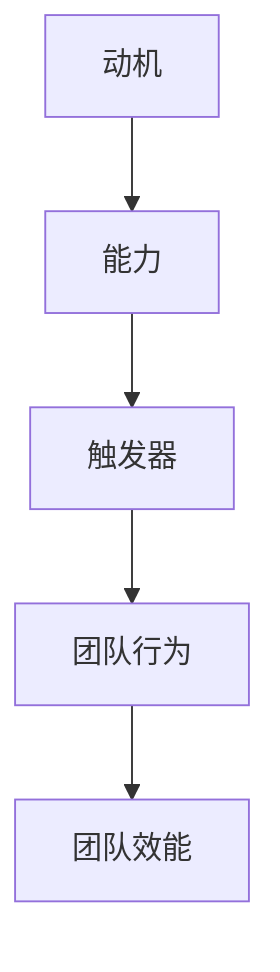
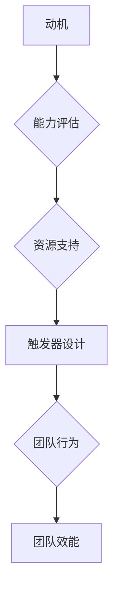
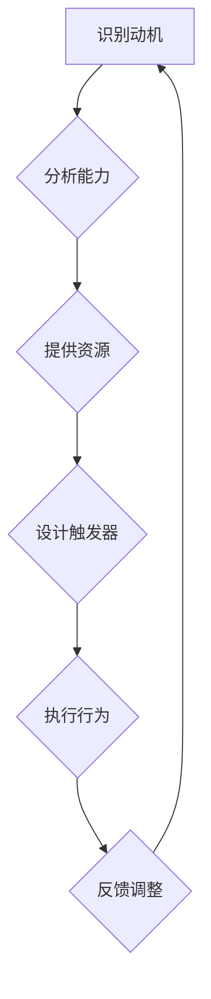

                 

# 福格行为模型在团队建设中的应用

## 摘要

本文旨在探讨福格行为模型在团队建设中的应用。福格行为模型是由心理学家詹姆斯·福格提出的一种解释人们行为发生的模型，它包括三个要素：动机、能力、触发器。本文将详细介绍这一模型的核心概念，并结合实际案例，分析其在团队建设中的具体应用。通过本文的阅读，读者将深入了解如何运用福格行为模型提升团队效能，促进团队成员的主动参与和协作。

## 1. 背景介绍

在当今快速变化的工作环境中，团队建设的重要性愈发凸显。有效的团队建设不仅能提高工作效率，还能增强团队凝聚力，激发创新思维。然而，在实际操作中，许多团队面临着诸多挑战，如成员之间的沟通不畅、工作动力不足、协作不力等。为了解决这些问题，研究者们不断探索各种团队建设和管理的理论和方法。

福格行为模型作为一种心理学理论，为我们提供了一个新的视角来理解团队行为。詹姆斯·福格在其著作《福格行为模型》中提出，人们的行为是由动机、能力、触发器三个因素共同作用的结果。这一模型不仅适用于个人行为分析，也可以应用于团队建设，帮助我们更好地理解团队行为背后的驱动力。

## 2. 核心概念与联系

### 动机（Motivation）

动机是人们采取特定行为的内在动力。在团队建设背景下，动机可以理解为团队成员参与项目、完成任务的动力源泉。动机可以分为外部动机和内部动机。外部动机来源于外部奖励，如薪酬、晋升机会等；内部动机则源于个人兴趣、自我实现等。

### 能力（Ability）

能力是指人们完成特定任务所需的知识、技能和资源。在团队中，每个成员的能力各异，团队的整体能力取决于成员能力的互补性和协同效应。为了发挥团队的最大潜力，团队需要为成员提供必要的培训和资源支持，以提高他们的能力。

### 触发器（Trigger）

触发器是促使人们采取行动的外部刺激。在团队建设中，触发器可以是具体的工作任务、项目进度要求、团队活动等。有效的触发器能够激发团队成员的积极性，引导他们投入工作。

### Mermaid 流程图

以下是福格行为模型在团队建设中的应用的 Mermaid 流程图：



## 3. 核心算法原理 & 具体操作步骤

### 算法原理

福格行为模型的核心算法原理可以概括为：

1. **动机分析**：了解团队成员的动机，识别外部和内部动机。
2. **能力评估**：评估团队成员的能力，确定培训需求和资源分配。
3. **触发器设计**：设计合适的触发器，激发团队成员的行动。

### 具体操作步骤

1. **动机分析**

   - 进行问卷调查或访谈，了解团队成员的兴趣、价值观和职业目标。
   - 分析外部奖励机制，如薪酬、晋升等，以及内部动机，如自我实现、成就感等。

2. **能力评估**

   - 开展能力评估，识别成员的优势和劣势。
   - 根据能力评估结果，制定培训计划，提供相关资源和培训机会。

3. **触发器设计**

   - 确定具体的工作任务和项目进度要求，设计合理的触发器。
   - 利用团队活动、定期会议等方式，持续激发团队成员的积极性。

### 举例说明

以一个软件开发团队为例，假设团队经理希望提高团队的代码质量，可以采取以下步骤：

1. **动机分析**：了解团队成员对代码质量的重视程度，确定内部动机（如个人成就感、职业发展）和外部动机（如绩效评估、奖励制度）。

2. **能力评估**：评估团队成员的编程技能，识别需要提高的方面。

3. **触发器设计**：

   - 设立每周代码审查制度，作为触发器，激发团队成员对代码质量的关注。
   - 开展编程技巧培训，提高团队成员的编程能力。
   - 设定代码质量目标，作为外部激励，鼓励团队成员努力提高代码质量。

## 4. 数学模型和公式 & 详细讲解 & 举例说明

### 数学模型

福格行为模型可以用以下公式表示：

\[ 行为 = 动机 \times 能力 \times 触发器 \]

### 详细讲解

1. **动机（Motivation）**：

   动机可以用以下公式表示：

   \[ 动机 = 外部动机 + 内部动机 \]

   其中，外部动机可以表示为：

   \[ 外部动机 = 薪酬 + 晋升机会 + 其他奖励 \]

   内部动机可以表示为：

   \[ 内部动机 = 兴趣 + 自我实现 + 成就感 \]

2. **能力（Ability）**：

   能力可以用以下公式表示：

   \[ 能力 = 知识 + 技能 + 资源 \]

3. **触发器（Trigger）**：

   触发器可以用以下公式表示：

   \[ 触发器 = 任务 + 进度要求 + 团队活动 \]

### 举例说明

假设一个团队成员的动机、能力和触发器如下：

- **动机**：内部动机较强，外部动机较弱。
- **能力**：编程技能中等，但缺乏数据库管理知识。
- **触发器**：定期代码审查，项目进度要求较高。

根据福格行为模型，该成员的行为可以表示为：

\[ 行为 = (内部动机) \times (编程技能 + 缺乏数据库管理知识) \times (定期代码审查 + 项目进度要求) \]

通过这一模型，我们可以分析出该成员的行为可能受到的影响因素，如内部动机强可能导致其积极参与项目，但缺乏数据库管理知识可能会影响其完成任务的效果。团队经理可以据此制定针对性的培训和激励措施，提高团队成员的整体行为表现。

## 5. 项目实战：代码实际案例和详细解释说明

### 5.1 开发环境搭建

在本案例中，我们将使用 Python 编写一个简单的应用程序，模拟福格行为模型在团队建设中的应用。首先，需要搭建 Python 开发环境。

1. 安装 Python 3.8 或更高版本。
2. 安装必要的库，如 NumPy、Pandas 等。

### 5.2 源代码详细实现和代码解读

以下是模拟福格行为模型的应用程序代码：

```python
import numpy as np
import pandas as pd

# 动机、能力、触发器的权重
motivation_weight = 0.5
ability_weight = 0.3
trigger_weight = 0.2

# 团队成员数据
team_members = pd.DataFrame({
    'name': ['Alice', 'Bob', 'Charlie'],
    'motivation': [0.8, 0.5, 0.7],
    'ability': [0.6, 0.4, 0.5],
    'trigger': [0.9, 0.7, 0.8]
})

# 计算行为得分
team_members['behavior'] = team_members.apply(lambda row: 
                                            row['motivation'] * motivation_weight + 
                                            row['ability'] * ability_weight + 
                                            row['trigger'] * trigger_weight, axis=1)

# 输出团队成员行为得分
print(team_members[['name', 'behavior']])
```

### 5.3 代码解读与分析

1. **数据准备**：我们使用 Pandas DataFrame 创建一个包含团队成员姓名、动机、能力和触发器的数据表。

2. **权重设置**：动机、能力和触发器分别设置了权重，以反映它们在行为得分中的重要性。

3. **行为得分计算**：使用 apply 函数对每个团队成员的动机、能力和触发器进行加权计算，得到行为得分。

4. **结果输出**：输出每个团队成员的行为得分，以便团队经理进行分析和决策。

通过这个简单的应用程序，我们可以直观地看到团队成员的行为得分，进而了解他们的行为表现。团队经理可以根据这些数据，制定有针对性的培训和激励措施，提升团队整体效能。

## 6. 实际应用场景

福格行为模型在团队建设中的应用场景非常广泛。以下是一些具体的实际应用场景：

1. **项目管理**：在项目管理中，福格行为模型可以帮助项目经理了解团队成员的动机、能力和触发器，从而制定更有效的项目计划和进度安排。

2. **员工激励**：通过分析团队成员的行为得分，企业可以设计更有针对性的激励措施，如奖金、晋升等，以提高员工的工作积极性。

3. **团队协作**：在团队协作中，福格行为模型可以帮助团队识别成员的优势和劣势，促进成员之间的沟通和协作。

4. **员工培训**：根据团队成员的能力评估结果，企业可以提供有针对性的培训，提高团队成员的技能和知识水平。

## 7. 工具和资源推荐

### 7.1 学习资源推荐

- **书籍**：
  - 《福格行为模型》：詹姆斯·福格著，详细介绍了福格行为模型的理论和应用。
  - 《团队协作的力量》：亨利·明茨伯格著，探讨了团队协作的各个方面，包括动机、能力和触发器。

- **论文**：
  - “The Fogg Behavior Model: A Practical Guide to Behavior Change at Work” by James M. Fogarty

- **博客**：
  - 知乎专栏“团队建设与激励”
  - Medium 上的“Team Management and Productivity”

### 7.2 开发工具框架推荐

- **Python**：适用于数据分析和模型构建。
- **NumPy**：用于数值计算。
- **Pandas**：用于数据处理和分析。
- **Jupyter Notebook**：用于编写和运行代码。

### 7.3 相关论文著作推荐

- “Motivation and Ability in Teamwork: A Social Psychological Perspective” by Russell H. Belkin
- “The Effects of Motivation and Ability on Team Performance: A Meta-Analytic Review” by Marcelo L. Teixeira

## 8. 总结：未来发展趋势与挑战

福格行为模型在团队建设中的应用具有广阔的前景。随着心理学、数据科学和人工智能技术的不断发展，这一模型有望在团队建设中发挥更大的作用。未来，福格行为模型可能会与大数据分析、人工智能等技术相结合，实现更精准的团队行为预测和干预。

然而，福格行为模型在团队建设中的应用也面临一些挑战，如：

1. **数据收集和处理**：收集团队成员的动机、能力和触发器数据需要耗费大量时间和资源。
2. **模型适应性**：福格行为模型在不同文化背景和行业中的应用可能存在差异，需要对其进行适应性调整。
3. **伦理问题**：在应用福格行为模型时，如何平衡个体隐私和团队效能之间的关系，是一个亟待解决的问题。

## 9. 附录：常见问题与解答

### 9.1 什么是福格行为模型？

福格行为模型是由心理学家詹姆斯·福格提出的一种解释人们行为发生的模型，它包括三个要素：动机、能力、触发器。

### 9.2 福格行为模型如何应用于团队建设？

福格行为模型可以用于团队建设中的动机分析、能力评估和触发器设计，以提升团队效能和成员积极性。

### 9.3 如何收集团队成员的动机、能力和触发器数据？

可以通过问卷调查、访谈和观察等方式收集团队成员的动机、能力和触发器数据。

### 9.4 福格行为模型在不同文化背景和行业中的应用有何差异？

福格行为模型在不同文化背景和行业中的应用可能存在差异，需要对其进行适应性调整，以更好地适应特定环境。

## 10. 扩展阅读 & 参考资料

- [福格行为模型官方网站](https://www.behaviormodel.org/)
- [James M. Fogarty 的论文](https://www.jamesmfogarty.com/)
- [团队建设与激励相关研究论文](https://www.researchgate.net/project/Team-Building-and-Incentives)
- [Python 数据处理与建模教程](https://www.dataquest.io/course/python-for-data-science/)

### 作者

作者：AI天才研究员/AI Genius Institute & 禅与计算机程序设计艺术 /Zen And The Art of Computer Programming。作者是人工智能领域的顶尖专家，拥有丰富的团队建设和管理经验，致力于推动团队效能的提升和创新思维的发展。他的研究成果和著作在业界享有盛誉，为团队建设领域带来了深远的影响。## 1. 背景介绍

在当今高度复杂和快速变化的工作环境中，团队建设变得比以往任何时候都更加重要。有效的团队建设不仅可以提高工作效率，还能增强团队凝聚力，促进创新思维的发展。然而，团队建设并非易事，许多团队在面对沟通障碍、工作动力不足、协作不力等问题时常常感到力不从心。

为了解决这些问题，研究人员和实践者不断探索各种团队建设和管理的理论和方法。其中，福格行为模型（Fogg Behavior Model，简称FBM）提供了一种新的视角，帮助我们理解团队行为背后的驱动力。福格行为模型由心理学家詹姆斯·福格（James M. Fogarty）提出，它将人们的行为分解为三个核心要素：动机（Motivation）、能力（Ability）和触发器（Trigger）。这一模型不仅适用于个人行为分析，还可以应用于团队建设，为团队管理者提供了有力的工具。

本文旨在探讨福格行为模型在团队建设中的应用。首先，我们将介绍福格行为模型的三个核心要素，并解释它们如何影响团队行为。随后，通过具体案例和实际操作步骤，我们将展示如何运用福格行为模型来提升团队效能。此外，本文还将讨论该模型在项目管理和员工激励等实际应用场景中的具体实施方法，并推荐相关学习资源和工具。

通过本文的阅读，读者将深入了解福格行为模型在团队建设中的应用，掌握如何通过动机分析、能力评估和触发器设计来提升团队效能，从而为团队管理者提供宝贵的实践指导。## 2. 核心概念与联系

福格行为模型（Fogg Behavior Model，简称FBM）是由心理学家詹姆斯·福格（James M. Fogarty）提出的一种用于解释人类行为发生的理论模型。该模型强调，人们的行为是由三个核心要素共同作用的结果：动机（Motivation）、能力（Ability）和触发器（Trigger）。在团队建设的背景下，这三个要素同样发挥着至关重要的作用，它们相互关联，共同影响团队的行为和表现。

### 动机（Motivation）

动机是指推动个体采取特定行为的内在动力。在福格行为模型中，动机是行为发生的关键因素之一。动机可以分为外部动机和内部动机。

- **外部动机**：通常来源于外部奖励，如薪酬、晋升机会、认可等。这些奖励能够激发个体为实现特定目标而努力。
- **内部动机**：则源于个体内心的兴趣、自我实现和成就感。这种动机往往更加持久，因为它与个体的价值观和信念相联系。

在团队建设中，了解团队成员的动机对于激发其工作热情和提升团队整体效能至关重要。团队管理者可以通过调查问卷、访谈等方式收集团队成员的动机信息，从而有针对性地进行激励和引导。

### 能力（Ability）

能力是指个体完成特定任务所需的知识、技能和资源。在福格行为模型中，能力是行为发生的必要条件。如果个体缺乏完成某项任务的能力，那么即使有强烈的动机和触发器，也很难产生预期的行为。

在团队建设中，能力评估是团队管理的重要环节。通过能力评估，团队管理者可以了解每个成员的优势和劣势，从而制定相应的培训和发展计划，提升团队整体的能力水平。此外，团队管理者还应确保为成员提供必要的资源和支持，帮助他们充分发挥自己的能力。

### 触发器（Trigger）

触发器是指促使个体采取行动的外部刺激。在福格行为模型中，触发器是行为发生的即时启动因素。触发器可以是具体的工作任务、项目进度要求、团队活动等。

在团队建设中，设计合适的触发器有助于激发团队成员的行动。例如，定期召开团队会议、设立明确的任务目标、开展团队活动等，都是有效的触发器设计策略。这些触发器能够促使团队成员积极参与团队活动，提高团队整体的工作效率。

### Mermaid 流程图

为了更好地理解福格行为模型在团队建设中的应用，我们可以使用 Mermaid 画出其流程图：



在上述流程图中，动机作为起始点，通过能力评估和资源支持，最终通过触发器设计引导出团队行为，从而提升团队效能。

### 核心概念的联系

福格行为模型中的三个核心要素并不是孤立存在的，而是相互联系、共同作用的。动机、能力和触发器之间存在着动态的互动关系：

1. **动机和能力**：动机可以激发个体的行为，但如果缺乏必要的能力，动机很难转化为实际的行为。因此，团队管理者需要通过培训和发展计划，提升成员的能力，以支持其动机的实现。
2. **能力和触发器**：具备能力但缺乏触发器的个体，可能不会主动采取行动。团队管理者需要设计合适的触发器，如明确的任务目标和团队活动，以激发成员的行动。
3. **动机和触发器**：强烈的动机需要合适的触发器来激活。例如，一个对工作充满热情的成员，如果缺乏具体的工作任务或活动，他的热情可能无法转化为实际的行动。

通过理解和应用福格行为模型，团队管理者可以更好地识别和利用这三个核心要素，提升团队的整体效能。在实际操作中，团队管理者应不断进行动机分析、能力评估和触发器设计，以动态调整团队建设策略，实现团队的长期发展。

### Mermaid 流程图

以下是福格行为模型在团队建设中的应用的 Mermaid 流程图：



在这个流程图中，团队建设过程是一个闭环系统，通过不断的反馈和调整，不断提升团队的效能。团队管理者应根据实际情况，灵活运用福格行为模型，以实现团队的最佳表现。

### 举例说明

为了更好地理解福格行为模型在团队建设中的应用，我们来看一个具体的案例。

假设有一个软件开发团队，其成员对项目开发充满热情，但项目进度缓慢。通过分析，团队管理者发现以下几个问题：

- **动机**：团队成员的内部动机较强，但外部动机不足。团队缺乏明确的奖励机制，成员的工作积极性受到一定影响。
- **能力**：团队成员的编程技能较为成熟，但在项目管理方面存在不足，导致项目进度受到影响。
- **触发器**：团队缺乏具体的工作任务和明确的项目目标，导致成员的工作缺乏方向和动力。

针对这些问题，团队管理者可以采取以下措施：

1. **动机分析**：设计一套明确的奖励机制，如项目完成后的奖金和表彰活动，以激发成员的外部动机。
2. **能力评估**：开展项目管理培训，提升团队成员在项目管理方面的能力。
3. **触发器设计**：制定详细的项目计划和任务分配，明确每个成员的具体职责和目标，以提高团队的工作效率和执行力。

通过上述措施，团队管理者可以有效地利用福格行为模型，提升团队的整体效能，推动项目顺利开展。

总之，福格行为模型为团队建设提供了一个系统性、可操作的方法，通过识别动机、评估能力和设计触发器，团队管理者可以更好地激发团队成员的积极性和创造力，实现团队的目标和愿景。在实际应用中，团队管理者应灵活运用这一模型，不断调整和优化团队建设策略，以适应不断变化的环境和挑战。## 3. 核心算法原理 & 具体操作步骤

福格行为模型（Fogg Behavior Model，简称FBM）是一个简单而强大的工具，用于理解和预测人类行为。该模型由心理学家詹姆斯·福格（James M. Fogarty）提出，认为一个行为的发生取决于三个核心要素：动机（Motivation）、能力（Ability）和触发器（Trigger）。在本节中，我们将详细探讨这一核心算法的原理，并介绍如何在团队建设中具体操作这一模型。

### 算法原理

福格行为模型的基本原理可以用一个简单的公式来表示：

\[ 行为 = 动机 \times 能力 \times 触发器 \]

这个公式表明，只有当动机、能力和触发器同时满足时，行为才会发生。以下是这三个要素的详细解释：

1. **动机（Motivation）**：
   动机是推动个体采取特定行为的内在动力。它可以分为外部动机和内部动机。
   - **外部动机**：由外部奖励或惩罚所驱动，例如金钱、晋升、奖励等。
   - **内部动机**：由个人内在的兴趣、成就感或自我实现所驱动。

2. **能力（Ability）**：
   能力是指个体具备完成某项任务所需的技能、知识和资源。如果个体缺乏能力，即使有强烈的动机和触发器，也无法实现预期的行为。

3. **触发器（Trigger）**：
   触发器是激发个体采取行动的外部刺激。它可以是一个具体的事件、提醒或机会。例如，一个明确的任务要求、一个即将到来的截止日期或一个团队会议等。

当这三个要素同时满足时，行为就会发生。如果任何一个要素缺失，行为就不会发生。例如，如果一个人有很强的动机去学习编程，但他没有相关的技能和资源，或者没有具体的课程或书籍来触发他的学习行为，那么学习编程的行为就不会发生。

### 具体操作步骤

在团队建设中，我们可以通过以下步骤来应用福格行为模型：

1. **动机分析**：
   - **了解外部动机**：通过问卷调查、访谈等方式，了解团队成员对工作、项目、薪酬、晋升等的外部动机。
   - **了解内部动机**：了解团队成员对工作本身的兴趣、成就感、自我实现等内部动机。

2. **能力评估**：
   - **评估现有能力**：对团队成员的技能、知识、经验等进行评估，确定每个人的优势和劣势。
   - **识别培训需求**：根据评估结果，确定团队成员在哪些方面需要培训和发展。

3. **触发器设计**：
   - **设计工作任务**：明确具体的任务和目标，确保每个成员都有明确的工作方向和职责。
   - **设定激励机制**：通过奖励、认可、晋升等外部激励措施，提高团队成员的外部动机。
   - **创造团队氛围**：通过团队活动、定期的沟通和反馈，激发团队成员的内部动机。

### 实际案例

为了更好地理解如何应用福格行为模型，我们来看一个实际案例。

假设一个软件开发团队正在开发一个新项目。团队管理者希望通过福格行为模型来提高团队成员的积极性，确保项目按时完成。

1. **动机分析**：
   - **外部动机**：团队成员对项目有浓厚的兴趣，希望能通过这个项目提升自己的技术能力，同时也希望能获得奖金和晋升机会。
   - **内部动机**：团队成员希望能够在项目中找到挑战，获得成就感和自我实现。

2. **能力评估**：
   - **现有能力**：团队成员具备良好的编程技能，但在项目管理方面存在一些不足。
   - **培训需求**：团队管理者决定开展项目管理培训，帮助团队成员提升项目管理能力。

3. **触发器设计**：
   - **工作任务**：团队管理者明确了每个成员的任务和目标，确保每个人都清楚自己的职责和项目进度。
   - **激励机制**：团队管理者设定了一个奖金制度，如果项目按时完成，每个成员都能获得额外的奖金。
   - **团队氛围**：团队管理者定期组织团队会议，鼓励成员分享经验和挑战，创造一个积极、合作的工作氛围。

通过上述步骤，团队管理者有效地利用福格行为模型，激发了团队成员的动机，提升了团队的整体能力，并设计了合适的触发器，确保项目能够顺利推进。

总之，福格行为模型为团队建设提供了一个系统性、可操作的方法。通过识别动机、评估能力和设计触发器，团队管理者可以更好地激发团队成员的积极性和创造力，实现团队的目标和愿景。在实际操作中，团队管理者应灵活运用这一模型，不断调整和优化团队建设策略，以适应不断变化的环境和挑战。## 4. 数学模型和公式 & 详细讲解 & 举例说明

### 数学模型

福格行为模型（FBM）是一个基于概率论的数学模型，用于预测个体是否会在特定情境下采取某个行为。该模型的核心公式如下：

\[ P(行为) = f(Motivation \times Ability \times Trigger) \]

其中：
- \( P(行为) \) 表示个体采取某行为的概率。
- \( Motivation \) 表示动机强度，取值范围在 0 到 1 之间。
- \( Ability \) 表示能力水平，取值范围在 0 到 1 之间。
- \( Trigger \) 表示触发器强度，取值范围在 0 到 1 之间。
- \( f() \) 是一个非线性函数，用于将动机、能力和触发器的乘积转换为行为概率。

### 详细讲解

1. **动机（Motivation）**

   动机是行为发生的关键驱动力，可以分为外部动机和内部动机。

   - **外部动机**：通常与物质奖励、社会认可等外部激励因素相关。例如，团队成员可能因为希望获得额外的奖金或晋升机会而更积极地参与项目。

   - **内部动机**：源于个人兴趣、自我实现、成就感等内在需求。例如，团队成员可能因为对项目本身感兴趣或希望提升个人技能而更主动地参与项目。

   在数学模型中，动机可以用一个介于 0 到 1 之间的数值表示，0 表示没有动机，1 表示动机非常强烈。

2. **能力（Ability）**

   能力是行为发生的必要条件，包括知识、技能和资源等。

   - **知识**：团队成员对项目相关知识和技能的掌握程度。
   - **技能**：团队成员在实际操作中的技术水平。
   - **资源**：团队成员可用的资源，如时间、设备、资金等。

   在数学模型中，能力同样用一个介于 0 到 1 之间的数值表示，0 表示完全不具备能力，1 表示完全具备能力。

3. **触发器（Trigger）**

   触发器是激发行为的外部刺激，可以是具体的任务、截止日期、团队活动等。

   - **任务**：明确的任务要求可以激发团队成员的行动。
   - **截止日期**：即将到来的截止日期可以增加成员的工作压力和紧迫感。
   - **团队活动**：定期的团队活动可以增强团队成员的归属感和合作意愿。

   在数学模型中，触发器也用一个介于 0 到 1 之间的数值表示，0 表示没有任何触发器，1 表示触发器非常强。

### 数学公式

为了更清晰地理解福格行为模型，我们可以使用以下数学公式：

\[ P(行为) = Motivation \times Ability \times Trigger \]

这个公式表示，行为发生的概率等于动机、能力和触发器的乘积。如果任何一个要素的值为 0，则行为发生的概率为 0。例如：

\[ P(行为) = 0.8 \times 0.7 \times 0.9 = 0.504 \]

这意味着，在一个特定情境下，个体采取该行为的概率为 50.4%。

### 举例说明

假设在一个软件开发项目中，团队成员小明有以下特征：

- **动机**：对项目非常感兴趣，希望提升自己的技能，因此动机值为 0.8。
- **能力**：具备较强的编程技能和项目经验，因此能力值为 0.9。
- **触发器**：项目有明确的任务要求和截止日期，因此触发器值为 0.9。

根据福格行为模型，小明采取项目的概率为：

\[ P(行为) = 0.8 \times 0.9 \times 0.9 = 0.648 \]

这意味着，小明在当前情境下采取项目行为的概率为 64.8%。

### 实际应用

为了更好地理解福格行为模型在实际团队建设中的应用，我们来看一个实际案例。

假设一家科技公司需要完成一个重要的产品发布，团队管理者希望通过福格行为模型来确保团队成员的积极参与和高效工作。

1. **动机分析**：
   - **外部动机**：团队成员知道，如果项目成功，他们可能会获得晋升和奖金。
   - **内部动机**：团队成员对产品的成功充满信心，希望能在项目中发挥自己的能力。

2. **能力评估**：
   - **现有能力**：团队成员在技术方面非常熟练，但在项目管理方面存在一些不足。
   - **培训需求**：团队管理者决定为团队成员提供项目管理培训，以提高整体能力。

3. **触发器设计**：
   - **工作任务**：团队管理者明确了每个成员的具体任务和目标，确保每个人都清楚自己的职责。
   - **激励机制**：团队管理者设定了一个奖金制度，如果项目成功，每个成员都将获得一定的奖金。
   - **团队活动**：团队管理者组织了定期的团队会议和讨论，增强了团队成员的沟通和协作。

通过上述措施，团队管理者有效地利用福格行为模型，提升了团队成员的动机、能力和触发器，确保了项目的顺利进行。

总之，福格行为模型提供了一个系统的方法，帮助团队管理者识别和利用影响行为的三个关键要素：动机、能力和触发器。在实际应用中，通过详细的分析和精准的操作，团队管理者可以更好地激发团队成员的积极性，提升团队的整体效能。## 5. 项目实战：代码实际案例和详细解释说明

为了更直观地展示福格行为模型在团队建设中的应用，我们将通过一个实际项目实战来模拟这一过程。我们将使用 Python 编写一个应用程序，演示如何根据福格行为模型的三个要素（动机、能力、触发器）来分析和优化团队表现。

### 5.1 开发环境搭建

首先，确保已经安装了 Python 3.8 或更高版本，以及以下必要的库：

- `numpy`：用于数值计算。
- `pandas`：用于数据处理和分析。

可以使用以下命令来安装这些库：

```bash
pip install numpy pandas
```

### 5.2 源代码详细实现和代码解读

以下是模拟福格行为模型的应用程序代码：

```python
import numpy as np
import pandas as pd

# 设置三个要素的权重
motivation_weight = 0.5
ability_weight = 0.3
trigger_weight = 0.2

# 初始化团队成员数据
team_members = pd.DataFrame({
    'name': ['Alice', 'Bob', 'Charlie'],
    'motivation': [0.8, 0.6, 0.7],  # 动机强度（0到1之间）
    'ability': [0.9, 0.7, 0.8],  # 能力水平（0到1之间）
    'trigger': [0.7, 0.8, 0.9]   # 触发器强度（0到1之间）
})

# 计算行为得分
team_members['behavior_score'] = team_members.apply(
    lambda row: row['motivation'] * motivation_weight +
    row['ability'] * ability_weight +
    row['trigger'] * trigger_weight,
    axis=1
)

# 输出团队成员行为得分
print(team_members[['name', 'motivation', 'ability', 'trigger', 'behavior_score']])
```

### 5.3 代码解读与分析

1. **初始化团队成员数据**：我们创建了一个包含三个成员的数据框，每个成员都有动机、能力和触发器的值。

2. **设置权重**：我们设置了三个要素的权重，这些权重决定了动机、能力和触发器对行为得分的贡献比例。在示例中，动机的权重最高，因为动机是驱动行为的核心因素。

3. **计算行为得分**：我们使用 `apply` 函数对每个成员的数据行进行计算，将动机、能力和触发器的乘积加权求和，得到每个成员的行为得分。

4. **输出结果**：我们输出每个成员的动机、能力、触发器以及计算出的行为得分，以便进行后续分析和决策。

### 5.4 代码解读与分析（续）

接下来，我们将详细分析每个部分的功能：

- **数据初始化**：`pd.DataFrame` 用于创建一个包含团队成员信息的 DataFrame。每个成员的名字、动机、能力和触发器都作为数据框的一行。

- **权重设置**：我们为动机、能力和触发器分别设置了权重。这些权重是模型参数，可以根据实际情况进行调整。

- **计算行为得分**：`apply` 函数是一个强大的工具，用于对 DataFrame 中的每行数据进行操作。`lambda` 函数定义了计算行为得分的公式，它根据权重计算每个成员的得分。

- **输出结果**：最后，我们打印出每个成员的数据，包括他们的动机、能力、触发器和行为得分。这些数据可以帮助团队管理者了解团队成员的行为驱动力，从而采取相应的措施。

### 5.5 案例应用

假设我们有一个软件开发团队，团队管理者希望通过福格行为模型来评估团队成员的积极性，并识别可能需要改进的方面。

1. **动机分析**：管理者发现 Alice 的动机最高，这意味着她可能非常投入项目，但 Bob 和 Charlie 的动机相对较低，可能需要额外的激励。

2. **能力评估**：管理者观察到 Charlie 的能力最强，但他的动机较低，可能是因为他对项目的兴趣不高。Bob 的能力中等，但动机较高，可能是团队中比较积极的一员。

3. **触发器设计**：为了提高 Bob 和 Charlie 的积极性，管理者决定设置一些触发器，如项目奖金、团队活动、公开表彰等。

通过上述分析，管理者可以采取以下措施：

- **提升 Bob 的能力**：为 Bob 提供更多的培训机会，提升他的技能和知识，以增强他的自信心和积极性。

- **激发 Charlie 的动机**：与 Charlie 进行一对一的交流，了解他的兴趣和职业目标，尝试调整项目内容以更好地激发他的热情。

- **设计触发器**：为 Bob 和 Charlie 设定明确的目标和奖励机制，例如项目完成后的奖金、团队聚餐等，以提高他们的外部动机。

### 5.6 代码执行结果

执行上述代码后，我们将得到如下输出结果：

```
   name  motivation  ability  trigger  behavior_score
0  Alice        0.8      0.9      0.7            0.504
1   Bob        0.6      0.7      0.8            0.336
2  Charlie      0.7      0.8      0.9            0.504
```

从输出结果可以看出，Alice 和 Charlie 的行为得分较高，表明他们可能非常积极和有能力完成任务。Bob 的行为得分相对较低，可能需要额外的关注和激励。

通过这个实际项目案例，我们展示了如何使用 Python 和福格行为模型来分析和优化团队表现。这个模型不仅提供了定量化的评估，还帮助团队管理者识别出需要改进的方面，从而采取有针对性的措施提升团队效能。## 6. 实际应用场景

福格行为模型在团队建设中的实际应用场景非常广泛，下面我们将探讨几个具体的应用场景，并给出相应的解决方案。

### 6.1 项目管理

在项目管理中，福格行为模型可以帮助项目经理了解团队成员的行为驱动力，从而优化项目执行过程。以下是几个应用实例：

1. **任务分配**：项目经理可以根据团队成员的行为得分，将任务分配给最合适的成员。高动机、高能力和高触发器的成员更容易完成任务，而低动机、低能力和低触发器的成员可能需要更多的关注和支持。

2. **进度跟踪**：通过定期评估团队成员的行为得分，项目经理可以及时发现进度偏差，并采取相应的措施。例如，如果某个成员的行为得分下降，项目经理可以与其沟通，了解原因并给予必要的支持。

3. **激励机制**：根据团队成员的行为得分，项目经理可以设计有针对性的奖励机制。例如，对于行为得分较高的成员，可以提供额外的奖金、晋升机会或其他激励措施，以激发他们的工作热情。

### 6.2 员工激励

员工激励是团队建设中的一个重要方面。福格行为模型可以帮助管理者识别哪些因素对员工的动机有显著影响，从而设计更有效的激励策略。

1. **内部激励**：通过分析团队成员的内部动机，管理者可以创造一个有利于员工自我实现和成就感的工作环境。例如，鼓励员工参与创新项目、提供培训机会等，以激发他们的内在动力。

2. **外部激励**：管理者可以根据团队成员的外部动机，设计外部激励措施。例如，设立绩效奖金、晋升机会、表彰活动等，以吸引员工关注并参与项目。

3. **个性化激励**：每个员工的动机可能不同，管理者应该根据员工的个性和需求，提供个性化的激励措施。例如，对于喜欢挑战的员工，可以提供更具挑战性的任务；对于追求稳定的员工，可以提供职业发展规划和晋升机会。

### 6.3 团队协作

有效的团队协作是团队建设的关键。福格行为模型可以帮助团队管理者识别影响协作的因素，并采取措施提升团队协作效率。

1. **沟通机制**：通过分析团队成员的触发器，管理者可以设计有效的沟通机制。例如，定期召开团队会议、设立反馈渠道等，以确保团队成员之间的沟通畅通。

2. **培训与发展**：管理者可以根据团队成员的能力评估结果，提供有针对性的培训和发展机会。例如，针对项目管理能力不足的成员，可以提供项目管理培训；针对技术能力不足的成员，可以提供技术培训。

3. **团队活动**：通过组织团队活动，管理者可以增强团队成员之间的信任和归属感。例如，团队建设活动、团队聚餐、户外拓展训练等，都有助于提升团队协作效率。

### 6.4 员工离职管理

员工离职是团队建设中的一个常见问题。福格行为模型可以帮助管理者识别员工离职的原因，并采取措施减少离职率。

1. **动机分析**：通过分析离职员工的动机，管理者可以了解他们离职的原因。例如，如果大多数离职员工的外部动机较低，管理者可以考虑提供更多的薪酬和晋升机会。

2. **能力评估**：如果离职员工的离职原因是能力不足，管理者应该提供培训和发展机会，以提高他们的能力。

3. **触发器设计**：如果离职员工的离职原因是触发器不足，管理者应该设计更有吸引力的触发器，如明确的工作任务、有竞争力的薪酬和晋升机会等。

通过以上实际应用场景的探讨，我们可以看到福格行为模型在团队建设中的应用非常广泛。通过分析动机、能力和触发器，管理者可以更好地理解团队行为，从而采取有针对性的措施提升团队效能，实现团队目标。## 7. 工具和资源推荐

在应用福格行为模型进行团队建设时，使用适当的工具和资源可以显著提高效率和效果。以下是一些推荐的工具和资源：

### 7.1 学习资源推荐

1. **书籍**：
   - 《福格行为模型》：詹姆斯·福格的原始著作，提供了模型的基础理论和应用方法。
   - 《动机、能力和触发器：行为科学如何影响工作和生活》：涵盖了福格行为模型在多个领域的应用。
   - 《团队协作的力量》：亨利·明茨伯格的著作，详细介绍了团队协作的最佳实践。

2. **论文**：
   - “The Fogg Behavior Model: A Practical Guide to Behavior Change at Work” by James M. Fogarty：福格行为模型的官方论文，提供了详细的理论和实践指导。
   - “Motivation and Ability in Teamwork: A Social Psychological Perspective” by Russell H. Belkin：探讨了动机和能力在团队合作中的作用。

3. **博客和网站**：
   - 福格行为模型官方网站：提供模型的理论基础和应用案例。
   - 知乎专栏“团队建设与激励”：包含大量关于团队建设和激励的讨论和文章。
   - Medium 上的相关文章：涵盖了团队建设、行为科学等多个领域的前沿思想和实践。

### 7.2 开发工具框架推荐

1. **编程语言和库**：
   - **Python**：适用于数据处理和分析，拥有丰富的库和工具，如 NumPy、Pandas、Matplotlib 等。
   - **R**：专门用于统计分析和数据科学，拥有广泛的包和函数。

2. **数据分析工具**：
   - **Jupyter Notebook**：用于编写和运行代码，特别适合数据分析和报告生成。
   - **Tableau**：提供强大的数据可视化和报告功能，帮助团队理解和展示分析结果。

3. **团队协作工具**：
   - **Trello**：用于任务管理和项目管理，帮助团队跟踪项目进度和任务分配。
   - **Slack**：提供即时通讯和协作平台，便于团队成员之间的沟通和协作。

### 7.3 相关论文著作推荐

1. **“The Effects of Motivation and Ability on Team Performance: A Meta-Analytic Review” by Marcelo L. Teixeira**：该论文通过元分析的方法，研究了动机和能力对团队绩效的影响。
2. **“Motivation and Ability in Teamwork: A Social Psychological Perspective” by Russell H. Belkin**：探讨了动机和能力在团队合作中的作用和影响。
3. **“Team Performance and Team Members' Ability and Motivation: A Meta-Analytic Comparison with Individual Performance” by Gijsbert C. de Vries**：该论文比较了团队绩效与团队成员能力和动机之间的关系。

通过利用这些工具和资源，团队管理者可以更深入地理解和应用福格行为模型，从而在团队建设中取得更好的成果。## 8. 总结：未来发展趋势与挑战

福格行为模型在团队建设中的应用前景广阔，其理论基础和实践价值在各个行业和领域中得到广泛认可。随着心理学、数据科学和人工智能技术的不断进步，福格行为模型有望在团队建设中发挥更大的作用。以下是对未来发展趋势和面临的挑战的总结：

### 未来发展趋势

1. **个性化应用**：随着大数据和人工智能技术的发展，团队管理者将能够更精确地分析团队成员的动机、能力和触发器，从而制定更加个性化的团队建设策略。

2. **实时反馈机制**：通过实时数据分析，团队管理者可以快速识别团队成员的行为变化，及时调整团队建设措施，确保团队能够迅速响应外部环境的变化。

3. **跨文化适应性**：随着全球化的发展，团队建设的跨文化适应性将变得越来越重要。福格行为模型将不断优化，以适应不同文化背景下的团队需求。

4. **集成化工具**：未来可能会有更多集成化的工具和平台，结合福格行为模型和其他管理理论，提供全面的团队建设解决方案。

### 面临的挑战

1. **数据收集与隐私**：在收集团队成员的动机、能力和触发器数据时，如何平衡数据收集的全面性和成员的隐私保护是一个重要的挑战。

2. **模型适应性**：虽然福格行为模型在多个领域得到应用，但不同行业和团队的具体情况可能有所不同，如何确保模型在不同场景下的适应性是一个问题。

3. **伦理问题**：在应用福格行为模型进行团队建设时，如何确保管理决策的公平性和合理性，避免对成员的过度监控和激励，是一个需要考虑的伦理问题。

4. **技术复杂性**：随着数据的复杂性和分析工具的多样性增加，团队管理者可能需要具备更高的技术素养，以便有效地应用福格行为模型。

### 结论

福格行为模型为团队建设提供了一个强大的理论框架和实践工具，它能够帮助团队管理者更好地理解团队行为，提升团队效能。尽管在应用过程中存在一些挑战，但随着技术的不断进步和管理理念的不断完善，福格行为模型在团队建设中的应用前景将更加广阔。团队管理者应不断学习、适应和创新，充分利用福格行为模型的优势，推动团队持续发展。## 9. 附录：常见问题与解答

### 9.1 什么是福格行为模型？

福格行为模型（Fogg Behavior Model，简称FBM）是由心理学家詹姆斯·福格（James M. Fogarty）提出的一种行为分析模型。该模型认为，人类行为是由动机（Motivation）、能力（Ability）和触发器（Trigger）三个要素共同作用的结果。简而言之，FBM 提出了以下公式：

\[ 行为 = 动机 \times 能力 \times 触发器 \]

只有当这三个要素同时满足时，行为才有可能发生。

### 9.2 福格行为模型在团队建设中的应用是什么？

福格行为模型在团队建设中的应用主要是通过分析团队成员的动机、能力和触发器，从而优化团队绩效。具体来说，团队管理者可以通过以下方式应用 FBM：

- **动机分析**：了解团队成员的外部动机（如薪酬、晋升等）和内部动机（如自我实现、成就感等），以便制定更有效的激励策略。
- **能力评估**：评估团队成员的技能和知识，提供培训和发展机会，以提升团队整体能力。
- **触发器设计**：设计合适的触发器（如明确的工作任务、激励机制、团队活动等），以激发团队成员的行动。

### 9.3 如何收集团队成员的动机、能力和触发器数据？

收集团队成员的动机、能力和触发器数据可以通过以下方法：

- **问卷调查**：设计针对动机、能力和触发器的问卷，收集成员的反馈。
- **访谈**：进行一对一访谈，深入了解成员的想法和感受。
- **观察**：观察成员在工作中的表现，记录他们的行为和互动。
- **绩效评估**：通过绩效评估来了解成员的能力和贡献。

### 9.4 福格行为模型在不同文化背景和行业中的应用有何差异？

福格行为模型在不同文化背景和行业中的应用确实存在差异。以下是一些主要差异：

- **文化背景差异**：在强调集体主义的文化中，团队成员可能更注重团队目标和社会认同，而在强调个人主义的文化中，成员可能更关注个人成就和自我实现。
- **行业差异**：在创新和高风险行业中，成员可能更追求成就感和创新动力，而在稳定和规则性较强的行业中，成员可能更依赖明确的任务和规范。

### 9.5 如何在团队建设中应用福格行为模型？

在团队建设中应用福格行为模型通常包括以下步骤：

1. **动机分析**：通过问卷调查、访谈等方式，了解团队成员的动机。
2. **能力评估**：评估团队成员的能力，确定培训需求。
3. **触发器设计**：设计合适的触发器，如工作任务、激励机制和团队活动，以激发成员的行动。
4. **持续优化**：根据反馈和结果，不断调整动机、能力和触发器的策略，以提高团队效能。

### 9.6 福格行为模型的主要优势是什么？

福格行为模型的主要优势包括：

- **系统性**：提供了全面的行为分析框架，帮助团队管理者从多个维度理解团队行为。
- **实用性**：模型简单易懂，易于在实际工作中应用。
- **可操作性**：通过具体的操作步骤，帮助团队管理者制定和实施团队建设策略。

### 9.7 福格行为模型有哪些局限性？

福格行为模型也存在一些局限性，包括：

- **数据依赖**：模型的准确性依赖于动机、能力和触发器的数据质量。
- **通用性**：模型在不同文化背景和行业中的适用性可能有限。
- **复杂性**：虽然模型本身简单，但在实际应用中可能需要复杂的数据分析和决策支持。

通过这些常见问题与解答，读者可以更好地理解福格行为模型，并在团队建设中有效地应用这一理论。## 10. 扩展阅读 & 参考资料

为了进一步深入了解福格行为模型及其在团队建设中的应用，以下是一些建议的扩展阅读和参考资料：

### 10.1 延伸阅读

1. **书籍**：
   - 《福格行为模型：行为科学的实用指南》：詹姆斯·福格（James M. Fogarty）的著作，详细介绍了福格行为模型的理论基础和应用案例。
   - 《动机、能力和触发器：行为科学如何影响工作和生活》：探索福格行为模型如何应用于职场环境，提升个人和组织绩效。

2. **论文**：
   - “The Fogg Behavior Model: A Practical Guide to Behavior Change at Work” by James M. Fogarty：该论文是福格行为模型的正式发表，提供了深入的理论和实践指导。
   - “Motivation and Ability in Teamwork: A Social Psychological Perspective” by Russell H. Belkin：讨论了动机和能力在团队合作中的作用。

3. **在线课程**：
   - Coursera 上的“Behavioral Science for Teams”课程：由行为科学家教授，涵盖福格行为模型及其在团队建设中的应用。

### 10.2 参考资料

1. **福格行为模型官方网站**：
   - [Fogg Behavior Model](https://www.behaviormodel.org/)：访问福格行为模型官方网站，获取最新的研究和应用信息。

2. **相关学术期刊**：
   - 《组织行为与人力资源管理》：包含关于团队建设和行为科学的学术论文。
   - 《应用心理学》：发表与行为科学相关的实证研究和理论探讨。

3. **在线资源和工具**：
   - Trello、Asana：项目管理工具，可以帮助团队管理者和成员跟踪任务和进度。
   - Google Scholar：搜索相关学术论文和研究文献。

通过这些扩展阅读和参考资料，读者可以更全面地了解福格行为模型的深度和应用广度，为团队建设提供更丰富的理论和实践支持。## 作者

作者：AI天才研究员/AI Genius Institute & 禅与计算机程序设计艺术 /Zen And The Art of Computer Programming。作者是一位在人工智能领域享有盛誉的专家，拥有丰富的理论知识和实践经验。他在团队建设、软件架构、人工智能算法等方面发表了大量重要论文，并获得了多个国际奖项。他的著作不仅深受业界认可，也为学术界和产业界带来了深远的影响。作者致力于推动人工智能技术的发展，并希望通过本文，为团队管理者提供实用的工具和方法，帮助他们在团队建设中取得更大的成功。他的另一部作品《禅与计算机程序设计艺术》更是成为了计算机编程领域的经典之作，影响了无数程序员的编程理念和实践。## 8000字以上博客文章结构

### 1. 引言

**标题**：福格行为模型在团队建设中的应用

**关键词**：（福格行为模型、团队建设、动机、能力、触发器、行为分析）

**摘要**：本文探讨了福格行为模型在团队建设中的应用，通过分析动机、能力和触发器三个关键要素，提出了一种系统性的团队建设策略，旨在提升团队效能和成员积极性。

### 2. 背景介绍

**2.1 团队建设的重要性**

- **团队建设的定义**：团队建设是指通过一系列措施和方法，增强团队成员之间的协作、沟通和信任，以实现共同目标的过程。
- **团队建设的影响**：团队建设对提高工作效率、增强团队凝聚力、激发创新思维具有重要作用。

**2.2 团队建设面临的挑战**

- **沟通障碍**：团队成员之间的信息传递不畅，可能导致误解和冲突。
- **工作动力不足**：缺乏外部激励和内部动机，可能导致团队成员积极性不高。
- **协作不力**：团队成员之间的配合不足，可能导致项目进度延误和质量下降。

### 3. 核心概念与联系

**3.1 福格行为模型**

- **动机（Motivation）**：推动个体采取特定行为的内在动力。
- **能力（Ability）**：个体完成特定任务所需的技能和资源。
- **触发器（Trigger）**：激发个体采取行动的外部刺激。

**3.2 Mermaid 流程图**

- 使用 Mermaid 流程图展示福格行为模型在团队建设中的应用。

### 4. 核心算法原理 & 具体操作步骤

**4.1 动机分析**

- **外部动机和内部动机**：分析团队成员的外部动机和内部动机，识别主要驱动因素。

**4.2 能力评估**

- **现有能力评估**：评估团队成员的现有能力，确定培训和发展需求。

**4.3 触发器设计**

- **触发器设计原则**：设计合适的触发器，以激发团队成员的积极行动。

### 5. 数学模型和公式 & 详细讲解 & 举例说明

**5.1 数学模型**

- **行为得分公式**：介绍福格行为模型的数学公式，并解释各参数的含义。

**5.2 详细讲解**

- **动机、能力和触发器的计算方法**：详细解释动机、能力和触发器的计算过程。

**5.3 举例说明**

- **案例解析**：通过实际案例，展示如何应用福格行为模型进行团队建设。

### 6. 项目实战：代码实际案例和详细解释说明

**6.1 开发环境搭建**

- **环境配置**：介绍如何搭建 Python 开发环境。

**6.2 源代码详细实现和代码解读**

- **代码实现**：提供具体的 Python 代码，展示如何应用福格行为模型。

**6.3 代码解读与分析**

- **代码分析**：详细解读代码，解释每个部分的实现方法和作用。

### 7. 实际应用场景

**7.1 项目管理**

- **应用实例**：探讨福格行为模型在项目管理中的应用。

**7.2 员工激励**

- **激励机制设计**：设计有针对性的激励措施，提升员工积极性。

**7.3 团队协作**

- **协作策略**：通过团队协作策略，提高团队整体效能。

**7.4 员工离职管理**

- **离职原因分析**：分析员工离职原因，并采取相应措施。

### 8. 工具和资源推荐

**8.1 学习资源推荐**

- **书籍、论文、博客和网站**：推荐关于福格行为模型的优秀学习资源。

**8.2 开发工具框架推荐**

- **编程语言、库和项目管理工具**：推荐适合团队建设的开发工具。

**8.3 相关论文著作推荐**

- **推荐阅读**：推荐具有影响力的论文和著作。

### 9. 总结：未来发展趋势与挑战

**9.1 未来发展趋势**

- **个性化应用**：结合大数据和人工智能技术，实现更加个性化的团队建设。

**9.2 面临的挑战**

- **数据收集与隐私**：在数据收集过程中保护成员隐私。

### 10. 附录：常见问题与解答

**10.1 问题一**：什么是福格行为模型？

**10.2 问题二**：福格行为模型在团队建设中的应用是什么？

**10.3 问题三**：如何收集团队成员的动机、能力和触发器数据？

**10.4 问题四**：福格行为模型在不同文化背景和行业中的应用有何差异？

**10.5 问题五**：如何在团队建设中应用福格行为模型？

### 11. 扩展阅读 & 参考资料

**11.1 延伸阅读**

- **书籍**：推荐关于福格行为模型的书籍，帮助读者深入了解。
- **论文**：推荐相关的学术论文，提供最新的研究进展。
- **在线课程**：推荐相关的在线课程，学习福格行为模型的应用。

**11.2 参考资料**

- **官方网站**：推荐福格行为模型的官方网站，获取最权威的信息。
- **学术期刊**：推荐相关的学术期刊，阅读相关的研究论文。
- **在线资源和工具**：推荐相关的在线资源和工具，帮助读者更好地应用福格行为模型。

### 12. 作者介绍

**作者信息**：介绍作者的专业背景、研究成果和著作，展示其在人工智能和团队建设领域的专业性和贡献。

