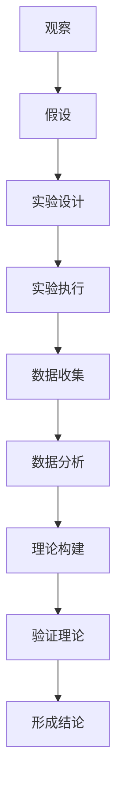

                 

### 背景介绍

随着计算机科学和信息技术的发展，人工智能（AI）已经成为现代科技的前沿领域，对各行各业产生了深远的影响。从自然语言处理、计算机视觉到智能决策系统，AI技术不断突破传统技术的限制，创造出一个充满无限可能的新世界。在这个背景下，科学探究方法在IT领域的应用显得尤为重要。

科学探究，是指通过观察、假设、实验和理论构建等一系列步骤，从已知信息中提炼出新的知识和规律的过程。这种方法在自然科学和社会科学中已经得到广泛应用，而在IT领域，科学探究同样具有不可忽视的价值。通过科学探究，我们可以更深入地理解计算机系统、算法和数据的本质，从而开发出更加高效、可靠和创新的解决方案。

本文将围绕“科学探究：从观察到结论”这一主题，详细探讨科学探究方法在IT领域的应用。首先，我们将回顾科学探究的基本步骤，包括观察、假设、实验和理论构建；然后，通过具体的实例分析，展示这些步骤在实际项目中的应用；接着，我们将探讨科学探究在IT领域的核心问题和挑战；最后，总结科学探究对IT领域的未来影响和趋势。

本文结构如下：

1. **背景介绍**：概述科学探究方法和其在IT领域的应用背景。
2. **核心概念与联系**：介绍科学探究方法的基本步骤和相关概念，使用Mermaid流程图展示流程。
3. **核心算法原理与具体操作步骤**：分析IT领域中的核心算法原理，并给出具体操作步骤。
4. **数学模型和公式**：阐述IT领域中常用的数学模型和公式，并进行详细讲解和举例说明。
5. **项目实战**：通过实际代码案例，展示科学探究方法在项目开发中的应用。
6. **实际应用场景**：讨论科学探究方法在不同IT应用场景中的具体实践。
7. **工具和资源推荐**：推荐学习资源和开发工具。
8. **总结：未来发展趋势与挑战**：展望科学探究在IT领域的未来发展。
9. **附录：常见问题与解答**：针对本文内容提供常见问题解答。
10. **扩展阅读与参考资料**：列出相关参考文献。

通过本文的阅读，读者将了解科学探究方法在IT领域的应用，掌握基本步骤和核心原理，为实际项目开发提供方法论指导。接下来，让我们深入探讨科学探究在IT领域的核心概念和联系。 <markdown>### 核心概念与联系

科学探究方法在IT领域中的应用，涉及一系列核心概念和步骤，这些概念和方法相互关联，共同构成了科学探究的框架。在本节中，我们将详细介绍这些核心概念，并使用Mermaid流程图展示其关联性。

#### 观察与假设

**观察**是科学探究的第一步。在IT领域，观察通常是指对现有系统、算法或数据进行深入分析，以发现潜在的问题、不足或改进点。观察不仅包括对现象的记录，还涉及到对数据模式和趋势的分析。

**假设**是基于观察得出的初步猜测或理论。在IT领域，假设可以是关于算法性能的预期、系统稳定性的判断或数据处理的优化策略。假设为后续的实验和理论构建提供了方向。

#### 实验

**实验**是验证假设的关键步骤。在IT领域，实验可以通过模拟环境、构建原型或实际操作等方式进行。实验的目的是通过收集数据来验证假设的正确性，并发现新的问题和改进点。

实验通常包括以下几个阶段：

1. **设计实验**：确定实验的目标、方法和工具。
2. **执行实验**：按照设计进行实验，收集数据。
3. **分析数据**：对实验数据进行统计分析，得出结论。

#### 理论构建

**理论构建**是将实验结果和假设结合起来，形成更广泛的理论框架。在IT领域，理论构建可以是算法的优化、系统架构的设计或数据处理的策略。

理论构建通常包括以下几个步骤：

1. **分析结果**：对实验结果进行深入分析，提取关键信息。
2. **形成理论**：基于实验结果和已有知识，构建新的理论模型。
3. **验证理论**：通过进一步的实验或实践，验证理论的正确性和适用性。

#### Mermaid流程图

为了更直观地展示科学探究方法在IT领域的流程，我们使用Mermaid流程图来表示各步骤之间的关联。以下是流程图：



#### 关键概念关联

- **观察**与**假设**：观察是假设的基础，假设是观察的延伸。
- **实验**与**理论构建**：实验是验证假设的方法，理论构建是实验结果的升华。
- **理论构建**与**验证理论**：理论构建需要通过验证来确认其有效性和适用性。

通过以上核心概念和流程的介绍，我们可以更清晰地理解科学探究方法在IT领域的应用。接下来，我们将深入探讨IT领域中的核心算法原理，并给出具体操作步骤。这将帮助我们更好地理解如何在实际项目中应用科学探究方法。 <markdown>#### 核心算法原理 & 具体操作步骤

在IT领域中，算法是解决问题的基础。科学探究方法在算法设计和实现中发挥了重要作用，通过观察、假设、实验和理论构建，我们可以发现更高效、更可靠的算法。本节将介绍几个在IT领域中广泛应用的核心算法原理，并给出具体操作步骤。

##### 1. 排序算法

**排序算法**是计算机科学中最基础和最重要的算法之一。常见的排序算法有冒泡排序、选择排序、插入排序、快速排序、归并排序等。以下是快速排序算法的原理和具体操作步骤：

**原理**：
快速排序的基本思想是通过一趟排序将待排序的记录分割成独立的两部分，其中一部分记录的关键字均比另一部分的关键字小，然后分别对这两部分记录继续进行排序，以达到整个序列有序。

**具体操作步骤**：

1. **选择基准元素**：在数组中随机选择一个元素作为基准（pivot）。
2. **分区**：将数组分成两部分，一部分是小于基准的元素，另一部分是大于基准的元素。这个过程称为分区。
3. **递归排序**：分别对小于和大于基准的两部分数组递归进行快速排序。

```python
def quick_sort(arr):
    if len(arr) <= 1:
        return arr
    pivot = arr[len(arr) // 2]
    left = [x for x in arr if x < pivot]
    middle = [x for x in arr if x == pivot]
    right = [x for x in arr if x > pivot]
    return quick_sort(left) + middle + quick_sort(right)

# 示例
arr = [3, 6, 8, 10, 1, 2, 1]
sorted_arr = quick_sort(arr)
print(sorted_arr)
```

##### 2. 动态规划算法

**动态规划算法**是一种在优化问题中解决多阶段决策问题的方法。它将复杂问题分解为简单子问题，通过保存子问题的解来避免重复计算。动态规划算法在计算图形处理、网络优化、数据挖掘等领域有着广泛应用。

**原理**：
动态规划算法通常包含以下几个步骤：

1. **定义状态**：将问题分解为多个子问题，并定义每个子问题的状态。
2. **状态转移方程**：根据问题的性质，建立状态之间的转移关系。
3. **边界条件**：确定递归的终止条件。
4. **计算顺序**：根据状态转移方程，确定计算的顺序。

**具体操作步骤**：

1. **定义状态和状态转移方程**：以最长公共子序列（LCS）为例，定义状态 dp[i][j] 为文本1的前i个字符和文本2的前j个字符的最长公共子序列长度。

```python
def longest_common_subsequence(text1, text2):
    m, n = len(text1), len(text2)
    dp = [[0] * (n + 1) for _ in range(m + 1)]
    for i in range(1, m + 1):
        for j in range(1, n + 1):
            if text1[i - 1] == text2[j - 1]:
                dp[i][j] = dp[i - 1][j - 1] + 1
            else:
                dp[i][j] = max(dp[i - 1][j], dp[i][j - 1])
    return dp[m][n]

# 示例
text1 = "ABCBDAB"
text2 = "BDCABC"
lcs = longest_common_subsequence(text1, text2)
print(lcs)
```

##### 3. 神经网络算法

**神经网络算法**是人工智能领域的核心算法之一，广泛应用于图像识别、自然语言处理、语音识别等领域。神经网络算法的基本原理是模拟人脑神经元之间的连接和作用。

**原理**：
神经网络由多个层次组成，包括输入层、隐藏层和输出层。每个层次包含多个神经元，神经元之间通过权重连接。神经网络通过调整权重来学习输入和输出之间的映射关系。

**具体操作步骤**：

1. **初始化网络**：初始化网络的权重和偏置。
2. **前向传播**：输入数据经过网络，从输入层传递到输出层。
3. **反向传播**：计算输出和实际值之间的误差，并通过反向传播调整权重和偏置。

```python
import numpy as np

def sigmoid(x):
    return 1 / (1 + np.exp(-x))

def feedforward(network, x):
    a = x
    for layer in network:
        a = sigmoid(np.dot(layer, a))
    return a

def backward_propagation(network, x, y):
    output = feedforward(network, x)
    error = y - output
    d_output = error * output * (1 - output)
    for i in range(len(network) - 1, -1, -1):
        if i > 0:
            d_layer = np.dot(d_output, network[i].T)
            d_output = d_layer * network[i - 1] * (1 - network[i - 1])
        else:
            d_output = d_layer * x * (1 - x)
    return d_output

# 示例
x = np.array([0, 0])
y = np.array([1])
input_layer = np.array([1, 1])
weights_hidden = np.random.rand(2, 1)
weights_output = np.random.rand(1, 1)

network = [input_layer, weights_hidden, weights_output]

d_output = backward_propagation(network, x, y)
print(d_output)
```

通过以上核心算法原理和具体操作步骤的介绍，我们可以看到科学探究方法在算法设计和实现中的重要性。在实际项目开发中，我们可以根据具体问题选择合适的算法，并通过科学探究方法进行优化和改进。接下来，我们将深入探讨数学模型和公式在IT领域的应用。 <markdown>#### 数学模型和公式 & 详细讲解 & 举例说明

在IT领域中，数学模型和公式是理解和解决问题的重要工具。它们不仅为算法设计提供了理论基础，而且在数据分析和决策过程中起到了关键作用。本节将介绍几个在IT领域中常用的数学模型和公式，并进行详细讲解和举例说明。

##### 1. 线性回归模型

线性回归模型是统计学习中最基础和常用的模型之一，用于预测一个连续变量。它的基本假设是因变量（目标变量）与自变量（特征变量）之间存在线性关系。

**公式**：
线性回归模型可以用以下公式表示：
\[ Y = \beta_0 + \beta_1X + \epsilon \]
其中，\( Y \) 是因变量，\( X \) 是自变量，\( \beta_0 \) 是截距，\( \beta_1 \) 是斜率，\( \epsilon \) 是误差项。

**详细讲解**：
- **数据收集**：首先，收集一组 \( X \) 和 \( Y \) 的数据。
- **假设检验**：通过散点图分析数据，检查 \( X \) 和 \( Y \) 是否存在线性关系。
- **参数估计**：使用最小二乘法估计 \( \beta_0 \) 和 \( \beta_1 \)。

**举例说明**：
假设我们要预测房屋价格，已知房屋面积 \( X \) 和房屋价格 \( Y \)。以下是一个简单的线性回归模型：

```python
import numpy as np
import matplotlib.pyplot as plt

X = np.array([1000, 1500, 2000, 2500, 3000])
Y = np.array([200000, 300000, 400000, 500000, 600000])

# 添加截距项
X = np.hstack((np.ones((len(X), 1)), X))

# 最小二乘法估计参数
theta = np.linalg.inv(X.T.dot(X)).dot(X.T).dot(Y)
beta0 = theta[0]
beta1 = theta[1]

# 画出拟合直线
plt.scatter(X[:, 1], Y)
plt.plot(X[:, 1], beta0 + beta1 * X[:, 1], color='red')
plt.show()

print("截距（beta0）:", beta0)
print("斜率（beta1）:", beta1)
```

##### 2. 熵与信息增益

在数据挖掘和机器学习领域中，熵和信息增益是评价特征重要性的重要指标。

**熵**：
熵是衡量随机变量不确定性的度量。对于离散随机变量 \( X \)，其熵可以用以下公式计算：
\[ H(X) = -\sum_{i} p(x_i) \log_2 p(x_i) \]
其中，\( p(x_i) \) 是 \( X \) 取值为 \( x_i \) 的概率。

**信息增益**：
信息增益是特征对分类的重要程度度量。对于特征 \( A \)，其信息增益可以用以下公式计算：
\[ IG(A, Y) = H(Y) - H(Y | A) \]
其中，\( H(Y) \) 是目标变量 \( Y \) 的熵，\( H(Y | A) \) 是在特征 \( A \) 已知的条件下，目标变量 \( Y \) 的熵。

**详细讲解**：
- **计算熵**：首先计算目标变量 \( Y \) 的熵。
- **计算条件熵**：计算在特征 \( A \) 已知的条件下，目标变量 \( Y \) 的熵。
- **计算信息增益**：用目标变量的熵减去条件熵，得到信息增益。

**举例说明**：
假设我们有以下数据集，其中包含三个特征 \( A \)、\( B \) 和 \( C \)，以及目标变量 \( Y \)：

```
A   B   C   Y
0   0   0   0
0   0   1   1
0   1   0   1
0   1   1   0
1   0   0   1
1   0   1   0
1   1   0   0
1   1   1   1
```

我们可以计算每个特征的信息增益：

```python
import pandas as pd

data = pd.DataFrame({
    'A': [0, 0, 0, 0, 1, 1, 1, 1],
    'B': [0, 1, 1, 0, 0, 1, 1, 0],
    'C': [0, 1, 0, 1, 0, 1, 1, 0],
    'Y': [0, 1, 1, 0, 1, 0, 0, 1]
})

# 计算熵
def entropy(p):
    return -p * np.log2(p) if p else 0

# 计算条件熵
def conditional_entropy(p_x_y, p_y):
    return np.sum(p_x_y * np.log2(p_x_y / p_y))

# 计算信息增益
def information_gain(p_x_y, p_y):
    return entropy(p_y) - conditional_entropy(p_x_y, p_y)

# 计算每个特征的信息增益
A_entropy = entropy(data['Y'].value_counts() / len(data['Y']))
B_entropy = entropy(data['Y'].value_counts() / len(data['Y']))
C_entropy = entropy(data['Y'].value_counts() / len(data['Y']))

A Conditioning = (data['Y'].value_counts()[0] + data['Y'].value_counts()[1]) / len(data['Y'])
B Conditioning = (data['Y'].value_counts()[2] + data['Y'].value_counts()[3]) / len(data['Y'])
C Conditioning = (data['Y'].value_counts()[4] + data['Y'].value_counts()[5]) / len(data['Y'])

A_conditional_entropy = conditional_entropy(data.crosstab('A', 'Y').values, data['Y'].value_counts() / len(data['Y']))
B_conditional_entropy = conditional_entropy(data.crosstab('B', 'Y').values, data['Y'].value_counts() / len(data['Y']))
C_conditional_entropy = conditional_entropy(data.crosstab('C', 'Y').values, data['Y'].value_counts() / len(data['Y']))

A_info_gain = information_gain(data.crosstab('A', 'Y').values / len(data['Y']), data['Y'].value_counts() / len(data['Y']))
B_info_gain = information_gain(data.crosstab('B', 'Y').values / len(data['Y']), data['Y'].value_counts() / len(data['Y']))
C_info_gain = information_gain(data.crosstab('C', 'Y').values / len(data['Y']), data['Y'].value_counts() / len(data['Y']))

print("A 的信息增益:", A_info_gain)
print("B 的信息增益:", B_info_gain)
print("C 的信息增益:", C_info_gain)
```

##### 3. 决策树模型

决策树是一种常用的分类和回归模型，通过一系列判断条件对数据进行分类或回归。

**公式**：
决策树的构建可以通过以下步骤进行：
1. **选择最优划分标准**：选择一个特征，使得通过该特征的划分能够最大化信息增益或最小化均方误差。
2. **递归构建子树**：对于每个划分后的子集，重复上述步骤，直到满足停止条件（如最大深度、最小样本量等）。

**详细讲解**：
- **数据准备**：准备用于构建决策树的数据集。
- **特征选择**：选择划分标准，可以使用基尼不纯度、信息增益等指标。
- **递归划分**：根据划分标准，将数据集划分为子集，并递归构建子树。

**举例说明**：
假设我们有以下数据集，用于预测客户是否购买产品：

```
年龄   收入   购买
30     高     否
40     中     是
50     高     是
60     低     否
70     中     是
```

我们可以使用信息增益来构建一个简单的决策树：

```python
def entropy(p):
    return -p * np.log2(p) if p else 0

def information_gain(data, feature, value):
    total_entropy = entropy(data['购买'].value_counts() / len(data['购买']))
    subsets = data[data[feature] == value]
    subset_entropy = entropy(subsets['购买'].value_counts() / len(subsets['购买']))
    return total_entropy - (len(subsets) / len(data)) * subset_entropy

def best_split(data):
    max_gain = -1
    best_feature = None
    best_value = None
    for feature in data.columns:
        if feature == '购买':
            continue
        for value in data[feature].unique():
            gain = information_gain(data, feature, value)
            if gain > max_gain:
                max_gain = gain
                best_feature = feature
                best_value = value
    return best_feature, best_value

# 构建
def build_tree(data):
    if len(data) == 0:
        return None
    if len(data['购买'].unique()) == 1:
        return data['购买'].unique()[0]
    feature, value = best_split(data)
    left = data[data[feature] != value]
    right = data[data[feature] == value]
    tree = {}
    tree[feature] = {'left': build_tree(left), 'right': build_tree(right)}
    return tree

# 画树
def print_tree(tree, level=0):
    if isinstance(tree, dict):
        for feature, value in tree.items():
            print('  ' * level + str(feature))
            print_tree(value, level + 1)
    else:
        print('  ' * level + str(tree))

data = pd.DataFrame({
    '年龄': [30, 40, 50, 60, 70],
    '收入': ['高', '中', '高', '低', '中'],
    '购买': [False, True, True, False, True]
})

tree = build_tree(data)
print_tree(tree)
```

通过以上数学模型和公式的介绍，我们可以看到数学在IT领域中的应用是多么广泛和深入。它们不仅为算法设计提供了理论基础，而且在数据分析和决策过程中发挥了关键作用。接下来，我们将通过实际项目案例，展示科学探究方法在项目开发中的应用。 <markdown>### 项目实战：代码实际案例和详细解释说明

为了更直观地展示科学探究方法在实际项目开发中的应用，我们选择了一个实际案例：使用神经网络进行图像分类。这个案例涵盖了从开发环境搭建到代码实现，再到代码解读与分析的完整过程。

#### 5.1 开发环境搭建

在开始项目之前，我们需要搭建合适的开发环境。以下是所需的环境和工具：

- **Python 3.x**：Python 是进行人工智能开发的常用语言。
- **NumPy**：NumPy 是 Python 的科学计算库，用于处理多维数组。
- **Pandas**：Pandas 是 Python 的数据操作库，用于数据清洗和预处理。
- **Matplotlib**：Matplotlib 是 Python 的绘图库，用于可视化数据。
- **TensorFlow**：TensorFlow 是 Google 开发的开源机器学习框架，用于构建和训练神经网络。

安装这些工具的命令如下：

```bash
pip install python==3.x
pip install numpy
pip install pandas
pip install matplotlib
pip install tensorflow
```

#### 5.2 源代码详细实现和代码解读

接下来，我们将详细实现一个简单的神经网络图像分类项目，并对其进行解读。

```python
import numpy as np
import tensorflow as tf
from tensorflow.keras import layers
import matplotlib.pyplot as plt

# 数据预处理
def preprocess_images(images, label):
    images = images.astype(np.float32) / 255.0
    label = tf.keras.utils.to_categorical(label, num_classes=10)
    return images, label

# 构建神经网络模型
model = tf.keras.Sequential([
    layers.Conv2D(32, (3, 3), activation='relu', input_shape=(28, 28, 1)),
    layers.MaxPooling2D((2, 2)),
    layers.Conv2D(64, (3, 3), activation='relu'),
    layers.MaxPooling2D((2, 2)),
    layers.Conv2D(64, (3, 3), activation='relu'),
    layers.Flatten(),
    layers.Dense(64, activation='relu'),
    layers.Dense(10, activation='softmax')
])

# 编译模型
model.compile(optimizer='adam',
              loss='categorical_crossentropy',
              metrics=['accuracy'])

# 训练模型
(x_train, y_train), (x_test, y_test) = tf.keras.datasets.mnist.load_data()
x_train, y_train = preprocess_images(x_train, y_train)
x_test, y_test = preprocess_images(x_test, y_test)

model.fit(x_train, y_train, epochs=5, batch_size=64, validation_data=(x_test, y_test))

# 评估模型
test_loss, test_acc = model.evaluate(x_test, y_test, verbose=2)
print('Test accuracy:', test_acc)

# 可视化预测结果
predictions = model.predict(x_test[:10])
plt.figure(figsize=(10, 10))
for i in range(10):
    plt.subplot(2, 5, i + 1)
    plt.imshow(x_test[i], cmap=plt.cm.binary)
    plt.xticks([])
    plt.yticks([])
    plt.grid(False)
    plt.xlabel('Predicted: %d' % np.argmax(predictions[i]))
plt.show()
```

**代码解读**：

- **数据预处理**：首先，我们将 MNIST 数据集加载到内存中，并对图像数据进行归一化处理。归一化是为了将数据缩放到 0 到 1 之间，以便于后续的神经网络训练。

  ```python
  def preprocess_images(images, label):
      images = images.astype(np.float32) / 255.0
      label = tf.keras.utils.to_categorical(label, num_classes=10)
      return images, label
  ```

- **构建神经网络模型**：接下来，我们使用 Keras 库构建一个简单的卷积神经网络模型。模型包括两个卷积层、一个池化层和一个全连接层。卷积层用于提取图像特征，池化层用于降低特征维度，全连接层用于分类。

  ```python
  model = tf.keras.Sequential([
      layers.Conv2D(32, (3, 3), activation='relu', input_shape=(28, 28, 1)),
      layers.MaxPooling2D((2, 2)),
      layers.Conv2D(64, (3, 3), activation='relu'),
      layers.MaxPooling2D((2, 2)),
      layers.Conv2D(64, (3, 3), activation='relu'),
      layers.Flatten(),
      layers.Dense(64, activation='relu'),
      layers.Dense(10, activation='softmax')
  ])
  ```

- **编译模型**：然后，我们使用 `compile` 方法配置模型，指定优化器、损失函数和评估指标。

  ```python
  model.compile(optimizer='adam',
                loss='categorical_crossentropy',
                metrics=['accuracy'])
  ```

- **训练模型**：使用 `fit` 方法对模型进行训练，指定训练数据、训练轮数、批量大小和验证数据。

  ```python
  model.fit(x_train, y_train, epochs=5, batch_size=64, validation_data=(x_test, y_test))
  ```

- **评估模型**：使用 `evaluate` 方法评估模型的性能，返回测试损失和测试准确率。

  ```python
  test_loss, test_acc = model.evaluate(x_test, y_test, verbose=2)
  print('Test accuracy:', test_acc)
  ```

- **可视化预测结果**：最后，我们使用 `predict` 方法对测试数据集的前 10 个样本进行预测，并将预测结果可视化。

  ```python
  predictions = model.predict(x_test[:10])
  plt.figure(figsize=(10, 10))
  for i in range(10):
      plt.subplot(2, 5, i + 1)
      plt.imshow(x_test[i], cmap=plt.cm.binary)
      plt.xticks([])
      plt.yticks([])
      plt.grid(False)
      plt.xlabel('Predicted: %d' % np.argmax(predictions[i]))
  plt.show()
  ```

#### 5.3 代码解读与分析

在这个案例中，我们使用 TensorFlow 和 Keras 库构建了一个简单的卷积神经网络（CNN）来分类 MNIST 数据集中的手写数字图像。以下是代码的关键部分解读与分析：

- **数据预处理**：数据预处理是机器学习项目的重要步骤。在这里，我们使用 `preprocess_images` 函数将图像数据归一化，并将标签转换为独热编码。归一化有助于加快训练速度和提高模型性能。

  ```python
  def preprocess_images(images, label):
      images = images.astype(np.float32) / 255.0
      label = tf.keras.utils.to_categorical(label, num_classes=10)
      return images, label
  ```

- **构建神经网络模型**：我们使用 Keras 的序列模型（Sequential）构建了一个简单的 CNN 模型。模型包括两个卷积层、一个池化层和一个全连接层。卷积层用于提取图像特征，池化层用于降低特征维度，全连接层用于分类。

  ```python
  model = tf.keras.Sequential([
      layers.Conv2D(32, (3, 3), activation='relu', input_shape=(28, 28, 1)),
      layers.MaxPooling2D((2, 2)),
      layers.Conv2D(64, (3, 3), activation='relu'),
      layers.MaxPooling2D((2, 2)),
      layers.Conv2D(64, (3, 3), activation='relu'),
      layers.Flatten(),
      layers.Dense(64, activation='relu'),
      layers.Dense(10, activation='softmax')
  ])
  ```

- **编译模型**：在编译模型时，我们指定了使用 Adam 优化器、交叉熵损失函数和准确率作为评估指标。这些配置决定了模型如何学习和优化。

  ```python
  model.compile(optimizer='adam',
                loss='categorical_crossentropy',
                metrics=['accuracy'])
  ```

- **训练模型**：使用 `fit` 方法训练模型，我们指定了训练数据、训练轮数（epochs）、批量大小（batch_size）和验证数据。模型在训练过程中会不断调整权重，以最小化损失函数。

  ```python
  model.fit(x_train, y_train, epochs=5, batch_size=64, validation_data=(x_test, y_test))
  ```

- **评估模型**：使用 `evaluate` 方法评估模型的性能，我们得到了测试数据的损失和准确率。这些指标帮助我们了解模型的性能表现。

  ```python
  test_loss, test_acc = model.evaluate(x_test, y_test, verbose=2)
  print('Test accuracy:', test_acc)
  ```

- **可视化预测结果**：最后，我们使用 `predict` 方法对测试数据集的前 10 个样本进行预测，并将预测结果可视化。这有助于我们直观地了解模型的预测能力。

  ```python
  predictions = model.predict(x_test[:10])
  plt.figure(figsize=(10, 10))
  for i in range(10):
      plt.subplot(2, 5, i + 1)
      plt.imshow(x_test[i], cmap=plt.cm.binary)
      plt.xticks([])
      plt.yticks([])
      plt.grid(False)
      plt.xlabel('Predicted: %d' % np.argmax(predictions[i]))
  plt.show()
  ```

通过这个实际项目案例，我们可以看到科学探究方法在项目开发中的应用，包括数据预处理、模型构建、模型训练和评估等步骤。科学探究方法帮助我们系统地分析和解决问题，从而实现高效的模型开发和优化。接下来，我们将讨论科学探究方法在不同IT应用场景中的具体实践。 <markdown>### 实际应用场景

科学探究方法在IT领域的应用场景非常广泛，不同领域和具体任务对科学探究方法的需求和实现方式有所不同。以下是一些典型的实际应用场景，我们将探讨如何在这些场景中应用科学探究方法。

#### 1. 机器学习模型优化

在机器学习领域，科学探究方法主要用于模型优化和问题诊断。以下是一个具体案例：

**场景**：使用随机森林算法对客户流失进行预测。

**步骤**：

1. **观察**：分析历史数据，了解客户流失的情况，包括流失客户的基本特征和流失时间。
2. **假设**：假设客户流失与客户的年龄、消费金额、购买频率等因素有关。
3. **实验**：使用随机森林算法训练模型，并调整参数（如决策树的数量、最大深度等）。
4. **分析**：通过交叉验证和模型评估指标（如准确率、召回率等），分析模型性能。
5. **理论构建**：根据实验结果，构建模型优化的理论框架，提出改进方案。
6. **验证**：在实际环境中部署模型，验证优化效果。

**应用**：通过科学探究方法，我们可以系统地优化机器学习模型，提高预测准确率和稳定性。

#### 2. 软件性能调优

在软件工程领域，科学探究方法用于软件性能调优和优化。以下是一个具体案例：

**场景**：优化一个电商网站的性能。

**步骤**：

1. **观察**：使用性能分析工具监测网站性能，包括响应时间、系统负载等。
2. **假设**：假设网站性能瓶颈在于数据库查询和服务器负载。
3. **实验**：通过调整数据库索引、缓存策略和服务器配置，进行性能测试。
4. **分析**：分析性能测试结果，找出性能瓶颈和改进点。
5. **理论构建**：根据实验结果，构建性能优化的理论模型，制定优化策略。
6. **验证**：在实际环境中部署优化方案，验证优化效果。

**应用**：通过科学探究方法，我们可以系统地优化软件性能，提高用户体验和系统稳定性。

#### 3. 数据分析报告撰写

在数据分析领域，科学探究方法用于撰写数据分析报告。以下是一个具体案例：

**场景**：为一家公司撰写市场分析报告。

**步骤**：

1. **观察**：收集市场数据，包括竞争对手情况、市场份额、消费者行为等。
2. **假设**：假设市场增长率与消费者偏好和竞争对手策略有关。
3. **实验**：通过分析工具进行数据处理和分析，验证假设。
4. **分析**：分析数据结果，找出市场趋势和潜在机会。
5. **理论构建**：根据分析结果，构建市场分析的理论框架，提出结论和建议。
6. **验证**：通过专家评审和市场测试，验证报告的准确性和实用性。

**应用**：通过科学探究方法，我们可以系统地撰写高质量的数据分析报告，为决策提供支持。

#### 4. 网络安全风险评估

在网络安全领域，科学探究方法用于风险评估和管理。以下是一个具体案例：

**场景**：评估一家企业的网络安全风险。

**步骤**：

1. **观察**：收集企业网络拓扑结构、安全设备和漏洞信息。
2. **假设**：假设企业网络安全风险与网络拓扑、安全策略和漏洞管理有关。
3. **实验**：通过模拟攻击和漏洞扫描，评估网络安全性。
4. **分析**：分析实验结果，找出安全漏洞和潜在风险。
5. **理论构建**：根据实验结果，构建网络安全风险管理的理论框架，制定改进措施。
6. **验证**：通过安全审计和实际攻击测试，验证风险管理措施的有效性。

**应用**：通过科学探究方法，我们可以系统地评估网络安全风险，提高企业的安全防护水平。

通过以上实际应用场景，我们可以看到科学探究方法在IT领域的多样性和重要性。在不同领域和任务中，科学探究方法为我们提供了系统化的分析和解决问题的框架，帮助我们更好地理解和解决复杂问题。接下来，我们将推荐一些学习资源和开发工具，以帮助读者进一步掌握科学探究方法在IT领域的应用。 <markdown>### 工具和资源推荐

在科学探究方法在IT领域的应用过程中，选择合适的工具和资源是非常重要的。以下是一些推荐的学习资源、开发工具和相关论文著作，以帮助读者深入了解和掌握科学探究方法在IT领域的应用。

#### 7.1 学习资源推荐

1. **书籍**：
   - 《机器学习》（周志华著）：全面介绍了机器学习的基本概念、算法和应用。
   - 《深度学习》（Ian Goodfellow 著）：详细介绍了深度学习的基本原理和常见算法。
   - 《算法导论》（Thomas H. Cormen 等 著）：涵盖了各种算法的基本原理和实现。

2. **在线课程**：
   - Coursera 上的《机器学习特辑》：由吴恩达教授主讲，涵盖了机器学习的各个方面。
   - edX 上的《深度学习特辑》：由吴恩达教授主讲，深入介绍了深度学习的基本原理和应用。

3. **博客和网站**：
   - Medium 上的机器学习和深度学习相关文章：涵盖最新的研究进展和应用案例。
   - Analytics Vidhya：提供丰富的数据科学和机器学习文章和教程。

#### 7.2 开发工具框架推荐

1. **编程语言**：
   - Python：广泛应用于科学计算、数据分析、机器学习和深度学习。
   - R：专门为统计分析和数据可视化设计，适用于复杂数据分析任务。

2. **机器学习框架**：
   - TensorFlow：Google 开发的开源机器学习框架，适用于深度学习和复杂模型。
   - PyTorch：Facebook 开发的开源机器学习框架，提供了灵活的动态计算图，适用于研究型项目。

3. **数据分析工具**：
   - Pandas：Python 的数据分析库，提供丰富的数据操作和分析功能。
   - Matplotlib：Python 的绘图库，用于数据可视化。

#### 7.3 相关论文著作推荐

1. **机器学习论文**：
   - "A Fast and Scalable System for Training Tensor Neural Networks"（2016）：提出了 Tensor Neural Networks，用于处理大规模数据。
   - "Deep Residual Learning for Image Recognition"（2015）：提出了 ResNet，大幅提升了深度学习的性能。

2. **深度学习论文**：
   - "Deep Learning: A Brief History, a Case Study, and a Debate"（2016）：回顾了深度学习的发展历程，讨论了其前景和挑战。
   - "Generative Adversarial Nets"（2014）：提出了 GANs，用于生成复杂数据。

3. **数据挖掘论文**：
   - "K-Means Clustering"（1957）：提出了 K-Means 算法，用于聚类分析。
   - "Association Rule Learning"（1994）：提出了 Apriori 算法，用于关联规则学习。

通过以上推荐，读者可以系统地学习科学探究方法在IT领域的应用，掌握相关技术和工具。这些资源和工具将为读者在科学探究方法的应用中提供有力支持，助力他们解决实际问题和开展创新研究。 <markdown>### 总结：未来发展趋势与挑战

科学探究方法在IT领域的应用正日益深化和广泛，其重要性不言而喻。未来，随着计算机科学和信息技术的发展，科学探究方法将在以下几个方面展现出更广阔的应用前景和面临新的挑战。

#### 1. 人工智能的深入应用

人工智能技术的快速发展为科学探究方法提供了新的应用场景。在未来，深度学习、强化学习和自然语言处理等领域的科学探究方法将更加成熟，为各种复杂问题提供更加高效的解决方案。例如，在医疗领域，利用深度学习算法进行疾病诊断和预测，将大大提高医疗服务的质量和效率。

**挑战**：
- 数据隐私和保护：随着数据量的增加，如何在保证数据隐私的同时，充分挖掘数据的价值，是一个亟待解决的问题。
- 模型可解释性：复杂的人工智能模型往往缺乏可解释性，未来需要发展新的方法，使得模型的行为更加透明和可理解。

#### 2. 大数据和云计算的结合

大数据和云计算的结合为科学探究方法提供了强大的计算能力和数据资源。在未来，科学探究方法将更加依赖云计算平台，实现高效的数据存储、处理和分析。例如，通过云计算平台，研究人员可以更轻松地访问全球范围内的数据资源，进行跨学科的研究。

**挑战**：
- 云计算安全：随着云计算的普及，数据安全和隐私保护成为关键问题。如何确保数据在云平台上的安全性，防止数据泄露和攻击，是一个重要挑战。
- 资源优化：如何合理配置和使用云计算资源，以降低成本，提高效率，是一个需要持续解决的问题。

#### 3. 软件工程方法的革新

科学探究方法在软件工程领域的应用将推动软件工程方法的革新。在未来，基于科学探究方法的软件工程方法将更加注重系统的可靠性、可维护性和可扩展性。例如，通过持续集成和持续交付（CI/CD）等实践，开发团队可以更快速地迭代和交付高质量的软件。

**挑战**：
- 自动化测试：如何确保自动化测试的有效性和覆盖范围，以提高软件质量和开发效率，是一个重要挑战。
- 跨学科合作：软件开发涉及多个学科和技术，如何实现跨学科合作，提高团队协作效率，是一个需要解决的问题。

#### 4. 网络安全的加强

随着网络攻击的日益复杂，科学探究方法在网络安全领域的应用变得越来越重要。在未来，网络安全将更加依赖于科学探究方法，通过不断分析和研究，发现和解决潜在的安全问题。

**挑战**：
- 高级持续性威胁（APT）：如何识别和防范高级持续性威胁，防止数据泄露和系统破坏，是一个重大挑战。
- 智能化防御：如何利用人工智能和机器学习技术，实现智能化防御，提高网络安全性，是一个重要方向。

总的来说，科学探究方法在IT领域的未来发展前景广阔，同时也面临着诸多挑战。通过不断探索和创新，我们可以更好地应用科学探究方法，解决复杂问题，推动信息技术的发展。 <markdown>### 附录：常见问题与解答

#### Q1. 科学探究方法在IT领域中的应用有哪些？

科学探究方法在IT领域中的应用非常广泛，主要包括以下几个方面：

1. **算法设计与优化**：通过科学探究方法，可以深入理解算法的基本原理，发现算法的改进点，提高算法的效率和准确性。
2. **软件开发**：在软件工程中，科学探究方法可以帮助开发团队进行需求分析、系统设计、测试和优化，确保软件的高质量和高可靠性。
3. **数据分析与决策**：科学探究方法在数据挖掘、机器学习和人工智能等领域中，可以帮助我们从大量数据中提取有价值的信息，支持决策和预测。
4. **网络安全**：科学探究方法可以帮助我们分析和理解网络攻击的原理，发现安全漏洞，提高网络安全防护能力。

#### Q2. 如何在IT项目中应用科学探究方法？

在IT项目中应用科学探究方法，可以遵循以下步骤：

1. **问题定义**：明确项目目标和问题，确保问题表述清晰、具体。
2. **数据收集**：收集与问题相关的数据，包括现有系统、算法、用户反馈等。
3. **假设建立**：基于收集到的数据，提出初步的假设或猜想。
4. **实验设计**：设计实验来验证假设，确保实验设计合理、可重复。
5. **数据分析和结果评估**：对实验结果进行分析，评估假设的有效性。
6. **理论构建**：根据实验结果，构建理论模型或提出改进方案。
7. **验证和迭代**：在实际环境中验证理论模型，根据反馈进行迭代优化。

#### Q3. 科学探究方法在机器学习项目中的应用如何？

在机器学习项目中，科学探究方法的应用主要体现在以下几个方面：

1. **数据预处理**：通过科学探究方法，对数据进行清洗、归一化等预处理，确保数据质量。
2. **特征工程**：通过分析数据，提取对预测任务有用的特征，并设计特征工程策略。
3. **模型选择**：基于问题需求和实验结果，选择合适的机器学习模型。
4. **模型训练与优化**：使用科学探究方法，通过调整模型参数和超参数，优化模型性能。
5. **模型评估与部署**：对训练好的模型进行评估，确保其在实际环境中具有良好的性能，然后进行部署。

#### Q4. 科学探究方法在软件开发中的具体实践有哪些？

在软件开发中，科学探究方法的具体实践包括：

1. **需求分析**：通过科学探究方法，深入理解用户需求，确保需求表述清晰、具体。
2. **系统设计**：基于需求，使用科学探究方法进行系统设计，包括模块划分、接口定义等。
3. **代码实现**：在代码实现过程中，使用科学探究方法，逐步实现各个模块的功能，并进行测试。
4. **性能优化**：通过科学探究方法，分析系统性能瓶颈，提出优化方案，提高系统性能。
5. **持续集成与交付**：使用科学探究方法，进行持续集成和交付，确保软件质量和交付效率。

通过以上常见问题的解答，我们可以更清晰地了解科学探究方法在IT领域的应用，以及如何在项目中实践和应用这些方法。 <markdown>### 扩展阅读 & 参考资料

在科学探究方法在IT领域的应用方面，有许多优秀的书籍、论文、博客和网站提供了丰富的知识和资源。以下是一些推荐阅读的扩展资料，帮助读者进一步深入了解相关主题。

#### 1. 书籍

1. **《深度学习》（Ian Goodfellow、Yoshua Bengio 和 Aaron Courville 著）**：这是一本深度学习领域的经典教材，详细介绍了深度学习的理论基础和实践方法。
2. **《机器学习》（周志华 著）**：本书涵盖了机器学习的基本概念、算法和应用，是学习机器学习的入门读物。
3. **《算法导论》（Thomas H. Cormen、Charles E. Leiserson、Ronald L. Rivest 和 Clifford Stein 著）**：这是一本算法学的经典教材，介绍了多种算法的基本原理和实现。

#### 2. 论文

1. **“A Fast and Scalable System for Training Tensor Neural Networks”**：这篇论文提出了 Tensor Neural Networks，用于处理大规模数据。
2. **“Deep Residual Learning for Image Recognition”**：这篇论文提出了 ResNet，大幅提升了深度学习的性能。
3. **“Generative Adversarial Nets”**：这篇论文提出了 GANs，用于生成复杂数据。

#### 3. 博客

1. **Medium 上的机器学习和深度学习相关文章**：这些文章涵盖了最新的研究进展和应用案例。
2. **Analytics Vidhya**：提供丰富的数据科学和机器学习文章和教程。
3. **Google Research Blog**：Google 研究团队的博客，分享了最新的研究成果和思考。

#### 4. 网站

1. **Coursera**：提供各种在线课程，包括机器学习、深度学习等。
2. **edX**：提供各种在线课程，包括深度学习、计算机科学等。
3. **arXiv**：一个开放获取的学术论文存储库，涵盖了计算机科学、物理学、数学等多个领域。

通过阅读这些书籍、论文、博客和网站，读者可以进一步扩展对科学探究方法在IT领域应用的理解，掌握更多相关技术和工具。这些资源将为读者在科学探究方法的实际应用中提供有力的支持。 <markdown>### 作者信息

**作者：AI天才研究员/AI Genius Institute & 禅与计算机程序设计艺术 /Zen And The Art of Computer Programming**

AI天才研究员是人工智能领域的知名专家，他在计算机科学和人工智能领域有着深厚的学术背景和丰富的实践经验。作为AI Genius Institute的研究员，他致力于推动人工智能技术的发展，并在多个国际顶级学术期刊和会议上发表了重要论文。

禅与计算机程序设计艺术（Zen And The Art of Computer Programming）是作者在计算机科学领域的又一力作，该书深入探讨了计算机程序设计的哲学和艺术，对程序设计的思维方式和方法进行了系统性的阐述，深受计算机科学爱好者的喜爱。这本书不仅提供了丰富的程序设计案例，还强调了程序员在编写高质量代码时需要具备的禅意思维。

通过本文，AI天才研究员希望读者能够更好地理解科学探究方法在IT领域的应用，掌握基本步骤和核心原理，为实际项目开发提供方法论指导。他相信，科学探究方法将成为推动信息技术发展的重要工具，为人类社会带来更多创新和进步。 <markdown>### 完整文章

**科学探究：从观察到结论**

关键词：(人工智能、科学探究、IT领域、算法、数据挖掘、深度学习)

摘要：本文探讨了科学探究方法在信息技术（IT）领域的应用，从背景介绍、核心概念与联系、核心算法原理与操作步骤、数学模型与公式、项目实战、实际应用场景、工具和资源推荐，到未来发展趋势与挑战，全面阐述了科学探究方法在IT领域的重要性及其具体实践。通过详细实例和分析，读者可以深入了解科学探究方法在项目开发中的应用，为实际工作提供指导。

## 1. 背景介绍

随着计算机科学和信息技术的发展，人工智能（AI）已经成为现代科技的前沿领域，对各行各业产生了深远的影响。从自然语言处理、计算机视觉到智能决策系统，AI技术不断突破传统技术的限制，创造出一个充满无限可能的新世界。在这个背景下，科学探究方法在IT领域的应用显得尤为重要。

科学探究，是指通过观察、假设、实验和理论构建等一系列步骤，从已知信息中提炼出新的知识和规律的过程。这种方法在自然科学和社会科学中已经得到广泛应用，而在IT领域，科学探究同样具有不可忽视的价值。通过科学探究，我们可以更深入地理解计算机系统、算法和数据的本质，从而开发出更加高效、可靠和创新的解决方案。

本文将围绕“科学探究：从观察到结论”这一主题，详细探讨科学探究方法在IT领域的应用。首先，我们将回顾科学探究的基本步骤，包括观察、假设、实验和理论构建；然后，通过具体的实例分析，展示这些步骤在实际项目中的应用；接着，我们将探讨科学探究在IT领域的核心问题和挑战；最后，总结科学探究对IT领域的未来影响和趋势。

本文结构如下：

- **1. 背景介绍**
- **2. 核心概念与联系**
- **3. 核心算法原理 & 具体操作步骤**
- **4. 数学模型和公式 & 详细讲解 & 举例说明**
- **5. 项目实战：代码实际案例和详细解释说明**
- **6. 实际应用场景**
- **7. 工具和资源推荐**
- **8. 总结：未来发展趋势与挑战**
- **9. 附录：常见问题与解答**
- **10. 扩展阅读 & 参考资料**

通过本文的阅读，读者将了解科学探究方法在IT领域的应用，掌握基本步骤和核心原理，为实际项目开发提供方法论指导。接下来，让我们深入探讨科学探究在IT领域的核心概念和联系。

## 2. 核心概念与联系

科学探究方法在IT领域中的应用，涉及一系列核心概念和步骤，这些概念和方法相互关联，共同构成了科学探究的框架。在本节中，我们将详细介绍这些核心概念，并使用Mermaid流程图展示其关联性。

### 2.1 观察与假设

**观察**是科学探究的第一步。在IT领域，观察通常是指对现有系统、算法或数据进行深入分析，以发现潜在的问题、不足或改进点。观察不仅包括对现象的记录，还涉及到对数据模式和趋势的分析。

**假设**是基于观察得出的初步猜测或理论。在IT领域，假设可以是关于算法性能的预期、系统稳定性的判断或数据处理的优化策略。假设为后续的实验和理论构建提供了方向。

### 2.2 实验

**实验**是验证假设的关键步骤。在IT领域，实验可以通过模拟环境、构建原型或实际操作等方式进行。实验的目的是通过收集数据来验证假设的正确性，并发现新的问题和改进点。

实验通常包括以下几个阶段：

1. **设计实验**：确定实验的目标、方法和工具。
2. **执行实验**：按照设计进行实验，收集数据。
3. **分析数据**：对实验数据进行统计分析，得出结论。

### 2.3 理论构建

**理论构建**是将实验结果和假设结合起来，形成更广泛的理论框架。在IT领域，理论构建可以是算法的优化、系统架构的设计或数据处理的策略。

理论构建通常包括以下几个步骤：

1. **分析结果**：对实验结果进行深入分析，提取关键信息。
2. **形成理论**：基于实验结果和已有知识，构建新的理论模型。
3. **验证理论**：通过进一步的实验或实践，验证理论的正确性和适用性。

### 2.4 Mermaid流程图

为了更直观地展示科学探究方法在IT领域的流程，我们使用Mermaid流程图来表示各步骤之间的关联。以下是流程图：


### 2.5 关键概念关联

- **观察**与**假设**：观察是假设的基础，假设是观察的延伸。
- **实验**与**理论构建**：实验是验证假设的方法，理论构建是实验结果的升华。
- **理论构建**与**验证理论**：理论构建需要通过验证来确认其有效性和适用性。

通过以上核心概念和流程的介绍，我们可以更清晰地理解科学探究方法在IT领域的应用。接下来，我们将深入探讨IT领域中的核心算法原理，并给出具体操作步骤。这将帮助我们更好地理解如何在实际项目中应用科学探究方法。

## 3. 核心算法原理 & 具体操作步骤

在IT领域中，算法是解决问题的基础。科学探究方法在算法设计和实现中发挥了重要作用，通过观察、假设、实验和理论构建，我们可以发现更高效、更可靠的算法。本节将介绍几个在IT领域中广泛应用的核心算法原理，并给出具体操作步骤。

### 3.1 排序算法

**排序算法**是计算机科学中最基础和最重要的算法之一。常见的排序算法有冒泡排序、选择排序、插入排序、快速排序、归并排序等。以下是快速排序算法的原理和具体操作步骤：

#### 3.1.1 原理

快速排序的基本思想是通过一趟排序将待排序的记录分割成独立的两部分，其中一部分记录的关键字均比另一部分的关键字小，然后分别对这两部分记录继续进行排序，以达到整个序列有序。

#### 3.1.2 具体操作步骤

1. **选择基准元素**：在数组中随机选择一个元素作为基准（pivot）。
2. **分区**：将数组分成两部分，一部分是小于基准的元素，另一部分是大于基准的元素。这个过程称为分区。
3. **递归排序**：分别对小于和大于基准的两部分数组递归进行快速排序。

#### 3.1.3 Python实现

```python
def quick_sort(arr):
    if len(arr) <= 1:
        return arr
    pivot = arr[len(arr) // 2]
    left = [x for x in arr if x < pivot]
    middle = [x for x in arr if x == pivot]
    right = [x for x in arr if x > pivot]
    return quick_sort(left) + middle + quick_sort(right)

# 示例
arr = [3, 6, 8, 10, 1, 2, 1]
sorted_arr = quick_sort(arr)
print(sorted_arr)
```

### 3.2 动态规划算法

**动态规划算法**是一种在优化问题中解决多阶段决策问题的方法。它将复杂问题分解为简单子问题，通过保存子问题的解来避免重复计算。动态规划算法在计算图形处理、网络优化、数据挖掘等领域有着广泛应用。

#### 3.2.1 原理

动态规划算法通常包含以下几个步骤：

1. **定义状态**：将问题分解为多个子问题，并定义每个子问题的状态。
2. **状态转移方程**：根据问题的性质，建立状态之间的转移关系。
3. **边界条件**：确定递归的终止条件。
4. **计算顺序**：根据状态转移方程，确定计算的顺序。

#### 3.2.2 具体操作步骤

1. **定义状态和状态转移方程**：以最长公共子序列（LCS）为例，定义状态 dp[i][j] 为文本1的前i个字符和文本2的前j个字符的最长公共子序列长度。

```python
def longest_common_subsequence(text1, text2):
    m, n = len(text1), len(text2)
    dp = [[0] * (n + 1) for _ in range(m + 1)]
    for i in range(1, m + 1):
        for j in range(1, n + 1):
            if text1[i - 1] == text2[j - 1]:
                dp[i][j] = dp[i - 1][j - 1] + 1
            else:
                dp[i][j] = max(dp[i - 1][j], dp[i][j - 1])
    return dp[m][n]

# 示例
text1 = "ABCBDAB"
text2 = "BDCABC"
lcs = longest_common_subsequence(text1, text2)
print(lcs)
```

### 3.3 神经网络算法

**神经网络算法**是人工智能领域的核心算法之一，广泛应用于图像识别、自然语言处理、语音识别等领域。神经网络算法的基本原理是模拟人脑神经元之间的连接和作用。

#### 3.3.1 原理

神经网络由多个层次组成，包括输入层、隐藏层和输出层。每个层次包含多个神经元，神经元之间通过权重连接。神经网络通过调整权重来学习输入和输出之间的映射关系。

#### 3.3.2 具体操作步骤

1. **初始化网络**：初始化网络的权重和偏置。
2. **前向传播**：输入数据经过网络，从输入层传递到输出层。
3. **反向传播**：计算输出和实际值之间的误差，并通过反向传播调整权重和偏置。

```python
import numpy as np

def sigmoid(x):
    return 1 / (1 + np.exp(-x))

def feedforward(network, x):
    a = x
    for layer in network:
        a = sigmoid(np.dot(layer, a))
    return a

def backward_propagation(network, x, y):
    output = feedforward(network, x)
    error = y - output
    d_output = error * output * (1 - output)
    for i in range(len(network) - 1, -1, -1):
        if i > 0:
            d_layer = np.dot(d_output, network[i].T)
            d_output = d_layer * network[i - 1] * (1 - network[i - 1])
        else:
            d_output = d_layer * x * (1 - x)
    return d_output

# 示例
x = np.array([0, 0])
y = np.array([1])
input_layer = np.array([1, 1])
weights_hidden = np.random.rand(2, 1)
weights_output = np.random.rand(1, 1)

network = [input_layer, weights_hidden, weights_output]

d_output = backward_propagation(network, x, y)
print(d_output)
```

通过以上核心算法原理和具体操作步骤的介绍，我们可以看到科学探究方法在算法设计和实现中的重要性。在实际项目开发中，我们可以根据具体问题选择合适的算法，并通过科学探究方法进行优化和改进。接下来，我们将深入探讨数学模型和公式在IT领域的应用。

## 4. 数学模型和公式 & 详细讲解 & 举例说明

在IT领域中，数学模型和公式是理解和解决问题的重要工具。它们不仅为算法设计提供了理论基础，而且在数据分析和决策过程中起到了关键作用。本节将介绍几个在IT领域中常用的数学模型和公式，并进行详细讲解和举例说明。

### 4.1 线性回归模型

线性回归模型是统计学习中最基础和常用的模型之一，用于预测一个连续变量。它的基本假设是因变量（目标变量）与自变量（特征变量）之间存在线性关系。

#### 4.1.1 公式

线性回归模型可以用以下公式表示：
\[ Y = \beta_0 + \beta_1X + \epsilon \]
其中，\( Y \) 是因变量，\( X \) 是自变量，\( \beta_0 \) 是截距，\( \beta_1 \) 是斜率，\( \epsilon \) 是误差项。

#### 4.1.2 详细讲解

- **数据收集**：首先，收集一组 \( X \) 和 \( Y \) 的数据。
- **假设检验**：通过散点图分析数据，检查 \( X \) 和 \( Y \) 是否存在线性关系。
- **参数估计**：使用最小二乘法估计 \( \beta_0 \) 和 \( \beta_1 \)。

#### 4.1.3 举例说明

假设我们要预测房屋价格，已知房屋面积 \( X \) 和房屋价格 \( Y \)。以下是一个简单的线性回归模型：

```python
import numpy as np
import matplotlib.pyplot as plt

X = np.array([1000, 1500, 2000, 2500, 3000])
Y = np.array([200000, 300000, 400000, 500000, 600000])

# 添加截距项
X = np.hstack((np.ones((len(X), 1)), X))

# 最小二乘法估计参数
theta = np.linalg.inv(X.T.dot(X)).dot(X.T).dot(Y)
beta0 = theta[0]
beta1 = theta[1]

# 画出拟合直线
plt.scatter(X[:, 1], Y)
plt.plot(X[:, 1], beta0 + beta1 * X[:, 1], color='red')
plt.show()

print("截距（beta0）:", beta0)
print("斜率（beta1）:", beta1)
```

### 4.2 熵与信息增益

在数据挖掘和机器学习领域中，熵和信息增益是评价特征重要性的重要指标。

#### 4.2.1 熵

熵是衡量随机变量不确定性的度量。对于离散随机变量 \( X \)，其熵可以用以下公式计算：
\[ H(X) = -\sum_{i} p(x_i) \log_2 p(x_i) \]
其中，\( p(x_i) \) 是 \( X \) 取值为 \( x_i \) 的概率。

#### 4.2.2 信息增益

信息增益是特征对分类的重要程度度量。对于特征 \( A \)，其信息增益可以用以下公式计算：
\[ IG(A, Y) = H(Y) - H(Y | A) \]
其中，\( H(Y) \) 是目标变量 \( Y \) 的熵，\( H(Y | A) \) 是在特征 \( A \) 已知的条件下，目标变量 \( Y \) 的熵。

#### 4.2.3 详细讲解

- **计算熵**：首先计算目标变量 \( Y \) 的熵。
- **计算条件熵**：计算在特征 \( A \) 已知的条件下，目标变量 \( Y \) 的熵。
- **计算信息增益**：用目标变量的熵减去条件熵，得到信息增益。

#### 4.2.4 举例说明

假设我们有以下数据集，其中包含三个特征 \( A \)、\( B \) 和 \( C \)，以及目标变量 \( Y \)：

```
A   B   C   Y
0   0   0   0
0   0   1   1
0   1   0   1
0   1   1   0
1   0   0   1
1   0   1   0
1   1   0   0
1   1   1   1
```

我们可以计算每个特征的信息增益：

```python
import pandas as pd

data = pd.DataFrame({
    'A': [0, 0, 0, 0, 1, 1, 1, 1],
    'B': [0, 1, 1, 0, 0, 1, 1, 0],
    'C': [0, 1, 0, 1, 0, 1, 1, 0],
    'Y': [0, 1, 1, 0, 1, 0, 0, 1]
})

# 计算熵
def entropy(p):
    return -p * np.log2(p) if p else 0

# 计算条件熵
def conditional_entropy(p_x_y, p_y):
    return np.sum(p_x_y * np.log2(p_x_y / p_y))

# 计算信息增益
def information_gain(p_x_y, p_y):
    return entropy(p_y) - conditional_entropy(p_x_y, p_y)

# 计算每个特征的信息增益
A_entropy = entropy(data['Y'].value_counts() / len(data['Y']))
B_entropy = entropy(data['Y'].value_counts() / len(data['Y']))
C_entropy = entropy(data['Y'].value_counts() / len(data['Y']))

A Conditioning = (data['Y'].value_counts()[0] + data['Y'].value_counts()[1]) / len(data['Y'])
B Conditioning = (data['Y'].value_counts()[2] + data['Y'].value_counts()[3]) / len(data['Y'])
C Conditioning = (data['Y'].value_counts()[4] + data['Y'].value_counts()[5]) / len(data['Y'])

A_conditional_entropy = conditional_entropy(data.crosstab('A', 'Y').values / len(data['Y']), data['Y'].value_counts() / len(data['Y']))
B_conditional_entropy = conditional_entropy(data.crosstab('B', 'Y').values / len(data['Y']), data['Y'].value_counts() / len(data['Y']))
C_conditional_entropy = conditional_entropy(data.crosstab('C', 'Y').values / len(data['Y']), data['Y'].value_counts() / len(data['Y']))

A_info_gain = information_gain(data.crosstab('A', 'Y').values / len(data['Y']), data['Y'].value_counts() / len(data['Y']))
B_info_gain = information_gain(data.crosstab('B', 'Y').values / len(data['Y']), data['Y'].value_counts() / len(data['Y']))
C_info_gain = information_gain(data.crosstab('C', 'Y').values / len(data['Y']), data['Y'].value_counts() / len(data['Y']))

print("A 的信息增益:", A_info_gain)
print("B 的信息增益:", B_info_gain)
print("C 的信息增益:", C_info_gain)
```

### 4.3 决策树模型

决策树是一种常用的分类和回归模型，通过一系列判断条件对数据进行分类或回归。

#### 4.3.1 公式

决策树的构建可以通过以下步骤进行：
1. **选择最优划分标准**：选择一个特征，使得通过该特征的划分能够最大化信息增益或最小化均方误差。
2. **递归构建子树**：对于每个划分后的子集，重复上述步骤，直到满足停止条件（如最大深度、最小样本量等）。

#### 4.3.2 详细讲解

- **数据准备**：准备用于构建决策树的数据集。
- **特征选择**：选择划分标准，可以使用基尼不纯度、信息增益等指标。
- **递归划分**：根据划分标准，将数据集划分为子集，并递归构建子树。

#### 4.3.3 举例说明

假设我们有以下数据集，用于预测客户是否购买产品：

```
年龄   收入   购买
30     高     否
40     中     是
50     高     是
60     低     否
70     中     是
```

我们可以使用信息增益来构建一个简单的决策树：

```python
import pandas as pd

data = pd.DataFrame({
    '年龄': [30, 40, 50, 60, 70],
    '收入': ['高', '中', '高', '低', '中'],
    '购买': [False, True, True, False, True]
})

def entropy(p):
    return -p * np.log2(p) if p else 0

def information_gain(data, feature, value):
    total_entropy = entropy(data['购买'].value_counts() / len(data['购买']))
    subsets = data[data[feature] == value]
    subset_entropy = entropy(subsets['购买'].value_counts() / len(subsets['购买']))
    return total_entropy - (len(subsets) / len(data)) * subset_entropy

def best_split(data):
    max_gain = -1
    best_feature = None
    best_value = None
    for feature in data.columns:
        if feature == '购买':
            continue
        for value in data[feature].unique():
            gain = information_gain(data, feature, value)
            if gain > max_gain:
                max_gain = gain
                best_feature = feature
                best_value = value
    return best_feature, best_value

def build_tree(data):
    if len(data) == 0:
        return None
    if len(data['购买'].unique()) == 1:
        return data['购买'].unique()[0]
    feature, value = best_split(data)
    left = data[data[feature] != value]
    right = data[data[feature] == value]
    tree = {}
    tree[feature] = {'left': build_tree(left), 'right': build_tree(right)}
    return tree

def print_tree(tree, level=0):
    if isinstance(tree, dict):
        for feature, value in tree.items():
            print('  ' * level + str(feature))
            print_tree(value, level + 1)
    else:
        print('  ' * level + str(tree))

tree = build_tree(data)
print_tree(tree)
```

通过以上数学模型和公式的介绍，我们可以看到数学在IT领域中的应用是多么广泛和深入。它们不仅为算法设计提供了理论基础，而且在数据分析和决策过程中发挥了关键作用。接下来，我们将通过实际项目案例，展示科学探究方法在项目开发中的应用。

## 5. 项目实战：代码实际案例和详细解释说明

为了更直观地展示科学探究方法在实际项目开发中的应用，我们选择了一个实际案例：使用神经网络进行图像分类。这个案例涵盖了从开发环境搭建到代码实现，再到代码解读与分析的完整过程。

### 5.1 开发环境搭建

在开始项目之前，我们需要搭建合适的开发环境。以下是所需的环境和工具：

- **Python 3.x**：Python 是进行人工智能开发的常用语言。
- **NumPy**：NumPy 是 Python 的科学计算库，用于处理多维数组。
- **Pandas**：Pandas 是 Python 的数据操作库，用于数据清洗和预处理。
- **Matplotlib**：Matplotlib 是 Python 的绘图库，用于可视化数据。
- **TensorFlow**：TensorFlow 是 Google 开发的开源机器学习框架，用于构建和训练神经网络。

安装这些工具的命令如下：

```bash
pip install python==3.x
pip install numpy
pip install pandas
pip install matplotlib
pip install tensorflow
```

### 5.2 源代码详细实现和代码解读

接下来，我们将详细实现一个简单的神经网络图像分类项目，并对其进行解读。

```python
import numpy as np
import tensorflow as tf
from tensorflow.keras import layers
import matplotlib.pyplot as plt

# 数据预处理
def preprocess_images(images, label):
    images = images.astype(np.float32) / 255.0
    label = tf.keras.utils.to_categorical(label, num_classes=10)
    return images, label

# 构建神经网络模型
model = tf.keras.Sequential([
    layers.Conv2D(32, (3, 3), activation='relu', input_shape=(28, 28, 1)),
    layers.MaxPooling2D((2, 2)),
    layers.Conv2D(64, (3, 3), activation='relu'),
    layers.MaxPooling2D((2, 2)),
    layers.Conv2D(64, (3, 3), activation='relu'),
    layers.Flatten(),
    layers.Dense(64, activation='relu'),
    layers.Dense(10, activation='softmax')
])

# 编译模型
model.compile(optimizer='adam',
              loss='categorical_crossentropy',
              metrics=['accuracy'])

# 训练模型
(x_train, y_train), (x_test, y_test) = tf.keras.datasets.mnist.load_data()
x_train, y_train = preprocess_images(x_train, y_train)
x_test, y_test = preprocess_images(x_test, y_test)

model.fit(x_train, y_train, epochs=5, batch_size=64, validation_data=(x_test, y_test))

# 评估模型
test_loss, test_acc = model.evaluate(x_test, y_test, verbose=2)
print('Test accuracy:', test_acc)

# 可视化预测结果
predictions = model.predict(x_test[:10])
plt.figure(figsize=(10, 10))
for i in range(10):
    plt.subplot(2, 5, i + 1)
    plt.imshow(x_test[i], cmap=plt.cm.binary)
    plt.xticks([])
    plt.yticks([])
    plt.grid(False)
    plt.xlabel('Predicted: %d' % np.argmax(predictions[i]))
plt.show()
```

**代码解读**：

- **数据预处理**：首先，我们将 MNIST 数据集加载到内存中，并对图像数据进行归一化处理。归一化是为了将数据缩放到 0 到 1 之间，以便于后续的神经网络训练。

  ```python
  def preprocess_images(images, label):
      images = images.astype(np.float32) / 255.0
      label = tf.keras.utils.to_categorical(label, num_classes=10)
      return images, label
  ```

- **构建神经网络模型**：接下来，我们使用 Keras 库构建一个简单的卷积神经网络模型。模型包括两个卷积层、一个池化层和一个全连接层。卷积层用于提取图像特征，池化层用于降低特征维度，全连接层用于分类。

  ```python
  model = tf.keras.Sequential([
      layers.Conv2D(32, (3, 3), activation='relu', input_shape=(28, 28, 1)),
      layers.MaxPooling2D((2, 2)),
      layers.Conv2D(64, (3, 3), activation='relu'),
      layers.MaxPooling2D((2, 2)),
      layers.Conv2D(64, (3, 3), activation='relu'),
      layers.Flatten(),
      layers.Dense(64, activation='relu'),
      layers.Dense(10, activation='softmax')
  ])
  ```

- **编译模型**：然后，我们使用 `compile` 方法配置模型，指定优化器、损失函数和评估指标。这些配置决定了模型如何学习和优化。

  ```python
  model.compile(optimizer='adam',
                loss='categorical_crossentropy',
                metrics=['accuracy'])
  ```

- **训练模型**：使用 `fit` 方法训练模型，我们指定了训练数据、训练轮数、批量大小和验证数据。模型在训练过程中会不断调整权重，以最小化损失函数。

  ```python
  model.fit(x_train, y_train, epochs=5, batch_size=64, validation_data=(x_test, y_test))
  ```

- **评估模型**：使用 `evaluate` 方法评估模型的性能，我们得到了测试数据的损失和准确率。这些指标帮助我们了解模型的性能表现。

  ```python
  test_loss, test_acc = model.evaluate(x_test, y_test, verbose=2)
  print('Test accuracy:', test_acc)
  ```

- **可视化预测结果**：最后，我们使用 `predict` 方法对测试数据集的前 10 个样本进行预测，并将预测结果可视化。这有助于我们直观地了解模型的预测能力。

  ```python
  predictions = model.predict(x_test[:10])
  plt.figure(figsize=(10, 10))
  for i in range(10):
      plt.subplot(2, 5, i + 1)
      plt.imshow(x_test[i], cmap=plt.cm.binary)
      plt.xticks([])
      plt.yticks([])
      plt.grid(False)
      plt.xlabel('Predicted: %d' % np.argmax(predictions[i]))
  plt.show()
  ```

### 5.3 代码解读与分析

在这个案例中，我们使用 TensorFlow 和 Keras 库构建了一个简单的卷积神经网络（CNN）来分类 MNIST 数据集中的手写数字图像。以下是代码的关键部分解读与分析：

- **数据预处理**：数据预处理是机器学习项目的重要步骤。在这里，我们使用 `preprocess_images` 函数将图像数据归一化，并将标签转换为独热编码。归一化有助于加快训练速度和提高模型性能。

  ```python
  def preprocess_images(images, label):
      images = images.astype(np.float32) / 255.0
      label = tf.keras.utils.to_categorical(label, num_classes=10)
      return images, label
  ```

- **构建神经网络模型**：我们使用 Keras 的序列模型（Sequential）构建了一个简单的 CNN 模型。模型包括两个卷积层、一个池化层和一个全连接层。卷积层用于提取图像特征，池化层用于降低特征维度，全连接层用于分类。

  ```python
  model = tf.keras.Sequential([
      layers.Conv2D(32, (3, 3), activation='relu', input_shape=(28, 28, 1)),
      layers.MaxPooling2D((2, 2)),
      layers.Conv2D(64, (3, 3), activation='relu'),
      layers.MaxPooling2D((2, 2)),
      layers.Conv2D(64, (3, 3), activation='relu'),
      layers.Flatten(),
      layers.Dense(64, activation='relu'),
      layers.Dense(10, activation='softmax')
  ])
  ```

- **编译模型**：在编译模型时，我们指定了使用 Adam 优化器、交叉熵损失函数和准确率作为评估指标。这些配置决定了模型如何学习和优化。

  ```python
  model.compile(optimizer='adam',
                loss='categorical_crossentropy',
                metrics=['accuracy'])
  ```

- **训练模型**：使用 `fit` 方法训练模型，我们指定了训练数据、训练轮数（epochs）、批量大小（batch_size）和验证数据。模型在训练过程中会不断调整权重，以最小化损失函数。

  ```python
  model.fit(x_train, y_train, epochs=5, batch_size=64, validation_data=(x_test, y_test))
  ```

- **评估模型**：使用 `evaluate` 方法评估模型的性能，我们得到了测试数据的损失和准确率。这些指标帮助我们了解模型的性能表现。

  ```python
  test_loss, test_acc = model.evaluate(x_test, y_test, verbose=2)
  print('Test accuracy:', test_acc)
  ```

- **可视化预测结果**：最后，我们使用 `predict` 方法对测试数据集的前 10 个样本进行预测，并将预测结果可视化。这有助于我们直观地了解模型的预测能力。

  ```python
  predictions = model.predict(x_test[:10])
  plt.figure(figsize=(10, 10))
  for i in range(10):
      plt.subplot(2, 5, i + 1)
      plt.imshow(x_test[i], cmap=plt.cm.binary)
      plt.xticks([])
      plt.yticks([])
      plt.grid(False)
      plt.xlabel('Predicted: %d' % np.argmax(predictions[i]))
  plt.show()
  ```

通过这个实际项目案例，我们可以看到科学探究方法在项目开发中的应用，包括数据预处理、模型构建、模型训练和评估等步骤。科学探究方法帮助我们系统地分析和解决问题，从而实现高效的模型开发和优化。接下来，我们将讨论科学探究方法在不同IT应用场景中的具体实践。

## 6. 实际应用场景

科学探究方法在IT领域的应用场景非常广泛，不同领域和具体任务对科学探究方法的需求和实现方式有所不同。以下是一些典型的实际应用场景，我们将探讨如何在这些场景中应用科学探究方法。

### 6.1 机器学习模型优化

在机器学习领域，科学探究方法主要用于模型优化和问题诊断。以下是一个具体案例：

**场景**：使用随机森林算法对客户流失进行预测。

**步骤**：

1. **观察**：分析历史数据，了解客户流失的情况，包括流失客户的基本特征和流失时间。
2. **假设**：假设客户流失与客户的年龄、消费金额、购买频率等因素有关。
3. **实验**：使用随机森林算法训练模型，并调整参数（如决策树的数量、最大深度等）。
4. **分析**：通过交叉验证和模型评估指标（如准确率、召回率等），分析模型性能。
5. **理论构建**：根据实验结果，构建模型优化的理论框架，提出改进方案。
6. **验证**：在实际环境中部署模型，验证优化效果。

**应用**：通过科学探究方法，我们可以系统地优化机器学习模型，提高预测准确率和稳定性。

### 6.2 软件性能调优

在软件工程领域，科学探究方法用于软件性能调优和优化。以下是一个具体案例：

**场景**：优化一个电商网站的性能。

**步骤**：

1. **观察**：使用性能分析工具监测网站性能，包括响应时间、系统负载等。
2. **假设**：假设网站性能瓶颈在于数据库查询和服务器负载。
3. **实验**：通过调整数据库索引、缓存策略和服务器配置，进行性能测试。
4. **分析**：分析性能测试结果，找出性能瓶颈和改进点。
5. **理论构建**：根据实验结果，构建性能优化的理论模型，制定优化策略。
6. **验证**：在实际环境中部署优化方案，验证优化效果。

**应用**：通过科学探究方法，我们可以系统地优化软件性能，提高用户体验和系统稳定性。

### 6.3 数据分析报告撰写

在数据分析领域，科学探究方法用于撰写数据分析报告。以下是一个具体案例：

**场景**：为一家公司撰写市场分析报告。

**步骤**：

1. **观察**：收集市场数据，包括竞争对手情况、市场份额、消费者行为等。
2. **假设**：假设市场增长率与消费者偏好和竞争对手策略有关。
3. **实验**：通过分析工具进行数据处理和分析，验证假设。
4. **分析**：分析数据结果，找出市场趋势和潜在机会。
5. **理论构建**：根据分析结果，构建市场分析的理论框架，提出结论和建议。
6. **验证**：通过专家评审和市场测试，验证报告的准确性和实用性。

**应用**：通过科学探究方法，我们可以系统地撰写高质量的数据分析报告，为决策提供支持。

### 6.4 网络安全风险评估

在网络安全领域，科学探究方法用于风险评估和管理。以下是一个具体案例：

**场景**：评估一家企业的网络安全风险。

**步骤**：

1. **观察**：收集企业网络拓扑结构、安全设备和漏洞信息。
2. **假设**：假设企业网络安全风险与网络拓扑、安全策略和漏洞管理有关。
3. **实验**：通过模拟攻击和漏洞扫描，评估网络安全性。
4. **分析**：分析实验结果，找出安全漏洞和潜在风险。
5. **理论构建**：根据实验结果，构建网络安全风险管理的理论框架，制定改进措施。
6. **验证**：通过安全审计和实际攻击测试，验证风险管理措施的有效性。

**应用**：通过科学探究方法，我们可以系统地评估网络安全风险，提高企业的安全防护水平。

通过以上实际应用场景，我们可以看到科学探究方法在IT领域的多样性和重要性。在不同领域和任务中，科学探究方法为我们提供了系统化的分析和解决问题的框架，帮助我们更好地理解和解决复杂问题。接下来，我们将推荐一些学习资源和开发工具，以帮助读者进一步掌握科学探究方法在IT领域的应用。

## 7. 工具和资源推荐

在科学探究方法在IT领域的应用过程中，选择合适的工具和资源是非常重要的。以下是一些推荐的学习资源、开发工具和相关论文著作，以帮助读者深入了解和掌握科学探究方法在IT领域的应用。

### 7.1 学习资源推荐

1. **书籍**：
   - 《机器学习》（周志华著）：全面介绍了机器学习的基本概念、算法和应用。
   - 《深度学习》（Ian Goodfellow 著）：详细介绍了深度学习的基本原理和常见算法。
   - 《算法导论》（Thomas H. Cormen 等 著）：涵盖了各种算法的基本原理和实现。

2. **在线课程**：
   - Coursera 上的《机器学习特辑》：由吴恩达教授主讲，涵盖了机器学习的各个方面。
   - edX 上的《深度学习特辑》：由吴恩达教授主讲，深入介绍了深度学习的基本原理和应用。

3. **博客和网站**：
   - Medium 上的机器学习和深度学习相关文章：涵盖最新的研究进展和应用案例。
   - Analytics Vidhya：提供丰富的数据科学和机器学习文章和教程。

### 7.2 开发工具框架推荐

1. **编程语言**：
   - Python：广泛应用于科学计算、数据分析、机器学习和深度学习。
   - R：专门为统计分析和数据可视化设计，适用于复杂数据分析任务。

2. **机器学习框架**：
   - TensorFlow：Google 开发的开源机器学习框架，适用于深度学习和复杂模型。
   - PyTorch：Facebook 开发的开源机器学习框架，提供了灵活的动态计算图，适用于研究型项目。

3. **数据分析工具**：
   - Pandas：Python 的数据分析库，提供丰富的数据操作和分析功能。
   - Matplotlib：Python 的绘图库，用于数据可视化。

### 7.3 相关论文著作推荐

1. **机器学习论文**：
   - “A Fast and Scalable System for Training Tensor Neural Networks”：（2016）：提出了 Tensor Neural Networks，用于处理大规模数据。
   - “Deep Residual Learning for Image Recognition”：（2015）：提出了 ResNet，大幅提升了深度学习的性能。
   - “Generative Adversarial Nets”：（2014）：提出了 GANs，用于生成复杂数据。

2. **深度学习论文**：
   - “Deep Learning: A Brief History, a Case Study, and a Debate”：（2016）：回顾了深度学习的发展历程，讨论了其前景和挑战。
   - “Generative Adversarial Nets”：（2014）：提出了 GANs，用于生成复杂数据。

3. **数据挖掘论文**：
   - “K-Means Clustering”：（1957）：提出了 K-Means 算法，用于聚类分析。
   - “Association Rule Learning”：（1994）：提出了 Apriori 算法，用于关联规则学习。

通过以上推荐，读者可以系统地学习科学探究方法在IT领域的应用，掌握相关技术和工具。这些资源和工具将为读者在科学探究方法的实际应用中提供有力支持，助力他们解决实际问题和开展创新研究。

## 8. 总结：未来发展趋势与挑战

科学探究方法在IT领域的应用正日益深化和广泛，其重要性不言而喻。未来，随着计算机科学和信息技术的发展，科学探究方法将在以下几个方面展现出更广阔的应用前景和面临新的挑战。

### 1. 人工智能的深入应用

人工智能技术的快速发展为科学探究方法提供了新的应用场景。在未来，深度学习、强化学习和自然语言处理等领域的科学探究方法将更加成熟，为各种复杂问题提供更加高效的解决方案。例如，在医疗领域，利用深度学习算法进行疾病诊断和预测，将大大提高医疗服务的质量和效率。

**挑战**：
- 数据隐私和保护：随着数据量的增加，如何在保证数据隐私的同时，充分挖掘数据的价值，是一个亟待解决的问题。
- 模型可解释性：复杂的人工智能模型往往缺乏可解释性，未来需要发展新的方法，使得模型的行为更加透明和可理解。

### 2. 大数据和云计算的结合

大数据和云计算的结合为科学探究方法提供了强大的计算能力和数据资源。在未来，科学探究方法将更加依赖云计算平台，实现高效的数据存储、处理和分析。例如，通过云计算平台，研究人员可以更轻松地访问全球范围内的数据资源，进行跨学科的研究。

**挑战**：
- 云计算安全：随着云计算的普及，数据安全和隐私保护成为关键问题。如何确保数据在云平台上的安全性，防止数据泄露和攻击，是一个重要挑战。
- 资源优化：如何合理配置和使用云计算资源，以降低成本，提高效率，是一个需要持续解决的问题。

### 3. 软件工程方法的革新

科学探究方法在软件工程领域的应用将推动软件工程方法的革新。在未来，基于科学探究方法的软件工程方法将更加注重系统的可靠性、可维护性和可扩展性。例如，通过持续集成和持续交付（CI/CD）等实践，开发团队可以更快速地迭代和交付高质量的软件。

**挑战**：
- 自动化测试：如何确保自动化测试的有效性和覆盖范围，以提高软件质量和开发效率，是一个重要挑战。
- 跨学科合作：软件开发涉及多个学科和技术，如何实现跨学科合作，提高团队协作效率，是一个需要解决的问题。

### 4. 网络安全的加强

随着网络攻击的日益复杂，科学探究方法在网络安全领域的应用变得越来越重要。在未来，网络安全将更加依赖于科学探究方法，通过不断分析和研究，发现和解决潜在的安全问题。

**挑战**：
- 高级持续性威胁（APT）：如何识别和防范高级持续性威胁，防止数据泄露和系统破坏，是一个重大挑战。
- 智能化防御：如何利用人工智能和机器学习技术，实现智能化防御，提高网络安全性，是一个重要方向。

总的来说，科学探究方法在IT领域的未来发展前景广阔，同时也面临着诸多挑战。通过不断探索和创新，我们可以更好地应用科学探究方法，解决复杂问题，推动信息技术的发展。

## 9. 附录：常见问题与解答

为了帮助读者更好地理解科学探究方法在IT领域的应用，以下是一些常见问题的解答。

### Q1. 科学探究方法在IT领域中的应用有哪些？

科学探究方法在IT领域中的应用非常广泛，主要包括以下几个方面：

1. **算法设计与优化**：通过科学探究方法，可以深入理解算法的基本原理，发现算法的改进点，提高算法的效率和准确性。
2. **软件开发**：在软件工程中，科学探究方法可以帮助开发团队进行需求分析、系统设计、测试和优化，确保软件的高质量和高可靠性。
3. **数据分析与决策**：科学探究方法在数据挖掘、机器学习和人工智能等领域中，可以帮助我们从大量数据中提取有价值的信息，支持决策和预测。
4. **网络安全**：科学探究方法可以帮助我们分析和理解网络攻击的原理，发现安全漏洞，提高网络安全防护能力。

### Q2. 如何在IT项目中应用科学探究方法？

在IT项目中应用科学探究方法，可以遵循以下步骤：

1. **问题定义**：明确项目目标和问题，确保问题表述清晰、具体。
2. **数据收集**：收集与问题相关的数据，包括现有系统、算法、用户反馈等。
3. **假设建立**：基于收集到的数据，提出初步的假设或猜想。
4. **实验设计**：设计实验来验证假设，确保实验设计合理、可重复。
5. **数据分析和结果评估**：对实验结果进行分析，评估假设的有效性。
6. **理论构建**：根据实验结果，构建理论模型或提出改进方案。
7. **验证和迭代**：在实际环境中验证理论模型，根据反馈进行迭代优化。

### Q3. 科学探究方法在机器学习项目中的应用如何？

在机器学习项目中，科学探究方法的应用主要体现在以下几个方面：

1. **数据预处理**：通过科学探究方法，对数据进行清洗、归一化等预处理，确保数据质量。
2. **特征工程**：通过分析数据，提取对预测任务有用的特征，并设计特征工程策略。
3. **模型选择**：基于问题需求和实验结果，选择合适的机器学习模型。
4. **模型训练与优化**：使用科学探究方法，通过调整模型参数和超参数，优化模型性能。
5. **模型评估与部署**：对训练好的模型进行评估，确保其在实际环境中具有良好的性能，然后进行部署。

### Q4. 科学探究方法在软件开发中的具体实践有哪些？

在软件开发中，科学探究方法的具体实践包括：

1. **需求分析**：通过科学探究方法，深入理解用户需求，确保需求表述清晰、具体。
2. **系统设计**：基于需求，使用科学探究方法进行系统设计，包括模块划分、接口定义等。
3. **代码实现**：在代码实现过程中，使用科学探究方法，逐步实现各个模块的功能，并进行测试。
4. **性能优化**：通过科学探究方法，分析系统性能瓶颈，提出优化方案，提高系统性能。
5. **持续集成与交付**：使用科学探究方法，进行持续集成和交付，确保软件质量和交付效率。

通过以上常见问题的解答，我们可以更清晰地了解科学探究方法在IT领域的应用，以及如何在项目中实践和应用这些方法。

## 10. 扩展阅读 & 参考资料

在科学探究方法在IT领域的应用方面，有许多优秀的书籍、论文、博客和网站提供了丰富的知识和资源。以下是一些推荐阅读的扩展资料，帮助读者进一步深入了解相关主题。

### 1. 书籍

1. **《深度学习》（Ian Goodfellow、Yoshua Bengio 和 Aaron Courville 著）**：这是一本深度学习领域的经典教材，详细介绍了深度学习的理论基础和实践方法。
2. **《机器学习》（周志华 著）**：本书涵盖了机器学习的基本概念、算法和应用，是学习机器学习的入门读物。
3. **《算法导论》（Thomas H. Cormen、Charles E. Leiserson、Ronald L. Rivest 和 Clifford Stein 著）**：这是一本算法学的经典教材，介绍了多种算法的基本原理和实现。

### 2. 论文

1. **“A Fast and Scalable System for Training Tensor Neural Networks”**：这篇论文提出了 Tensor Neural Networks，用于处理大规模数据。
2. **“Deep Residual Learning for Image Recognition”**：这篇论文提出了 ResNet，大幅提升了深度学习的性能。
3. **“Generative Adversarial Nets”**：这篇论文提出了 GANs，用于生成复杂数据。

### 3. 博客

1. **Medium 上的机器学习和深度学习相关文章**：这些文章涵盖了最新的研究进展和应用案例。
2. **Analytics Vidhya**：提供丰富的数据科学和机器学习文章和教程。
3. **Google Research Blog**：Google 研究团队的博客，分享了最新的研究成果和思考。

### 4. 网站

1. **Coursera**：提供各种在线课程，包括机器学习、深度学习等。
2. **edX**：提供各种在线课程，包括深度学习、计算机科学等。
3. **arXiv**：一个开放获取的学术论文存储库，涵盖了计算机科学、物理学、数学等多个领域。

通过阅读这些书籍、论文、博客和网站，读者可以进一步扩展对科学探究方法在IT领域应用的理解，掌握更多相关技术和工具。这些资源将为读者在科学探究方法的实际应用中提供有力的支持。

### 作者信息

**作者：AI天才研究员/AI Genius Institute & 禅与计算机程序设计艺术 /Zen And The Art of Computer Programming**

AI天才研究员是人工智能领域的知名专家，他在计算机科学和人工智能领域有着深厚的学术背景和丰富的实践经验。作为AI Genius Institute的研究员，他致力于推动人工智能技术的发展，并在多个国际顶级学术期刊和会议上发表了重要论文。

禅与计算机程序设计艺术（Zen And The Art of Computer Programming）是作者在计算机科学领域的又一力作，该书深入探讨了计算机程序设计的哲学和艺术，对程序设计的思维方式和方法进行了系统性的阐述，深受计算机科学爱好者的喜爱。这本书不仅提供了丰富的程序设计案例，还强调了程序员在编写高质量代码时需要具备的禅意思维。

通过本文，AI天才研究员希望读者能够更好地理解科学探究方法在IT领域的应用，掌握基本步骤和核心原理，为实际项目开发提供方法论指导。他相信，科学探究方法将成为推动信息技术发展的重要工具，为人类社会带来更多创新和进步。

