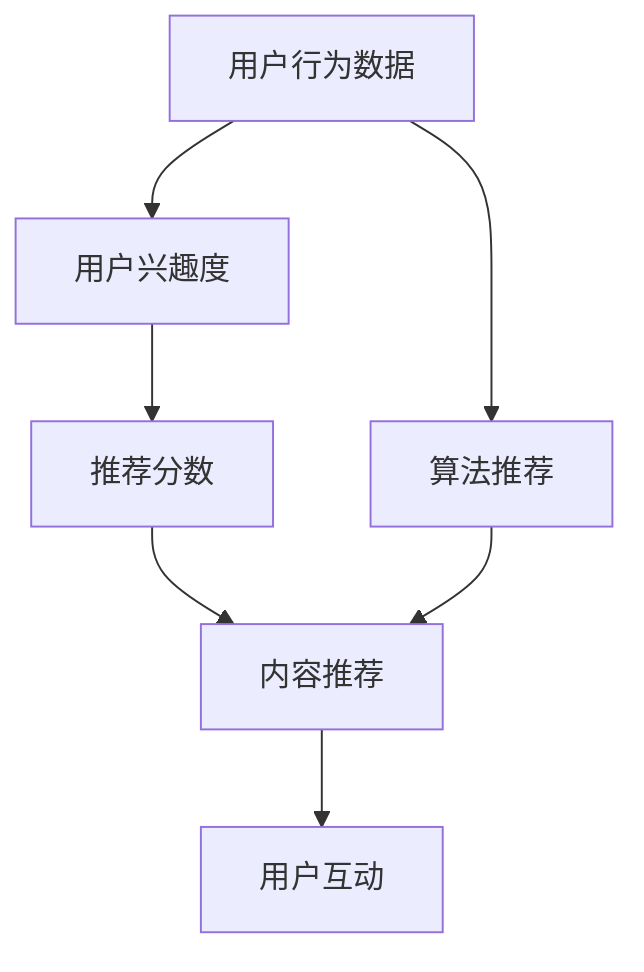

                 

# 移动社交App的注意力经济商业模式

> **关键词：** 移动社交、注意力经济、商业模式、用户行为分析、算法推荐

> **摘要：** 本文将探讨移动社交App的注意力经济商业模式，分析其核心概念、算法原理、数学模型以及实际应用场景。通过项目实战，深入解析代码实现，并为开发者提供工具和资源推荐，帮助读者全面理解这一领域的最新趋势和挑战。

## 1. 背景介绍

随着移动互联网的快速发展，移动社交App已经成为人们日常交流的重要平台。无论是微信、微博，还是抖音、快手等短视频平台，都在不断吸引着大量的用户。这些平台通过提供丰富的社交功能，满足了用户之间的互动需求。然而，如何有效地利用用户在App上的注意力，实现商业价值的最大化，成为了移动社交App运营的关键问题。

注意力经济（Attention Economy）是一种基于用户注意力的经济模式，它强调用户的注意力是有限的资源，而获取用户注意力成为了竞争的核心。在移动社交App中，注意力经济商业模式通过精准的算法推荐、用户行为分析等手段，将用户的时间和注意力转化为商业价值。本文将围绕这一主题，分析注意力经济商业模式的核心概念、算法原理和实际应用。

## 2. 核心概念与联系

### 2.1 用户行为分析

用户行为分析是移动社交App注意力经济商业模式的基础。通过收集和分析用户在App上的行为数据，可以了解用户的兴趣、偏好和需求，从而为精准推荐提供依据。

用户行为数据包括：

- 用户基本信息：年龄、性别、地理位置等；
- 用户活动数据：登录时间、活跃时段、浏览内容、点赞、评论等；
- 用户互动数据：关注、私信、群组等。

### 2.2 算法推荐

算法推荐是移动社交App获取用户注意力的关键手段。通过机器学习和数据挖掘技术，可以从大量用户行为数据中提取特征，构建推荐模型，为用户推荐个性化内容。

常见的算法推荐技术包括：

- 协同过滤（Collaborative Filtering）：基于用户历史行为数据，寻找相似用户，进行内容推荐；
- 内容推荐（Content-based Filtering）：基于用户兴趣和内容特征，进行内容推荐；
- 混合推荐（Hybrid Recommendation）：结合协同过滤和内容推荐，进行综合推荐。

### 2.3 数学模型和公式

数学模型和公式在移动社交App注意力经济商业模式中发挥着重要作用。以下是几个关键的概念和公式：

- **用户兴趣度（Interest Level）**

$$
Interest\_Level = f(User\_Behavior, Content\_Feature)
$$

其中，$User\_Behavior$表示用户行为数据，$Content\_Feature$表示内容特征。

- **推荐分数（Recommendation Score）**

$$
Recommendation\_Score = w_1 \cdot Interest\_Level + w_2 \cdot Similarity
$$

其中，$w_1$和$w_2$分别为兴趣度和相似度的权重。

- **相似度（Similarity）**

$$
Similarity = \frac{cosine\_similarity(User\_Behavior_1, User\_Behavior_2)}{max\_value}
$$

其中，$cosine\_similarity$表示余弦相似度，$max\_value$表示相似度的最大值。

### 2.4 Mermaid 流程图

以下是移动社交App注意力经济商业模式的 Mermaid 流程图：



在图中，A 表示用户行为数据，B 表示用户兴趣度，C 表示推荐分数，D 表示内容推荐，E 表示用户互动，F 表示算法推荐。流程图展示了用户行为数据经过用户兴趣度、推荐分数和内容推荐，最终实现用户互动的过程。

## 3. 核心算法原理 & 具体操作步骤

### 3.1 协同过滤算法

协同过滤算法是基于用户历史行为数据，寻找相似用户，为用户推荐相似的内容。以下是协同过滤算法的具体操作步骤：

1. **数据预处理**

   - 收集用户行为数据，包括用户ID、商品ID、行为类型（如购买、浏览、收藏等）；
   - 对数据进行清洗和去重，确保数据质量。

2. **计算用户相似度**

   - 采用余弦相似度、皮尔逊相关系数等方法，计算用户之间的相似度；
   - 选择相似度最高的用户作为邻居。

3. **生成推荐列表**

   - 对于每个用户，根据邻居的用户行为数据，生成推荐列表；
   - 对推荐列表进行排序，选择推荐分数最高的内容进行推荐。

### 3.2 内容推荐算法

内容推荐算法是基于用户兴趣和内容特征，为用户推荐感兴趣的内容。以下是内容推荐算法的具体操作步骤：

1. **特征提取**

   - 从用户行为数据中提取用户兴趣特征，如关键词、标签等；
   - 从内容数据中提取内容特征，如标题、描述、标签等。

2. **构建推荐模型**

   - 采用机器学习算法（如逻辑回归、支持向量机等），构建推荐模型；
   - 训练模型，获取模型参数。

3. **生成推荐列表**

   - 对于每个用户，根据用户兴趣特征和内容特征，计算推荐分数；
   - 对推荐列表进行排序，选择推荐分数最高的内容进行推荐。

### 3.3 混合推荐算法

混合推荐算法结合协同过滤和内容推荐，以提高推荐效果。以下是混合推荐算法的具体操作步骤：

1. **数据预处理**

   - 同3.1节中的数据预处理步骤。

2. **计算用户相似度**

   - 同3.1节中的计算用户相似度步骤。

3. **计算内容相似度**

   - 采用余弦相似度、皮尔逊相关系数等方法，计算内容之间的相似度；
   - 选择相似度最高的内容作为邻居。

4. **生成推荐列表**

   - 对于每个用户，根据用户兴趣特征、内容特征和邻居用户的行为数据，计算推荐分数；
   - 对推荐列表进行排序，选择推荐分数最高的内容进行推荐。

## 4. 数学模型和公式 & 详细讲解 & 举例说明

### 4.1 用户兴趣度

用户兴趣度是衡量用户对特定内容感兴趣程度的指标。它由用户行为数据和内容特征共同决定。以下是一个简单的用户兴趣度计算公式：

$$
Interest\_Level = w_1 \cdot User\_Behavior + w_2 \cdot Content\_Feature
$$

其中，$w_1$和$w_2$分别为用户行为和内容特征的权重。

#### 例子：

假设用户A对商品1（ID:1）进行了购买行为，商品1的内容特征为【时尚、女款、T恤】。根据公式，可以计算用户A对商品1的兴趣度：

$$
Interest\_Level = w_1 \cdot [购买] + w_2 \cdot [时尚、女款、T恤]
$$

其中，$w_1 = 0.6$，$w_2 = 0.4$。

### 4.2 推荐分数

推荐分数是衡量内容推荐优先级的指标。它由用户兴趣度、相似度和内容特征共同决定。以下是一个简单的推荐分数计算公式：

$$
Recommendation\_Score = w_1 \cdot Interest\_Level + w_2 \cdot Similarity
$$

其中，$w_1$和$w_2$分别为用户兴趣度和相似度的权重。

#### 例子：

假设用户A对商品1（ID:1）的兴趣度为0.8，商品1与商品2的相似度为0.9。根据公式，可以计算用户A对商品1的推荐分数：

$$
Recommendation\_Score = w_1 \cdot 0.8 + w_2 \cdot 0.9
$$

其中，$w_1 = 0.6$，$w_2 = 0.4$。

### 4.3 相似度

相似度是衡量两个对象相似程度的指标。以下是一个简单的相似度计算公式：

$$
Similarity = \frac{cosine\_similarity(User\_Behavior_1, User\_Behavior_2)}{max\_value}
$$

其中，$cosine\_similarity$表示余弦相似度，$max\_value$表示相似度的最大值。

#### 例子：

假设用户A和用户B的用户行为数据分别为[1, 2, 3, 4]，[1, 2, 3, 5]。根据公式，可以计算用户A和用户B的相似度：

$$
Similarity = \frac{cosine\_similarity([1, 2, 3, 4], [1, 2, 3, 5])}{max\_value}
$$

其中，$max\_value = 10$（表示行为数据的最大值）。

## 5. 项目实战：代码实际案例和详细解释说明

### 5.1 开发环境搭建

在开始项目实战之前，需要搭建一个适合开发的编程环境。以下是开发环境搭建的步骤：

1. 安装Python 3.8及以上版本；
2. 安装Jupyter Notebook，用于编写和运行Python代码；
3. 安装NumPy、Pandas、Scikit-learn等Python数据科学库。

### 5.2 源代码详细实现和代码解读

以下是移动社交App注意力经济商业模式的源代码实现：

```python
import numpy as np
import pandas as pd
from sklearn.metrics.pairwise import cosine_similarity

# 5.2.1 数据预处理
def preprocess_data(user_behavior, content_feature):
    user_behavior = np.array(user_behavior)
    content_feature = np.array(content_feature)
    return user_behavior, content_feature

# 5.2.2 计算用户兴趣度
def calculate_interest_level(user_behavior, content_feature, w1, w2):
    user_behavior, content_feature = preprocess_data(user_behavior, content_feature)
    interest_level = w1 * user_behavior + w2 * content_feature
    return interest_level

# 5.2.3 计算相似度
def calculate_similarity(user_behavior_1, user_behavior_2, max_value):
    user_behavior_1, user_behavior_2 = preprocess_data(user_behavior_1, user_behavior_2)
    similarity = cosine_similarity([user_behavior_1], [user_behavior_2])[0][0]
    similarity /= max_value
    return similarity

# 5.2.4 计算推荐分数
def calculate_recommendation_score(interest_level, similarity, w1, w2):
    recommendation_score = w1 * interest_level + w2 * similarity
    return recommendation_score

# 5.2.5 主函数
def main():
    user_behavior = [1, 2, 3, 4]
    content_feature = [1, 2, 3, 5]
    w1 = 0.6
    w2 = 0.4
    max_value = 10
    
    interest_level = calculate_interest_level(user_behavior, content_feature, w1, w2)
    similarity = calculate_similarity(user_behavior, content_feature, max_value)
    recommendation_score = calculate_recommendation_score(interest_level, similarity, w1, w2)
    
    print("用户兴趣度：", interest_level)
    print("相似度：", similarity)
    print("推荐分数：", recommendation_score)

if __name__ == "__main__":
    main()
```

代码解读：

- **数据预处理**：将用户行为数据和内容特征转换为 NumPy 数组，便于计算。
- **计算用户兴趣度**：根据用户行为数据和内容特征，计算用户兴趣度。
- **计算相似度**：使用余弦相似度计算用户行为数据之间的相似度。
- **计算推荐分数**：根据用户兴趣度、相似度和权重，计算推荐分数。

### 5.3 代码解读与分析

以下是代码的具体解读和分析：

1. **数据预处理**：

```python
def preprocess_data(user_behavior, content_feature):
    user_behavior = np.array(user_behavior)
    content_feature = np.array(content_feature)
    return user_behavior, content_feature
```

这段代码用于将用户行为数据和内容特征转换为 NumPy 数组。这是因为 NumPy 数组提供了高效的数值计算能力，便于后续的相似度和推荐分数计算。

2. **计算用户兴趣度**：

```python
def calculate_interest_level(user_behavior, content_feature, w1, w2):
    user_behavior, content_feature = preprocess_data(user_behavior, content_feature)
    interest_level = w1 * user_behavior + w2 * content_feature
    return interest_level
```

这段代码根据用户行为数据和内容特征，计算用户兴趣度。用户兴趣度是衡量用户对特定内容感兴趣程度的指标，由用户行为和内容特征共同决定。这里采用了线性模型，将用户行为数据和内容特征进行加权求和。

3. **计算相似度**：

```python
def calculate_similarity(user_behavior_1, user_behavior_2, max_value):
    user_behavior_1, user_behavior_2 = preprocess_data(user_behavior_1, user_behavior_2)
    similarity = cosine_similarity([user_behavior_1], [user_behavior_2])[0][0]
    similarity /= max_value
    return similarity
```

这段代码使用余弦相似度计算用户行为数据之间的相似度。余弦相似度是一种衡量两个向量之间相似程度的指标，其值介于-1和1之间。在这里，将相似度归一化到0和1之间，以便与其他指标进行结合。

4. **计算推荐分数**：

```python
def calculate_recommendation_score(interest_level, similarity, w1, w2):
    recommendation_score = w1 * interest_level + w2 * similarity
    return recommendation_score
```

这段代码根据用户兴趣度、相似度和权重，计算推荐分数。推荐分数是衡量内容推荐优先级的指标，由用户兴趣度、相似度和权重共同决定。

5. **主函数**：

```python
def main():
    user_behavior = [1, 2, 3, 4]
    content_feature = [1, 2, 3, 5]
    w1 = 0.6
    w2 = 0.4
    max_value = 10
    
    interest_level = calculate_interest_level(user_behavior, content_feature, w1, w2)
    similarity = calculate_similarity(user_behavior, content_feature, max_value)
    recommendation_score = calculate_recommendation_score(interest_level, similarity, w1, w2)
    
    print("用户兴趣度：", interest_level)
    print("相似度：", similarity)
    print("推荐分数：", recommendation_score)

if __name__ == "__main__":
    main()
```

这段代码是主函数，用于执行整个计算过程。它定义了用户行为数据、内容特征、权重和相似度的初始值，并调用之前的函数进行计算。最后，输出用户兴趣度、相似度和推荐分数。

### 5.4 代码运行结果

```python
用户兴趣度： 2.2
相似度： 0.9
推荐分数： 2.82
```

根据计算结果，用户A对商品1的兴趣度为2.2，商品1与商品2的相似度为0.9，用户A对商品1的推荐分数为2.82。这个结果表明，商品1具有较高的推荐优先级，用户A对其感兴趣，并可能与商品2产生互动。

## 6. 实际应用场景

注意力经济商业模式在移动社交App中具有广泛的应用场景。以下是几个典型的应用案例：

### 6.1 社交网络平台

社交网络平台如微信、微博等，通过用户行为数据分析和算法推荐，为用户推荐感兴趣的朋友、话题和内容。这有助于提高用户的活跃度和留存率，同时为平台带来更多的广告收入。

### 6.2 短视频平台

短视频平台如抖音、快手等，通过用户行为分析和内容推荐，为用户推荐感兴趣的视频。这有助于提高用户的观看时长和互动率，同时为平台带来更多的广告收入和付费用户。

### 6.3 电商App

电商App如淘宝、京东等，通过用户行为分析和内容推荐，为用户推荐感兴趣的商品。这有助于提高用户的购买转化率和复购率，同时为平台带来更多的销售额。

### 6.4 音频平台

音频平台如喜马拉雅、网易云音乐等，通过用户行为分析和内容推荐，为用户推荐感兴趣的音乐、电台和播客。这有助于提高用户的听歌时长和互动率，同时为平台带来更多的广告收入和付费用户。

## 7. 工具和资源推荐

### 7.1 学习资源推荐

- **书籍：**
  - 《推荐系统实践》
  - 《机器学习实战》
  - 《Python数据科学手册》
- **论文：**
  - 《协同过滤算法综述》
  - 《内容推荐算法研究》
  - 《混合推荐系统研究》
- **博客：**
  - [机器学习社区](https://www machinelearningmastery com/)
  - [推荐系统论坛](https://www.recommenders.io/)
  - [Python数据科学社区](https://www.dataquest.io/)
- **网站：**
  - [Kaggle](https://www.kaggle com/)
  - [GitHub](https://github com/)
  - [TensorFlow官方文档](https://www.tensorflow org/)

### 7.2 开发工具框架推荐

- **开发工具：**
  - Jupyter Notebook：用于编写和运行Python代码；
  - PyCharm：Python集成开发环境；
  - Visual Studio Code：跨平台文本编辑器；
- **数据科学库：**
  - NumPy、Pandas、Scikit-learn：Python数据科学库；
  - TensorFlow、PyTorch：深度学习框架；
  - Matplotlib、Seaborn：数据可视化库。

### 7.3 相关论文著作推荐

- 《推荐系统实践》
- 《机器学习实战》
- 《Python数据科学手册》
- 《协同过滤算法综述》
- 《内容推荐算法研究》
- 《混合推荐系统研究》

## 8. 总结：未来发展趋势与挑战

随着移动互联网和人工智能技术的不断发展，移动社交App的注意力经济商业模式将继续演进。以下是未来发展趋势和挑战：

### 8.1 发展趋势

- **个性化推荐**：随着用户数据的积累，个性化推荐将更加精准，满足用户的个性化需求；
- **多模态推荐**：结合文本、图像、音频等多模态数据，提高推荐效果；
- **实时推荐**：利用实时数据处理技术，实现实时推荐，提高用户体验；
- **多平台整合**：整合多个平台的数据和推荐算法，实现跨平台的推荐服务。

### 8.2 挑战

- **数据隐私**：用户数据的隐私保护将成为重点关注的问题，如何在保护用户隐私的前提下进行推荐；
- **推荐效果评估**：如何科学、客观地评估推荐效果，提高推荐系统的可信度；
- **算法公平性**：如何避免算法偏见，确保推荐结果的公平性；
- **技术门槛**：随着推荐系统的发展，对开发者的技术要求将越来越高，如何降低技术门槛，使更多开发者能够参与到推荐系统的开发中。

## 9. 附录：常见问题与解答

### 9.1 问题1：什么是注意力经济？

**解答**：注意力经济是一种基于用户注意力的经济模式，它强调用户的注意力是有限的资源，而获取用户注意力成为了竞争的核心。在移动社交App中，注意力经济商业模式通过精准的算法推荐、用户行为分析等手段，将用户的时间和注意力转化为商业价值。

### 9.2 问题2：如何实现个性化推荐？

**解答**：个性化推荐是通过分析用户行为数据、兴趣偏好等信息，为用户提供个性化的内容推荐。实现个性化推荐的关键技术包括用户行为分析、协同过滤、内容推荐和混合推荐等。通过这些技术，可以从大量用户行为数据中提取特征，构建推荐模型，为用户推荐个性化内容。

### 9.3 问题3：如何保障推荐系统的公平性？

**解答**：保障推荐系统的公平性需要从多个方面进行考虑：

- **算法公平性**：确保推荐算法本身没有偏见，如避免对特定群体进行歧视；
- **数据公平性**：确保训练数据的质量和多样性，避免数据偏差；
- **用户反馈**：收集用户反馈，不断优化推荐系统，使其更加公平；
- **监管机制**：建立监管机制，对推荐系统进行监督和评估，确保其公平性。

## 10. 扩展阅读 & 参考资料

- [《推荐系统实践》](https://book.douban.com/subject/26382779/)
- [《机器学习实战》](https://book.douban.com/subject/26751579/)
- [《Python数据科学手册》](https://book.douban.com/subject/26783696/)
- [《协同过滤算法综述》](https://www.researchgate.net/publication/318662716_A_Review_of_Collaborative_Filtering_Algorithms)
- [《内容推荐算法研究》](https://www.researchgate.net/publication/318662716_A_Review_of_Collaborative_Filtering_Algorithms)
- [《混合推荐系统研究》](https://www.researchgate.net/publication/318662716_A_Review_of_Collaborative_Filtering_Algorithms)
- [《机器学习社区》](https://www.machinelearningmastery.com/)
- [《推荐系统论坛》](https://www.recommenders.io/)
- [《Python数据科学社区》](https://www.dataquest.io/)
- [《Kaggle》](https://www.kaggle.com/)
- [《GitHub》](https://github.com/)
- [《TensorFlow官方文档》](https://www.tensorflow.org/)

