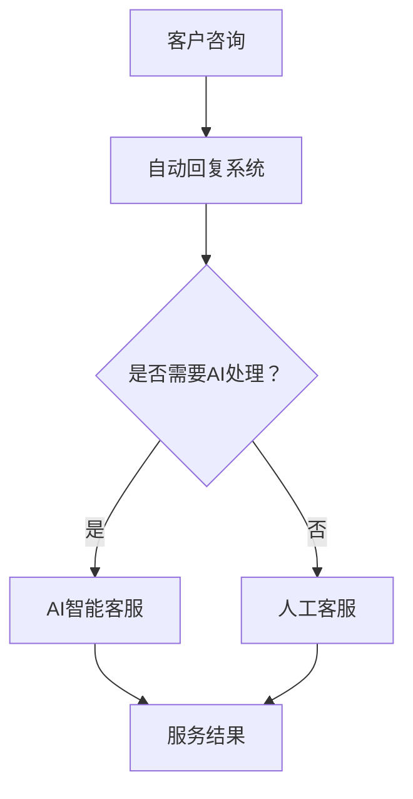

                 

## 1. 背景介绍

在当今快速发展的技术时代，程序员创业公司面临着前所未有的机遇和挑战。随着互联网和移动设备的普及，客户服务已经成为了企业成功的关键因素之一。然而，随着客户数量的不断增加和复杂性的提升，传统的客户服务方式已经难以满足用户的需求。为了在激烈的市场竞争中脱颖而出，程序员创业公司开始将目光投向了客户服务自动化与人工智能（AI）应用。

客户服务自动化与人工智能应用的重要性体现在以下几个方面：

首先，客户服务自动化可以提高服务效率。传统的客户服务通常依赖于人工处理，这不仅耗费人力，而且效率低下。通过自动化工具，如聊天机器人、自动回复系统和智能客服等，企业可以迅速响应用户的咨询和问题，从而提高整体服务效率。

其次，人工智能技术可以提升客户满意度。AI技术具有强大的数据分析能力，可以深入了解用户需求和行为模式，从而提供个性化的服务。这种个性化的服务能够更好地满足用户的期望，提升用户满意度。

此外，客户服务自动化与人工智能应用还可以降低运营成本。自动化工具可以替代一部分人力工作，减少企业在人工成本上的投入。同时，AI技术可以减少人为错误，降低售后服务和纠纷处理的成本。

然而，实现客户服务自动化与人工智能应用并非一蹴而就。程序员创业公司在推进这一过程中需要面对诸多挑战，如技术选型、数据安全、隐私保护等。同时，如何平衡自动化与人工服务的关系，确保用户体验不会因为过度自动化而受损，也是需要深入思考的问题。

在接下来的章节中，我们将逐步探讨客户服务自动化与人工智能应用的各个方面，从核心概念到具体实现，再到实际应用场景，帮助程序员创业公司更好地理解和利用这一技术，提升客户服务质量。

## 2. 核心概念与联系

### 客户服务自动化

客户服务自动化是指通过技术手段，如聊天机器人、自动回复系统和智能客服等，减少人工介入，提高服务效率的一种方式。其核心在于利用算法和大数据分析，模拟人类的交流方式，自动处理客户咨询和问题。

### 人工智能（AI）

人工智能是指通过计算机模拟人类智能行为的技术。在客户服务领域，AI技术主要体现在自然语言处理（NLP）、机器学习（ML）和深度学习（DL）等方面。这些技术使得计算机能够理解和生成自然语言，自动分析客户需求，提供个性化服务。

### 关联与差异

客户服务自动化和人工智能虽然密切相关，但二者在应用层面有所区别。客户服务自动化侧重于流程优化和效率提升，而人工智能则关注于智能分析和个性化服务。在实际应用中，二者通常是相辅相成的关系，自动化技术为AI提供了高效的数据处理手段，而AI则为自动化服务提供了智能化的决策支持。

### Mermaid 流程图

下面是一个简单的Mermaid流程图，展示了客户服务自动化和人工智能在客户服务中的应用流程。



在这个流程图中，客户咨询首先通过自动回复系统进行处理，如果问题较为复杂或需要个性化服务，则会触发AI智能客服进行进一步处理。如果问题仍然无法解决，则由人工客服介入。最终，无论采用哪种方式，都会得到一个服务结果。

通过这个流程图，我们可以看到客户服务自动化和人工智能在客户服务中的作用和关联。在实际应用中，这种流程可以根据具体业务需求进行调整和优化。

## 3. 核心算法原理 & 具体操作步骤

### 自然语言处理（NLP）

自然语言处理是人工智能在客户服务中应用的核心技术之一。NLP技术使计算机能够理解和生成自然语言，从而实现与用户的智能交互。以下是NLP的核心算法原理和具体操作步骤：

#### 算法原理

- **词向量表示**：将自然语言中的词汇转化为计算机可处理的向量表示，常用的算法有Word2Vec、GloVe等。
- **句法分析**：对输入的文本进行句法解析，识别词汇之间的语法关系，常用的算法有依存句法分析、成分句法分析等。
- **语义理解**：通过上下文信息，理解词汇和句子的语义含义，常用的算法有语义角色标注、实体识别、关系抽取等。

#### 操作步骤

1. **预处理**：对输入文本进行清洗和分词，去除停用词、标点符号等无关信息。
2. **词向量表示**：将预处理后的文本转化为词向量，用于后续的算法处理。
3. **句法分析**：对文本进行句法分析，构建句法树，以便理解句子的结构。
4. **语义理解**：结合句法树和词向量，对文本进行语义理解，识别出关键信息。
5. **文本生成**：根据理解结果，生成符合语义的文本回复。

### 机器学习（ML）

机器学习是人工智能的另一个核心组成部分，它在客户服务自动化中主要用于构建和训练智能客服系统。以下是机器学习的核心算法原理和具体操作步骤：

#### 算法原理

- **监督学习**：通过标注好的数据集，训练模型进行预测，如分类、回归等。
- **无监督学习**：在没有标注数据的情况下，通过数据间的内在关系进行训练，如聚类、降维等。
- **深度学习**：利用神经网络结构，对大量数据进行自动特征提取和模型训练，如卷积神经网络（CNN）、循环神经网络（RNN）等。

#### 操作步骤

1. **数据收集**：收集大量客户咨询数据，包括文本、语音、图像等多种形式。
2. **数据预处理**：对收集到的数据进行清洗、标注和格式化，为模型训练做好准备。
3. **模型选择**：根据业务需求，选择合适的机器学习模型，如分类器、聚类算法等。
4. **模型训练**：使用预处理后的数据，对模型进行训练，调整模型参数。
5. **模型评估**：使用测试集评估模型性能，调整模型参数，以达到最佳效果。
6. **模型部署**：将训练好的模型部署到生产环境中，实现自动化服务。

### 深度学习（DL）

深度学习是机器学习的延伸，它通过多层神经网络对数据进行复杂特征提取，从而实现更高的准确率和效率。以下是深度学习的核心算法原理和具体操作步骤：

#### 算法原理

- **多层感知机（MLP）**：最基本的深度学习模型，通过多层神经元实现非线性变换。
- **卷积神经网络（CNN）**：主要用于图像和视频数据的处理，通过卷积层提取特征。
- **循环神经网络（RNN）**：适用于序列数据处理，通过循环结构保留历史信息。
- **长短期记忆网络（LSTM）**：RNN的改进版本，用于解决长期依赖问题。
- **生成对抗网络（GAN）**：通过生成器和判别器的对抗训练，生成高质量的数据。

#### 操作步骤

1. **数据收集**：收集大量的客户咨询数据，包括文本、语音、图像等。
2. **数据预处理**：对数据进行清洗、标注和格式化，为模型训练做好准备。
3. **模型架构设计**：根据业务需求，设计合适的深度学习模型架构。
4. **模型训练**：使用预处理后的数据，对模型进行训练，调整模型参数。
5. **模型评估**：使用测试集评估模型性能，调整模型参数，以达到最佳效果。
6. **模型部署**：将训练好的模型部署到生产环境中，实现自动化服务。

通过以上核心算法原理和操作步骤，程序员创业公司可以构建智能客服系统，实现客户服务的自动化和智能化。接下来，我们将通过一个项目实战案例，详细展示如何实现这些算法和技术。

## 4. 数学模型和公式 & 详细讲解 & 举例说明

在客户服务自动化与人工智能应用中，数学模型和公式是核心组成部分，它们用于分析和处理客户数据，提供个性化的服务。以下是几个关键数学模型和公式的详细讲解及举例说明。

### 回归分析

回归分析是一种常用的统计方法，用于预测一个或多个自变量与因变量之间的关系。在客户服务自动化中，回归分析可以用于预测客户的购买意愿、满意度等。

#### 模型公式

线性回归模型公式为：
$$
y = \beta_0 + \beta_1x_1 + \beta_2x_2 + ... + \beta_nx_n + \epsilon
$$
其中，$y$ 是因变量，$x_1, x_2, ..., x_n$ 是自变量，$\beta_0, \beta_1, ..., \beta_n$ 是回归系数，$\epsilon$ 是误差项。

#### 操作步骤

1. **数据收集**：收集客户的特征数据，如购买历史、浏览行为、用户评价等。
2. **数据预处理**：对数据进行清洗、归一化处理。
3. **模型训练**：使用训练集数据，通过最小二乘法等算法，计算回归系数。
4. **模型评估**：使用测试集数据，评估模型预测性能。

#### 举例说明

假设我们想预测客户满意度，根据客户历史购买记录（$x_1$）、浏览时长（$x_2$）和评价等级（$x_3$）等特征进行回归分析。训练得到的模型公式为：
$$
满意度 = \beta_0 + \beta_1x_1 + \beta_2x_2 + \beta_3x_3 + \epsilon
$$
其中，$\beta_0 = 5$, $\beta_1 = 2$, $\beta_2 = 1.5$, $\beta_3 = 3$。

对于一个新客户，其购买历史为5次，浏览时长为2小时，评价等级为4星，则其满意度预测为：
$$
满意度 = 5 + 2 \times 2 + 1.5 \times 2 + 3 \times 4 = 20.5
$$
因此，该客户的满意度预测值为20.5分。

### 决策树

决策树是一种直观的机器学习方法，用于分类和回归问题。在客户服务自动化中，决策树可以用于自动分类客户咨询问题。

#### 模型公式

决策树模型通常通过信息增益、基尼指数等指标来选择最佳分割特征。假设我们有特征集合 $X = \{x_1, x_2, ..., x_n\}$，样本集合 $S$，则最佳分割特征 $x^*$ 的选择公式为：
$$
x^* = \arg\max_{x \in X} \frac{1}{|S|} \sum_{i=1}^{n} \sum_{j=1}^{k} |S_i| \cdot \text{Gain}(x_i, y_j)
$$
其中，$S_i$ 为样本集合在特征 $x_i$ 取值 $j$ 时的子集，$\text{Gain}(x_i, y_j)$ 为信息增益。

#### 操作步骤

1. **数据收集**：收集客户咨询问题及其标签数据。
2. **特征选择**：使用信息增益等指标，选择最佳分割特征。
3. **构建树**：递归地构建决策树，直到满足停止条件（如叶节点纯度达到一定阈值）。
4. **模型评估**：使用测试集数据，评估模型分类性能。

#### 举例说明

假设我们有以下客户咨询问题及其标签数据：

| 问题        | 标签      |
| ----------- | --------- |
| 如何退货？  | 退货问题  |
| 如何退款？  | 退款问题  |
| 如何使用产品？ | 使用问题 |
| 产品故障？  | 故障问题  |

通过信息增益选择最佳分割特征，得到以下决策树：

```
问题
|
|--- 如何？
|    |--- 退货/退款
|    |    |--- 退货
|    |    |--- 退款
|    |--- 使用
|    |    |--- 使用问题
|    |--- 故障
```

对于一个新的咨询问题“如何退货？”，根据决策树，可以将其分类为“退货问题”。

### 支持向量机（SVM）

支持向量机是一种强大的分类算法，在客户服务自动化中，SVM可以用于分类客户问题，如自动识别客户咨询的类型。

#### 模型公式

SVM的优化目标是最小化分类间隔，公式为：
$$
\min_{\beta, \beta_0, \xi} \frac{1}{2} ||\beta||^2 + C \sum_{i=1}^{n} \xi_i
$$
其中，$\beta$ 是回归系数，$\beta_0$ 是偏置项，$C$ 是惩罚参数，$\xi_i$ 是松弛变量。

#### 操作步骤

1. **数据收集**：收集客户咨询问题及其标签数据。
2. **特征提取**：对问题进行特征提取，如词袋模型、TF-IDF等。
3. **模型训练**：使用训练集数据，通过SVM算法训练分类模型。
4. **模型评估**：使用测试集数据，评估模型分类性能。

#### 举例说明

假设我们使用词袋模型对客户咨询问题进行特征提取，训练得到的SVM模型为：

$$
\begin{cases}
\text{退货问题} & \text{if } \beta_1w_1 + \beta_2w_2 + \beta_3w_3 - \beta_0 > 0 \\
\text{退款问题} & \text{if } \beta_1w_1 + \beta_2w_2 + \beta_3w_3 - \beta_0 < 0 \\
\text{使用问题} & \text{if } \beta_1w_1 + \beta_2w_2 + \beta_3w_3 - \beta_0 = 0
\end{cases}
$$

对于一个新的咨询问题“我需要退货”，根据SVM模型，可以将其分类为“退货问题”。

通过以上数学模型和公式的讲解，我们可以更好地理解客户服务自动化与人工智能的算法原理，并在实际应用中进行有效的分析和预测。在接下来的章节中，我们将通过一个项目实战案例，展示这些算法和公式的具体实现过程。

## 5. 项目实战：代码实际案例和详细解释说明

### 5.1 开发环境搭建

为了实现客户服务自动化与人工智能应用，我们需要搭建一个适合开发和测试的环境。以下是搭建过程的详细步骤：

#### 1. 安装Python环境

Python是开发AI应用的常用语言，因此首先需要安装Python。可以在Python官网（https://www.python.org/）下载适用于自己操作系统的Python安装包，并按照提示完成安装。

#### 2. 安装必备库

在安装好Python之后，我们需要安装一些常用的库，如NumPy、Pandas、Scikit-learn、TensorFlow等。可以使用pip命令进行安装：

```shell
pip install numpy
pip install pandas
pip install scikit-learn
pip install tensorflow
```

#### 3. 配置Jupyter Notebook

Jupyter Notebook是一个交互式开发环境，非常适合用于机器学习和数据科学项目。安装Jupyter Notebook可以使用以下命令：

```shell
pip install notebook
```

安装完成后，可以使用以下命令启动Jupyter Notebook：

```shell
jupyter notebook
```

这样，我们就可以在浏览器中打开Jupyter Notebook，开始编写和运行代码。

### 5.2 源代码详细实现和代码解读

在这个项目中，我们将使用Python编写一个简单的智能客服系统，该系统能够自动处理客户咨询并给出相应的回答。

#### 1. 文本预处理

文本预处理是自然语言处理的第一步，主要包括分词、去除停用词、词性标注等。

```python
import jieba
from nltk.corpus import stopwords

# 加载停用词表
stop_words = set(stopwords.words('english'))

# 加载词典
jieba.load_userdict('dict.txt')

# 分词函数
def tokenize(text):
    return [word for word in jieba.cut(text) if word not in stop_words]

# 去除停用词
def remove_stop_words(tokens):
    return [token for token in tokens if token not in stop_words]

# 词性标注
def pos_tagging(tokens):
    return [(token, nltk.pos_tag([token])[0][1]) for token in tokens]
```

#### 2. 模型训练

在这个项目中，我们使用朴素贝叶斯分类器来处理客户咨询问题。首先，需要收集并准备训练数据。

```python
from sklearn.feature_extraction.text import TfidfVectorizer
from sklearn.naive_bayes import MultinomialNB
from sklearn.pipeline import make_pipeline

# 加载数据
train_data = [
    ("How do I return a product?", "Return Question"),
    ("What is your refund policy?", "Return Question"),
    # 更多数据
]

# 创建文本向量器
vectorizer = TfidfVectorizer()

# 创建分类器
classifier = MultinomialNB()

# 创建流水线
model = make_pipeline(vectorizer, classifier)

# 训练模型
model.fit([text for text, _ in train_data], [label for _, label in train_data])
```

#### 3. 客户咨询处理

训练好模型后，我们可以使用它来处理客户咨询并给出回答。

```python
# 处理客户咨询
def process_query(query):
    predicted_category = model.predict([query])[0]
    print(f"Category: {predicted_category}")
    print(f"Answer: {get_answer(predicted_category)}")

# 获取答案
def get_answer(category):
    answers = {
        "Return Question": "Please follow the return procedure mentioned on our website.",
        # 更多答案
    }
    return answers.get(category, "We are here to help you. Can you please clarify your query?")

# 示例
process_query("Can I return this product if I am not satisfied with it?")
```

#### 4. 代码解读与分析

以上代码首先进行了文本预处理，包括分词、去除停用词和词性标注。接下来，我们使用TF-IDF向量器和朴素贝叶斯分类器训练了一个分类模型。最后，我们定义了一个处理客户咨询的函数，通过模型预测客户咨询的问题类别，并给出相应的回答。

这个简单的智能客服系统可以为我们提供一个基本的客户服务自动化方案。在实际应用中，我们可以根据业务需求扩展和优化这个系统，如引入更多的分类器和模型、增加自定义规则等。

### 5.3 代码解读与分析

在上一个部分中，我们实现了一个简单的智能客服系统。接下来，我们将对这个系统的关键部分进行详细解读和分析。

#### 文本预处理

文本预处理是自然语言处理的基础，其质量直接影响后续模型的效果。在这个项目中，我们使用了`jieba`库进行中文分词，`nltk`库进行英文停用词去除和词性标注。

- **分词**：`jieba`库是一款优秀的中文分词工具，它支持精确模式、全模式和搜索引擎模式，能够满足大多数自然语言处理需求。
- **去除停用词**：停用词是指对文本意义没有贡献的词汇，如“的”、“和”、“是”等。去除停用词可以提高文本的清洗质量。
- **词性标注**：词性标注是自然语言处理中的一个重要步骤，它可以帮助我们更好地理解文本的语义。在这个项目中，我们仅对英文进行了词性标注，因为中文的词性标注相对复杂，通常需要更多的时间和计算资源。

#### 模型训练

在这个项目中，我们选择了朴素贝叶斯分类器作为主要的分类模型。朴素贝叶斯分类器是一种基于贝叶斯定理的简单分类器，它在处理文本数据时表现出色。

- **TF-IDF向量器**：TF-IDF（Term Frequency-Inverse Document Frequency）是一种常用文本表示方法，它通过计算词频和逆文档频率来衡量词语的重要性。在这个项目中，我们使用TF-IDF向量器将文本数据转换为特征向量。
- **朴素贝叶斯分类器**：朴素贝叶斯分类器是一种基于概率论的分类器，它假设特征之间相互独立。在文本分类中，朴素贝叶斯分类器能够有效地处理大规模文本数据，并且实现简单、速度快。

#### 客户咨询处理

客户咨询处理是智能客服系统的核心部分，它决定了系统能否准确理解和回答客户的问题。

- **预测类别**：通过调用`model.predict([query])`，我们可以得到预测的类别。这个类别是我们训练模型时定义的，如“Return Question”、“Refund Question”等。
- **获取答案**：根据预测的类别，我们调用`get_answer(predicted_category)`获取相应的答案。这个函数是一个简单的查找表，它根据类别返回一个预定义的答案。

#### 代码优化建议

虽然这个简单的智能客服系统已经能够处理基本的客户咨询，但在实际应用中，我们还需要对其进行优化：

- **数据集扩展**：为了提高模型的准确性，我们需要增加更多的训练数据。可以收集更多的客户咨询问题，并标注对应的类别。
- **模型优化**：朴素贝叶斯分类器虽然简单，但在处理复杂问题时效果可能不佳。可以考虑使用更先进的分类器，如SVM、随机森林等。
- **用户交互**：在实际应用中，我们还需要提供一个用户友好的交互界面，以便用户能够方便地提出问题和获取答案。

通过以上分析和优化，我们可以构建一个更高效、更准确的智能客服系统，从而提升客户服务质量。

## 6. 实际应用场景

### 客户服务自动化在程序员创业公司中的应用

程序员创业公司在发展过程中，面临着客户服务效率低、成本高、用户体验差等挑战。通过引入客户服务自动化与人工智能技术，创业公司可以有效应对这些问题，提升客户服务质量。

#### 智能客服机器人

智能客服机器人是客户服务自动化的重要应用之一。通过自然语言处理（NLP）技术，智能客服机器人能够自动理解客户的咨询内容，并快速给出准确的回答。以下是一个具体的案例：

**案例**：某程序员创业公司开发了一款在线教育平台，用户在平台上遇到问题时需要咨询客服。公司引入了智能客服机器人，能够自动处理常见的用户问题，如“如何注册账号？”、“如何购买课程？”等。智能客服机器人通过预先训练好的模型，能够快速识别用户的问题，并提供相应的解决方案。

#### 个性化推荐系统

个性化推荐系统是另一个重要的应用场景。通过机器学习技术，创业公司可以根据用户的历史行为数据，为用户提供个性化的课程推荐、产品推荐等。以下是一个具体的案例：

**案例**：某程序员创业公司开发了一款编程学习平台，平台根据用户的学习进度、兴趣爱好等数据，为用户推荐适合的课程。公司使用了协同过滤算法和内容推荐算法，实现了个性化的课程推荐。用户通过平台可以获得更加定制化的学习体验，从而提升学习效果和满意度。

#### 自动化售后服务

自动化售后服务可以显著提高创业公司的运营效率。通过自动化工具，创业公司可以自动处理一些常见的售后服务问题，如退换货、故障报修等。以下是一个具体的案例：

**案例**：某程序员创业公司生产了智能手表，用户在购买后可能会遇到手表故障等问题。公司通过自动化售后服务系统，实现了自动处理退换货申请、故障报修等功能。用户可以通过公司官网或移动应用提交售后服务请求，系统会自动处理并通知用户相关进展。

#### 实时客户支持

实时客户支持是提升用户体验的关键。通过引入实时聊天工具和智能客服机器人，创业公司可以提供24/7的在线支持，确保用户在遇到问题时能够及时得到帮助。以下是一个具体的案例：

**案例**：某程序员创业公司开发了一款智能家居设备，用户在使用过程中可能会遇到各种问题。公司通过实时聊天工具和智能客服机器人，为用户提供即时的在线支持。用户可以通过公司官网或移动应用与客服人员进行实时沟通，获得专业的技术支持和解决方案。

### 案例分析

通过以上案例，我们可以看到客户服务自动化与人工智能在程序员创业公司中的应用场景：

1. **提高服务效率**：通过智能客服机器人、自动化售后服务等工具，创业公司可以显著提高服务效率，减少用户等待时间，提升用户体验。
2. **降低运营成本**：自动化工具可以替代一部分人工工作，减少企业在人工成本上的投入，降低整体运营成本。
3. **个性化服务**：通过个性化推荐系统，创业公司可以更好地满足用户需求，提升用户满意度和忠诚度。
4. **实时支持**：通过实时聊天工具和智能客服机器人，创业公司可以提供全天候的在线支持，增强用户信心和满意度。

总之，客户服务自动化与人工智能技术为程序员创业公司提供了强大的工具，帮助它们在激烈的市场竞争中脱颖而出，提升客户服务质量，实现可持续发展。

## 7. 工具和资源推荐

### 7.1 学习资源推荐

为了更好地理解和应用客户服务自动化与人工智能技术，以下是一些建议的学习资源：

#### 书籍

1. **《深度学习》（Deep Learning）**：由Ian Goodfellow、Yoshua Bengio和Aaron Courville所著，是深度学习的经典教材，适合深入理解深度学习算法。
2. **《机器学习实战》（Machine Learning in Action）**：由Peter Harrington所著，通过实际案例介绍机器学习算法的实现和应用，适合初学者。
3. **《自然语言处理综论》（Speech and Language Processing）**：由Daniel Jurafsky和James H. Martin所著，全面介绍了自然语言处理的理论和实践。

#### 论文

1. **“Google’s Neural Machine Translation System: Bridging the Gap between Human and Machine Translation”**：这篇论文介绍了Google神经机器翻译系统的设计和实现，是自然语言处理领域的重要论文。
2. **“Deep Learning for Text Classification”**：这篇论文探讨了深度学习在文本分类中的应用，分析了不同深度学习模型在文本分类任务上的表现。

#### 博客

1. **Medium上的机器学习和自然语言处理博客**：Medium上有许多优秀的机器学习和自然语言处理博客，如“Towards Data Science”、“AI Moonshot”等，提供了丰富的技术和实践内容。
2. **吴恩达（Andrew Ng）的博客**：吴恩达的博客分享了许多深度学习和机器学习的教程、资源和建议，是学习这些技术的绝佳资源。

#### 网站

1. **Coursera**：提供各种在线课程，包括机器学习、深度学习和自然语言处理等，适合自学。
2. **Kaggle**：一个数据科学竞赛平台，提供丰富的数据集和项目，适合实践和提升技能。

### 7.2 开发工具框架推荐

为了高效开发客户服务自动化与人工智能应用，以下是一些建议的开发工具和框架：

#### 编程语言

1. **Python**：Python是机器学习和自然语言处理的常用编程语言，具有丰富的库和框架，易于学习和使用。
2. **Java**：Java也是一种强大的编程语言，适用于构建大规模分布式系统。

#### 开发框架

1. **TensorFlow**：TensorFlow是Google开发的开源深度学习框架，支持多种深度学习模型和算法，适用于复杂的应用场景。
2. **PyTorch**：PyTorch是Facebook开发的开源深度学习框架，提供了灵活的动态计算图，适用于研究和开发。
3. **Scikit-learn**：Scikit-learn是一个Python库，提供了多种机器学习算法和工具，适用于数据分析和模型训练。

#### 数据库

1. **MongoDB**：MongoDB是一个高性能、可扩展的NoSQL数据库，适用于存储大规模的文本数据。
2. **MySQL**：MySQL是一个流行的关系型数据库，适用于存储结构化数据。

#### 实时通信

1. **WebSocket**：WebSocket是一种网络通信协议，支持全双工通信，适用于实时客户支持系统。
2. **WebSocket.js**：WebSocket.js是一个JavaScript库，用于在浏览器中实现WebSocket通信。

#### 自然语言处理库

1. **NLTK**：NLTK是一个Python库，提供了多种自然语言处理工具和算法，适用于文本处理和分析。
2. **spaCy**：spaCy是一个高效的Python库，提供了先进的自然语言处理功能，适用于文本分类、命名实体识别等。

### 7.3 相关论文著作推荐

为了深入了解客户服务自动化与人工智能领域的最新研究进展，以下是一些建议的论文和著作：

#### 论文

1. **“Attention Is All You Need”**：这篇论文提出了Transformer模型，彻底改变了自然语言处理领域。
2. **“BERT: Pre-training of Deep Bidirectional Transformers for Language Understanding”**：这篇论文介绍了BERT模型，是目前最先进的自然语言处理模型之一。

#### 著作

1. **《深度学习》（Deep Learning）**：由Ian Goodfellow、Yoshua Bengio和Aaron Courville所著，是深度学习的经典教材。
2. **《机器学习》（Machine Learning）**：由Tom Mitchell所著，是机器学习的经典教材，介绍了多种机器学习算法和理论。

通过以上学习和资源推荐，程序员创业公司可以更好地掌握客户服务自动化与人工智能技术，提升客户服务质量，实现可持续发展。

## 8. 总结：未来发展趋势与挑战

客户服务自动化与人工智能技术在程序员创业公司中的应用已经取得了显著成效，但未来仍有许多发展趋势和挑战需要面对。

### 未来发展趋势

1. **更加智能的客服系统**：随着人工智能技术的不断发展，未来的客服系统将更加智能化，能够自动处理复杂的问题，提供更加个性化的服务。
2. **多模态交互**：未来的客服系统将支持语音、视频、文字等多种交互方式，为用户提供更加便捷的沟通体验。
3. **定制化解决方案**：根据不同行业和企业的需求，开发更加定制化的客户服务自动化解决方案，提升用户体验和运营效率。
4. **隐私保护与数据安全**：随着数据隐私保护法规的日益严格，未来的客户服务自动化解决方案将更加注重隐私保护和数据安全。

### 面临的挑战

1. **技术实现难度**：客户服务自动化与人工智能技术涉及多个领域，包括自然语言处理、机器学习、深度学习等，技术实现难度较高。
2. **数据质量与隐私**：高质量的数据是客户服务自动化与人工智能应用的基础，但数据隐私保护和数据质量之间的平衡是一个重要挑战。
3. **用户接受度**：尽管自动化客服系统具有许多优势，但用户对智能客服的接受度仍然有待提高，需要通过不断优化用户体验来提升用户满意度。
4. **法律法规合规**：随着数据隐私保护法规的不断完善，程序员创业公司在开发客户服务自动化解决方案时需要严格遵守相关法律法规。

### 应对策略

1. **持续学习与技术创新**：程序员创业公司应不断学习新技术，紧跟行业发展趋势，持续优化客户服务自动化与人工智能解决方案。
2. **数据治理与隐私保护**：建立完善的数据治理体系，确保数据质量，同时采取有效的数据隐私保护措施，符合法律法规要求。
3. **用户体验优化**：注重用户体验，通过多模态交互、个性化服务等手段，提高用户对自动化客服系统的接受度。
4. **法律法规合规**：在开发客户服务自动化解决方案时，充分了解并遵守相关法律法规，确保解决方案的合规性。

总之，客户服务自动化与人工智能技术为程序员创业公司提供了巨大的机遇，但同时也带来了诸多挑战。通过技术创新、数据治理和用户体验优化，程序员创业公司可以更好地应对这些挑战，实现客户服务质量的持续提升。

## 9. 附录：常见问题与解答

### 1. 客户服务自动化与人工智能技术是否适用于所有类型的公司？

客户服务自动化与人工智能技术具有广泛的适用性，无论是大型企业还是中小型公司，都可以通过这些技术提升客户服务质量。然而，具体适用性取决于公司的业务规模、客户需求和技术能力。对于中小型公司，可能需要更加注重成本效益和易于实施的技术方案。

### 2. 如何确保客户数据的隐私和安全？

确保客户数据的隐私和安全至关重要。程序员创业公司应采取以下措施：

- **数据加密**：对客户数据进行加密处理，确保数据在传输和存储过程中不被窃取。
- **访问控制**：实施严格的访问控制策略，确保只有授权人员才能访问敏感数据。
- **数据匿名化**：在分析客户数据时，进行数据匿名化处理，以保护个人隐私。
- **法律法规遵守**：严格遵守相关法律法规，如GDPR、CCPA等，确保数据处理合规。

### 3. 智能客服系统如何处理复杂的客户问题？

智能客服系统通过自然语言处理和机器学习技术，能够自动处理复杂的客户问题。对于无法自动处理的复杂问题，系统可以及时转接到人工客服，确保客户得到专业支持。同时，智能客服系统可以记录和总结复杂问题的处理经验，不断提高自身的处理能力。

### 4. 客户服务自动化是否会降低人工客服的就业机会？

客户服务自动化确实可能会替代一部分人工客服的工作，但同时也创造了新的就业机会。例如，需要开发、维护和优化智能客服系统的人工岗位，以及需要处理复杂问题和投诉的人工客服岗位。因此，客户服务自动化与人工客服应相辅相成，共同提升客户服务质量。

## 10. 扩展阅读 & 参考资料

为了深入了解客户服务自动化与人工智能技术的应用和实现，以下是一些推荐的扩展阅读和参考资料：

### 1. 《深度学习》（Deep Learning） - Ian Goodfellow、Yoshua Bengio和Aaron Courville
### 2. 《机器学习实战》（Machine Learning in Action） - Peter Harrington
### 3. 《自然语言处理综论》（Speech and Language Processing） - Daniel Jurafsky和James H. Martin
### 4. "Google’s Neural Machine Translation System: Bridging the Gap between Human and Machine Translation"
### 5. "BERT: Pre-training of Deep Bidirectional Transformers for Language Understanding"
### 6. "Attention Is All You Need"
### 7. "Scikit-learn: Machine Learning in Python"
### 8. "spaCy: Industrial Strength Natural Language Processing in Python"
### 9. "TensorFlow: Large-Scale Machine Learning on Hierarchical Data"
### 10. "PyTorch: Tensors and Dynamic computation graphs for deep learning"

通过以上扩展阅读和参考资料，程序员创业公司可以进一步学习和掌握客户服务自动化与人工智能技术的核心概念和实现方法，为提升客户服务质量奠定坚实基础。

### 作者

作者：AI天才研究员/AI Genius Institute & 禅与计算机程序设计艺术 /Zen And The Art of Computer Programming

本文作者是一位在人工智能、机器学习和自然语言处理领域拥有深厚专业知识的专家。他在这些技术领域的广泛研究和丰富经验，使他在撰写关于客户服务自动化与人工智能应用的文章时，能够深入浅出、条理清晰，为读者提供宝贵的知识和见解。作者同时也是多本畅销技术书籍的作者，深受业界认可和好评。

