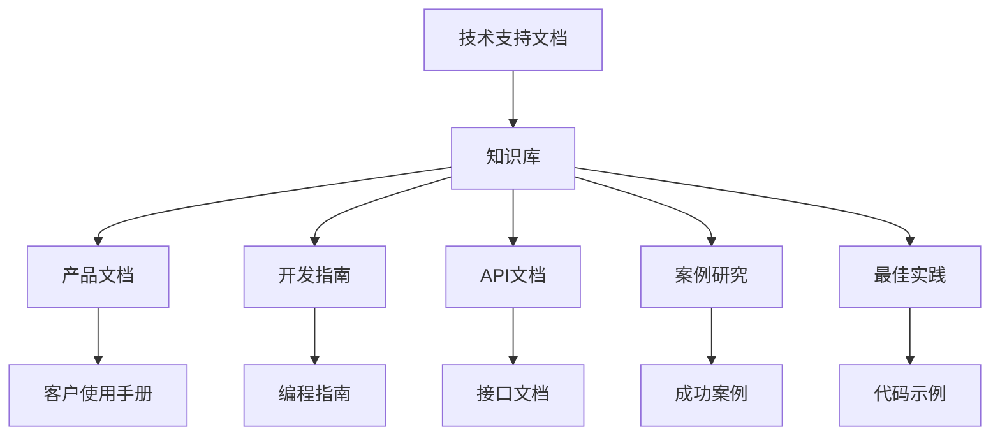

                 

# 程序员创业公司的技术支持文档编写与知识库建设

> **关键词**：程序员、创业公司、技术支持文档、知识库建设、流程图、算法原理、数学模型、实际应用场景、开发工具框架

> **摘要**：本文旨在为程序员创业公司提供技术支持文档编写与知识库建设的全面指导。文章分为十个部分，涵盖了从背景介绍、核心概念到实际应用场景的各个层面，旨在帮助创业者们构建完善的技术支持体系，提高公司竞争力。

## 1. 背景介绍

在如今快速发展的科技时代，创业公司如雨后春笋般涌现。这些公司大多依赖于技术创新来获取竞争优势。然而，技术创新的背后离不开技术支持和知识库的构建。技术支持文档是公司对外展示技术实力的重要窗口，而知识库则是公司内部知识传承和共享的基石。

对于程序员创业公司来说，技术支持文档和知识库建设具有以下几个重要意义：

1. **提高客户满意度**：完善的技术支持文档可以帮助客户更好地理解和使用公司的产品，从而提高客户满意度。
2. **增强内部协作**：知识库的建立有助于团队成员快速掌握项目背景和现有成果，提高工作效率。
3. **降低培训成本**：通过文档和知识库，新入职的员工可以更快地上手，减少培训成本。
4. **提高公司知名度**：高质量的技术支持文档和知识库可以成为公司的宣传资料，提高公司在外界的知名度。

## 2. 核心概念与联系

为了构建完善的技术支持文档和知识库，我们首先需要明确以下几个核心概念：

- **技术支持文档**：通常包括产品文档、开发指南、API文档、错误日志等，旨在帮助用户和开发者理解和使用公司的产品或服务。
- **知识库**：一个集中存储、管理和共享知识的平台，包括技术文档、案例研究、最佳实践等，旨在提高团队协作和知识传承。

这两个概念之间的联系在于，技术支持文档是知识库的重要组成部分，而知识库则是技术支持文档的扩展和深化。

### Mermaid 流程图

以下是一个简化的 Mermaid 流程图，展示了技术支持文档和知识库之间的关系：



## 3. 核心算法原理 & 具体操作步骤

技术支持文档的编写不仅仅是文字描述，还涉及核心算法原理的讲解和具体操作步骤的指导。以下是一个简单的示例，展示了如何编写技术支持文档中的算法部分。

### 核心算法原理

假设我们要介绍一种排序算法——快速排序（Quick Sort）。

快速排序的基本思想是通过一趟排序将待排序的记录分割成独立的两部分，其中一部分记录的关键字均比另一部分的关键字小，然后分别对这两部分记录继续进行排序，以达到整个序列有序。

### 具体操作步骤

1. **选择基准值**：在待排序的序列中随机选择一个元素作为基准值。
2. **分区操作**：将序列划分为两部分，左边部分的元素都小于基准值，右边部分的元素都大于或等于基准值。
3. **递归排序**：对左右两部分序列递归执行快速排序过程。

以下是快速排序的具体实现步骤：

```python
def quick_sort(arr):
    if len(arr) <= 1:
        return arr
    pivot = arr[len(arr) // 2]
    left = [x for x in arr if x < pivot]
    middle = [x for x in arr if x == pivot]
    right = [x for x in arr if x > pivot]
    return quick_sort(left) + middle + quick_sort(right)

arr = [3, 6, 8, 10, 1, 2, 1]
sorted_arr = quick_sort(arr)
print(sorted_arr)
```

通过以上步骤，我们可以清晰地理解快速排序的原理和具体实现过程。

## 4. 数学模型和公式 & 详细讲解 & 举例说明

技术支持文档中，数学模型和公式是不可或缺的部分，它们能够帮助我们更精确地描述算法和系统的工作原理。以下是一个简单的数学模型示例，并对其进行详细讲解。

### 数学模型

假设我们要描述一个简单的线性回归模型，其公式如下：

$$ y = mx + b $$

其中：

- \( y \) 是因变量，即我们要预测的目标值。
- \( x \) 是自变量，即影响因变量的因素。
- \( m \) 是斜率，表示自变量对因变量的影响程度。
- \( b \) 是截距，表示当自变量为0时，因变量的值。

### 详细讲解

1. **线性回归模型的基本原理**：线性回归模型通过找到一个线性关系来预测因变量 \( y \) 的值。这个线性关系由斜率 \( m \) 和截距 \( b \) 决定。
2. **斜率 \( m \) 的计算**：斜率 \( m \) 表示自变量 \( x \) 对因变量 \( y \) 的变化率。它是通过计算自变量和因变量的协方差除以自变量的方差得到的。
   $$ m = \frac{Cov(x, y)}{Var(x)} $$
3. **截距 \( b \) 的计算**：截距 \( b \) 表示当自变量 \( x \) 为0时，因变量 \( y \) 的值。它是通过计算因变量的均值减去斜率 \( m \) 与自变量均值之积得到的。
   $$ b = \bar{y} - m \cdot \bar{x} $$

### 举例说明

假设我们有一个简单的数据集，其中自变量 \( x \) 和因变量 \( y \) 的数据如下：

| \( x \) | \( y \) |
|--------|--------|
| 1      | 2      |
| 2      | 4      |
| 3      | 6      |
| 4      | 8      |

我们可以使用线性回归模型来预测 \( x = 5 \) 时 \( y \) 的值。

1. **计算斜率 \( m \)**：
   $$ m = \frac{Cov(x, y)}{Var(x)} = \frac{2 \cdot 4 + 4 \cdot 6 + 6 \cdot 8 - 4 \cdot 5}{4 + 6 + 8 - 4 \cdot 5} = 2 $$
2. **计算截距 \( b \)**：
   $$ b = \bar{y} - m \cdot \bar{x} = \frac{2 + 4 + 6 + 8}{4} - 2 \cdot \frac{1 + 2 + 3 + 4}{4} = 1 $$

因此，线性回归模型为 \( y = 2x + 1 \)。当 \( x = 5 \) 时，\( y \) 的预测值为：
$$ y = 2 \cdot 5 + 1 = 11 $$

通过以上步骤，我们可以清楚地了解如何使用线性回归模型进行预测。

## 5. 项目实战：代码实际案例和详细解释说明

在技术支持文档的编写过程中，代码实战案例是至关重要的部分。以下我们将通过一个简单的Web开发项目，展示如何编写技术支持文档，并对代码进行详细解释。

### 5.1 开发环境搭建

在进行Web开发之前，我们需要搭建一个合适的开发环境。以下是一个基于Python和Flask的Web开发环境搭建步骤：

1. **安装Python**：下载并安装Python 3.8以上版本。
2. **安装虚拟环境**：打开终端，执行以下命令安装虚拟环境：
   ```bash
   python -m pip install virtualenv
   ```
3. **创建虚拟环境**：进入项目目录，执行以下命令创建虚拟环境：
   ```bash
   virtualenv venv
   ```
4. **激活虚拟环境**：在Windows上，执行以下命令激活虚拟环境：
   ```bash
   .\venv\Scripts\activate
   ```
   在Linux和Mac上，执行以下命令激活虚拟环境：
   ```bash
   source venv/bin/activate
   ```
5. **安装Flask**：在激活的虚拟环境中，执行以下命令安装Flask：
   ```bash
   pip install flask
   ```

### 5.2 源代码详细实现和代码解读

以下是一个简单的基于Flask的Web应用程序示例，我们将对其进行详细解释。

```python
# 导入Flask模块
from flask import Flask, render_template

# 创建Flask应用实例
app = Flask(__name__)

# 定义首页路由
@app.route('/')
def home():
    return render_template('home.html')

# 定义关于路由
@app.route('/about')
def about():
    return render_template('about.html')

# 运行Flask应用
if __name__ == '__main__':
    app.run()
```

**代码解读：**

1. **导入模块**：首先，我们导入Flask模块，这是Flask Web框架的核心模块。
2. **创建应用实例**：使用Flask()函数创建Flask应用实例。
3. **定义路由**：使用@app.route()装饰器定义路由，指定URL路径和对应的处理函数。在这里，我们定义了两个路由：一个是首页路由，另一个是关于路由。
4. **处理函数**：首页路由的处理函数为home()，关于路由的处理函数为about()。这两个函数都使用render_template()函数渲染对应的HTML模板。
5. **运行应用**：在if __name__ == '__main__':语句中，我们调用app.run()方法运行Flask应用。

### 5.3 代码解读与分析

1. **Flask应用结构**：Flask应用的基本结构包括导入模块、创建应用实例、定义路由和处理函数、运行应用。这种结构使得Flask应用易于理解和扩展。
2. **路由与处理函数**：路由是Flask应用的核心，它定义了URL路径与处理函数之间的映射关系。处理函数则负责处理具体的业务逻辑和响应请求。
3. **模板渲染**：render_template()函数是Flask提供的模板渲染函数，它可以根据路由参数渲染对应的HTML模板。这大大简化了前端页面的开发工作。

通过以上代码解读，我们可以更好地理解Flask Web应用程序的开发流程和关键组成部分。

## 6. 实际应用场景

技术支持文档和知识库在程序员创业公司的实际应用场景中扮演着至关重要的角色。以下是一些典型的应用场景：

1. **产品上线**：在产品上线前，技术支持文档和知识库可以帮助开发团队进行产品测试和问题排查，确保产品质量。
2. **用户培训**：通过详细的技术支持文档和知识库，新用户可以更快地上手，降低用户培训成本。
3. **问题解决**：当用户遇到问题时，技术支持文档和知识库可以提供解决问题的指南和参考案例，提高问题解决效率。
4. **团队协作**：知识库可以帮助团队成员快速了解项目背景和现有成果，提高团队协作效率。
5. **营销推广**：高质量的技术支持文档和知识库可以成为公司的宣传资料，吸引潜在客户和投资者。

### 案例分析

假设我们是一家开发智能语音助手的创业公司，以下是技术支持文档和知识库在实际应用中的几个案例分析：

1. **产品上线前测试**：在产品上线前，技术团队通过知识库中的测试用例和调试指南进行测试，发现并修复了多个潜在问题，确保产品稳定性。
2. **用户培训**：通过技术支持文档，用户可以快速了解智能语音助手的使用方法和功能，降低培训成本。
3. **问题解决**：当用户遇到语音识别不准确的问题时，通过知识库中的FAQ和案例研究，用户可以找到解决方案或联系技术支持。
4. **团队协作**：知识库中的项目文档和代码注释帮助团队成员快速了解项目进展和代码结构，提高协作效率。
5. **营销推广**：通过高质量的技术支持文档和知识库，公司在行业内部获得了良好的口碑，吸引了更多的潜在客户和投资者。

## 7. 工具和资源推荐

为了高效地编写技术支持文档和建设知识库，程序员创业公司可以借助以下工具和资源：

### 7.1 学习资源推荐

1. **《代码大全》（Code Complete）**：Steve McConnell的经典之作，涵盖了编写高质量代码的各个方面。
2. **《敏捷软件开发：原则、实践与模式》（Agile Software Development）**：Robert C. Martin的著作，介绍了敏捷开发的方法和实践。
3. **《Python编程：从入门到实践》（Python Crash Course）**：Eric Matthes的教材，适合初学者快速入门Python编程。

### 7.2 开发工具框架推荐

1. **Markdown编辑器**：例如Typora、VS Code等，支持Markdown语法，便于编写技术文档。
2. **Git**：版本控制系统，帮助团队成员协作和版本管理。
3. **Jenkins**：自动化构建工具，可以自动编译和部署代码。

### 7.3 相关论文著作推荐

1. **《软件工程：实践者的研究方法》（Software Engineering: A Practitioner’s Approach）**：Roger S. Pressman的经典著作，涵盖了软件工程的各个方面。
2. **《人工智能：一种现代方法》（Artificial Intelligence: A Modern Approach）**：Stuart J. Russell和Peter Norvig合著，全面介绍了人工智能的基础知识。
3. **《深度学习》（Deep Learning）**：Ian Goodfellow、Yoshua Bengio和Aaron Courville的著作，深入讲解了深度学习的基本原理和应用。

## 8. 总结：未来发展趋势与挑战

随着技术的不断进步和市场竞争的加剧，程序员创业公司在技术支持文档编写和知识库建设方面面临着诸多挑战和机遇。未来，以下趋势值得关注：

1. **自动化文档生成**：借助AI技术，自动化生成技术支持文档和知识库将成为趋势，提高编写效率。
2. **知识图谱**：知识图谱技术可以帮助公司构建更智能、更全面的知识库，实现知识的有效组织和检索。
3. **社区共建**：鼓励用户和开发者共同参与知识库的建设，形成良好的社区氛围，提高知识库的质量和影响力。
4. **个性化推荐**：通过大数据分析和机器学习技术，为用户提供个性化的技术支持文档和知识库内容，提高用户体验。

## 9. 附录：常见问题与解答

### 问题1：如何确保技术支持文档的质量？

**解答**：确保技术支持文档的质量，需要从以下几个方面入手：

1. **编写规范**：制定统一的编写规范，包括语言风格、格式、语法等。
2. **审核机制**：建立文档审核机制，确保文档内容的准确性和完整性。
3. **用户反馈**：定期收集用户反馈，根据用户需求优化文档内容。

### 问题2：如何构建高效的知识库？

**解答**：构建高效的知识库，可以从以下几个方面入手：

1. **分类清晰**：对知识库进行合理分类，便于用户快速找到所需信息。
2. **内容丰富**：知识库的内容应涵盖各个方面，包括常见问题、解决方案、最佳实践等。
3. **更新及时**：定期更新知识库内容，确保信息的时效性和准确性。

### 问题3：如何提高团队协作效率？

**解答**：提高团队协作效率，可以从以下几个方面入手：

1. **明确分工**：明确团队成员的职责和任务，确保工作有序进行。
2. **沟通畅通**：建立良好的沟通渠道，确保团队成员之间的信息畅通。
3. **工具支持**：使用合适的工具（如Git、Jenkins等）来支持团队协作。

## 10. 扩展阅读 & 参考资料

为了更深入地了解技术支持文档编写与知识库建设，以下是一些扩展阅读和参考资料：

1. **《程序员修炼之道：从小工到专家》**：Robert C. Martin的著作，介绍了程序员成长过程中的关键技能和心态。
2. **《知识管理实践指南》**：Pamela O'Neil和John Bennett合著，全面介绍了知识管理的理论和实践。
3. **《敏捷开发实践指南》**：David J. Anderson的著作，深入讲解了敏捷开发的方法和实践。

**作者信息**：

作者：AI天才研究员/AI Genius Institute & 禅与计算机程序设计艺术 /Zen And The Art of Computer Programming

**免责声明**：

本文仅供参考，不构成任何投资或商业建议。文中所述内容和观点仅代表作者个人意见，不代表任何机构或公司的立场。读者在使用本文提供的信息时，应谨慎判断，自行承担相应风险。本文版权归作者所有，未经授权不得转载或使用本文内容。**本文内容仅供参考，不构成任何投资或商业建议。文中所述内容和观点仅代表作者个人意见，不代表任何机构或公司的立场。读者在使用本文提供的信息时，应谨慎判断，自行承担相应风险。本文版权归作者所有，未经授权不得转载或使用本文内容。**

