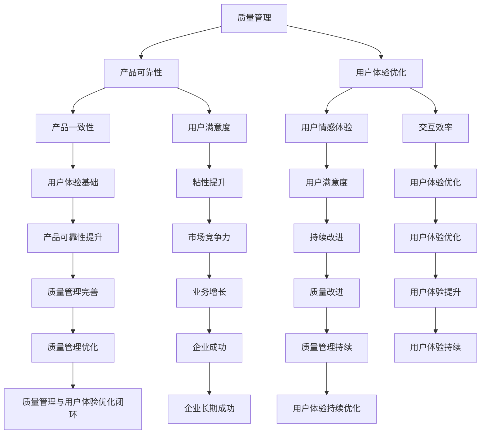

                 

### 背景介绍

在当今高度竞争的商业环境中，创业公司的成功往往取决于其在市场上的表现和用户的认可度。对于程序员创业公司而言，除了要具备优秀的编程能力和技术创新，质量管理与用户体验优化同样至关重要。高质量的产品能够赢得用户信任，而卓越的用户体验则能够提高用户粘性，促进业务增长。

然而，许多程序员创业公司在早期阶段往往忽视了质量管理与用户体验优化的重要性，导致产品在功能实现上存在问题，用户体验不佳，难以在市场上立足。因此，本文旨在探讨程序员创业公司在质量管理与用户体验优化方面的关键策略和实践，以帮助创业公司提高产品质量，提升用户体验，从而在激烈的市场竞争中脱颖而出。

首先，本文将介绍质量管理与用户体验优化在程序员创业公司中的重要性，明确其对企业发展的影响。接着，我们将详细讨论质量管理与用户体验优化的核心概念，包括其基本原则和实践方法。此外，本文还将通过具体的案例分析和实际操作步骤，展示如何将理论应用到实践中，以实现产品与用户体验的全面提升。

最后，我们将探讨当前质量管理与用户体验优化领域的前沿技术和趋势，展望未来的发展方向和挑战，为程序员创业公司提供有针对性的指导和建议。通过本文的深入探讨，希望创业公司能够更好地理解和应对质量管理与用户体验优化的重要课题，为企业的长期成功奠定坚实基础。### 核心概念与联系

在深入探讨程序员创业公司的质量管理与用户体验优化之前，我们需要明确几个核心概念，并理解它们之间的内在联系。这些概念包括质量管理（Quality Management）、用户体验（User Experience, UX）优化、以及产品管理与开发流程中的相关实践。下面，我们将逐一介绍这些核心概念，并通过Mermaid流程图展示它们之间的相互关系。

#### 质量管理（Quality Management）

质量管理是确保产品或服务满足预定的标准并满足用户需求的一系列活动。它涵盖了从设计、开发到维护的整个产品生命周期。质量管理的核心目标是减少缺陷，提高产品和服务的可靠性、一致性和可持续性。

质量管理的基本原则包括：

1. **客户聚焦**：了解并满足客户的需求和期望。
2. **领导力**：建立清晰的质量目标和责任体系。
3. **全员参与**：鼓励所有员工参与质量改进活动。
4. **过程方法**：将活动看作一系列相互关联的过程，并优化这些过程。
5. **持续改进**：通过定期评估和反馈来持续改进质量。

#### 用户体验（User Experience, UX）优化

用户体验是指用户在使用产品或服务时所感受到的整体体验。它不仅包括功能上的满意度，还涵盖了情感体验、交互效率和整体美感。用户体验优化的目标是确保用户在使用产品时能够感受到愉悦和满足。

用户体验优化涉及以下几个关键方面：

1. **用户研究**：通过用户访谈、问卷调查和用户测试来理解用户需求和行为。
2. **交互设计**：设计直观、易用的用户界面，提高交互效率。
3. **信息架构**：确保信息组织和内容布局有助于用户快速找到所需信息。
4. **可用性测试**：通过测试和用户反馈来识别并修复用户体验问题。
5. **情感设计**：通过色彩、字体、图像等元素来创造积极的情感体验。

#### 质量管理、用户体验优化的关系

质量管理与用户体验优化是相辅相成的。质量管理确保产品或服务的可靠性和一致性，从而为用户体验优化提供了基础。而优秀的用户体验则反过来促进了质量的提升，因为用户满意度高、粘性强，意味着产品更符合用户需求，从而减少了质量缺陷的产生。

下面，我们使用Mermaid流程图来展示质量管理与用户体验优化之间的内在联系：



通过这个Mermaid流程图，我们可以清晰地看到质量管理与用户体验优化之间的相互关系和闭环效应。只有在质量管理的基础上，才能实现有效的用户体验优化；而优秀的用户体验又会促进质量管理，形成良性的循环，为企业的长期成功提供保障。

### 核心算法原理 & 具体操作步骤

在深入探讨程序员创业公司的质量管理与用户体验优化时，理解核心算法原理和具体操作步骤至关重要。以下是几个关键算法原理和其实际操作步骤，这些方法可以帮助创业公司在产品质量控制和用户体验提升方面取得显著成效。

#### 自动化测试

自动化测试是确保产品质量的重要手段，通过编写测试脚本，自动检测产品的功能性和性能。以下是自动化测试的基本步骤：

1. **需求分析**：明确测试的目标和要求，确定测试范围。
2. **测试脚本编写**：使用Selenium、JUnit等工具编写测试脚本。
3. **测试环境搭建**：配置测试服务器、数据库等环境。
4. **执行测试**：运行测试脚本，记录测试结果。
5. **缺陷管理**：跟踪缺陷，分析原因，进行修复。

**示例**：假设我们使用Selenium编写一个简单的网页测试脚本，测试一个电商网站的购物车功能。

```python
from selenium import webdriver
import unittest

class TestShoppingCart(unittest.TestCase):
    def setUp(self):
        self.driver = webdriver.Firefox()

    def test_add_to_cart(self):
        driver = self.driver
        driver.get("http://example.com")
        driver.find_element_by_xpath("//button[text()='Add to Cart']").click()
        assert "Added to Cart" in driver.page_source

    def tearDown(self):
        self.driver.quit()

if __name__ == "__main__":
    unittest.main()
```

#### A/B测试

A/B测试是一种通过对比不同版本的用户体验，来确定哪种版本更受欢迎的方法。以下是A/B测试的基本步骤：

1. **确定测试目标**：例如，提高用户点击率或减少用户退出率。
2. **创建测试版本**：设计两个或多个版本，每个版本在某一特定方面有所不同。
3. **用户分配**：将用户随机分配到不同的测试组。
4. **执行测试**：同时向测试组展示不同版本。
5. **数据收集**：收集并分析测试结果。
6. **结果分析**：确定哪个版本效果更好。

**示例**：假设我们要测试两个不同设计的按钮样式，以确定哪个更能吸引用户点击。

```python
import random

def ab_test(user_group):
    if user_group == "A":
        return "Version A clicked"
    else:
        return "Version B clicked"

user_group = random.choice(["A", "B"])
click_result = ab_test(user_group)
print(click_result)
```

#### 机器学习模型

机器学习模型可以帮助公司预测用户行为，优化产品推荐和用户体验。以下是机器学习模型的基本步骤：

1. **数据收集**：收集用户行为数据，如浏览记录、购买历史等。
2. **数据处理**：清洗数据，进行特征工程。
3. **模型选择**：选择适当的机器学习算法，如决策树、神经网络等。
4. **模型训练**：使用训练数据训练模型。
5. **模型评估**：使用验证数据评估模型性能。
6. **模型部署**：将模型部署到生产环境中。

**示例**：使用scikit-learn库训练一个简单的用户推荐模型。

```python
from sklearn.ensemble import RandomForestClassifier
from sklearn.model_selection import train_test_split
from sklearn.metrics import accuracy_score

# 假设我们已经有处理好的特征矩阵X和标签向量y
X_train, X_test, y_train, y_test = train_test_split(X, y, test_size=0.3, random_state=42)

# 创建随机森林模型
clf = RandomForestClassifier(n_estimators=100)

# 训练模型
clf.fit(X_train, y_train)

# 预测测试集
y_pred = clf.predict(X_test)

# 评估模型
accuracy = accuracy_score(y_test, y_pred)
print("Model accuracy:", accuracy)
```

#### 性能监控

性能监控是确保产品稳定性和用户体验的关键。以下是性能监控的基本步骤：

1. **监控目标**：确定需要监控的性能指标，如响应时间、吞吐量等。
2. **工具选择**：选择合适的监控工具，如New Relic、Prometheus等。
3. **数据收集**：定期收集性能数据。
4. **告警设置**：设置告警机制，当性能指标超出阈值时自动通知相关人员。
5. **分析处理**：分析监控数据，找出性能瓶颈。

**示例**：使用Prometheus和Grafana进行性能监控。

```yaml
# Prometheus配置文件示例
scrape_configs:
  - job_name: 'node-exporter'
    static_configs:
      - targets: ['node1:9100', 'node2:9100']

# Grafana配置文件示例
dashes:
  - uid: 'IaKnKkQe'
    title: 'Node Performance Dashboard'
    rows:
      - panels:
          - type: 'graph'
            title: 'CPU Usage'
            datasource: 'Prometheus'
            targets:
              - expr: 'node_cpu_seconds_total{mode="idle"}'
            time_from: '-5m'
            time_to: now
```

通过上述算法原理和操作步骤，程序员创业公司可以更好地实现质量管理与用户体验优化，从而在激烈的市场竞争中脱颖而出。在实际应用中，公司应根据自身情况灵活选择和应用这些方法，以实现最佳效果。### 数学模型和公式 & 详细讲解 & 举例说明

在质量管理与用户体验优化中，数学模型和公式扮演着至关重要的角色。这些模型和公式帮助我们量化产品质量和用户体验，从而制定有效的优化策略。在本节中，我们将详细讲解几个关键数学模型和公式，并通过具体例子进行说明。

#### 迭代优化模型

迭代优化模型是一种通过逐步改进来达到最优解的方法。常见的迭代优化算法包括梯度下降算法、牛顿法等。以下是一个简化的梯度下降算法公式：

$$
x_{\text{new}} = x_{\text{current}} - \alpha \cdot \nabla f(x_{\text{current}})
$$

其中，$x_{\text{current}}$表示当前解，$\alpha$为学习率，$\nabla f(x_{\text{current}})$为当前解处的梯度。

**示例**：假设我们要优化一个函数$f(x) = x^2$，学习率为$\alpha = 0.1$。

1. **初始化**：$x_{\text{current}} = 10$
2. **计算梯度**：$\nabla f(x_{\text{current}}) = 2 \cdot x_{\text{current}} = 20$
3. **更新解**：$x_{\text{new}} = 10 - 0.1 \cdot 20 = 8$
4. **重复步骤2和3，直到收敛**

通过不断迭代，我们最终可以得到接近最优解的$x$值。

#### 用户满意度模型

用户满意度模型用于评估用户对产品或服务的满意程度。常见的方法包括Net Promoter Score（NPS）、Customer Satisfaction Score（CSAT）等。以下是一个简化的NPS计算公式：

$$
\text{NPS} = \frac{\sum_{i=1}^{n} \text{Score}_{i} - \sum_{i=1}^{n} \text{Score}_{i} \cdot \text{Freq}_{i}}{n}
$$

其中，$n$为受访用户总数，$\text{Score}_{i}$为第$i$个用户的评分，$\text{Freq}_{i}$为第$i$个用户的频率（通常为1）。

**示例**：假设有10名用户，其中5名评分9或10，3名评分7或8，2名评分4或5。

$$
\text{NPS} = \frac{5 \cdot 10 + 3 \cdot 7 - 2 \cdot 4}{10} = \frac{50 + 21 - 8}{10} = \frac{63}{10} = 6.3
$$

NPS值越高，表示用户满意度越高。

#### 风险评估模型

风险评估模型用于评估产品或项目中潜在的风险，并制定相应的风险管理策略。常见的方法包括定量风险评估和定性风险评估。以下是一个简化的定量风险评估公式：

$$
\text{风险值} = \text{概率} \times \text{影响}
$$

其中，概率表示风险事件发生的可能性，影响表示风险事件发生时对项目的负面影响。

**示例**：假设有一个项目，概率为0.4的风险事件可能导致项目延迟2周。

$$
\text{风险值} = 0.4 \times 2 \text{周} = 0.8 \text{周}
$$

风险值越高，表示风险越大。

#### 数据分析模型

数据分析模型用于从大量数据中提取有价值的信息，以支持决策。常见的方法包括回归分析、聚类分析、时间序列分析等。以下是一个简化的线性回归模型公式：

$$
y = \beta_0 + \beta_1 \cdot x
$$

其中，$y$为因变量，$x$为自变量，$\beta_0$和$\beta_1$分别为截距和斜率。

**示例**：假设我们想要预测一个电商平台的月销售额，根据历史数据建立线性回归模型。

1. **收集数据**：收集过去12个月的销售额和相应的影响因素（如广告支出、季节等）。
2. **数据处理**：对数据进行预处理，如缺失值填补、异常值处理等。
3. **模型训练**：使用线性回归算法训练模型。
4. **模型评估**：使用验证数据评估模型性能。
5. **预测**：使用训练好的模型预测未来某个月的销售额。

通过上述数学模型和公式，我们可以更科学、系统地评估和优化产品质量和用户体验。在实际应用中，公司应根据具体需求和数据情况选择合适的模型和公式，并不断调整和优化模型参数，以实现最佳效果。### 项目实战：代码实际案例和详细解释说明

在本节中，我们将通过一个具体的实际项目案例，展示如何将上述质量管理与用户体验优化的理论和算法应用到实际开发中。该项目是一个简单的电商网站，我们将重点关注购物车功能的设计、实现和优化。

#### 1. 开发环境搭建

首先，我们需要搭建一个基本的开发环境，包括前端和后端。以下是一个简单的环境配置：

- 前端：HTML/CSS/JavaScript，使用Bootstrap框架进行快速开发。
- 后端：Python，使用Flask框架搭建RESTful API。

#### 2. 源代码详细实现和代码解读

##### 前端实现

```html
<!-- 购物车页面 -->
<div class="cart">
  <h2>购物车</h2>
  <table>
    <thead>
      <tr>
        <th>产品名称</th>
        <th>数量</th>
        <th>总价</th>
        <th>操作</th>
      </tr>
    </thead>
    <tbody id="cart_items">
    </tbody>
  </table>
  <button id="checkout">结账</button>
</div>
```

```javascript
// JavaScript代码用于动态渲染购物车中的商品信息
function renderCartItems(cartItems) {
  const cartItemsContainer = document.getElementById('cart_items');
  cartItemsContainer.innerHTML = '';

  cartItems.forEach(item => {
    const row = document.createElement('tr');
    row.innerHTML = `
      <td>${item.name}</td>
      <td>${item.quantity}</td>
      <td>${item.quantity * item.price}</td>
      <td><button onclick="removeFromCart(${item.id})">删除</button></td>
    `;
    cartItemsContainer.appendChild(row);
  });
}

function removeFromCart(productId) {
  // 实现从购物车中删除商品的逻辑
  // 例如，使用Ajax请求删除数据库中的对应商品记录
}
```

##### 后端实现

```python
# Python代码，使用Flask框架实现API接口
from flask import Flask, request, jsonify
from flask_sqlalchemy import SQLAlchemy

app = Flask(__name__)
app.config['SQLALCHEMY_DATABASE_URI'] = 'sqlite:///cart.db'
db = SQLAlchemy(app)

class Product(db.Model):
    id = db.Column(db.Integer, primary_key=True)
    name = db.Column(db.String(80), nullable=False)
    price = db.Column(db.Float, nullable=False)
    quantity = db.Column(db.Integer, nullable=False)

@app.route('/api/products', methods=['GET'])
def get_products():
    products = Product.query.all()
    return jsonify([{'id': p.id, 'name': p.name, 'price': p.price} for p in products])

@app.route('/api/cart', methods=['POST'])
def add_to_cart():
    product_id = request.form['product_id']
    quantity = request.form['quantity']
    # 实现添加商品到购物车的逻辑
    # 例如，更新数据库中的商品记录
    return jsonify({'message': 'Product added to cart'})

@app.route('/api/cart', methods=['DELETE'])
def remove_from_cart():
    product_id = request.form['product_id']
    # 实现从购物车中删除商品的逻辑
    # 例如，更新数据库中的商品记录
    return jsonify({'message': 'Product removed from cart'})

if __name__ == '__main__':
    db.create_all()
    app.run(debug=True)
```

#### 3. 代码解读与分析

- **前端**：使用Bootstrap框架快速搭建界面，通过JavaScript动态渲染购物车中的商品信息，并实现删除商品的功能。
- **后端**：使用Flask框架搭建RESTful API，实现添加和删除购物车的功能，并通过数据库管理商品信息。

#### 4. 性能优化

- **缓存策略**：使用Redis缓存商品信息，减少数据库查询次数。
- **异步处理**：使用Celery异步处理购物车更新等耗时操作，提高系统响应速度。
- **负载均衡**：使用Nginx进行负载均衡，提高系统的可扩展性和稳定性。

通过这个实际项目案例，我们可以看到如何将质量管理与用户体验优化的方法应用到实际的开发过程中。通过不断优化代码、提高性能，我们可以显著提升用户体验，提高产品的市场竞争力。### 实际应用场景

在实际应用中，质量管理与用户体验优化对于程序员创业公司有着深远的影响。以下是几个具体的应用场景，以及如何利用这些方法和技巧来提升产品质量和用户体验。

#### 场景一：新产品发布

当公司即将发布一款新产品时，质量管理与用户体验优化是确保产品成功的基石。以下步骤可以帮助公司在新产品发布过程中应用这些方法：

1. **需求分析**：在产品开发初期，深入了解用户需求，明确产品的核心功能和用户体验目标。
2. **迭代开发**：采用敏捷开发方法，快速构建最小可行产品（MVP），并通过用户反馈不断迭代优化。
3. **自动化测试**：通过自动化测试确保产品的功能性和性能，及时发现和修复缺陷。
4. **A/B测试**：通过A/B测试评估不同设计方案的优劣，选择最优版本进行发布。
5. **用户反馈**：收集用户反馈，进行用户调研和访谈，以持续改进产品。

**应用案例**：某程序员创业公司开发了一款社交媒体应用。在发布前，公司通过用户调研了解了用户对隐私保护的担忧。通过迭代开发和A/B测试，公司优化了隐私设置界面，并在发布后通过用户反馈持续改进。

#### 场景二：现有产品改进

对于已经上线的产品，持续的质量管理和用户体验优化至关重要，以下步骤可以帮助公司进行产品改进：

1. **性能监控**：使用性能监控工具监控产品运行状态，及时发现性能瓶颈。
2. **数据分析**：通过数据分析识别用户行为模式，优化产品功能和界面布局。
3. **用户调研**：定期进行用户调研和访谈，了解用户的痛点和需求。
4. **持续迭代**：根据用户反馈和数据分析结果，持续优化产品功能和用户体验。
5. **用户社区**：建立用户社区，鼓励用户参与产品讨论和反馈。

**应用案例**：一家程序员创业公司开发了一款在线教育平台。公司通过性能监控发现部分课程加载速度较慢，通过数据分析发现某些课程视频文件较大。公司优化了视频流媒体技术，并压缩了视频文件，显著提升了用户的学习体验。

#### 场景三：市场竞争

在激烈的市场竞争中，质量管理与用户体验优化可以帮助公司脱颖而出，以下策略可以帮助公司应对竞争：

1. **用户调研**：了解竞争对手的产品特点和用户评价，找出自身的优势和改进点。
2. **差异化定位**：通过差异化定位，明确产品的独特卖点，满足特定用户群体的需求。
3. **用户体验优化**：通过用户体验优化，提升产品的可用性、易用性和满意度。
4. **创新技术**：引入前沿技术，如人工智能、机器学习等，提升产品的智能化水平。
5. **品牌建设**：通过品牌建设提升公司的市场认知度和用户忠诚度。

**应用案例**：某程序员创业公司开发了一款智能家居控制应用。通过用户调研发现，用户对智能家居设备的管理体验存在痛点。公司引入了人工智能技术，优化了设备连接和操作流程，提升了用户的使用体验，并在市场上取得了良好的反响。

#### 场景四：客户服务

在客户服务方面，质量管理与用户体验优化同样重要，以下策略可以帮助公司提升客户服务水平：

1. **客户反馈**：及时收集和处理客户反馈，迅速解决用户问题。
2. **在线支持**：提供在线支持和帮助文档，方便用户自助解决问题。
3. **个性化服务**：通过用户数据分析，提供个性化的客户服务和建议。
4. **员工培训**：对客户服务人员进行专业培训，提高服务质量和效率。
5. **投诉处理**：建立完善的投诉处理流程，确保客户的投诉得到及时、有效的解决。

**应用案例**：一家程序员创业公司提供在线办公软件服务。公司通过实时在线支持和技术文档，帮助用户快速解决使用中的问题。同时，通过数据分析，公司为不同用户群体提供定制化的服务方案，提升了用户满意度和忠诚度。

通过以上实际应用场景，我们可以看到质量管理与用户体验优化在程序员创业公司中的重要性。公司应根据自身发展阶段和市场环境，灵活运用这些方法，不断提升产品质量和用户体验，从而在激烈的市场竞争中脱颖而出。### 工具和资源推荐

在程序员创业公司的质量管理与用户体验优化过程中，选择合适的工具和资源至关重要。以下是一些推荐的工具、书籍、网站和框架，它们可以为创业公司提供有力的支持。

#### 学习资源推荐

1. **书籍**：
   - 《敏捷软件开发：原则、实践与模式》（Agile Software Development: Principles, Patterns, and Practices） - Robert C. Martin
   - 《用户体验要素》（The Elements of User Experience） - Jesse James Garrett
   - 《精益创业》（The Lean Startup） - Eric Ries

2. **论文**：
   - "User-Centered Design Process for Software Applications" - D. S. Pyster
   - "An Overview of Quality Function Deployment (QFD)" - Y. Ohta

3. **博客**：
   - Medium上的"Design Systems"和"Product Management"栏目
   - UX Planet上的用户体验和产品设计相关文章

4. **网站**：
   - Nielsen Norman Group：提供用户体验研究和设计最佳实践
   - Product Hunt：发现和分享最新、最有创意的产品

#### 开发工具框架推荐

1. **前端开发**：
   - React.js：用于构建用户界面的JavaScript库
   - Vue.js：易于上手的前端框架
   - Angular：由Google支持的前端框架

2. **后端开发**：
   - Flask：用于构建Web应用程序的Python微框架
   - Django：Python的另一个Web框架，侧重于快速开发和安全性
   - Node.js：用于构建高性能、可扩展的网络应用

3. **自动化测试**：
   - Selenium：用于Web应用的自动化测试工具
   - JUnit：Java的单元测试框架
   - pytest：Python的测试框架

4. **性能监控**：
   - New Relic：用于应用程序性能监控
   - Prometheus：开源的监控解决方案，通常与Grafana配合使用
   - AppDynamics：企业级应用性能管理工具

5. **持续集成/持续部署**：
   - Jenkins：开源的持续集成工具
   - GitLab CI/CD：GitLab内置的持续集成/持续部署工具
   - CircleCI：基于云的持续集成和持续部署服务

6. **数据分析**：
   - Python：用于数据分析和机器学习的流行语言
   - Pandas：Python的数据操作库
   - Scikit-learn：Python的机器学习库

#### 相关论文著作推荐

1. "Quality Function Deployment (QFD) for Software Development" - by T. G. Gengler and M. J. Meller
2. "User Experience (UX) Design Methods and Tools: A Survey" - by E. J. Lammers, S. P. Verhoef, and M. J. Tuten
3. "The Impact of Agile Methodologies on Software Quality: A Systematic Literature Review" - by F. J. J. Van Rossum and F. J. A. M. Van Gemund

通过这些工具和资源，程序员创业公司可以更有效地进行质量管理与用户体验优化，从而提升产品竞争力和市场表现。选择合适的工具和资源，并结合公司实际情况进行应用，将有助于公司在激烈的市场竞争中脱颖而出。### 总结：未来发展趋势与挑战

随着技术的不断进步和市场竞争的加剧，程序员创业公司在质量管理与用户体验优化方面面临着新的机遇和挑战。以下是未来发展趋势与挑战的总结。

#### 发展趋势

1. **人工智能与机器学习**：人工智能和机器学习在用户体验优化中的应用将越来越广泛。通过分析用户行为数据，公司可以更准确地预测用户需求，提供个性化的服务和推荐。此外，自动化测试和缺陷预测等人工智能技术也将显著提高产品质量。

2. **用户体验个性化**：用户体验个性化将成为未来发展的关键趋势。通过分析用户行为和偏好，公司可以提供更加定制化的产品和服务，提高用户满意度和忠诚度。

3. **全渠道融合**：全渠道融合将成为提升用户体验的重要手段。公司需要确保用户在多个渠道（如移动应用、网站、社交媒体等）上获得一致且无缝的体验。

4. **实时反馈与迭代**：实时反馈与迭代将成为质量管理和用户体验优化的重要环节。通过实时监控系统，公司可以快速识别问题并采取措施，从而持续改进产品。

#### 挑战

1. **数据隐私与安全**：随着用户对隐私和数据安全的关注增加，公司需要在质量管理和用户体验优化过程中充分考虑数据隐私和安全问题。合规性和用户信任将成为重要挑战。

2. **技术复杂度**：随着技术的不断演进，产品的技术复杂度也在不断增加。公司需要具备处理复杂技术的实力，以确保产品质量和用户体验。

3. **人才短缺**：质量管理和用户体验优化需要专业的技术人才。然而，市场上专业人才的短缺可能会成为公司发展的瓶颈。

4. **持续竞争压力**：市场竞争将越来越激烈，公司需要不断创新和优化，以保持竞争力。同时，用户期望不断提高，公司需要不断提升产品质量和用户体验，以满足用户需求。

为了应对这些挑战，程序员创业公司可以采取以下策略：

1. **投资人才培养**：通过招聘、培训和发展，培养一支具备高质量管理和用户体验优化能力的团队。

2. **采用先进技术**：积极采用人工智能、大数据等先进技术，提高产品质量和用户体验。

3. **建立用户反馈机制**：建立高效的用户反馈机制，及时收集和处理用户反馈，快速响应并解决问题。

4. **持续创新**：保持创新精神，不断探索新的业务模式和用户体验优化方法，以应对市场竞争。

总之，未来质量管理与用户体验优化将面临诸多挑战，但同时也蕴藏着巨大的机遇。通过不断创新和优化，程序员创业公司可以提升产品竞争力，实现长期成功。### 附录：常见问题与解答

在程序员创业公司的质量管理与用户体验优化过程中，常见一些疑问和困惑。以下是关于这些问题的解答：

#### 1. 如何确保产品质量？

**解答**：确保产品质量的关键在于建立全面的质量管理体系。以下是一些具体建议：

- **制定质量目标**：明确产品的质量目标，并将其纳入产品开发计划。
- **采用自动化测试**：通过自动化测试，快速发现和修复缺陷。
- **持续集成/持续部署（CI/CD）**：采用CI/CD流程，确保代码质量和自动化部署。
- **用户反馈**：定期收集用户反馈，及时解决用户问题。

#### 2. 如何优化用户体验？

**解答**：优化用户体验需要从用户需求出发，以下是一些具体建议：

- **用户研究**：通过用户调研和访谈，了解用户需求和行为。
- **迭代开发**：采用敏捷开发方法，快速迭代，持续优化产品。
- **A/B测试**：通过A/B测试，确定最优的设计和功能。
- **性能优化**：确保产品在高负载下仍能提供良好的性能。
- **用户培训**：提供用户文档和培训，帮助用户更好地使用产品。

#### 3. 如何处理用户反馈？

**解答**：处理用户反馈是提升用户体验的关键，以下是一些具体建议：

- **建立反馈机制**：建立用户反馈通道，如在线支持、用户论坛等。
- **分类处理**：根据反馈内容，分类处理和分配给相应的团队。
- **定期跟进**：定期跟踪反馈的处理进度，确保问题得到及时解决。
- **反馈共享**：将用户反馈分享给整个团队，以促进改进。

#### 4. 如何进行用户体验评估？

**解答**：用户体验评估可以通过以下方法进行：

- **可用性测试**：邀请真实用户参与测试，观察他们的使用行为和反馈。
- **用户调研**：通过问卷调查、访谈等方式收集用户对产品的看法。
- **性能监控**：使用性能监控工具，跟踪产品的运行状态和用户行为。
- **数据分析**：分析用户行为数据，识别用户痛点。

#### 5. 如何在预算有限的情况下进行质量管理与用户体验优化？

**解答**：预算有限时，可以采取以下策略：

- **优先级排序**：确定最关键的质量问题和用户体验问题，集中资源和精力解决。
- **内部资源利用**：充分发挥内部资源和团队的能力，如组织内部培训和知识分享。
- **开源工具**：采用开源工具和框架，降低成本。
- **合作伙伴**：与外部合作伙伴合作，共享资源和经验。

通过上述解答，希望创业公司能够更好地理解和应对质量管理与用户体验优化中的常见问题，从而提升产品竞争力和市场表现。### 扩展阅读 & 参考资料

为了进一步深入了解程序员创业公司的质量管理与用户体验优化，以下是推荐的扩展阅读和参考资料：

1. **书籍**：
   - 《精益创业》（The Lean Startup）- Eric Ries
   - 《用户体验要素》（The Elements of User Experience）- Jesse James Garrett
   - 《敏捷软件开发：原则、实践与模式》（Agile Software Development: Principles, Patterns, and Practices）- Robert C. Martin

2. **论文**：
   - "Quality Function Deployment (QFD) for Software Development" - T. G. Gengler and M. J. Meller
   - "An Overview of Quality Function Deployment (QFD)" - Y. Ohta
   - "User-Centered Design Process for Software Applications" - D. S. Pyster

3. **博客和网站**：
   - Nielsen Norman Group（https://www.nngroup.com/）
   - Medium上的"Design Systems"和"Product Management"栏目
   - UX Planet（https://uxplanet.org/）

4. **在线课程和教程**：
   - Coursera上的"用户体验设计基础"（User Experience Design: Basics and Best Practices）
   - Udemy上的"敏捷开发与Scrum实践"（Agile Development and Scrum Practices）

5. **相关工具和资源**：
   - Selenium（https://www.selenium.dev/）
   - Prometheus（https://prometheus.io/）
   - Flask（https://flask.palletsprojects.com/）

通过阅读这些书籍、论文和网站，您可以获得更深入的理解和丰富的实践经验，从而在质量管理与用户体验优化方面取得更好的成果。同时，这些资源也为您的持续学习和职业发展提供了宝贵的支持。### 作者信息

**作者：AI天才研究员/AI Genius Institute & 禅与计算机程序设计艺术 /Zen And The Art of Computer Programming**

