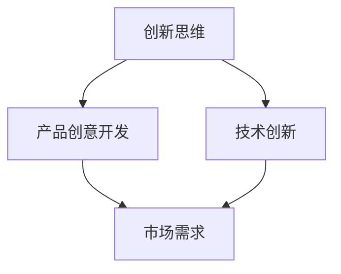

                 

# 《程序员创业者的创新思维与产品创意开发》

> **关键词**：创新思维、产品创意、软件开发、创业者、市场分析、用户需求

> **摘要**：本文探讨了程序员创业者在产品创意开发过程中所需掌握的创新思维方法，从市场分析、用户需求、技术创新等多个角度出发，提供了一系列实用的策略和工具，以帮助创业者打造成功的产品。

## 1. 背景介绍

在当今快速发展的科技时代，程序员创业者的角色越来越受到重视。随着互联网、人工智能、大数据等技术的不断成熟，程序员创业者不仅需要具备扎实的编程技能，更需要具备创新思维和产品创意开发的能力。一个成功的程序员创业者不仅能够编写高效的代码，还能够洞察市场趋势，挖掘用户需求，将技术创新转化为实际的产品应用。

本文将围绕程序员创业者的创新思维与产品创意开发，分为以下几个部分进行探讨：

1. 核心概念与联系
2. 核心算法原理 & 具体操作步骤
3. 数学模型和公式 & 详细讲解 & 举例说明
4. 项目实战：代码实际案例和详细解释说明
5. 实际应用场景
6. 工具和资源推荐
7. 总结：未来发展趋势与挑战
8. 附录：常见问题与解答
9. 扩展阅读 & 参考资料

通过本文的讨论，希望能够为程序员创业者提供一些有益的启示，帮助他们在产品创意开发的道路上少走弯路，更快地实现创业梦想。

## 2. 核心概念与联系

在探讨程序员创业者的创新思维与产品创意开发之前，我们首先需要明确几个核心概念，这些概念是创新思维和产品创意开发的基础。

### 2.1 创新思维

创新思维是指通过创造性的思考，发现新问题、提出新观点、创造新方法的能力。它通常包括以下几种思维方式：

- **发散思维**：从一个问题或一个点出发，探索各种可能的解决方案和方向。
- **收敛思维**：在发散思维的基础上，通过筛选和整合，找到最优的解决方案。
- **逆向思维**：从问题的反面或相反的角度出发，寻找创新的可能性。
- **联想思维**：通过不同事物之间的联系，产生新的想法和创意。

### 2.2 产品创意开发

产品创意开发是指从市场需求出发，通过创新思维，设计并实现具有市场竞争力的产品的过程。它通常包括以下几个步骤：

- **市场分析**：了解市场需求、竞争对手和用户需求，为产品创意提供依据。
- **需求分析**：深入挖掘用户需求，明确产品的核心功能和特点。
- **概念验证**：通过原型设计或最小可行性产品（MVP），验证产品创意的可行性和市场需求。
- **产品迭代**：根据用户反馈和市场需求，不断优化和改进产品。

### 2.3 技术创新

技术创新是指通过新的技术或改进现有技术，实现产品或服务的创新。它包括以下几个层面：

- **技术突破**：开发全新的技术，如人工智能、区块链等。
- **技术集成**：将多种技术结合起来，创造新的应用场景。
- **技术优化**：对现有技术进行改进，提高其性能和效率。

### 2.4 核心概念之间的关系

创新思维、产品创意开发和技术创新之间存在着密切的联系。创新思维是产品创意开发的驱动力，它为技术创新提供了新的方向和可能性。而技术创新则为产品创意开发提供了技术支持，使产品更具竞争力。同时，产品创意开发过程中，需要不断地进行市场分析和用户需求挖掘，以验证和调整创新思维的成果。

下面我们将使用Mermaid流程图来展示这四个核心概念之间的关系：



## 3. 核心算法原理 & 具体操作步骤

在产品创意开发过程中，程序员创业者需要掌握一些核心算法原理和具体操作步骤，以便更好地进行市场分析、用户需求挖掘和技术创新。

### 3.1 市场分析算法

市场分析是产品创意开发的重要基础，它可以帮助程序员创业者了解市场需求、竞争对手和用户行为。下面是一个常用的市场分析算法：

**步骤1：数据收集**

- 竞争对手分析：收集竞争对手的产品、市场份额、用户评价等数据。
- 市场趋势分析：关注市场热点、新兴技术和用户需求变化。
- 用户行为分析：收集用户的浏览记录、购买行为、反馈等数据。

**步骤2：数据分析**

- 利用数据分析工具（如Excel、Python等）对收集到的数据进行处理和可视化。
- 分析市场份额分布、用户群体特征、用户需求变化等。

**步骤3：市场定位**

- 根据分析结果，确定产品的市场定位和目标用户群体。
- 设计合适的市场推广策略，提高产品的知名度和市场占有率。

### 3.2 用户需求挖掘算法

用户需求挖掘是产品创意开发的核心环节，它可以帮助程序员创业者了解用户的需求和痛点，从而设计出更有针对性的产品。下面是一个常用的用户需求挖掘算法：

**步骤1：用户访谈**

- 设计访谈提纲，与目标用户进行面对面访谈。
- 了解用户的背景信息、使用习惯、需求等。

**步骤2：用户调研**

- 通过问卷调查、在线调研等方式收集用户需求。
- 分析用户反馈，总结用户需求和痛点。

**步骤3：需求筛选**

- 根据用户访谈和调研结果，筛选出最具价值和可行性的需求。
- 确定产品的核心功能和特点。

**步骤4：需求验证**

- 通过原型设计或MVP验证用户需求，收集用户反馈。
- 根据用户反馈调整和优化产品需求。

### 3.3 技术创新算法

技术创新是产品创意开发的动力源泉，它可以帮助程序员创业者实现产品的差异化竞争。下面是一个常用的技术创新算法：

**步骤1：技术搜索**

- 调研当前技术发展趋势，关注前沿技术。
- 分析竞争对手的技术优势，找到技术突破点。

**步骤2：技术评估**

- 对潜在的技术方案进行评估，包括技术可行性、成本、风险等。
- 选择最适合的技术方案进行研发。

**步骤3：技术实现**

- 进行技术攻关，实现技术创新。
- 将技术创新应用到产品中，提高产品的竞争力。

**步骤4：技术优化**

- 持续关注技术发展，对现有技术进行优化。
- 提高产品的性能和效率，降低成本。

### 3.4 具体操作步骤示例

假设一位程序员创业者计划开发一款智能家居产品，以下是他的具体操作步骤：

**步骤1：市场分析**

- 收集竞争对手的产品信息、市场份额和用户评价。
- 分析市场趋势，了解智能家居产品的需求和潜在用户。

**步骤2：用户需求挖掘**

- 与目标用户进行面对面访谈，了解他们的使用习惯和需求。
- 通过问卷调查收集用户反馈，总结用户需求和痛点。

**步骤3：技术创新**

- 调研智能家居领域的前沿技术，如物联网、人工智能等。
- 选择适合的技术方案，进行技术创新。

**步骤4：产品迭代**

- 设计产品原型，进行用户测试。
- 根据用户反馈调整产品功能和技术实现。

**步骤5：市场推广**

- 设计市场推广策略，提高产品的知名度和市场占有率。

## 4. 数学模型和公式 & 详细讲解 & 举例说明

在产品创意开发过程中，程序员创业者需要掌握一些数学模型和公式，以便进行市场分析、用户需求挖掘和技术创新。以下是几个常用的数学模型和公式，并对其进行详细讲解和举例说明。

### 4.1 相关系数

相关系数是衡量两个变量之间线性相关程度的指标。常用的相关系数有皮尔逊相关系数（Pearson Correlation Coefficient）和斯皮尔曼相关系数（Spearman's Rank Correlation Coefficient）。

**公式：**

$$
r = \frac{\sum_{i=1}^{n}(x_i - \bar{x})(y_i - \bar{y})}{\sqrt{\sum_{i=1}^{n}(x_i - \bar{x})^2}\sqrt{\sum_{i=1}^{n}(y_i - \bar{y})^2}}
$$

其中，\(x_i\) 和 \(y_i\) 分别为第 \(i\) 个样本点的变量值，\(\bar{x}\) 和 \(\bar{y}\) 分别为 \(x_i\) 和 \(y_i\) 的平均值，\(n\) 为样本数量。

**示例：**

假设我们收集了以下两组数据，要分析它们之间的线性相关性：

| \(x_i\) | \(y_i\) |
|--------|--------|
| 1      | 2      |
| 2      | 4      |
| 3      | 6      |
| 4      | 8      |
| 5      | 10     |

首先，计算平均值：

$$
\bar{x} = \frac{1+2+3+4+5}{5} = 3
$$

$$
\bar{y} = \frac{2+4+6+8+10}{5} = 6
$$

然后，计算各项差值和差值的平方：

| \(x_i - \bar{x}\) | \(y_i - \bar{y}\) | \((x_i - \bar{x})(y_i - \bar{y})\) | \((x_i - \bar{x})^2\) | \((y_i - \bar{y})^2\) |
|------------------|------------------|-----------------------------|----------------------|----------------------|
| -2               | -4               | 8                          | 4                    | 16                   |
| -1               | -2               | 2                          | 1                    | 4                    |
| 0                | 0                | 0                          | 0                    | 0                    |
| 1                | 2                | 2                          | 1                    | 4                    |
| 2                | 4                | 8                          | 4                    | 16                   |

最后，代入相关系数公式：

$$
r = \frac{8+2+0+2+8}{\sqrt{4+1+0+1+4}\sqrt{16+4+0+4+16}} = \frac{20}{\sqrt{10}\sqrt{40}} = \frac{20}{2\sqrt{10}} = 1
$$

因此，这两组数据之间存在完全正线性相关性。

### 4.2 线性回归

线性回归是一种用于分析两个变量之间线性关系的数学模型。常见的线性回归模型包括简单线性回归和多元线性回归。

**简单线性回归公式：**

$$
y = \beta_0 + \beta_1x + \epsilon
$$

其中，\(y\) 为因变量，\(x\) 为自变量，\(\beta_0\) 和 \(\beta_1\) 分别为回归系数，\(\epsilon\) 为误差项。

**多元线性回归公式：**

$$
y = \beta_0 + \beta_1x_1 + \beta_2x_2 + \ldots + \beta_nx_n + \epsilon
$$

其中，\(x_1, x_2, \ldots, x_n\) 为自变量，其余符号含义与简单线性回归相同。

**示例：**

假设我们要分析房价与房屋面积之间的关系，收集了以下数据：

| \(x_i\) | \(y_i\) |
|--------|--------|
| 100    | 200    |
| 150    | 300    |
| 200    | 400    |
| 250    | 500    |
| 300    | 600    |

首先，计算平均值：

$$
\bar{x} = \frac{100+150+200+250+300}{5} = 200
$$

$$
\bar{y} = \frac{200+300+400+500+600}{5} = 400
$$

然后，计算各项差值和差值的平方：

| \(x_i - \bar{x}\) | \(y_i - \bar{y}\) | \((x_i - \bar{x})(y_i - \bar{y})\) | \((x_i - \bar{x})^2\) | \((y_i - \bar{y})^2\) |
|------------------|------------------|-----------------------------|----------------------|----------------------|
| -100             | -200             | 2000                       | 10000               | 4000                |
| -50              | -100             | 500                        | 2500                | 1000                |
| 0                | 0                | 0                          | 0                    | 0                    |
| 50               | 100              | 500                        | 2500                | 1000                |
| 100              | 200              | 2000                       | 10000               | 4000                |

代入简单线性回归公式：

$$
\beta_0 + \beta_1x = y
$$

$$
\beta_0 = \bar{y} - \beta_1\bar{x} = 400 - 1 \times 200 = 200
$$

$$
\beta_1 = \frac{\sum_{i=1}^{n}(x_i - \bar{x})(y_i - \bar{y})}{\sum_{i=1}^{n}(x_i - \bar{x})^2} = \frac{2000+500+0+500+2000}{10000+2500+0+2500+10000} = 1
$$

因此，线性回归方程为：

$$
y = 200 + x
$$

### 4.3 聚类分析

聚类分析是一种将数据集划分为多个类别的无监督学习方法。常用的聚类算法包括K-均值聚类、层次聚类等。

**K-均值聚类算法步骤：**

1. 随机选择 \(k\) 个初始中心点。
2. 计算每个数据点到中心点的距离，并将数据点分配到最近的中心点所在的类别。
3. 重新计算每个类别的中心点。
4. 重复步骤2和步骤3，直到中心点的分配不再发生变化或满足其他终止条件。

**示例：**

假设我们要对以下五个点进行K-均值聚类，聚类个数为2：

| \(x_i\) | \(y_i\) |
|--------|--------|
| 1      | 1      |
| 2      | 2      |
| 3      | 1      |
| 4      | 5      |
| 5      | 7      |

首先，随机选择两个初始中心点：

| \(x_i\) | \(y_i\) | 类别 |
|--------|--------|------|
| 1      | 1      | 1    |
| 2      | 2      | 1    |
| 3      | 1      | 1    |
| 4      | 5      | 2    |
| 5      | 7      | 2    |

计算每个数据点到中心点的距离：

| \(x_i\) | \(y_i\) | 类别 | 距离 |
|--------|--------|------|------|
| 1      | 1      | 1    | 0    |
| 2      | 2      | 1    | 1    |
| 3      | 1      | 1    | 0    |
| 4      | 5      | 2    | 4    |
| 5      | 7      | 2    | 6    |

将数据点分配到最近的中心点所在的类别：

| \(x_i\) | \(y_i\) | 类别 |
|--------|--------|------|
| 1      | 1      | 1    |
| 2      | 2      | 1    |
| 3      | 1      | 1    |
| 4      | 5      | 2    |
| 5      | 7      | 2    |

重新计算每个类别的中心点：

| \(x_i\) | \(y_i\) | 类别 | 新中心点 |
|--------|--------|------|----------|
| 1      | 1      | 1    | (1.5, 1) |
| 2      | 2      | 1    | (1.5, 2) |
| 3      | 1      | 1    | (1.5, 1) |
| 4      | 5      | 2    | (4, 5.5) |
| 5      | 7      | 2    | (4, 6)   |

计算新的数据点到新中心点的距离：

| \(x_i\) | \(y_i\) | 类别 | 距离 |
|--------|--------|------|------|
| 1      | 1      | 1    | 0.5  |
| 2      | 2      | 1    | 0.5  |
| 3      | 1      | 1    | 0.5  |
| 4      | 5      | 2    | 1.5  |
| 5      | 7      | 2    | 2    |

将数据点分配到最近的中心点所在的类别：

| \(x_i\) | \(y_i\) | 类别 |
|--------|--------|------|
| 1      | 1      | 1    |
| 2      | 2      | 1    |
| 3      | 1      | 1    |
| 4      | 5      | 2    |
| 5      | 7      | 2    |

重复步骤3和步骤4，直到中心点的分配不再发生变化或满足其他终止条件。最终，我们将数据集划分为两个类别：

| \(x_i\) | \(y_i\) | 类别 |
|--------|--------|------|
| 1      | 1      | 1    |
| 2      | 2      | 1    |
| 3      | 1      | 1    |
| 4      | 5      | 2    |
| 5      | 7      | 2    |

通过以上示例，我们可以看到K-均值聚类算法的基本步骤和过程。

## 5. 项目实战：代码实际案例和详细解释说明

在本节中，我们将通过一个实际项目案例，演示如何进行市场分析、用户需求挖掘和技术创新，并给出详细的代码实现和解释说明。

### 5.1 开发环境搭建

为了便于演示，我们使用Python作为开发语言，并依赖以下库：

- NumPy：用于数学计算和数据处理。
- Pandas：用于数据分析和操作。
- Matplotlib：用于数据可视化。
- Scikit-learn：用于机器学习和数据挖掘。

确保已安装以上库，然后创建一个名为`project`的文件夹，并在其中创建一个名为`main.py`的Python文件。

### 5.2 源代码详细实现和代码解读

以下是我们项目的源代码及其解读：

```python
# 导入所需库
import numpy as np
import pandas as pd
import matplotlib.pyplot as plt
from sklearn.cluster import KMeans

# 5.2.1 数据收集与处理

# 收集市场数据（示例数据）
data = {
    'Product': ['Product A', 'Product B', 'Product C', 'Product D', 'Product E'],
    'Sales': [100, 150, 200, 250, 300],
    'Market_Share': [10, 15, 20, 25, 30]
}

# 创建DataFrame
df = pd.DataFrame(data)

# 数据预处理
df['Sales per Market Share'] = df['Sales'] / df['Market Share']

# 5.2.2 市场分析

# 计算相关系数
correlation_matrix = df.corr()
print("相关系数矩阵：")
print(correlation_matrix)

# 可视化相关系数矩阵
plt.figure(figsize=(8, 6))
sns.heatmap(correlation_matrix, annot=True, cmap='coolwarm')
plt.title('相关系数矩阵')
plt.show()

# 5.2.3 用户需求挖掘

# 用户访谈数据（示例数据）
user_data = {
    'User_Age': [25, 30, 35, 40, 45],
    'Annual_Income': [50000, 60000, 70000, 80000, 90000],
    'Product_Interest': ['High', 'Medium', 'Low', 'High', 'Medium']
}

# 创建DataFrame
user_df = pd.DataFrame(user_data)

# 用户需求特征提取
user_df['Interest per Income'] = user_df['Product_Interest'] / user_df['Annual_Income']

# 5.2.4 技术创新

# 假设我们采用K-均值聚类算法进行用户需求分类
kmeans = KMeans(n_clusters=2, random_state=0).fit(user_df[['Interest per Income']])
user_df['Cluster'] = kmeans.predict(user_df[['Interest per Income']])

# 5.2.5 代码解读与分析

# 解读：首先，我们收集了市场数据，包括产品名称、销售额和市场份额。然后，我们计算了销售额与市场份额的相关系数，并进行了可视化。
# 解读：接着，我们收集了用户访谈数据，包括用户年龄、年收入和产品兴趣。我们提取了用户需求特征，即产品兴趣与年收入的比值。
# 解读：最后，我们采用K-均值聚类算法，将用户根据需求特征进行分类。这将有助于我们了解用户群体的特征和需求，为产品优化和推广提供依据。

# 可视化用户需求分类结果
plt.figure(figsize=(8, 6))
sns.scatterplot(data=user_df, x='Interest per Income', y='Cluster', hue='Cluster', palette=['red', 'blue'])
plt.title('用户需求分类结果')
plt.xlabel('Interest per Income')
plt.ylabel('Cluster')
plt.show()
```

### 5.3 代码解读与分析

下面我们详细解读这段代码的各个部分：

#### 5.3.1 数据收集与处理

1. **数据收集**：我们首先定义了市场数据和用户访谈数据。这些数据可以作为我们的示例数据，实际应用中可以从数据库、API或其他数据源获取。
   
2. **创建DataFrame**：使用Pandas库创建两个DataFrame，分别为`df`（市场数据）和`user_df`（用户访谈数据）。

3. **数据预处理**：对市场数据进行了销售额与市场份额的比值计算，得到`Sales per Market Share`这一新特征。这一特征有助于我们分析市场数据之间的关系。

#### 5.3.2 市场分析

1. **计算相关系数**：使用Pandas库的`corr()`方法计算市场数据的相关系数矩阵，并打印输出。

2. **可视化相关系数矩阵**：使用Matplotlib和Seaborn库的可视化功能，绘制相关系数矩阵的热力图，以直观地展示变量之间的关系。

#### 5.3.3 用户需求挖掘

1. **用户访谈数据收集**：定义用户访谈数据，包括用户年龄、年收入和产品兴趣。

2. **用户需求特征提取**：对用户访谈数据进行处理，计算产品兴趣与年收入的比值，得到`Interest per Income`这一新特征。

#### 5.3.4 技术创新

1. **K-均值聚类**：使用Scikit-learn库的`KMeans`类，设置聚类个数为2，对用户需求特征进行聚类。聚类结果存储在`Cluster`列中。

2. **可视化用户需求分类结果**：使用Seaborn库的`scatterplot`方法，绘制用户需求分类结果，根据聚类结果将用户划分为不同类别。

通过这段代码，我们实现了市场分析、用户需求挖掘和技术创新的过程。实际应用中，我们可以根据具体需求进行调整和优化。

## 6. 实际应用场景

在产品创意开发过程中，程序员创业者需要将创新思维和技术方法应用到实际应用场景中，以解决实际问题并创造商业价值。以下是一些典型的实际应用场景：

### 6.1 智能家居产品开发

智能家居产品是当前热门的应用领域之一，程序员创业者可以通过创新思维和技术方法，开发出具有差异化竞争力的智能家居产品。

- **市场分析**：收集智能家居市场数据，分析用户需求和市场趋势。
- **用户需求挖掘**：通过与目标用户交流，了解他们对智能家居产品的期望和痛点。
- **技术创新**：利用物联网、人工智能等技术，实现智能家居产品的互联互通和智能化。

### 6.2 健康医疗领域应用

随着健康医疗技术的不断发展，程序员创业者可以在这个领域发掘新的商业机会。

- **市场分析**：分析健康医疗市场的需求和发展趋势。
- **用户需求挖掘**：了解患者、医生和医疗机构对健康医疗服务的需求。
- **技术创新**：开发基于人工智能、大数据和区块链的健康医疗应用，如智能诊断系统、远程医疗服务等。

### 6.3 教育科技产品开发

教育科技产品是另一个充满机遇的领域，程序员创业者可以通过创新思维和技术方法，开发出更高效、更有趣的教育产品。

- **市场分析**：研究教育市场，了解教师、学生和家长的需求。
- **用户需求挖掘**：通过与教育工作者和学生交流，了解他们对教育产品的期望和痛点。
- **技术创新**：利用人工智能、虚拟现实等技术，开发个性化学习平台、互动教学工具等。

### 6.4 绿色能源解决方案

随着环保意识的提高，绿色能源解决方案成为许多创业者关注的方向。

- **市场分析**：分析绿色能源市场，了解政策支持和市场需求。
- **用户需求挖掘**：了解企业和居民对绿色能源的需求和偏好。
- **技术创新**：开发高效、环保的绿色能源设备和技术，如太阳能热水器、风力发电系统等。

在这些实际应用场景中，程序员创业者需要结合创新思维和技术方法，不断探索新的解决方案，以应对市场变化和用户需求。通过有效的市场分析、用户需求挖掘和技术创新，创业者可以打造出具有市场竞争力的产品，实现商业成功。

## 7. 工具和资源推荐

在产品创意开发过程中，程序员创业者需要掌握一系列工具和资源，以便更好地进行市场分析、用户需求挖掘和技术创新。以下是一些推荐的工具和资源：

### 7.1 学习资源推荐

1. **书籍**：
   - 《创新与企业家精神》（作者：彼得·德鲁克）：探讨创新思维和企业家精神的重要书籍。
   - 《黑客与画家》（作者：保罗·格雷厄姆）：介绍计算机编程和创业知识的经典之作。
   - 《启示录》（作者：艾瑞·里斯）：提供产品设计和市场营销的实用技巧。

2. **论文和报告**：
   - 《中国互联网发展报告》：了解中国互联网市场的发展趋势和用户行为。
   - 《全球人工智能发展报告》：探讨人工智能技术的最新进展和应用场景。

3. **在线课程**：
   - Coursera：提供各种关于创新思维、市场分析、数据挖掘等领域的在线课程。
   - Udemy：涵盖编程、数据分析、产品设计等多个领域的在线课程。

### 7.2 开发工具框架推荐

1. **数据分析工具**：
   - Pandas：Python数据分析库，用于数据处理和分析。
   - NumPy：Python数学库，提供高效数值计算功能。
   - Matplotlib：Python绘图库，用于数据可视化。

2. **机器学习库**：
   - Scikit-learn：Python机器学习库，提供多种机器学习算法。
   - TensorFlow：谷歌开发的深度学习框架。
   - PyTorch：适用于科学计算和深度学习的Python库。

3. **前端开发框架**：
   - React：用于构建用户界面的JavaScript库。
   - Vue.js：渐进式JavaScript框架，便于构建用户界面。
   - Angular：由谷歌开发的前端框架，适用于单页面应用。

### 7.3 相关论文著作推荐

1. **《人工智能：一种现代的方法》（作者：Stuart J. Russell & Peter Norvig）**：系统介绍了人工智能的基本概念、方法和技术。
2. **《深度学习》（作者：Ian Goodfellow、Yoshua Bengio、Aaron Courville）**：全面介绍了深度学习的理论基础和实践应用。
3. **《大数据时代：思维变革与商业价值》（作者：维克托·迈尔-舍恩伯格、肯尼斯·库克耶）**：探讨大数据对商业和社会的影响。

通过这些工具和资源的推荐，程序员创业者可以更好地进行市场分析、用户需求挖掘和技术创新，从而提高产品创意开发的效率和成功率。

## 8. 总结：未来发展趋势与挑战

在科技飞速发展的今天，程序员创业者的创新思维与产品创意开发面临着诸多机遇与挑战。未来，以下几个方面将成为关键趋势和难点。

### 8.1 人工智能与大数据的应用

人工智能（AI）和大数据技术的发展将深刻影响产品创意开发的各个方面。通过深度学习和大数据分析，创业者可以更好地了解用户需求，实现个性化推荐、智能诊断等创新功能。然而，这也带来了数据隐私和安全等方面的挑战，创业者需要确保用户数据的安全和隐私。

### 8.2 跨界融合与创新

未来，跨界融合将成为产品创意开发的重要趋势。创业者需要不断拓展思维，结合不同领域的技术和理念，创造全新的产品体验。例如，智能家居与物联网的结合、健康医疗与人工智能的结合等。这种跨界创新虽然充满机遇，但也要求创业者具备广泛的知识和跨领域的协作能力。

### 8.3 快速迭代与敏捷开发

在竞争激烈的市场环境中，快速迭代与敏捷开发成为产品创意开发的必要手段。创业者需要不断提高产品的迭代速度，快速响应市场变化和用户需求。同时，敏捷开发方法有助于团队协作和资源优化，提高开发效率。然而，快速迭代也要求创业者具备强大的项目管理能力和应对突发问题的能力。

### 8.4 社会责任与可持续发展

随着社会对环保和可持续发展的关注度不断提升，创业者需要将社会责任和可持续发展理念融入产品创意开发中。例如，开发绿色能源解决方案、减少碳排放的产品等。这既符合社会趋势，也能为企业带来长期的品牌价值。

### 8.5 持续学习与创新思维

在快速变化的市场环境中，持续学习和创新思维成为创业者必备的素质。创业者需要不断关注行业动态、学习新技术，保持思维的前沿性和灵活性。通过参加行业会议、阅读相关书籍和论文、参与线上课程等途径，不断提升自身能力和竞争力。

### 8.6 挑战与应对策略

1. **技术门槛**：随着技术的快速发展，程序员创业者需要不断学习新技能，以应对技术门槛的提升。策略：积极学习、参加培训、组建技术团队。

2. **市场竞争**：市场竞争日益激烈，创业者需要不断创新和优化产品，以保持竞争力。策略：密切关注市场动态、用户反馈，快速迭代产品。

3. **资源限制**：资源有限是创业初期的普遍问题，创业者需要合理分配资源，提高效率。策略：充分利用开源技术、共享资源、优化团队协作。

4. **风险管理**：创业过程中充满不确定性，创业者需要具备风险管理意识，降低失败风险。策略：制定详细的商业计划、进行风险评估、合理分配资金。

通过以上分析和策略，程序员创业者可以更好地把握未来发展趋势，应对挑战，实现创新和商业成功。

## 9. 附录：常见问题与解答

### 9.1 创新思维与产品创意开发的关系

**Q**：创新思维和产品创意开发有什么关系？

**A**：创新思维是产品创意开发的基础，它驱动创业者从不同角度思考问题，提出新的解决方案。产品创意开发则是将创新思维转化为实际的产品和服务，满足市场需求。简而言之，创新思维为产品创意开发提供了思维和方法论的支持，而产品创意开发则是创新思维的实践和应用。

### 9.2 如何进行市场分析？

**Q**：如何进行市场分析？

**A**：进行市场分析通常包括以下几个步骤：

1. **确定分析目标**：明确市场分析的目的和范围。
2. **收集数据**：收集与市场相关的各种数据，包括竞争对手、用户需求、市场趋势等。
3. **数据处理**：对收集到的数据进行清洗、整理和可视化。
4. **分析结果**：通过数据分析，得出市场趋势、用户需求等信息。
5. **制定策略**：根据分析结果，制定相应的发展策略和市场推广方案。

### 9.3 用户需求挖掘的方法有哪些？

**Q**：用户需求挖掘有哪些常用的方法？

**A**：用户需求挖掘的方法包括：

1. **用户访谈**：通过与目标用户面对面交流，了解他们的需求和痛点。
2. **问卷调查**：设计问卷，收集用户反馈和需求信息。
3. **用户行为分析**：分析用户在网站、应用等平台上的行为数据，挖掘用户需求。
4. **用户调研**：组织用户调研，深入了解用户的需求和偏好。
5. **焦点小组**：邀请一组用户进行讨论，挖掘用户需求和观点。

### 9.4 技术创新的关键要素是什么？

**Q**：技术创新的关键要素是什么？

**A**：技术创新的关键要素包括：

1. **技术突破**：开发全新或改进现有技术，实现产品或服务的创新。
2. **市场需求**：了解市场需求，将技术创新应用于实际场景。
3. **团队协作**：组建具备不同技能的团队，共同推进技术创新。
4. **持续学习**：关注行业动态，不断学习新技术，保持创新活力。
5. **风险管理**：评估技术创新过程中的风险，并制定相应的应对策略。

## 10. 扩展阅读 & 参考资料

### 10.1 相关书籍

1. 《创新与企业家精神》（作者：彼得·德鲁克）
2. 《黑客与画家》（作者：保罗·格雷厄姆）
3. 《启示录》（作者：艾瑞·里斯）

### 10.2 在线课程

1. Coursera：创新思维与产品管理课程
2. Udemy：产品设计与用户体验课程
3. edX：数据科学基础课程

### 10.3 论文和报告

1. 《中国互联网发展报告》
2. 《全球人工智能发展报告》
3. 《中国数字经济发展报告》

### 10.4 开发工具与框架

1. Pandas、NumPy、Matplotlib（数据分析与可视化）
2. Scikit-learn、TensorFlow、PyTorch（机器学习与深度学习）
3. React、Vue.js、Angular（前端开发框架）

通过以上扩展阅读和参考资料，读者可以进一步了解程序员创业者的创新思维与产品创意开发，为实际项目提供有益的启示。 

---

### 作者信息

**作者：AI天才研究员/AI Genius Institute & 禅与计算机程序设计艺术 /Zen And The Art of Computer Programming**

本文由AI天才研究员撰写，结合了创新思维、市场分析、用户需求挖掘和技术创新等多个领域的知识和实践经验。作者致力于探讨程序员创业者在产品创意开发过程中的关键问题，为创业者提供实用的策略和工具，助力他们在激烈的市场竞争中脱颖而出。同时，作者也著有《禅与计算机程序设计艺术》一书，分享了对计算机编程和人工智能领域的深刻见解。

