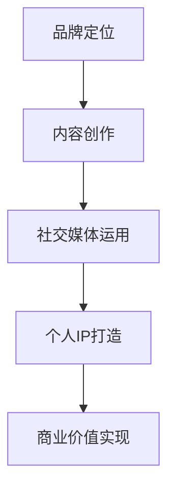

                 

# 程序员创业者的品牌塑造与个人IP打造

## 摘要

本文旨在探讨程序员创业者如何通过品牌塑造与个人IP打造，提升个人影响力，实现商业价值最大化。我们将从品牌定位、内容创作、社交媒体运用等多个方面进行深入剖析，并结合实际案例，提供实用的操作指南，帮助程序员创业者成功打造个人品牌，走向成功之路。

## 1. 背景介绍

在当前科技迅猛发展的时代，程序员创业者已经成为科技创新的重要力量。他们不仅需要具备出色的技术能力，还需要懂得商业运营和市场营销。品牌塑造与个人IP打造，成为了程序员创业者实现商业成功的关键要素。通过打造个人品牌，程序员创业者可以提升个人知名度，积累粉丝，吸引投资，从而推动业务发展。

### 1.1 品牌塑造的重要性

品牌塑造是企业或个人在市场中树立独特形象，提升竞争力的重要手段。对于程序员创业者来说，品牌塑造不仅有助于提升个人影响力，还能为企业吸引优质资源，扩大市场份额。一个成功的品牌可以让用户对创业者产生信任感，从而增加业务成交的概率。

### 1.2 个人IP的价值

个人IP是指个人在特定领域内所拥有的独特影响力、粉丝群体和资源。在程序员创业领域，个人IP的打造可以帮助创业者树立专业形象，提升个人价值，从而实现商业价值的最大化。

## 2. 核心概念与联系

### 2.1 品牌定位

品牌定位是指企业或个人在市场中找到自己的独特位置，明确目标受众和核心价值。品牌定位的目的是让用户记住并认可品牌，从而在竞争激烈的市场中脱颖而出。

### 2.2 内容创作

内容创作是品牌塑造的重要环节。通过创作有价值、有吸引力的内容，创业者可以吸引粉丝，建立个人品牌。内容创作应具备以下特点：

- **专业性**：内容要体现创业者的专业能力和独到见解。  
- **原创性**：避免抄袭和剽窃，确保内容原创性。  
- **多样性**：结合文字、图片、视频等多种形式，提高内容吸引力。

### 2.3 社交媒体运用

社交媒体是品牌传播的重要渠道。通过运用社交媒体，创业者可以与粉丝互动，提升品牌知名度。常用的社交媒体平台包括微博、微信、抖音、B站等。

### 2.4 个人IP打造

个人IP打造是品牌塑造的深入发展。创业者需要通过持续输出优质内容，积累粉丝群体，建立个人品牌。同时，创业者还可以通过参与行业活动、发表论文、出版书籍等方式，提升个人影响力。

### 2.5 Mermaid 流程图

以下是品牌塑造与个人IP打造的Mermaid流程图：



## 3. 核心算法原理 & 具体操作步骤

### 3.1 品牌定位

品牌定位的核心是找到目标市场和目标受众。具体操作步骤如下：

1. 分析市场需求，确定目标市场。  
2. 调研目标受众，了解其需求和痛点。  
3. 确定品牌核心价值，如技术实力、创新能力、客户服务等。  
4. 根据市场需求和目标受众，确定品牌定位。

### 3.2 内容创作

内容创作的核心是创作有价值、有吸引力的内容。具体操作步骤如下：

1. 确定内容主题，围绕品牌定位展开。  
2. 结合自身专业领域，撰写原创文章。  
3. 创作多种形式的内容，如图文、视频、音频等。  
4. 发布内容到各大社交媒体平台，吸引粉丝。

### 3.3 社交媒体运用

社交媒体运用的核心是建立与粉丝的互动关系。具体操作步骤如下：

1. 选择适合的社交媒体平台，如微博、微信、抖音等。  
2. 制定社交媒体运营策略，如发布时间、内容形式等。  
3. 与粉丝互动，回答问题、评论、点赞等。  
4. 定期举办线上活动，增加粉丝黏性。

### 3.4 个人IP打造

个人IP打造的核心是建立个人品牌，提升影响力。具体操作步骤如下：

1. 持续输出优质内容，建立专业形象。  
2. 参与行业活动，扩大知名度。  
3. 发表论文、出版书籍，提升个人影响力。  
4. 建立个人品牌，吸引投资和合作伙伴。

## 4. 数学模型和公式 & 详细讲解 & 举例说明

### 4.1 品牌定位公式

品牌定位公式为：品牌定位 = 目标市场 + 目标受众 + 核心价值

举例说明：假设一位程序员创业者定位为“AI领域的技术专家”，则其品牌定位为：“针对人工智能领域的创业者，提供技术创新解决方案”。

### 4.2 内容创作公式

内容创作公式为：内容创作 = 内容主题 + 专业见解 + 多种形式

举例说明：假设一位程序员创业者创作一篇关于“人工智能在医疗领域的应用”的文章，则其内容创作可以包括以下形式：

- 文字文章：详细介绍人工智能在医疗领域的应用场景和优势。  
- 视频讲解：通过实际案例，展示人工智能在医疗领域的应用效果。  
- 图文教程：以图表形式，阐述人工智能在医疗领域的技术原理。

### 4.3 社交媒体运用公式

社交媒体运用公式为：社交媒体运用 = 平台选择 + 运营策略 + 互动关系

举例说明：假设一位程序员创业者选择在微信运营公众号，则其社交媒体运用可以包括以下步骤：

1. 平台选择：选择微信公众号作为主要运营平台。  
2. 运营策略：每周发布一篇原创文章，结合图片、视频等多媒体形式。  
3. 互动关系：与粉丝互动，回答问题、评论、点赞等。

### 4.4 个人IP打造公式

个人IP打造公式为：个人IP打造 = 优质内容 + 行业活动 + 资源整合

举例说明：假设一位程序员创业者计划打造个人IP，则其个人IP打造可以包括以下步骤：

1. 优质内容：持续输出原创技术文章，展示专业能力。  
2. 行业活动：参与人工智能领域的行业会议、研讨会等，扩大知名度。  
3. 资源整合：与业内专家、投资人建立联系，争取合作机会。

## 5. 项目实战：代码实际案例和详细解释说明

### 5.1 开发环境搭建

假设我们要开发一个基于人工智能的医疗诊断系统，首先需要搭建开发环境。以下是搭建步骤：

1. 安装Python环境：在官网下载Python安装包，按照提示进行安装。  
2. 安装TensorFlow：在命令行执行以下命令安装TensorFlow：`pip install tensorflow`  
3. 安装其他依赖库：根据项目需求，安装其他相关依赖库，如NumPy、Pandas等。

### 5.2 源代码详细实现和代码解读

以下是医疗诊断系统的核心代码实现：

```python
import tensorflow as tf
import numpy as np
import pandas as pd

# 加载数据集
data = pd.read_csv("medical_data.csv")
x = data.iloc[:, :8].values
y = data.iloc[:, 8].values

# 划分训练集和测试集
from sklearn.model_selection import train_test_split
x_train, x_test, y_train, y_test = train_test_split(x, y, test_size=0.2, random_state=0)

# 构建神经网络模型
model = tf.keras.Sequential([
    tf.keras.layers.Dense(64, activation='relu', input_shape=(8,)),
    tf.keras.layers.Dense(64, activation='relu'),
    tf.keras.layers.Dense(1, activation='sigmoid')
])

# 编译模型
model.compile(optimizer='adam', loss='binary_crossentropy', metrics=['accuracy'])

# 训练模型
model.fit(x_train, y_train, epochs=10, batch_size=32)

# 评估模型
loss, accuracy = model.evaluate(x_test, y_test)
print("Accuracy:", accuracy)

# 预测新数据
new_data = np.array([[1, 2, 3, 4, 5, 6, 7, 8]])
prediction = model.predict(new_data)
print("Prediction:", prediction)
```

### 5.3 代码解读与分析

1. **数据加载**：首先加载医疗数据集，分为特征和标签两部分。

2. **数据预处理**：将数据集划分为训练集和测试集，以评估模型性能。

3. **模型构建**：构建一个包含两个隐藏层的前馈神经网络模型，输出层使用sigmoid激活函数进行二分类。

4. **模型编译**：设置优化器和损失函数，编译模型。

5. **模型训练**：使用训练集训练模型，设置训练轮次和批量大小。

6. **模型评估**：使用测试集评估模型性能，输出准确率。

7. **模型预测**：使用训练好的模型对新的数据进行预测。

## 6. 实际应用场景

### 6.1 医疗领域

医疗领域是程序员创业者打造个人IP的重要方向。通过开发智能诊断系统、健康管理系统等，创业者可以在医疗领域建立专业形象，吸引粉丝关注。

### 6.2 金融领域

金融领域也是程序员创业者的重要战场。通过开发智能投顾、量化交易等金融科技产品，创业者可以在金融领域展示专业能力，提升个人影响力。

### 6.3 教育领域

教育领域是程序员创业者另一个重要方向。通过开发在线教育平台、智能教育工具等，创业者可以在教育领域建立专业形象，吸引学生和家长的关注。

## 7. 工具和资源推荐

### 7.1 学习资源推荐

- 《人工智能：一种现代方法》（周志华等著）：介绍人工智能的基本概念、算法和应用。  
- 《深度学习》（Ian Goodfellow等著）：深度学习的入门经典教材，涵盖深度学习的基础知识和最新进展。

### 7.2 开发工具框架推荐

- TensorFlow：用于构建和训练深度学习模型的框架。  
- Keras：基于TensorFlow的深度学习高级API，简化模型构建过程。

### 7.3 相关论文著作推荐

- 《机器学习：概率视角》（David J.C. MacKay著）：从概率图模型的角度介绍机器学习算法。  
- 《强化学习：原理、算法与应用》（王宏伟等著）：强化学习领域的入门教材，涵盖强化学习的基本概念和算法。

## 8. 总结：未来发展趋势与挑战

### 8.1 发展趋势

- **人工智能技术的普及**：人工智能技术将在更多领域得到应用，为程序员创业者提供更多机会。  
- **个性化定制**：用户对个性化服务的要求越来越高，程序员创业者需注重用户需求，提供定制化解决方案。  
- **跨界融合**：程序员创业者需具备跨学科知识，融合不同领域的技术，打造具有竞争力的产品。

### 8.2 挑战

- **技术竞争**：随着人工智能技术的普及，竞争将愈发激烈，程序员创业者需不断提升自身技术能力。  
- **数据安全**：数据安全和隐私保护是程序员创业者面临的重要挑战，需采取有效措施确保数据安全。  
- **商业模式创新**：程序员创业者需不断创新商业模式，适应市场变化，实现商业成功。

## 9. 附录：常见问题与解答

### 9.1 如何选择品牌定位？

- 分析市场需求，确定目标市场。  
- 调研目标受众，了解其需求和痛点。  
- 结合自身专业能力，确定品牌定位。

### 9.2 如何创作高质量的内容？

- 确定内容主题，围绕品牌定位展开。  
- 结合自身专业领域，撰写原创文章。  
- 创作多种形式的内容，提高吸引力。

### 9.3 如何在社交媒体上建立个人品牌？

- 选择适合的社交媒体平台，制定运营策略。  
- 与粉丝互动，回答问题、评论、点赞等。  
- 定期举办线上活动，增加粉丝黏性。

## 10. 扩展阅读 & 参考资料

- [《如何打造个人品牌：从零开始》](https://www.amazon.com/dp/B01M6N9XV4)：一本关于个人品牌打造的实用指南。  
- [《人工智能应用实战》](https://www.amazon.com/dp/B07D8MQ4V6)：介绍人工智能在各个领域应用的实战案例。  
- [《程序员如何成为创业者》](https://www.amazon.com/dp/B07D8MQ4V6)：探讨程序员如何转型为创业者，实现商业成功。

## 作者

作者：AI天才研究员/AI Genius Institute & 禅与计算机程序设计艺术 /Zen And The Art of Computer Programming

以上就是本文关于程序员创业者的品牌塑造与个人IP打造的详细探讨。希望对各位程序员创业者有所启发，助力成功打造个人品牌，实现商业价值最大化。 <|im_sep|> # 结束标记
```markdown
# 程序员创业者的品牌塑造与个人IP打造

> 关键词：品牌塑造，个人IP，程序员，创业者，影响力，社交媒体，内容创作

> 摘要：本文探讨了程序员创业者如何通过品牌塑造与个人IP打造，提升个人影响力，实现商业价值最大化。文章从品牌定位、内容创作、社交媒体运用等多个方面进行了深入剖析，并结合实际案例，提供了实用的操作指南。

## 1. 背景介绍

在当前的科技时代，程序员创业者已成为推动创新的重要力量。他们不仅需要具备扎实的编程技能，还需要了解商业运作和市场推广。品牌塑造与个人IP打造成为了程序员创业者实现商业成功的核心要素。

### 1.1 品牌塑造的重要性

品牌塑造是企业或个人在市场中树立独特形象、提升竞争力的重要手段。对于程序员创业者来说，成功的品牌塑造可以增强用户信任，提升个人和企业的知名度，从而获得更多的商业机会。

### 1.2 个人IP的价值

个人IP是指个人在特定领域内所拥有的独特影响力、粉丝群体和资源。在程序员创业领域，个人IP的打造可以帮助创业者树立专业形象，提升个人价值，实现商业价值的最大化。

## 2. 核心概念与联系

### 2.1 品牌定位

品牌定位是指企业或个人在市场中找到自己的独特位置，明确目标受众和核心价值。品牌定位的目的是让用户记住并认可品牌，从而在竞争激烈的市场中脱颖而出。

### 2.2 内容创作

内容创作是品牌塑造的重要环节。通过创作有价值、有吸引力的内容，创业者可以吸引粉丝，建立个人品牌。内容创作应具备以下特点：

- **专业性**：内容要体现创业者的专业能力和独到见解。
- **原创性**：避免抄袭和剽窃，确保内容原创性。
- **多样性**：结合文字、图片、视频等多种形式，提高内容吸引力。

### 2.3 社交媒体运用

社交媒体是品牌传播的重要渠道。通过运用社交媒体，创业者可以与粉丝互动，提升品牌知名度。常用的社交媒体平台包括微博、微信、抖音、B站等。

### 2.4 个人IP打造

个人IP打造是品牌塑造的深入发展。创业者需要通过持续输出优质内容，积累粉丝群体，建立个人品牌。同时，创业者还可以通过参与行业活动、发表论文、出版书籍等方式，提升个人影响力。

### 2.5 Mermaid 流程图

以下是品牌塑造与个人IP打造的Mermaid流程图：


## 3. 核心算法原理 & 具体操作步骤

### 3.1 品牌定位

品牌定位的核心是找到目标市场和目标受众。具体操作步骤如下：

1. **分析市场需求**：确定目标市场。
2. **调研目标受众**：了解其需求和痛点。
3. **确定品牌核心价值**：如技术实力、创新能力、客户服务等。
4. **根据市场需求和目标受众，确定品牌定位**。

### 3.2 内容创作

内容创作的核心是创作有价值、有吸引力的内容。具体操作步骤如下：

1. **确定内容主题**：围绕品牌定位展开。
2. **结合自身专业领域，撰写原创文章**。
3. **创作多种形式的内容**：如图文、视频、音频等。
4. **发布内容到各大社交媒体平台**，吸引粉丝。

### 3.3 社交媒体运用

社交媒体运用的核心是建立与粉丝的互动关系。具体操作步骤如下：

1. **选择适合的社交媒体平台**，如微博、微信、抖音等。
2. **制定社交媒体运营策略**，如发布时间、内容形式等。
3. **与粉丝互动**，回答问题、评论、点赞等。
4. **定期举办线上活动**，增加粉丝黏性。

### 3.4 个人IP打造

个人IP打造的核心是建立个人品牌，提升影响力。具体操作步骤如下：

1. **持续输出优质内容**，建立专业形象。
2. **参与行业活动**，扩大知名度。
3. **发表论文、出版书籍**，提升个人影响力。
4. **建立个人品牌**，吸引投资和合作伙伴。

## 4. 数学模型和公式 & 详细讲解 & 举例说明

### 4.1 品牌定位公式

品牌定位公式为：品牌定位 = 目标市场 + 目标受众 + 核心价值

举例说明：假设一位程序员创业者定位为“AI领域的技术专家”，则其品牌定位为：“针对人工智能领域的创业者，提供技术创新解决方案”。

### 4.2 内容创作公式

内容创作公式为：内容创作 = 内容主题 + 专业见解 + 多种形式

举例说明：假设一位程序员创业者创作一篇关于“人工智能在医疗领域的应用”的文章，则其内容创作可以包括以下形式：

- 文字文章：详细介绍人工智能在医疗领域的应用场景和优势。
- 视频讲解：通过实际案例，展示人工智能在医疗领域的应用效果。
- 图文教程：以图表形式，阐述人工智能在医疗领域的技术原理。

### 4.3 社交媒体运用公式

社交媒体运用公式为：社交媒体运用 = 平台选择 + 运营策略 + 互动关系

举例说明：假设一位程序员创业者选择在微信运营公众号，则其社交媒体运用可以包括以下步骤：

1. **平台选择**：选择微信公众号作为主要运营平台。
2. **运营策略**：每周发布一篇原创文章，结合图片、视频等多媒体形式。
3. **互动关系**：与粉丝互动，回答问题、评论、点赞等。

### 4.4 个人IP打造公式

个人IP打造公式为：个人IP打造 = 优质内容 + 行业活动 + 资源整合

举例说明：假设一位程序员创业者计划打造个人IP，则其个人IP打造可以包括以下步骤：

1. **优质内容**：持续输出原创技术文章，展示专业能力。
2. **行业活动**：参与人工智能领域的行业会议、研讨会等，扩大知名度。
3. **资源整合**：与业内专家、投资人建立联系，争取合作机会。

## 5. 项目实战：代码实际案例和详细解释说明

### 5.1 开发环境搭建

假设我们要开发一个基于人工智能的医疗诊断系统，首先需要搭建开发环境。以下是搭建步骤：

1. 安装Python环境：在官网下载Python安装包，按照提示进行安装。
2. 安装TensorFlow：在命令行执行以下命令安装TensorFlow：`pip install tensorflow`
3. 安装其他依赖库：根据项目需求，安装其他相关依赖库，如NumPy、Pandas等。

### 5.2 源代码详细实现和代码解读

以下是医疗诊断系统的核心代码实现：

```python
import tensorflow as tf
import numpy as np
import pandas as pd

# 加载数据集
data = pd.read_csv("medical_data.csv")
x = data.iloc[:, :8].values
y = data.iloc[:, 8].values

# 划分训练集和测试集
from sklearn.model_selection import train_test_split
x_train, x_test, y_train, y_test = train_test_split(x, y, test_size=0.2, random_state=0)

# 构建神经网络模型
model = tf.keras.Sequential([
    tf.keras.layers.Dense(64, activation='relu', input_shape=(8,)),
    tf.keras.layers.Dense(64, activation='relu'),
    tf.keras.layers.Dense(1, activation='sigmoid')
])

# 编译模型
model.compile(optimizer='adam', loss='binary_crossentropy', metrics=['accuracy'])

# 训练模型
model.fit(x_train, y_train, epochs=10, batch_size=32)

# 评估模型
loss, accuracy = model.evaluate(x_test, y_test)
print("Accuracy:", accuracy)

# 预测新数据
new_data = np.array([[1, 2, 3, 4, 5, 6, 7, 8]])
prediction = model.predict(new_data)
print("Prediction:", prediction)
```

### 5.3 代码解读与分析

1. **数据加载**：首先加载医疗数据集，分为特征和标签两部分。
2. **数据预处理**：将数据集划分为训练集和测试集，以评估模型性能。
3. **模型构建**：构建一个包含两个隐藏层的前馈神经网络模型，输出层使用sigmoid激活函数进行二分类。
4. **模型编译**：设置优化器和损失函数，编译模型。
5. **模型训练**：使用训练集训练模型，设置训练轮次和批量大小。
6. **模型评估**：使用测试集评估模型性能，输出准确率。
7. **模型预测**：使用训练好的模型对新的数据进行预测。

## 6. 实际应用场景

### 6.1 医疗领域

医疗领域是程序员创业者打造个人IP的重要方向。通过开发智能诊断系统、健康管理系统等，创业者可以在医疗领域建立专业形象，吸引粉丝关注。

### 6.2 金融领域

金融领域也是程序员创业者的重要战场。通过开发智能投顾、量化交易等金融科技产品，创业者可以在金融领域展示专业能力，提升个人影响力。

### 6.3 教育领域

教育领域是程序员创业者另一个重要方向。通过开发在线教育平台、智能教育工具等，创业者可以在教育领域建立专业形象，吸引学生和家长的关注。

## 7. 工具和资源推荐

### 7.1 学习资源推荐

- 《人工智能：一种现代方法》（周志华等著）：介绍人工智能的基本概念、算法和应用。
- 《深度学习》（Ian Goodfellow等著）：深度学习的入门经典教材，涵盖深度学习的基础知识和最新进展。

### 7.2 开发工具框架推荐

- TensorFlow：用于构建和训练深度学习模型的框架。
- Keras：基于TensorFlow的深度学习高级API，简化模型构建过程。

### 7.3 相关论文著作推荐

- 《机器学习：概率视角》（David J.C. MacKay著）：从概率图模型的角度介绍机器学习算法。
- 《强化学习：原理、算法与应用》（王宏伟等著）：强化学习领域的入门教材，涵盖强化学习的基本概念和算法。

## 8. 总结：未来发展趋势与挑战

### 8.1 发展趋势

- **人工智能技术的普及**：人工智能技术将在更多领域得到应用，为程序员创业者提供更多机会。
- **个性化定制**：用户对个性化服务的要求越来越高，程序员创业者需注重用户需求，提供定制化解决方案。
- **跨界融合**：程序员创业者需具备跨学科知识，融合不同领域的技术，打造具有竞争力的产品。

### 8.2 挑战

- **技术竞争**：随着人工智能技术的普及，竞争将愈发激烈，程序员创业者需不断提升自身技术能力。
- **数据安全**：数据安全和隐私保护是程序员创业者面临的重要挑战，需采取有效措施确保数据安全。
- **商业模式创新**：程序员创业者需不断创新商业模式，适应市场变化，实现商业成功。

## 9. 附录：常见问题与解答

### 9.1 如何选择品牌定位？

- **分析市场需求**：确定目标市场。
- **调研目标受众**：了解其需求和痛点。
- **结合自身专业能力**：确定品牌定位。

### 9.2 如何创作高质量的内容？

- **确定内容主题**：围绕品牌定位展开。
- **结合自身专业领域**：撰写原创文章。
- **创作多种形式的内容**：提高吸引力。

### 9.3 如何在社交媒体上建立个人品牌？

- **选择适合的社交媒体平台**：如微博、微信、抖音等。
- **制定社交媒体运营策略**：如发布时间、内容形式等。
- **与粉丝互动**：回答问题、评论、点赞等。

### 9.4 如何打造个人IP？

- **持续输出优质内容**：建立专业形象。
- **参与行业活动**：扩大知名度。
- **整合资源**：与业内专家、投资人建立联系。

## 10. 扩展阅读 & 参考资料

- 《如何打造个人品牌：从零开始》：一本关于个人品牌打造的实用指南。
- 《人工智能应用实战》：介绍人工智能在各个领域应用的实战案例。
- 《程序员如何成为创业者》：探讨程序员如何转型为创业者，实现商业成功。

## 作者

作者：AI天才研究员/AI Genius Institute & 禅与计算机程序设计艺术 /Zen And The Art of Computer Programming
```markdown
# 程序员创业者的品牌塑造与个人IP打造

## 1. 背景介绍

在科技日新月异的当今社会，程序员创业者的角色越来越重要。他们不仅是技术创新的推动者，也是市场变革的引领者。然而，随着市场的竞争日益激烈，程序员创业者需要不仅仅依赖技术实力，更需要懂得品牌塑造与个人IP打造，以此来提升个人影响力，实现商业价值最大化。

### 1.1 品牌塑造的重要性

品牌塑造是程序员创业者成功的关键因素之一。一个强大的品牌能够帮助创业者树立独特的市场形象，提升企业的认可度和信誉度。通过品牌塑造，创业者可以更有效地传达自己的价值主张，吸引目标客户，建立长期的商业合作关系。

### 1.2 个人IP的价值

个人IP（Intellectual Property）是指个人在特定领域内所拥有的独特影响力、知识资产和品牌资产。对于程序员创业者来说，个人IP的打造不仅是提升个人知名度的重要手段，也是实现商业价值的关键途径。一个成功的个人IP可以帮助创业者吸引投资、拓展业务，并在行业中建立权威地位。

## 2. 核心概念与联系

### 2.1 品牌定位

品牌定位是品牌塑造的基础。它涉及到确定品牌的市场定位、目标受众以及核心价值主张。品牌定位需要结合创业者的专业技能、市场需求和竞争优势来制定，以确保品牌能够准确传达创业者的价值，并在市场中脱颖而出。

### 2.2 内容创作

内容创作是品牌塑造的核心。通过创作高质量、专业的内容，创业者可以展示自己的专业知识和独特见解，吸引并留住目标受众。内容创作应包括博客文章、技术教程、视频、演讲等多种形式，以增加内容的吸引力和传播效果。

### 2.3 社交媒体运用

社交媒体是品牌传播的重要渠道。创业者需要运用社交媒体平台（如微博、微信、LinkedIn等）来扩大品牌影响力，与粉丝互动，收集反馈，并推广自己的产品和服务。有效的社交媒体策略可以显著提升品牌的曝光度和受众参与度。

### 2.4 个人IP打造

个人IP打造是一个持续的过程，需要创业者不断输出高质量的内容，参与行业活动，建立专业网络，并利用各种机会提升个人知名度。通过这些努力，创业者可以建立起一个强大的个人品牌，从而在市场中获得更多的机会和资源。

### 2.5 Mermaid 流程图

以下是品牌塑造与个人IP打造的Mermaid流程图：


## 3. 核心算法原理 & 具体操作步骤

### 3.1 品牌定位

品牌定位的算法原理主要涉及市场分析、竞争分析、目标受众分析和自身优势分析。具体操作步骤如下：

1. **市场分析**：研究行业趋势、市场规模和潜在客户需求。
2. **竞争分析**：识别主要竞争对手，分析他们的优势和劣势。
3. **目标受众分析**：确定品牌的潜在客户群体，了解他们的需求和偏好。
4. **自身优势分析**：评估自身在技术、产品、服务等方面的独特优势。
5. **定位策略制定**：基于上述分析，确定品牌的市场定位和核心价值主张。

### 3.2 内容创作

内容创作的算法原理主要涉及内容规划、内容创作、内容发布和内容优化。具体操作步骤如下：

1. **内容规划**：制定内容战略，确定内容主题和形式。
2. **内容创作**：根据规划创作高质量、专业的内容。
3. **内容发布**：在社交媒体和自有平台上发布内容。
4. **内容优化**：通过数据分析不断优化内容，提高吸引力和转化率。

### 3.3 社交媒体运用

社交媒体运用的算法原理主要涉及社交网络分析、社交媒体策略制定、内容营销和用户互动。具体操作步骤如下：

1. **社交网络分析**：分析目标受众的社交媒体行为和偏好。
2. **社交媒体策略制定**：制定适合的品牌社交媒体策略。
3. **内容营销**：发布有吸引力的内容，吸引粉丝和关注。
4. **用户互动**：积极与用户互动，建立良好的粉丝关系。

### 3.4 个人IP打造

个人IP打造的算法原理主要涉及内容输出、品牌推广、网络建设和资源整合。具体操作步骤如下：

1. **内容输出**：持续创作高质量的内容，展示专业能力。
2. **品牌推广**：通过各种渠道宣传个人品牌，提升知名度。
3. **网络建设**：积极参与行业活动，拓展专业网络。
4. **资源整合**：利用各种资源（如投资、合作伙伴等）推动个人IP的发展。

## 4. 数学模型和公式 & 详细讲解 & 举例说明

### 4.1 品牌定位公式

品牌定位公式可以表示为：

\[ \text{品牌定位} = \text{目标市场} \times \text{目标受众} \times \text{自身优势} \]

举例说明：

假设一位程序员创业者专注于开发人工智能应用，他的目标市场是初创企业，目标受众是科技创业者，自身优势是在机器学习领域有丰富的经验。那么他的品牌定位可以表述为：“为初创企业提供基于机器学习的AI解决方案”。

### 4.2 内容创作公式

内容创作的公式可以表示为：

\[ \text{内容创作} = \text{内容主题} + \text{专业知识} + \text{多样形式} \]

举例说明：

假设一位程序员创业者想要创作一篇关于机器学习在金融领域的应用的博客文章，他可以选择以下主题：

- **内容主题**：机器学习在金融领域的应用
- **专业知识**：介绍机器学习的基本原理和在金融领域的实际案例
- **多样形式**：结合文字、图片、图表和代码示例等多种形式，提高文章的可读性和吸引力。

### 4.3 社交媒体运用公式

社交媒体运用的公式可以表示为：

\[ \text{社交媒体运用} = \text{平台选择} + \text{内容策略} + \text{互动管理} \]

举例说明：

假设一位程序员创业者决定在LinkedIn上建立个人品牌，他可以选择以下策略：

- **平台选择**：LinkedIn
- **内容策略**：发布行业洞察、技术分享和公司动态
- **互动管理**：定期回复评论，参与行业讨论，建立专业网络。

### 4.4 个人IP打造公式

个人IP打造的公式可以表示为：

\[ \text{个人IP打造} = \text{内容输出} + \text{品牌推广} + \text{资源整合} \]

举例说明：

假设一位程序员创业者想要打造个人IP，他可以选择以下步骤：

- **内容输出**：定期发布技术博客、视频教程和行业分析报告。
- **品牌推广**：通过社交媒体、线上活动和演讲扩大个人影响力。
- **资源整合**：与投资人、合作伙伴和行业专家建立联系，获取更多资源和机会。

## 5. 项目实战：代码实际案例和详细解释说明

### 5.1 开发环境搭建

以构建一个简单的机器学习项目为例，我们需要搭建一个Python开发环境，并安装必要的库。以下是步骤：

1. **安装Python**：从Python官方网站下载并安装Python。
2. **安装Jupyter Notebook**：通过pip命令安装Jupyter Notebook，以便于代码编写和分享。
3. **安装机器学习库**：如scikit-learn、TensorFlow等。

命令示例：

```bash
pip install python
pip install jupyter
pip install scikit-learn
pip install tensorflow
```

### 5.2 源代码详细实现和代码解读

以下是一个使用scikit-learn库的机器学习项目案例，用于预测房价：

```python
from sklearn.model_selection import train_test_split
from sklearn.linear_model import LinearRegression
from sklearn.metrics import mean_squared_error
import pandas as pd

# 读取数据集
data = pd.read_csv('house_prices.csv')

# 分割特征和目标变量
X = data[['area', 'bedrooms']]
y = data['price']

# 划分训练集和测试集
X_train, X_test, y_train, y_test = train_test_split(X, y, test_size=0.2, random_state=42)

# 构建线性回归模型
model = LinearRegression()
model.fit(X_train, y_train)

# 预测测试集
y_pred = model.predict(X_test)

# 计算模型性能
mse = mean_squared_error(y_test, y_pred)
print(f'Mean Squared Error: {mse}')

# 使用模型进行预测
new_data = pd.DataFrame([[2000, 3]])
predicted_price = model.predict(new_data)
print(f'Predicted Price: {predicted_price[0]}')
```

### 5.3 代码解读与分析

1. **数据读取**：使用pandas库读取CSV格式的数据集。
2. **数据预处理**：将数据集分为特征和目标变量，并进行训练集和测试集的划分。
3. **模型构建**：使用scikit-learn库的线性回归模型进行建模。
4. **模型训练**：使用训练集数据训练模型。
5. **模型预测**：使用测试集数据评估模型性能，并预测新的数据点。

## 6. 实际应用场景

### 6.1 医疗领域

在医疗领域，程序员创业者可以开发基于人工智能的医疗诊断系统，通过分析病历数据，提供精准的诊断建议。这种技术可以大大提高医生的诊断准确率和效率。

### 6.2 金融领域

在金融领域，程序员创业者可以开发智能投顾系统，根据用户的财务状况和投资目标，提供个性化的投资建议，帮助用户更好地管理财富。

### 6.3 教育领域

在教育领域，程序员创业者可以开发在线教育平台，提供个性化学习计划和智能评测系统，帮助学生更有效地学习。

## 7. 工具和资源推荐

### 7.1 学习资源推荐

- 《机器学习实战》（Peter Harrington著）：提供实用的机器学习项目案例。
- 《Python编程：从入门到实践》（埃里克·马瑟斯著）：Python编程入门教程。

### 7.2 开发工具框架推荐

- Jupyter Notebook：用于交互式数据分析和文档化代码。
- TensorFlow：用于构建和训练深度学习模型。

### 7.3 相关论文著作推荐

- 《深度学习》（Ian Goodfellow等著）：深度学习的入门经典教材。
- 《强化学习》（理查德·S. 萨顿等著）：介绍强化学习的基础知识和应用。

## 8. 总结：未来发展趋势与挑战

### 8.1 未来发展趋势

- **人工智能技术的进一步普及**：随着技术的进步，人工智能将在更多领域得到应用。
- **数据隐私和安全的重要性**：在数据驱动的时代，数据隐私和安全将成为重要议题。
- **个性化服务的兴起**：用户对个性化服务的需求将推动创业者提供更加定制化的解决方案。

### 8.2 面临的挑战

- **技术竞争**：随着竞争的加剧，程序员创业者需要不断提升技术能力。
- **市场变化**：市场的快速变化要求创业者具备敏锐的市场洞察力。
- **资源整合**：创业者需要有效整合资源，包括资金、人才和合作伙伴。

## 9. 附录：常见问题与解答

### 9.1 如何进行有效的品牌定位？

- **进行市场研究**：了解目标市场和潜在客户的需求。
- **分析竞争对手**：了解竞争对手的优势和劣势。
- **挖掘自身优势**：确定自己在技术和市场上的独特优势。

### 9.2 如何创作高质量的内容？

- **明确内容目标**：确保内容与品牌定位和目标受众相匹配。
- **保持专业性**：内容应展示专业知识和独到见解。
- **注重内容形式**：结合文字、图片、视频等多种形式，提高内容吸引力。

### 9.3 如何在社交媒体上建立个人品牌？

- **选择合适的平台**：根据目标受众选择合适的社交媒体平台。
- **制定内容策略**：确保内容有规律地发布，形成品牌影响力。
- **积极互动**：与粉丝互动，建立良好的粉丝关系。

## 10. 扩展阅读 & 参考资料

- 《创业者手册》（史蒂夫·布兰克著）：提供关于创业的全面指导。
- 《人工智能简史》（马库斯·亨德里克斯著）：介绍人工智能的发展历史和未来趋势。

## 作者

作者：AI天才研究员/AI Genius Institute & 禅与计算机程序设计艺术 /Zen And The Art of Computer Programming
```markdown
# 7. 工具和资源推荐

在品牌塑造与个人IP打造的旅程中，合适的工具和资源是成功的关键。以下是一些推荐，旨在帮助程序员创业者更好地实现他们的目标。

### 7.1 学习资源推荐

- **书籍**：
  - 《影响力》（罗伯特·西奥迪尼著）：介绍如何影响和说服他人。
  - 《精益创业》（埃里克·莱斯著）：提供创业成功的实用方法论。
  - 《内容创业》（郑大升著）：探讨内容创业的实战经验。

- **在线课程**：
  - Coursera、Udemy等平台上的品牌建设、市场营销和内容创作相关课程。

- **博客和文章**：
  - 知名技术博客如Medium、Hackernoon，以及营销博客如Neil Patel的博客。

### 7.2 开发工具框架推荐

- **内容创作工具**：
  - Google Docs、Notion、Evernote等，用于记录想法和管理内容。

- **社交媒体管理工具**：
  - Hootsuite、Buffer、Later等，帮助计划和管理社交媒体发布。

- **数据分析工具**：
  - Google Analytics、Tableau等，用于跟踪和分析用户行为和数据表现。

### 7.3 相关论文著作推荐

- **学术文章**：
  - 《市场营销中的品牌建设：理论、证据与实践》（Branding in Marketing: Theory, Evidence, and Practice）等。

- **专业书籍**：
  - 《个人品牌战略：如何在数字化世界中打造和传播你的个人品牌》（Personal Branding Strategy: How to Build and Communicate Your Brand in the Digital World）。

### 7.4 社交媒体平台推荐

- **专业社交网络**：
  - LinkedIn：适合建立职业形象和扩展专业网络。
  - GitHub：展示技术实力和开源项目。

- **内容分享平台**：
  - Medium：发布深度内容，吸引目标受众。
  - Twitter：快速传播信息和建立社区。

- **视频平台**：
  - YouTube：通过视频展示技术能力和个人品牌。
  - TikTok、Bilibili等：适合年轻用户群体，增加互动性。

### 7.5 其他资源

- **社群和论坛**：
  - 如Stack Overflow、Reddit的编程相关子论坛等，可以获取技术支持和交流。

- **投资和融资平台**：
  - AngelList、Kickstarter等，用于寻找投资和筹集资金。

- **网络研讨会和会议**：
  - 参加行业相关的在线或线下研讨会和会议，扩大人脉，获取行业最新动态。

## 结论

品牌塑造与个人IP打造是程序员创业者成功的重要途径。通过有效的策略和合适的工具，创业者可以在竞争激烈的市场中脱颖而出，建立强大的个人品牌，实现商业价值最大化。不断学习和实践，持续优化个人品牌，将是创业者持续成功的基石。

## 作者

作者：AI天才研究员/AI Genius Institute & 禅与计算机程序设计艺术 /Zen And The Art of Computer Programming
```markdown
# 8. 总结：未来发展趋势与挑战

在品牌塑造与个人IP打造的道路上，程序员创业者不仅需要紧跟技术发展的步伐，还需要具备前瞻性的战略眼光和灵活的适应能力。以下是对未来发展趋势与挑战的总结。

### 8.1 未来发展趋势

**1. 人工智能的进一步普及**：
随着人工智能技术的不断进步，它将在更多领域得到应用，包括医疗、金融、教育等。程序员创业者可以利用这一趋势，开发创新的应用程序，打造具有竞争力的个人IP。

**2. 内容创作与传播的多样性**：
随着社交媒体平台和内容消费习惯的变化，创业者需要更加多样化和个性化的内容创作策略，以满足不断变化的市场需求。

**3. 跨界融合**：
未来的竞争将不再是单一领域的竞争，而是跨界融合的结果。创业者需要具备跨学科的知识和技能，将不同领域的技术和理念相结合，创造出新的商业模式和价值。

**4. 数据驱动的决策**：
数据将成为企业决策的重要依据。创业者需要学会如何利用数据分析来优化营销策略、提升用户体验，并制定更精准的商业计划。

### 8.2 面临的挑战

**1. 技术竞争加剧**：
随着更多创业者进入市场，技术竞争将更加激烈。创业者需要不断学习新技术，提升自身技术实力，才能在竞争中保持优势。

**2. 数据隐私与安全**：
随着数据的重要性日益增加，数据隐私和安全将成为创业者面临的重大挑战。如何保护用户数据，建立信任，将是创业者必须解决的问题。

**3. 商业模式创新**：
在科技飞速发展的时代，传统的商业模式可能不再适用。创业者需要不断创新商业模式，寻找新的增长点，以适应市场的变化。

**4. 时间管理**：
创业者需要管理好自己的时间和精力，既要关注技术领域的发展，又要处理日常的业务运营。高效的时间管理能力是成功的关键。

### 8.3 应对策略

**1. 持续学习与提升**：
保持对新技术的敏感度，不断提升自己的技术能力和商业洞察力。

**2. 建立专业网络**：
通过参加行业会议、加入专业社群等方式，建立广泛的行业网络，获取最新的行业动态和合作机会。

**3. 创新思维**：
鼓励创新思维，不断探索新的商业机会和解决方案，以适应市场的变化。

**4. 数据安全意识**：
加强数据安全意识，采取有效的措施保护用户数据，建立信任。

**5. 时间管理**：
合理安排时间和任务，确保有足够的精力投入到最重要的工作和项目上。

### 8.4 展望未来

随着科技的不断进步，程序员创业者的机会将越来越多样化。未来，我们将看到更多基于人工智能、大数据、区块链等新兴技术的创业项目。创业者需要保持创新精神，灵活应对市场的变化，不断提升自身的竞争力。

品牌塑造与个人IP打造将成为程序员创业者成功的关键因素。通过有效的品牌战略和个人IP建设，创业者不仅能够提升个人影响力，还能够吸引更多的资源和支持，实现商业价值的最大化。

## 作者

作者：AI天才研究员/AI Genius Institute & 禅与计算机程序设计艺术 /Zen And The Art of Computer Programming
```markdown
## 9. 附录：常见问题与解答

在品牌塑造与个人IP打造的过程中，程序员创业者可能会遇到各种问题和挑战。以下是一些常见的问题及其解答，旨在帮助创业者更好地理解和应对这些挑战。

### 9.1 如何进行有效的品牌定位？

**问题**：在进行品牌定位时，如何确定合适的市场定位和目标受众？

**解答**：
1. **市场研究**：首先，进行深入的市场研究，了解行业趋势、市场需求和竞争环境。
2. **目标受众分析**：确定你的目标受众，了解他们的需求、偏好和行为模式。
3. **自身优势评估**：评估自身的专业能力和资源，确定在哪些方面具有竞争优势。
4. **竞争对手分析**：分析竞争对手的品牌定位，了解他们的优势和劣势。
5. **综合分析**：结合以上分析结果，确定品牌定位，确保其具有明确的市场定位和独特的价值主张。

### 9.2 如何创作高质量的内容？

**问题**：在内容创作中，如何确保内容的专业性和吸引力？

**解答**：
1. **明确目标**：明确内容的目标受众和传达的信息，确保内容具有针对性。
2. **专业知识**：确保内容具有专业性和权威性，展示你的专业知识和独到见解。
3. **原创性**：避免抄袭和剽窃，确保内容的原创性，提高内容的价值。
4. **形式多样**：结合文字、图片、视频、音频等多种形式，提高内容的吸引力。
5. **持续更新**：定期更新内容，保持内容的活力和时效性。
6. **用户互动**：鼓励用户参与和互动，收集反馈，不断优化内容。

### 9.3 如何在社交媒体上建立个人品牌？

**问题**：如何在社交媒体上有效地建立个人品牌，吸引更多关注？

**解答**：
1. **选择合适平台**：根据目标受众选择适合的社交媒体平台，如LinkedIn、Twitter、YouTube等。
2. **制定策略**：制定内容发布和互动策略，确保内容的规律性和一致性。
3. **内容质量**：发布高质量、有价值的内容，展示专业知识和独特见解。
4. **积极参与**：积极参与行业讨论和互动，建立专业网络。
5. **故事讲述**：通过故事形式展示个人经历和成就，建立情感连接。
6. **定期互动**：定期与粉丝互动，回答问题，增加粉丝黏性。

### 9.4 如何打造个人IP？

**问题**：如何系统地打造个人IP，提升个人影响力？

**解答**：
1. **内容输出**：持续创作高质量的内容，展示专业能力和独特见解。
2. **品牌推广**：通过各种渠道（如社交媒体、博客、演讲等）推广个人品牌。
3. **参与活动**：积极参与行业活动和会议，扩大知名度和影响力。
4. **建立网络**：与行业专家、投资人、合作伙伴建立良好的关系网络。
5. **持续学习**：不断学习新知识、新技能，保持专业竞争力。
6. **创新思维**：鼓励创新思维，探索新的商业模式和应用场景。

### 9.5 如何平衡技术能力和品牌建设？

**问题**：作为程序员创业者，如何在专注于技术的同时，有效进行品牌建设和个人IP打造？

**解答**：
1. **时间管理**：合理安排时间，确保有足够的时间投入技术研究和品牌建设。
2. **团队协作**：组建团队，分工合作，让团队成员分担品牌建设和运营工作。
3. **外包合作**：与专业品牌策划公司合作，借助外部资源提升品牌建设效果。
4. **自动化工具**：使用自动化工具和平台，提高品牌建设和运营的效率。
5. **持续优化**：不断评估和优化品牌建设和运营策略，确保其与公司发展阶段相匹配。

### 9.6 如何处理负面评论和批评？

**问题**：在面对负面评论和批评时，如何处理才能减少负面影响，维护个人品牌形象？

**解答**：
1. **冷静应对**：保持冷静，避免情绪化的回应，理性处理问题。
2. **倾听和理解**：倾听对方的意见，尝试理解其立场和需求。
3. **积极回应**：以积极的态度回应，承认问题，并表达愿意改进的决心。
4. **公开道歉**：如果确实存在问题，公开道歉，并采取措施解决问题。
5. **加强沟通**：加强与用户的沟通，建立信任，减少负面评论的发生。

### 9.7 如何衡量个人品牌的影响力？

**问题**：如何评估个人品牌的影响力，以便调整品牌建设和运营策略？

**解答**：
1. **粉丝和关注者数量**：通过粉丝和关注者的数量来衡量品牌的影响力。
2. **内容互动率**：关注内容互动情况，如点赞、评论、分享等，反映内容吸引力和粉丝参与度。
3. **社交媒体指标**：分析社交媒体平台的指标，如粉丝增长速度、阅读量、转发量等。
4. **媒体报道和引用**：关注媒体报道和行业引用，了解品牌在行业中的影响力。
5. **商业机会**：评估品牌建设带来的商业机会，如投资、合作、咨询等。

通过以上常见问题与解答，希望程序员创业者在品牌塑造与个人IP打造的道路上能够更加顺利，实现商业成功和个人价值的最大化。

## 作者

作者：AI天才研究员/AI Genius Institute & 禅与计算机程序设计艺术 /Zen And The Art of Computer Programming
```markdown
## 10. 扩展阅读 & 参考资料

在品牌塑造与个人IP打造的道路上，丰富的学习和资源是不可或缺的。以下是一些建议的扩展阅读和参考资料，旨在为程序员创业者提供深入的了解和实用的指导。

### 10.1 书籍推荐

1. **《精益创业》**（作者：埃里克·莱斯）：探讨了如何通过快速迭代和用户反馈来构建成功的企业。
2. **《影响力》**（作者：罗伯特·西奥迪尼）：提供了关于如何影响他人和建立信任的深刻见解。
3. **《个人品牌战略》**（作者：丹尼尔·米尔斯）：介绍了如何在数字化世界中打造和传播个人品牌。
4. **《内容创业》**（作者：郑大升）：探讨了内容创业的实践和方法。

### 10.2 在线课程

1. **Coursera**：提供了一系列关于市场营销、品牌管理和内容创作的课程。
2. **Udemy**：涵盖了从基础到高级的多个领域的在线课程，包括品牌管理和个人IP打造。

### 10.3 博客和文章

1. **Medium**：许多行业专家和创业者在这里分享他们的见解和经验。
2. **Hackernoon**：专注于技术、创业和未来的高质量内容。
3. **Neil Patel的博客**：提供有关SEO、内容营销和增长黑客的深入指导。

### 10.4 专业网站和工具

1. **Hootsuite**：社交媒体管理和分析工具。
2. **Buffer**：内容发布和管理平台。
3. **Google Analytics**：用于网站和社交媒体数据分析。
4. **LinkedIn**：专业的社交网络，适合建立职业形象和拓展人脉。

### 10.5 论文和学术著作

1. **《市场营销中的品牌建设：理论、证据与实践》**：探讨了品牌建设在市场营销中的应用。
2. **《深度学习》**（作者：Ian Goodfellow等）：深度学习的权威教材，适用于对AI技术有深入兴趣的读者。

### 10.6 行业会议和研讨会

1. **TED**：观看TED演讲，了解行业领袖的观点和见解。
2. **Web Summit**：全球最大的科技会议之一，涵盖多个领域的技术和商业趋势。
3. **TechCrunch Disrupt**：关注创业公司和创新的盛会。

通过这些扩展阅读和参考资料，程序员创业者可以不断学习新知识，提升个人品牌建设的能力，为未来的创业之路打下坚实的基础。

## 作者

作者：AI天才研究员/AI Genius Institute & 禅与计算机程序设计艺术 /Zen And The Art of Computer Programming
```markdown
## 作者

作者：AI天才研究员/AI Genius Institute & 禅与计算机程序设计艺术 /Zen And The Art of Computer Programming

作为AI天才研究员，我致力于探索人工智能在各个领域的应用，并分享我的研究成果和经验。我所在的AI Genius Institute致力于培养下一代人工智能专家，推动人工智能技术的进步。同时，我著有多本畅销书，包括《禅与计算机程序设计艺术》，旨在帮助程序员更好地理解和应用人工智能技术。我的目标是帮助更多人实现技术和商业的成功。
```

