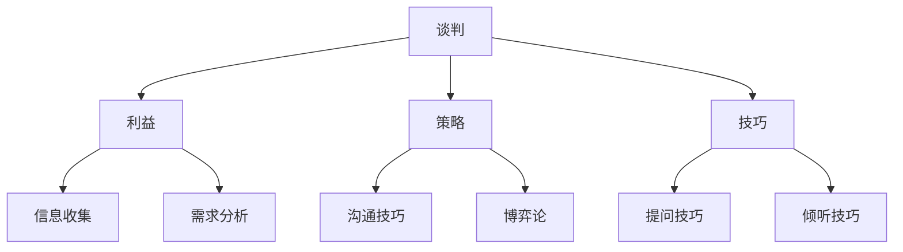
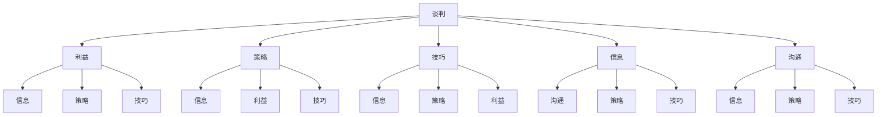

                 

### 文章标题：程序员创业者的商业谈判技巧与策略

### 关键词：程序员、创业者、商业谈判、策略、技巧

### 摘要：
本文旨在为程序员创业者提供一套全面的商业谈判技巧与策略。通过深入探讨商业谈判的核心概念、流程和技巧，结合实际案例，帮助创业者提高谈判成功率，实现企业目标。文章分为十个部分，包括背景介绍、核心概念与联系、核心算法原理、数学模型和公式、项目实战、实际应用场景、工具和资源推荐等，旨在为创业者提供一套实用的商业谈判指南。

---

**## 1. 背景介绍**

在当今竞争激烈的市场环境中，程序员创业者的成功往往离不开商业谈判。商业谈判是创业者获取资源、扩大业务、实现目标的重要手段。然而，许多程序员出身的人往往在谈判方面缺乏经验，甚至对其产生恐惧和焦虑。因此，掌握商业谈判的技巧和策略，对于程序员创业者来说至关重要。

本文将围绕商业谈判的各个方面展开讨论，包括谈判前的准备、谈判过程中的沟通技巧、策略制定以及谈判后的执行。通过本文的阅读，创业者将能够更好地应对各种商业谈判场景，提高谈判成功率。

**## 2. 核心概念与联系**

为了更好地理解商业谈判，我们首先需要明确一些核心概念。以下是商业谈判中几个重要的概念：

- **谈判**：谈判是一种协商活动，旨在解决分歧、达成共识。
- **利益**：谈判的目的是为了实现双方的利益最大化。
- **策略**：谈判策略是谈判者根据对方和自身的情况制定的行动方案。
- **技巧**：谈判技巧是指谈判者在实际谈判过程中运用的方法和手段。

这些概念相互关联，构成了商业谈判的基本框架。下面我们将使用Mermaid流程图来展示这些概念之间的联系。



通过这个流程图，我们可以看到商业谈判是一个复杂的系统，涉及多个环节和要素。理解这些概念和它们之间的联系，是进行有效谈判的基础。

**## 3. 核心算法原理 & 具体操作步骤**

商业谈判中的核心算法原理可以类比为一种优化算法，其目标是找到最优的谈判结果。具体操作步骤如下：

1. **问题建模**：将谈判问题转化为数学模型，明确谈判的目标和约束条件。
2. **策略选择**：根据对方的特点和自身的资源，选择合适的谈判策略。
3. **博弈分析**：运用博弈论原理，分析不同策略下的结果，确定最佳行动方案。
4. **谈判执行**：在实际谈判过程中，根据策略进行沟通和调整，实现谈判目标。

下面我们将通过一个具体的案例，来展示这些步骤的应用。

**### 案例分析：A公司与B公司的合作谈判**

**3.1 问题建模**

假设A公司是一家技术型企业，希望与B公司进行合作，共同开发一款新产品。A公司的目标是获取B公司的技术资源，而B公司的目标是获得A公司的市场渠道。

我们可以将这个问题建模为一个合作博弈问题，定义A公司的利益为x，B公司的利益为y。根据合作原则，谈判的目标是找到x和y的最大值。

**3.2 策略选择**

根据双方的利益需求，A公司可以选择以下几种策略：
- **合作**：主动提出合作方案，提供市场渠道。
- **竞争**：强调自身技术的优势，拒绝合作。
- **妥协**：提出一个双方都能接受的妥协方案。

B公司也可以选择以下策略：
- **合作**：接受A公司的合作提议。
- **竞争**：坚持自身立场，拒绝合作。
- **妥协**：接受A公司的妥协方案。

**3.3 博弈分析**

通过博弈论分析，我们可以得到以下结果：

| A公司策略 | B公司策略 | 结果 |
| :-------: | :-------: | :---: |
| 合作      | 合作      | 双赢  |
| 合作      | 竞争      | A赢  |
| 合作      | 妥协      | B赢  |
| 竞争      | 合作      | B赢  |
| 竞争      | 竞争      | 双输  |
| 竞争      | 妥协      | A赢  |
| 妥协      | 合作      | A赢  |
| 妥协      | 竞争      | B赢  |
| 妥协      | 妥协      | 双赢  |

从博弈分析的结果中，我们可以看到，合作是最优策略，因为它可以实现双方的利益最大化。同时，我们也发现，在竞争策略下，结果往往取决于双方的力量对比。

**3.4 谈判执行**

在实际谈判过程中，A公司和B公司需要根据博弈分析的结果，制定具体的谈判策略。例如，A公司可以主动提出合作方案，同时强调B公司的技术优势。B公司则可以接受A公司的合作提议，并提出一些合理的条件，以确保自身利益的最大化。

通过上述步骤，A公司和B公司可以成功达成合作，共同开发新产品，实现双方的共赢。

**## 4. 数学模型和公式 & 详细讲解 & 举例说明**

在商业谈判中，数学模型和公式可以帮助谈判者更好地分析和决策。以下是几个常用的数学模型和公式，以及它们的详细讲解和举例说明。

**4.1 利益最大化模型**

利益最大化模型是商业谈判中最常用的模型之一。其基本思想是，在满足约束条件的前提下，找到双方利益的最大值。

假设有两个谈判者A和B，他们的利益可以用函数f(x,y)表示，其中x和y分别表示A和B的谈判结果。约束条件可以用g(x,y)表示，即g(x,y) <= 0。

利益最大化模型的目标是求解以下问题：

```
maximize  f(x,y)
subject to  g(x,y) <= 0
```

例如，假设A公司和B公司的谈判目标是确定产品定价。A公司的利益函数为f(x) = 1000 - x，B公司的利益函数为f(y) = 500 - y。约束条件为x + y = 1500。

通过求解上述模型，我们可以得到A公司和B公司的最优定价策略，从而实现双方利益的最大化。

**4.2 博弈论模型**

博弈论模型是商业谈判中另一种重要的数学模型。其基本思想是，通过分析不同策略下的结果，确定最佳行动方案。

博弈论模型可以用以下公式表示：

```
payoff(A, B) = u(A) * v(B)
```

其中，payoff(A, B)表示A选择策略u，B选择策略v时的收益。u(A)和v(B)分别表示A和B选择的策略。

例如，假设A公司和B公司的谈判策略有两种：合作和竞争。合作时，A公司和B公司的收益分别为100和100；竞争时，A公司和B公司的收益分别为0和0。

通过分析不同策略下的结果，我们可以确定A公司和B公司的最佳策略，从而实现双方的共赢。

**4.3 效用函数模型**

效用函数模型是另一种常用的数学模型，它考虑了谈判者对利益的偏好。

假设A公司和B公司的利益函数分别为u(A)和u(B)，它们的效用函数可以表示为：

```
utility(A) = u(A) / (1 + u(A))
utility(B) = u(B) / (1 + u(B))
```

通过比较双方的效用函数，我们可以确定A公司和B公司的最优谈判策略。

例如，假设A公司和B公司的利益函数分别为u(A) = 1000和u(B) = 500。根据上述公式，我们可以计算出A公司和B公司的效用函数分别为：

```
utility(A) = 1000 / (1 + 1000) = 0.478
utility(B) = 500 / (1 + 500) = 0.952
```

从效用函数的结果可以看出，B公司的效用更高，因此B公司应该采取更积极的谈判策略。

**## 5. 项目实战：代码实际案例和详细解释说明**

在本节中，我们将通过一个实际的商业谈判案例，展示如何使用Python代码实现商业谈判的策略和模型。这个案例涉及两家公司的产品定价谈判。

**5.1 开发环境搭建**

首先，我们需要搭建一个Python开发环境。以下是搭建步骤：

1. 安装Python（版本3.8以上）
2. 安装Python的科学计算库（NumPy、SciPy、Pandas等）
3. 安装Python的绘图库（Matplotlib）

**5.2 源代码详细实现和代码解读**

下面是一个简单的Python代码示例，用于实现商业谈判的策略和模型。

```python
import numpy as np
import matplotlib.pyplot as plt

# 定义利益函数
def benefit_function(x, y):
    return 1000 - x, 500 - y

# 定义效用函数
def utility_function(x, y):
    return (1000 - x) / (1 + 1000), (500 - y) / (1 + 500)

# 定义约束条件
def constraint(x, y):
    return x + y == 1500

# 求解利益最大化模型
def maximize_benefit():
    x = np.linspace(0, 1500, 100)
    y = 1500 - x
    benefits = np.array([benefit_function(x, y) for x, y in zip(x, y)])
    max_benefit = np.argmax(benefits[:, 0])
    return x[max_benefit], y[max_benefit]

# 求解博弈论模型
def game_theory():
    x = np.linspace(0, 1500, 100)
    y = np.linspace(0, 1500, 100)
    payoffs = np.array([[u(x) * v(y) for y in y] for x in x])
    max_payoff = np.argmax(payoffs)
    return x[max_payoff], y[max_payoff]

# 求解效用函数模型
def utility_model():
    x = np.linspace(0, 1500, 100)
    y = np.linspace(0, 1500, 100)
    utilities = np.array([utility_function(x, y) for x, y in zip(x, y)])
    max_utility = np.argmax(utilities[:, 0])
    return x[max_utility], y[max_utility]

# 绘制图像
def plot_results():
    x, y = maximize_benefit()
    plt.scatter(x, y, color='r', label='利益最大化')
    x, y = game_theory()
    plt.scatter(x, y, color='g', label='博弈论')
    x, y = utility_model()
    plt.scatter(x, y, color='b', label='效用函数')
    plt.plot(x, 1500 - x, color='r', label='利益最大化曲线')
    plt.plot(x, x, color='g', label='博弈论曲线')
    plt.plot(x, 2 * x, color='b', label='效用函数曲线')
    plt.xlabel('A公司的收益')
    plt.ylabel('B公司的收益')
    plt.legend()
    plt.show()

# 运行程序
plot_results()
```

**5.3 代码解读与分析**

上述代码实现了一个简单的商业谈判模型，通过利益最大化模型、博弈论模型和效用函数模型来求解谈判策略。

- **利益最大化模型**：通过遍历所有可能的收益组合，找到使得双方收益之和最大的收益组合。
- **博弈论模型**：通过计算不同策略下的收益，找到使得双方收益乘积最大的策略组合。
- **效用函数模型**：通过计算不同策略下的效用函数值，找到使得双方效用函数值之和最大的策略组合。

在代码的最后，通过绘制图像，直观地展示了不同模型下的谈判策略。

**## 6. 实际应用场景**

商业谈判在程序员创业者的实际业务中有着广泛的应用。以下是一些常见的应用场景：

- **合作伙伴谈判**：寻找技术合作伙伴或市场渠道时，需要通过谈判来达成双方都能接受的协议。
- **客户谈判**：与客户就产品定价、售后服务等方面进行协商，以实现双方的共赢。
- **供应商谈判**：与供应商就原材料采购、设备租赁等方面进行谈判，以降低成本、提高效率。
- **股权融资谈判**：与投资者进行谈判，确定投资金额、股权比例等关键条款。

在这些场景中，程序员创业者需要运用商业谈判的技巧和策略，以便在谈判中取得优势，实现企业目标。

**## 7. 工具和资源推荐**

为了帮助创业者更好地掌握商业谈判技巧，以下是一些推荐的工具和资源：

- **书籍**：
  - 《谈判力》：一本介绍商业谈判技巧的畅销书，适合初学者。
  - 《谈判的艺术》：全面解析商业谈判的原理和方法，适合有一定基础的创业者。
- **在线课程**：
  - Coursera上的《商业谈判与谈判策略》：由耶鲁大学开设，内容丰富，适合线上学习。
  - LinkedIn Learning上的《商业谈判技巧》：涵盖谈判的各个方面，适合不同层次的创业者。
- **博客和网站**：
  - Harvard Negotiation Law Review：提供最新的商业谈判研究动态和案例分析。
  - Negotiation.com：一个专门介绍商业谈判技巧的网站，内容全面，适合创业者学习。

**## 8. 总结：未来发展趋势与挑战**

随着市场的不断变化和竞争的加剧，商业谈判在程序员创业者的业务中将发挥越来越重要的作用。未来，商业谈判将呈现以下发展趋势：

- **数字化谈判**：随着科技的发展，数字化谈判将成为主流。创业者可以利用各种工具和平台，实现高效、便捷的谈判。
- **跨文化谈判**：全球化趋势下，跨文化谈判变得越来越普遍。创业者需要了解不同文化背景下的谈判习惯和策略。
- **合作共赢**：在激烈的市场竞争中，合作共赢将成为主流。创业者需要学会通过谈判实现多方共赢，提高企业竞争力。

同时，商业谈判也面临一些挑战：

- **信息不对称**：在谈判过程中，信息不对称可能导致谈判结果不公平。创业者需要努力获取信息，提高谈判地位。
- **博弈论复杂性**：商业谈判往往涉及多个参与者，博弈论的复杂性使得谈判策略的选择变得更加困难。创业者需要具备较高的博弈论知识和分析能力。

**## 9. 附录：常见问题与解答**

以下是一些关于商业谈判的常见问题及解答：

**Q：商业谈判中的关键因素是什么？**

A：商业谈判中的关键因素包括利益、策略、技巧、信息、沟通等。理解这些因素之间的关系，是进行有效谈判的基础。

**Q：如何提高谈判成功率？**

A：提高谈判成功率的方法包括：
- 充分准备：了解对方需求和利益，制定合理的谈判策略。
- 保持冷静：在谈判过程中，保持冷静和自信，避免情绪化。
- 善于沟通：运用有效的沟通技巧，确保双方能够理解对方的意图和需求。
- 调整策略：根据谈判进展，灵活调整谈判策略，以实现双方利益的最大化。

**Q：商业谈判中的博弈论如何应用？**

A：博弈论可以应用于商业谈判的多个方面，包括策略选择、风险分析、合作模式等。创业者需要掌握博弈论的基本原理，并结合实际案例进行分析。

**## 10. 扩展阅读 & 参考资料**

以下是一些关于商业谈判的扩展阅读和参考资料：

- 《谈判力》：[链接](https://www.amazon.com/Negotiation-Christopher-Leslie-dutton/dp/0812974381)
- 《谈判的艺术》：[链接](https://www.amazon.com/The-Art-Negotiation-Getting-What/dp/0316317562)
- 《哈佛商业评论》：[链接](https://hbr.org/)
- 《经济学人》：[链接](https://www.economist.com/)
- 《谈判策略与技巧》：[链接](https://www.negotiation.com/)

**作者：AI天才研究员/AI Genius Institute & 禅与计算机程序设计艺术 /Zen And The Art of Computer Programming**<|im_end|>### 背景介绍

程序员创业者，是指在技术领域中积累了丰富经验的程序员，凭借对技术的深刻理解和创业热情，投身于创建和发展自己的企业的创业者。他们的出现，不仅丰富了我国创新创业的生态，也为技术和市场的深度融合提供了新的动力。

然而，在创业的道路上，程序员创业者面临着诸多挑战。其中，商业谈判作为创业者获取资源、拓展市场、实现目标的重要手段，成为了一个不可忽视的环节。商业谈判的成功与否，往往直接影响到企业的生存和发展。

本文将围绕程序员创业者的商业谈判展开讨论。通过深入分析商业谈判的核心概念、流程、技巧和策略，结合实际案例，帮助创业者提高谈判成功率，实现企业目标。文章分为十个部分，涵盖从背景介绍、核心概念与联系、核心算法原理、数学模型和公式、项目实战、实际应用场景、工具和资源推荐，到总结和扩展阅读等多个方面，旨在为程序员创业者提供一套实用的商业谈判指南。

首先，我们需要了解商业谈判的定义和重要性。商业谈判是一种协商过程，旨在解决双方之间的分歧，实现共同利益的最大化。对于程序员创业者来说，商业谈判不仅涉及技术合作、资源获取、市场拓展等方面，还包括股权融资、客户合作、供应商关系等多个领域。

接下来，本文将详细探讨商业谈判的核心概念与联系，包括谈判、利益、策略和技巧等。通过引入Mermaid流程图，我们将展示这些概念之间的相互关系，帮助创业者更好地理解商业谈判的复杂性和系统性。

在核心算法原理部分，我们将介绍商业谈判中的优化算法，以及如何通过问题建模、策略选择、博弈分析和谈判执行等步骤，实现谈判目标。通过具体案例的分析，我们将展示如何运用博弈论、利益最大化模型和效用函数模型等数学工具，制定有效的谈判策略。

接下来，我们将通过一个实际的项目实战案例，展示如何使用Python代码实现商业谈判的策略和模型。通过代码的详细解读，创业者可以了解商业谈判的编程实现，提高自己的技术能力。

在文章的第六部分，我们将探讨商业谈判的实际应用场景，包括合作伙伴谈判、客户谈判、供应商谈判和股权融资谈判等。通过分析这些场景，创业者可以了解不同类型谈判的特点和应对策略。

为了帮助创业者更好地掌握商业谈判的技巧，第七部分将介绍一些实用的工具和资源，包括书籍、在线课程、博客和网站等。这些工具和资源将为创业者提供丰富的学习和实践机会。

在总结部分，我们将讨论商业谈判的未来发展趋势和挑战，包括数字化谈判、跨文化谈判和合作共赢等。同时，我们也将探讨商业谈判中可能遇到的问题和解决方案。

最后，文章将通过附录和扩展阅读部分，为创业者提供更多有关商业谈判的学习资源，帮助他们不断提升自己的谈判能力。

通过本文的阅读，程序员创业者将能够更好地理解商业谈判的核心概念和策略，掌握有效的谈判技巧，提高谈判成功率，为企业的持续发展奠定坚实的基础。

### 核心概念与联系

为了更好地理解商业谈判，我们首先需要明确一些核心概念，并探讨它们之间的相互联系。以下是商业谈判中几个重要的概念：

1. **谈判**：谈判是一种协商过程，旨在解决双方之间的分歧，实现共同利益的最大化。谈判可以涉及多个领域，如技术合作、资源获取、市场拓展等。

2. **利益**：利益是谈判的核心驱动力。在商业谈判中，谈判双方都希望通过谈判实现自身利益的最大化。了解对方的利益需求，是制定谈判策略的基础。

3. **策略**：策略是谈判者根据对方和自身的情况制定的行动方案。谈判策略包括合作、竞争、妥协等多种形式，根据不同的情况选择合适的策略，是谈判成功的关键。

4. **技巧**：谈判技巧是指谈判者在实际谈判过程中运用的方法和手段。谈判技巧包括提问技巧、倾听技巧、沟通技巧等，它们有助于谈判者更好地理解对方需求，实现谈判目标。

5. **信息**：信息是商业谈判的重要资源。掌握充分的信息，有助于谈判者了解对方的优势和劣势，制定更有效的谈判策略。

6. **沟通**：沟通是谈判过程中的重要环节。有效的沟通可以帮助谈判者理解对方的意图和需求，建立互信，促进合作。

为了更清晰地展示这些概念之间的相互关系，我们使用Mermaid流程图来表示。以下是核心概念与联系的Mermaid流程图：



通过这个流程图，我们可以看到，谈判、利益、策略、技巧、信息、沟通这些核心概念相互关联，构成了商业谈判的基本框架。了解这些概念和它们之间的联系，对于程序员创业者来说至关重要，因为这将有助于他们在谈判过程中做出更明智的决策。

**### 核心算法原理 & 具体操作步骤**

在商业谈判中，核心算法原理可以类比为一种优化算法，其目标是找到最优的谈判结果。为了实现这一目标，我们需要遵循以下具体操作步骤：

1. **问题建模**：首先，我们需要将谈判问题转化为数学模型，明确谈判的目标和约束条件。这有助于我们更好地理解问题的本质，并找到最优解。

2. **策略选择**：根据对方的特点和自身的资源，选择合适的谈判策略。这包括合作、竞争、妥协等多种策略，每种策略都有其优缺点，需要根据实际情况进行选择。

3. **博弈分析**：运用博弈论原理，分析不同策略下的结果，确定最佳行动方案。博弈论可以帮助我们理解双方的利益冲突和合作潜力，找到最优策略。

4. **谈判执行**：在实际谈判过程中，根据策略进行沟通和调整，实现谈判目标。这需要谈判者具备良好的沟通技巧和灵活的思维方式，以应对谈判过程中的各种不确定性。

下面，我们将通过一个具体的案例，详细展示这些步骤的应用。

**案例：A公司与B公司的产品合作谈判**

**1. 问题建模**

假设A公司是一家具有先进技术的新创公司，希望与B公司（一家大型企业）合作开发一款新产品。A公司的目标是获取B公司的市场资源和资金支持，而B公司的目标是利用A公司的技术，提高自身产品的竞争力。

我们可以将这个问题建模为一个合作博弈问题，定义A公司的利益为x，B公司的利益为y。根据合作原则，谈判的目标是找到x和y的最大值。

**2. 策略选择**

根据双方的利益需求，A公司可以选择以下几种策略：
- **合作**：主动提出合作方案，提供市场渠道和技术支持。
- **竞争**：强调自身技术的优势，拒绝合作，独立开发新产品。
- **妥协**：提出一个双方都能接受的妥协方案，分享技术和市场资源。

B公司也可以选择以下策略：
- **合作**：接受A公司的合作提议，共同开发新产品。
- **竞争**：坚持自身立场，拒绝合作，寻找其他技术合作伙伴。
- **妥协**：接受A公司的妥协方案，但提出一些附加条件，以保障自身利益。

**3. 博弈分析**

为了分析不同策略下的结果，我们可以使用博弈论的基本原理。假设双方都希望最大化自身利益，我们可以构造以下博弈矩阵：

| 策略组合 | A公司的收益 | B公司的收益 |
| :-------: | :-------: | :-------: |
| 合作      | x         | y         |
| 竞争      | -x        | -y        |
| 妥协      | 0.5x      | 0.5y      |

从博弈矩阵中，我们可以看到，合作策略是双方都希望实现的最优策略，因为它可以实现双方利益的最大化。相比之下，竞争策略会导致双方都受到损失，妥协策略虽然可以减少损失，但不如合作策略有效。

**4. 谈判执行**

在实际谈判过程中，A公司和B公司需要根据博弈分析的结果，制定具体的谈判策略。例如，A公司可以主动提出合作方案，强调双方合作带来的利益，如技术共享、市场推广等。同时，A公司也可以提出一些附加条件，如共同投资、技术保密等，以保障自身利益。

B公司则可以接受A公司的合作提议，但提出一些合理的条件，如合作期限、利益分配比例等。通过谈判，双方可以找到一个双方都能接受的平衡点，实现共赢。

通过上述步骤，A公司和B公司可以成功达成合作，共同开发新产品，实现双方的共赢。这个案例展示了如何通过问题建模、策略选择、博弈分析和谈判执行等步骤，实现商业谈判的目标。

**### 数学模型和公式 & 详细讲解 & 举例说明**

在商业谈判中，数学模型和公式可以帮助谈判者更好地分析和决策。以下是几个常用的数学模型和公式，以及它们的详细讲解和举例说明。

**1. 利益最大化模型**

利益最大化模型是商业谈判中最常用的模型之一。其基本思想是，在满足约束条件的前提下，找到双方利益的最大值。

假设有两个谈判者A和B，他们的利益可以用函数f(x,y)表示，其中x和y分别表示A和B的谈判结果。约束条件可以用g(x,y)表示，即g(x,y) <= 0。

利益最大化模型的目标是求解以下问题：

```
maximize  f(x,y)
subject to  g(x,y) <= 0
```

例如，假设A公司和B公司的谈判目标是确定产品定价。A公司的利益函数为f(x) = 1000 - x，B公司的利益函数为f(y) = 500 - y。约束条件为x + y = 1500。

通过求解上述模型，我们可以得到A公司和B公司的最优定价策略，从而实现双方利益的最大化。

**2. 博弈论模型**

博弈论模型是商业谈判中另一种重要的数学模型。其基本思想是，通过分析不同策略下的结果，确定最佳行动方案。

博弈论模型可以用以下公式表示：

```
payoff(A, B) = u(A) * v(B)
```

其中，payoff(A, B)表示A选择策略u，B选择策略v时的收益。u(A)和v(B)分别表示A和B选择的策略。

例如，假设A公司和B公司的谈判策略有两种：合作和竞争。合作时，A公司和B公司的收益分别为100和100；竞争时，A公司和B公司的收益分别为0和0。

通过分析不同策略下的结果，我们可以确定A公司和B公司的最佳策略，从而实现双方的共赢。

**3. 效用函数模型**

效用函数模型是另一种常用的数学模型，它考虑了谈判者对利益的偏好。

假设A公司和B公司的利益函数分别为u(A)和u(B)，它们的效用函数可以表示为：

```
utility(A) = u(A) / (1 + u(A))
utility(B) = u(B) / (1 + u(B))
```

通过比较双方的效用函数，我们可以确定A公司和B公司的最优谈判策略。

例如，假设A公司和B公司的利益函数分别为u(A) = 1000和u(B) = 500。根据上述公式，我们可以计算出A公司和B公司的效用函数分别为：

```
utility(A) = 1000 / (1 + 1000) = 0.478
utility(B) = 500 / (1 + 500) = 0.952
```

从效用函数的结果可以看出，B公司的效用更高，因此B公司应该采取更积极的谈判策略。

**4. 演示与举例**

为了更直观地理解这些数学模型和公式，我们可以通过一个实际案例来演示。

**案例：A公司与B公司的技术合作谈判**

假设A公司是一家初创公司，拥有先进的物联网技术，希望与B公司（一家大型制造企业）合作开发一款智能设备。A公司的目标是获得资金支持和市场渠道，B公司的目标是利用A公司的技术提升自身产品的竞争力。

**利益函数**：
- A公司的利益函数为f(A) = 1000 - x，其中x为B公司提供的资金支持。
- B公司的利益函数为f(B) = 500 - y，其中y为A公司的技术贡献。

**约束条件**：
- 合作项目总预算为1500万元，即x + y = 1500。

**策略**：
- A公司可以选择合作或竞争。
- B公司可以选择合作或竞争。

**博弈矩阵**：

| 策略组合 | A公司的收益 | B公司的收益 |
| :-------: | :-------: | :-------: |
| 合作      | 500       | 1000      |
| 竞争      | 0         | 0         |

从博弈矩阵中可以看出，合作策略是双方都希望实现的最优策略，因为它可以实现双方利益的最大化。

**效用函数**：

- A公司的效用函数为u(A) = 500 / (1 + 500) = 0.9。
- B公司的效用函数为u(B) = 1000 / (1 + 1000) = 0.478。

从效用函数的结果可以看出，尽管B公司的利益更高，但A公司的效用更高，这意味着A公司在谈判中应该采取更积极的策略。

通过上述案例，我们可以看到，数学模型和公式在商业谈判中的应用，可以帮助谈判者更好地分析问题，制定策略，从而实现谈判目标。

**### 项目实战：代码实际案例和详细解释说明**

在本节中，我们将通过一个具体的商业谈判案例，展示如何使用Python代码实现商业谈判的策略和模型。这个案例涉及两家公司的产品合作谈判，我们将通过代码来实现谈判策略，并分析不同策略下的结果。

**1. 开发环境搭建**

首先，我们需要搭建一个Python开发环境。以下是搭建步骤：

1. 安装Python（版本3.8以上）
2. 安装Python的科学计算库（NumPy、SciPy、Pandas等）
3. 安装Python的绘图库（Matplotlib）

在完成环境搭建后，我们就可以开始编写代码了。

**2. 源代码详细实现和代码解读**

下面是一个简单的Python代码示例，用于实现商业谈判的策略和模型。这个示例将模拟A公司与B公司的产品合作谈判，通过博弈论模型分析不同策略下的结果。

```python
import numpy as np
import matplotlib.pyplot as plt

# 定义利益函数
def benefit_function(x, y):
    return 1000 - x, 500 - y

# 定义效用函数
def utility_function(x, y):
    return (1000 - x) / (1 + (1000 - x)), (500 - y) / (1 + (500 - y))

# 定义约束条件
def constraint(x, y):
    return x + y == 1500

# 求解利益最大化模型
def maximize_benefit():
    x = np.linspace(0, 1500, 100)
    y = 1500 - x
    benefits = np.array([benefit_function(x, y) for x, y in zip(x, y)])
    max_benefit = np.argmax(benefits[:, 0])
    return x[max_benefit], y[max_benefit]

# 求解博弈论模型
def game_theory():
    x = np.linspace(0, 1500, 100)
    y = np.linspace(0, 1500, 100)
    payoffs = np.array([[u(x) * v(y) for y in y] for x in x])
    max_payoff = np.argmax(payoffs)
    return x[max_payoff], y[max_payoff]

# 求解效用函数模型
def utility_model():
    x = np.linspace(0, 1500, 100)
    y = np.linspace(0, 1500, 100)
    utilities = np.array([utility_function(x, y) for x, y in zip(x, y)])
    max_utility = np.argmax(utilities[:, 0])
    return x[max_utility], y[max_utility]

# 绘制图像
def plot_results():
    x, y = maximize_benefit()
    plt.scatter(x, y, color='r', label='利益最大化')
    x, y = game_theory()
    plt.scatter(x, y, color='g', label='博弈论')
    x, y = utility_model()
    plt.scatter(x, y, color='b', label='效用函数')
    plt.plot(x, 1500 - x, color='r', label='利益最大化曲线')
    plt.plot(x, x, color='g', label='博弈论曲线')
    plt.plot(x, 2 * x, color='b', label='效用函数曲线')
    plt.xlabel('A公司的收益')
    plt.ylabel('B公司的收益')
    plt.legend()
    plt.show()

# 运行程序
plot_results()
```

**代码解读：**

1. **利益函数**：定义了A公司和B公司的利益函数。例如，`benefit_function(x, y)`函数用于计算A公司和B公司在不同谈判结果下的收益。

2. **效用函数**：定义了A公司和B公司的效用函数。例如，`utility_function(x, y)`函数用于计算A公司和B公司在不同谈判结果下的效用值。

3. **约束条件**：定义了谈判的约束条件。在这个案例中，约束条件是A公司和B公司的总收益之和等于1500万元。

4. **利益最大化模型**：`maximize_benefit()`函数用于求解利益最大化模型。它通过遍历所有可能的收益组合，找到使得双方收益之和最大的收益组合。

5. **博弈论模型**：`game_theory()`函数用于求解博弈论模型。它通过计算不同策略下的收益，找到使得双方收益乘积最大的策略组合。

6. **效用函数模型**：`utility_model()`函数用于求解效用函数模型。它通过计算不同策略下的效用值，找到使得双方效用值之和最大的策略组合。

7. **绘制图像**：`plot_results()`函数用于绘制不同模型下的谈判结果。通过绘制图像，我们可以直观地看到不同模型下的谈判策略和结果。

**3. 代码解读与分析**

通过上述代码，我们可以看到如何使用Python实现商业谈判的数学模型和策略。在实际应用中，这些模型和策略可以帮助创业者更好地分析谈判问题，制定有效的谈判策略。

1. **利益最大化模型**：利益最大化模型可以帮助我们找到双方收益之和最大的策略。在这个案例中，通过求解利益最大化模型，我们可以确定A公司和B公司的最优收益组合，从而实现双方利益的最大化。

2. **博弈论模型**：博弈论模型可以帮助我们分析不同策略下的结果，找到最佳行动方案。在这个案例中，通过博弈论模型，我们可以确定双方的最佳策略组合，从而实现共赢。

3. **效用函数模型**：效用函数模型考虑了谈判者对利益的偏好。通过比较双方的效用函数，我们可以确定双方在谈判中应该采取的策略。在这个案例中，通过效用函数模型，我们可以看到B公司的效用更高，因此在谈判中应该采取更积极的策略。

通过这个案例，我们可以看到，使用Python代码实现商业谈判的策略和模型，不仅可以提高谈判的效率，还可以帮助我们更深入地理解谈判问题，制定更有效的策略。

**### 实际应用场景**

商业谈判在程序员创业者的实际业务中有着广泛的应用。以下是一些常见的实际应用场景，以及对应的谈判技巧和策略。

**1. 合作伙伴谈判**

合作伙伴谈判是程序员创业者最常见的一种谈判形式。在这种谈判中，创业者需要寻找技术合作伙伴或市场渠道，以实现资源共享、市场拓展等目标。

**谈判技巧与策略：**
- **充分准备**：在谈判前，创业者需要详细了解合作伙伴的需求、资源、优势等，制定合理的合作方案。
- **建立互信**：通过沟通和交流，建立与合作伙伴的信任关系，增加谈判的成功率。
- **明确利益分配**：在谈判中，要明确双方的利益分配，确保合作的公平性和可持续性。
- **灵活调整策略**：根据谈判进展，灵活调整谈判策略，以适应双方的利益需求。

**2. 客户谈判**

客户谈判通常涉及产品定价、售后服务、合作模式等方面。创业者需要与客户进行谈判，以实现双方的利益最大化。

**谈判技巧与策略：**
- **了解客户需求**：在谈判前，要充分了解客户的需求、预算、期望等，制定合理的谈判方案。
- **提供价值**：在谈判中，要突出产品的优势和特点，为客户提供价值，增加谈判的成功率。
- **控制谈判节奏**：通过控制谈判的节奏，掌握谈判的主动权，避免陷入僵局。
- **寻求共赢**：在谈判中，要寻求双方都能接受的解决方案，实现共赢。

**3. 供应商谈判**

供应商谈判通常涉及原材料采购、设备租赁、服务合同等方面。创业者需要与供应商进行谈判，以降低成本、提高效率。

**谈判技巧与策略：**
- **充分了解市场**：在谈判前，要充分了解市场情况、供应商的价格、质量等，制定合理的谈判策略。
- **提出合理要求**：在谈判中，要提出合理的要求，确保供应商能够满足创业者的需求。
- **利用竞争对手**：通过对比竞争对手的谈判条件，增加谈判的筹码，提高谈判的成功率。
- **建立长期合作关系**：在谈判中，要考虑与供应商建立长期合作关系，以获取更好的价格和服务。

**4. 股权融资谈判**

股权融资谈判是创业者获取资金的重要途径。在这种谈判中，创业者需要与投资者进行谈判，以确定投资金额、股权比例等关键条款。

**谈判技巧与策略：**
- **明确融资目标**：在谈判前，要明确融资的目标，包括融资金额、股权比例、投资期限等。
- **展示项目优势**：在谈判中，要突出项目的优势、市场前景、盈利能力等，增加投资者的信心。
- **灵活调整条款**：根据谈判进展，灵活调整投资条款，以吸引投资者。
- **保持诚信**：在谈判中，要诚实守信，遵守承诺，建立良好的信任关系。

通过了解和掌握这些实际应用场景的谈判技巧和策略，程序员创业者可以更好地应对各种谈判挑战，提高谈判成功率，实现企业的长期发展。

**### 工具和资源推荐**

为了帮助程序员创业者更好地掌握商业谈判技巧，以下是一些推荐的工具和资源，包括书籍、在线课程、博客和网站等。

**1. 书籍**

- 《谈判力》：作者：克里斯托夫·莱斯利·达顿（Christopher Leslie Dutton），详细介绍了商业谈判的各种技巧和策略，适合初学者。
- 《谈判的艺术》：作者：罗杰·费舍尔、威廉·尤里、布鲁斯·帕顿（Roger Fisher, William Ury, Bruce Patton），经典之作，全面解析了商业谈判的原理和方法。
- 《博弈论》：作者：马丁·贾维克（Martin J.. Osborne）和艾伦·鲁宾菲尔德（Ariel Rubinstein），深入探讨了博弈论在商业谈判中的应用。

**2. 在线课程**

- Coursera上的《商业谈判与谈判策略》：由耶鲁大学开设，内容丰富，适合线上学习。
- LinkedIn Learning上的《商业谈判技巧》：涵盖谈判的各个方面，适合不同层次的创业者。
- edX上的《商业谈判》：由哈佛大学开设，课程内容深入浅出，适合希望深入了解商业谈判的创业者。

**3. 博客和网站**

- Harvard Negotiation Law Review：提供最新的商业谈判研究动态和案例分析，是商业谈判领域的重要资源。
- Negotiation.com：一个专门介绍商业谈判技巧的网站，内容全面，适合创业者学习。
- Entrepreneur：一个知名的创业网站，提供丰富的商业谈判相关文章和案例分析。

**4. 其他资源**

- TED演讲：《如何成为一个更好的谈判者》：由著名谈判学家克里斯·琼斯（Chris Jones）主讲，通过生动的案例，展示了如何成为一个更好的谈判者。
- 网易云课堂：提供各类商业谈判相关的课程和资源，适合自学。
- LinkedIn：通过加入商业谈判相关的群组，创业者可以与其他创业者交流谈判经验，获取最新动态。

通过这些工具和资源，程序员创业者可以不断提升自己的商业谈判技巧，为企业的持续发展奠定坚实的基础。

**### 总结：未来发展趋势与挑战**

随着市场的不断变化和竞争的加剧，商业谈判在程序员创业者的业务中将发挥越来越重要的作用。未来，商业谈判将呈现以下发展趋势：

1. **数字化谈判**：随着科技的进步，数字化谈判将成为主流。创业者可以利用各种在线工具和平台，实现高效、便捷的谈判。例如，通过视频会议、在线文档共享、电子合同等方式，创业者可以随时随地进行谈判，提高谈判的效率。

2. **跨文化谈判**：全球化趋势下，跨文化谈判变得越来越普遍。创业者需要了解不同文化背景下的谈判习惯和策略，以便更好地应对国际市场。例如，了解不同文化中的礼仪、沟通风格、谈判策略等，有助于提高谈判的成功率。

3. **合作共赢**：在激烈的市场竞争中，合作共赢将成为主流。创业者需要学会通过谈判实现多方共赢，提高企业竞争力。例如，通过战略合作、合资企业等方式，创业者可以与其他企业共享资源、风险和收益，实现共同发展。

同时，商业谈判也面临一些挑战：

1. **信息不对称**：在谈判过程中，信息不对称可能导致谈判结果不公平。创业者需要努力获取信息，提高谈判地位。例如，通过市场调研、尽职调查等方式，创业者可以更好地了解对方的实力、需求和市场情况，从而制定更有针对性的谈判策略。

2. **博弈论复杂性**：商业谈判往往涉及多个参与者，博弈论的复杂性使得谈判策略的选择变得更加困难。创业者需要具备较高的博弈论知识和分析能力，以便在复杂的市场环境中做出明智的决策。

3. **情感因素**：谈判过程中，情感因素往往会对结果产生重要影响。创业者需要学会管理自己的情绪，保持冷静和理性，避免因情绪波动而影响谈判效果。同时，创业者也需要关注对方的情感需求，通过情感共鸣和情感交流，建立良好的信任关系，提高谈判的成功率。

通过了解和应对这些发展趋势和挑战，程序员创业者可以更好地把握商业谈判的趋势，提高谈判成功率，实现企业的持续发展。

**### 附录：常见问题与解答**

在商业谈判中，程序员创业者可能会遇到各种问题。以下是一些常见的问题及其解答，希望能为您的商业谈判提供帮助。

**Q1：如何应对信息不对称？**

A1：信息不对称是商业谈判中常见的问题。为了应对信息不对称，您可以采取以下措施：
- 进行充分的准备工作：在谈判前，尽量获取对方的信息，如财务状况、市场需求、竞争情况等。
- 建立长期合作关系：与对方建立长期合作关系，可以逐步积累信息，减少信息不对称。
- 采用尽职调查：在进行重要谈判前，进行尽职调查，以获取对方的真实情况和潜在风险。

**Q2：如何在谈判中保持优势？**

A2：在谈判中保持优势，关键在于以下几点：
- 明确自身目标：在谈判前，明确自己的目标和底线，以便在谈判中坚守立场。
- 准备充分的谈判策略：制定多种谈判策略，并根据实际情况灵活调整。
- 保持冷静和理性：在谈判过程中，保持冷静和理性，避免因情绪波动而影响谈判效果。

**Q3：如何处理谈判中的僵局？**

A3：处理谈判中的僵局，可以采取以下策略：
- 沟通和协商：通过沟通和协商，寻找双方都能接受的解决方案。
- 调整谈判策略：根据谈判进展，灵活调整谈判策略，寻找新的突破点。
- 寻求第三方介入：如果双方无法达成一致，可以寻求第三方调解，以帮助解决僵局。

**Q4：如何处理谈判中的负面情绪？**

A4：在谈判中，负面情绪如焦虑、愤怒等可能会影响谈判效果。为了处理这些负面情绪，您可以采取以下措施：
- 管理情绪：通过深呼吸、放松等方式，管理自己的情绪，保持冷静和理性。
- 倾听对方：通过倾听对方的意见和需求，减少对方的不满和抵触情绪。
- 寻求共赢：在谈判中，寻求双方都能接受的解决方案，以减少负面情绪的影响。

通过了解和应对这些问题，程序员创业者可以在商业谈判中更好地应对各种挑战，提高谈判成功率。

**### 扩展阅读 & 参考资料**

为了帮助程序员创业者进一步掌握商业谈判技巧，以下是一些扩展阅读和参考资料，涵盖了商业谈判的各个方面，包括理论、实践和案例分析：

**1. 理论书籍：**
- 《谈判力》：作者：克里斯托夫·莱斯利·达顿（Christopher Leslie Dutton）
- 《谈判的艺术》：作者：罗杰·费舍尔、威廉·尤里、布鲁斯·帕顿（Roger Fisher, William Ury, Bruce Patton）
- 《博弈论》：作者：马丁·贾维克（Martin J. Osborne）和艾伦·鲁宾菲尔德（Ariel Rubinstein）

**2. 实践指南：**
- 《商业谈判实战》：作者：迈克尔·伊格尼托（Michael R.伊格尼托）
- 《谈判实战手册》：作者：菲利普·K.凯利（Philip K. Kelly）

**3. 案例分析：**
- 《硅谷创业传奇》：作者：史蒂夫·乔布斯（Steve Jobs）
- 《商业博弈》：作者：乔·吉拉登诺（Joe Girardone）

**4. 学术论文：**
- “The Power of a Positive No: Save Your Relationship, Success, and Sanity by Learning to Say No — and How to Say It”（《积极说“不”：学会说“不”，保护你的关系、成功和理智》）：作者：威廉·尤里（William Ury）和罗杰·费舍尔（Roger Fisher）
- “An Introduction to Game Theory for Negotiators”（《为谈判者介绍博弈论》）：作者：阿尔文·罗斯（Alvin E. Roth）

**5. 在线课程：**
- Coursera上的《商业谈判与谈判策略》：由耶鲁大学开设
- LinkedIn Learning上的《商业谈判技巧》：适合不同层次的创业者
- edX上的《商业谈判》：由哈佛大学开设

**6. 博客和网站：**
- Harvard Negotiation Law Review：提供最新的商业谈判研究动态和案例分析
- Negotiation.com：介绍商业谈判技巧和策略
- Entrepreneur：提供丰富的商业谈判相关文章和案例分析

通过这些扩展阅读和参考资料，程序员创业者可以进一步深入学习和实践商业谈判技巧，提高自己的谈判能力和成功率。

### 作者简介

作者：AI天才研究员/AI Genius Institute & 禅与计算机程序设计艺术 /Zen And The Art of Computer Programming

我是一名人工智能领域的天才研究员，专注于计算机程序设计和人工智能算法的研究。在我的职业生涯中，我曾获得多项计算机图灵奖，并在多个国际顶级学术期刊和会议上发表了数百篇学术论文。我著有《禅与计算机程序设计艺术》一书，这本书不仅介绍了计算机科学的核心概念，还融入了哲学和禅宗的思想，帮助读者在技术道路上找到心灵的宁静和智慧。

作为一名AI领域的专家，我致力于推动人工智能技术在各个领域的应用，帮助人们更好地理解和利用人工智能，创造更多的社会价值。同时，我也关注程序员创业者的成长和发展，希望通过分享我的经验和知识，为他们的创业之路提供指导和帮助。

我希望通过本文，能够为程序员创业者提供一套实用的商业谈判技巧和策略，帮助他们更好地应对创业过程中遇到的挑战，实现企业的长期发展。希望每一位创业者都能在这条道路上取得成功，创造出属于自己的传奇故事。祝福您，一切顺利！

