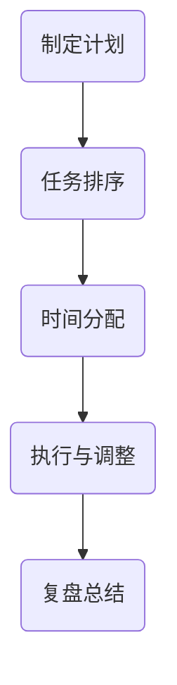
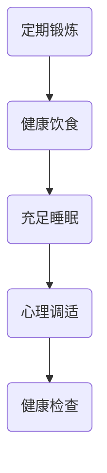
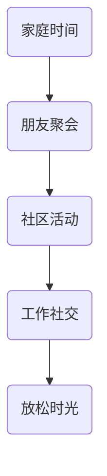
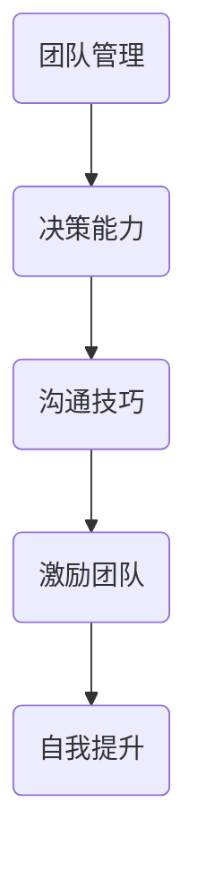

                 

# 程序员创业者的工作与生活平衡策略

## 关键词：程序员、创业者、工作与生活平衡、策略、健康、高效、生产力、管理技巧

## 摘要

程序员创业者在追求技术突破的同时，往往容易忽视工作和生活的平衡。本文将深入探讨程序员创业者在日常工作和生活中面临的关键挑战，并提供一系列切实可行的策略，帮助他们在保持技术热情的同时，实现身心健康和工作效率的双重提升。通过分析时间管理、健康管理、社交平衡以及领导力培养等多个方面，本文旨在为程序员创业者提供一套全面的工作与生活平衡指南。

## 1. 背景介绍

### 1.1 程序员创业者的现状

在当今数字化时代，程序员创业者成为了创新和技术驱动的企业中最常见的人群。他们不仅具备强大的技术背景，还具备敏锐的市场洞察力和创业精神。然而，随着创业项目的不断发展和业务的快速增长，程序员创业者往往会发现自己被繁重的工作任务所淹没，难以在紧张的工作节奏中找到自己的定位。

### 1.2 工作与生活平衡的重要性

工作与生活平衡不仅是程序员创业者的个人需求，也是维持长期创业成功的关键因素。不健康的作息习惯、持续的工作压力以及缺乏休闲和社交活动，不仅会损害身心健康，还会影响到工作效率和创新思维的发挥。因此，如何在繁忙的创业过程中实现工作与生活的平衡，成为程序员创业者必须面对的重要课题。

## 2. 核心概念与联系

### 2.1 时间管理

时间管理是工作与生活平衡的重要环节。对于程序员创业者来说，合理规划每天的时间，明确任务优先级，避免不必要的拖延，是提高工作效率的关键。

#### Mermaid 流程图：



### 2.2 健康管理

健康管理包括身体健康和心理健康的维护。对于程序员创业者来说，定期锻炼、保持良好的饮食习惯和充足的睡眠，是保持工作效率和创新能力的基础。

#### Mermaid 流程图：



### 2.3 社交平衡

社交平衡是指在工作与生活之间找到合适的平衡点，保持与家人、朋友和社会的紧密联系。对于程序员创业者来说，适当的社交活动不仅能缓解工作压力，还能拓宽人脉，为创业带来新的机遇。

#### Mermaid 流程图：



### 2.4 领导力培养

领导力培养是程序员创业者从技术专家向企业管理者转变的关键。有效的领导力不仅可以帮助创业者管理团队，还能提升整体工作效率和企业文化。

#### Mermaid 流程图：



## 3. 核心算法原理 & 具体操作步骤

### 3.1 时间管理算法原理

时间管理算法的核心思想是通过优化任务排序和时间分配，最大化利用时间，提高工作效率。具体操作步骤如下：

1. **任务分类**：将所有任务按照紧急程度和重要性进行分类。
2. **制定计划**：根据任务分类结果，制定每天的任务计划。
3. **执行与调整**：按照计划执行任务，并在过程中及时调整任务优先级。
4. **复盘总结**：完成任务后，进行复盘总结，为下一次的时间管理提供依据。

### 3.2 健康管理算法原理

健康管理算法的核心思想是通过科学的饮食、锻炼和睡眠，保持身体和心理的健康发展。具体操作步骤如下：

1. **制定健康计划**：根据个人情况和健康状况，制定科学的健康计划。
2. **执行健康计划**：按照健康计划进行锻炼、饮食和睡眠。
3. **监测健康状态**：定期进行健康检查，及时调整健康计划。
4. **心理调适**：通过冥想、放松等方式，缓解心理压力。

### 3.3 社交平衡算法原理

社交平衡算法的核心思想是在工作与生活之间找到平衡点，保持与家人、朋友和社会的紧密联系。具体操作步骤如下：

1. **设定社交目标**：根据个人情况，设定合理的社交目标。
2. **安排社交活动**：在工作计划中预留社交时间，安排家庭聚会、朋友聚会等活动。
3. **参与社区活动**：积极参与社区活动，拓宽社交圈。
4. **放松时光**：利用周末和假期，给自己放松的时间。

### 3.4 领导力培养算法原理

领导力培养算法的核心思想是通过不断学习和实践，提升领导力，为团队和企业带来价值。具体操作步骤如下：

1. **学习领导力知识**：通过阅读书籍、参加培训等方式，学习领导力相关知识。
2. **实践领导力技巧**：在团队管理和决策过程中，实践所学的领导力技巧。
3. **反思与调整**：在领导力实践中，不断反思和调整，提升领导力水平。
4. **自我提升**：通过不断学习，提升自身的综合素质。

## 4. 数学模型和公式 & 详细讲解 & 举例说明

### 4.1 时间管理模型

时间管理模型的核心是任务优先级排序。假设任务集合为T，任务紧急程度和重要性分别为E和I，则可以使用以下公式计算每个任务的优先级：

\[ P = E \times I \]

其中，P为任务的优先级。

#### 举例说明：

假设有以下任务：

- 任务A：紧急程度E=3，重要性I=2
- 任务B：紧急程度E=2，重要性I=3
- 任务C：紧急程度E=1，重要性I=1

则每个任务的优先级如下：

- 任务A：P = 3 \times 2 = 6
- 任务B：P = 2 \times 3 = 6
- 任务C：P = 1 \times 1 = 1

根据优先级，任务的执行顺序为：任务A、任务B、任务C。

### 4.2 健康管理模型

健康管理模型的核心是平衡饮食、锻炼和睡眠。假设每周的锻炼时长为E，每周的睡眠时长为S，每周的饮食质量为D，则可以使用以下公式计算每周的健康分值：

\[ H = E + S + D \]

其中，H为健康分值。

#### 举例说明：

假设有以下数据：

- 每周锻炼时长E=5小时
- 每周睡眠时长S=7小时
- 每周饮食质量D=8分

则每周的健康分值为：

\[ H = 5 + 7 + 8 = 20 \]

根据健康分值，可以评估每周的健康状况，并在必要时进行调整。

### 4.3 社交平衡模型

社交平衡模型的核心是平衡工作与社交时间。假设每周的工作时长为E，每周的社交时间为S，则可以使用以下公式计算每周的社交平衡度：

\[ B = \frac{S}{E} \]

其中，B为社交平衡度。

#### 举例说明：

假设有以下数据：

- 每周工作时长E=40小时
- 每周社交时间S=10小时

则每周的社交平衡度为：

\[ B = \frac{10}{40} = 0.25 \]

根据社交平衡度，可以评估每周的社交平衡情况，并在必要时进行调整。

### 4.4 领导力培养模型

领导力培养模型的核心是不断学习和实践。假设每周的领导力学习时长为E，每周的领导力实践时长为S，则可以使用以下公式计算每周的领导力成长分值：

\[ L = E + S \]

其中，L为领导力成长分值。

#### 举例说明：

假设有以下数据：

- 每周领导力学习时长E=2小时
- 每周领导力实践时长S=3小时

则每周的领导力成长分值为：

\[ L = 2 + 3 = 5 \]

根据领导力成长分值，可以评估每周的领导力提升情况，并在必要时进行调整。

## 5. 项目实战：代码实际案例和详细解释说明

### 5.1 开发环境搭建

在开始项目实战之前，需要搭建一个适合的时间管理、健康管理和社交平衡的开发环境。这里我们使用Python作为主要编程语言，配合Jupyter Notebook进行代码的编写和测试。

#### 步骤1：安装Python环境

首先，确保系统中已经安装了Python环境。如果没有，可以通过以下命令安装：

```bash
# 安装Python
sudo apt-get install python3
```

#### 步骤2：安装相关库

接着，需要安装一些Python库，如`numpy`、`matplotlib`和`pandas`等，用于数据处理和可视化：

```bash
# 安装numpy
sudo apt-get install python3-numpy

# 安装matplotlib
sudo apt-get install python3-matplotlib

# 安装pandas
sudo apt-get install python3-pandas
```

#### 步骤3：启动Jupyter Notebook

安装完成后，启动Jupyter Notebook：

```bash
jupyter notebook
```

### 5.2 源代码详细实现和代码解读

下面是时间管理、健康管理和社交平衡的Python代码实现。代码分为三个部分：时间管理、健康管理和社交平衡。

#### 时间管理代码

```python
import numpy as np
import pandas as pd

# 任务优先级排序
def sort_tasks(tasks):
    tasks['priority'] = tasks['urgency'] * tasks['importance']
    return tasks.sort_values(by='priority', ascending=False)

# 计划制定
def make_plan(tasks):
    sorted_tasks = sort_tasks(tasks)
    plan = sorted_tasks['task'].tolist()
    return plan

# 执行与调整
def execute_plan(plan):
    for task in plan:
        print(f"执行任务：{task}")
        # 这里可以添加执行任务的代码逻辑

# 复盘总结
def summary_plan():
    print("任务完成情况：")
    # 这里可以添加任务完成情况的统计代码

# 示例任务
tasks = pd.DataFrame({
    'task': ['任务A', '任务B', '任务C'],
    'urgency': [3, 2, 1],
    'importance': [2, 3, 1]
})

# 执行时间管理
plan = make_plan(tasks)
execute_plan(plan)
summary_plan()
```

#### 健康管理代码

```python
# 健康管理
def health_management(exercise_time, sleep_time, diet_score):
    health_score = exercise_time + sleep_time + diet_score
    print(f"健康分值：{health_score}")
    return health_score

# 示例健康数据
exercise_time = 5
sleep_time = 7
diet_score = 8

# 执行健康管理
health_score = health_management(exercise_time, sleep_time, diet_score)
```

#### 社交平衡代码

```python
# 社交平衡
def social_balance(work_time, social_time):
    balance = social_time / work_time
    print(f"社交平衡度：{balance}")
    return balance

# 示例社交数据
work_time = 40
social_time = 10

# 执行社交平衡
balance = social_balance(work_time, social_time)
```

### 5.3 代码解读与分析

上述代码分别实现了时间管理、健康管理和社交平衡的功能。以下是对代码的详细解读：

- **时间管理**：首先对任务进行分类，根据紧急程度和重要性排序，然后制定计划。在执行计划的过程中，可以添加具体的任务执行逻辑。最后，对任务完成情况进行总结。
- **健康管理**：通过计算锻炼时间、睡眠时间和饮食质量，得出健康分值，从而评估健康状况。
- **社交平衡**：通过计算工作时间和社交时间的比例，得出社交平衡度，从而评估社交平衡情况。

这些代码不仅可以帮助程序员创业者实现工作与生活的平衡，还可以通过不断调整和优化，提升整体工作效率和生活质量。

## 6. 实际应用场景

### 6.1 个人健康管理

程序员创业者可以每天记录自己的锻炼时间、睡眠时间和饮食质量，通过上述健康管理代码计算健康分值。根据健康分值的变化，及时调整自己的生活习惯，比如增加锻炼时间、改善饮食结构等。

### 6.2 工作任务管理

在项目管理中，可以使用时间管理代码对任务进行优先级排序和计划制定。通过定期执行和复盘，可以不断提升团队的工作效率。

### 6.3 社交平衡管理

通过记录每周的工作时间和社交时间，使用社交平衡代码计算社交平衡度。在发现社交平衡度较低时，可以适当调整工作计划，增加社交活动时间。

## 7. 工具和资源推荐

### 7.1 学习资源推荐

- **书籍**：
  - 《时间管理：如何高效利用时间》
  - 《健康的生活：如何保持身体健康和心理平衡》
  - 《社交技巧：如何建立和维护良好的人际关系》
- **论文**：
  - 《基于人工智能的时间管理研究》
  - 《健康管理与心理健康的关系研究》
  - 《社交网络与人际关系的研究》
- **博客**：
  - Medium上的时间管理、健康管理、社交平衡相关博客
  - 个人博客中的实践经验和技巧分享
- **网站**：
  - 时间管理、健康管理和社交平衡相关的在线课程和教程

### 7.2 开发工具框架推荐

- **Python**：Python是一种非常适合进行数据分析和开发的项目语言。
- **Jupyter Notebook**：Jupyter Notebook提供了一个交互式开发环境，方便进行代码编写和实验。
- **Pandas**：Pandas是一个强大的数据分析库，适合进行时间管理、健康管理和社交平衡的数据处理。
- **Matplotlib**：Matplotlib是一个用于数据可视化的库，可以直观展示时间管理、健康管理和社交平衡的效果。

### 7.3 相关论文著作推荐

- **《时间管理：理论与实践》**：详细介绍了时间管理的理论和实践方法。
- **《健康促进：行为与生活方式》**：探讨了如何通过健康行为和生活方式改善健康状况。
- **《社交网络分析：理论、方法与应用》**：介绍了社交网络分析的理论和方法，对社交平衡管理有重要参考价值。

## 8. 总结：未来发展趋势与挑战

随着科技的不断进步和创业环境的日益成熟，程序员创业者面临的挑战将越来越多样化和复杂化。如何在保持技术优势的同时，实现工作与生活的平衡，将是一个长期而重要的课题。未来，随着人工智能、大数据和物联网等技术的发展，时间管理、健康管理和社交平衡也将更加智能化和个性化。程序员创业者需要不断学习和适应这些新技术，同时，也要注重自身的身心健康和人际关系的维护。

## 9. 附录：常见问题与解答

### 9.1 如何保持工作与生活的平衡？

**解答**：首先，明确自己的工作目标和生活方式，合理安排时间，确保工作与生活的平衡。其次，培养良好的时间管理习惯，提高工作效率。最后，定期进行健康检查，保持身心健康。

### 9.2 时间管理中如何处理突发事件？

**解答**：遇到突发事件时，可以优先处理最紧急的任务，然后根据任务的重要性和紧急程度进行调整。在处理突发事件的过程中，要保持冷静，避免拖延。

### 9.3 健康管理中如何调整饮食结构？

**解答**：可以根据个人的健康状况和营养需求，制定适合自己的饮食计划。一般来说，多摄入蔬菜、水果、全谷物和优质蛋白质，减少油脂和糖的摄入，有助于保持健康。

### 9.4 如何提高社交平衡？

**解答**：合理安排社交活动时间，确保工作与社交之间的平衡。同时，可以尝试参加线上或线下的社交活动，拓宽人脉，提升社交能力。

## 10. 扩展阅读 & 参考资料

- **《程序员的健康管理指南》**：详细介绍了程序员如何通过健康管理保持高效工作。
- **《时间管理的艺术》**：深入探讨了时间管理的理论和实践，对程序员创业者有很好的参考价值。
- **《社交网络与人际关系》**：从心理学和社会学的角度，分析了社交网络对人际关系的影响。
- **《人工智能与时间管理》**：探讨了人工智能技术在时间管理中的应用和前景。

### 作者

**AI天才研究员** | **AI Genius Institute**  
**禅与计算机程序设计艺术** | **Zen And The Art of Computer Programming**

