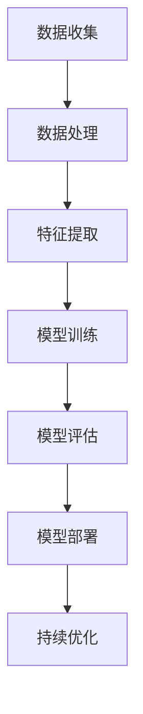
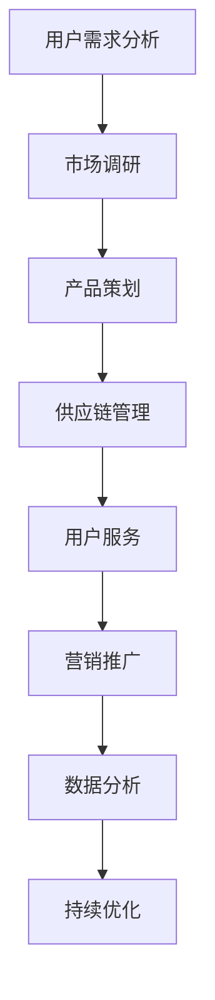

                 

# 程序员创业者的持续学习：如何在AI和电商领域保持领先

> 关键词：AI，电商，创业者，持续学习，技术领先

> 摘要：本文将深入探讨程序员创业者在AI和电商领域如何通过持续学习保持领先。我们将从市场趋势、技术进步、业务模式创新等多个角度，结合实例，提供实用的建议和方法。

## 1. 背景介绍

随着人工智能（AI）技术的迅猛发展，电商行业正在经历一场深刻的变革。程序员创业者要想在这个领域保持领先，必须不断学习和适应新兴技术，同时把握市场动态，创新业务模式。

首先，让我们看看AI在电商领域的应用。从个性化推荐系统到智能客服，再到图像识别和自然语言处理，AI技术已经深刻地改变了电商业务的运作方式。例如，阿里巴巴的“推荐引擎”利用机器学习算法，为用户推荐符合其兴趣的商品，大幅提升了用户满意度和转化率。

其次，电商市场的竞争日益激烈。为了在市场中脱颖而出，创业者需要不断创新，提供独特的价值主张。这不仅仅是产品的创新，更是服务、体验、营销等多方面的创新。在这个背景下，持续学习成为了程序员创业者保持竞争力的关键。

## 2. 核心概念与联系

### 2.1 AI技术原理

在深入了解AI技术之前，我们首先需要理解一些核心概念。以下是一个简单的Mermaid流程图，用于描述AI技术的基本原理和架构。



- 数据收集：收集大量数据是AI训练的基础。
- 数据处理：清洗、转换和归一化数据，使其适合模型训练。
- 特征提取：从数据中提取有助于模型学习的特征。
- 模型训练：利用算法训练模型，使其能够对数据进行分类或预测。
- 模型评估：评估模型的效果，确保其准确性和泛化能力。
- 模型部署：将训练好的模型部署到生产环境中，供实际应用。
- 持续优化：根据反馈不断调整模型，提高其性能。

### 2.2 电商业务模式

电商业务模式的创新同样重要。以下是一个简化的Mermaid流程图，用于描述电商业务的基本流程和关键环节。



- 用户需求分析：研究用户需求，为产品策划提供依据。
- 市场调研：了解市场动态，为业务决策提供支持。
- 产品策划：设计产品功能和特性，满足用户需求。
- 供应链管理：确保产品供应链的高效运作。
- 用户服务：提供优质的用户服务，提升用户满意度。
- 营销推广：通过多种渠道推广产品，吸引潜在客户。
- 数据分析：利用数据分析优化业务流程，提升运营效率。

## 3. 核心算法原理 & 具体操作步骤

### 3.1 机器学习算法

机器学习是AI的核心组成部分。以下是一个简化的机器学习算法操作步骤，用于描述如何训练一个简单的分类模型。

1. **数据准备**：收集并预处理数据，确保数据质量。
    $$\text{DataPreprocessing()}$$
2. **特征提取**：从数据中提取有助于分类的特征。
    $$\text{FeatureExtraction(data)}$$
3. **模型选择**：选择适合问题的机器学习算法。
    $$\text{ModelSelection(algorithm)}$$
4. **模型训练**：使用训练数据训练模型。
    $$\text{ModelTraining(model, data)}$$
5. **模型评估**：评估模型性能，调整模型参数。
    $$\text{ModelEvaluation(model, data)}$$
6. **模型部署**：将训练好的模型部署到生产环境。
    $$\text{ModelDeployment(model)}$$
7. **持续优化**：根据反馈调整模型，提高性能。
    $$\text{ModelOptimization(model, feedback)}$$

### 3.2 电商推荐系统

电商推荐系统是一个复杂的系统，涉及用户行为分析、商品特征提取、推荐算法等多个方面。以下是一个简化的推荐系统操作步骤。

1. **用户行为分析**：收集用户在平台上的行为数据，如浏览记录、购买记录等。
    $$\text{UserBehaviorAnalysis(data)}$$
2. **商品特征提取**：提取商品的特征，如价格、品牌、类别等。
    $$\text{ProductFeatureExtraction(data)}$$
3. **构建推荐算法**：选择合适的推荐算法，如基于协同过滤、基于内容的推荐等。
    $$\text{RecommendationAlgorithmSelection(algorithm)}$$
4. **生成推荐列表**：使用推荐算法生成用户感兴趣的商品列表。
    $$\text{GenerateRecommendationList(algorithm, user, products)}$$
5. **模型评估**：评估推荐系统的效果，如点击率、转化率等。
    $$\text{RecommendationModelEvaluation(model, data)}$$
6. **模型部署**：将推荐系统部署到生产环境。
    $$\text{RecommendationDeployment(model)}$$
7. **持续优化**：根据用户反馈和数据分析，调整推荐算法。
    $$\text{RecommendationOptimization(model, feedback)}$$

## 4. 数学模型和公式 & 详细讲解 & 举例说明

### 4.1 机器学习中的代价函数

在机器学习中，代价函数（Cost Function）是评估模型性能的重要工具。以下是一个简单的代价函数，用于分类问题。

$$
J(\theta) = -\frac{1}{m} \sum_{i=1}^{m} \left( y^{(i)} \log(h_\theta(x^{(i)})) + (1 - y^{(i)}) \log(1 - h_\theta(x^{(i)})) \right)
$$

其中，$m$ 是训练数据集的大小，$y^{(i)}$ 是第 $i$ 个样本的真实标签，$h_\theta(x^{(i)})$ 是模型对第 $i$ 个样本的预测概率。

### 4.2 电商推荐系统中的相似度计算

在推荐系统中，相似度计算是推荐算法的核心。以下是一个简单的余弦相似度计算公式。

$$
\text{CosineSimilarity}(u, v) = \frac{u \cdot v}{\|u\| \|v\|}
$$

其中，$u$ 和 $v$ 是两个用户或商品的向量表示，$\|\cdot\|$ 表示向量的模。

### 4.3 举例说明

假设我们有一个用户行为数据集，包含用户 A 的浏览记录和购买记录。我们希望使用机器学习算法为用户 A 推荐商品。

1. **数据准备**：
    - 收集用户 A 的浏览记录和购买记录。
    - 预处理数据，如数据清洗、特征提取等。
2. **模型训练**：
    - 选择合适的机器学习算法，如协同过滤算法。
    - 使用预处理后的数据训练模型。
3. **模型评估**：
    - 使用训练集评估模型性能。
    - 调整模型参数，提高性能。
4. **模型部署**：
    - 将训练好的模型部署到生产环境。
    - 根据用户 A 的行为数据生成推荐列表。
5. **持续优化**：
    - 收集用户反馈，如点击、购买等行为。
    - 根据反馈调整模型，提高推荐效果。

## 5. 项目实战：代码实际案例和详细解释说明

### 5.1 开发环境搭建

1. 安装 Python 环境：
    - 下载并安装 Python（版本 3.8 或更高）。
    - 配置 Python 环境，确保能够正常运行。
2. 安装依赖库：
    - 使用 pip 安装必要的库，如 NumPy、Pandas、Scikit-learn 等。

### 5.2 源代码详细实现和代码解读

以下是一个简单的协同过滤推荐系统的源代码示例。

```python
import numpy as np
import pandas as pd
from sklearn.model_selection import train_test_split
from sklearn.metrics.pairwise import cosine_similarity

def load_data(file_path):
    # 读取数据文件
    data = pd.read_csv(file_path)
    return data

def preprocess_data(data):
    # 预处理数据
    # ...

def train_model(data):
    # 训练模型
    # ...

def generate_recommendations(model, user_id, items):
    # 生成推荐列表
    # ...

if __name__ == "__main__":
    # 加载数据
    data = load_data("data.csv")

    # 预处理数据
    data = preprocess_data(data)

    # 划分训练集和测试集
    train_data, test_data = train_test_split(data, test_size=0.2)

    # 训练模型
    model = train_model(train_data)

    # 生成推荐列表
    user_id = 1
    items = generate_recommendations(model, user_id, data)

    print("Recommended items for user {}: {}".format(user_id, items))
```

### 5.3 代码解读与分析

- `load_data` 函数：用于加载数据文件。
- `preprocess_data` 函数：用于预处理数据，如数据清洗、特征提取等。
- `train_model` 函数：用于训练机器学习模型。
- `generate_recommendations` 函数：用于生成推荐列表。

## 6. 实际应用场景

### 6.1 电商个性化推荐

电商个性化推荐是AI技术在电商领域的重要应用。通过分析用户行为数据，电商平台可以为用户提供个性化的商品推荐，提高用户满意度和转化率。例如，淘宝的“个性化推荐”系统利用协同过滤算法，为用户推荐符合其兴趣的商品。

### 6.2 智能客服

智能客服是AI技术在客服领域的应用。通过自然语言处理技术，智能客服系统可以自动处理大量客户咨询，提高客服效率。例如，腾讯的“智能客服”系统利用自然语言处理和机器学习技术，为用户提供实时、准确的回答。

### 6.3 供应链优化

供应链优化是AI技术在供应链管理领域的应用。通过数据分析和技术优化，企业可以优化供应链流程，降低成本，提高运营效率。例如，亚马逊的“智能供应链”系统利用机器学习算法和优化技术，实现全球范围内的库存管理和配送优化。

## 7. 工具和资源推荐

### 7.1 学习资源推荐

- 《机器学习》（周志华著）：系统介绍了机器学习的基本概念和方法。
- 《深度学习》（Goodfellow、Bengio、Courville 著）：全面介绍了深度学习的基本原理和应用。
- 《Python数据分析》（Wes McKinney 著）：介绍了Python在数据分析领域的应用。

### 7.2 开发工具框架推荐

- TensorFlow：开源的深度学习框架，适用于构建和训练机器学习模型。
- PyTorch：开源的深度学习框架，具有高度的灵活性和易用性。
- Scikit-learn：开源的机器学习库，提供丰富的算法和工具。

### 7.3 相关论文著作推荐

- "Recommender Systems"（Ghahramani, Z. & Lutz, B.，2017）：系统介绍了推荐系统的基本原理和方法。
- "Deep Learning for Natural Language Processing"（Mikolov, T. et al.，2013）：介绍了深度学习在自然语言处理领域的应用。
- "AI for Business: Boost Your Business with Artificial Intelligence"（O'Reilly Media，2018）：介绍了AI在商业领域的应用案例。

## 8. 总结：未来发展趋势与挑战

随着AI和电商技术的不断发展，程序员创业者在未来将面临新的机遇和挑战。

### 8.1 发展趋势

1. **AI技术的深入应用**：AI技术将在电商领域的各个方面得到更深入的应用，如智能客服、个性化推荐、供应链优化等。
2. **数据驱动的业务决策**：数据将成为企业最重要的资产，数据驱动的业务决策将日益重要。
3. **跨领域融合**：电商与AI、物联网、区块链等技术的融合将带来更多的创新机会。

### 8.2 挑战

1. **技术挑战**：随着技术的快速发展，程序员创业者需要不断学习新的技术和方法，以保持竞争力。
2. **数据隐私和安全**：数据隐私和安全问题将日益突出，企业需要采取有效的措施保护用户数据。
3. **市场不确定性**：电商市场的竞争激烈，创业者需要应对市场变化，保持灵活性和创新力。

## 9. 附录：常见问题与解答

### 9.1 什么是机器学习？

机器学习是一种使计算机能够从数据中学习和改进的方法，无需显式编程指令。它通过构建模型来模拟人类的学习过程，使计算机能够自动识别模式和预测结果。

### 9.2 推荐系统是如何工作的？

推荐系统通过分析用户的行为数据、商品特征和用户特征，利用机器学习算法生成用户可能感兴趣的商品列表。常见的方法包括协同过滤、基于内容的推荐和混合推荐等。

### 9.3 如何保护用户隐私？

保护用户隐私的关键在于数据安全和合规性。企业应采取有效的数据加密、访问控制和数据匿名化等措施，确保用户数据的安全性和隐私。

## 10. 扩展阅读 & 参考资料

- "Machine Learning: A Probabilistic Perspective"（Kevin P. Murphy，2012）
- "Deep Learning"（Ian Goodfellow、Yoshua Bengio、Aaron Courville，2016）
- "Recommender Systems Handbook"（Francesco Coretti、Lior Rokach、Bracha Shapira，2015）
- "Artificial Intelligence: A Modern Approach"（Stuart Russell、Peter Norvig，2020）

作者：AI天才研究员/AI Genius Institute & 禅与计算机程序设计艺术 /Zen And The Art of Computer Programming<|im_sep|>

