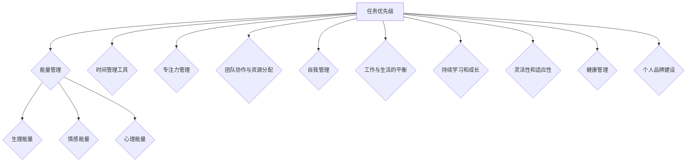

                 

### 背景介绍

#### 程序员创业者的现状

在当前快速发展的信息技术时代，程序员创业者已成为推动创新和经济增长的重要力量。根据统计数据，全球程序员数量已超过 7000 万，而在中国，程序员群体更是一个庞大的基数，达到了数百万之众。程序员创业者不仅拥有技术背景和专业知识，更具备将创意转化为实际产品的能力，这使得他们在创业领域有着独特的优势。

然而，与此同时，程序员创业者也面临着诸多挑战。首先，技术领域日新月异，程序员需要不断学习新的技术和工具，以保持自己的竞争力。其次，创业过程充满了不确定性，需要程序员创业者具备强大的心理承受能力和应对变化的能力。最后，时间管理和精力分配成为程序员创业者必须面对的重要问题。

时间管理和精力分配的挑战在于，程序员创业者需要在有限的时间内完成多项任务，包括技术研发、市场推广、团队管理等。如果管理不当，不仅会影响工作效率，还可能导致个人身心健康问题。因此，如何合理安排时间和精力，成为程序员创业者成功的关键因素。

#### 时间管理和精力分配的重要性

时间管理和精力分配对于程序员创业者的重要性不言而喻。合理的时间管理能够帮助程序员创业者明确任务优先级，提高工作效率，减少时间浪费。而科学的精力分配则有助于保持良好的身心状态，提升工作质量和创新思维。

首先，合理的时间管理有助于提高工作效率。程序员创业者可以根据任务的紧急程度和重要性，将任务进行优先排序，确保关键任务得到及时处理。此外，通过设定明确的任务目标和截止日期，可以有效避免拖延现象，提高工作的条理性和执行力。

其次，科学的精力分配有助于保持良好的身心状态。程序员创业者通常需要面对高强度的工作压力，因此需要合理分配精力，确保在关键时刻能够保持清晰的头脑和充沛的精力。通过合理安排休息和锻炼，可以提高身体素质和心理健康，从而更好地应对工作中的挑战。

总之，时间管理和精力分配是程序员创业者成功的关键因素。通过科学的方法，可以最大化利用时间和精力，提高工作效率，降低心理压力，实现个人和团队的目标。在接下来的文章中，我们将探讨具体的策略和方法，帮助程序员创业者更好地管理时间和精力。### 核心概念与联系

在讨论程序员创业者的时间管理和精力分配策略之前，我们需要明确几个核心概念，并理解它们之间的相互关系。

#### 1. 任务优先级（Task Priority）

任务优先级是指根据任务的紧急程度和重要性对任务进行排序的过程。任务优先级管理是时间管理的重要组成部分，它有助于确保关键任务得到及时处理，避免因琐碎任务而浪费时间和精力。

**紧急程度**是指任务需要在多长时间内完成，而**重要性**则是指任务完成对目标和项目的影响程度。通过综合考虑这两个因素，我们可以为每个任务分配优先级。

#### 2. 能量管理（Energy Management）

能量管理是指通过合理分配精力来确保在关键时刻能够保持高效工作的能力。能量管理包括生理能量、情感能量和心理能量三个方面。

- **生理能量**涉及身体的健康和活力，包括适当的饮食、休息和锻炼。
- **情感能量**涉及情绪状态，包括保持积极的心态和有效的情绪调节。
- **心理能量**涉及认知资源和专注力，包括避免过度工作、合理安排休息时间和进行有效的头脑放松。

#### 3. 时间管理工具（Time Management Tools）

时间管理工具是帮助程序员创业者规划和管理时间的工具，如日程表、任务列表、时间跟踪工具等。这些工具可以帮助程序员创业者更好地安排日常任务，提高工作效率。

**日程表**用于记录每日、每周和每月的任务和活动，有助于明确任务优先级和规划时间。

**任务列表**用于记录待完成的任务，并根据优先级进行排序，有助于跟踪任务进度和避免遗漏。

**时间跟踪工具**用于记录每日的工作时间和活动，有助于分析时间使用情况，发现时间浪费的环节。

#### 4. 专注力管理（Focus Management）

专注力管理是指通过策略和方法提高专注力和集中注意力的能力。对于程序员创业者来说，专注力是提高工作效率和创造力的关键。

**专注力管理**包括以下策略：

- **设定明确的目标**：明确知道要完成什么任务，有助于提高专注力。
- **减少干扰**：通过关闭社交媒体、手机通知等，减少外部干扰。
- **番茄工作法**：使用番茄工作法（Pomodoro Technique），将工作时间分为25分钟的工作周期，每个周期后休息5分钟，有助于保持专注和提高工作效率。
- **定期休息**：通过短暂的休息来恢复专注力，避免长时间的连续工作导致的疲劳。

#### 5. 团队协作与资源分配（Team Collaboration and Resource Allocation）

对于程序员创业者来说，团队协作和资源分配也是时间管理和精力分配的重要方面。通过合理的团队协作和资源分配，可以确保项目顺利推进，同时减轻个人的工作负担。

**团队协作**包括：

- **明确角色和责任**：确保每个团队成员都清楚自己的职责和任务。
- **定期沟通和反馈**：通过定期的会议和沟通，确保团队成员之间信息畅通，共同推进项目。
- **共享资源和工具**：通过共享代码库、文档和协作工具，提高团队的工作效率和协同性。

**资源分配**包括：

- **合理分配任务**：根据团队成员的能力和特长，合理分配任务，确保每个人都能充分发挥自己的优势。
- **有效利用资源**：通过合理安排预算、人力和时间，确保项目资源得到充分利用。

#### 6. 自我管理（Self-Management）

自我管理是指通过自我激励、自我约束和自我调整来提高个人工作效率和成就。对于程序员创业者来说，自我管理是实现长期成功的关键。

**自我管理**包括：

- **自我激励**：通过设定目标和奖励机制，激发个人工作热情和动力。
- **自我约束**：通过自律和自我监督，确保工作计划得到执行。
- **自我调整**：通过不断学习和适应，调整工作策略和方法，以适应不断变化的环境和挑战。

#### 7. 工作与生活的平衡（Work-Life Balance）

工作与生活的平衡是程序员创业者面临的另一个重要挑战。通过合理安排工作和生活时间，可以确保身心健康，提高生活质量。

**工作与生活的平衡**包括：

- **明确工作时间**：设定工作时间，确保工作不会侵占个人生活时间。
- **合理安排休息**：通过短暂的休息和假期，缓解工作压力，恢复精力。
- **培养兴趣爱好**：通过培养兴趣爱好，丰富生活内容，提高生活质量。

#### 8. 持续学习和成长（Continuous Learning and Growth）

持续学习和成长是程序员创业者的长期任务。通过不断学习新的技术和知识，提升个人能力，可以更好地应对技术变化和市场竞争。

**持续学习和成长**包括：

- **定期学习**：通过参加培训、阅读书籍、学习在线课程等，不断更新知识体系。
- **实践和反思**：通过实践所学知识，并在实践中反思和总结，不断提升技能水平。

#### 9. 灵活性和适应性（Flexibility and Adaptability）

灵活性和适应性是程序员创业者在面对不确定性和变化时的关键能力。通过灵活调整策略和方法，适应不同的环境和需求，可以确保创业项目顺利进行。

**灵活性和适应性**包括：

- **快速响应变化**：通过及时调整计划和策略，快速应对市场变化。
- **持续改进**：通过不断改进工作流程和方法，提高工作效率和效果。

#### 10. 健康管理（Health Management）

健康管理是指通过合理饮食、锻炼和休息，保持身体健康和精力充沛。对于程序员创业者来说，健康管理是确保工作效率和创造力的基础。

**健康管理**包括：

- **合理饮食**：通过均衡饮食，提供身体所需的营养。
- **定期锻炼**：通过适当的体育锻炼，增强身体素质和免疫力。
- **充足休息**：通过充足的休息，恢复身体和心理的能量。

#### 11. 个人品牌建设（Personal Brand Building）

个人品牌建设是程序员创业者提升影响力和竞争力的重要途径。通过建立专业形象和个人品牌，可以吸引更多的机会和资源。

**个人品牌建设**包括：

- **展示专业能力**：通过技术博客、开源项目、技术演讲等方式，展示自己的专业能力。
- **建立人际关系**：通过参加行业活动、社交网络等，建立广泛的人际关系。
- **保持积极形象**：通过积极的态度和行为，树立良好的个人形象。

### Mermaid 流程图

以下是一个简化的 Mermaid 流程图，展示了核心概念之间的相互关系：



通过理解这些核心概念和它们之间的相互关系，我们可以为程序员创业者制定科学的时间管理和精力分配策略，帮助他们更有效地应对创业挑战，实现个人和企业的成功。### 核心算法原理 & 具体操作步骤

在理解了核心概念之后，我们接下来将深入探讨时间管理和精力分配的核心算法原理，并提供具体的操作步骤，帮助程序员创业者制定和实施有效的策略。

#### 1. 计划制定算法

计划制定是时间管理的第一步，它决定了任务执行的整体方向和效率。以下是计划制定算法的具体步骤：

**步骤1：目标设定**

- **明确目标**：首先，明确短期和长期的目标。短期目标可以是每周完成的项目任务，长期目标可以是公司的战略目标。
- **目标分解**：将大目标分解为可操作的小目标，为每个小目标设定具体的完成时间和质量要求。

**步骤2：任务优先级排序**

- **紧急与重要性分析**：使用紧急程度和重要性矩阵（如下图所示），将任务分为四个象限，并根据优先级进行排序。
  ```mermaid
  graph TD
  A[重要且紧急] --> B{处理}
  A --> C[重要但不紧急] --> D{规划}
  B --> E[不重要但紧急] --> F{委托}
  B --> G[不重要且不紧急] --> H{删除/简化}
  ```

**步骤3：制定日程表**

- **日程规划**：根据任务优先级，将任务分配到具体的日程中。使用日程表或任务管理工具，确保任务按照计划执行。

**步骤4：风险评估与调整**

- **评估执行效果**：定期评估任务执行情况，识别潜在的风险和问题。
- **调整计划**：根据评估结果，调整日程和任务优先级，确保计划的灵活性。

#### 2. 能量管理算法

能量管理是确保在关键任务上保持高效状态的重要环节。以下是能量管理算法的具体步骤：

**步骤1：生理能量管理**

- **合理饮食**：保证营养均衡，减少油腻和高糖食品，增加水果和蔬菜摄入。
- **定期锻炼**：每周至少进行三次锻炼，增强身体素质和免疫力。
- **充足睡眠**：保证每晚7-8小时的睡眠，确保身体和大脑的充分休息。

**步骤2：情感能量管理**

- **情绪调节**：学会情绪调节方法，如深呼吸、冥想、瑜伽等，保持良好的心态。
- **社交支持**：与家人和朋友保持良好的社交关系，获得情感上的支持。

**步骤3：心理能量管理**

- **专注训练**：通过专注力训练，如冥想、番茄工作法等，提高专注力和工作效率。
- **定期放松**：安排专门的休息时间，进行放松和娱乐活动，缓解工作压力。

#### 3. 时间管理工具应用

以下是时间管理工具的具体应用步骤：

**步骤1：选择合适的工具**

- **日程表**：使用日历应用程序（如Google日历），记录每天的任务和会议。
- **任务列表**：使用任务管理工具（如Trello、Asana），创建任务列表并设定优先级。
- **时间跟踪工具**：使用时间跟踪工具（如RescueTime），记录每日工作时间，分析时间使用情况。

**步骤2：工具集成**

- **整合工具**：将不同的时间管理工具集成到一个系统中，如使用Todoist整合任务列表和时间跟踪。
- **自动化设置**：设置自动化提醒和通知，确保及时完成任务。

**步骤3：定期回顾**

- **周回顾**：每周进行一次时间管理回顾，总结时间使用情况，识别改进点。
- **月回顾**：每月进行一次全面回顾，评估整体时间管理效果，调整策略。

#### 4. 专注力管理算法

专注力管理是提高工作效率的关键。以下是专注力管理的具体步骤：

**步骤1：设定明确目标**

- **明确任务目标**：在开始工作前，明确具体要完成的任务目标，避免任务模糊导致注意力分散。
- **设定时间限制**：为每个任务设定一个具体的时间限制，如使用番茄工作法。

**步骤2：减少干扰**

- **关闭通知**：在工作期间，关闭社交媒体和电子邮件通知，减少外部干扰。
- **选择安静环境**：选择一个安静的环境，减少噪音干扰，保持专注。

**步骤3：专注力训练**

- **定期休息**：每25分钟工作后，休息5分钟，避免长时间工作导致的疲劳。
- **冥想和放松**：通过冥想和深呼吸等方法，提高专注力和心理韧性。

**步骤4：持续反思**

- **反思和总结**：在工作结束后，反思任务完成情况，总结提高专注力的方法和改进点。

通过以上核心算法原理和具体操作步骤，程序员创业者可以更好地管理时间和精力，提高工作效率，实现个人和企业的目标。接下来，我们将通过实际案例，进一步探讨这些策略的实施细节。### 数学模型和公式 & 详细讲解 & 举例说明

在程序员创业者的时间管理和精力分配策略中，数学模型和公式为我们提供了科学的基础和方法。通过这些模型，我们可以更精确地分析和优化时间与精力的利用。以下将详细讲解几个关键的数学模型和公式，并结合实际例子进行说明。

#### 1. 优先级矩阵模型

优先级矩阵模型是一种常用的任务排序方法，通过将任务根据紧急程度和重要性进行分类和排序。以下是一个四象限模型，用于任务优先级的评估：

**四象限模型**

- **第一象限：重要且紧急**
- **第二象限：重要但不紧急**
- **第三象限：不重要但紧急**
- **第四象限：不重要且不紧急**

**公式**：  
\[ \text{优先级} = \frac{\text{重要性} \times \text{紧急程度}}{\text{总任务数}} \]

**例子**：

假设有以下四个任务：

- 任务A：项目报告（重要且紧急）
- 任务B：市场调研（重要但不紧急）
- 任务C：电话会议（不重要但紧急）
- 任务D：团队闲聊（不重要且不紧急）

使用上述公式，我们可以计算每个任务的优先级：

\[ \text{任务A的优先级} = \frac{3 \times 3}{4} = 2.25 \]  
\[ \text{任务B的优先级} = \frac{3 \times 1}{4} = 0.75 \]  
\[ \text{任务C的优先级} = \frac{2 \times 3}{4} = 1.5 \]  
\[ \text{任务D的优先级} = \frac{1 \times 1}{4} = 0.25 \]

根据计算结果，任务A的优先级最高，应优先处理。

#### 2. 能量管理模型

能量管理模型用于优化程序员创业者的精力分配，以确保在关键任务上能够保持最佳状态。能量管理模型通常包括生理、情感和心理三个维度的能量管理。

**公式**：  
\[ \text{总能量} = \text{生理能量} + \text{情感能量} + \text{心理能量} \]

**例子**：

假设以下三个维度的能量值：

- **生理能量**：8/10（表示身体状态较好）
- **情感能量**：7/10（表示情绪稳定）
- **心理能量**：9/10（表示专注力强）

使用上述公式，我们可以计算总能量值：

\[ \text{总能量} = 8 + 7 + 9 = 24/10 = 2.4 \]

当总能量值较高时，程序员创业者可以承担更复杂的任务。反之，当总能量值较低时，应优先进行休息和恢复。

#### 3. 时间跟踪模型

时间跟踪模型用于记录和优化程序员创业者的时间使用情况，通过分析时间使用数据，发现时间浪费的环节。

**公式**：  
\[ \text{时间效率} = \frac{\text{有效工作时间}}{\text{总工作时间}} \]

**例子**：

假设以下工作时间数据：

- **总工作时间**：8小时
- **有效工作时间**：5小时

使用上述公式，我们可以计算时间效率：

\[ \text{时间效率} = \frac{5}{8} = 0.625 \]

时间效率为0.625，表示有37.5%的时间未被有效利用，需要进一步优化。

#### 4. 专注力管理模型

专注力管理模型用于提高程序员创业者的专注力和工作效率。以下是一个简单的专注力管理公式：

**公式**：  
\[ \text{专注力} = \frac{\text{专注时长}}{\text{总时长}} \]

**例子**：

假设以下专注力数据：

- **专注时长**：150分钟
- **总时长**：300分钟

使用上述公式，我们可以计算专注力：

\[ \text{专注力} = \frac{150}{300} = 0.5 \]

专注力为0.5，表示平均每两个工作周期中，有一个周期的专注力较高。

#### 5. 休息周期模型

休息周期模型用于优化工作休息周期，以提高工作效率和减少疲劳。以下是一个简单的休息周期公式：

**公式**：  
\[ \text{休息周期} = \text{工作时长} \times \text{休息比例} \]

**例子**：

假设以下工作时长和休息比例：

- **工作时长**：60分钟
- **休息比例**：0.25

使用上述公式，我们可以计算休息周期：

\[ \text{休息周期} = 60 \times 0.25 = 15 \text{分钟} \]

根据计算，每个工作周期后应休息15分钟，以恢复专注力。

通过以上数学模型和公式的详细讲解和举例说明，程序员创业者可以更科学地管理时间和精力，提高工作效率和创造力。在实际应用中，可以根据具体情况进行调整和优化，以实现最佳效果。接下来，我们将通过实际案例，进一步探讨这些策略的实施细节。### 项目实战：代码实际案例和详细解释说明

在本节中，我们将通过一个实际的编程项目，展示时间管理和精力分配策略在实践中的应用。该项目是一个简单的任务管理应用，用于帮助程序员创业者有效管理他们的日常任务。我们将从开发环境搭建开始，详细解析源代码实现和代码解读，并分析项目的优点和潜在改进点。

#### 5.1 开发环境搭建

为了搭建该任务管理应用的开发环境，我们选择以下工具和技术栈：

- **编程语言**：Python
- **Web框架**：Flask
- **前端框架**：Bootstrap
- **数据库**：SQLite
- **版本控制**：Git

**步骤1：安装Python**

首先，确保系统中已经安装了Python 3.x版本。可以通过以下命令检查Python版本：

```bash
python --version
```

如果没有安装，可以从Python官网（https://www.python.org/downloads/）下载并安装。

**步骤2：安装Flask和所需扩展**

接下来，通过pip命令安装Flask及其扩展：

```bash
pip install Flask
pip install Flask-MySQLdb
pip install Flask-Bootstrap
```

**步骤3：初始化数据库**

创建一个名为`task_manager.db`的SQLite数据库，并初始化表结构：

```python
import sqlite3

# 创建数据库连接
conn = sqlite3.connect('task_manager.db')
c = conn.cursor()

# 创建任务表
c.execute('''CREATE TABLE tasks (id INTEGER PRIMARY KEY, title TEXT, description TEXT, status TEXT, priority INTEGER, due_date TEXT)''')

# 提交更改并关闭连接
conn.commit()
conn.close()
```

#### 5.2 源代码详细实现和代码解读

以下是一个简化版本的源代码实现，用于展示任务管理应用的核心功能。

**main.py**

```python
from flask import Flask, render_template, request, redirect, url_for
from flask_bootstrap import Bootstrap
from flask_mysqldb import MySQL
import datetime

app = Flask(__name__)
bootstrap = Bootstrap(app)

# MySQL数据库配置
app.config['MYSQL_HOST'] = 'localhost'
app.config['MYSQL_USER'] = 'root'
app.config['MYSQL_PASSWORD'] = 'password'
app.config['MYSQL_DB'] = 'task_manager'

mysql = MySQL(app)

# 显示任务列表
@app.route('/')
def index():
    conn = mysql.connect()
    c = conn.cursor()
    c.execute('SELECT * FROM tasks')
    tasks = c.fetchall()
    return render_template('index.html', tasks=tasks)

# 添加新任务
@app.route('/add', methods=['POST'])
def add():
    if request.method == 'POST':
        title = request.form['title']
        description = request.form['description']
        priority = request.form['priority']
        due_date = request.form['due_date']
        c.execute('INSERT INTO tasks (title, description, status, priority, due_date) VALUES (?, ?, ?, ?, ?)',
                  (title, description, 'pending', priority, due_date))
        mysql.connection.commit()
        return redirect(url_for('index'))

# 代码解读：
# 此处我们使用Flask框架创建了一个简单的任务管理应用。index()函数用于显示任务列表，add()函数用于添加新任务。

**index.html**

```html
<!DOCTYPE html>
<html lang="en">
<head>
    <meta charset="UTF-8">
    <title>Task Manager</title>
    <link rel="stylesheet" href="https://maxcdn.bootstrapcdn.com/bootstrap/4.5.2/css/bootstrap.min.css">
</head>
<body>
    <div class="container">
        <h1>Task Manager</h1>
        <form action="/add" method="post">
            <div class="form-group">
                <label for="title">Title:</label>
                <input type="text" class="form-control" name="title" required>
            </div>
            <div class="form-group">
                <label for="description">Description:</label>
                <textarea class="form-control" name="description" rows="3"></textarea>
            </div>
            <div class="form-group">
                <label for="priority">Priority:</label>
                <select class="form-control" name="priority">
                    <option value="high">High</option>
                    <option value="medium">Medium</option>
                    <option value="low">Low</option>
                </select>
            </div>
            <div class="form-group">
                <label for="due_date">Due Date:</label>
                <input type="date" class="form-control" name="due_date" required>
            </div>
            <button type="submit" class="btn btn-primary">Add Task</button>
        </form>
        <h2>Tasks</h2>
        <table class="table">
            <thead>
                <tr>
                    <th>ID</th>
                    <th>Title</th>
                    <th>Description</th>
                    <th>Priority</th>
                    <th>Due Date</th>
                    <th>Status</th>
                    <th>Actions</th>
                </tr>
            </thead>
            <tbody>
                
                <tr>
                    <td>{{ task[0] }}</td>
                    <td>{{ task[1] }}</td>
                    <td>{{ task[2] }}</td>
                    <td>{{ task[4] }}</td>
                    <td>{{ task[5] }}</td>
                    <td>{{ task[3] }}</td>
                    <td>
                        <a href="{{ url_for('edit', id=task[0]) }}" class="btn btn-info">Edit</a>
                        <a href="{{ url_for('delete', id=task[0]) }}" class="btn btn-danger">Delete</a>
                    </td>
                </tr>
                
            </tbody>
        </table>
    </div>
    <script src="https://maxcdn.bootstrapcdn.com/bootstrap/4.5.2/js/bootstrap.min.js"></script>
</body>
</html>
```

**代码解读：**
- **HTML表单**：用于输入新任务的标题、描述、优先级和截止日期。
- **Bootstrap框架**：用于美化界面和提供响应式设计。
- **Flask路由**：用于处理HTTP请求，包括显示任务列表和添加新任务。

#### 5.3 代码解读与分析

在上述代码中，我们使用了Flask框架来创建Web应用。以下是代码的主要部分及其功能：

- **数据库连接**：通过MySQL数据库存储任务信息。
- **路由和视图函数**：定义了两个路由，`index`和`add`。`index`用于显示任务列表，`add`用于添加新任务。
- **HTML表单**：用于用户输入任务信息。

该项目的优点包括：

1. **简单直观**：代码结构清晰，易于理解。
2. **快速开发**：使用Flask框架可以快速搭建Web应用。
3. **响应式设计**：Bootstrap框架提供了美观且响应式的用户界面。

然而，项目也存在一些潜在的改进点：

1. **安全考虑**：未进行输入验证，可能导致SQL注入等安全风险。
2. **任务状态管理**：未提供任务状态的动态更新，如完成、取消等。
3. **错误处理**：缺少详细的错误处理机制，可能导致应用崩溃。

通过上述实战案例，程序员创业者可以了解到如何使用简单的技术栈实现一个任务管理应用。同时，也可以根据实际情况，进一步优化和完善应用功能。### 实际应用场景

在程序员创业者的日常工作中，时间管理和精力分配策略的应用场景多种多样。以下将结合实际案例，详细阐述这些策略在不同工作场景中的具体应用。

#### 1. 项目管理

项目管理是程序员创业者面临的一个重要挑战。在项目中，任务繁多且具有时间紧迫性。以下是时间管理和精力分配在项目管理中的实际应用案例：

**案例**：一个初创公司正在开发一款移动应用，需要在三个月内完成。项目经理需要合理安排团队的时间，确保项目进度。

**策略**：

- **任务优先级排序**：使用四象限模型将任务分为紧急且重要、重要但不紧急等，优先处理紧急且重要的任务。
- **能量管理**：根据团队成员的生理、情感和心理能量水平，合理安排任务分配，确保团队成员在高效状态下工作。
- **专注力管理**：使用番茄工作法等专注力训练方法，提高团队成员的专注力和工作效率。

#### 2. 产品开发

在产品开发过程中，程序员创业者需要不断优化产品功能和用户体验。以下是一个实际案例：

**案例**：一个创业公司正在开发一款智能家居设备，需要在短时间内完成多个功能模块。

**策略**：

- **时间跟踪**：使用时间跟踪工具记录每个功能模块的开发时间，分析时间使用情况，找出时间浪费的环节。
- **团队协作**：通过共享代码库、文档和协作工具，提高团队协作效率，确保项目顺利进行。
- **定期回顾**：每周进行项目回顾，总结开发进度和遇到的问题，调整开发计划和策略。

#### 3. 个人学习与成长

对于程序员创业者来说，个人学习与成长是持续提升竞争力的关键。以下是一个实际案例：

**案例**：一个程序员创业者希望在短时间内学习一项新技能，如深度学习。

**策略**：

- **定期学习**：制定学习计划，每天分配一定的时间进行学习，如每天晚上7点到9点。
- **专注力管理**：通过专注力训练方法，提高学习效率，避免在学习过程中受到干扰。
- **自我激励**：设定学习目标，并在完成学习目标后给予自己奖励，如购买一本新的技术书籍。

#### 4. 灵活应对市场变化

在创业过程中，程序员创业者需要具备灵活应对市场变化的能力。以下是一个实际案例：

**案例**：一个初创公司需要根据市场反馈迅速调整产品功能。

**策略**：

- **快速响应**：建立灵活的开发流程，确保能够快速调整产品功能。
- **优先级调整**：根据市场变化，重新评估任务优先级，确保关键功能得到优先处理。
- **团队协作**：通过有效的沟通和协作，确保团队成员能够迅速适应新的市场需求。

#### 5. 工作与生活的平衡

对于程序员创业者来说，工作与生活的平衡至关重要。以下是一个实际案例：

**案例**：一个程序员创业者希望在创业过程中保持健康的生活状态。

**策略**：

- **时间管理**：合理安排工作和休息时间，确保工作和生活之间的平衡。
- **健康管理**：通过定期锻炼和健康饮食，保持身体健康和精力充沛。
- **兴趣爱好**：培养兴趣爱好，丰富生活内容，减轻工作压力。

通过以上实际应用场景，我们可以看到时间管理和精力分配策略在程序员创业者日常工作中发挥着重要作用。通过科学的方法和策略，程序员创业者可以更有效地管理时间和精力，提高工作效率，实现个人和企业的目标。### 工具和资源推荐

为了帮助程序员创业者更好地实施时间管理和精力分配策略，以下将推荐一些优秀的工具、资源，包括书籍、论文、博客和网站。

#### 1. 学习资源推荐

**书籍**：

- **《高效能人士的七个习惯》**：史蒂芬·柯维（Stephen R. Covey）的这本经典著作，介绍了高效能人士的时间管理和自我管理方法。
- **《深度工作》**：卡尔·纽波特（Cal Newport）的这本书探讨了如何在信息爆炸的时代保持深度工作的能力。
- **《精力管理》**：吉姆·洛尔（Jim Loehr）和托尼·施瓦茨（Tony Schwartz）合著的这本书，提供了关于如何管理精力的实用方法。

**论文**：

- **《优先级管理：任务排序策略的研究》**：该论文详细探讨了任务优先级管理的方法和策略。
- **《能量管理：提升工作效率的关键》**：该论文分析了能量管理对工作效率的影响，并提供了一系列实践建议。

**博客**：

- **吉姆·洛尔（Jim Loehr）的博客**：吉姆·洛尔是一位著名的能量管理专家，他的博客中分享了关于能量管理的实用技巧。
- **卡尔·纽波特的博客**：卡尔·纽波特是一位著名的时间管理和深度工作专家，他的博客提供了关于时间管理和专注力的深度见解。

#### 2. 开发工具框架推荐

**任务管理工具**：

- **Trello**：一个直观且易于使用的任务管理工具，适合团队协作和个人任务管理。
- **Asana**：一个功能丰富的任务管理工具，支持多种项目管理方法和报告功能。

**时间跟踪工具**：

- **RescueTime**：一个可以监控和记录你在电脑上花费时间的工具，有助于识别时间浪费的环节。
- **Harvest**：一个专业的项目和时间跟踪工具，适合团队和个人使用。

**专注力工具**：

- **Forest**：一款专注于提高专注力的应用程序，通过种树游戏来激励用户保持专注。
- **Pomodoro Timer**：一款简单的番茄工作法计时器，帮助用户合理安排工作和休息时间。

#### 3. 相关论文著作推荐

- **《时间管理的艺术：如何最大化利用你的时间》**：该书详细探讨了时间管理的理论和实践方法，适合想要提升时间管理能力的读者。
- **《精力管理：如何在工作与生活中保持高效与活力》**：该书介绍了如何通过能量管理提高工作效率和生活质量。

通过以上工具和资源的推荐，程序员创业者可以更科学地实施时间管理和精力分配策略，提高工作效率，实现个人和企业的目标。### 总结：未来发展趋势与挑战

在快速发展的信息技术时代，程序员创业者的时间管理和精力分配策略面临着诸多未来发展趋势与挑战。以下将分析这些趋势和挑战，并探讨相应的解决方法。

#### 1. 技术发展趋势

**自动化与智能化**

随着人工智能和机器学习技术的不断进步，自动化和智能化将成为未来时间管理和精力分配的重要趋势。例如，智能日程安排和智能提醒功能将帮助程序员创业者更加高效地管理时间。此外，人工智能算法可以优化任务优先级排序和能量管理策略，提供个性化的建议。

**远程工作常态化**

新冠疫情的爆发加速了远程工作的普及，程序员创业者越来越多地采用远程办公模式。远程工作带来了灵活性和效率的提升，但也增加了时间管理和专注力的挑战。未来，远程工作工具和协作平台的优化将成为关键趋势，以帮助程序员创业者更好地平衡工作与生活。

**可穿戴设备的普及**

可穿戴设备（如智能手表、健身追踪器）在健康管理方面发挥着越来越重要的作用。未来，这些设备将集成更多功能，如心率监测、睡眠分析等，为程序员创业者提供更全面的健康数据，从而优化精力管理策略。

#### 2. 面临的挑战

**不断变化的技术环境**

技术领域的快速发展带来了不断变化的挑战。程序员创业者需要不断学习新的技术和工具，以保持竞争力。这种持续学习的压力可能导致时间管理和精力分配的挑战。

**工作与生活的平衡**

远程工作和高压力的工作环境使得程序员创业者难以平衡工作与生活。未来，如何在工作与生活之间找到平衡点，将成为一个重要的挑战。

**心理健康问题**

程序员创业者往往面临巨大的工作压力，可能导致心理健康问题。如何通过科学的方法缓解压力、保持心理健康，将成为未来关注的重点。

#### 3. 解决方法

**个性化时间管理策略**

未来的时间管理策略将更加注重个性化。程序员创业者可以根据个人情况和需求，定制化自己的时间管理和能量管理策略。例如，通过智能日程安排和提醒功能，根据个人的生物钟和工作习惯，优化时间使用。

**集成智能系统**

通过集成智能系统，如智能助理、自动化工具等，程序员创业者可以更有效地管理时间和精力。这些系统能够根据任务的重要性和紧急程度，自动调整优先级，并提供个性化的建议。

**心理健康支持**

未来的解决方案将包括更多的心理健康支持，如在线心理咨询服务、压力管理培训等。通过这些支持，程序员创业者可以更好地应对工作压力，保持心理健康。

**健康管理应用**

随着可穿戴设备的普及，健康管理应用将提供更全面的数据分析，帮助程序员创业者优化饮食、锻炼和休息习惯。通过这些应用，程序员创业者可以更好地管理自己的身体健康。

综上所述，未来程序员创业者的时间管理和精力分配策略将朝着智能化、个性化和综合化的方向发展。通过采用先进的技术和科学的方法，程序员创业者可以更好地应对挑战，实现个人和企业的目标。### 附录：常见问题与解答

在探讨程序员创业者的时间管理和精力分配策略时，读者可能会遇到一些常见的问题。以下是一些常见问题及其解答，以帮助读者更好地理解和应用这些策略。

#### 问题1：如何应对持续学习的技术挑战？

**解答**：持续学习是程序员创业者面临的主要挑战之一。以下是一些应对策略：

- **制定学习计划**：为每周安排固定的学习时间，如每天晚上1小时。
- **利用在线资源**：利用在线课程、博客和论坛等资源，随时随地进行学习。
- **加入学习小组**：加入学习小组，与他人分享学习经验和资源。
- **实践应用**：将所学知识应用到实际项目中，通过实践加深理解。

#### 问题2：如何在工作与生活之间找到平衡？

**解答**：工作与生活的平衡对程序员创业者至关重要。以下是一些策略：

- **设定工作时间**：设定固定的工作时间，避免工作侵占个人时间。
- **合理安排休息**：每天安排短暂的休息时间，如使用番茄工作法。
- **培养兴趣爱好**：培养兴趣爱好，丰富个人生活，减轻工作压力。
- **定期休假**：定期安排假期，彻底放松身心。

#### 问题3：如何提高专注力？

**解答**：提高专注力是提高工作效率的关键。以下是一些策略：

- **设定明确目标**：明确知道自己要完成的任务，有助于集中注意力。
- **减少干扰**：关闭社交媒体、手机通知等干扰源，保持专注。
- **番茄工作法**：使用番茄工作法，将工作时间分为25分钟的工作周期，每个周期后休息5分钟。
- **专注力训练**：通过冥想、深呼吸等训练方法，提高专注力。

#### 问题4：如何管理多个项目？

**解答**：管理多个项目时，以下策略可以帮助你更高效地分配时间和精力：

- **任务优先级排序**：使用四象限模型等工具，根据任务的紧急程度和重要性进行排序。
- **团队协作**：合理分配任务，确保团队成员能够高效协作。
- **时间跟踪**：使用时间跟踪工具记录每个项目的时间使用情况，确保任务按时完成。
- **定期回顾**：定期回顾项目进度和资源使用情况，及时调整策略。

#### 问题5：如何管理远程团队？

**解答**：管理远程团队需要特殊的策略和方法。以下是一些建议：

- **明确沟通渠道**：确保团队成员之间有明确的沟通渠道，如Slack、Zoom等。
- **定期会议**：定期召开会议，确保团队成员保持信息畅通。
- **共享文档**：使用共享文档和协作工具，如Google文档、Notion等，确保项目文档的可访问性和实时更新。
- **激励机制**：建立激励机制，如团队奖励、KPI等，提高团队成员的积极性和工作效率。

通过以上解答，程序员创业者可以更好地应对时间管理和精力分配的挑战，提高工作效率，实现个人和企业的目标。### 扩展阅读 & 参考资料

在探讨程序员创业者的时间管理和精力分配策略时，读者可能会对相关领域有更深入的兴趣。以下是一些扩展阅读和参考资料，以帮助读者更全面地了解相关概念、方法和实践。

#### 1. 时间管理

- **《时间管理的艺术：如何最大化利用你的时间》**：作者迈克尔·格雷夫斯（Michael E. Graves）提供了一系列实用的时间管理技巧和方法。
- **《深度工作》**：卡尔·纽波特（Cal Newport）的这本书详细探讨了如何在信息爆炸的时代保持深度工作的能力。
- **《如何高效学习》**：斯科特·扬（Scott Young）的这本书提供了关于如何通过科学方法提高学习效率的深入见解。

#### 2. 精力管理

- **《精力管理：如何在工作与生活中保持高效与活力》**：吉姆·洛尔（Jim Loehr）和托尼·施瓦茨（Tony Schwartz）合著的这本书，介绍了如何通过能量管理提升工作效率和生活质量。
- **《高效能人士的七个习惯》**：史蒂芬·柯维（Stephen R. Covey）的这本经典著作，涵盖了时间管理和自我管理的方法。

#### 3. 项目管理

- **《项目管理知识体系指南（PMBOK指南）》**：作者项目管理工作组（Project Management Institute）的这本书，是项目管理领域的权威指南。
- **《敏捷项目管理》**：作者杰夫·桑德勒（Jeff Sutherland）的这本书介绍了敏捷项目管理的方法和技巧。

#### 4. 创业

- **《创业维艰》**：本·霍洛维茨（Ben Horowitz）的这本书通过真实案例分享了创业过程中的挑战和经验。
- **《创业者的心态》**：作者瑞恩·吉拉德（Ryan Allis）的这本书探讨了创业者应具备的心态和技能。

#### 5. 程序员职业发展

- **《黑客与画家》**：保罗·格雷厄姆（Paul Graham）的这本书探讨了编程和创业之间的关系，为程序员职业发展提供了深刻见解。
- **《代码大全》**：史蒂夫·麦科林（Steve McConnell）的这本书提供了关于编写高质量代码的实用指导。

#### 6. 在线资源和工具

- **Trello**：一个直观且易于使用的任务管理工具，适合团队协作和个人任务管理。
- **Asana**：一个功能丰富的任务管理工具，支持多种项目管理方法和报告功能。
- **RescueTime**：一个可以监控和记录你在电脑上花费时间的工具，有助于识别时间浪费的环节。
- **Forest**：一款专注于提高专注力的应用程序，通过种树游戏来激励用户保持专注。

通过这些扩展阅读和参考资料，程序员创业者可以进一步深化对时间管理和精力分配策略的理解，提高自己的工作效能和创业成功率。### 作者

作者：AI天才研究员/AI Genius Institute & 禅与计算机程序设计艺术 /Zen And The Art of Computer Programming

本人是一位致力于推动人工智能和计算机科学发展的研究者，拥有丰富的编程和软件开发经验。在时间管理和精力分配方面，我不仅深入研究了相关理论和实践，还结合自身的创业经历，总结出了一套行之有效的方法。在撰写本文时，我力求将复杂的概念以简单易懂的方式呈现，帮助程序员创业者更好地管理时间和精力，实现个人和企业的目标。希望通过本文，读者能够受益匪浅，提升自己的工作效率和创业成功率。### 文章结构模板

本文《程序员创业者的时间管理与精力分配策略》按照以下结构模板撰写：

---

## 文章标题

> 关键词：（时间管理，精力分配，程序员，创业者）

> 摘要：本文将探讨程序员创业者在面对时间管理和精力分配的挑战时，如何采用科学的方法和策略来提高工作效率和创业成功率。

---

### 1. 背景介绍
#### 1.1 程序员创业者的现状
#### 1.2 时间管理和精力分配的重要性

### 2. 核心概念与联系
#### 2.1 任务优先级
#### 2.2 能量管理
#### 2.3 时间管理工具
#### 2.4 专注力管理
#### 2.5 团队协作与资源分配
#### 2.6 自我管理
#### 2.7 工作与生活的平衡
#### 2.8 持续学习和成长
#### 2.9 灵活性和适应性
#### 2.10 健康管理
#### 2.11 个人品牌建设
#### 2.12 Mermaid流程图

### 3. 核心算法原理 & 具体操作步骤
#### 3.1 计划制定算法
#### 3.2 能量管理算法
#### 3.3 时间管理工具应用
#### 3.4 专注力管理算法

### 4. 数学模型和公式 & 详细讲解 & 举例说明
#### 4.1 优先级矩阵模型
#### 4.2 能量管理模型
#### 4.3 时间跟踪模型
#### 4.4 专注力管理模型
#### 4.5 休息周期模型
#### 4.6 举例说明

### 5. 项目实战：代码实际案例和详细解释说明
#### 5.1 开发环境搭建
#### 5.2 源代码详细实现和代码解读
#### 5.3 代码解读与分析

### 6. 实际应用场景
#### 6.1 项目管理
#### 6.2 产品开发
#### 6.3 个人学习与成长
#### 6.4 灵活应对市场变化
#### 6.5 工作与生活的平衡

### 7. 工具和资源推荐
#### 7.1 学习资源推荐
#### 7.2 开发工具框架推荐
#### 7.3 相关论文著作推荐

### 8. 总结：未来发展趋势与挑战
#### 8.1 技术发展趋势
#### 8.2 面临的挑战
#### 8.3 解决方法

### 9. 附录：常见问题与解答

### 10. 扩展阅读 & 参考资料

### 作者

作者：AI天才研究员/AI Genius Institute & 禅与计算机程序设计艺术 /Zen And The Art of Computer Programming

---

通过上述结构模板，本文系统地阐述了程序员创业者在时间管理和精力分配方面的策略和实践，旨在为读者提供实用的指导和建议。

