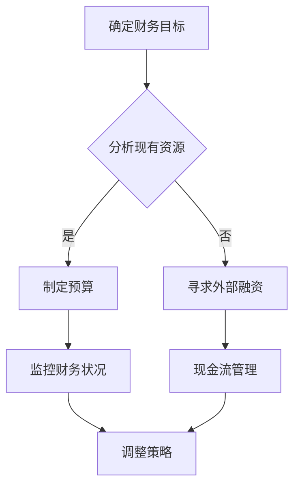

                 

# 《程序员创业者的财务规划与管理》

## 关键词：财务规划、创业者、管理、投资、风险管理、现金流

### 摘要

本文旨在为程序员创业者提供财务规划与管理的实用指南。我们将探讨财务规划的基础概念，包括财务目标和关键财务指标，然后深入分析创业过程中常见的财务挑战，提供一系列有效的管理策略。此外，本文还将讨论投资决策、风险管理以及现金流管理的重要性，并提供实用的工具和资源，帮助程序员创业者更好地规划和管理财务。

## 1. 背景介绍

程序员创业者，顾名思义，是那些拥有编程技能并决定投身创业领域的人。他们通常具有技术背景，能够开发软件产品或服务，并希望通过创业实现自己的商业梦想。然而，创业不仅仅是技术上的挑战，财务规划与管理同样至关重要。

在创业初期，财务规划与管理可以帮助创业者明确财务目标，评估资源，制定预算，以及应对潜在的风险。有效的财务规划与管理不仅有助于企业的稳定发展，还能提高投资者的信心，为未来的扩张和融资创造条件。

本文将分为以下几个部分：

- **核心概念与联系**：介绍财务规划的基础概念和关键指标。
- **核心算法原理与操作步骤**：解释财务规划的方法和工具。
- **项目实战**：通过实际案例展示财务规划与管理在创业中的应用。
- **实际应用场景**：分析财务规划在不同阶段的重要性。
- **工具和资源推荐**：提供有用的工具和资源，帮助创业者更好地进行财务规划。

### 2. 核心概念与联系

在讨论财务规划之前，我们需要了解一些基础概念和关键指标。

#### 财务目标

财务目标是企业希望实现的财务成果。这些目标可以是长期的，如实现一定的收入增长或利润率，也可以是短期的，如完成一轮融资或实现现金流平衡。

#### 关键财务指标

关键财务指标（KPI）是衡量企业财务健康状况的重要指标。常见的KPI包括：

- **收入**：企业在一定时期内通过销售产品或服务获得的收入。
- **成本**：企业在生产和运营过程中产生的费用。
- **利润**：收入减去成本后的余额。
- **现金流**：企业在一定时期内的现金流入和流出。
- **利润率**：利润与收入的比例，用于衡量企业的盈利能力。
- **负债率**：企业负债与资产的比例，用于衡量企业的财务风险。

#### 财务规划与管理的 Mermaid 流程图

以下是一个简单的 Mermaid 流程图，展示了财务规划与管理的主要步骤：



### 3. 核心算法原理与操作步骤

财务规划的核心算法原理包括以下几个步骤：

1. **确定财务目标**：根据企业的长期和短期目标，明确财务规划的方向。
2. **分析现有资源**：评估企业的资金、人员、技术等资源，确定资源限制。
3. **制定预算**：根据财务目标和资源分析，制定详细的预算计划，包括收入、成本、利润等。
4. **现金流管理**：监控企业的现金流动，确保现金流的稳定性和充足性。
5. **风险管理和调整策略**：根据实际财务状况，调整预算和策略，以应对潜在的风险。

下面，我们将详细讨论每个步骤。

#### 确定财务目标

确定财务目标的第一步是明确企业的愿景和使命。这有助于确定企业的长期和短期目标。长期目标可能包括扩大市场份额、提高品牌知名度等，而短期目标可能包括完成一轮融资、实现现金流平衡等。

#### 分析现有资源

分析现有资源是财务规划的重要步骤。这包括评估企业的资金、人员、技术等资源。创业者需要了解自己的财务状况，包括现有的资金、投资额、负债等。此外，还需要评估人员配置、技术能力等资源，以确保资源的合理利用。

#### 制定预算

制定预算是根据财务目标和资源分析的结果，制定详细的财务计划。预算应包括收入、成本、利润等关键指标。创业者需要制定详细的收入计划，包括预计销售额、价格策略等。同时，还需要制定成本计划，包括生产成本、运营成本等。

#### 现金流管理

现金流管理是确保企业现金流的稳定性和充足性的过程。创业者需要监控企业的现金流入和流出，确保现金流的平衡。此外，还需要制定应对现金流短缺的措施，如寻求外部融资、减少开支等。

#### 风险管理和调整策略

风险管理和调整策略是财务规划中不可或缺的步骤。创业者需要识别潜在的风险，如市场变化、技术故障等，并制定应对措施。此外，还需要根据实际财务状况，调整预算和策略，以应对潜在的风险。

### 4. 数学模型和公式 & 详细讲解 & 举例说明

在财务规划与管理中，数学模型和公式是不可或缺的工具。以下是一些常见的数学模型和公式，以及详细的讲解和举例说明。

#### 利润计算公式

利润 = 收入 - 成本

举例：假设一家创业公司的月收入为100,000元，成本为60,000元，那么该公司的月利润为40,000元。

#### 现金流计算公式

现金流 = 现金流入 - 现金流出

举例：假设一家创业公司月现金流入为80,000元，月现金流出为50,000元，那么该公司的月现金流为30,000元。

#### 利润率计算公式

利润率 = (利润 / 收入) × 100%

举例：假设一家创业公司的月收入为100,000元，月利润为40,000元，那么该公司的月利润率为40%。

### 5. 项目实战：代码实际案例和详细解释说明

在本节中，我们将通过一个实际案例，展示如何使用Python进行财务规划与管理。

#### 5.1 开发环境搭建

首先，我们需要安装Python和必要的库。可以使用以下命令安装Python和pandas库：

```bash
pip install python
pip install pandas
```

#### 5.2 源代码详细实现和代码解读

以下是一个简单的Python脚本，用于计算企业的利润、现金流和利润率。

```python
import pandas as pd

# 定义收入、成本和利润的列表
revenues = [100000, 90000, 110000, 95000]
costs = [60000, 58000, 62000, 59000]

# 计算利润和现金流
profits = [r - c for r, c in zip(revenues, costs)]
cash_flows = [r - c for r, c in zip(revenues, costs)]

# 计算利润率
profits_rates = [p / r * 100 for p, r in zip(profits, revenues)]

# 将结果存储在DataFrame中
df = pd.DataFrame({
    'Revenue': revenues,
    'Cost': costs,
    'Profit': profits,
    'Cash Flow': cash_flows,
    'Profit Rate': profits_rates
})

# 打印结果
print(df)
```

这个脚本使用了Python的pandas库来处理数据。首先，我们定义了收入和成本的列表，然后使用列表推导式计算利润和现金流。接下来，我们计算利润率，并将所有结果存储在一个DataFrame中。最后，我们打印出DataFrame，以便查看结果。

#### 5.3 代码解读与分析

在这个脚本中，我们使用了列表推导式来计算利润、现金流和利润率。这是一种简洁而有效的Python特性，可以快速实现复杂数学计算。

```python
profits = [r - c for r, c in zip(revenues, costs)]
```

这个列表推导式首先将收入和成本列表进行zip操作，然后对每个收入和成本进行相减，得到利润列表。

```python
profits_rates = [p / r * 100 for p, r in zip(profits, revenues)]
```

这个列表推导式计算了利润率。首先，我们将利润和收入进行zip操作，然后对每个利润和收入进行相除，并将结果乘以100，得到利润率列表。

### 6. 实际应用场景

财务规划与管理在创业的不同阶段都有其重要性。在初创阶段，创业者需要确保资金的充足性，以支持产品开发和市场推广。在成长阶段，创业者需要关注收入增长和利润率，以及现金流的管理。在扩张阶段，创业者需要制定详细的财务计划，以支持企业的快速扩张。

#### 初创阶段

在初创阶段，创业者通常面临资金不足的挑战。有效的财务规划可以帮助创业者合理分配资源，确保产品开发的顺利进行。此外，创业者还需要关注现金流的管理，以避免因资金短缺而导致的运营中断。

#### 成长阶段

在成长阶段，企业的收入和利润通常会有所增长，但现金流管理仍然是一个重要的挑战。创业者需要确保现金流的稳定性和充足性，以支持企业的持续发展。此外，创业者还需要关注利润率，以提高企业的盈利能力。

#### 扩张阶段

在扩张阶段，企业需要大量投资于新市场和新产品，这可能会对现金流造成压力。有效的财务规划可以帮助企业制定详细的资金使用计划，确保扩张过程中的资金需求得到满足。

### 7. 工具和资源推荐

#### 7.1 学习资源推荐

- **《创业者财务手册》（The Entrepreneur's Guide to Financial Management）**：由Mark P. McPherson所著，是一本针对创业者的实用财务指南。
- **《财务报表分析》（Financial Statement Analysis）**：由John A. Kyd和John J. selling所著，详细介绍了财务报表的分析方法。

#### 7.2 开发工具框架推荐

- **Xero**：一款在线会计软件，适合小型企业进行财务管理。
- **QuickBooks**：一款功能强大的会计软件，适合各种规模的企业。

#### 7.3 相关论文著作推荐

- **《创业公司的财务战略》（Financial Strategies for Startups）**：由Alok A. Patel所著，探讨了创业公司的财务战略。
- **《创业企业的财务管理》（Financial Management in Entrepreneurial Ventures）**：由Randy J. Combs所著，详细介绍了创业企业的财务管理方法。

### 8. 总结：未来发展趋势与挑战

随着科技的发展，财务规划与管理工具也在不断进步。人工智能和大数据技术的应用，使得财务预测和分析更加精确，为企业提供了更准确的财务决策支持。

然而，创业者仍然面临一些挑战，如市场变化、技术风险和资金压力。因此，创业者需要持续学习和适应，以应对不断变化的商业环境。

### 9. 附录：常见问题与解答

#### 问题1：如何管理现金流？

**解答**：确保现金流的稳定性和充足性是管理现金流的关键。创业者可以使用在线会计软件，如Xero或QuickBooks，实时监控现金流动。此外，制定详细的预算计划和现金流预测，有助于提前发现和解决潜在的问题。

#### 问题2：如何制定财务目标？

**解答**：制定财务目标的第一步是明确企业的愿景和使命。然后，根据企业的长期和短期目标，制定具体的财务目标。这些目标可以是收入增长、利润率提高或现金流平衡等。

### 10. 扩展阅读 & 参考资料

- **《财务自由之路》（The Total Money Makeover）**：由Dave Ramsey所著，提供了一系列实用的财务管理技巧。
- **《企业财务管理》（Corporate Financial Management）**：由Jerry J. Wang所著，详细介绍了企业财务管理的理论和实践。

## 作者

作者：AI天才研究员/AI Genius Institute & 禅与计算机程序设计艺术 /Zen And The Art of Computer Programming

（本文内容仅供参考，实际财务规划应咨询专业财务顾问。）

