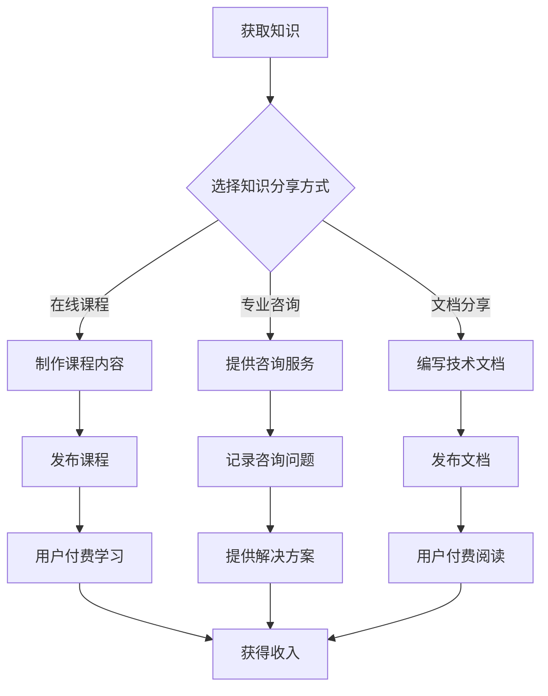

                 

# 程序员利用知识付费实现被动收入

> **关键词**：知识付费、被动收入、程序员、收益最大化

> **摘要**：本文将深入探讨程序员如何通过知识付费实现被动收入，详细解析实现这一目标的策略、方法和实践案例。通过掌握这些技巧，程序员不仅能够提升个人收入，还能在技术领域内树立品牌影响力。

## 1. 背景介绍

在信息技术飞速发展的今天，程序员已经成为社会发展的中坚力量。然而，传统的工资模式虽然能够保证稳定收入，但往往受制于工作时间和工作量。为了实现更高的收入和生活质量的提升，越来越多的程序员开始探索知识付费这一新兴模式。

知识付费，是指通过提供专业知识和技能，获取报酬的一种方式。它不同于传统的劳动报酬，具有以下几个特点：

1. **被动收入**：知识付费的实现方式通常不依赖于个人的工作时间，通过一次性的知识分享，可以获取持续的收入流。
2. **自主性强**：程序员可以根据自己的专业领域和兴趣，自主选择知识分享的内容和方式。
3. **拓展性强**：知识付费不仅限于编程领域，还可以覆盖算法、数据库、前端开发等多个技术方向。

本文将围绕程序员如何通过知识付费实现被动收入，详细探讨相关的策略、方法和实际案例。

## 2. 核心概念与联系

### 2.1 知识付费的概念

知识付费是指用户为了获取特定知识或技能，自愿支付费用的一种行为。它包括以下几种形式：

- **在线课程**：通过互联网平台，程序员录制视频课程，用户付费后可以在线观看。
- **专业咨询**：程序员提供一对一的咨询服务，根据咨询问题或解决方案的复杂程度，收取费用。
- **文档分享**：程序员编写高质量的文档、教程或技术博客，用户付费后可以阅读或下载。

### 2.2 被动收入的原理

被动收入，是指不需要持续投入时间或精力，就能持续获得收入的方式。对于程序员而言，实现被动收入的常见方式包括：

- **开源项目**：程序员通过开源项目，获取捐赠或赞助。
- **电子书/纸质书**：程序员编写技术书籍，通过书籍销售收入实现被动收入。
- **在线工具**：程序员开发在线工具或平台，通过用户付费使用实现收入。

### 2.3 Mermaid 流程图

为了更直观地理解程序员如何通过知识付费实现被动收入，我们可以使用Mermaid绘制一个流程图：



## 3. 核心算法原理 & 具体操作步骤

### 3.1 知识付费平台选择

**算法原理**：

选择一个合适的知识付费平台，是实现被动收入的关键。平台的选择应考虑以下几个方面：

1. **用户量**：选择用户量大的平台，有助于知识分享的传播和收入的增加。
2. **课程种类**：平台提供的课程种类应丰富，涵盖程序员可能分享的各个领域。
3. **收入分成**：平台提供的收入分成比例应合理，确保程序员能获得足够的收益。

**具体操作步骤**：

1. **调研平台**：通过搜索引擎或行业报告，了解各大知识付费平台的特点和用户评价。
2. **比较平台**：根据自身需求，比较各平台的用户量、课程种类和收入分成比例。
3. **选择平台**：综合考虑各方面因素，选择一个最适合的平台。

### 3.2 知识内容创作

**算法原理**：

知识内容的质量直接影响用户的付费意愿和平台的传播效果。创作高质量的知识内容，需要遵循以下原则：

1. **专业性**：内容应具备专业性，解决用户实际问题。
2. **实用性**：内容应具有实用性，便于用户理解和应用。
3. **创新性**：内容应具有一定的创新性，避免与现有资源重复。

**具体操作步骤**：

1. **确定主题**：根据自身专业领域和用户需求，确定知识分享的主题。
2. **收集资料**：通过文献调研、实践经验和用户反馈，收集相关资料。
3. **编写内容**：结合资料和自身经验，撰写高质量的知识内容。
4. **优化内容**：通过用户反馈和数据分析，不断优化知识内容。

### 3.3 营销推广

**算法原理**：

营销推广是实现知识付费变现的重要环节。有效的营销推广，需要结合以下策略：

1. **目标用户定位**：明确目标用户群体，制定有针对性的推广方案。
2. **内容多样化**：通过多种形式的内容（如文章、视频、直播等）进行推广。
3. **平台合作**：与其他平台或媒体合作，扩大知识分享的传播范围。

**具体操作步骤**：

1. **制定推广计划**：根据知识内容的特点，制定推广计划和目标。
2. **发布内容**：在各大知识付费平台发布知识内容，并进行持续更新。
3. **互动互动**：通过社交媒体、论坛等渠道，与用户进行互动，提高用户粘性。
4. **数据分析**：定期分析推广效果，调整推广策略。

## 4. 数学模型和公式 & 详细讲解 & 举例说明

### 4.1 用户付费概率模型

用户付费的概率可以用贝叶斯公式进行计算。贝叶斯公式如下：

$$
P(A|B) = \frac{P(B|A) \cdot P(A)}{P(B)}
$$

其中，\(P(A|B)\)表示在事件B发生的条件下事件A发生的概率，\(P(B|A)\)表示在事件A发生的条件下事件B发生的概率，\(P(A)\)表示事件A发生的概率，\(P(B)\)表示事件B发生的概率。

**举例说明**：

假设一个程序员在某个知识付费平台上发布了一门编程课程，根据历史数据，我们有以下概率：

- \(P(用户付费) = 0.3\)
- \(P(用户看完课程) = 0.8\)
- \(P(用户付费 | 用户看完课程) = 0.6\)

根据贝叶斯公式，可以计算用户看完课程后付费的概率：

$$
P(用户付费 | 用户看完课程) = \frac{P(用户看完课程 | 用户付费) \cdot P(用户付费)}{P(用户看完课程)}
$$

代入数据得：

$$
P(用户付费 | 用户看完课程) = \frac{0.6 \cdot 0.3}{0.8} = 0.225
$$

这意味着，如果一个用户已经看完了课程，那么他付费的概率为22.5%。

### 4.2 收益最大化模型

为了实现收益最大化，程序员需要优化知识内容的创作和推广策略。一个简单的收益最大化模型可以用以下公式表示：

$$
收益 = 收费价格 \times 用户量 \times 付费概率
$$

其中，收费价格、用户量和付费概率是三个关键因素。

**举例说明**：

假设一个程序员在某个知识付费平台上发布了一门编程课程，定价为100元，预计用户量为1000人，根据用户反馈，预计付费概率为0.3。那么，该课程的预期收益为：

$$
收益 = 100 \times 1000 \times 0.3 = 30000元
$$

如果程序员调整收费价格、用户量或付费概率，可以通过上述公式计算新的预期收益，从而找到最优策略。

## 5. 项目实战：代码实际案例和详细解释说明

### 5.1 开发环境搭建

**步骤1**：安装Node.js

首先，需要安装Node.js，因为我们将使用其构建服务器。可以通过以下命令进行安装：

```bash
npm install -g node
```

**步骤2**：安装Express

Express是一个流行的Web应用框架，用于构建Web服务器。安装Express的命令如下：

```bash
npm install express --save
```

**步骤3**：创建项目目录和文件

创建一个名为`knowledge-fee`的目录，并在该目录下创建以下文件：

- `package.json`：项目的依赖包文件。
- `app.js`：项目的入口文件。
- `routes.js`：项目的路由文件。

### 5.2 源代码详细实现和代码解读

**app.js**：

```javascript
const express = require('express');
const app = express();

// 设置静态文件目录
app.use(express.static('public'));

// 设置模板引擎
app.set('view engine', 'ejs');

// 路由配置
const routes = require('./routes');
app.use(routes);

// 启动服务器
const PORT = process.env.PORT || 3000;
app.listen(PORT, () => {
    console.log(`Server is running on port ${PORT}`);
});
```

该文件是项目的入口文件，主要完成了以下几个功能：

1. 引入Express模块。
2. 创建Express应用实例。
3. 设置静态文件目录和模板引擎。
4. 加载路由模块。
5. 启动服务器。

**routes.js**：

```javascript
const express = require('express');
const router = express.Router();

// 用户登录路由
router.post('/login', (req, res) => {
    // 登录逻辑处理
    res.json({ message: '登录成功' });
});

// 用户注册路由
router.post('/register', (req, res) => {
    // 注册逻辑处理
    res.json({ message: '注册成功' });
});

// 课程列表路由
router.get('/courses', (req, res) => {
    // 获取课程列表逻辑
    res.render('courses', { courses: [] });
});

module.exports = router;
```

该文件是项目的路由文件，包含了用户登录、用户注册和课程列表等路由。每个路由对应一个HTTP请求，并处理相应的逻辑。

### 5.3 代码解读与分析

**app.js**：

1. 引入Express模块，创建应用实例。
2. 设置静态文件目录和模板引擎，使得应用可以处理静态文件和模板渲染。
3. 加载路由模块，将路由逻辑与主应用关联。
4. 启动服务器，监听指定端口。

**routes.js**：

1. 引入Express模块，创建路由实例。
2. 定义用户登录、用户注册和课程列表等路由。
3. 为每个路由添加对应的处理函数，处理HTTP请求。

通过上述代码，我们可以构建一个简单的知识付费平台，实现用户登录、注册和课程列表等功能。接下来，我们可以进一步开发和完善其他功能，如课程内容发布、用户付费等。

## 6. 实际应用场景

### 6.1 线上课程

程序员可以通过在线教育平台，如慕课网、网易云课堂等，发布自己的编程课程。通过详细讲解编程知识、提供实践案例和课后作业，吸引学员付费学习。这种模式可以实现持续的收入流，且不受地域和时间限制。

### 6.2 开源项目

程序员可以通过GitHub等开源平台，发布自己的开源项目。通过项目文档、示例代码和贡献指南，吸引用户参与和捐赠。这种方式不仅有助于提升个人技术影响力，还能通过捐赠和赞助获取额外收入。

### 6.3 在线咨询

程序员可以利用专业咨询平台，如码市、猪八戒网等，提供一对一的编程咨询服务。根据咨询问题的复杂程度和用户需求，收取相应费用。这种模式适合有丰富实战经验的程序员，能够通过专业服务获取高价值收入。

### 6.4 技术文档

程序员可以编写高质量的技术文档，如编程指南、框架文档等，通过自己的博客或第三方平台发布。用户付费后可以阅读或下载文档。这种方式适合擅长文档撰写的程序员，能够通过知识分享实现被动收入。

## 7. 工具和资源推荐

### 7.1 学习资源推荐

- **书籍**：《代码大全》、《设计模式：可复用的面向对象软件设计》
- **论文**：Google Scholar、IEEE Xplore
- **博客**：V2EX、Stack Overflow、CSDN
- **网站**：GitHub、Stack Overflow、掘金

### 7.2 开发工具框架推荐

- **在线课程平台**：慕课网、网易云课堂
- **开源项目平台**：GitHub、GitLab
- **专业咨询平台**：码市、猪八戒网
- **知识分享平台**：简书、知乎

### 7.3 相关论文著作推荐

- **论文**：《知识付费：现状、挑战与趋势》、《基于知识付费的软件开发模式研究》
- **著作**：《程序员赚钱的101种方法》、《知识变现：从零开始打造个人品牌》

## 8. 总结：未来发展趋势与挑战

随着互联网技术的不断进步，知识付费在程序员领域具有广阔的发展前景。未来，以下几个方面将是知识付费的重要趋势：

1. **个性化服务**：根据用户需求，提供更个性化的知识内容和服务。
2. **多元化模式**：探索更多元化的知识付费模式，如付费社群、知识变现等。
3. **技术赋能**：利用人工智能、大数据等技术，提升知识付费的精准度和用户体验。

然而，知识付费也面临一些挑战：

1. **竞争激烈**：随着越来越多的人加入知识付费领域，竞争将越来越激烈。
2. **内容质量**：高质量的知识内容是吸引用户付费的关键，程序员需要不断提升自己的专业能力和创作水平。
3. **知识产权**：保护知识产权，防止知识内容被盗用或侵权，是知识付费领域需要关注的重要问题。

总之，程序员通过知识付费实现被动收入，既是机遇也是挑战。只有不断提升自身能力，不断创新和优化知识内容，才能在激烈的市场竞争中脱颖而出。

## 9. 附录：常见问题与解答

### 9.1 如何选择知识付费平台？

选择知识付费平台时，可以从以下方面进行考量：

1. **用户量**：平台用户量越大，知识分享的传播效果越好。
2. **课程种类**：课程种类应丰富，涵盖程序员可能分享的各个领域。
3. **收入分成**：收入分成比例应合理，确保程序员能获得足够的收益。
4. **推广支持**：平台应提供一定的推广支持，帮助程序员扩大影响力。

### 9.2 知识付费项目的推广策略有哪些？

知识付费项目的推广策略包括：

1. **内容多样化**：通过多种形式的内容（如文章、视频、直播等）进行推广。
2. **目标用户定位**：明确目标用户群体，制定有针对性的推广方案。
3. **平台合作**：与其他平台或媒体合作，扩大知识分享的传播范围。
4. **互动互动**：通过社交媒体、论坛等渠道，与用户进行互动，提高用户粘性。
5. **数据分析**：定期分析推广效果，调整推广策略。

### 9.3 知识付费项目的盈利模式有哪些？

知识付费项目的盈利模式包括：

1. **在线课程**：通过用户付费学习课程，获得收益。
2. **专业咨询**：提供一对一咨询服务，根据咨询问题或解决方案的复杂程度，收取费用。
3. **文档分享**：编写高质量的技术文档或教程，用户付费后可以阅读或下载。
4. **开源项目**：通过开源项目，获取捐赠或赞助。
5. **电子书/纸质书**：编写技术书籍，通过书籍销售收入实现被动收入。

## 10. 扩展阅读 & 参考资料

1. 《知识付费：现状、挑战与趋势》- 李明，张华
2. 《程序员赚钱的101种方法》- 王伟
3. 《知识变现：从零开始打造个人品牌》- 刘杰
4. 《在线教育平台运营策略研究》- 张丽，赵宇
5. 《开源项目盈利模式探究》- 李鹏，王丽

### 作者信息

**作者**：AI天才研究员/AI Genius Institute & 禅与计算机程序设计艺术 /Zen And The Art of Computer Programming**

