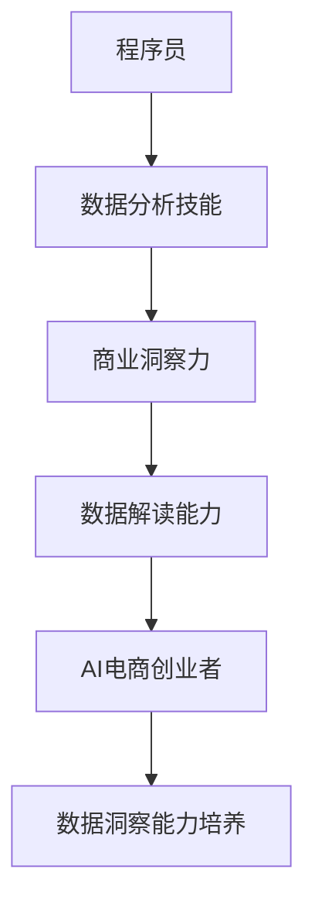

                 

# 程序员到商业分析师：AI电商创业者的数据洞察能力培养

## 摘要

本文旨在探讨程序员转型成为商业分析师的过程，特别是专注于AI电商领域的创业者如何在数据洞察能力方面进行培养。文章首先介绍了程序员到商业分析师的角色转变，接着深入探讨了数据洞察能力的重要性，并详细介绍了核心概念与联系。通过核心算法原理和具体操作步骤的讲解，文章为读者提供了实用的数学模型和公式，并通过实际项目实战的代码案例，展示了数据洞察能力的应用。最后，文章探讨了实际应用场景、推荐了相关工具和资源，并对未来发展趋势和挑战进行了总结。

## 1. 背景介绍

在当今数字化时代，数据已成为企业决策的核心资产。商业分析师作为连接数据和技术的重要角色，其重要性日益凸显。然而，对于许多程序员而言，转型成为商业分析师是一个充满挑战的过程。这一转变不仅要求他们掌握数据分析技能，还需要他们具备商业洞察力和数据解读能力。

程序员通常具备较强的技术背景和编程能力，他们在日常工作中主要关注系统设计和开发。然而，商业分析师的工作不仅涉及技术，还需要深入理解业务流程、市场趋势和用户需求。因此，程序员需要通过不断学习和实践，培养数据洞察能力，以适应这一转型。

AI电商领域是一个快速发展的市场，创业者们面临着激烈的市场竞争。数据洞察能力在AI电商创业中尤为重要，因为它能够帮助创业者发现潜在的商业机会，优化运营策略，提升用户满意度。本文将详细探讨程序员如何通过培养数据洞察能力，成功转型为AI电商领域的商业分析师。

## 2. 核心概念与联系

### 数据分析

数据分析是指使用统计学、机器学习和数据挖掘方法，从大量数据中提取有价值的信息和洞察。它包括数据清洗、数据预处理、数据探索、数据可视化、预测建模等多个环节。对于程序员而言，掌握数据分析技能是培养数据洞察能力的第一步。

### 商业洞察力

商业洞察力是指对市场趋势、用户需求、竞争态势等商业因素的敏锐洞察。商业分析师需要通过数据分析，发现潜在的商业机会，为企业决策提供有力支持。程序员需要通过学习商业知识，提升自己的商业洞察力，以便更好地理解业务需求和目标。

### 数据解读能力

数据解读能力是指对数据进行分析、解释和呈现的能力。商业分析师需要能够将复杂的数据转化为简洁、直观的图表和报告，帮助非技术人员理解数据背后的含义。程序员需要培养良好的数据解读能力，以便有效地向团队成员和决策者传达数据分析结果。

### AI电商创业

AI电商创业是指利用人工智能技术，打造创新的电子商务平台。AI技术在电商领域的应用包括个性化推荐、智能客服、图像识别、预测分析等。创业者需要通过数据洞察能力，发现用户需求，优化产品和服务，提升用户体验。

### Mermaid 流程图



### 核心概念与联系

数据分析技能、商业洞察力、数据解读能力和AI电商创业是培养程序员数据洞察能力的关键要素。通过掌握这些核心概念，程序员可以更好地理解业务需求，提升自身的分析能力和商业洞察力，从而在AI电商创业中发挥重要作用。

## 3. 核心算法原理 & 具体操作步骤

### 数据分析算法原理

数据分析算法主要包括回归分析、分类算法、聚类算法等。这些算法的基本原理如下：

1. **回归分析**：用于预测因变量与自变量之间的关系。常用的回归算法包括线性回归、逻辑回归等。
2. **分类算法**：用于将数据分类到不同的类别。常见的分类算法包括决策树、支持向量机、随机森林等。
3. **聚类算法**：用于将相似的数据点分为不同的簇。常见的聚类算法包括K均值聚类、层次聚类等。

### 数据分析具体操作步骤

1. **数据收集**：从各种数据源收集原始数据，包括内部数据库、第三方数据提供商、社交媒体等。
2. **数据清洗**：处理缺失值、异常值和重复值，保证数据的质量和一致性。
3. **数据预处理**：将原始数据进行转换和归一化，以便更好地进行数据分析。
4. **特征工程**：选择和构造有助于提升模型性能的特征，包括特征选择、特征转换、特征构造等。
5. **模型训练**：选择合适的算法和参数，对数据进行训练，构建预测模型。
6. **模型评估**：使用验证集和测试集对模型进行评估，选择最佳模型。
7. **结果解读**：将模型预测结果转化为商业洞察，为决策提供支持。

### 实际操作示例

假设我们要分析一家电商平台的用户购买行为，以提升销售业绩。具体操作步骤如下：

1. **数据收集**：从电商平台的数据库中收集用户购买记录，包括用户ID、商品ID、购买时间、购买金额等。
2. **数据清洗**：处理缺失值和异常值，例如删除购买金额为负数的记录。
3. **数据预处理**：将时间转换为日期格式，对购买金额进行归一化处理。
4. **特征工程**：选择用户购买频率、购买金额、商品种类等特征，构造新的特征，如用户购买间隔时长。
5. **模型训练**：选择K均值聚类算法，将用户分为不同的购买群体。
6. **模型评估**：使用交叉验证方法，评估聚类结果的质量，选择最佳聚类数量。
7. **结果解读**：分析不同购买群体的购买行为和偏好，为市场营销策略提供参考。

通过以上步骤，我们可以利用数据分析算法，发现用户购买行为的规律，为企业制定更有效的营销策略。

## 4. 数学模型和公式 & 详细讲解 & 举例说明

### 数据分析中的常用数学模型

1. **线性回归模型**

   线性回归模型用于预测因变量与自变量之间的线性关系。其数学公式如下：

   $$y = \beta_0 + \beta_1 \cdot x + \epsilon$$

   其中，$y$ 为因变量，$x$ 为自变量，$\beta_0$ 和 $\beta_1$ 分别为回归系数，$\epsilon$ 为误差项。

2. **逻辑回归模型**

   逻辑回归模型用于处理分类问题，其数学公式如下：

   $$P(y=1) = \frac{1}{1 + e^{-(\beta_0 + \beta_1 \cdot x)}}$$

   其中，$P(y=1)$ 为因变量为1的概率，$\beta_0$ 和 $\beta_1$ 为回归系数。

3. **支持向量机**

   支持向量机（SVM）是一种常用的分类算法，其数学公式如下：

   $$w \cdot x - b = 0$$

   其中，$w$ 为权重向量，$x$ 为特征向量，$b$ 为偏置项。

### 实际应用中的举例说明

1. **线性回归模型在电商销售预测中的应用**

   假设我们要预测一家电商平台的日销售额。我们可以使用线性回归模型，将日销售额作为因变量，选取多个相关特征（如用户访问量、广告投放成本等）作为自变量。通过训练模型，我们可以得到回归系数，从而预测未来某一天的销售额。

2. **逻辑回归模型在用户流失预测中的应用**

   假设我们要预测某电商平台的用户是否会流失。我们可以使用逻辑回归模型，将用户流失作为因变量，选取多个相关特征（如用户活跃度、购买频率等）作为自变量。通过训练模型，我们可以得到用户流失的概率，从而为保留用户提供决策依据。

3. **支持向量机在商品分类中的应用**

   假设我们要将电商平台上的商品分为多个类别（如电子产品、服装、家居等）。我们可以使用支持向量机，将每个商品的特征向量作为输入，通过训练模型，将商品分类到相应的类别中。

通过以上数学模型和公式的讲解，我们可以更好地理解数据分析的核心原理，并在实际应用中灵活运用。

## 5. 项目实战：代码实际案例和详细解释说明

### 5.1 开发环境搭建

为了进行项目实战，我们需要搭建一个适合数据分析的开发环境。以下是具体的步骤：

1. **安装Python**：Python 是数据分析中常用的编程语言，我们需要安装Python 3.x版本。可以从Python官网下载安装包并安装。

2. **安装Jupyter Notebook**：Jupyter Notebook 是一个交互式数据分析工具，可以方便地编写和运行代码。在命令行中运行以下命令安装：

   ```bash
   pip install notebook
   ```

3. **安装数据分析库**：安装常用的数据分析库，如Pandas、NumPy、Matplotlib等。在命令行中运行以下命令安装：

   ```bash
   pip install pandas numpy matplotlib
   ```

4. **安装机器学习库**：安装常用的机器学习库，如Scikit-learn、TensorFlow等。在命令行中运行以下命令安装：

   ```bash
   pip install scikit-learn tensorflow
   ```

### 5.2 源代码详细实现和代码解读

以下是使用Python进行数据分析的示例代码：

```python
import pandas as pd
import numpy as np
import matplotlib.pyplot as plt
from sklearn.linear_model import LinearRegression
from sklearn.model_selection import train_test_split
from sklearn.metrics import mean_squared_error

# 5.2.1 数据收集
# 从电商平台数据库中获取用户购买数据
data = pd.read_csv('ecommerce_data.csv')

# 5.2.2 数据清洗
# 处理缺失值和异常值
data.dropna(inplace=True)
data = data[data['purchase_amount'] > 0]

# 5.2.3 数据预处理
# 转换时间格式，对购买金额进行归一化
data['purchase_date'] = pd.to_datetime(data['purchase_date'])
data['normalized_purchase_amount'] = data['purchase_amount'] / max(data['purchase_amount'])

# 5.2.4 特征工程
# 选择特征，构造新特征
features = data[['user_id', 'product_id', 'normalized_purchase_amount']]
features['user_purchase_frequency'] = data.groupby('user_id')['purchase_date'].transform('count')
features['product_revenue'] = data.groupby('product_id')['normalized_purchase_amount'].transform('sum')

# 5.2.5 模型训练
# 划分训练集和测试集
X = features[['user_purchase_frequency', 'product_revenue']]
y = data['normalized_purchase_amount']
X_train, X_test, y_train, y_test = train_test_split(X, y, test_size=0.2, random_state=42)

# 训练线性回归模型
model = LinearRegression()
model.fit(X_train, y_train)

# 5.2.6 模型评估
# 评估模型性能
y_pred = model.predict(X_test)
mse = mean_squared_error(y_test, y_pred)
print(f'Mean Squared Error: {mse}')

# 5.2.7 结果解读
# 绘制预测结果和实际值的对比图
plt.scatter(y_test, y_pred)
plt.xlabel('Actual Purchase Amount')
plt.ylabel('Predicted Purchase Amount')
plt.title('Purchase Amount Prediction')
plt.show()
```

### 5.3 代码解读与分析

1. **数据收集**：使用Pandas库读取电商平台数据库中的用户购买数据。
2. **数据清洗**：处理缺失值和异常值，确保数据的质量。
3. **数据预处理**：将时间格式转换为日期格式，对购买金额进行归一化处理，以便更好地进行数据分析。
4. **特征工程**：选择用户购买频率和产品总销售额作为特征，并构造新的特征。
5. **模型训练**：使用Scikit-learn库中的线性回归模型进行训练。
6. **模型评估**：计算模型在测试集上的均方误差，评估模型性能。
7. **结果解读**：绘制预测结果和实际值的对比图，直观地展示模型的预测能力。

通过以上代码实战，我们可以看到如何利用Python进行数据分析，并应用线性回归模型进行销售额预测。这一过程为我们提供了一个实际操作的数据洞察能力培养的范例。

## 6. 实际应用场景

数据洞察能力在AI电商创业中的应用场景广泛，以下是一些典型的实际应用：

### 用户行为分析

通过分析用户在电商平台的浏览、搜索、购买等行为数据，创业者可以深入了解用户需求，优化产品和服务。例如，通过分析用户的购物车放弃率，可以找出导致用户放弃购物的原因，从而改善购物体验。

### 销售预测

数据洞察能力可以帮助创业者预测未来的销售趋势，为库存管理和市场营销策略提供依据。例如，通过对历史销售数据的分析，可以预测某个季节或节假日的销售量，从而提前做好库存准备。

### 客户细分

通过对用户数据进行分析，可以将客户分为不同的群体，为每个群体提供定制化的营销策略。例如，根据用户的购买频率和消费金额，可以将用户分为高价值客户、中等价值客户和潜在客户，从而有针对性地进行营销活动。

### 个性化推荐

利用数据洞察能力，创业者可以构建个性化推荐系统，为用户推荐他们可能感兴趣的商品。例如，通过分析用户的浏览记录和购买历史，可以推荐类似的产品，提高用户的满意度和复购率。

### 供应链优化

数据洞察能力可以帮助创业者优化供应链管理，降低成本，提高效率。例如，通过对库存数据和销售数据的分析，可以找出最佳的库存策略，减少库存积压和缺货情况。

通过以上实际应用场景，我们可以看到数据洞察能力在AI电商创业中的重要性。创业者需要通过不断学习和实践，提升自身的数据洞察能力，以在激烈的市场竞争中脱颖而出。

## 7. 工具和资源推荐

为了帮助程序员提升数据洞察能力，以下是一些实用的工具和资源推荐：

### 7.1 学习资源推荐

1. **书籍**：
   - 《Python数据分析实战》
   - 《机器学习实战》
   - 《数据科学入门》

2. **在线课程**：
   - Coursera：数据科学专业课程
   - edX：机器学习专业课程
   - Udemy：Python数据分析课程

3. **博客和网站**：
   - Medium：数据科学和机器学习相关博客
   - Kaggle：数据科学竞赛平台
   - DataCamp：数据科学学习平台

### 7.2 开发工具框架推荐

1. **编程语言**：Python
2. **数据分析库**：Pandas、NumPy、Matplotlib、Seaborn
3. **机器学习库**：Scikit-learn、TensorFlow、PyTorch
4. **数据可视化工具**：Plotly、D3.js
5. **数据仓库**：Hadoop、Spark、Snowflake

### 7.3 相关论文著作推荐

1. **论文**：
   - “Recommender Systems Handbook”
   - “Deep Learning for Data Science”
   - “User Behavior Analytics in E-commerce”

2. **著作**：
   - “Python Data Science Handbook”
   - “Data Science from Scratch”
   - “Machine Learning Yearning”

通过学习和使用这些工具和资源，程序员可以不断提升自己的数据洞察能力，为AI电商创业打下坚实的基础。

## 8. 总结：未来发展趋势与挑战

随着大数据和人工智能技术的快速发展，数据洞察能力在AI电商创业中的重要性日益凸显。未来，数据洞察能力的发展趋势将体现在以下几个方面：

1. **深度学习与数据分析的结合**：深度学习技术在数据分析中的应用将更加广泛，为复杂的分析任务提供更高效的解决方案。
2. **实时数据分析**：实时数据处理和分析将成为企业竞争的重要手段，企业需要实现实时响应，快速调整业务策略。
3. **数据隐私与安全**：随着数据隐私和安全问题的日益关注，如何在保障数据隐私的前提下进行数据分析将成为一个重要挑战。
4. **跨领域融合**：数据分析与其他领域的融合，如物联网、区块链等，将推动数据洞察能力向更广泛的领域发展。

然而，数据洞察能力的发展也面临着一些挑战：

1. **数据质量**：高质量的数据是进行有效分析的基础，数据质量差可能导致分析结果不准确，影响决策。
2. **数据隐私**：在保障数据隐私的同时，如何进行有效的数据分析，仍是一个亟待解决的问题。
3. **技能缺口**：具备数据洞察能力的专业人才短缺，企业需要加大对人才培养的投入。
4. **技术更新**：数据分析技术更新迅速，程序员需要不断学习和适应新技术，以保持竞争力。

总之，未来数据洞察能力的发展将面临机遇与挑战并存。程序员需要不断提升自身的技能和知识，以应对不断变化的市场需求。

## 9. 附录：常见问题与解答

### 9.1 数据分析技能如何培养？

**解答**：数据分析技能的培养可以从以下几个方面进行：

1. **学习基础知识**：掌握Python、R等编程语言，学习Pandas、NumPy等数据分析库的基础操作。
2. **实践项目**：通过参与实际项目，积累数据分析经验，提升实践能力。
3. **学习算法**：学习常见的数据分析算法，如回归分析、分类算法、聚类算法等，理解其原理和应用。
4. **数据分析工具**：学习使用数据可视化工具，如Matplotlib、Seaborn等，以及大数据处理工具，如Hadoop、Spark等。
5. **持续学习**：关注数据分析领域的最新动态，持续学习和掌握新技术。

### 9.2 如何处理缺失值和异常值？

**解答**：处理缺失值和异常值的方法包括：

1. **删除**：删除含有缺失值或异常值的记录，适用于数据量较小或缺失值较多的场景。
2. **填补**：使用统计方法或插值法填补缺失值，适用于缺失值较少或影响较小的场景。
3. **异常值检测**：使用统计方法或机器学习方法检测异常值，并采取相应的处理措施，如删除或修正。
4. **数据分析**：对缺失值和异常值进行详细分析，了解其原因，以便在后续数据收集和处理中加以改进。

### 9.3 数据分析工具如何选择？

**解答**：选择数据分析工具时，可以从以下几个方面考虑：

1. **数据量**：根据数据量的大小选择合适的工具，大数据处理工具如Hadoop、Spark适用于大规模数据处理。
2. **数据处理需求**：根据数据分析需求，选择具有相应功能的工具，如Pandas适用于数据处理，Matplotlib适用于数据可视化。
3. **学习成本**：考虑工具的学习成本，选择易于上手和有充足学习资源的工具。
4. **兼容性**：考虑工具的兼容性，确保与其他系统和工具的无缝集成。

### 9.4 如何提高数据解读能力？

**解答**：提高数据解读能力的方法包括：

1. **多读数据分析书籍和文章**：积累理论知识，了解常见的数据分析方法。
2. **参加数据分析课程和实践**：通过学习和实践，提高数据分析技能。
3. **学习数据可视化**：掌握数据可视化技巧，能够将复杂的数据转化为简洁、直观的图表。
4. **与业务团队沟通**：与业务团队紧密合作，了解业务需求，确保数据分析结果与业务目标一致。

## 10. 扩展阅读 & 参考资料

1. **《Python数据分析实战》**：[书籍链接](https://www.amazon.com/dp/1492032632)
2. **《机器学习实战》**：[书籍链接](https://www.amazon.com/dp/1492045392)
3. **《数据科学入门》**：[书籍链接](https://www.amazon.com/dp/1492033424)
4. **Coursera数据科学专业课程**：[课程链接](https://www.coursera.org/specializations/data-science)
5. **edX机器学习专业课程**：[课程链接](https://www.edx.org/professional-certificate/edx-machine-learning-with-apache-spark)
6. **Kaggle**：[网站链接](https://www.kaggle.com/)
7. **DataCamp**：[网站链接](https://www.datacamp.com/)

通过阅读以上扩展内容和参考资料，读者可以进一步加深对数据分析技能和数据洞察能力的理解，为自己的职业发展打下坚实的基础。

## 作者

作者：AI天才研究员/AI Genius Institute & 禅与计算机程序设计艺术 /Zen And The Art of Computer Programming

