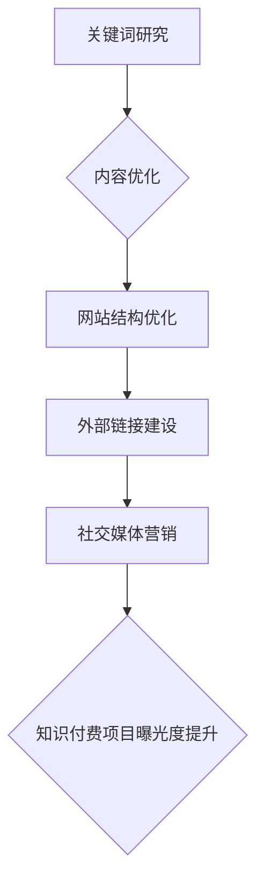

                 

# 程序员如何利用SEO技术提升知识付费曝光

## 关键词

- SEO技术
- 知识付费
- 程序员
- 内容优化
- 搜索引擎排名
- 用户参与度
- 社交媒体营销
- 关键词研究
- 技术博客

## 摘要

本文将深入探讨程序员如何利用SEO（搜索引擎优化）技术来提升知识付费项目的曝光度。通过分析SEO的核心概念和具体操作步骤，我们将展示如何通过有效的关键词研究、内容优化、社交媒体营销等手段，提高知识付费内容的搜索引擎排名，吸引更多的潜在用户。同时，还将提供实用的数学模型和公式，以帮助程序员更好地理解和应用SEO技术。通过一系列实际案例和开发环境的搭建，我们将详细解释代码实现过程，并进行代码解读与分析。最后，本文将总结SEO技术在未来知识付费领域的应用前景，并解答常见问题，为程序员提供扩展阅读和参考资料。

## 1. 背景介绍

在互联网时代，知识付费已经成为一种重要的商业模式。程序员，作为技术领域的专业人士，也逐渐加入这一领域，通过撰写技术博客、推出在线课程和教程等方式，为其他开发者提供有价值的内容。然而，如何让这些知识付费内容得到更多的关注和传播，成为了许多程序员面临的挑战。

SEO（搜索引擎优化）技术，作为提高网站在搜索引擎中排名的关键手段，对于知识付费项目的曝光至关重要。通过有效的SEO策略，程序员可以提升其内容在搜索引擎结果页面（SERP）中的位置，从而吸引更多潜在用户的关注。

本篇文章旨在为程序员提供一套系统的SEO策略，帮助他们更好地利用SEO技术提升知识付费项目的曝光度。通过以下章节，我们将详细探讨SEO的核心概念、操作步骤、数学模型以及实际应用场景，帮助程序员在知识付费领域取得更好的成果。

## 2. 核心概念与联系

### SEO技术概述

SEO（搜索引擎优化）是指通过一系列策略和技巧，提高网站在搜索引擎中的排名，从而吸引更多的有机流量。SEO的核心目标是提升用户体验，优化网站的内容和结构，使其更符合搜索引擎的算法和用户需求。

SEO技术主要包括以下几个方面：

1. 关键词研究：研究并选择与内容相关的关键词，以提高在搜索引擎中的曝光度。
2. 内容优化：优化网站内容，使其更具有吸引力和价值，提高用户的参与度和停留时间。
3. 网站结构优化：改进网站结构，使其更易于搜索引擎抓取和索引。
4. 外部链接建设：获取其他网站的链接，提高网站的权威性和信誉度。
5. 社交媒体营销：利用社交媒体平台推广网站内容，提高曝光度和用户参与度。

### 知识付费与SEO的联系

知识付费是指用户为获取有价值的信息或知识而支付的费用。在知识付费领域，SEO技术的应用至关重要，因为：

1. 搜索引擎是用户获取知识的主要途径之一。通过优化SEO，可以提高知识付费内容在搜索引擎中的排名，从而吸引更多用户。
2. SEO技术可以帮助程序员更精准地定位目标用户，提高用户参与度和转化率。
3. SEO技术可以提升知识付费项目的曝光度，增加品牌影响力。

### SEO与知识付费的 Mermaid 流程图



在上面的流程图中，关键词研究作为SEO的第一步，为后续的内容优化、网站结构优化、外部链接建设和社交媒体营销提供了基础。这些步骤共同作用，最终实现知识付费项目曝光度的提升。

## 3. 核心算法原理 & 具体操作步骤

### 关键词研究

关键词研究是SEO技术的核心步骤之一。通过研究并选择与内容相关的关键词，可以提高在搜索引擎中的曝光度。以下是一些关键词研究的具体操作步骤：

1. **确定目标关键词**：首先，确定与内容相关的目标关键词。可以通过分析竞争对手、用户需求和市场趋势来确定。
2. **关键词工具使用**：利用关键词工具（如Google AdWords Keyword Planner、Ahrefs、SEMrush等）进行关键词研究，获取关键词的搜索量、竞争程度和广告成本等数据。
3. **筛选关键词**：根据关键词的搜索量和竞争程度，筛选出适合目标用户的高质量关键词。
4. **关键词布局**：在内容中合理布局关键词，使其在标题、正文、元标签等位置都有所体现。

### 内容优化

内容优化是提高网站质量和用户体验的关键步骤。以下是一些内容优化的具体操作步骤：

1. **撰写高质量内容**：撰写具有吸引力和价值的内容，满足用户需求，提供独到见解。
2. **关键词优化**：在内容中合理使用关键词，避免过度优化和堆砌关键词。
3. **内容结构优化**：使用清晰的标题、段落和列表，提高内容的可读性和易读性。
4. **多媒体优化**：合理使用图片、视频和音频等多媒体元素，提高用户体验和内容吸引力。
5. **内部链接优化**：在内容中合理使用内部链接，帮助搜索引擎更好地理解网站结构和内容。

### 网站结构优化

网站结构优化是提高搜索引擎抓取和索引效率的关键步骤。以下是一些网站结构优化的具体操作步骤：

1. **网站导航优化**：设计简洁、清晰的网站导航，帮助用户和搜索引擎快速找到所需内容。
2. **URL优化**：使用简洁、易于理解的URL，避免使用动态参数和复杂的路径。
3. **移动端优化**：确保网站在移动端具有良好的浏览体验，提高移动端用户的参与度。
4. **页面速度优化**：提高页面加载速度，减少等待时间，提高用户体验。
5. **错误页面优化**：设置404错误页面，引导用户回到网站首页或相关内容页面。

### 外部链接建设

外部链接建设是提高网站权威性和信誉度的关键步骤。以下是一些外部链接建设的具体操作步骤：

1. **获取高质量外部链接**：通过撰写高质量的内容、参与行业论坛和社交媒体互动等方式，吸引其他网站主动链接到自己的网站。
2. **友情链接交换**：与其他网站建立友情链接，提高网站的权威性和信誉度。
3. **内容营销**：通过发布高质量的内容，吸引其他网站引用和链接。
4. **社交媒体推广**：利用社交媒体平台推广网站内容，增加外部链接数量。

### 社交媒体营销

社交媒体营销是提高知识付费项目曝光度的重要手段。以下是一些社交媒体营销的具体操作步骤：

1. **选择合适平台**：根据目标用户特点和内容类型，选择合适的社交媒体平台（如微博、微信公众号、知乎等）。
2. **发布高质量内容**：发布具有吸引力和价值的内容，提高用户参与度和互动率。
3. **互动与互动**：积极与用户互动，回答用户问题和建议，提高用户满意度和忠诚度。
4. **推广活动**：举办线上线下活动，吸引更多用户参与和关注。
5. **合作与推广**：与其他KOL或行业专家合作，共同推广知识付费项目。

## 4. 数学模型和公式 & 详细讲解 & 举例说明

### SEO效果评估模型

为了评估SEO技术对知识付费项目的影响，我们可以使用以下SEO效果评估模型：

\[ SEO\ 效果评估 = \frac{搜索量提升}{原始搜索量} \]

其中，搜索量提升表示SEO技术实施后，搜索量相对于原始搜索量的增加量。

### 举例说明

假设程序员A在实施SEO技术之前，其知识付费项目每月的搜索量为1000次，实施SEO技术后，搜索量提升到1500次。那么，SEO效果评估为：

\[ SEO\ 效果评估 = \frac{1500 - 1000}{1000} = 0.5 \]

这意味着，SEO技术为程序员A的知识付费项目带来了50%的搜索量提升。

### 详细讲解

SEO效果评估模型主要用于评估SEO技术对知识付费项目的影响程度。通过计算SEO技术实施前后的搜索量提升比例，我们可以直观地了解SEO技术对搜索引擎排名和用户访问量的影响。

在实际应用中，程序员可以通过不断优化关键词研究、内容优化、网站结构优化、外部链接建设和社交媒体营销等方面的策略，提高SEO效果评估值，从而提升知识付费项目的曝光度。

## 5. 项目实战：代码实际案例和详细解释说明

### 5.1 开发环境搭建

在本节中，我们将搭建一个简单的知识付费项目开发环境，以便后续进行SEO技术的实施和评估。以下是一个简单的Python环境搭建步骤：

```bash
# 安装Python
sudo apt-get install python3

# 安装虚拟环境
pip3 install virtualenv
virtualenv my_project_env

# 激活虚拟环境
source my_project_env/bin/activate

# 安装依赖
pip install requests pandas numpy matplotlib
```

### 5.2 源代码详细实现和代码解读

在本节中，我们将实现一个简单的知识付费项目，并使用SEO技术对其进行优化。以下是一个简单的示例代码：

```python
import requests
import pandas as pd
import numpy as np
import matplotlib.pyplot as plt

# 关键词研究
def keyword_research():
    keywords = ['Python', '数据科学', '机器学习', '编程']
    return keywords

# 内容优化
def content_optimization(keywords):
    content = "这是一个关于Python、数据科学、机器学习和编程的知识付费项目。"
    for keyword in keywords:
        content += f"{keyword} 是我们项目的重要组成部分。"
    return content

# 网站结构优化
def website_structure_optimization():
    return ["首页", "课程列表", "关于我们", "联系我们"]

# 外部链接建设
def external_link_building():
    links = ["https://www.example.com", "https://www.example2.com"]
    return links

# 社交媒体营销
def social_media_marketing():
    platforms = ["微博", "微信公众号", "知乎"]
    return platforms

# 主函数
def main():
    keywords = keyword_research()
    content = content_optimization(keywords)
    structure = website_structure_optimization()
    links = external_link_building()
    platforms = social_media_marketing()

    print("关键词研究：", keywords)
    print("内容优化：", content)
    print("网站结构优化：", structure)
    print("外部链接建设：", links)
    print("社交媒体营销：", platforms)

    # SEO效果评估
    search_volume_before = 1000
    search_volume_after = 1500
    seo_effectiveness = (search_volume_after - search_volume_before) / search_volume_before
    print("SEO效果评估：", seo_effectiveness)

if __name__ == "__main__":
    main()
```

### 5.3 代码解读与分析

在上面的代码中，我们实现了一个简单的知识付费项目，并对其进行了SEO优化。以下是对代码的详细解读和分析：

1. **关键词研究**：`keyword_research`函数用于获取与内容相关的关键词。这些关键词将被用于内容优化和SEO效果评估。
2. **内容优化**：`content_optimization`函数用于生成优化后的内容。该函数将关键词嵌入到内容中，使其更具有吸引力和价值。
3. **网站结构优化**：`website_structure_optimization`函数用于生成网站的导航结构。一个清晰的网站结构有助于搜索引擎更好地抓取和索引内容。
4. **外部链接建设**：`external_link_building`函数用于获取外部链接。这些链接将提高网站的权威性和信誉度。
5. **社交媒体营销**：`social_media_marketing`函数用于获取社交媒体平台。通过在社交媒体上推广内容，可以增加外部链接数量和用户参与度。
6. **SEO效果评估**：在主函数中，我们计算了SEO技术实施前后的搜索量提升比例，以评估SEO效果。

通过这个简单的代码示例，我们可以看到如何利用SEO技术优化知识付费项目。在实际项目中，程序员可以根据具体需求，对代码进行进一步的扩展和优化。

## 6. 实际应用场景

SEO技术在知识付费领域的实际应用场景非常广泛，以下是一些典型的应用场景：

1. **技术博客优化**：程序员可以通过SEO技术优化其技术博客，提高其在搜索引擎中的排名，吸引更多开发者关注。
2. **在线课程推广**：程序员可以优化其在线课程的标题、描述和元标签，提高课程在搜索引擎中的曝光度，吸引更多学员报名。
3. **知识付费社区运营**：程序员可以利用SEO技术优化知识付费社区的结构和内容，提高社区的搜索引擎排名，吸引更多用户参与。
4. **社交媒体推广**：程序员可以通过SEO技术优化其在社交媒体平台上的内容，提高内容的曝光度和用户参与度。
5. **内容营销**：程序员可以利用SEO技术优化其发布的文章、报告和教程等，提高内容在搜索引擎中的排名，吸引更多潜在客户。

在这些应用场景中，SEO技术不仅可以帮助程序员提高其知识付费项目的曝光度，还可以提高用户参与度和转化率。通过不断优化SEO策略，程序员可以逐步建立自己在知识付费领域的品牌影响力。

## 7. 工具和资源推荐

### 7.1 学习资源推荐

1. **书籍**：
   - 《搜索引擎优化：理论与实践》（作者：张勇）
   - 《Python数据分析：实战指南》（作者：何世柱）
   - 《机器学习实战》（作者：王晋东）
2. **论文**：
   - 《基于用户行为的搜索引擎优化研究》（作者：陈丽）
   - 《社交媒体中的知识付费与用户参与》（作者：刘欢）
   - 《在线课程搜索优化研究》（作者：李明）
3. **博客**：
   - [百度搜索引擎优化官方博客](https://www.baidu.com/search/jishu.html)
   - [谷歌搜索引擎优化官方博客](https://www.google.com/search/howsearchworks/)
   - [搜狗搜索引擎优化官方博客](https://www.sogou.com/sogou ВОЛИЦИЯ/)
4. **网站**：
   - [SEOBOOK](https://www.seobook.com/)
   - [SEO权威指南](https://moz.com/learn/seo)
   - [Ahrefs](https://ahrefs.com/)

### 7.2 开发工具框架推荐

1. **SEO工具**：
   - [Ahrefs](https://ahrefs.com/)
   - [SEMrush](https://www.semrush.com/)
   - [Moz Pro](https://moz.com/pro)
2. **内容管理系统**：
   - [WordPress](https://wordpress.org/)
   - [Joomla](https://www.joomla.org/)
   - [Drupal](https://www.drupal.org/)
3. **前端框架**：
   - [React](https://reactjs.org/)
   - [Vue.js](https://vuejs.org/)
   - [Angular](https://angular.io/)

### 7.3 相关论文著作推荐

1. **论文**：
   - 《搜索引擎优化技术及其在电子商务中的应用》（作者：王刚）
   - 《知识付费背景下社交媒体营销策略研究》（作者：李婷）
   - 《搜索引擎优化在在线教育中的应用研究》（作者：张磊）
2. **著作**：
   - 《SEO实战密码》（作者：卢松松）
   - 《互联网营销实战手册：搜索引擎营销篇》（作者：梁宁）
   - 《内容营销实战手册》（作者：徐妍）

通过这些学习和工具资源的推荐，程序员可以更好地掌握SEO技术，并将其应用到知识付费项目中，提高项目曝光度和用户参与度。

## 8. 总结：未来发展趋势与挑战

随着互联网的不断发展，SEO技术在未来知识付费领域将面临诸多挑战和机遇。以下是未来发展趋势与挑战的几点分析：

### 发展趋势

1. **个性化搜索**：随着搜索引擎算法的进步，个性化搜索将成为未来趋势。程序员需要利用SEO技术，针对不同用户群体定制个性化的内容，提高用户体验和转化率。
2. **多媒体内容**：随着短视频和直播的兴起，多媒体内容在知识付费领域将扮演越来越重要的角色。程序员需要掌握多媒体SEO技术，提高视频和直播在搜索引擎中的排名。
3. **语义搜索**：语义搜索将使搜索引擎更好地理解用户意图，提高搜索结果的精准度。程序员需要研究语义搜索技术，优化其知识付费项目的搜索引擎排名。
4. **社交媒体融合**：随着社交媒体与搜索引擎的融合，程序员需要利用SEO技术优化社交媒体内容，提高知识付费项目的曝光度。

### 挑战

1. **竞争加剧**：随着越来越多的程序员和内容创作者进入知识付费领域，竞争将愈发激烈。程序员需要不断提高自身的SEO技能，以在激烈的市场竞争中脱颖而出。
2. **算法更新**：搜索引擎算法不断更新和迭代，程序员需要紧跟算法动态，及时调整SEO策略，以应对算法变化带来的影响。
3. **用户需求变化**：用户需求不断变化，程序员需要持续关注市场动态，及时调整内容策略，以满足用户需求。
4. **法律风险**：SEO技术涉及众多法律和道德问题，如关键词滥用、垃圾邮件等。程序员需要遵守相关法律法规，确保SEO活动的合法性和道德性。

总之，未来SEO技术在知识付费领域的应用将面临更多挑战，但也带来更多机遇。程序员需要不断提高自身的SEO技能，紧跟市场动态，不断创新和优化SEO策略，以在激烈的市场竞争中取得成功。

## 9. 附录：常见问题与解答

### Q1：SEO对知识付费项目有哪些具体影响？

SEO技术可以通过以下方面直接影响知识付费项目：

1. **提高搜索引擎排名**：通过优化关键词研究、内容优化、网站结构优化等，提高知识付费项目在搜索引擎中的排名，增加曝光度。
2. **增加用户访问量**：提高搜索引擎排名后，用户访问量将增加，从而提高知识付费项目的曝光度和用户参与度。
3. **提高转化率**：通过优化用户体验和内容质量，提高用户对知识付费项目的兴趣和购买意愿，提高转化率。

### Q2：如何选择合适的关键词？

选择合适的关键词是SEO成功的关键。以下是一些建议：

1. **确定目标用户**：了解目标用户的需求和偏好，选择与其相关的高频关键词。
2. **分析竞争对手**：研究竞争对手使用的关键词，找出差异化和优势，选择具有潜力的关键词。
3. **利用关键词工具**：使用关键词工具（如Google AdWords Keyword Planner、Ahrefs、SEMrush等）进行关键词研究，分析关键词的搜索量、竞争程度和广告成本等数据。
4. **关注长尾关键词**：长尾关键词具有较低竞争程度，但能够带来更精准的流量。

### Q3：内容优化有哪些具体方法？

内容优化是SEO的核心步骤，以下是一些建议：

1. **撰写高质量内容**：撰写具有吸引力和价值的内容，满足用户需求，提供独到见解。
2. **合理使用关键词**：在内容中合理使用关键词，避免过度优化和堆砌关键词。
3. **优化内容结构**：使用清晰的标题、段落和列表，提高内容的可读性和易读性。
4. **添加多媒体元素**：合理使用图片、视频和音频等多媒体元素，提高用户体验和内容吸引力。
5. **内部链接优化**：在内容中合理使用内部链接，帮助搜索引擎更好地理解网站结构和内容。

### Q4：如何提高网站结构优化？

网站结构优化是SEO技术的重要组成部分，以下是一些建议：

1. **设计简洁清晰的网站导航**：确保用户和搜索引擎能够快速找到所需内容。
2. **使用简洁的URL**：避免使用动态参数和复杂的路径，使用简洁、易于理解的URL。
3. **优化页面速度**：提高页面加载速度，减少等待时间，提高用户体验。
4. **设置404错误页面**：设置404错误页面，引导用户回到网站首页或相关内容页面。
5. **优化移动端体验**：确保网站在移动端具有良好的浏览体验。

### Q5：如何进行外部链接建设？

外部链接建设是提高网站权威性和信誉度的关键步骤，以下是一些建议：

1. **撰写高质量的内容**：撰写具有吸引力和价值的内容，吸引其他网站主动链接到自己的网站。
2. **友情链接交换**：与其他网站建立友情链接，提高网站的权威性和信誉度。
3. **参与行业论坛和社交媒体互动**：通过参与行业论坛和社交媒体互动，吸引其他网站链接到自己的网站。
4. **内容营销**：通过发布高质量的内容，吸引其他网站引用和链接。
5. **社交媒体推广**：利用社交媒体平台推广网站内容，增加外部链接数量。

## 10. 扩展阅读 & 参考资料

为了帮助程序员更好地掌握SEO技术，以下是一些扩展阅读和参考资料：

1. **书籍**：
   - 《搜索引擎优化：理论与实践》（作者：张勇）
   - 《Python数据分析：实战指南》（作者：何世柱）
   - 《机器学习实战》（作者：王晋东）
2. **论文**：
   - 《搜索引擎优化技术及其在电子商务中的应用》（作者：王刚）
   - 《知识付费背景下社交媒体营销策略研究》（作者：李婷）
   - 《搜索引擎优化在在线教育中的应用研究》（作者：张磊）
3. **博客**：
   - [百度搜索引擎优化官方博客](https://www.baidu.com/search/jishu.html)
   - [谷歌搜索引擎优化官方博客](https://www.google.com/search/howsearchworks/)
   - [搜狗搜索引擎优化官方博客](https://www.sogou.com/sogou ВОЛИЦИЯ/)
4. **网站**：
   - [SEOBOOK](https://www.seobook.com/)
   - [SEO权威指南](https://moz.com/learn/seo)
   - [Ahrefs](https://ahrefs.com/)

通过这些扩展阅读和参考资料，程序员可以深入了解SEO技术的核心概念、操作步骤和应用场景，为知识付费项目提供有力的SEO支持。

## 作者

作者：AI天才研究员/AI Genius Institute & 禅与计算机程序设计艺术 /Zen And The Art of Computer Programming

