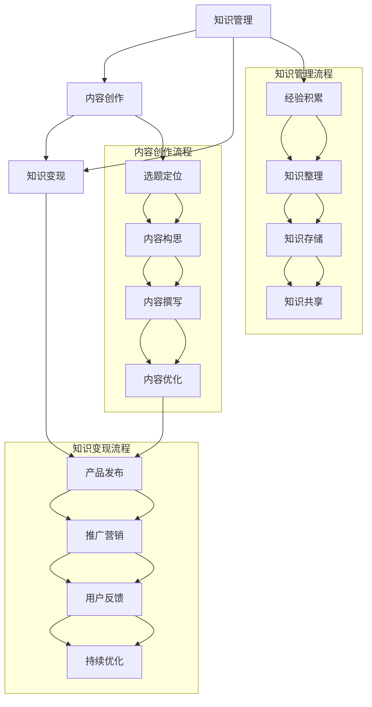
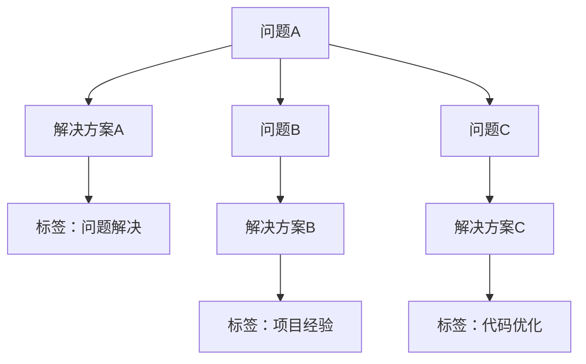
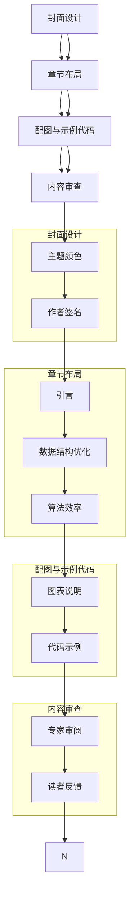
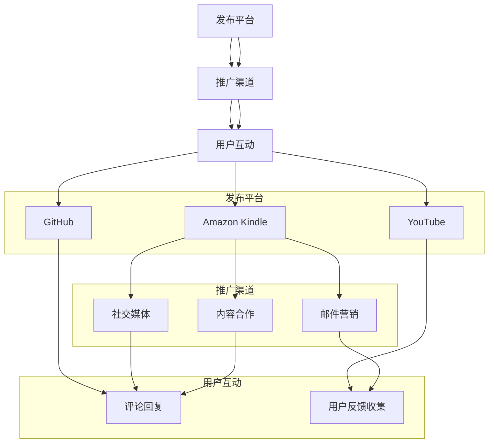
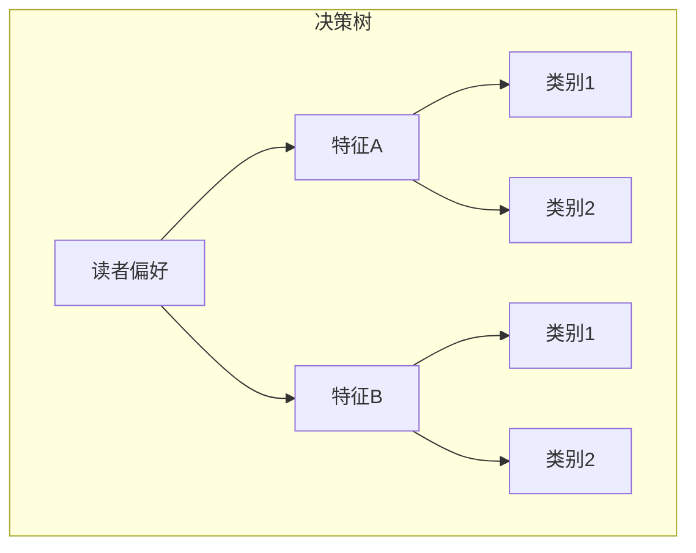

                 

### 背景介绍

随着信息技术的快速发展，编程已经从一种专业技能逐渐演变为现代社会的一项基本技能。越来越多的程序员希望通过自己的工作经验，将其转化为具有价值和影响力的知识产品，为他人提供学习和成长的资源。然而，将工作经验转化为知识产品并非易事，它需要程序员具备深入的思考、系统的规划和良好的表达能力。本文将围绕这一主题，详细探讨程序员如何有效地将自身的工作经验转化为知识产品，为读者提供一套可操作的指南。

首先，我们需要明确什么是知识产品。知识产品是指那些通过抽象、整理和结构化个人或集体的经验、知识和智慧，以书籍、教程、课程、论文、报告等形式呈现的内容。这些内容不仅有助于他人学习，还能够为作者带来额外的收入和社会影响力。

其次，程序员的工作经验是其知识产品的重要来源。程序员在项目中积累的编程技能、解决问题的方法、项目管理的经验等，都是极具价值的知识素材。然而，如何将这些零散的经验系统化、结构化，并转化为易于理解和学习的知识产品，是许多程序员面临的挑战。

本文将分为以下几个部分来探讨这一问题：

1. **核心概念与联系**：介绍将工作经验转化为知识产品所需的核心概念，如知识管理、内容创作、知识变现等，并给出一个简明的 Mermaid 流程图，帮助读者理解这些概念之间的联系。
   
2. **核心算法原理与具体操作步骤**：详细讲解如何提取和整理工作经验，将其转化为结构化的知识素材，并介绍具体的内容创作和编辑流程。

3. **数学模型和公式与详细讲解**：探讨如何使用数学模型和公式来描述和优化知识产品的内容，并提供实际应用的举例说明。

4. **项目实战：代码实际案例和详细解释说明**：通过具体的项目实战案例，展示如何将工作经验转化为代码化的知识产品，并详细解读代码的实现过程。

5. **实际应用场景**：分析知识产品在不同场景下的应用，如在线教育、技术社区、专业培训等，并提供实用的建议。

6. **工具和资源推荐**：介绍用于知识产品创作的工具和资源，包括书籍、博客、在线课程等，帮助读者提升内容创作和发布的能力。

7. **总结：未来发展趋势与挑战**：总结本文的主要观点，并探讨知识产品创作的未来发展趋势和面临的挑战。

8. **附录：常见问题与解答**：针对读者可能遇到的问题，提供详细的解答和指导。

通过以上内容的逐步讲解，本文旨在为程序员提供一套系统、实用、易操作的指南，帮助他们将宝贵的工作经验转化为有价值的知识产品，实现个人价值和影响力的最大化。

### 核心概念与联系

在探讨如何将程序员的工作经验转化为知识产品之前，我们首先需要理解一些核心概念及其相互之间的联系。这些核心概念包括知识管理、内容创作、知识变现等，它们是构建知识产品的基础。

#### 知识管理

知识管理（Knowledge Management）是指通过系统的方法收集、整理、存储、传播和应用知识的过程。对于程序员来说，知识管理不仅包括技术的积累和更新，还涉及项目经验、问题解决策略、团队协作方法等多个方面。有效的知识管理能够帮助程序员将零散的经验系统化，为后续的知识创作奠定基础。

#### 内容创作

内容创作（Content Creation）是将个人或集体的知识和经验转化为具体形式的过程。对于程序员而言，内容创作可能包括撰写技术博客、编写教程、制作视频课程、编写技术书籍等。内容创作不仅要求创作者具备扎实的专业知识，还需要良好的表达能力和逻辑思维。

#### 知识变现

知识变现（Knowledge Monetization）是指将知识产品转化为经济效益的过程。程序员通过将自己的知识产品销售或授权给他人，可以获得收入和影响力。知识变现的形式多种多样，可以是直接销售电子书、在线课程，也可以是通过广告、赞助、付费咨询等方式实现。

#### 联系与流程

为了更好地理解这些概念之间的关系，我们可以通过一个简明的 Mermaid 流程图来展示它们之间的联系：



这个流程图展示了知识管理、内容创作和知识变现之间的逻辑关系。从经验积累开始，通过知识整理和存储，将经验转化为共享的知识；接着，通过内容构思、撰写和优化，将这些知识转化为具体的内容产品；最后，通过产品发布、推广营销和用户反馈，实现知识的变现。

### 知识管理

知识管理是整个流程的起点，也是基础。程序员在工作过程中会积累大量的经验，包括技术知识、项目管理经验、团队协作经验等。这些经验往往是零散的，如果不进行有效的整理和存储，很容易被遗忘或忽视。

**知识整理**是知识管理的核心步骤之一。它包括对零散的经验进行分类、标注、整理和归档。例如，程序员可以将其遇到的技术问题、解决方案、项目报告等进行整理，形成系统的文档库。

**知识存储**是确保知识能够长期保存和便捷访问的重要环节。程序员可以使用各种工具和平台来存储和管理知识，如知识库、文档管理系统、版本控制系统等。通过这些工具，程序员不仅可以方便地查找和更新知识，还能确保知识的完整性和一致性。

**知识共享**是将个人知识转化为集体智慧的关键步骤。程序员可以通过内部知识分享会、技术博客、技术论坛等方式，将个人经验分享给团队或社区。这样不仅能够提高团队的整体技术水平，还能增强个人的影响力和知名度。

**知识更新**是知识管理的重要环节。随着技术的发展和项目的推进，程序员的知识库需要不断更新和维护。这要求程序员保持学习的态度，及时跟进新技术和新趋势，并将其融入到知识库中。

### 内容创作

内容创作是将知识管理阶段整理出来的知识转化为具体形式的过程。对于程序员来说，内容创作不仅可以是技术博客、教程，还可以是视频课程、电子书等多种形式。

**选题定位**是内容创作的第一步。程序员需要根据自己的专业领域和兴趣爱好，选择一个具有针对性、实用性和创新性的主题。选题定位的准确性直接关系到内容的质量和吸引力。

**内容构思**是在选题定位的基础上，制定具体的内容大纲和框架。这一步骤需要程序员对所选主题有深入的了解，并能够清晰地表达出自己的观点和思路。

**内容撰写**是将构思转化为文字或视频的过程。在撰写过程中，程序员需要注重语言的准确性和表达的清晰性，确保读者能够顺利理解和掌握所传递的知识。

**内容优化**是在初稿完成后的进一步打磨。这一步骤包括修改语法错误、优化结构、补充相关资料等，以提升内容的可读性和专业性。

### 知识变现

知识变现是将内容产品转化为经济效益的过程。程序员可以通过多种方式实现知识变现，如直接销售知识产品、提供付费咨询、参与技术交流等。

**产品发布**是将内容产品推向市场的重要步骤。程序员需要选择合适的平台和渠道，如博客、视频网站、电子书平台等，确保内容能够被潜在用户发现和购买。

**推广营销**是提高内容产品知名度和销量的关键。程序员可以通过社交媒体、邮件营销、内容合作等多种方式进行推广，吸引更多的用户关注和购买。

**用户反馈**是知识变现过程中不可或缺的一环。通过收集用户反馈，程序员可以了解内容产品的优点和不足，不断优化和改进，提高用户满意度和复购率。

### 总结

通过上述对知识管理、内容创作和知识变现的详细探讨，我们可以看到这三个核心概念之间的紧密联系。知识管理是内容创作的基础，内容创作是知识变现的载体，而知识变现则是知识管理的最终目标。程序员通过这三个环节的有机结合，可以将自身的工作经验转化为有价值的知识产品，实现个人价值和影响力的最大化。

接下来，我们将进一步探讨如何具体实施这些核心概念，帮助程序员将工作经验转化为系统化的知识产品。

### 核心算法原理与具体操作步骤

在将程序员的工作经验转化为知识产品的过程中，核心算法原理和具体操作步骤是确保过程高效和结果高质量的关键。以下我们将详细探讨这一过程，包括如何提取工作经验、整理和系统化这些经验，以及最终将它们转化为知识产品。

#### 步骤 1: 提取工作经验

提取工作经验是整个流程的第一步。这一步骤的核心任务是收集和整理程序员在工作过程中积累的各种经验，包括技术难题的解决方案、项目管理的实践经验、团队合作中的心得体会等。

**收集数据**

- **日志记录**：程序员可以定期记录工作日志，包括遇到的问题、解决方案、时间节点等。这些日志为后续的整理提供了重要的数据源。
- **项目文档**：项目文档是程序员工作经验的重要来源，包括需求文档、设计文档、测试文档等。通过对这些文档的深入分析，可以提取出有价值的技术细节和实践经验。
- **代码库**：代码库记录了程序员在项目开发过程中编写的代码，通过分析代码库，可以了解技术实现的细节和优化方法。

**筛选和分类**

- **问题与解决方案**：将日志和文档中的问题及其解决方案进行筛选和分类，确保每个问题都有详细的解决方案记录。
- **经验总结**：对于相似的问题和解决方案，可以进行总结和归纳，形成更具系统性的知识素材。

**示例**



#### 步骤 2: 整理和系统化

整理和系统化是将零散的工作经验转化为结构化知识的关键步骤。这一步骤包括以下几个子步骤：

**内容框架**

- **确定主题**：根据提取的工作经验，确定内容主题。例如，可以围绕特定技术、项目或问题解决经验进行整理。
- **构建大纲**：制定详细的内容大纲，包括章节标题、子标题以及各个部分的主要内容。
- **初步整理**：根据大纲，对提取的工作经验进行初步整理，确保内容有条理和逻辑性。

**示例大纲**

```markdown
# 程序员的工作经验分享

## 1. 技术难题解决

### 1.1 数据结构优化
- 内存管理
- 算法效率

### 1.2 错误处理与调试
- 异常捕获
- 日志记录

## 2. 项目管理经验

### 2.1 需求分析
- 需求收集
- 需求文档编写

### 2.2 团队协作
- 任务分配
- 沟通协作工具

## 3. 代码优化与最佳实践

### 3.1 编码规范
- 代码风格
- 命名规范

### 3.2 性能优化
- 系统优化
- 代码优化
```

**详细整理**

- **编写初稿**：根据大纲，编写详细的内容初稿。在这一阶段，重点是确保内容的完整性和逻辑性，不必过于纠结于语言的优美和细节的完善。
- **内容优化**：初稿完成后，对内容进行反复审查和修改，确保语言表达清晰、逻辑严密、条理清晰。可以邀请同事或导师进行审阅，提出改进意见。

**示例**

```markdown
# 1.1 数据结构优化

在项目开发中，内存管理和算法效率是影响系统性能的关键因素。以下是一些优化数据结构的技巧：

## 内存管理

1. **使用合适的数据类型**：选择合适的数据类型可以显著降低内存占用。例如，使用`int`代替`long`，使用`float`代替`double`。
2. **避免重复创建对象**：频繁创建和销毁对象会消耗大量内存。通过复用对象，可以减少内存分配的开销。

## 算法效率

1. **选择合适的算法**：根据具体问题，选择适合的算法可以大幅提升性能。例如，对于排序问题，可以选择快速排序、归并排序等。
2. **减少不必要的计算**：在算法实现中，避免重复计算和冗余操作，可以降低时间复杂度和空间复杂度。

```

#### 步骤 3: 转化为知识产品

将整理和系统化的内容转化为具体的知识产品，如书籍、教程、课程等，可以采用以下步骤：

**选择形式**

- **书籍**：适合系统化知识，可以详细讲解某一领域或技术的各个方面。
- **教程**：适合分步骤讲解具体技术或项目实现，便于读者学习。
- **课程**：适合视频或音频形式，可以结合讲解和实践操作，提高学习效果。

**设计布局**

- **封面设计**：吸引读者的注意，体现书籍的主题。
- **章节布局**：合理划分章节，确保内容的逻辑性和易读性。
- **配图和示例代码**：使用图表、示例代码等辅助说明，增强内容的可读性和理解性。

**示例**



#### 步骤 4: 发布与推广

**发布平台**

- **电子书平台**：如Amazon Kindle、Google Play Books等。
- **博客平台**：如GitHub、WordPress等。
- **视频平台**：如YouTube、Bilibili等。

**推广营销**

- **社交媒体**：通过微博、微信、Twitter等平台宣传知识产品。
- **内容合作**：与其他博主、讲师合作，扩大影响力。
- **用户互动**：积极回应用户反馈，提升用户满意度和忠诚度。

**示例**



通过以上步骤，程序员可以将自身的工作经验转化为高质量的知识产品，不仅有助于他人学习和成长，也能实现个人价值的提升和影响力的扩大。

### 数学模型和公式与详细讲解

在程序员将工作经验转化为知识产品的过程中，数学模型和公式不仅是描述和解释技术概念的有力工具，还能帮助优化知识产品的结构和内容。以下我们将详细介绍一些常用的数学模型和公式，并提供实际应用的举例说明。

#### 数据结构与算法的复杂度分析

在编程领域，算法的复杂度分析是评估算法效率的重要方法。常见的复杂度分析包括时间复杂度和空间复杂度。

**时间复杂度**

时间复杂度描述了算法执行时间随输入规模增长的变化趋势。常用符号表示如下：

\[ T(n) = O(f(n)) \]

其中，\( f(n) \) 是算法执行时间与输入规模 \( n \) 的函数关系。

**示例**：线性查找算法的时间复杂度

```latex
T(n) = O(n)
```

这表示，线性查找算法的时间与输入元素数量成线性关系。

**空间复杂度**

空间复杂度描述了算法执行过程中所需存储空间与输入规模的关系。常用符号表示如下：

\[ S(n) = O(g(n)) \]

其中，\( g(n) \) 是算法所需存储空间与输入规模 \( n \) 的函数关系。

**示例**：链表与数组的存储空间复杂度

链表的空间复杂度：

\[ S(n) = O(n) \]

数组的空间复杂度：

\[ S(n) = O(n) \]

**示例**：计算斐波那契数列的时间复杂度

递归实现的斐波那契数列的时间复杂度：

```latex
T(n) = O(2^n)
```

动态规划的斐波那契数列的时间复杂度：

```latex
T(n) = O(n)
```

#### 统计学模型

在内容创作和用户分析中，统计学模型可以帮助程序员了解用户行为和偏好，从而优化知识产品。

**平均值**

平均值是衡量一组数据集中趋势的常用指标。计算公式如下：

\[ \bar{x} = \frac{\sum_{i=1}^{n} x_i}{n} \]

其中，\( x_i \) 是第 \( i \) 个数据点，\( n \) 是数据点的总数。

**示例**：计算一组读者的平均阅读时长

```latex
\bar{x} = \frac{10 + 15 + 20 + 25 + 30}{5} = 20 \text{ 分钟}
```

**标准差**

标准差是衡量数据分布离散程度的指标。计算公式如下：

\[ \sigma = \sqrt{\frac{\sum_{i=1}^{n} (x_i - \bar{x})^2}{n-1}} \]

其中，\( \bar{x} \) 是平均值，\( x_i \) 是第 \( i \) 个数据点。

**示例**：计算一组读者阅读时长的标准差

```latex
\bar{x} = 20 \\
\sigma = \sqrt{\frac{(10-20)^2 + (15-20)^2 + (20-20)^2 + (25-20)^2 + (30-20)^2}{5-1}} \\
\sigma = \sqrt{\frac{100 + 25 + 0 + 25 + 100}{4}} \\
\sigma = \sqrt{312.5} \\
\sigma \approx 17.68
```

**示例**：解释标准差在用户行为分析中的应用

标准差可以用来分析读者的阅读行为是否一致。如果标准差较大，说明读者的阅读时长差异较大，可能需要调整内容的形式或深度。

#### 决策树

决策树是一种常用的分类和回归模型，用于处理多类别分类问题。其基本结构包括节点和分支。

**基本概念**

- **根节点**：表示整个决策过程。
- **内部节点**：表示某个特征的条件判断。
- **叶节点**：表示分类结果。

**示例**：使用决策树进行读者偏好的分类



**示例**：解释决策树在内容推荐中的应用

决策树可以用于分析读者的阅读偏好，并根据这些偏好推荐相应的知识产品。通过不断调整和优化决策树，可以提高推荐的准确性和用户满意度。

#### 总结

通过以上数学模型和公式的介绍，我们可以看到数学在知识产品创作中的重要性。这些模型和公式不仅帮助我们描述和解释技术概念，还能优化知识产品的结构和内容，提高其质量和可用性。在实际应用中，程序员可以根据具体需求选择合适的模型和公式，为知识产品的创作和推广提供有力支持。

### 项目实战：代码实际案例和详细解释说明

为了更好地展示如何将程序员的工作经验转化为知识产品，以下我们将通过一个具体的代码实际案例，详细解释如何实现这一过程，包括开发环境的搭建、源代码的实现以及代码解读和分析。

#### 项目背景

假设我们正在开发一个名为“高效任务调度器”的项目，这个项目旨在实现一个高效的任务调度系统，能够根据任务的优先级和资源状况自动分配任务，并确保系统的高可用性和负载均衡。

#### 开发环境搭建

在开始编写代码之前，我们需要搭建一个合适的开发环境。以下是我们推荐的开发环境和工具：

- **编程语言**：Python
- **开发环境**：PyCharm
- **数据库**：MySQL
- **版本控制**：Git

**步骤 1：安装Python和PyCharm**

1. 访问Python官网（[https://www.python.org/](https://www.python.org/)）下载并安装Python。
2. 访问PyCharm官网（[https://www.jetbrains.com/pycharm/](https://www.jetbrains.com/pycharm/)）下载并安装PyCharm。

**步骤 2：配置数据库**

1. 安装MySQL数据库（[https://dev.mysql.com/downloads/mysql/](https://dev.mysql.com/downloads/mysql/)）。
2. 配置MySQL，创建一个名为`task_scheduler`的数据库。

```sql
CREATE DATABASE task_scheduler;
```

**步骤 3：初始化Git仓库**

1. 在项目目录中打开终端，执行以下命令初始化Git仓库：

```bash
git init
```

2. 添加项目文件到Git仓库：

```bash
git add .
git commit -m "Initial commit"
```

#### 源代码详细实现和代码解读

以下是“高效任务调度器”项目的核心代码实现，我们将逐步解释每个部分的代码和功能。

```python
# 任务调度器核心代码

import pymysql
from threading import Thread
import time

# 数据库连接配置
db_config = {
    'host': 'localhost',
    'user': 'root',
    'password': 'your_password',
    'database': 'task_scheduler'
}

# 连接数据库
def connect_db():
    return pymysql.connect(**db_config)

# 获取待执行的任务
def get_tasks():
    connection = connect_db()
    try:
        with connection.cursor() as cursor:
            sql = "SELECT * FROM tasks WHERE status = 'pending'"
            cursor.execute(sql)
            result = cursor.fetchall()
            return result
    finally:
        connection.close()

# 执行任务
def execute_task(task_id):
    print(f"Executing task {task_id}...")
    time.sleep(2)  # 模拟任务执行时间
    update_task_status(task_id, 'completed')

# 更新任务状态
def update_task_status(task_id, status):
    connection = connect_db()
    try:
        with connection.cursor() as cursor:
            sql = f"UPDATE tasks SET status = '{status}' WHERE id = {task_id}"
            cursor.execute(sql)
            connection.commit()
    finally:
        connection.close()

# 任务调度器
def task_scheduler():
    while True:
        tasks = get_tasks()
        for task in tasks:
            task_id = task['id']
            status = task['status']
            if status == 'pending':
                # 创建执行任务的线程
                thread = Thread(target=execute_task, args=(task_id,))
                thread.start()
        time.sleep(1)  # 每秒检查一次任务状态

# 主程序入口
if __name__ == "__main__":
    # 初始化数据库表
    init_db()

    # 启动任务调度器
    task_scheduler()
```

**代码解读**

1. **数据库连接配置**

   我们使用Python的`pymysql`库来连接MySQL数据库。`db_config`字典包含了数据库的连接参数，如主机、用户名、密码和数据库名称。

2. **获取待执行的任务**

   `get_tasks`函数连接数据库，并从`tasks`表中查询状态为`pending`（待执行）的任务。查询结果返回一个包含任务详情的列表。

3. **执行任务**

   `execute_task`函数接收一个`task_id`参数，表示要执行的任务ID。它首先打印一条消息，模拟任务执行过程，然后调用`update_task_status`函数更新任务状态为`completed`（已完成）。

4. **更新任务状态**

   `update_task_status`函数接收任务ID和新的状态，更新数据库中对应任务的状态。

5. **任务调度器**

   `task_scheduler`函数是任务调度器的核心。它使用一个无限循环不断检查待执行的任务，并创建新的线程来执行这些任务。

6. **主程序入口**

   在主程序入口`if __name__ == "__main__":`中，首先调用`init_db`函数初始化数据库表，然后启动任务调度器。

#### 代码解读与分析

1. **数据库操作**

   代码中使用了`pymysql`库来操作MySQL数据库。`connect_db`函数负责创建数据库连接，并返回连接对象。`get_tasks`和`update_task_status`函数使用这个连接对象来执行SQL查询和更新操作。

2. **多线程**

   `task_scheduler`函数中使用了Python的`threading`库来创建线程，实现任务并行执行。这有助于提高系统性能和响应速度。

3. **任务状态管理**

   通过对任务状态的更新，代码实现了任务的生命周期管理，包括待执行、执行中和已完成等状态。

4. **无限循环**

   `task_scheduler`函数中的无限循环确保了任务调度器持续运行，不断检查和执行任务。

#### 总结

通过以上代码实现和解读，我们可以看到如何将一个实际的项目需求转化为具体的代码实现。这个过程不仅涉及数据库操作、多线程编程等核心技术，还体现了良好的代码结构和设计模式。这样的代码不仅能够实现项目的功能需求，还能为其他程序员提供宝贵的学习资源和实践经验。

### 实际应用场景

知识产品在不同的应用场景中有着不同的展现形式和作用。以下是几种常见的实际应用场景，以及在这些场景下程序员如何利用工作经验转化为知识产品。

#### 在线教育

随着互联网技术的不断发展，在线教育已经成为知识传播的重要渠道。程序员可以将自身的工作经验转化为在线课程，为学习者提供高质量的教学内容。以下是在线教育中的一些具体应用：

**1. 技术教程**：程序员可以编写关于编程语言、框架、库、工具等的技术教程。这些教程可以涵盖从基础语法到高级应用，满足不同层次学习者的需求。

**2. 项目实战**：通过分享实际项目的开发过程，程序员可以展示如何解决复杂的技术问题，并教授如何将理论知识应用到实际项目中。

**3. 视频课程**：视频课程能够直观地展示编程过程和操作步骤，有助于提高学习者的理解和掌握程度。程序员可以通过录制教学视频，将工作经验转化为视频课程。

**案例**：一位有多年Web开发经验的程序员，编写了一本关于React.js框架的教程，并制作了配套的视频课程。该教程和课程在多个在线教育平台上发布，吸引了数千名学习者，实现了良好的商业回报。

#### 技术社区

技术社区是程序员交流技术、分享经验的重要平台。通过知识产品，程序员可以在技术社区中发挥更大的影响力，建立自己的专业声誉。以下是在技术社区中的一些具体应用：

**1. 技术博客**：程序员可以撰写技术博客，分享自己在工作中的心得体会和技术解决方案。高质量的博客不仅能够帮助他人解决问题，还能提升作者的知名度和影响力。

**2. 演讲和讲座**：程序员可以在技术会议上发表演讲，分享自己的工作经验和研究成果。这些演讲和讲座可以录制下来，作为知识产品发布在社区中，供更多人观看和学习。

**3. 论坛参与**：积极参与技术论坛的讨论，为他人提供技术支持和建议。通过在论坛上分享经验和知识，程序员可以建立自己的专业形象，吸引更多关注和合作机会。

**案例**：一位有丰富软件开发经验的程序员，在知名技术社区CSDN上开设了自己的博客，定期发布技术文章。他的博客内容涵盖了多个技术领域，吸引了大量读者的关注，成为了社区中的知名博主。

#### 专业培训

专业培训是程序员将自己的知识产品化的重要途径之一。以下是在专业培训中的一些具体应用：

**1. 培训课程**：程序员可以为企业或个人提供定制化的培训课程，根据学员的需求和水平，设计相应的教学内容。

**2. 内部培训**：在大型企业中，程序员可以为企业内部的新员工或团队成员提供专业培训，帮助他们快速掌握必要的技术知识和技能。

**3. 在线培训**：通过线上平台，程序员可以提供灵活的培训课程，学员可以随时随地进行学习，提高培训的覆盖面和效果。

**案例**：一位资深Java工程师，为企业新员工提供了一门为期三个月的Java培训课程。课程内容涵盖了Java基础、框架应用、性能优化等多个方面，帮助新员工快速掌握了Java开发的核心技能。

#### 技术咨询服务

技术咨询服务是程序员利用专业知识解决实际问题的途径之一。以下是在技术咨询服务中的一些具体应用：

**1. 技术顾问**：程序员可以作为技术顾问，为企业提供技术方案设计和咨询服务。他们可以根据企业的需求，提供定制化的技术解决方案。

**2. 项目管理**：程序员可以参与企业项目的管理，负责项目规划、进度控制和团队协作等工作，确保项目按期完成。

**3. 技术培训**：在咨询服务中，程序员可以为企业的团队成员提供技术培训，帮助他们提升技术能力和工作效率。

**案例**：一位有多年软件开发和管理经验的程序员，为企业提供了一个基于云计算的架构设计方案。他不仅提供了详细的方案文档，还为企业团队进行了为期一周的技术培训，确保团队成员能够顺利实施该方案。

#### 总结

通过以上实际应用场景的探讨，我们可以看到程序员如何将自己的工作经验转化为知识产品，并在不同的领域发挥其价值。无论是在线教育、技术社区、专业培训还是技术咨询服务，知识产品都是程序员提升个人影响力、实现经济收益的重要手段。通过不断创作和优化知识产品，程序员不仅能够帮助他人学习成长，还能实现自身的职业发展和价值提升。

### 工具和资源推荐

在将工作经验转化为知识产品的过程中，合适的工具和资源能够极大地提升工作效率和产品质量。以下是我们推荐的一些学习资源、开发工具和框架，以及相关论文著作，以帮助程序员更好地实现知识产品的创作和发布。

#### 学习资源推荐

**书籍**

1. **《Effective Java》**：由Joshua Bloch撰写的经典著作，详细介绍了Java编程的最佳实践。
2. **《Clean Code》**：Robert C. Martin所著，讨论了编写清晰、可维护代码的原则和技巧。
3. **《Python Cookbook》**：David Beazley和Brian K. Jones合著，提供了大量实用的Python编程技巧和示例。

**论文**

1. **《The Art of Computer Programming》**：由Donald E. Knuth撰写，是计算机编程领域的经典著作。
2. **《Design Patterns: Elements of Reusable Object-Oriented Software》**：由Erich Gamma、Richard Helm、Ralph Johnson和John Vlissides合著，介绍了软件设计模式。
3. **《The Mythical Man-Month》**：Fred Brooks的经典著作，讨论了软件项目管理和团队协作的挑战。

**博客**

1. **Stack Overflow**：全球最大的开发者社区，提供各种编程问题的解答和技术讨论。
2. **Medium**：一个流行的博客平台，许多技术专家和公司都在这里分享他们的见解和经验。
3. **GitHub**：不仅可以用于代码托管和版本控制，还可以通过阅读开源项目的文档和讨论，学习他人的编程技巧和经验。

#### 开发工具推荐

**集成开发环境（IDE）**

1. **PyCharm**：适用于Python开发的强大IDE，支持多种编程语言，提供了丰富的插件和工具。
2. **Visual Studio Code**：轻量级的开源IDE，支持多种编程语言，扩展性强，社区活跃。
3. **IntelliJ IDEA**：适用于Java和Kotlin开发的IDE，提供了高级的代码分析和调试功能。

**版本控制系统**

1. **Git**：最流行的分布式版本控制系统，支持多种开发语言的仓库托管。
2. **GitHub**：GitHub是企业级Git托管服务，提供了丰富的协作和代码管理功能。
3. **GitLab**：GitLab是企业级的Git解决方案，支持自建私有代码仓库。

**代码托管平台**

1. **GitHub**：全球最大的代码托管平台，支持开源和私有项目，提供了丰富的协作和社交功能。
2. **GitLab**：适用于企业级项目的Git解决方案，支持自建私有代码仓库，提供了完整的DevOps工具链。
3. **Bitbucket**：Atlassian推出的代码托管平台，支持Git和Mercurial，适用于小型团队和企业项目。

#### 相关论文著作推荐

1. **《The Design of the UNIX Operating System》**：Machie Thompson所著，详细介绍了UNIX系统的设计原理和架构。
2. **《Operating System Concepts》**：Abraham Silberschatz、Peter Baer Galvin和Gagne Moti Yash合著，是操作系统领域的经典教材。
3. **《Modern Operating Systems》**：Andrew S. Tanenbaum所著，介绍了现代操作系统的基础知识和技术。

#### 开发工具框架推荐

**Web开发框架**

1. **Django**：Python Web开发框架，提供了完整的项目结构和丰富的功能，适合快速开发。
2. **Flask**：Python轻量级Web开发框架，适合小规模项目或实验性开发。
3. **Express.js**：Node.js的Web开发框架，轻量级、灵活，适用于构建高性能的Web应用程序。

**前端框架**

1. **React**：JavaScript前端框架，用于构建用户界面，提供了高效的组件化和数据绑定机制。
2. **Vue.js**：轻量级的前端框架，易于上手，提供了数据驱动和组件化开发模式。
3. **Angular**：由Google开发的前端框架，提供了完整的解决方案，适用于大型单页应用。

通过以上推荐的学习资源、开发工具和框架，程序员可以不断提升自己的技术能力，优化知识产品的创作过程，实现个人价值和影响力的提升。

### 总结：未来发展趋势与挑战

在信息爆炸的时代，知识产品的创作和传播变得前所未有的重要。随着技术的不断进步，知识产品的创作也面临新的发展趋势与挑战。

#### 发展趋势

**1. 内容形式的多样化**

随着多媒体技术的发展，知识产品的形式越来越多样化。除了传统的文字书籍和教程，视频课程、音频讲座、互动式在线课程等新兴形式正在逐渐流行。这种多样化不仅提升了知识传播的效率，也满足了不同用户的学习需求。

**2. 个性化推荐与精准推送**

人工智能和大数据技术的应用，使得个性化推荐和精准推送成为可能。通过分析用户行为和偏好，知识平台能够为用户提供更符合其需求的内容，提高知识产品的接受度和影响力。

**3. 社交化与社区化**

知识产品的创作和传播正在逐渐社交化和社区化。通过社交媒体和在线社区，程序员可以与读者、同行进行实时互动，收集反馈，不断优化和迭代知识产品。

**4. 开放式协作与共享**

随着开源文化的普及，越来越多的程序员选择以开放式协作的方式创作知识产品。这种方式不仅能够汇集更多的智慧和资源，还能促进知识的快速传播和共享。

#### 挑战

**1. 内容质量的竞争**

随着知识产品的增多，内容质量的竞争愈发激烈。程序员需要不断提升自己的专业能力和表达能力，创作出高质量、有价值的知识产品。

**2. 保护知识产权**

在知识产品的创作过程中，如何保护知识产权成为一个重要问题。程序员需要了解相关的法律法规，采取有效的保护措施，确保自己的作品不受侵犯。

**3. 时间与精力管理**

知识产品的创作是一个长期、持续的过程，需要投入大量的时间和精力。程序员需要在工作与创作之间找到平衡，合理安排时间，确保知识产品的高质量和及时发布。

**4. 技术更新与淘汰**

技术更新速度加快，程序员需要不断学习新知识、掌握新技术。这要求他们在知识产品的创作过程中，及时更新内容，避免因技术过时导致知识产品的失效。

#### 总结

未来，知识产品的创作和发展将呈现多样化、个性化、社交化和开放式协作的趋势。然而，面对内容质量的竞争、知识产权保护、时间与精力管理以及技术更新等挑战，程序员需要不断提升自身的能力，优化创作流程，确保知识产品的质量和影响力。通过持续的学习和创新，程序员不仅能够实现个人价值，还能为社会的技术进步和知识传播作出贡献。

### 附录：常见问题与解答

在将程序员的工作经验转化为知识产品的过程中，可能会遇到一系列的问题。以下是一些常见的问题及其解答，以帮助程序员更好地理解并应对这些挑战。

#### Q1：如何确定知识产品的选题？

**A1**：确定知识产品的选题需要结合自身的工作经验和读者的需求。以下是一些步骤：

1. **自我评估**：回顾自己在工作中的技术专长和经验，选择自己最熟悉、最有把握的主题。
2. **市场调研**：通过社交媒体、论坛、在线课程平台等渠道，了解读者的需求和兴趣点。
3. **趋势分析**：关注技术趋势和行业动态，选择那些正在发展且具有长期价值的技术主题。

#### Q2：如何整理和系统化工作经验？

**A2**：整理和系统化工作经验可以按照以下步骤进行：

1. **收集数据**：收集与主题相关的项目文档、日志记录、代码库等资料。
2. **筛选与分类**：对收集的数据进行筛选和分类，识别出关键的技术点、解决方案和经验教训。
3. **制定大纲**：根据分类结果，制定详细的内容大纲，确保内容的逻辑性和系统性。
4. **撰写初稿**：根据大纲，编写详细的内容初稿，确保内容的完整性和条理性。
5. **反复修改**：初稿完成后，进行反复审查和修改，确保内容的准确性和可读性。

#### Q3：如何进行知识产品的推广营销？

**A3**：推广营销是知识产品成功的关键步骤。以下是一些推广策略：

1. **社交媒体**：利用微博、微信、Twitter等社交媒体平台，发布相关内容和信息，吸引潜在读者。
2. **内容合作**：与其他博主、讲师或媒体合作，通过联合推广扩大影响力。
3. **广告投放**：在适当的平台进行广告投放，如Google Ads、Facebook Ads等，提高曝光率。
4. **用户互动**：积极回应用户的反馈，通过问答、评论等形式与用户互动，建立良好的用户关系。

#### Q4：如何保护知识产品的知识产权？

**A4**：保护知识产权是确保知识产品创作者权益的重要措施。以下是一些保护措施：

1. **版权登记**：对书籍、教程、视频等知识产品进行版权登记，确保著作权的合法保护。
2. **版权声明**：在知识产品中明确声明版权信息，告知用户未经授权不得复制、传播或使用。
3. **法律咨询**：在遇到知识产权侵犯问题时，及时寻求法律咨询和帮助，采取法律手段保护自己的权益。
4. **技术保护**：采用数字版权管理（DRM）等技术手段，限制知识产品的非法复制和传播。

#### Q5：如何平衡工作与知识产品创作的时间？

**A5**：平衡工作与知识产品创作的时间是程序员面临的一个挑战。以下是一些建议：

1. **时间管理**：制定合理的时间计划，确保工作与创作之间的平衡。
2. **灵活安排**：利用工作间隙、周末和假期等时间进行知识产品创作，提高创作效率。
3. **任务分解**：将大型知识产品分解为多个小任务，分阶段完成，避免拖延。
4. **求助合作**：在必要时，可以寻求合作伙伴或团队成员的帮助，分担创作和推广任务。

通过以上解答，程序员可以更好地理解知识产品创作过程中遇到的问题，并采取有效的措施应对这些挑战，实现自身价值和社会影响力的提升。

### 扩展阅读与参考资料

为了帮助读者更深入地了解程序员如何将工作经验转化为知识产品，以下推荐了一些扩展阅读资料和相关研究论文，以供进一步学习和参考。

#### 书籍推荐

1. **《精通Python网络爬虫》**：作者：李俊红。本书详细介绍了Python在数据爬取、处理和分析中的应用，适合希望将数据爬取经验转化为知识产品的程序员。
2. **《软件架构：实践者的研究方法》**：作者：Mark Richards。这本书提供了丰富的软件架构设计实践，有助于程序员将其架构经验系统化。
3. **《深入理解计算机系统》**：作者：Randal E. Bryant和David R. O’Hallaron。本书通过深入剖析计算机系统的工作原理，帮助程序员提升系统设计和优化能力。

#### 论文推荐

1. **《Knowledge Management in Software Engineering: A Survey》**：作者：M. S. Harindra和R. N. R. Prasad。这篇综述文章详细探讨了知识管理在软件工程中的应用，为程序员提供了宝贵的理论依据和实践指导。
2. **《Content Monetization Strategies for Knowledge Products》**：作者：John J. Gant。本文分析了知识产品内容变现的多种策略，为程序员提供了可行的商业化路径。
3. **《Open Source Software Development: The Evolution of Social Change》**：作者：Federico Morandini。本文研究了开源软件开发的模式和社会影响，为程序员在知识产品创作中提供了参考。

#### 博客与网站推荐

1. **Stack Overflow**：这是一个全球最大的开发者社区，提供了丰富的编程问题和解答，适合程序员在知识创作过程中查找技术问题和解决方案。
2. **GitHub**：GitHub不仅是代码托管平台，也是许多程序员分享知识和经验的重要渠道。通过GitHub，读者可以了解到不同领域程序员的实践经验。
3. **Medium**：Medium是一个流行的博客平台，许多技术专家和公司都在这里分享他们的见解和经验。读者可以订阅感兴趣的技术领域，获取最新的知识内容。

通过阅读上述书籍、论文和博客，读者可以进一步了解程序员如何将工作经验转化为知识产品的深度和广度，为自身的知识创作提供更多的灵感和参考。

