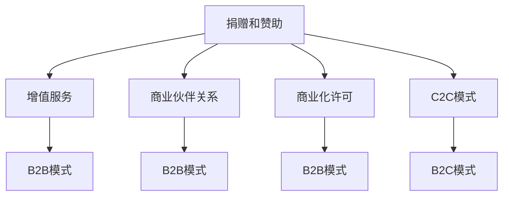

                 

# 程序员如何将开源项目转化为可持续盈利的商业模式

## 摘要

本文将深入探讨程序员如何将开源项目转化为可持续盈利的商业模式。我们将从开源项目的背景和现状入手，分析开源项目的盈利模式，探讨如何通过提供增值服务、打造社区、构建商业生态系统等方式实现开源项目的商业化。同时，我们将分享一些成功案例，并提出未来开源项目盈利模式的可能发展趋势和面临的挑战。通过本文的阅读，程序员们将能够更好地理解如何将他们的开源项目转化为可持续盈利的商业模式。

## 1. 背景介绍

开源项目，顾名思义，是那些在许可证允许的范围内，允许用户自由使用、研究、修改和分发软件的项目。这些项目通常由全球各地的志愿者或小型团队开发，他们的目标是创造一个共享、透明的技术生态系统，以推动技术进步和创新。

随着互联网的普及和开源文化的兴起，越来越多的程序员开始参与开源项目。开源项目不仅提供了免费的软件解决方案，还促进了知识的共享和技术的交流。许多大型公司，如谷歌、微软和亚马逊等，也积极贡献资源和人力到开源项目中。

然而，尽管开源项目为社区带来了巨大的价值，但许多程序员在参与开源项目时却面临着一个问题：如何将这些项目转化为可持续盈利的商业模式？

要回答这个问题，首先需要了解开源项目的现状和盈利模式。接下来，我们将深入探讨一些成功案例，并分析程序员如何通过不同的策略实现开源项目的商业化。

## 2. 核心概念与联系

### 开源项目的现状

根据2021年的一项研究，全球有超过200万名开发者参与开源项目，而这些项目吸引了超过10亿次的下载。这些数据表明，开源项目在技术社区中具有广泛的吸引力和影响力。然而，尽管参与度高，但开源项目的盈利模式仍然是一个挑战。

### 开源项目的盈利模式

目前，开源项目的盈利模式主要有以下几种：

1. **捐赠和赞助**：许多开源项目通过接受捐赠和赞助来获得收入。这种方式适用于那些具有高度社区认可度且能够持续提供价值的项目。

2. **增值服务**：一些开源项目提供增值服务，如付费的API访问、高级支持、定制开发和培训等。这些服务通常面向企业客户，为他们提供更高级的功能和支持。

3. **商业伙伴关系**：一些开源项目与商业实体建立伙伴关系，通过合作伙伴的资源和市场推广来获得收入。

4. **商业化许可**：一些开源项目提供商业化许可，允许企业在其产品中使用开源软件，但需要支付一定的费用。

### 开源项目的商业模式

开源项目的商业模式可以分为以下几种：

1. **B2B模式**：直接向企业客户销售增值服务或商业化许可。

2. **B2C模式**：直接向消费者销售产品或服务。

3. **C2C模式**：通过社区的力量，提供免费的开源软件，并通过社区内的互助和捐赠来获得收入。

### Mermaid 流程图

以下是一个简单的 Mermaid 流程图，描述了开源项目的盈利模式和商业模式的可能路径：



## 3. 核心算法原理 & 具体操作步骤

### 捐赠和赞助

具体操作步骤：

1. **建立捐赠渠道**：在项目网站上添加捐赠按钮，如 PayPal、Stripe 或比特币等。

2. **宣传捐赠**：通过社交媒体、邮件列表和社区活动等方式宣传捐赠。

3. **提供激励机制**：为捐赠者提供一些小礼品或认捐证书，以提高捐赠意愿。

### 增值服务

具体操作步骤：

1. **确定增值服务**：根据项目的特点和市场需求，确定提供的增值服务，如 API 访问、高级支持、定制开发等。

2. **定价策略**：根据服务的内容、复杂度和市场需求，制定合理的价格策略。

3. **提供服务**：通过网站或在线平台提供增值服务，并确保服务的质量和时效。

### 商业伙伴关系

具体操作步骤：

1. **寻找合作伙伴**：通过行业会议、社交媒体和行业报告等方式寻找潜在的合作伙伴。

2. **建立合作关系**：与合作伙伴商讨合作方案，并签订合作协议。

3. **共享资源和市场**：与合作伙伴共享资源和市场，共同推动项目的商业化。

### 商业化许可

具体操作步骤：

1. **确定许可类型**：根据项目的特点和市场需求，确定提供的许可类型，如个人许可、企业许可等。

2. **定价策略**：根据许可的类型、期限和功能，制定合理的价格策略。

3. **提供许可**：通过在线平台或邮寄方式提供商业化许可，并确保许可的有效性和合规性。

### C2C 模式

具体操作步骤：

1. **建立社区**：通过论坛、社交媒体和线上活动等方式建立社区。

2. **社区互助**：鼓励社区成员之间相互帮助，共同推动项目的发展。

3. **捐赠和互助**：通过社区内的捐赠和互助机制，为项目提供收入。

### B2C 模式

具体操作步骤：

1. **市场调研**：了解潜在客户的需求和偏好，确定目标市场。

2. **产品设计**：根据市场调研结果，设计符合市场需求的产品。

3. **销售推广**：通过在线平台、社交媒体和广告等方式推广产品。

## 4. 数学模型和公式 & 详细讲解 & 举例说明

### 捐赠和赞助的数学模型

捐赠和赞助的数学模型可以简化为一个概率分布模型。假设一个开源项目每月能够吸引 N 个潜在捐赠者，每个捐赠者的捐赠金额为 X，捐赠的概率为 P。则项目的月捐赠收入 R 可以表示为：

\[ R = N \times P \times X \]

其中：

- \( N \)：潜在捐赠者数量
- \( P \)：捐赠概率
- \( X \)：捐赠金额

### 增值服务的数学模型

增值服务的收入 R 可以表示为：

\[ R = \sum_{i=1}^{n} (P_i \times Q_i) \]

其中：

- \( P_i \)：第 i 个服务的价格
- \( Q_i \)：第 i 个服务的销售量

### 商业化许可的数学模型

商业化许可的收入 R 可以表示为：

\[ R = \sum_{i=1}^{m} (L_i \times T_i) \]

其中：

- \( L_i \)：第 i 个许可的价格
- \( T_i \)：第 i 个许可的销量

### 举例说明

假设一个开源项目每月能够吸引 100 个潜在捐赠者，每个捐赠者的平均捐赠金额为 10 美元，捐赠的概率为 10%。则该项目的月捐赠收入为：

\[ R = 100 \times 0.1 \times 10 = 100 美元 \]

假设该开源项目提供三种增值服务，价格分别为 100 美元、200 美元和 300 美元，销售量分别为 5、10 和 15。则项目的月增值服务收入为：

\[ R = (100 \times 5) + (200 \times 10) + (300 \times 15) = 8500 美元 \]

假设该开源项目提供两种商业化许可，价格分别为 5000 美元和 10000 美元，销量分别为 2 和 3。则项目的月商业化许可收入为：

\[ R = (5000 \times 2) + (10000 \times 3) = 30000 美元 \]

### 总结

通过数学模型，我们可以量化开源项目的收入来源。在实际操作中，程序员需要根据项目的具体情况，调整捐赠、增值服务和商业化许可的策略，以最大化项目的收入。

## 5. 项目实战：代码实际案例和详细解释说明

### 5.1 开发环境搭建

为了更好地展示开源项目的商业化过程，我们以一个开源的博客平台——Hugo 为例，来详细讲解如何将其转化为可持续盈利的商业模式。

首先，我们需要搭建一个开发环境。以下是搭建 Hugo 开发环境的步骤：

1. 安装 Hugo

在 Windows、macOS 和 Linux 操作系统中，我们都可以通过包管理器来安装 Hugo。例如，在 Ubuntu 系统中，我们可以使用以下命令：

```bash
sudo apt-get install hugo
```

2. 创建新博客

使用以下命令创建一个新博客：

```bash
hugo new site myblog
```

3. 选择并安装主题

我们可以访问 [Hugo 主题网站](https://themes.gohugo.io/) 选择并安装一个合适的主题。例如，我们选择 [PaperMod](https://themes.gohugo.io/themes/papermod/) 主题，并使用以下命令安装：

```bash
git clone https://github.com/adityatelange/hugo-PaperMod.git themes/papermod
```

4. 配置博客

进入博客目录，编辑 `_config.yml` 文件，配置博客的基本信息，如站点标题、基础 URL、作者等。

```yaml
title: My Blog
baseURL: https://example.com
author: Your Name
```

5. 启动博客

使用以下命令启动博客：

```bash
hugo server --buildDrafts
```

现在，我们已经在本地搭建了一个简单的 Hugo 博客平台。接下来，我们将详细解释如何将其商业化。

### 5.2 源代码详细实现和代码解读

Hugo 是一个使用 Go 语言编写的静态站点生成器，其源代码托管在 GitHub 上。为了实现商业化的目标，我们可以从以下几个方面进行扩展和优化：

1. **自定义主题**

Hugo 的主题系统非常灵活，我们可以通过自定义主题来满足不同客户的需求。以下是自定义主题的基本步骤：

- **创建主题文件夹**：在 Hugo 博客的 `themes/` 目录下创建一个新的文件夹，如 `my-custom-theme/`。

- **添加主题配置文件**：在 `my-custom-theme/` 目录下创建一个 `_config.yml` 文件，配置主题的基本信息，如主题名称、作者等。

- **编写布局模板**：在 `my-custom-theme/layouts/` 目录下创建布局模板，如 `index.html`、`single.html` 等。

- **添加样式文件**：在 `my-custom-theme/static/` 目录下添加样式文件，如 `style.css` 等。

2. **增值服务**

我们可以为博客用户提供一些增值服务，如自定义域名、SSL 证书、网站性能优化等。以下是实现这些服务的步骤：

- **自定义域名**：在博客配置文件 `_config.yml` 中设置 `baseURL` 为自定义域名，如 `https://myblog.com`。

- **安装 SSL 证书**：使用 Let's Encrypt 等工具为网站安装 SSL 证书，确保网站安全。

- **优化网站性能**：使用 CDN、缓存策略、压缩图片和 CSS/JavaScript 文件等技术优化网站性能。

3. **商业化许可**

为了将 Hugo 博客平台商业化，我们可以提供商业化许可给企业客户。以下是实现商业化许可的步骤：

- **确定许可价格**：根据市场需求和竞争情况，确定商业化许可的价格。

- **创建许可协议**：编写一份详细的许可协议，明确许可的内容、期限和费用等。

- **在线销售**：通过自建电商平台或第三方平台（如 Shopify、WooCommerce 等）在线销售商业化许可。

### 5.3 代码解读与分析

以下是 Hugo 项目中的一个关键组件——网站布局模板的代码解读：

```html
<!-- layouts/index.html -->
<!DOCTYPE html>
<html>
<head>
  <meta charset="utf-8">
  <title>{{ .Title }}</title>
  <link rel="stylesheet" href="{{ .Params.theme_url }}/static/style.css">
</head>
<body>
  <header>
    <nav>
      <ul>
        <li><a href="/">Home</a></li>
        <li><a href="/about/">About</a></li>
        <li><a href="/contact/">Contact</a></li>
      </ul>
    </nav>
  </header>
  <main>
    {{ .Content }}
  </main>
  <footer>
    &copy; {{ now.Format "2006" }} {{ .Site.Author }}
  </footer>
</body>
</html>
```

这段代码是一个基本的 HTML 布局模板，包括头部、导航栏、主要内容区域和尾部。其中：

- `<title>{{ .Title }}</title>`：设置网页标题，`{{ .Title }}` 是 Hugo 的模板变量，表示博客的标题。

- `<link rel="stylesheet" href="{{ .Params.theme_url }}/static/style.css">`：链接主题的样式文件，`{{ .Params.theme_url }}` 是模板变量，表示当前主题的 URL。

- `<header>...</header>`：定义网页头部，包括导航栏。

- `<main>...</main>`：定义主要内容区域。

- `<footer>...</footer>`：定义网页尾部。

通过自定义主题和增值服务，程序员可以将开源的 Hugo 博客平台转化为一个具有商业价值的解决方案。在实际操作中，还需要不断优化和调整，以满足市场和客户的需求。

## 6. 实际应用场景

开源项目转化为可持续盈利的商业模式在实际应用中具有多种场景，以下是几个典型的应用案例：

### 案例一：WordPress

WordPress 是一个广泛使用的开源内容管理系统（CMS）。通过提供增值服务，如主题商店、插件商店和定制开发服务，WordPress 成为了一个盈利的商业模式。WordPress 的成功在于它不仅提供了丰富的免费功能，还通过提供付费的增值服务吸引了大量用户。这些增值服务包括定制主题、高级插件、安全服务和托管服务。

### 案例二：Kubernetes

Kubernetes 是一个开源的容器编排系统。通过提供企业支持、培训服务和商业化许可，Kubernetes 成为了一个可持续盈利的商业模式。Kubernetes 的社区版和商业版分别面向不同的用户需求。社区版提供免费的开源解决方案，而商业版则提供高级功能和专业的技术支持，为企业用户带来更高的价值。

### 案例三：TensorFlow

TensorFlow 是一个开源的机器学习框架。通过提供企业支持、培训服务和云服务，TensorFlow 成为了一个可持续盈利的商业模式。TensorFlow 的云服务允许用户在云端运行机器学习模型，而企业支持和服务则帮助用户解决在应用 TensorFlow 过程中遇到的问题。

### 案例四：GitLab

GitLab 是一个开源的代码托管和协作工具。通过提供企业版和订阅服务，GitLab 成为了一个盈利的商业模式。GitLab 企业版提供了更多的功能，如自动部署、监控和安全审计等，而订阅服务则为用户提供了一整套的培训和支持服务。

### 案例五：Jenkins

Jenkins 是一个开源的自动化服务器。通过提供商业支持、插件开发和培训服务，Jenkins 成为了一个盈利的商业模式。Jenkins 的商业支持服务为用户提供了解决问题的快速响应渠道，而插件开发和培训服务则帮助用户更好地利用 Jenkins 的功能。

这些案例表明，开源项目可以通过提供增值服务、企业支持、商业化许可和订阅服务等多种方式实现商业化，从而实现可持续盈利。程序员可以通过这些案例获得灵感，结合自己的项目特点和市场需求，探索适合自己的商业模式。

## 7. 工具和资源推荐

### 7.1 学习资源推荐

1. **书籍**：

   - 《开源之道：构建可持续的商业模式》（The Open Source Revolution: Rebuilding Business, Remaking the World）  
   - 《商业模式新生代》（Business Model Generation）  
   - 《精益创业》（The Lean Startup）

2. **论文**：

   - "The Business Model Canvas"（商业模式画布）  
   - "Open Source Software Development: A Case Study"（开源软件开发：一个案例研究）  
   - "The Impact of Open Source Software on the Software Industry"（开源软件对软件行业的影响）

3. **博客**：

   - Hacker Noon  
   - TechCrunch  
   - Opensource.com

4. **网站**：

   - Business Model Innovation Factory  
   - GitHub  
   - Medium

### 7.2 开发工具框架推荐

1. **开发工具**：

   - Visual Studio Code  
   - Git  
   - Docker

2. **框架**：

   - React  
   - Angular  
   - Vue.js

3. **云服务**：

   - AWS Lambda  
   - Google Cloud Functions  
   - Azure Functions

4. **商业化平台**：

   - Gumroad  
   - Shopify  
   - WooCommerce

通过这些学习和开发资源，程序员可以更好地了解开源项目的商业化策略，提升自己的开发技能，并探索适合自己的盈利模式。

## 8. 总结：未来发展趋势与挑战

开源项目在技术发展和商业应用中发挥着越来越重要的作用。随着云计算、大数据和人工智能等技术的不断演进，开源项目不仅成为了技术创新的重要推动力，也成为企业构建数字化能力的关键组成部分。未来，开源项目的盈利模式将继续向多元化发展，以下是一些可能的发展趋势和面临的挑战：

### 发展趋势

1. **增值服务多样化**：随着企业对开源软件需求的增加，增值服务将更加多样化和精细化。除了传统的API访问、定制开发和支持服务外，企业还将提供更多专业服务，如云托管、自动化部署和AI服务。

2. **社区生态建设**：开源项目的商业化不仅依赖于软件本身，更依赖于社区生态的建设。未来，开源项目将更加重视社区互动、用户参与和贡献，通过社区生态实现持续的商业价值。

3. **商业化许可创新**：商业化许可模式将继续创新，以适应不同市场和用户需求。例如，开源项目可能推出订阅制许可、功能模块化许可等，以提供更灵活和高效的商业解决方案。

4. **AI驱动**：人工智能技术的发展将为开源项目带来新的盈利机会。通过AI技术，开源项目可以提供智能推荐、自动化维护和优化服务，从而提高用户满意度和商业价值。

### 挑战

1. **知识产权保护**：开源项目的商业化需要平衡知识产权保护和开源精神的冲突。如何在确保开源项目继续发展的同时，保护项目的知识产权，是一个亟待解决的问题。

2. **社区管理**：开源项目的成功离不开社区的积极参与和支持。如何有效管理社区，保持社区的活跃度和健康度，是一个挑战。

3. **市场定位**：开源项目需要明确自己的市场定位，找到目标用户群体。在竞争激烈的市场中，如何准确把握用户需求，提供有竞争力的增值服务，是一个挑战。

4. **盈利模式创新**：开源项目的盈利模式需要不断创新，以适应快速变化的市场环境。如何找到合适的盈利模式，实现可持续盈利，是一个重要的挑战。

总之，开源项目的商业化是一个复杂而充满挑战的过程，需要程序员和企业在技术创新、市场定位、社区建设等方面持续努力。通过不断创新和优化，开源项目将有望在未来实现更大的商业价值。

## 9. 附录：常见问题与解答

### Q1. 开源项目如何选择合适的盈利模式？

A1. 选择合适的盈利模式需要综合考虑项目的特点、市场需求和竞争环境。以下是一些常见的盈利模式选择建议：

1. **捐赠和赞助**：适用于有高度社区认可度和持续贡献价值的项目。
2. **增值服务**：适用于有明确用户需求和市场空间的项目，如API访问、高级支持、定制开发等。
3. **商业化许可**：适用于具有商业应用潜力的项目，特别是在企业市场中。
4. **商业伙伴关系**：适用于有合作伙伴资源和市场推广需求的项目。
5. **C2C模式**：适用于有社区基础和互助需求的项目。

### Q2. 开源项目商业化过程中可能遇到的挑战有哪些？

A2. 开源项目商业化过程中可能遇到的挑战包括：

1. **知识产权保护**：如何平衡开源精神与知识产权保护。
2. **社区管理**：如何保持社区的活跃度和健康度。
3. **市场定位**：如何准确把握用户需求，提供有竞争力的增值服务。
4. **盈利模式创新**：如何适应市场变化，持续优化盈利模式。

### Q3. 如何构建一个成功的开源社区？

A3. 构建一个成功的开源社区需要以下步骤：

1. **明确愿景和目标**：制定清晰的开源项目目标和愿景。
2. **提供优质内容**：持续提供高质量的技术内容，吸引开发者参与。
3. **鼓励社区参与**：通过代码贡献、文档编写和问题反馈等方式，鼓励开发者参与社区建设。
4. **建立有效的沟通渠道**：通过邮件列表、论坛和即时通讯工具等，建立有效的沟通渠道，促进社区成员之间的交流。
5. **组织线下活动**：定期组织线下活动，如讲座、研讨会和Hackathon等，增强社区凝聚力。

### Q4. 如何评估开源项目的商业化潜力？

A4. 评估开源项目的商业化潜力可以从以下几个方面进行：

1. **项目活跃度**：通过GitHub等平台的数据评估项目的活跃度。
2. **用户反馈**：通过社区反馈了解用户需求和使用情况。
3. **市场需求**：分析市场趋势和竞争环境，评估项目在市场中的潜力。
4. **社区基础**：评估项目的社区基础和参与度，一个强大的社区有助于项目的商业化。
5. **盈利模式**：分析项目可能适用的盈利模式，评估其可行性和潜力。

## 10. 扩展阅读 & 参考资料

1. **书籍**：

   - 《开源商业模式：打造可持续的盈利模式》（Open Source商业模式：打造可持续的盈利模式）  
   - 《开源创新：构建可持续的商业生态》（Open Source Innovation：构建可持续的商业生态）

2. **论文**：

   - "Open Core商业模式：一种新的开源软件商业模式"（Open Core Business Model: A New Open Source Software Business Model）  
   - "开源软件商业化：挑战与机遇"（Open Source Software Commercialization: Challenges and Opportunities）

3. **博客和网站**：

   - Business Model Innovation Factory（商业模型创新工厂）  
   - Opensource.com（开源社区）

通过这些扩展阅读和参考资料，读者可以深入了解开源项目的商业化和社区建设，为他们的开源项目找到合适的盈利模式和发展路径。

