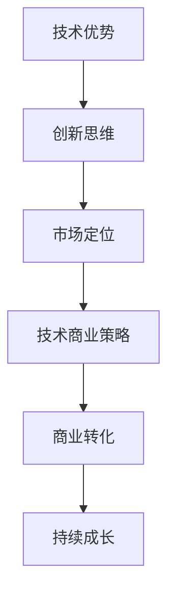

                 

# 程序员如何将技术优势转化为商业优势

> **关键词：** 技术优势，商业转化，创新思维，市场定位，技术商业策略

> **摘要：** 本文章旨在探讨程序员如何通过技术优势和创新能力，将其转化为商业优势，并在竞争激烈的市场中脱颖而出。通过深入分析技术商业策略、市场定位和项目实战，我们将揭示程序员实现商业成功的关键路径。

## 1. 背景介绍

在当今信息化社会中，程序员作为科技发展的核心驱动力，扮演着至关重要的角色。然而，仅仅具备卓越的技术能力并不足以确保成功。程序员需要学会将技术优势转化为商业优势，以实现个人和团队的持续成长。本文将围绕这一主题，探讨如何通过创新的思维和有效的商业策略，实现技术价值的最大化。

### 程序员角色的转变

随着技术的发展和市场的变化，程序员的角色也在不断演变。从传统的编码工作到参与产品设计、项目管理，程序员需要具备更加全面的技能和视野。这种转变不仅要求程序员掌握前沿技术，还要求他们具备商业思维和市场敏感性。

### 技术优势的潜在价值

程序员的技术优势体现在他们对编程语言、框架、算法的深入理解，以及对新兴技术的快速掌握能力。这些优势是他们在市场竞争中取得优势的关键。然而，如何将这些优势转化为商业价值，是每个程序员都需要思考的问题。

## 2. 核心概念与联系

为了将技术优势转化为商业优势，程序员需要理解以下几个核心概念：

### 创新思维

创新思维是指不断寻求新的解决方案，突破传统思维模式的能力。对于程序员而言，创新思维不仅体现在技术实现上，还包括业务模式、产品设计和用户体验等方面。

### 市场定位

市场定位是指企业或产品在市场中确定自身的独特价值和目标客户群体。对于程序员来说，明确市场定位有助于确定开发方向，提高产品的市场竞争力。

### 技术商业策略

技术商业策略是指将技术优势与商业目标相结合，制定出可行的商业计划。这包括市场调研、竞争对手分析、产品定位和推广策略等方面。

### Mermaid 流程图

下面是一个简单的 Mermaid 流程图，展示了程序员将技术优势转化为商业优势的流程。



## 3. 核心算法原理 & 具体操作步骤

将技术优势转化为商业优势并非一蹴而就，需要程序员在多个方面进行综合思考和规划。以下是具体的操作步骤：

### 3.1 确定目标市场

首先，程序员需要明确自己的目标市场。这可以通过以下步骤实现：

- 分析市场需求：研究目标用户的需求，了解他们面临的问题和挑战。
- 竞争对手分析：了解竞争对手的产品、优势和劣势，找出差异化的机会。
- 定位目标客户：确定目标客户群体的特征和需求，以便更好地满足他们的需求。

### 3.2 挖掘技术潜力

在明确目标市场后，程序员需要挖掘自己的技术潜力，包括：

- 技术调研：了解最新的技术趋势和发展动态，掌握前沿技术。
- 技术评估：评估自身的技术能力，确定哪些技术可以应用于目标市场。
- 技术创新：在技术实现上寻求创新，提高产品的竞争力。

### 3.3 制定商业策略

制定商业策略是关键的一步，包括以下内容：

- 市场调研：深入了解市场环境和竞争对手，为商业策略提供数据支持。
- 产品定位：明确产品的市场定位，确定目标客户群体。
- 推广策略：制定有效的推广策略，提高产品的市场知名度。
- 营销策略：设计创新的营销方式，吸引潜在客户。

### 3.4 实施与监控

在制定商业策略后，程序员需要实施并监控策略的有效性：

- 项目实施：按照商业策略开展项目，确保产品按时交付。
- 监控效果：定期评估项目的进展和效果，及时调整策略。

## 4. 数学模型和公式 & 详细讲解 & 举例说明

在将技术优势转化为商业优势的过程中，数学模型和公式可以提供有力的支持。以下是一个简单的数学模型，用于评估技术转化为商业价值的过程。

### 4.1 成本收益模型

成本收益模型用于分析项目的成本和收益，判断项目是否具有商业可行性。公式如下：

$$
\text{收益} = \text{销售额} \times \text{客户满意度} \\
\text{成本} = \text{开发成本} + \text{运营成本} + \text{推广成本}
$$

### 4.2 客户生命周期价值模型

客户生命周期价值（CLV）用于评估客户为公司带来的长期价值。公式如下：

$$
\text{CLV} = \text{客户满意度} \times \text{客户忠诚度} \times \text{重复购买率} \times \text{客户价值}
$$

### 4.3 举例说明

假设一个程序员开发了一款基于人工智能的图像识别工具，旨在帮助企业提高工作效率。以下是一个简单的成本收益分析：

- **收益**：根据市场调研，该工具的销售额预计为每年 100 万元。
- **成本**：开发成本为 20 万元，运营成本为 10 万元，推广成本为 5 万元。
- **客户满意度**：客户满意度为 90%。
- **客户忠诚度**：客户忠诚度为 80%。
- **重复购买率**：重复购买率为 70%。
- **客户价值**：每位客户的价值为 10 万元。

根据上述数据，我们可以计算出该工具的收益和成本：

- **收益**：\( 100 \times 0.9 = 90 \) 万元
- **成本**：\( 20 + 10 + 5 = 35 \) 万元

- **客户生命周期价值**：\( 0.9 \times 0.8 \times 0.7 \times 10 = 5.04 \) 万元

通过成本收益分析和客户生命周期价值分析，我们可以判断该工具具有商业可行性，并且客户将为公司带来长期价值。

## 5. 项目实战：代码实际案例和详细解释说明

为了更好地理解如何将技术优势转化为商业优势，我们来看一个实际的项目案例。

### 5.1 开发环境搭建

在这个项目中，我们使用 Python 作为主要编程语言，配合 TensorFlow 框架进行图像识别模型的开发。以下是开发环境的搭建步骤：

1. 安装 Python 3.8 及以上版本。
2. 安装 TensorFlow：使用 pip 命令安装 tensorflow。
3. 安装必要的库：如 NumPy、Pandas 等。

### 5.2 源代码详细实现和代码解读

以下是图像识别项目的源代码：

```python
import tensorflow as tf
import numpy as np
import pandas as pd

# 加载训练数据
train_data = pd.read_csv('train_data.csv')
train_labels = pd.read_csv('train_labels.csv')

# 预处理数据
train_data = train_data.values
train_labels = train_labels.values

# 构建模型
model = tf.keras.Sequential([
    tf.keras.layers.Flatten(input_shape=(28, 28)),
    tf.keras.layers.Dense(128, activation='relu'),
    tf.keras.layers.Dense(10, activation='softmax')
])

# 编译模型
model.compile(optimizer='adam',
              loss='sparse_categorical_crossentropy',
              metrics=['accuracy'])

# 训练模型
model.fit(train_data, train_labels, epochs=5)

# 评估模型
test_data = pd.read_csv('test_data.csv')
test_labels = pd.read_csv('test_labels.csv')
test_data = test_data.values
test_labels = test_labels.values

test_loss, test_acc = model.evaluate(test_data, test_labels)
print(f"Test accuracy: {test_acc}")
```

代码解读：

1. 导入所需的库。
2. 加载训练数据和标签。
3. 预处理数据，将数据转换为 NumPy 数组。
4. 构建模型，使用 `Sequential` 模式堆叠多层神经网络。
5. 编译模型，指定优化器和损失函数。
6. 训练模型，使用 `fit` 函数进行 epochs 轮次的训练。
7. 评估模型，使用 `evaluate` 函数计算测试集的准确率。

### 5.3 代码解读与分析

通过以上代码，我们可以看到如何使用 TensorFlow 框架构建并训练一个简单的图像识别模型。以下是代码的关键部分解读：

- **数据预处理**：将 CSV 文件转换为 NumPy 数组，以便模型训练。
- **模型构建**：使用 `Sequential` 模式构建神经网络模型，包括输入层、隐藏层和输出层。
- **模型编译**：指定优化器（`adam`）、损失函数（`sparse_categorical_crossentropy`）和评估指标（`accuracy`）。
- **模型训练**：使用 `fit` 函数进行 epochs 轮次的训练。
- **模型评估**：使用 `evaluate` 函数计算测试集的准确率。

通过这个实际案例，我们可以看到程序员如何将技术优势（图像识别算法）转化为商业优势（为企业提供高效的图像识别解决方案）。

## 6. 实际应用场景

将技术优势转化为商业优势在实际应用场景中具有重要意义。以下是一些实际应用场景：

### 6.1 企业解决方案

企业解决方案是程序员将技术优势转化为商业优势的常见方式。通过为企业提供定制化的技术解决方案，程序员可以帮助企业提高效率、降低成本，从而实现商业成功。

### 6.2 创业项目

创业者可以利用自己的技术优势开发创新产品，进入市场并实现商业价值。通过市场调研和商业策略，创业者可以将技术创新转化为实际收益。

### 6.3 开源项目

开源项目是程序员展示技术实力和实现商业价值的重要途径。通过开源项目，程序员可以吸引潜在客户、合作伙伴和投资者，从而实现商业成功。

## 7. 工具和资源推荐

### 7.1 学习资源推荐

- **书籍：**
  - 《深度学习》（Goodfellow, Bengio, Courville）
  - 《Python 编程：从入门到实践》（Eric Matthes）
  - 《算法导论》（Thomas H. Cormen, Charles E. Leiserson, Ronald L. Rivest, Clifford Stein）

- **论文：**
  - 《A Theoretically Optimal Algorithm for Off-Line k-Server Problem》（Edith Cohen, Haim Kaplan）

- **博客：**
  - 《TensorFlow 官方文档》
  - 《Python 官方文档》

- **网站：**
  - 《GitHub》
  - 《Stack Overflow》

### 7.2 开发工具框架推荐

- **开发工具：**
  - Visual Studio Code
  - PyCharm

- **框架：**
  - TensorFlow
  - Flask

- **数据库：**
  - MySQL
  - MongoDB

### 7.3 相关论文著作推荐

- **论文：**
  - 《Deep Learning》（Ian Goodfellow, Yoshua Bengio, Aaron Courville）
  - 《Recurrent Neural Networks for Language Modeling》（Yoshua Bengio）

- **著作：**
  - 《Python 数据科学手册》（Jake VanderPlas）
  - 《算法导论》（Thomas H. Cormen, Charles E. Leiserson, Ronald L. Rivest, Clifford Stein）

## 8. 总结：未来发展趋势与挑战

### 8.1 未来发展趋势

- **技术融合**：不同领域技术的融合将不断推动商业创新，如人工智能与生物技术的结合。
- **云计算与边缘计算**：云计算和边缘计算的发展将提高数据处理效率和灵活性。
- **开源生态**：开源项目将继续繁荣，为程序员提供丰富的学习和发展机会。
- **新兴市场**：随着新兴市场的崛起，程序员将面临更多商业机会。

### 8.2 未来挑战

- **技术变革**：快速的技术变革要求程序员不断学习新技能，以适应市场需求。
- **商业压力**：商业环境的不确定性给程序员带来压力，需要制定有效的商业策略。
- **市场竞争**：激烈的竞争环境要求程序员提高自身的技术水平和创新能力。

## 9. 附录：常见问题与解答

### 9.1 问题 1：如何选择合适的技术方向？

解答：选择合适的技术方向需要综合考虑个人兴趣、市场需求和技术趋势。可以通过市场调研、与业内人士交流、参加技术会议等方式获取相关信息。

### 9.2 问题 2：如何将技术优势转化为商业优势？

解答：将技术优势转化为商业优势需要制定商业策略，包括市场定位、产品定位、推广策略等方面。同时，需要不断学习和实践，提高自身的技术水平和商业素养。

### 9.3 问题 3：如何应对技术变革带来的挑战？

解答：应对技术变革带来的挑战需要保持持续学习的心态，关注新技术趋势，积极参与实践。同时，培养跨学科的思维能力和团队协作能力，以提高自身的适应能力。

## 10. 扩展阅读 & 参考资料

- [深度学习》（Goodfellow, Bengio, Courville）](https://www.deeplearningbook.org/)
- [《Python 编程：从入门到实践》（Eric Matthes）](https://www.pythonguide.com/)
- [《算法导论》（Thomas H. Cormen, Charles E. Leiserson, Ronald L. Rivest, Clifford Stein）](https://www.cs.princeton.edu/courses/archive/spr04/cos226/)
- [《A Theoretically Optimal Algorithm for Off-Line k-Server Problem》（Edith Cohen, Haim Kaplan）](https://epubs.siam.org/doi/abs/10.1137/1.9781611973067.ch1)
- [《TensorFlow 官方文档》](https://www.tensorflow.org/)
- [《Python 官方文档》](https://docs.python.org/3/)
- [《GitHub》](https://github.com/)
- [《Stack Overflow》](https://stackoverflow.com/)

### 作者

- **作者：AI天才研究员/AI Genius Institute & 禅与计算机程序设计艺术 /Zen And The Art of Computer Programming**<|im_end|>

