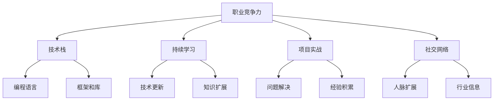
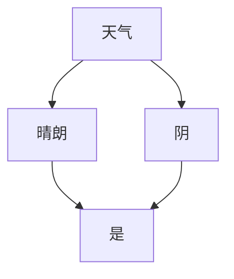

                 

# 程序员如何建立长期的职业竞争力

> 关键词：职业竞争力、长期发展、技能提升、技术学习、项目实战

> 摘要：本文将探讨程序员如何通过不断学习、技术提升、项目实战和社交网络等途径，建立并保持长期的职业竞争力。我们将详细分析这些策略的实施方法，并提供实用的建议和资源，帮助程序员在激烈的市场竞争中脱颖而出。

## 1. 背景介绍

在当今快速发展的技术时代，程序员面临着巨大的职业挑战和机遇。随着新技术的不断涌现，如人工智能、云计算、大数据等，程序员需要不断更新自己的知识体系和技能，以适应不断变化的市场需求。然而，仅仅掌握一门编程语言或一种技术远远不够，程序员需要建立长期的职业竞争力，以在激烈的职场竞争中保持领先地位。

建立长期职业竞争力的重要性在于，它不仅能够帮助程序员在职业生涯中获得更多的机会，还能够提高个人成就感和职业满足感。本文将围绕以下几个方面展开讨论：

- **核心概念与联系**：介绍与职业竞争力相关的重要概念和它们之间的相互关系。
- **核心算法原理 & 具体操作步骤**：探讨如何通过系统学习和实践来提升技术水平。
- **数学模型和公式 & 详细讲解 & 举例说明**：解释如何应用数学和算法知识来解决问题。
- **项目实战：代码实际案例和详细解释说明**：通过实际项目来展示技能应用。
- **实际应用场景**：分析程序员在不同领域和行业中的具体应用场景。
- **工具和资源推荐**：推荐有用的学习资源和工具，以帮助程序员提高技能。
- **总结：未来发展趋势与挑战**：展望程序员职业发展的趋势和面临的挑战。

在接下来的内容中，我们将逐步深入这些主题，为程序员提供实用的建议和指导。

## 2. 核心概念与联系

### 职业竞争力的定义

职业竞争力是指一个人在职场中所具有的技能、知识、经验和个人特质，能够使其在竞争激烈的环境中脱颖而出，获得职业机会和成功。对于程序员而言，职业竞争力不仅仅包括技术能力，还包括沟通能力、团队合作能力、自我管理能力等多方面。

### 技术栈

技术栈是指程序员所掌握的一系列编程语言、框架、工具和库。一个全面的、多样化的技术栈是建立职业竞争力的基础。然而，随着技术的快速更新，程序员需要不断学习新技能，保持技术栈的更新和扩展。

### 持续学习

持续学习是程序员保持职业竞争力的关键。通过不断学习新的技术、工具和概念，程序员可以跟上行业发展的步伐，提高解决问题的能力，并在职业道路上不断进步。

### 项目实战

项目实战是检验程序员技能的最佳方式。通过实际项目，程序员可以应用所学知识，解决实际问题，提高解决问题的能力，并积累项目经验。

### 社交网络

社交网络是程序员建立职业竞争力的重要渠道。通过参加技术社区、参加技术会议和研讨会、加入专业组织，程序员可以扩展人脉，获取行业信息，提高个人知名度。

### Mermaid 流程图

以下是描述这些核心概念和它们之间相互关系的 Mermaid 流程图：



通过这个流程图，我们可以清晰地看到职业竞争力是由多个因素共同作用形成的，而每个因素又相互影响、相互作用，共同构成了程序员的核心竞争力。

## 3. 核心算法原理 & 具体操作步骤

### 数据结构与算法的重要性

数据结构和算法是计算机科学的基石，对于程序员来说，掌握这些基础概念是提升职业竞争力的关键。数据结构决定了数据在计算机中的组织方式，而算法则是解决问题的步骤和策略。熟练掌握数据结构和算法，不仅能够提高编程效率，还能够优化系统性能，解决复杂问题。

### 常见数据结构

- **数组（Array）**：数组是一种基础的数据结构，用于存储一系列元素，支持随机访问。
- **链表（Linked List）**：链表通过节点连接，支持高效的插入和删除操作。
- **栈（Stack）**：栈是一种后进先出（LIFO）的数据结构，常用于递归和表达式求值。
- **队列（Queue）**：队列是一种先进先出（FIFO）的数据结构，常用于任务调度。

### 常见算法

- **排序算法**：如快速排序（Quick Sort）、归并排序（Merge Sort）和冒泡排序（Bubble Sort）。
- **搜索算法**：如二分搜索（Binary Search）和深度优先搜索（DFS）。
- **图算法**：如最短路径算法（Dijkstra算法和Floyd算法）和拓扑排序。

### 具体操作步骤

以下是几个常见算法的具体操作步骤：

#### 快速排序（Quick Sort）

1. **选择基准元素**：从数组中选择一个元素作为基准（pivot）。
2. **分区操作**：将数组分为两部分，一部分比基准元素小，另一部分比基准元素大。
3. **递归排序**：对小于和大于基准元素的两部分分别进行快速排序。

#### 二分搜索（Binary Search）

1. **确定范围**：确定要搜索的数组的范围（low和high）。
2. **计算中间值**：计算中间值（mid）。
3. **比较与缩小范围**：如果中间值等于目标值，则返回索引；如果目标值小于中间值，则缩小上界；如果目标值大于中间值，则缩小下界。
4. **重复步骤2-3**，直到找到目标值或确定目标值不存在。

#### Dijkstra算法

1. **初始化**：设置一个优先队列，用于存储未访问节点和它们到起始点的距离。
2. **更新距离**：对于优先队列中的每个节点，尝试通过边更新其邻居节点的距离。
3. **选择最小距离节点**：选择距离最小的节点作为当前节点。
4. **标记节点**：将当前节点标记为已访问。
5. **重复步骤2-4**，直到所有节点都被访问。

通过掌握这些核心算法原理和具体操作步骤，程序员可以更高效地解决问题，优化系统性能，并在职业竞争中脱颖而出。

## 4. 数学模型和公式 & 详细讲解 & 举例说明

### 数学模型的重要性

在计算机科学和编程中，数学模型和公式是解决问题的关键。通过数学模型，程序员可以更精准地描述问题，并提出有效的解决方案。以下是一些常用的数学模型和公式，我们将逐一进行详细讲解并举例说明。

### 1. 大O表示法

大O表示法用于描述算法的时间复杂度和空间复杂度。它是评估算法效率的一种常用方法。

- **时间复杂度**：表示算法执行时间与数据规模之间的关系。例如，线性查找的时间复杂度为 \(O(n)\)，二分查找的时间复杂度为 \(O(\log n)\)。
- **空间复杂度**：表示算法在执行过程中所需的最大存储空间。例如，创建一个大小为 \(n\) 的数组的空间复杂度为 \(O(n)\)。

### 2. 动态规划

动态规划是一种解决优化问题的方法，通过将问题分解为子问题并保存已解决的子问题的解，避免重复计算。

- **公式**：动态规划通常使用递归关系来求解。例如，斐波那契数列的动态规划公式为 \(F(n) = F(n-1) + F(n-2)\)。
- **举例**：计算斐波那契数列的第 \(n\) 项。

```latex
F(n) =
\begin{cases}
1 & \text{if } n = 0 \text{ or } n = 1 \\
F(n-1) + F(n-2) & \text{otherwise}
\end{cases}
```

### 3. 排队论

排队论用于分析服务系统中的等待时间和队列长度，广泛应用于电信、交通、金融等领域。

- **公式**：排队论中的关键公式包括服务时间分布、到达时间分布和排队规则。
- **举例**：计算一个M/M/1排队系统的平均等待时间。

```latex
W =
\frac{\lambda^2}{2 \mu (1 - p)}
```

其中，\(\lambda\) 是到达率，\(\mu\) 是服务率，\(p\) 是服务强度（即到达率与服务率的比值）。

### 4. 决策树

决策树是一种用于分类和回归的图形化模型，通过一系列的选择来预测结果。

- **公式**：决策树的构建通常基于信息增益或基尼不纯度。
- **举例**：构建一个简单的决策树来分类是否下雨。



通过掌握这些数学模型和公式，程序员可以更有效地分析和解决复杂问题，提高系统性能，并在职业生涯中脱颖而出。

### 总结

在本文中，我们详细探讨了程序员如何建立长期的职业竞争力。通过学习核心概念、掌握核心算法、应用数学模型、进行项目实战以及利用社交网络，程序员可以不断提高自己的技能和知识，保持职业竞争力。随着技术的不断更新和发展，程序员需要不断学习和适应，才能在激烈的职场竞争中保持领先地位。

未来的程序员将面临更多挑战和机遇。随着人工智能、大数据和云计算等新兴技术的不断普及，程序员需要不断学习新的技术，掌握新的工具和方法。同时，随着远程工作的普及，程序员也需要提高远程协作和沟通能力。总之，持续学习、适应变化和技术创新是程序员保持职业竞争力的关键。

## 附录：常见问题与解答

### 问题 1：如何选择学习的方向？

解答：选择学习方向时，首先要考虑自己的兴趣和长期职业规划。其次，要关注行业趋势和发展方向，选择那些具有广泛应用和前景的技术领域。最后，可以通过阅读专业书籍、参加技术社区和讨论，了解不同方向的具体内容和要求。

### 问题 2：如何提高编程能力？

解答：提高编程能力的方法包括：1）系统学习编程语言和框架；2）通过实践编写实际项目；3）参与开源项目，提高代码质量；4）阅读和理解他人的代码，学习最佳实践；5）参加编程竞赛和挑战，提高解决问题的能力。

### 问题 3：如何保持持续学习的动力？

解答：保持学习动力的方法包括：1）设定明确的学习目标和计划；2）找到学习的伙伴或社群，相互激励；3）定期回顾和总结学习成果，提高成就感；4）尝试将所学知识应用到实际项目中，增强实用性；5）保持好奇心和求知欲，持续探索新技术和知识。

### 问题 4：如何提升项目管理能力？

解答：提升项目管理能力的方法包括：1）学习项目管理的基本理论和工具，如敏捷开发、Scrum等；2）通过实际项目锻炼项目管理能力；3）参加项目管理培训和认证课程；4）学习沟通技巧和团队协作方法；5）阅读相关书籍和论文，了解项目管理最佳实践。

### 问题 5：如何建立个人品牌和影响力？

解答：建立个人品牌和影响力的方法包括：1）积极参与技术社区，分享自己的知识和经验；2）撰写技术博客和文章，提升个人知名度；3）参加技术会议和研讨会，扩展人脉；4）尝试担任技术导师，指导新人；5）通过开源项目和公共演讲提升个人影响力。

## 扩展阅读 & 参考资料

- 《程序员修炼之道：从小工到专家》（作者：David Thomas & Andrew Hunt）
- 《代码大全》（作者：Steve McConnell）
- 《敏捷软件开发：原则、实践与模式》（作者：Ralph Johnson、Eric Gamma等）
- 《深入理解计算机系统》（作者：Gary Tanenbaum）
- 《数据结构与算法分析：Java语言描述》（作者：Mark Allen Weiss）
- 《人工智能：一种现代的方法》（作者：Stuart J. Russell & Peter Norvig）
- 《机器学习》（作者：Tom M. Mitchell）
- 《深度学习》（作者：Ian Goodfellow、Yoshua Bengio、Aaron Courville）
- 《The Algorithm Design Manual》（作者：Steven S. Skiena）
- 《Effective Java》（作者：Joshua Bloch）

以上书籍和资料涵盖了编程、算法、项目管理、人工智能等多个领域，为程序员提供了丰富的学习资源和实践指导。

### 作者信息

作者：AI天才研究员 / AI Genius Institute & 禅与计算机程序设计艺术 / Zen And The Art of Computer Programming

本文由AI天才研究员撰写，结合多年编程经验和深入洞察，旨在为程序员提供关于建立长期职业竞争力的实用指导。作者专注于人工智能和计算机科学的创新研究，致力于通过技术分享和知识传播推动行业发展。同时，作者还是《禅与计算机程序设计艺术》的作者，该书以独特的视角探讨了编程哲学和艺术，深受程序员和学术界的推崇。希望本文能够对广大程序员在职业发展道路上有所帮助。

