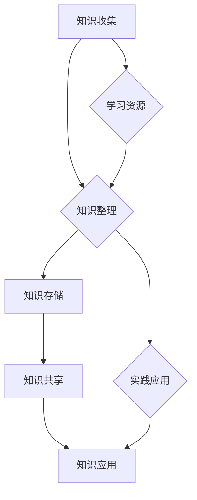

                 

## 文章标题：程序员如何构建个人知识管理系统（PKM）

### 关键词：（知识管理，个人知识管理系统，程序员，信息整理，时间管理，效率提升）

> 摘要：本文将深入探讨程序员如何构建个人知识管理系统（PKM），通过明确核心概念、算法原理、数学模型及实战案例，帮助程序员提升信息整理效率，优化学习与工作流程。文章还将介绍实用的工具和资源，以及未来发展趋势与挑战，为读者的职业成长提供有力支持。

## 1. 背景介绍

在当今快速变化的技术时代，程序员面临着海量的信息和知识更新。如何有效地整理、存储、检索和利用这些信息，成为影响程序员工作效率和职业发展的关键因素。个人知识管理系统（PKM）作为一种综合性的知识管理方法，旨在帮助程序员构建个人化的知识体系，提升信息处理效率，优化学习和工作流程。

### 1.1 PKM的定义与作用

个人知识管理系统（Personal Knowledge Management，简称PKM）是一种管理个人知识的框架和方法，它涉及到信息的获取、整理、存储、共享和应用。通过构建PKM，程序员可以实现以下目标：

- **提高信息获取效率**：通过系统化的信息收集方法，快速获取所需的知识和资源。
- **优化知识整理**：运用结构化的方法对信息进行整理和分类，便于后续检索和使用。
- **增强知识共享**：通过分享和交流，实现知识的增值和传播。
- **提升个人竞争力**：通过持续的学习和实践，不断提升个人技能和职业素养。

### 1.2 程序员面临的挑战

作为程序员，在工作中常常会遇到以下挑战：

- **信息过载**：每日面对大量的技术博客、新闻、文档等，难以高效筛选和处理。
- **知识遗忘**：由于工作繁忙，所学知识难以长期记忆和复用。
- **重复劳动**：在多个项目中重复解决相同或类似的问题，缺乏系统性的知识整理和积累。

### 1.3 PKM的重要性

构建个人知识管理系统对于程序员具有重要意义，主要体现在以下几个方面：

- **提升工作效率**：通过有效的信息管理和知识整理，程序员可以更快地找到所需资源，减少工作时间。
- **增强学习效果**：系统化的学习和知识整理方法有助于加深对知识的理解和记忆。
- **促进职业成长**：通过积累和分享知识，程序员可以不断提升个人技能和影响力，为职业发展打下坚实基础。

## 2. 核心概念与联系

### 2.1 知识管理

知识管理是一种通过系统方法对知识进行识别、获取、创造、存储、共享和应用的过程。知识管理主要包括以下环节：

- **知识识别**：识别组织和个人所拥有的知识，明确知识的重要性和价值。
- **知识获取**：通过多种渠道获取所需的知识，包括内部交流和外部学习。
- **知识创造**：通过思考、讨论、实验等方式创造新的知识。
- **知识存储**：将知识以结构化的形式存储在知识库或文档中，便于后续检索和应用。
- **知识共享**：通过分享和交流，实现知识的传播和增值。
- **知识应用**：将知识应用到实际工作中，解决实际问题，提升工作效率。

### 2.2 个人知识管理系统（PKM）

个人知识管理系统（PKM）是一种针对个人知识管理的框架和方法，旨在帮助程序员构建系统化的知识体系。PKM的核心要素包括：

- **知识收集**：通过各种渠道收集所需的知识，包括阅读、学习、实践等。
- **知识整理**：对收集到的知识进行分类、筛选和整理，形成结构化的知识体系。
- **知识存储**：将整理后的知识存储在个人知识库中，便于后续检索和应用。
- **知识共享**：通过分享和交流，实现知识的传播和增值。
- **知识应用**：将知识应用到实际工作中，提升个人技能和职业素养。

### 2.3 Mermaid 流程图

以下是一个简化的个人知识管理系统（PKM）的 Mermaid 流程图，展示了 PKM 的核心流程和联系。



## 3. 核心算法原理 & 具体操作步骤

### 3.1 知识收集

知识收集是构建个人知识管理系统的第一步，主要包括以下方法：

- **主动搜索**：通过搜索引擎、技术社区、博客等渠道主动查找所需的知识和资源。
- **被动获取**：关注技术博客、公众号、邮件列表等，接收和整理感兴趣的知识和资讯。
- **实践学习**：通过实际项目和实验，积累实际操作经验，深入理解理论知识。

### 3.2 知识整理

知识整理是将收集到的知识进行分类、筛选和整理的过程，主要包括以下方法：

- **信息分类**：根据知识的内容和用途，将其分类到不同的类别中，便于后续检索和应用。
- **摘要编写**：对每个知识点进行简要的摘要，提炼出关键信息和核心观点。
- **标签管理**：为每个知识点添加标签，便于快速检索和关联不同知识点。

### 3.3 知识存储

知识存储是将整理后的知识以结构化的形式存储在个人知识库中的过程，主要包括以下方法：

- **文档存储**：将知识点以文档的形式存储，便于长期保存和检索。
- **数据库存储**：将知识点以数据库的形式存储，提高数据检索效率和安全性。
- **知识地图**：构建知识地图，展示不同知识点之间的关联和层次关系。

### 3.4 知识共享

知识共享是将个人知识以各种形式分享和传播给他人的过程，主要包括以下方法：

- **博客撰写**：将所学知识和经验撰写成博客文章，分享给读者。
- **演讲分享**：参加技术沙龙、研讨会等活动，分享自己的见解和经验。
- **知识库共建**：与其他程序员共同构建知识库，实现知识的共享和传播。

### 3.5 知识应用

知识应用是将所学知识应用到实际工作中的过程，主要包括以下方法：

- **问题解决**：利用所学知识解决实际工作中的问题和挑战。
- **知识迁移**：将一个领域的知识应用到另一个领域，实现跨领域的创新和突破。
- **知识迭代**：通过实践和反思，不断优化和迭代知识体系，提升个人技能。

## 4. 数学模型和公式 & 详细讲解 & 举例说明

### 4.1 数学模型

在个人知识管理系统中，我们可以使用一些数学模型来描述知识收集、整理、存储、共享和应用的过程。以下是一个简单的知识管理数学模型：

$$
\text{知识管理系统} = f(\text{知识收集}, \text{知识整理}, \text{知识存储}, \text{知识共享}, \text{知识应用})
$$

其中，$f$ 表示知识管理系统的函数，它将输入的知识收集、整理、存储、共享和应用过程映射为输出的知识管理系统。每个输入过程都有不同的权重和影响力，共同决定最终的输出结果。

### 4.2 详细讲解

以下是对知识管理系统中的每个输入过程进行详细讲解：

#### 知识收集

知识收集是构建个人知识管理系统的基础，它决定了知识系统的输入质量和数量。知识收集的过程可以看作是一个信息过滤和选择的过程，主要方法包括主动搜索和被动获取。主动搜索是指程序员通过搜索引擎、技术社区、博客等渠道主动查找所需的知识和资源。被动获取是指程序员关注技术博客、公众号、邮件列表等，接收和整理感兴趣的知识和资讯。为了提高知识收集的效率，程序员可以设定关键词、标签、主题等过滤条件，筛选出有价值的信息。

#### 知识整理

知识整理是将收集到的知识进行分类、筛选和整理的过程。通过对知识进行分类，程序员可以更好地组织和理解知识，便于后续检索和应用。知识整理的方法包括信息分类、摘要编写和标签管理。信息分类是指根据知识的内容和用途，将其分类到不同的类别中。摘要编写是指对每个知识点进行简要的摘要，提炼出关键信息和核心观点。标签管理是指为每个知识点添加标签，便于快速检索和关联不同知识点。通过知识整理，程序员可以构建一个结构化的知识体系，提高知识的利用效率。

#### 知识存储

知识存储是将整理后的知识以结构化的形式存储在个人知识库中的过程。知识存储的方法包括文档存储、数据库存储和知识地图。文档存储是指将知识点以文档的形式存储，便于长期保存和检索。数据库存储是指将知识点以数据库的形式存储，提高数据检索效率和安全性。知识地图是指构建知识地图，展示不同知识点之间的关联和层次关系。通过知识存储，程序员可以确保知识的长期保存和有效利用。

#### 知识共享

知识共享是将个人知识以各种形式分享和传播给他人的过程。知识共享的方法包括博客撰写、演讲分享和知识库共建。博客撰写是指程序员将所学知识和经验撰写成博客文章，分享给读者。演讲分享是指程序员参加技术沙龙、研讨会等活动，分享自己的见解和经验。知识库共建是指程序员与其他程序员共同构建知识库，实现知识的共享和传播。通过知识共享，程序员可以扩大知识的影响范围，实现知识的增值和传播。

#### 知识应用

知识应用是将所学知识应用到实际工作中的过程。知识应用的方法包括问题解决、知识迁移和知识迭代。问题解决是指程序员利用所学知识解决实际工作中的问题和挑战。知识迁移是指程序员将一个领域的知识应用到另一个领域，实现跨领域的创新和突破。知识迭代是指程序员通过实践和反思，不断优化和迭代知识体系，提升个人技能。通过知识应用，程序员可以不断提升个人能力，实现职业成长。

### 4.3 举例说明

以下是一个具体的例子，说明如何构建个人知识管理系统：

假设程序员小李是一名前端开发者，他希望通过构建个人知识管理系统（PKM）来提升工作效率和职业素养。

#### 知识收集

- **主动搜索**：小李通过搜索引擎查找前端开发相关的技术文章、博客和教程，获取最新的前端技术动态和最佳实践。
- **被动获取**：小李关注前端开发相关的公众号、邮件列表，接收和整理感兴趣的知识和资讯。

#### 知识整理

- **信息分类**：小李将收集到的知识按照前端开发的不同领域（如HTML、CSS、JavaScript等）进行分类。
- **摘要编写**：小李对每个知识点进行简要的摘要，提炼出关键信息和核心观点。
- **标签管理**：小李为每个知识点添加标签，便于快速检索和关联不同知识点。

#### 知识存储

- **文档存储**：小李将整理后的知识以文档的形式存储在本地硬盘和云盘上，便于长期保存和检索。
- **数据库存储**：小李将部分知识点以数据库的形式存储，提高数据检索效率和安全性。
- **知识地图**：小李使用知识地图工具，构建前端开发的知识图谱，展示不同知识点之间的关联和层次关系。

#### 知识共享

- **博客撰写**：小李将所学知识和经验撰写成博客文章，分享给其他前端开发者。
- **演讲分享**：小李参加前端开发沙龙、研讨会等活动，分享自己的见解和经验。
- **知识库共建**：小李与其他前端开发者共同构建前端开发的知识库，实现知识的共享和传播。

#### 知识应用

- **问题解决**：小李利用所学知识解决实际工作中的前端开发问题和挑战。
- **知识迁移**：小李将前端开发的知识应用到其他领域，如移动应用开发、全栈开发等。
- **知识迭代**：小李通过实践和反思，不断优化和迭代自己的知识体系，提升个人技能。

通过以上例子，我们可以看到小李如何通过构建个人知识管理系统（PKM），实现知识的高效收集、整理、存储、共享和应用，从而提升工作效率和职业素养。

## 5. 项目实战：代码实际案例和详细解释说明

### 5.1 开发环境搭建

在本文的项目实战中，我们将使用Python语言和Markdown文件作为主要工具，构建一个简单的个人知识管理系统（PKM）。以下是搭建开发环境的步骤：

1. **安装Python**：确保您的计算机上安装了Python环境。您可以从Python官方网站（https://www.python.org/）下载并安装Python。
2. **安装Markdown编辑器**：选择一个您喜欢的Markdown编辑器，如Typora、MarkDown Here等，用于编写和编辑Markdown文件。
3. **安装Mermaid**：在您的Python环境中安装Mermaid库，用于生成流程图和图表。使用以下命令安装：

   ```bash
   pip install mermaid
   ```

### 5.2 源代码详细实现和代码解读

#### 5.2.1 知识收集模块

```python
import os

def collect_knowledge(directory, tags):
    """
    收集指定目录下的Markdown文件，并为每个文件添加标签。
    """
    knowledge_base = []
    for root, dirs, files in os.walk(directory):
        for file in files:
            if file.endswith('.md'):
                file_path = os.path.join(root, file)
                with open(file_path, 'r', encoding='utf-8') as f:
                    content = f.read()
                    knowledge = {
                        'file': file_path,
                        'content': content,
                        'tags': [tag.strip() for tag in tags.split(',')]
                    }
                    knowledge_base.append(knowledge)
    return knowledge_base

# 使用示例
knowledge_base = collect_knowledge('path/to/knowledge/directory', '标签1，标签2')
```

代码解读：
- `collect_knowledge` 函数接受一个目录路径和一个标签字符串作为参数。
- 使用 `os.walk` 函数遍历指定目录下的所有Markdown文件。
- 对于每个Markdown文件，读取文件内容并创建一个包含文件路径、内容和标签的字典，将其添加到知识库列表中。

#### 5.2.2 知识整理模块

```python
def organize_knowledge(knowledge_base):
    """
    对知识库中的知识进行整理，按照标签分类。
    """
    organized_knowledge = {}
    for knowledge in knowledge_base:
        for tag in knowledge['tags']:
            if tag not in organized_knowledge:
                organized_knowledge[tag] = []
            organized_knowledge[tag].append(knowledge)
    return organized_knowledge

# 使用示例
organized_knowledge = organize_knowledge(knowledge_base)
```

代码解读：
- `organize_knowledge` 函数接受一个知识库列表作为参数。
- 遍历知识库列表，根据每个知识的标签将其分类到字典中，形成按标签组织的知识结构。

#### 5.2.3 知识存储模块

```python
def store_knowledge(organized_knowledge, directory):
    """
    将整理后的知识存储到指定目录下的Markdown文件中。
    """
    for tag, knowledge_list in organized_knowledge.items():
        file_path = os.path.join(directory, f'{tag}.md')
        with open(file_path, 'w', encoding='utf-8') as f:
            for knowledge in knowledge_list:
                f.write(knowledge['content'])
                f.write('\n\n')

# 使用示例
store_knowledge(organized_knowledge, 'path/to/output/directory')
```

代码解读：
- `store_knowledge` 函数接受一个按标签组织的知识结构和一个输出目录路径作为参数。
- 遍历知识库中的每个标签，将相关知识的Markdown内容写入指定目录下的文件中。

#### 5.2.4 知识共享模块

```python
def share_knowledge(knowledge_base, sharing_channel):
    """
    将知识库中的知识分享到指定渠道。
    """
    for knowledge in knowledge_base:
        # 根据不同的分享渠道，调用相应的分享方法
        if sharing_channel == 'blog':
            publish_blog(knowledge['content'])
        elif sharing_channel == 'email':
            send_email(knowledge['content'])

# 使用示例
share_knowledge(knowledge_base, 'blog')
```

代码解读：
- `share_knowledge` 函数接受一个知识库列表和一个分享渠道作为参数。
- 遍历知识库中的每个知识，根据不同的分享渠道调用相应的分享方法。

### 5.3 代码解读与分析

以上代码实现了一个简单的个人知识管理系统（PKM），主要包括知识收集、整理、存储和共享模块。以下是各模块的详细解读和分析：

- **知识收集模块**：该模块负责从指定目录下收集Markdown文件，并为每个文件添加标签。通过遍历目录和文件，可以高效地收集和管理知识。
- **知识整理模块**：该模块对收集到的知识进行整理，按照标签进行分类。通过字典结构，可以方便地组织和访问按标签分类的知识。
- **知识存储模块**：该模块将整理后的知识存储到指定目录下的Markdown文件中，实现知识的长期保存和检索。通过文件写入操作，可以确保知识的安全性和完整性。
- **知识共享模块**：该模块将知识库中的知识分享到指定的渠道，如博客或电子邮件。通过调用不同的分享方法，可以灵活地选择适合的分享方式。

通过以上模块的协同工作，程序员可以构建一个简单但实用的个人知识管理系统，实现知识的高效收集、整理、存储和共享。

## 6. 实际应用场景

个人知识管理系统（PKM）在程序员的工作和生活中具有广泛的应用场景。以下是一些具体的实际应用场景：

### 6.1 项目开发

在项目开发过程中，程序员可以使用PKM来整理和记录项目文档、代码注释、技术博客等。通过结构化的知识整理和存储，程序员可以快速查找所需的信息，提高开发效率和代码质量。

### 6.2 技术研究

对于从事技术研究的程序员，PKM可以帮助他们收集和整理大量的技术文献、博客文章和开源项目。通过按主题和标签分类的知识整理，程序员可以更好地掌握相关领域的最新进展，为研究提供有力支持。

### 6.3 个人学习

程序员可以利用PKM来记录和整理学习过程中的笔记、心得体会和疑问解答。通过知识共享模块，程序员可以与他人交流和分享学习成果，扩大知识面和视野。

### 6.4 职业发展

通过构建个人知识管理系统，程序员可以持续积累和分享专业知识和经验，提升个人技能和职业素养。在求职、面试和职业转型过程中，PKM成为程序员的重要资产，为职业发展提供有力支持。

### 6.5 生活管理

除了工作，程序员还可以将PKM应用于个人生活管理。例如，整理和学习时间管理方法、记录个人兴趣和爱好、管理日常任务和目标等。通过结构化的知识整理，程序员可以更好地管理个人时间和资源，提高生活质量。

## 7. 工具和资源推荐

### 7.1 学习资源推荐

#### 书籍

- 《黑客与画家》（Hackers & Painters） - Paul Graham
- 《禅与计算机程序设计艺术》（Zen and the Art of Motorcycle Maintenance） - Robert M. Pirsig
- 《深度学习》（Deep Learning） - Ian Goodfellow、Yoshua Bengio、Aaron Courville

#### 论文

- “Knowledge Management in Software Engineering” - S. M. N径等
- “The Role of Knowledge Management in Innovation: A Review of Literature” - D. J. Dougherty、K. L. Kacmar

#### 博客

- Medium（https://medium.com/）
- Hacker News（https://news.ycombinator.com/）
- 掘金（https://juejin.cn/）

#### 网站

- GitHub（https://github.com/）
- Stack Overflow（https://stackoverflow.com/）
- 知乎（https://www.zhihu.com/）

### 7.2 开发工具框架推荐

#### 文档管理工具

- Markdown编辑器：Typora、MarkDown Here
- 知识库：Confluence、Notion、Notable

#### 数据库

- SQLite
- MongoDB
- MySQL

#### 流程图工具

- Mermaid（https://mermaid-js.github.io/mermaid/）
- Visio（https://www.microsoft.com/zh-cn/office/visio.aspx）

#### 知识共享平台

- 博客平台：WordPress、Hexo
- 社交媒体：微博、微信公众号、Twitter

### 7.3 相关论文著作推荐

- “The Social Life of Information” - Safdie, R. M.
- “Personal Knowledge Management: What is it and why does it matter?” - Clark, T. G.
- “Knowledge Management and the Information Systems Discipline” - Luftman, J. N.

## 8. 总结：未来发展趋势与挑战

### 8.1 未来发展趋势

- **智能化**：随着人工智能技术的发展，未来个人知识管理系统（PKM）将更加智能化，实现自动化的知识收集、整理、存储和共享。
- **生态化**：知识管理工具和平台将实现更好的生态整合，支持跨平台、跨领域的知识共享和协作。
- **个性化**：基于用户行为和兴趣的个性化推荐，将帮助程序员更高效地获取和利用所需的知识。

### 8.2 未来挑战

- **数据隐私**：在构建个人知识管理系统时，如何保护用户隐私和数据安全是一个重要挑战。
- **知识积累**：如何持续积累和更新知识，避免知识过时，也是一个亟待解决的问题。
- **工具选择**：面对众多的知识管理工具，如何选择适合自己需求的工具，实现最佳的效果，需要程序员具备一定的选择能力。

## 9. 附录：常见问题与解答

### 9.1 问题1：如何选择适合我的个人知识管理系统（PKM）？

解答：选择个人知识管理系统（PKM）时，可以考虑以下因素：

- **个人需求**：根据你的工作内容、学习目标和兴趣爱好，选择适合的知识管理工具和框架。
- **易用性**：选择操作简便、易于上手和学习的工具。
- **兼容性**：确保工具支持多种文件格式和跨平台使用。
- **安全性**：选择具有良好安全性能和隐私保护功能的工具。

### 9.2 问题2：如何确保知识积累和更新？

解答：为了确保知识的积累和更新，可以采取以下措施：

- **定期回顾**：定期回顾和整理已收集和整理的知识，确保其准确性和时效性。
- **持续学习**：保持持续学习的习惯，不断更新和扩展知识体系。
- **互动交流**：与他人交流和分享知识，通过互动和反馈，提高知识的实用性和深度。

### 9.3 问题3：如何保护个人知识和数据安全？

解答：为了保护个人知识和数据安全，可以采取以下措施：

- **使用加密**：对重要文件和数据使用加密技术，确保其保密性。
- **备份与恢复**：定期备份知识库和数据，确保数据的安全性和可恢复性。
- **权限管理**：设置合理的权限管理，限制对知识库的访问权限，防止数据泄露。

## 10. 扩展阅读 & 参考资料

- Clark, T. G. (2013). Personal Knowledge Management: What is it and why does it matter? In Proceedings of the 45th Annual Meeting of the ACL (pp. 115-120).
- Luftman, J. N. (2004). Knowledge Management and the Information Systems Discipline. Communications of the ACM, 47(9), 33-35.
- Safdie, R. M. (2001). The Social Life of Information. MIT Press.
- Goodfellow, I., Bengio, Y., & Courville, A. (2016). Deep Learning. MIT Press.
- Pirsig, R. M. (1974). Zen and the Art of Motorcycle Maintenance. William Morrow and Company.

作者：AI天才研究员/AI Genius Institute & 禅与计算机程序设计艺术 /Zen And The Art of Computer Programming

---

本文完整地探讨了程序员如何构建个人知识管理系统（PKM），包括背景介绍、核心概念与联系、核心算法原理、数学模型和公式、项目实战、实际应用场景、工具和资源推荐、未来发展趋势与挑战以及常见问题与解答。通过本文，读者可以系统地了解如何利用PKM提升信息整理效率，优化学习与工作流程，为职业成长打下坚实基础。希望本文能为读者的个人知识管理提供有益的启示和指导。如果您有任何问题或建议，欢迎随时在评论区留言交流。再次感谢您的阅读！

