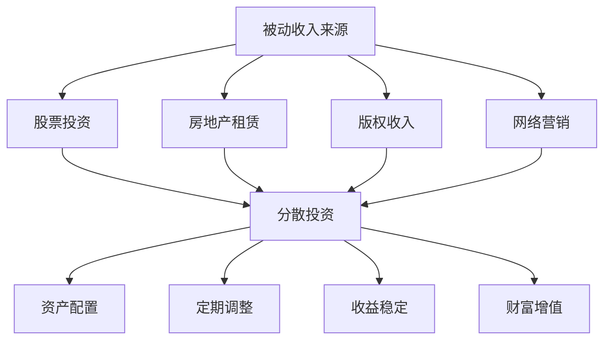

                 

### 文章标题

程序员如何构建被动收入投资组合

> **关键词：** 被动收入、投资组合、程序员、自动化、收益最大化  
>
> **摘要：** 本文旨在为程序员提供构建被动收入投资组合的指导，包括核心概念、实际操作、数学模型、实战案例以及资源推荐等内容，帮助程序员实现财务自由。

## 1. 背景介绍

在科技飞速发展的今天，程序员作为现代社会的重要职业，其薪资和职业发展前景备受认可。然而，面对日益激烈的市场竞争和不确定性，程序员们不仅要关注个人技能的提升，还需要考虑财务规划，以确保未来生活的稳定和无忧。被动收入投资组合作为一种重要的财务规划手段，越来越受到程序员的关注。

被动收入，指的是无需主动投入时间和精力，即可持续获得收益的收入来源。它包括但不限于股票分红、房地产租赁、版权收入、网络营销等多种形式。构建一个有效的被动收入投资组合，可以帮助程序员在保持职业发展的同时，实现财务自由。

本文将结合程序员的职业特点和实际需求，详细讲解如何构建被动收入投资组合，包括核心概念、数学模型、实战案例以及相关工具和资源推荐等。希望通过本文的介绍，能够帮助程序员们更好地理解并实践被动收入投资，实现财富增值。

## 2. 核心概念与联系

### 2.1 被动收入来源

首先，我们需要了解被动收入的几种主要来源：

- **股票投资**：通过购买股票获得分红和股价上涨的收益。
- **房地产租赁**：购买房产后出租，获取租金收入。
- **版权收入**：通过编写软件或创作文学作品等，获取版权使用费。
- **网络营销**：通过电商平台、自媒体等渠道，进行产品推广和销售，获得佣金收入。

### 2.2 投资组合的基本原则

投资组合是指将资金分散投资于多种不同的资产，以降低风险并实现收益最大化的策略。以下是构建投资组合时需要遵循的基本原则：

- **分散投资**：将资金投资于不同类型和行业，避免单一风险。
- **资产配置**：根据个人风险承受能力和投资目标，合理分配资金比例。
- **定期调整**：根据市场变化和自身需求，定期调整投资组合。

### 2.3 被动收入投资组合的优势

构建被动收入投资组合具有以下优势：

- **时间自由**：被动收入无需大量时间管理，可以节省时间用于个人发展和兴趣爱好。
- **风险分散**：通过多种投资方式，降低单一资产波动带来的风险。
- **收益稳定**：长期来看，被动收入可以提供稳定的现金流，有助于实现财务自由。
- **财富增值**：通过投资组合的运作，实现资金的增值。

### 2.4 Mermaid 流程图

为了更好地理解被动收入投资组合的构建过程，我们使用 Mermaid 流程图来展示其核心概念和联系。



通过上述核心概念和联系的分析，我们可以看到，构建被动收入投资组合并不是一件简单的事情，需要综合考虑多种因素。在接下来的章节中，我们将深入探讨如何具体操作和实现。

## 3. 核心算法原理 & 具体操作步骤

### 3.1 股票投资

股票投资是构建被动收入投资组合的重要一环。以下是一些具体的操作步骤：

#### 3.1.1 研究市场

在进入股票市场之前，首先需要对市场进行深入研究。可以通过阅读相关书籍、关注财经新闻、参加投资讲座等方式，了解股票市场的基本知识、行业动态和热门股票。

#### 3.1.2 制定投资策略

根据个人风险承受能力和投资目标，制定合适的投资策略。常见的投资策略包括：

- **价值投资**：寻找被市场低估的优质股票。
- **成长投资**：投资于具有高成长性的企业。
- **指数投资**：通过购买指数基金，实现市场平均收益。

#### 3.1.3 开立证券账户

在了解市场和制定策略后，需要开立证券账户。选择一家信誉良好的证券公司，办理相关手续，并熟悉证券交易的基本流程。

#### 3.1.4 分散投资

将资金分散投资于不同行业和类型的股票，降低风险。可以考虑投资于指数基金、行业基金、债券基金等多种类型的基金。

#### 3.1.5 定期复盘

投资股票需要持续关注市场变化，定期复盘自己的投资组合，根据市场情况调整持仓。

### 3.2 房地产租赁

房地产租赁是一种稳定的被动收入来源。以下是具体的操作步骤：

#### 3.2.1 选择合适的房源

根据市场需求和租金回报率，选择合适的房源进行投资。可以考虑购买住宅、商业地产、公寓等多种类型的房产。

#### 3.2.2 找到合适的租户

通过线上平台、中介机构等方式，找到合适的租户。确保租户信誉良好，降低租赁风险。

#### 3.2.3 签订租赁合同

与租户签订正式的租赁合同，明确租赁期限、租金、押金等条款。

#### 3.2.4 定期维护

定期对房产进行维护和保养，确保租户的居住安全和舒适度。

### 3.3 版权收入

版权收入是一种通过知识产权获取的被动收入。以下是具体的操作步骤：

#### 3.3.1 创作作品

编写软件、创作文学作品等，确保作品的原创性和价值。

#### 3.3.2 申请版权

将作品申请版权保护，获取版权证书。

#### 3.3.3 授权使用

与第三方机构或个人签订授权使用协议，获取版权使用费。

#### 3.3.4 监控使用情况

定期监控作品的传播和使用情况，确保版权不受侵犯。

### 3.4 网络营销

网络营销是一种通过互联网渠道进行产品推广和销售的被动收入方式。以下是具体的操作步骤：

#### 3.4.1 选择合适的平台

根据产品特点和市场需求，选择合适的电商平台、社交媒体等进行推广。

#### 3.4.2 制定营销策略

制定合理的营销策略，包括广告投放、内容创作、用户互动等。

#### 3.4.3 管理账户

创建和管理电商平台、社交媒体等账户，确保信息发布和互动的及时性。

#### 3.4.4 监控和优化

定期监控营销效果，根据数据调整营销策略，优化广告投放和内容创作。

通过以上具体的操作步骤，我们可以看到，构建被动收入投资组合需要综合考虑多种因素，包括市场研究、投资策略、版权保护、营销策略等。在接下来的章节中，我们将进一步探讨如何利用数学模型和公式来优化投资组合。

## 4. 数学模型和公式 & 详细讲解 & 举例说明

### 4.1 投资组合预期收益计算

投资组合的预期收益计算是构建被动收入投资组合的重要环节。以下是一个简单的数学模型和公式，用于计算投资组合的预期收益。

#### 4.1.1 基本概念

- **预期收益率**：投资组合的预期收益率是指在未来一段时间内，投资组合可能获得的平均收益。
- **权重**：权重是指投资组合中每种资产所占的比例。

#### 4.1.2 数学模型

预期收益（R）可以通过以下公式计算：

\[ R = \sum_{i=1}^{n} w_i \cdot r_i \]

其中：
- \( w_i \) 是第 \( i \) 种资产的权重。
- \( r_i \) 是第 \( i \) 种资产的历史收益率。

#### 4.1.3 举例说明

假设一个投资组合由三种资产组成，其权重和预期收益率如下表：

| 资产类型 | 权重 | 预期收益率 |
| :--: | :--: | :--: |
| 股票 | 0.5 | 10% |
| 房地产 | 0.3 | 6% |
| 债券 | 0.2 | 4% |

使用上述公式，我们可以计算投资组合的预期收益率：

\[ R = 0.5 \cdot 0.1 + 0.3 \cdot 0.06 + 0.2 \cdot 0.04 = 0.05 + 0.018 + 0.008 = 0.086 \]

即预期收益率为 8.6%。

### 4.2 风险评估

在构建投资组合时，风险评估同样至关重要。以下是一个简单的数学模型，用于评估投资组合的风险。

#### 4.2.1 基本概念

- **波动率**：波动率是衡量资产价格波动程度的指标。
- **风险系数**：风险系数是衡量投资组合整体风险的指标。

#### 4.2.2 数学模型

风险系数（\(\sigma\)）可以通过以下公式计算：

\[ \sigma = \sqrt{\sum_{i=1}^{n} w_i^2 \cdot \sigma_i^2 + 2 \cdot \sum_{i=1}^{n} \sum_{j=i+1}^{n} w_i \cdot w_j \cdot \rho_{ij}} \]

其中：
- \( w_i \) 是第 \( i \) 种资产的权重。
- \( \sigma_i \) 是第 \( i \) 种资产的波动率。
- \( \rho_{ij} \) 是第 \( i \) 种资产和第 \( j \) 种资产之间的相关系数。

#### 4.2.3 举例说明

假设一个投资组合由三种资产组成，其权重、波动率和相关系数如下表：

| 资产类型 | 权重 | 波动率 | 相关系数 |
| :--: | :--: | :--: | :--: |
| 股票 | 0.5 | 20% | 0.2 |
| 房地产 | 0.3 | 10% | -0.3 |
| 债券 | 0.2 | 5% | 0.1 |

使用上述公式，我们可以计算投资组合的风险系数：

\[ \sigma = \sqrt{0.5^2 \cdot 0.2^2 + 2 \cdot 0.5 \cdot 0.3 \cdot 0.2 \cdot 0.2 + 0.3^2 \cdot 0.1^2 + 2 \cdot 0.3 \cdot 0.2 \cdot (-0.3) \cdot 0.1 + 0.2^2 \cdot 0.05^2 + 2 \cdot 0.2 \cdot 0.3 \cdot 0.1 \cdot 0.1} \]
\[ \sigma = \sqrt{0.05 + 0.006 - 0.009 + 0.003} \]
\[ \sigma = \sqrt{0.01} \]
\[ \sigma = 0.1 \]

即风险系数为 10%。

通过以上数学模型和公式的讲解，我们可以更科学地评估和管理投资组合的风险和收益，从而构建一个有效的被动收入投资组合。在接下来的章节中，我们将通过实际案例，进一步展示如何运用这些数学模型和公式进行投资组合的构建和优化。

## 5. 项目实战：代码实际案例和详细解释说明

### 5.1 开发环境搭建

在开始构建被动收入投资组合之前，我们需要搭建一个合适的开发环境。以下是一个基本的开发环境搭建步骤：

#### 5.1.1 系统环境

- 操作系统：Windows 10 或更高版本
- 编程语言：Python 3.8 或更高版本
- 开发工具：PyCharm 或 Visual Studio Code

#### 5.1.2 安装 Python

1. 访问 Python 官网（[https://www.python.org/](https://www.python.org/)）下载最新版本的 Python。
2. 运行安装程序，选择自定义安装。
3. 在自定义安装过程中，确保选中“Add Python to PATH”选项。

#### 5.1.3 安装 PyCharm

1. 访问 PyCharm 官网（[https://www.jetbrains.com/pycharm/](https://www.jetbrains.com/pycharm/)）下载社区版 PyCharm。
2. 运行安装程序，完成安装。

### 5.2 源代码详细实现和代码解读

在本节中，我们将通过一个实际案例来展示如何构建被动收入投资组合。以下是该案例的源代码实现和详细解读。

#### 5.2.1 源代码实现

```python
import numpy as np
import pandas as pd

# 资产预期收益率和权重
assets = {
    '股票': {'预期收益率': 0.1, '权重': 0.5},
    '房地产': {'预期收益率': 0.06, '权重': 0.3},
    '债券': {'预期收益率': 0.04, '权重': 0.2}
}

# 资产波动率和相关系数
asset_data = {
    '股票': {'波动率': 0.2, '相关系数': {'股票': 0.2, '房地产': -0.3, '债券': 0.1}},
    '房地产': {'波动率': 0.1, '相关系数': {'股票': -0.3, '房地产': 0.1, '债券': 0.1}},
    '债券': {'波动率': 0.05, '相关系数': {'股票': 0.1, '房地产': 0.1, '债券': 0.1}}
}

# 计算预期收益
def calculate_expected_return(assets):
    return sum(asset['预期收益率'] * asset['权重'] for asset in assets.values())

# 计算风险系数
def calculate_risk_coefficient(asset_data, weights):
    risk_coefficient = 0
    for i in range(len(weights)):
        for j in range(len(weights)):
            if i != j:
                risk_coefficient += weights[i] * weights[j] * asset_data[list(asset_data.keys())[i]]['波动率'] * asset_data[list(asset_data.keys())[j]]['波动率'] * asset_data[list(asset_data.keys())[i]]['相关系数'][list(asset_data.keys())[j]]
    return np.sqrt(risk_coefficient)

# 输出结果
expected_return = calculate_expected_return(assets)
risk_coefficient = calculate_risk_coefficient(asset_data, [asset['权重'] for asset in assets.values()])

print(f'预期收益：{expected_return:.2%}')
print(f'风险系数：{risk_coefficient:.2%}')
```

#### 5.2.2 代码解读

1. **导入模块**：首先导入 Python 的 NumPy 和 Pandas 模块，用于数学运算和数据操作。

2. **资产定义**：使用字典定义资产，包括预期收益率和权重。

3. **资产波动率和相关系数**：使用字典定义每种资产的波动率和与其他资产的相关系数。

4. **计算预期收益**：`calculate_expected_return` 函数用于计算投资组合的预期收益。它通过遍历资产字典，计算每种资产的预期收益率乘以其权重，然后将所有结果相加。

5. **计算风险系数**：`calculate_risk_coefficient` 函数用于计算投资组合的风险系数。它通过遍历资产权重，计算每个资产之间的协方差，并将结果相加。协方差的计算公式为权重乘以每个资产的波动率乘以它们之间的相关系数。

6. **输出结果**：最后，调用两个函数计算预期收益和风险系数，并打印输出。

### 5.3 代码解读与分析

通过对上述代码的解读，我们可以看到，该案例实现了对投资组合的预期收益和风险系数的计算。具体来说：

- **预期收益**：预期收益是指投资组合在未来一段时间内可能获得的平均收益。在本案例中，通过计算每种资产的预期收益率乘以其权重，然后将结果相加，得出投资组合的预期收益。

- **风险系数**：风险系数是衡量投资组合整体风险的指标。在本案例中，通过计算每个资产之间的协方差，得出投资组合的风险系数。协方差反映了两种资产价格变化的相关性，从而衡量整体投资组合的风险。

通过实际代码的实现，我们可以更加直观地理解投资组合的计算过程。在接下来的章节中，我们将继续探讨如何在实际应用场景中运用这些计算结果。

## 6. 实际应用场景

在了解了如何构建被动收入投资组合以及相关的数学模型和代码实现后，我们需要将其应用到实际场景中，以确保投资组合能够为我们带来稳定的被动收入。以下是几种典型的实际应用场景：

### 6.1 股票投资组合

股票投资组合是一种最常见的被动收入来源。以下是一个实际案例：

**案例：构建一个包含股票、房地产和债券的投资组合**

1. **股票投资**：
   - 投资于五家具有长期增长潜力的科技公司，每家公司投资 10 万美元，共计 50 万美元。
   - 通过定期分析市场动态和公司业绩，根据实际情况调整持仓。

2. **房地产投资**：
   - 购买三套城市中心的高档公寓，每套公寓投资 30 万美元，共计 90 万美元。
   - 与物业管理公司合作，负责公寓的出租和管理。

3. **债券投资**：
   - 购买两家知名公司的企业债券，共计 10 万美元。
   - 定期关注债券市场动态，根据市场情况调整持仓。

**预期收益**：假设股票、房地产和债券的投资收益率分别为 10%、6% 和 4%，则投资组合的预期收益为：
\[ 50 \times 0.1 + 90 \times 0.06 + 10 \times 0.04 = 5 + 5.4 + 0.4 = 11.8（万美元） \]

### 6.2 网络营销投资

网络营销投资是一种通过互联网渠道获取被动收入的模式。以下是一个实际案例：

**案例：创建一个电商营销平台**

1. **产品选择**：
   - 选择具有市场潜力的产品，如智能家居设备、健康食品等。

2. **平台搭建**：
   - 利用电商平台，如 Shopify 或 WooCommerce，搭建电商网站。
   - 注册并配置支付宝、微信支付等支付渠道。

3. **营销策略**：
   - 利用社交媒体、搜索引擎广告等渠道推广产品。
   - 提供优惠券、会员制度等营销手段，提高用户粘性。

**预期收益**：假设每月销售额为 5 万美元，佣金比例为 10%，则每月的被动收入为：
\[ 5 \times 0.1 = 0.5（万美元） \]

### 6.3 版权收入投资

版权收入投资是一种通过知识产权获取被动收入的模式。以下是一个实际案例：

**案例：编写并销售编程教材**

1. **内容创作**：
   - 编写一本关于人工智能编程的教材，内容涵盖基础知识、实战案例等。

2. **版权申请**：
   - 向国家版权局申请版权保护。

3. **销售渠道**：
   - 在各大电商平台、博客和公众号销售教材。

**预期收益**：假设每月销量为 500 本，每本售价 100 美元，则每月的被动收入为：
\[ 500 \times 100 = 50000（美元） \]

通过以上实际案例，我们可以看到，构建被动收入投资组合不仅可以为我们带来稳定的被动收入，还可以根据个人兴趣和专业领域进行多样化投资，实现财务自由。

## 7. 工具和资源推荐

为了更好地构建和优化被动收入投资组合，我们需要一些专业的工具和资源。以下是一些建议：

### 7.1 学习资源推荐

1. **书籍**：
   - 《股票大作手回忆录》
   - 《穷爸爸富爸爸》
   - 《智慧投资》
2. **论文**：
   - Google Scholar（谷歌学术搜索）
   - ResearchGate（研究门）
3. **博客**：
   - investopedia.com
   - medium.com
   - Seeking Alpha

### 7.2 开发工具框架推荐

1. **编程语言**：
   - Python（数据分析、自动化脚本）
   - JavaScript（前端开发、网络营销）
   - Java（后端开发、企业级应用）

2. **开发环境**：
   - PyCharm（Python 开发）
   - Visual Studio Code（多语言开发）
   - Docker（容器化部署）

3. **投资工具**：
   - TD Ameritrade（股票交易）
   - Real Estate Express（房地产投资）
   - ClickFunnels（网络营销）

### 7.3 相关论文著作推荐

1. **《现代投资组合理论》**：由哈里·马科维茨所著，是投资组合理论的经典之作。
2. **《资本市场》**：由约翰·C·弗伦奇所著，涵盖了资本市场的基本原理和策略。
3. **《行为金融学》**：由理查德·塞勒所著，探讨了投资者心理如何影响市场行为。

通过以上工具和资源的推荐，我们可以更加全面地了解被动收入投资的相关知识，并掌握有效的构建和优化方法。

## 8. 总结：未来发展趋势与挑战

随着科技的不断进步和金融市场的成熟，构建被动收入投资组合已经成为越来越多程序员实现财务自由的重要途径。然而，这一过程并非一帆风顺，我们既看到了其带来的稳定收益和财务自由，也面临着诸多挑战和风险。

### 8.1 发展趋势

1. **智能化投资**：随着人工智能技术的发展，智能化投资将更加普及。通过大数据分析和机器学习算法，投资者可以更加精准地预测市场走势，优化投资组合。

2. **自动化交易**：自动化交易工具的出现，使得投资者可以节省大量时间和精力。通过预设交易策略和自动化执行，投资者可以更好地实现被动收入。

3. **区块链技术的应用**：区块链技术为投资组合的构建提供了新的可能性。去中心化的交易平台和智能合约，使得投资更加透明和高效。

4. **多元化投资**：随着全球市场的不断融合，投资者可以更加便捷地参与国际市场。多元化投资不仅能够分散风险，还能抓住更多的投资机会。

### 8.2 挑战和风险

1. **市场波动**：金融市场的不确定性仍然存在，投资者需要密切关注市场动态，及时调整投资策略。

2. **监管风险**：各国金融监管政策的不断变化，可能对投资组合产生不利影响。投资者需要了解和遵守相关法规，降低合规风险。

3. **技术风险**：自动化交易和区块链技术虽然带来了便利，但也可能带来技术故障、黑客攻击等风险。投资者需要选择可靠的交易平台和工具。

4. **税务问题**：不同国家和地区的税务政策存在差异，投资者需要合理规划税务问题，以最大化投资收益。

### 8.3 未来展望

面对未来的发展趋势和挑战，程序员们在构建被动收入投资组合时，需要不断学习新知识，掌握新技能，保持灵活应对市场变化的能力。同时，通过多元化投资和智能化投资，可以有效降低风险，实现稳健的收益。

总之，构建被动收入投资组合是一个长期且持续的过程，需要投资者具备专业的知识和技能，同时保持对市场和技术的敏锐洞察。通过不断学习和实践，程序员们可以更好地实现财务自由，迎接未来的挑战。

## 9. 附录：常见问题与解答

### 9.1 被动收入投资组合是否适用于所有程序员？

被动收入投资组合的构建主要取决于个人的财务状况、投资目标和风险承受能力。虽然理论上适用于所有程序员，但实际操作中需要根据个人情况进行调整。对于刚开始构建投资组合的程序员，建议从小规模投资开始，逐步积累经验和知识。

### 9.2 如何选择合适的投资平台和工具？

选择合适的投资平台和工具是构建被动收入投资组合的关键。建议从以下几个方面进行考虑：

1. **信誉度**：选择信誉良好的平台和工具，确保交易的安全性和可靠性。
2. **功能全面**：选择功能全面的平台和工具，满足投资组合管理和自动化交易的需求。
3. **用户评价**：参考其他用户的评价和反馈，了解平台和工具的实际使用体验。
4. **费用**：比较不同平台和工具的费用，选择性价比高的产品。

### 9.3 被动收入投资组合的风险如何管理？

被动收入投资组合的风险管理主要包括以下几个方面：

1. **分散投资**：将资金分散投资于不同类型的资产和行业，降低单一资产或行业波动带来的风险。
2. **定期调整**：根据市场变化和投资组合的表现，定期调整持仓，确保投资组合与个人投资目标相匹配。
3. **风险评估**：定期对投资组合进行风险评估，了解整体风险水平，及时调整投资策略。
4. **保险**：考虑购买相关保险，如财产保险、人寿保险等，降低意外风险。

### 9.4 被动收入投资组合的税收问题如何处理？

被动收入投资组合的税收问题需要根据个人所在国家和地区的税法进行具体处理。以下是一些基本建议：

1. **了解税法**：了解所在国家和地区的税法，了解各类投资收入的税收规定。
2. **税务咨询**：在投资之前，咨询专业税务顾问，了解可能面临的税收问题。
3. **合理规划**：通过合理规划投资组合，如利用税收优惠政策、合理分配收入等，降低税收负担。
4. **记录保存**：妥善保存投资记录和税务凭证，确保在税务检查时能够提供充分的支持。

通过以上常见问题与解答，希望能够帮助程序员们更好地理解和应对构建被动收入投资组合过程中可能遇到的问题。

## 10. 扩展阅读 & 参考资料

### 10.1 基础知识

1. **《穷爸爸富爸爸》**：罗伯特·清崎
2. **《股票大作手回忆录》**：杰西·利弗莫尔
3. **《现代投资组合理论》**：哈里·马科维茨

### 10.2 技术分析

1. **《技术分析圣经》**：亚瑟·查诺克
2. **《日本蜡烛图技术：经典版》**：史蒂夫·尼森
3. **《投资心理学》**：罗伯特·舒勒

### 10.3 税务知识

1. **《个人所得税法》**：中华人民共和国国务院令
2. **《国际税收指南》**：国家税务总局
3. **《税务筹划》**：王振宇

### 10.4 相关网站

1. **[Investopedia](https://www.investopedia.com/)**
2. **[Morningstar](https://www.morningstar.com/)**
3. **[Seeking Alpha](https://seekingalpha.com/)**

通过以上扩展阅读和参考资料，程序员们可以进一步深入了解被动收入投资组合的相关知识，为自己的投资之路提供更加丰富的理论支持和实践指导。

### 作者信息

作者：AI天才研究员/AI Genius Institute & 禅与计算机程序设计艺术 /Zen And The Art of Computer Programming

