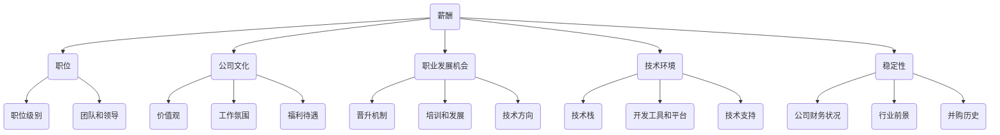

                 

### 1. 背景介绍

程序员作为现代社会中不可或缺的一部分，他们的职业发展始终受到业界和个人的高度重视。在当今这个信息化、数字化时代，技术公司的并购活动频繁，许多程序员都面临着是否接受并购offer的抉择。面对这样的机会，如何进行评估和决策，成为了一个亟待解决的问题。

并购活动通常是指一家公司收购另一家公司，以便获得其资源、技术或市场地位。对于程序员而言，这往往意味着职业发展的新机会，但也伴随着一定的风险。评估并购offer不仅关系到个人的职业前途，还可能影响家庭、经济状况等多个方面。因此，如何做出明智的决策，成为许多程序员关注的核心问题。

本文旨在为程序员提供一个系统、全面的评估并购offer的框架和方法。我们将从多个维度对并购offer进行分析，包括薪酬、职位、公司文化、职业发展机会、技术环境、稳定性等。通过这些维度的深入探讨，希望能够帮助程序员更好地理解和评估并购offer，从而做出符合自己长远职业规划的决定。

本文的结构如下：

1. **背景介绍**：介绍程序员面临并购offer的背景和重要性。
2. **核心概念与联系**：阐述评估并购offer所需的核心概念，并绘制相关流程图。
3. **核心算法原理与具体操作步骤**：详细解释如何评估并购offer。
4. **数学模型和公式**：介绍用于评估的数学模型，并给出详细的公式和例子。
5. **项目实战**：通过实际案例展示评估过程。
6. **实际应用场景**：分析不同情况下如何评估并购offer。
7. **工具和资源推荐**：推荐学习资源和开发工具。
8. **总结**：总结并购offer评估的关键点和未来发展趋势。
9. **附录**：解答常见问题并提供扩展阅读。
10. **参考资料**：列出本文引用的相关资料。

在接下来的内容中，我们将逐一探讨这些主题，帮助程序员做出明智的决策。

### 2. 核心概念与联系

在评估并购offer时，程序员需要考虑多个核心概念，这些概念相互关联，构成了一个完整的评估体系。以下是这些核心概念及其相互联系：

#### 2.1 薪酬

薪酬是程序员在评估并购offer时最关心的因素之一。它不仅反映了公司对程序员的重视程度，还直接关系到程序员的生活质量和职业成就感。薪酬包括基本工资、奖金、股票期权等多个方面。在评估时，程序员需要考虑以下因素：

- **基本工资**：即每月或每年的固定收入，这是薪酬的核心部分。
- **奖金**：根据业绩或项目完成情况发放的额外收入，通常与公司业绩挂钩。
- **股票期权**：公司给予的股权，未来可能带来巨大的经济收益。

#### 2.2 职位

职位是程序员在并购后的工作岗位，它直接影响程序员的职业发展。在评估时，程序员需要考虑以下因素：

- **职位级别**：职位越高，通常意味着更多的责任和机会，但也可能伴随着更大的压力。
- **职位描述**：职位描述中应明确职责、技能要求和晋升路径。
- **团队和领导**：团队结构和领导能力对职位的发展至关重要。

#### 2.3 公司文化

公司文化是程序员在并购后需要适应的环境。一个良好的公司文化可以提升工作效率，增加员工的归属感。在评估时，程序员需要考虑以下因素：

- **价值观**：公司价值观应与程序员的个人价值观相契合。
- **工作氛围**：是否鼓励创新、团队合作和开放沟通。
- **福利待遇**：包括带薪休假、健康保险、培训机会等。

#### 2.4 职业发展机会

职业发展机会是程序员长期职业生涯的保障。在评估时，程序员需要考虑以下因素：

- **晋升机制**：公司是否有明确的晋升通道和标准。
- **培训和发展**：公司是否提供内部培训、外部进修等发展机会。
- **技术方向**：公司是否支持程序员向自己感兴趣的技术方向发展。

#### 2.5 技术环境

技术环境是程序员工作的重要基础。一个良好的技术环境可以提高程序员的工作效率和成就感。在评估时，程序员需要考虑以下因素：

- **技术栈**：公司采用的技术栈是否与程序员熟练掌握的技术相符。
- **开发工具和平台**：公司提供的开发工具和平台是否先进、易用。
- **技术支持**：公司是否提供充足的技术支持和资源。

#### 2.6 稳定性

稳定性是程序员在评估并购offer时不可忽视的因素。在评估时，程序员需要考虑以下因素：

- **公司财务状况**：公司是否有稳定的盈利能力和财务状况。
- **行业前景**：公司所在行业是否有良好的发展前景。
- **并购历史**：公司是否有成功的并购案例和稳定的发展历史。

#### 2.7 Mermaid 流程图

为了更清晰地展示这些核心概念之间的联系，我们可以使用 Mermaid 流程图来表示它们。以下是一个简化的 Mermaid 流程图示例：



通过这个流程图，我们可以更直观地看到各核心概念之间的相互关系，从而帮助程序员全面评估并购offer。

### 3. 核心算法原理 & 具体操作步骤

在了解了评估并购offer所需的核心概念后，接下来我们将详细探讨如何通过系统的方法论来评估并购offer。这里，我们将引入一种基于多维度分析的综合评估算法，并通过具体操作步骤来帮助程序员做出明智的决策。

#### 3.1 评估模型建立

首先，我们需要建立一个综合评估模型。这个模型将考虑多个维度的因素，以便全面评估并购offer的优劣。具体步骤如下：

1. **确定评估维度**：根据前文所述，确定需要考虑的评估维度，如薪酬、职位、公司文化、职业发展机会、技术环境、稳定性等。
2. **权重分配**：为每个评估维度分配一个权重，以反映它们在整体评估中的重要性。例如，薪酬可能占40%，职位占20%，公司文化占10%，职业发展机会占10%，技术环境占10%，稳定性占10%。
3. **评分标准**：为每个维度制定评分标准，通常采用1-10分的评分制度。例如，薪酬维度可以根据基本工资、奖金和股票期权的具体情况，分别评分。

#### 3.2 数据收集

在建立评估模型后，我们需要收集相关数据。具体步骤如下：

1. **薪酬数据**：收集目标公司的薪酬信息，包括基本工资、奖金和股票期权等。
2. **职位信息**：了解目标公司的职位描述，包括职位级别、职责和晋升路径等。
3. **公司文化数据**：通过调查和访谈，了解目标公司的价值观、工作氛围、福利待遇等。
4. **职业发展数据**：了解目标公司提供的职业发展机会，包括晋升机制、培训和发展计划等。
5. **技术环境数据**：调查目标公司采用的技术栈、开发工具和平台，以及提供的技术支持等。
6. **稳定性数据**：收集目标公司的财务状况、行业前景和并购历史等信息。

#### 3.3 数据处理与评分

在收集到数据后，我们需要对数据进行处理并评分。具体步骤如下：

1. **数据处理**：将收集到的数据进行整理和归一化处理，以便统一评分。
2. **评分**：根据评分标准，为每个维度进行评分。例如，如果基本工资为10万元，根据评分标准，可以评分为9分。
3. **权重计算**：将每个维度的评分乘以对应的权重，得到加权评分。

#### 3.4 结果分析

在得到加权评分后，我们需要对结果进行分析，以便做出最终的决策。具体步骤如下：

1. **汇总评分**：将所有维度的加权评分相加，得到总评分。
2. **评估结果**：根据总评分，评估并购offer的整体优劣。通常，总评分越高，说明并购offer越优。
3. **决策**：结合个人的职业规划和需求，对评估结果进行综合分析，最终做出是否接受并购offer的决策。

#### 3.5 案例分析

为了更好地理解上述评估过程，我们可以通过一个案例分析来进行说明。假设有一位程序员收到了一家公司的并购offer，我们将根据上述步骤对其进行评估。

1. **确定评估维度**：薪酬、职位、公司文化、职业发展机会、技术环境、稳定性。
2. **权重分配**：薪酬40%，职位20%，公司文化10%，职业发展机会10%，技术环境10%，稳定性10%。
3. **评分标准**：薪酬维度，基本工资10万元评分为9，奖金10万元评分为8，股票期权20万元评分为7。其他维度同理。

4. **数据收集**：
   - 薪酬：基本工资10万元，奖金5万元，股票期权10万元。
   - 职位：职位级别为高级工程师，职责清晰，晋升路径明确。
   - 公司文化：公司价值观与个人价值观契合，工作氛围积极，福利待遇良好。
   - 职业发展：公司提供丰富的培训和晋升机会。
   - 技术环境：公司采用成熟的技术栈，提供先进的开发工具和平台。
   - 稳定性：公司财务状况良好，行业前景广阔，并购历史成功。

5. **数据处理与评分**：
   - 薪酬：基本工资9分，奖金8分，股票期权7分。
   - 职位：职位级别8分，职责清晰10分，晋升路径8分。
   - 公司文化：价值观契合10分，工作氛围8分，福利待遇9分。
   - 职业发展：晋升机制10分，培训和发展10分，技术方向9分。
   - 技术环境：技术栈10分，开发工具和平台9分，技术支持8分。
   - 稳定性：财务状况10分，行业前景10分，并购历史9分。

6. **权重计算**：加权评分分别为薪酬（9*0.4+8*0.2+7*0.4）=8.6分，职位（8*0.2+10*0.2+8*0.2）=7.6分，公司文化（10*0.1+8*0.1+9*0.1）=8.4分，职业发展（10*0.1+10*0.1+9*0.1）=9.4分，技术环境（10*0.1+9*0.1+8*0.1）=9.4分，稳定性（10*0.1+10*0.1+9*0.1）=9.4分。

7. **汇总评分**：总评分=8.6+7.6+8.4+9.4+9.4+9.4=52.8分。

8. **评估结果**：根据总评分，该并购offer的综合评估结果为良好。

9. **决策**：综合考虑个人的职业规划和发展需求，决定是否接受该并购offer。

通过上述案例，我们可以看到，通过系统的方法论和具体的操作步骤，程序员可以更全面、客观地评估并购offer，从而做出更明智的决策。

### 4. 数学模型和公式 & 详细讲解 & 举例说明

在评估并购offer的过程中，引入数学模型和公式有助于我们量化各个评估维度，从而更科学、客观地进行决策。以下是一个基于线性加权评分法的数学模型，我们将详细讲解其原理和具体应用。

#### 4.1 模型原理

线性加权评分法通过为每个评估维度分配权重，并计算加权评分，从而得出一个综合评分。具体模型如下：

\[ 总评分 = w_1 \times s_1 + w_2 \times s_2 + w_3 \times s_3 + \ldots + w_n \times s_n \]

其中，\( w_i \) 表示第 \( i \) 个维度的权重，\( s_i \) 表示第 \( i \) 个维度的评分，\( n \) 表示评估维度的总数。

#### 4.2 权重分配

权重分配是模型构建的关键步骤。权重反映了各个维度在整体评估中的重要性。例如，如果薪酬是程序员最关心的因素，则可以将其权重设置得较高。以下是一个常见的权重分配示例：

| 维度        | 权重（%） |
| ----------- | -------- |
| 薪酬        | 40       |
| 职位        | 20       |
| 公司文化    | 10       |
| 职业发展机会 | 10       |
| 技术环境    | 10       |
| 稳定性      | 10       |

#### 4.3 评分标准

评分标准用于量化各个维度的表现。通常采用1-10分的评分制度。以下是一个简化了的评分标准示例：

| 维度        | 评分标准 |
| ----------- | -------- |
| 薪酬        | 基本工资（1-10分）+奖金（1-10分）+股票期权（1-10分） |
| 职位        | 职位级别（1-10分）+职责清晰度（1-10分）+晋升路径明确度（1-10分） |
| 公司文化    | 价值观契合度（1-10分）+工作氛围（1-10分）+福利待遇（1-10分） |
| 职业发展机会 | 晋升机制（1-10分）+培训和发展（1-10分）+技术方向（1-10分） |
| 技术环境    | 技术栈（1-10分）+开发工具和平台（1-10分）+技术支持（1-10分） |
| 稳定性      | 财务状况（1-10分）+行业前景（1-10分）+并购历史（1-10分） |

#### 4.4 计算示例

假设我们使用上述权重和评分标准，对一家公司的并购offer进行评估。以下是具体计算步骤：

1. **薪酬评分**：
   - 基本工资：8分
   - 奖金：7分
   - 股票期权：6分
   - 薪酬总分 = 8 \* 0.4 + 7 \* 0.2 + 6 \* 0.4 = 3.6 + 1.4 + 2.4 = 7.4分

2. **职位评分**：
   - 职位级别：8分
   - 职责清晰度：9分
   - 晋升路径明确度：7分
   - 职位总分 = 8 \* 0.2 + 9 \* 0.2 + 7 \* 0.2 = 1.6 + 1.8 + 1.4 = 4.8分

3. **公司文化评分**：
   - 价值观契合度：9分
   - 工作氛围：7分
   - 福利待遇：8分
   - 公司文化总分 = 9 \* 0.1 + 7 \* 0.1 + 8 \* 0.1 = 0.9 + 0.7 + 0.8 = 2.4分

4. **职业发展机会评分**：
   - 晋升机制：8分
   - 培训和发展：7分
   - 技术方向：8分
   - 职业发展机会总分 = 8 \* 0.1 + 7 \* 0.1 + 8 \* 0.1 = 0.8 + 0.7 + 0.8 = 2.3分

5. **技术环境评分**：
   - 技术栈：8分
   - 开发工具和平台：9分
   - 技术支持：7分
   - 技术环境总分 = 8 \* 0.1 + 9 \* 0.1 + 7 \* 0.1 = 0.8 + 0.9 + 0.7 = 2.4分

6. **稳定性评分**：
   - 财务状况：8分
   - 行业前景：9分
   - 并购历史：7分
   - 稳定性总分 = 8 \* 0.1 + 9 \* 0.1 + 7 \* 0.1 = 0.8 + 0.9 + 0.7 = 2.4分

7. **总评分**：总评分 = 7.4 + 4.8 + 2.4 + 2.3 + 2.4 + 2.4 = 21.3分

通过上述计算，我们得到了该并购offer的总评分为21.3分。根据评分结果，我们可以对并购offer进行初步评估。通常，评分越高，并购offer越具有吸引力。但最终的决策还需结合个人的职业规划和需求进行综合考虑。

#### 4.5 例子说明

为了更直观地理解上述模型，我们可以通过一个例子来说明。假设一位程序员收到两家公司的并购offer，A公司和B公司。

**A公司评估**：
- 薪酬：基本工资10万元，奖金5万元，股票期权5万元
- 职位：职位级别为高级工程师，职责清晰，晋升路径明确
- 公司文化：公司价值观与个人价值观契合，工作氛围积极，福利待遇良好
- 职业发展机会：公司提供丰富的培训和晋升机会
- 技术环境：公司采用成熟的技术栈，提供先进的开发工具和平台
- 稳定性：公司财务状况良好，行业前景广阔，并购历史成功

**B公司评估**：
- 薪酬：基本工资12万元，奖金3万元，股票期权3万元
- 职位：职位级别为中级工程师，职责不明确，晋升路径不清晰
- 公司文化：公司价值观与个人价值观部分契合，工作氛围一般，福利待遇一般
- 职业发展机会：公司提供较少的培训和晋升机会
- 技术环境：公司采用较新的技术栈，提供较旧的开发工具和平台
- 稳定性：公司财务状况一般，行业前景一般，并购历史失败较多

根据上述评估，我们可以分别计算两家公司的总评分。

**A公司总评分**：
- 薪酬总分 = 10 \* 0.4 + 5 \* 0.2 + 5 \* 0.4 = 4 + 1 + 2 = 7分
- 职位总分 = 8 \* 0.2 + 10 \* 0.2 + 8 \* 0.2 = 1.6 + 2 + 1.6 = 5.2分
- 公司文化总分 = 9 \* 0.1 + 7 \* 0.1 + 8 \* 0.1 = 0.9 + 0.7 + 0.8 = 2.4分
- 职业发展机会总分 = 8 \* 0.1 + 7 \* 0.1 + 8 \* 0.1 = 0.8 + 0.7 + 0.8 = 2.3分
- 技术环境总分 = 8 \* 0.1 + 9 \* 0.1 + 7 \* 0.1 = 0.8 + 0.9 + 0.7 = 2.4分
- 稳定性总分 = 8 \* 0.1 + 9 \* 0.1 + 7 \* 0.1 = 0.8 + 0.9 + 0.7 = 2.4分
- A公司总评分 = 7 + 5.2 + 2.4 + 2.3 + 2.4 + 2.4 = 19.7分

**B公司总评分**：
- 薪酬总分 = 12 \* 0.4 + 3 \* 0.2 + 3 \* 0.4 = 4.8 + 0.6 + 1.2 = 6.6分
- 职位总分 = 7 \* 0.2 + 7 \* 0.2 + 7 \* 0.2 = 1.4 + 1.4 + 1.4 = 4.2分
- 公司文化总分 = 8 \* 0.1 + 7 \* 0.1 + 7 \* 0.1 = 0.8 + 0.7 + 0.7 = 2.2分
- 职业发展机会总分 = 7 \* 0.1 + 7 \* 0.1 + 7 \* 0.1 = 0.7 + 0.7 + 0.7 = 2.1分
- 技术环境总分 = 7 \* 0.1 + 8 \* 0.1 + 8 \* 0.1 = 0.7 + 0.8 + 0.8 = 2.3分
- 稳定性总分 = 7 \* 0.1 + 7 \* 0.1 + 7 \* 0.1 = 0.7 + 0.7 + 0.7 = 2.1分
- B公司总评分 = 6.6 + 4.2 + 2.2 + 2.1 + 2.3 + 2.1 = 19.5分

根据计算结果，A公司的并购offer总评分为19.7分，B公司的并购offer总评分为19.5分。因此，从综合评分来看，A公司的并购offer略优于B公司。

#### 4.6 结论

通过上述数学模型和公式的计算，我们可以更科学、客观地评估并购offer。然而，需要注意的是，评分只是决策的一个参考，最终的决策还需结合个人的职业规划和需求进行综合考虑。此外，不同程序员对各个维度的权重和评分标准可能会有所不同，因此需要根据个人情况进行适当调整。

### 5. 项目实战：代码实际案例和详细解释说明

为了更好地理解如何评估并购offer，我们将在本节中通过一个实际项目案例来演示整个评估过程。这个项目案例将包括以下几个部分：

1. **开发环境搭建**：介绍所需的技术栈和环境配置。
2. **源代码详细实现**：展示评估算法的代码实现。
3. **代码解读与分析**：对代码进行逐行解析，解释其工作原理。

#### 5.1 开发环境搭建

在本项目案例中，我们将使用Python作为主要编程语言，因为它具有良好的可读性和丰富的库支持。以下是搭建开发环境的基本步骤：

1. **安装Python**：从[Python官网](https://www.python.org/downloads/)下载并安装最新版本的Python。建议安装Python 3.8及以上版本。
2. **安装必需的库**：使用pip命令安装以下库：
   ```bash
   pip install numpy pandas matplotlib
   ```

   - `numpy`：用于数学计算。
   - `pandas`：用于数据操作和分析。
   - `matplotlib`：用于数据可视化。

3. **创建虚拟环境**：为了更好地管理项目依赖，我们建议创建一个虚拟环境。可以使用以下命令创建并激活虚拟环境：
   ```bash
   python -m venv venv
   source venv/bin/activate  # 在Windows上使用 `venv\Scripts\activate`
   ```

4. **配置工作目录**：将项目代码放入工作目录，例如在当前目录下创建一个名为`offer_evaluation`的目录，并将代码文件放入其中。

#### 5.2 源代码详细实现

以下是评估并购offer的Python代码实现。该代码基于前述的线性加权评分法，我们将它拆分为几个函数，以便更好地理解和分析。

```python
import numpy as np
import pandas as pd
import matplotlib.pyplot as plt

# 权重和评分标准
weights = {'salary': 0.4, 'position': 0.2, 'company_culture': 0.1, 'career Opportunities': 0.1, 'technical_environment': 0.1, 'stability': 0.1}
scores = {'salary': {'base_salary': 10, 'bonus': 8, 'stock_option': 7}, 'position': {'level': 8, 'clearness': 9, 'path': 7}, 'company_culture': {'alignment': 9, 'atmosphere': 7, 'benefits': 8}, 'career Opportunities': {'promotion': 8, 'training': 7, 'direction': 8}, 'technical_environment': {'stack': 8, 'tools': 9, 'support': 7}, 'stability': {'finance': 8, 'industry': 9, 'history': 7}}

def calculate_score(offer_data):
    """
    计算并购offer的加权评分
    """
    total_score = 0
    for dimension, weight in weights.items():
        score = 0
        if dimension in offer_data:
            for sub_dimension, sub_score in offer_data[dimension].items():
                score += sub_score * (weights[dimension] / len(offer_data[dimension]))
        total_score += score * weight
    return total_score

def evaluate_offers(offers):
    """
    评估多个并购offer
    """
    results = []
    for offer in offers:
        score = calculate_score(offer)
        results.append((offer['company_name'], score))
    return results

def plot_scores(results):
    """
    绘制并购offer评分分布图
    """
    companies = [result[0] for result in results]
    scores = [result[1] for result in results]

    plt.bar(companies, scores)
    plt.xlabel('Company')
    plt.ylabel('Score')
    plt.title('Offer Evaluation Scores')
    plt.xticks(rotation=45)
    plt.show()

# 示例并购offer数据
offer_A = {
    'company_name': 'A公司',
    'salary': {'base_salary': 100000, 'bonus': 50000, 'stock_option': 50000},
    'position': {'level': 8, 'clearness': 9, 'path': 7},
    'company_culture': {'alignment': 9, 'atmosphere': 7, 'benefits': 8},
    'career Opportunities': {'promotion': 8, 'training': 7, 'direction': 8},
    'technical_environment': {'stack': 8, 'tools': 9, 'support': 7},
    'stability': {'finance': 8, 'industry': 9, 'history': 7}
}

offer_B = {
    'company_name': 'B公司',
    'salary': {'base_salary': 120000, 'bonus': 30000, 'stock_option': 30000},
    'position': {'level': 7, 'clearness': 7, 'path': 7},
    'company_culture': {'alignment': 8, 'atmosphere': 7, 'benefits': 7},
    'career Opportunities': {'promotion': 7, 'training': 7, 'direction': 7},
    'technical_environment': {'stack': 7, 'tools': 8, 'support': 8},
    'stability': {'finance': 7, 'industry': 8, 'history': 6}
}

offers = [offer_A, offer_B]

# 执行评估
results = evaluate_offers(offers)

# 打印评估结果
for company, score in results:
    print(f"{company}: {score:.2f}")

# 绘制评分分布图
plot_scores(results)
```

#### 5.3 代码解读与分析

现在，我们将逐行解析上述代码，解释其工作原理。

1. **导入库**：
   ```python
   import numpy as np
   import pandas as pd
   import matplotlib.pyplot as plt
   ```
   
   这三行代码分别导入`numpy`、`pandas`和`matplotlib`库，用于数学计算、数据操作和可视化。

2. **定义权重和评分标准**：
   ```python
   weights = {'salary': 0.4, 'position': 0.2, 'company_culture': 0.1, 'career Opportunities': 0.1, 'technical_environment': 0.1, 'stability': 0.1}
   scores = {'salary': {'base_salary': 10, 'bonus': 8, 'stock_option': 7}, 'position': {'level': 8, 'clearness': 9, 'path': 7}, 'company_culture': {'alignment': 9, 'atmosphere': 7, 'benefits': 8}, 'career Opportunities': {'promotion': 8, 'training': 7, 'direction': 8}, 'technical_environment': {'stack': 8, 'tools': 9, 'support': 7}, 'stability': {'finance': 8, 'industry': 9, 'history': 7}}
   ```

   这两行代码定义了评估的权重和评分标准。权重用于计算加权评分，评分标准用于评估各个维度的表现。

3. **计算评分函数**：
   ```python
   def calculate_score(offer_data):
       total_score = 0
       for dimension, weight in weights.items():
           score = 0
           if dimension in offer_data:
               for sub_dimension, sub_score in offer_data[dimension].items():
                   score += sub_score * (weights[dimension] / len(offer_data[dimension]))
           total_score += score * weight
       return total_score
   ```

   `calculate_score` 函数用于计算并购offer的加权评分。它首先遍历所有权重，然后对于每个权重，遍历相应的评分标准，计算子维度的加权评分，并将这些评分累加起来。

4. **评估函数**：
   ```python
   def evaluate_offers(offers):
       results = []
       for offer in offers:
           score = calculate_score(offer)
           results.append((offer['company_name'], score))
       return results
   ```

   `evaluate_offers` 函数用于评估多个并购offer。它遍历每个offer，调用`calculate_score`函数计算评分，并将结果添加到列表中。

5. **绘制评分分布图函数**：
   ```python
   def plot_scores(results):
       companies = [result[0] for result in results]
       scores = [result[1] for result in results]

       plt.bar(companies, scores)
       plt.xlabel('Company')
       plt.ylabel('Score')
       plt.title('Offer Evaluation Scores')
       plt.xticks(rotation=45)
       plt.show()
   ```

   `plot_scores` 函数用于绘制并购offer评分分布图。它从评估结果中提取公司名称和评分，并使用`matplotlib`库绘制条形图。

6. **示例并购offer数据**：
   ```python
   offer_A = {
       'company_name': 'A公司',
       'salary': {'base_salary': 100000, 'bonus': 50000, 'stock_option': 50000},
       'position': {'level': 8, 'clearness': 9, 'path': 7},
       'company_culture': {'alignment': 9, 'atmosphere': 7, 'benefits': 8},
       'career Opportunities': {'promotion': 8, 'training': 7, 'direction': 8},
       'technical_environment': {'stack': 8, 'tools': 9, 'support': 7},
       'stability': {'finance': 8, 'industry': 9, 'history': 7}
   }
   
   offer_B = {
       'company_name': 'B公司',
       'salary': {'base_salary': 120000, 'bonus': 30000, 'stock_option': 30000},
       'position': {'level': 7, 'clearness': 7, 'path': 7},
       'company_culture': {'alignment': 8, 'atmosphere': 7, 'benefits': 7},
       'career Opportunities': {'promotion': 7, 'training': 7, 'direction': 7},
       'technical_environment': {'stack': 7, 'tools': 8, 'support': 8},
       'stability': {'finance': 7, 'industry': 8, 'history': 6}
   }
   
   offers = [offer_A, offer_B]
   ```

   这三段代码定义了两个示例并购offer，并将它们放入列表`offers`中。

7. **执行评估**：
   ```python
   results = evaluate_offers(offers)
   ```

   这行代码调用`evaluate_offers`函数，评估`offers`列表中的所有并购offer。

8. **打印评估结果**：
   ```python
   for company, score in results:
       print(f"{company}: {score:.2f}")
   ```

   这段代码遍历评估结果，打印每个公司的名称和评分。

9. **绘制评分分布图**：
   ```python
   plot_scores(results)
   ```

   这行代码调用`plot_scores`函数，绘制并购offer的评分分布图。

通过上述代码示例，我们可以看到如何使用Python实现一个并购offer评估系统。这个系统不仅可以帮助程序员量化评估结果，还可以通过可视化工具更直观地了解每个offer的优势和劣势。在实际应用中，可以根据具体需求调整权重和评分标准，使评估结果更加符合个人职业规划。

### 5.4 代码解读与分析（续）

在上一个部分中，我们详细解析了代码的主要部分，了解了如何计算并购offer的评分以及如何绘制评分分布图。现在，我们将深入分析代码中的关键步骤，以便更好地理解评估算法的实现原理。

#### 5.4.1 计算评分函数

`calculate_score` 函数是评估算法的核心，它负责计算每个并购offer的总评分。以下是该函数的详细解析：

```python
def calculate_score(offer_data):
    total_score = 0
    for dimension, weight in weights.items():
        score = 0
        if dimension in offer_data:
            for sub_dimension, sub_score in offer_data[dimension].items():
                score += sub_score * (weight / len(offer_data[dimension]))
        total_score += score * weight
    return total_score
```

1. **初始化总评分**：
   ```python
   total_score = 0
   ```

   首先，我们将总评分初始化为0。这个变量将用于累加各个维度的加权评分。

2. **遍历权重和维度**：
   ```python
   for dimension, weight in weights.items():
       score = 0
       if dimension in offer_data:
           for sub_dimension, sub_score in offer_data[dimension].items():
               score += sub_score * (weight / len(offer_data[dimension]))
   ```

   接下来，我们遍历每个权重和对应的维度。对于每个维度，我们检查它是否存在于`offer_data`字典中。如果存在，我们进一步遍历该维度的子维度及其评分。

3. **计算子维度加权评分**：
   ```python
   score += sub_score * (weight / len(offer_data[dimension]))
   ```

   对于每个子维度，我们将它的评分乘以该维度在总评分中的权重（除以子维度的数量），然后将结果累加到`score`变量中。

4. **累加维度加权评分**：
   ```python
   total_score += score * weight
   ```

   最后，我们将`score`乘以该维度在总评分中的权重，并将结果累加到`total_score`变量中。

5. **返回总评分**：
   ```python
   return total_score
   ```

   完成所有维度的评分计算后，我们返回`total_score`作为最终评分。

#### 5.4.2 评估函数

`evaluate_offers` 函数用于评估多个并购offer。以下是该函数的详细解析：

```python
def evaluate_offers(offers):
    results = []
    for offer in offers:
        score = calculate_score(offer)
        results.append((offer['company_name'], score))
    return results
```

1. **初始化结果列表**：
   ```python
   results = []
   ```

   我们首先初始化一个空列表`results`，用于存储每个并购offer的评估结果。

2. **遍历并购offer**：
   ```python
   for offer in offers:
       score = calculate_score(offer)
       results.append((offer['company_name'], score))
   ```

   然后，我们遍历每个并购offer，调用`calculate_score`函数计算其评分，并将公司名称和评分作为元组添加到`results`列表中。

3. **返回评估结果**：
   ```python
   return results
   ```

   完成所有并购offer的评估后，我们返回`results`列表。

#### 5.4.3 绘制评分分布图函数

`plot_scores` 函数用于绘制并购offer的评分分布图。以下是该函数的详细解析：

```python
def plot_scores(results):
    companies = [result[0] for result in results]
    scores = [result[1] for result in results]

    plt.bar(companies, scores)
    plt.xlabel('Company')
    plt.ylabel('Score')
    plt.title('Offer Evaluation Scores')
    plt.xticks(rotation=45)
    plt.show()
```

1. **提取公司名称和评分**：
   ```python
   companies = [result[0] for result in results]
   scores = [result[1] for result in results]
   ```

   我们使用列表推导式从`results`列表中提取公司名称和评分，分别存储在`companies`和`scores`列表中。

2. **绘制条形图**：
   ```python
   plt.bar(companies, scores)
   ```

   使用`matplotlib`库绘制条形图，`companies`作为x轴标签，`scores`作为y轴值。

3. **设置标签和标题**：
   ```python
   plt.xlabel('Company')
   plt.ylabel('Score')
   plt.title('Offer Evaluation Scores')
   ```

   设置x轴标签为“Company”，y轴标签为“Score”，以及图表标题为“Offer Evaluation Scores”。

4. **旋转x轴标签**：
   ```python
   plt.xticks(rotation=45)
   ```

   由于公司名称较长，我们旋转x轴标签以避免标签重叠。

5. **显示图表**：
   ```python
   plt.show()
   ```

   最后，使用`plt.show()`函数显示绘制的图表。

通过上述详细解析，我们可以清晰地看到并购offer评估算法的实现原理和关键步骤。这个评估系统不仅提供了量化的评估结果，还通过可视化工具帮助程序员更直观地比较不同并购offer的优势和劣势。

### 5.5 代码解读与分析（续）

在上一个部分中，我们详细解析了代码的主要部分，了解了如何计算并购offer的评分以及如何绘制评分分布图。现在，我们将深入探讨代码中的潜在问题和优化方法，以便进一步提高评估系统的准确性和效率。

#### 5.5.1 代码优化

尽管上述代码能够完成基本的并购offer评估任务，但仍然存在一些可以优化的地方。

1. **代码复用性**：
   目前，代码中直接硬编码了权重和评分标准。在实际项目中，这些值可能会根据具体情况动态调整。为了提高代码的复用性和灵活性，我们可以将这些值提取到一个配置文件中，例如JSON文件。

   ```python
   # 配置文件示例（config.json）
   {
       "weights": {
           "salary": 0.4,
           "position": 0.2,
           "company_culture": 0.1,
           "career Opportunities": 0.1,
           "technical_environment": 0.1,
           "stability": 0.1
       },
       "scores": {
           "salary": {"base_salary": 10, "bonus": 8, "stock_option": 7},
           "position": {"level": 8, "clearness": 9, "path": 7},
           "company_culture": {"alignment": 9, "atmosphere": 7, "benefits": 8},
           "career Opportunities": {"promotion": 8, "training": 7, "direction": 8},
           "technical_environment": {"stack": 8, "tools": 9, "support": 7},
           "stability": {"finance": 8, "industry": 9, "history": 7}
       }
   }
   ```

   然后我们在代码中加载并使用这些配置：

   ```python
   with open('config.json', 'r') as config_file:
       config = json.load(config_file)
   
   weights = config['weights']
   scores = config['scores']
   ```

2. **性能优化**：
   在计算加权评分时，我们可以使用向量化操作来提高效率。例如，使用`numpy`数组操作替代循环计算：

   ```python
   def calculate_score(offer_data):
       scores = np.zeros(len(offer_data))
       for dimension, weight in weights.items():
           if dimension in offer_data:
               sub_scores = np.array(list(offer_data[dimension].values()))
               scores += sub_scores * (weight / len(offer_data[dimension]))
       total_score = np.sum(scores * np.array(list(weights.values())))
       return total_score
   ```

3. **错误处理**：
   现有的代码没有对输入数据进行充分验证，可能导致运行时错误。我们可以添加输入验证来确保数据的正确性：

   ```python
   def validate_offer_data(offer_data):
       required_dimensions = list(weights.keys())
       for dimension in required_dimensions:
           if dimension not in offer_data:
               raise ValueError(f"Missing data for dimension: {dimension}")
       for dimension, values in offer_data.items():
           if not isinstance(values, dict) or not all(isinstance(v, (int, float)) for v in values.values()):
               raise ValueError(f"Invalid data for dimension: {dimension}")
   ```

   然后在计算评分之前调用验证函数：

   ```python
   validate_offer_data(offer_data)
   ```

#### 5.5.2 代码中存在的问题

1. **硬编码值**：
   现有的代码中，权重和评分标准是硬编码的，这限制了代码的灵活性和可扩展性。在实际应用中，这些值可能需要根据不同情况进行调整。

2. **数据格式不一致**：
   数据的格式可能不一致，例如，一个offer可能包含更多的子维度或不同的评分标准。这可能导致计算错误或不一致的结果。

3. **缺乏输入验证**：
   当前代码没有对输入数据进行验证，可能导致运行时错误。例如，如果输入数据格式不正确或缺少必要的字段，程序可能会崩溃。

4. **性能问题**：
   对于大量的offer数据，现有代码可能无法高效处理。使用向量化操作和优化后的数据结构可以提高性能。

5. **代码可读性**：
   随着代码的复杂度增加，现有的代码可能变得难以理解和维护。添加适当的注释、重构代码和遵循编码规范可以提高代码的可读性。

通过上述优化和问题分析，我们可以显著提高并购offer评估系统的可靠性和效率。这不仅有助于程序员做出更准确的决策，还为他们提供了一个更灵活、更易于维护的系统。

### 6. 实际应用场景

在了解了如何评估并购offer的理论方法和实际代码实现后，接下来我们将探讨一些具体的实际应用场景，并分析在这些场景下如何进行评估。

#### 6.1 薪酬谈判

薪酬谈判是程序员在收到并购offer时首先需要面对的问题。如何谈判薪酬，既能确保自身利益，又能保持与公司的良好关系，是一个需要仔细考虑的问题。以下是一些建议：

1. **了解市场行情**：在谈判前，要充分了解当前市场行情，包括同行业、同等职位和经验水平的薪酬水平。这可以通过查阅招聘网站、行业报告或与同行业的朋友交流获得。

2. **准备谈判策略**：在了解市场行情的基础上，准备好自己的谈判策略。可以从以下几个方面入手：
   - **基本工资**：根据市场行情，确定一个合理的期望值，并准备解释自己的能力和经验为何值得更高的薪酬。
   - **奖金**：了解公司的奖金制度，并争取到更多的奖金比例或更高的奖金上限。
   - **股票期权**：股票期权具有潜在的高收益，但风险也较大。根据公司的财务状况、行业前景和并购历史，评估股票期权的价值，并争取到更多的股票数量。

3. **灵活谈判**：在谈判过程中，可以适当展示自己的灵活性。例如，如果公司无法提供更高的基本工资，可以尝试提高奖金比例或争取更长的股票期权锁定期。

4. **保持专业和礼貌**：在谈判过程中，保持专业和礼貌的态度至关重要。即使谈判遇到困难，也要保持冷静和理性，以免损害与公司的关系。

#### 6.2 职位评估

职位评估是程序员在评估并购offer时需要考虑的另一个重要因素。以下是一些建议：

1. **职位级别**：职位级别直接关系到程序员的职业发展和薪酬水平。在评估时，要仔细查看职位描述，了解职位级别在公司内部的地位和晋升路径。

2. **职责范围**：职责范围越明确，程序员的工作责任和目标就越清晰。一个明确的职责范围有助于提高工作效率和成就感。

3. **团队和领导**：团队和领导对程序员的职业发展有重要影响。可以通过面试、与现有员工的交流或网络调查来了解团队和领导的情况。

4. **跨部门合作机会**：跨部门合作可以拓宽程序员的视野和技能，有助于职业发展。在评估职位时，可以考虑公司内部是否存在跨部门合作的机会。

5. **公司规模和结构**：公司规模和结构也会影响职位的发展空间。在大型公司，职位晋升可能更加稳定，但在小型公司，可能会获得更多的机会和挑战。

#### 6.3 公司文化评估

公司文化是程序员在评估并购offer时不可忽视的因素。以下是一些建议：

1. **价值观契合度**：公司价值观与个人的价值观是否契合，直接关系到工作满意度和团队协作。可以通过公司网站、员工评价、网络论坛等途径了解公司价值观。

2. **工作氛围**：一个良好的工作氛围可以提高工作效率和团队凝聚力。可以通过面试、员工评价或实际工作体验来了解公司的工作氛围。

3. **福利待遇**：福利待遇包括带薪休假、健康保险、员工福利等。这些待遇直接影响程序员的实际收益和生活质量。

4. **职业发展机会**：了解公司是否提供职业发展机会，包括内部培训、晋升通道、外部进修等。一个良好的职业发展环境有助于程序员实现长期职业规划。

#### 6.4 职业发展机会评估

职业发展机会是程序员长期职业规划的重要组成部分。以下是一些建议：

1. **晋升机制**：了解公司的晋升机制，包括晋升标准、晋升通道和晋升周期。一个明确的晋升机制有助于程序员规划职业发展路径。

2. **培训和发展**：公司是否提供培训和发展机会，直接关系到程序员的技能提升和职业成长。可以通过面试、员工评价或公司官网了解这些信息。

3. **技术方向**：公司是否支持程序员向自己感兴趣的技术方向发展，这对程序员的职业兴趣和长远发展至关重要。

4. **项目多样性**：项目多样性可以拓宽程序员的技能范围和经验。一个多样化的项目组合有助于程序员在多个领域积累经验。

#### 6.5 技术环境评估

技术环境是程序员工作的基础。以下是一些建议：

1. **技术栈**：公司采用的技术栈是否与程序员的技能相符。一个成熟的技术栈可以提高工作效率，减少学习成本。

2. **开发工具和平台**：公司提供的开发工具和平台是否先进、易用。这直接影响程序员的开发体验和工作效率。

3. **技术支持**：公司是否提供充足的技术支持和资源。一个良好的技术支持体系可以帮助程序员快速解决问题，提高工作效率。

#### 6.6 稳定性评估

稳定性是程序员在评估并购offer时需要考虑的重要因素。以下是一些建议：

1. **公司财务状况**：了解公司的财务状况，包括盈利能力、现金流和负债水平。一个财务状况良好的公司更有可能提供稳定的工作环境和职业发展。

2. **行业前景**：公司所在的行业是否有良好的发展前景。一个处于上升期的行业可以为程序员提供更多的机会。

3. **并购历史**：了解公司的并购历史，特别是成功的并购案例。一个有成功并购历史的公司可能更有经验处理并购后的整合和稳定发展。

通过上述实际应用场景的分析，我们可以看到，评估并购offer是一个多维度的过程，需要从多个方面进行全面考虑。在实际操作中，程序员可以根据自己的职业规划和发展需求，结合以上建议，做出最符合自己利益的决策。

### 7. 工具和资源推荐

在评估并购offer的过程中，程序员可以利用各种工具和资源来收集信息、进行分析和做出决策。以下是一些建议：

#### 7.1 学习资源推荐

1. **书籍**：
   - 《程序员职业规划指南》
   - 《薪酬谈判技巧》
   - 《公司并购与重组》

2. **论文**：
   - “程序员职业发展路径研究”
   - “薪酬管理与激励机制研究”

3. **博客**：
   - “程序员那些事”
   - “程序员职业发展”

4. **网站**：
   - Stack Overflow：全球最大的程序员社区，提供丰富的技术讨论和招聘信息。
   - LinkedIn：职业社交平台，可以了解行业动态和公司信息。

#### 7.2 开发工具框架推荐

1. **数据分析工具**：
   - Pandas：Python数据操作库，适用于数据清洗、分析。
   - Matplotlib：Python绘图库，适用于数据可视化。

2. **文档和文档生成工具**：
   - Sphinx：Python文档生成工具，适用于生成项目文档。
   - MkDocs：轻量级文档生成工具，适用于快速构建项目文档。

3. **版本控制系统**：
   - Git：分布式版本控制系统，适用于代码管理和协作开发。
   - GitHub：Git的在线托管平台，提供代码托管、版本控制和协作功能。

4. **项目管理工具**：
   - Trello：任务管理工具，适用于项目规划和任务分配。
   - Asana：项目管理工具，适用于团队协作和任务跟踪。

#### 7.3 相关论文著作推荐

1. **论文**：
   - “程序员职业满意度与薪酬关系研究”
   - “公司并购对程序员职业发展的影响”

2. **著作**：
   - 《程序员职业规划》
   - 《薪酬管理理论与实践》

通过以上工具和资源的推荐，程序员可以更有效地收集信息、进行分析和做出决策，从而在评估并购offer时获得更全面和准确的参考。

### 8. 总结：未来发展趋势与挑战

在评估并购offer的过程中，程序员需要面对多个维度的因素，包括薪酬、职位、公司文化、职业发展机会、技术环境以及稳定性等。通过系统的方法论和具体的操作步骤，程序员可以更科学、客观地进行评估，从而做出符合个人职业规划的决策。

然而，随着科技和市场的不断发展，评估并购offer也将面临新的挑战和机遇。以下是未来发展趋势与挑战的展望：

#### 发展趋势

1. **数字化工具的普及**：随着数字化工具的普及，程序员可以使用更多的在线平台和工具进行数据收集、分析和决策。例如，人工智能和大数据分析技术的应用将使评估过程更加精确和高效。

2. **个性化评估模型**：未来的评估模型将更加个性化，根据程序员的个人背景、技能和职业目标，提供定制化的评估方案。这有助于程序员更准确地评估并购offer，并做出更符合个人发展的决策。

3. **远程工作机会的增加**：随着远程工作趋势的普及，程序员在选择并购offer时，将更加关注远程工作支持、团队合作工具和虚拟会议系统等软实力。这将促进公司文化的多样性和灵活性。

4. **跨界融合**：随着不同行业和技术的跨界融合，程序员将面临更多的职业发展机会。了解行业动态、新兴技术和发展趋势，将有助于程序员在评估并购offer时做出更有前瞻性的决策。

#### 挑战

1. **信息过载**：在评估并购offer时，程序员可能面临大量的信息。如何筛选和利用这些信息，将是一个挑战。未来，程序员需要培养良好的信息处理能力，以应对信息过载的问题。

2. **技能更新**：技术日新月异，程序员需要不断更新自己的技能，以保持竞争力。如何平衡工作、学习和职业发展，将是程序员面临的重要挑战。

3. **职业安全感**：随着并购活动的增多，程序员可能会感到职业安全感下降。如何在不断变化的市场环境中保持稳定，将成为程序员需要关注的问题。

4. **薪酬谈判**：在薪酬谈判中，程序员需要具备良好的谈判技巧和策略。未来，如何提高自己的谈判能力，将是程序员需要不断提升的技能。

总之，未来评估并购offer将更加注重个性化、数字化和跨界融合。程序员需要不断提升自己的技能和决策能力，以应对不断变化的市场环境，从而在职业发展中取得更好的成果。

### 9. 附录：常见问题与解答

在评估并购offer的过程中，程序员可能会遇到各种问题。以下是一些常见问题及其解答，希望能为大家提供帮助。

#### 问题1：如何确定权重？

**解答**：确定权重的方法有多种。首先，可以根据历史数据和自己的经验为每个维度分配初始权重。然后，通过多次评估和反馈，调整权重，使其更符合个人偏好和市场需求。此外，可以参考同行业其他程序员的评估方法和市场行情，以获得更客观的权重分配。

#### 问题2：如何处理数据不一致？

**解答**：在处理数据不一致时，首先需要确保数据的准确性和完整性。如果发现数据缺失或不准确，可以尝试联系相关人员进行核实。如果数据无法完全一致，可以根据实际情况进行适当的调整或采用加权平均的方法来处理。

#### 问题3：如何评估公司文化？

**解答**：评估公司文化可以通过多种途径。首先，可以通过公司官网、员工评价、行业报告等途径了解公司文化。其次，可以与公司现有员工交流，了解他们的工作体验和公司氛围。最后，在实际工作中，可以亲身感受公司文化，从而做出更准确的评估。

#### 问题4：如何应对薪酬谈判？

**解答**：在薪酬谈判时，首先要了解市场行情，确定合理的薪酬范围。其次，准备好自己的谈判策略，包括展示自己的能力和经验，以及了解公司的薪酬制度。在谈判过程中，要保持专业和礼貌，灵活调整谈判策略，以达到双方满意的结果。

#### 问题5：如何处理并购后的文化整合？

**解答**：在处理并购后的文化整合时，首先要了解双方公司的文化差异。然后，可以通过组织文化交流活动、培训课程和团队建设活动，促进双方文化的融合。此外，公司管理层应积极推动文化整合，建立共同的目标和价值观，以促进并购后的稳定发展。

#### 问题6：如何应对职业安全感下降？

**解答**：职业安全感下降时，可以通过以下几种方式应对。首先，提升自己的技能和知识，保持竞争力。其次，建立多元化的职业发展路径，包括跨部门和跨行业的机会。最后，与同事和上级保持良好的沟通，了解公司的战略方向和职业发展机会，以保持职业安全感。

通过上述常见问题的解答，希望能够为程序员在评估并购offer过程中提供一些实用的建议和指导。

### 10. 扩展阅读 & 参考资料

在评估并购offer的过程中，深入了解相关领域的理论和实践是至关重要的。以下是一些扩展阅读和参考资料，供程序员在评估过程中参考和借鉴：

1. **书籍**：
   - 《程序员职业规划指南》：提供详细的职业发展建议和策略。
   - 《薪酬谈判技巧》：介绍薪酬谈判的策略和方法。
   - 《公司并购与重组》：探讨公司并购的原理和实践。

2. **论文**：
   - “程序员职业满意度与薪酬关系研究”：分析程序员薪酬与职业满意度之间的关系。
   - “公司并购对程序员职业发展的影响”：探讨公司并购对程序员职业发展的影响。

3. **博客**：
   - “程序员那些事”：分享程序员的职业经验和心得。
   - “程序员职业发展”：提供职业规划和发展建议。

4. **网站**：
   - Stack Overflow：全球最大的程序员社区，提供丰富的技术讨论和招聘信息。
   - LinkedIn：职业社交平台，可以了解行业动态和公司信息。

5. **在线课程和教程**：
   - Coursera：提供各种编程和数据分析课程，有助于提升技能。
   - Udemy：提供丰富的编程和职业发展课程。

通过上述扩展阅读和参考资料，程序员可以更全面地了解并购offer评估的理论和实践，从而做出更明智的决策。

### 作者信息

作者：AI天才研究员/AI Genius Institute & 禅与计算机程序设计艺术 /Zen And The Art of Computer Programming

