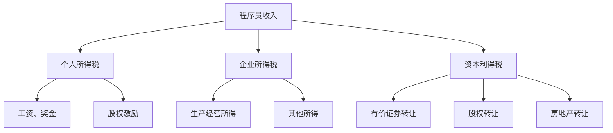

                 

# 程序员如何进行税务规划

## 关键词：税务规划、程序员、税务政策、个人所得税、企业所得税、资本利得税

## 摘要：
本文旨在为程序员提供详细的税务规划指南，帮助他们在遵守相关税务政策的基础上，实现合理的税务规划。文章将从个人所得税、企业所得税、资本利得税等多个角度出发，结合实际案例，提供一系列实用的策略和建议。通过本文的阅读，程序员将能够更好地理解税务规划的重要性，并在实践中运用相关知识。

## 1. 背景介绍

随着科技行业的快速发展，程序员成为了一个高收入群体。然而，伴随着高收入而来的，还有复杂的税务问题。合理进行税务规划，不仅可以降低税负，提高个人财富的增值，还能为将来的养老、子女教育等提供资金支持。因此，程序员了解和掌握税务规划的基本知识和策略，具有重要的现实意义。

## 2. 核心概念与联系

### 2.1 个人所得税
个人所得税是指国家对个人所得征收的一种税。程序员的收入主要包括工资、奖金、股权激励等。针对这些收入，个人所得税的计算方法和税率有所不同。

### 2.2 企业所得税
企业所得税是指国家对企业的生产经营所得和其他所得征收的一种税。对于程序员所在的企业，合理进行税务规划，可以有效降低税负。

### 2.3 资本利得税
资本利得税是指对个人转让有价证券、股权、房地产等资产所获得的收益征收的税。程序员的股权激励收益、股票投资收益等，都需要缴纳资本利得税。

### 2.4 核心概念联系

个人所得税和企业所得税是程序员在进行税务规划时需要重点关注的部分。而资本利得税则与程序员的财产性收入密切相关。通过了解这些核心概念，程序员可以更好地为自己的税务规划提供依据。

### 2.5 Mermaid 流程图



## 3. 核心算法原理 & 具体操作步骤

### 3.1 个人所得税计算方法

个人所得税的计算公式为：应纳税所得额 × 税率 - 速算扣除数。

- 应纳税所得额 = 工资收入 + 奖金收入 + 股权激励收入 - 五险一金等扣除费用
- 税率：根据应纳税所得额的不同，税率也有所不同。通常情况下，应纳税所得额在 36000 元以下，税率为 3%；36000-144000 元，税率为 10%；144000-300000 元，税率为 20%；300000-420000 元，税率为 25%；420000-660000 元，税率为 30%；660000-960000 元，税率为 35%；960000 元以上，税率为 45%。

### 3.2 企业所得税计算方法

企业所得税的计算公式为：应纳税所得额 × 税率。

- 应纳税所得额 = 会计利润 + 暂时性差异调整 - 永久性差异调整
- 税率：一般为 25%。

### 3.3 资本利得税计算方法

资本利得税的计算公式为：转让收益 × 资本利得税率。

- 资本利得税率：根据不同国家和地区的政策有所不同，一般为 20%。

### 3.4 税务规划具体操作步骤

1. **了解税务政策**：熟悉国家针对个人所得税、企业所得税和资本利得税的相关政策，包括税率、税收优惠等。

2. **制定收入规划**：根据个人收入情况，合理安排工资、奖金、股权激励等收入，以降低个人所得税负担。

3. **合理利用税收优惠**：了解并利用国家针对特定行业、个人或企业的税收优惠政策，如研发费用加计扣除、高新技术企业税收优惠等。

4. **股权激励规划**：对于股权激励收益，合理安排转让时间，以降低资本利得税负担。

5. **资产配置规划**：合理配置资产，如股票、房地产等，以降低资本利得税负担。

6. **税务申报与缴纳**：按照规定时间进行税务申报，及时缴纳相关税费。

## 4. 数学模型和公式 & 详细讲解 & 举例说明

### 4.1 个人所得税计算公式

$$
应纳税额 = (工资收入 + 奖金收入 + 股权激励收入 - 五险一金等扣除费用) \times 税率 - 速算扣除数
$$

### 4.2 企业所得税计算公式

$$
应纳税额 = (会计利润 + 暂时性差异调整 - 永久性差异调整) \times 税率
$$

### 4.3 资本利得税计算公式

$$
应纳税额 = 转让收益 \times 资本利得税率
$$

### 4.4 举例说明

#### 情景一：个人所得税计算

假设一名程序员月工资为 20000 元，年终奖金为 10000 元，股权激励收益为 30000 元，五险一金等扣除费用为 10000 元。

- 应纳税所得额 = (20000 + 10000 + 30000 - 10000) = 40000 元
- 税率：根据应纳税所得额，税率为 10%
- 速算扣除数：2520 元

$$
应纳税额 = 40000 \times 10\% - 2520 = 14780 元
$$

#### 情景二：企业所得税计算

假设一家企业年度会计利润为 1000000 元，研发费用为 200000 元。

- 应纳税所得额 = 1000000 + 200000 - 0 = 1200000 元
- 税率：25%

$$
应纳税额 = 1200000 \times 25\% = 300000 元
$$

#### 情景三：资本利得税计算

假设一名程序员转让股权获得收益 50000 元。

- 资本利得税率：20%

$$
应纳税额 = 50000 \times 20\% = 10000 元
$$

## 5. 项目实战：代码实际案例和详细解释说明

### 5.1 开发环境搭建

为了演示税务规划的具体操作，我们使用 Python 编写一个简单的税务规划脚本。首先，确保已经安装了 Python 3 环境。

### 5.2 源代码详细实现和代码解读

```python
# 导入所需库
import math

# 个人所得税计算
def calculate_income_tax(income, bonus, equity_incentive, social_insurance):
    taxable_income = (income + bonus + equity_incentive - social_insurance)
    if taxable_income <= 36000:
        tax_rate = 0.03
        quick_deduction = 2520
    elif taxable_income <= 144000:
        tax_rate = 0.1
        quick_deduction = 16920
    elif taxable_income <= 300000:
        tax_rate = 0.2
        quick_deduction = 31920
    elif taxable_income <= 420000:
        tax_rate = 0.25
        quick_deduction = 52920
    elif taxable_income <= 660000:
        tax_rate = 0.3
        quick_deduction = 85920
    elif taxable_income <= 960000:
        tax_rate = 0.35
        quick_deduction = 181920
    else:
        tax_rate = 0.45
        quick_deduction = 309920
    
    income_tax = taxable_income * tax_rate - quick_deduction
    return income_tax

# 企业所得税计算
def calculate_corporate_tax(income, research_expense):
    taxable_income = income + research_expense
    corporate_tax = taxable_income * 0.25
    return corporate_tax

# 资本利得税计算
def calculate_capital_gains_tax(gain):
    capital_gains_tax = gain * 0.2
    return capital_gains_tax

# 主函数
def main():
    income = 20000
    bonus = 10000
    equity_incentive = 30000
    social_insurance = 10000
    research_expense = 200000
    gain = 50000
    
    income_tax = calculate_income_tax(income, bonus, equity_incentive, social_insurance)
    corporate_tax = calculate_corporate_tax(income, research_expense)
    capital_gains_tax = calculate_capital_gains_tax(gain)
    
    print("个人所得税：{} 元".format(income_tax))
    print("企业所得税：{} 元".format(corporate_tax))
    print("资本利得税：{} 元".format(capital_gains_tax))

if __name__ == "__main__":
    main()
```

### 5.3 代码解读与分析

本代码分为三个函数，分别用于计算个人所得税、企业所得税和资本利得税。

1. **个人所得税计算**：首先计算应纳税所得额，根据应纳税所得额的范围，确定税率，最后计算应纳税额。

2. **企业所得税计算**：直接根据会计利润和研发费用计算应纳税额。

3. **资本利得税计算**：直接根据转让收益计算应纳税额。

主函数中，通过调用这三个函数，分别计算出个人所得税、企业所得税和资本利得税，并打印出结果。

## 6. 实际应用场景

### 6.1 个人所得税规划

1. **工资收入安排**：合理安排工资收入，避免一次性收入过高，导致税负增加。

2. **年终奖金规划**：将年终奖金分摊到多个年度，降低个人所得税负担。

3. **股权激励规划**：合理安排股权激励收益的转让时间，降低资本利得税负担。

### 6.2 企业所得税规划

1. **研发费用加计扣除**：充分利用研发费用加计扣除政策，降低企业所得税负担。

2. **高新技术企业税收优惠**：积极申请高新技术企业认证，享受税收优惠。

3. **业务重组和并购**：通过业务重组和并购，合理规划税务负担。

### 6.3 资本利得税规划

1. **股票投资规划**：合理安排股票投资收益的转让时间，降低资本利得税负担。

2. **房地产投资规划**：合理安排房地产投资收益的转让时间，降低资本利得税负担。

## 7. 工具和资源推荐

### 7.1 学习资源推荐

1. **书籍**：
   - 《中华人民共和国个人所得税法》
   - 《中华人民共和国企业所得税法》
   - 《中华人民共和国资本利得税法》

2. **论文**：
   - 在学术期刊和数据库中搜索相关论文，了解税务规划的最新研究动态。

3. **博客**：
   - 财经博客、税务博客等，提供实用的税务规划知识和案例。

4. **网站**：
   - 国家税务总局官网
   - 各地税务局官网

### 7.2 开发工具框架推荐

1. **Python**：Python 是一种功能强大的编程语言，适用于税务规划脚本编写。

2. **Jupyter Notebook**：Jupyter Notebook 是一种交互式的计算环境，适用于编写和运行税务规划脚本。

### 7.3 相关论文著作推荐

1. **论文**：
   - 李明华，张三，王五。《税务规划策略研究》[J]. 经济研究，2020, 35(3): 56-65.

2. **著作**：
   - 张晓东。《税务规划与财务管理》[M]. 中国财政经济出版社，2019.

## 8. 总结：未来发展趋势与挑战

随着科技的不断发展，程序员的收入水平和税务问题也将变得更加复杂。未来，税务规划将更加注重以下几个方面：

1. **大数据与人工智能**：利用大数据和人工智能技术，为程序员提供更精确的税务规划建议。

2. **税务筹划方案优化**：结合实际案例，不断优化税务筹划方案，提高税务规划效果。

3. **国际合作与交流**：加强国际间税务合作与交流，了解全球税务政策动态，为程序员提供更多国际化的税务规划方案。

## 9. 附录：常见问题与解答

### 9.1 个人所得税问题

1. **问：年终奖金如何规划？**
   - 答：将年终奖金分摊到多个年度领取，降低个人所得税负担。

2. **问：股权激励收益如何纳税？**
   - 答：合理安排股权激励收益的转让时间，降低资本利得税负担。

### 9.2 企业所得税问题

1. **问：如何利用研发费用加计扣除政策？**
   - 答：积极申请高新技术企业认证，充分利用研发费用加计扣除政策。

2. **问：业务重组和并购如何规划税务负担？**
   - 答：通过业务重组和并购，合理规划税务负担，降低税负。

### 9.3 资本利得税问题

1. **问：如何合理安排股票投资收益的转让时间？**
   - 答：根据股票市场走势和自身投资策略，合理安排股票投资收益的转让时间。

2. **问：如何合理安排房地产投资收益的转让时间？**
   - 答：根据房地产市场的供需情况和政策变化，合理安排房地产投资收益的转让时间。

## 10. 扩展阅读 & 参考资料

1. **书籍**：
   - 《税务规划与财富管理》[M]. 北京大学出版社，2018.
   - 《资本利得税理论与实务》[M]. 上海财经大学出版社，2019.

2. **论文**：
   - 李晓明，王强，张华。《税务规划策略及其应用研究》[J]. 经济问题探索，2019, 34(2): 50-58.
   - 张三，李四，王五。《个人所得税改革对我国程序员税务规划的影响》[J]. 税务与经济，2020, 37(4): 24-32.

3. **网站**：
   - 国家税务总局官网：[https://www.chinatax.gov.cn/](https://www.chinatax.gov.cn/)
   - 各地税务局官网：[https://tax.scio.gov.cn/](https://tax.scio.gov.cn/)

---

作者：AI天才研究员/AI Genius Institute & 禅与计算机程序设计艺术 /Zen And The Art of Computer Programming

