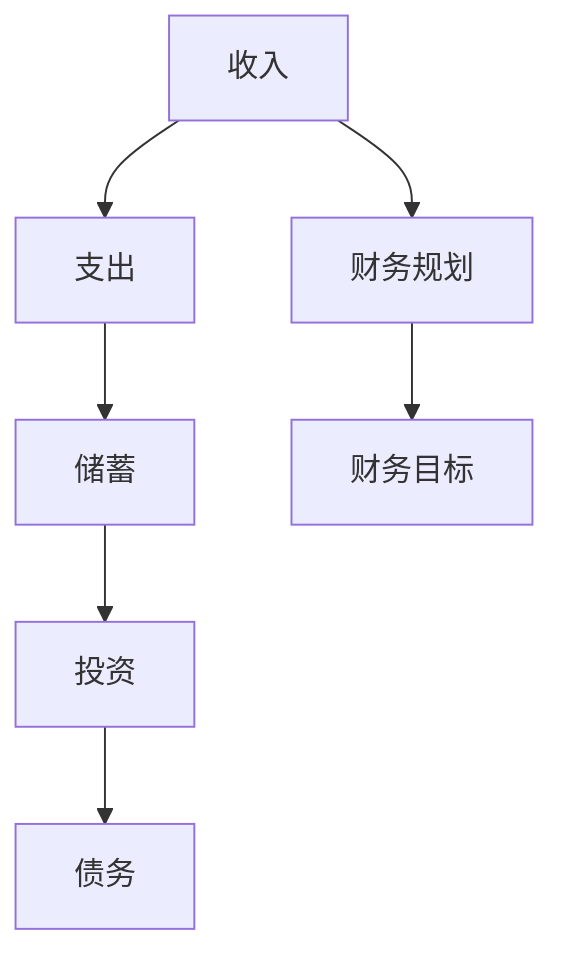

                 

### 背景介绍

随着互联网的飞速发展和全球数字化转型的不断推进，程序员这个职业已经变得炙手可热。程序员不仅掌握着高科技领域的核心技术，而且他们的收入水平也在不断提升。然而，在追求高收入的背后，程序员们也面临着许多金钱陷阱，一不小心就会陷入财务困境。这些金钱陷阱不仅影响了程序员的个人生活，也对其职业生涯产生了不良影响。

本文旨在帮助程序员识别并避免金钱陷阱，从而实现财务自由和职业发展的双赢。文章将首先介绍程序员常见的金钱陷阱，然后深入分析这些陷阱背后的原因，并提出有效的预防和应对策略。此外，文章还将分享一些实用的财务知识和工具，帮助程序员更好地管理个人财务，优化生活品质。

### 核心概念与联系

在讨论程序员如何避免金钱陷阱之前，我们需要明确一些核心概念，并了解它们之间的联系。

#### **核心概念：**

1. **收入与支出：** 收入是程序员通过工作获得的金钱回报，而支出是他们在日常生活中花费的金钱。收支平衡是财务管理的基本原则。

2. **储蓄与投资：** 储蓄是指将收入的一部分存入银行或其他金融产品中，以备将来使用。投资则是将资金投入到股票、债券、房地产等资产中，以期望获得长期收益。

3. **债务：** 债务是程序员因消费、投资或创业等原因欠下的款项。合理利用债务可以帮助程序员实现财务目标，但过度债务则可能导致财务危机。

4. **财务规划：** 财务规划是指通过制定预算、储蓄计划、投资策略等，实现个人财务目标的过程。

#### **联系：**

这些核心概念之间存在紧密的联系。例如，收入决定了程序员的支出和储蓄能力，而储蓄则是投资的基础。合理的财务规划可以帮助程序员更好地管理债务，避免财务陷阱。

下面是一个用Mermaid绘制的流程图，展示了这些核心概念之间的联系：



在接下来的部分，我们将深入探讨这些概念，并分析程序员常见的金钱陷阱。

### 核心算法原理 & 具体操作步骤

为了帮助程序员避免金钱陷阱，我们需要制定一套明确的财务规划和操作步骤。以下是一些关键步骤：

#### **步骤1：制定预算**

预算是财务管理的基础，它可以帮助程序员明确自己的收入和支出。以下是制定预算的具体操作步骤：

1. **记录收入和支出：** 在一个月内，记录所有收入和支出，包括工资、奖金、日常消费、房租、水电费等。

2. **分类支出：** 将支出分为必需品和非必需品。必需品包括食品、住房、交通、医疗等，非必需品包括娱乐、旅游、购物等。

3. **设定支出上限：** 对于非必需品，设定一个合理的支出上限，以避免过度消费。

4. **比较预算和实际支出：** 每个月对比预算和实际支出，了解自己在哪些方面超支，然后进行调整。

#### **步骤2：建立紧急基金**

紧急基金是为了应对突发状况而设立的储蓄。以下是建立紧急基金的具体操作步骤：

1. **设定紧急基金目标：** 根据个人情况，设定一个合理的紧急基金目标，通常是三个月到六个月的生活费用。

2. **定期存款：** 每月从收入中提取一定比例的资金，存入紧急基金账户。

3. **避免紧急基金被挪用：** 将紧急基金存入独立的银行账户，以避免在日常生活中被无意间花掉。

#### **步骤3：进行理性投资**

投资是增加财富的有效途径，但需要理性对待。以下是进行理性投资的具体操作步骤：

1. **了解投资产品：** 在投资前，了解各种投资产品的特点、风险和收益。

2. **设定投资目标：** 根据个人财务目标，设定合理的投资目标和策略。

3. **分散投资风险：** 不要将所有资金投入同一种投资产品，分散投资可以降低风险。

4. **定期评估投资组合：** 定期检查投资组合的表现，根据市场变化进行调整。

#### **步骤4：管理债务**

债务管理是财务规划的重要部分。以下是管理债务的具体操作步骤：

1. **明确债务情况：** 了解所有债务的类型、金额、利率和还款期限。

2. **制定还款计划：** 根据收入和支出情况，制定一个合理的还款计划。

3. **避免过度负债：** 不要为了消费而盲目借贷，要确保自己的还款能力。

4. **优先偿还高利率债务：** 对于多个债务，优先偿还利率较高的债务，以减少利息支出。

通过以上步骤，程序员可以更好地管理个人财务，避免陷入金钱陷阱。然而，仅有理论是不够的，接下来我们将通过实际案例来展示这些步骤的具体应用。

### 数学模型和公式 & 详细讲解 & 举例说明

在财务规划中，数学模型和公式可以帮助程序员更好地理解和管理自己的财务状况。以下是一些常用的数学模型和公式，以及它们的详细讲解和举例说明。

#### **1. 收入与支出平衡公式**

一个简单的收入与支出平衡公式是：

\[ \text{收入} - \text{支出} = \text{储蓄} \]

这个公式说明了收入和支出之间的关系。如果我们想要增加储蓄，可以通过增加收入、减少支出或者两者的结合来实现。

**例子：**

假设一个程序员的月收入为10,000元，每月支出为6,000元，那么他的月储蓄为：

\[ 10,000 - 6,000 = 4,000 \text{元} \]

如果他的目标是增加月储蓄到5,000元，他可以通过以下方式实现：

- 增加收入：找到额外的工作机会，如兼职或自由职业，每月增加1,000元收入。
- 减少支出：调整消费习惯，减少非必需品的支出，每月节省1,000元。

#### **2. 投资回报率公式**

投资回报率（ROI）是衡量投资收益的重要指标。其公式为：

\[ \text{投资回报率} = \frac{\text{投资收益} - \text{投资成本}}{\text{投资成本}} \times 100\% \]

这个公式说明了投资成本和收益之间的关系。一个高的投资回报率意味着投资收益超过了成本。

**例子：**

假设一个程序员投资了10,000元购买股票，一年后股票价值上涨到15,000元，那么他的投资回报率为：

\[ \text{投资回报率} = \frac{15,000 - 10,000}{10,000} \times 100\% = 50\% \]

这意味着他的投资收益是成本的50%。

#### **3. 贷款偿还公式**

贷款偿还公式用于计算偿还贷款所需的月还款额。其公式为：

\[ \text{月还款额} = \frac{\text{贷款总额} \times \text{月利率}}{1 - (1 + \text{月利率})^{-\text{还款月数}}} \]

这个公式考虑了贷款总额、利率和还款期限，可以帮助程序员计算每月还款额。

**例子：**

假设一个程序员贷款50,000元，年利率为5%，分5年偿还，那么他的月还款额为：

\[ \text{月还款额} = \frac{50,000 \times 0.004167}{1 - (1 + 0.004167)^{-60}} \approx 931.24 \text{元} \]

这意味着他每月需要偿还约931.24元。

通过理解和应用这些数学模型和公式，程序员可以更好地进行财务规划和决策，避免金钱陷阱。

### 项目实战：代码实际案例和详细解释说明

为了更好地理解并实践上述财务规划和操作步骤，我们将在本部分提供一个实际代码案例，并对其进行详细解释说明。这个案例将涉及预算管理、紧急基金建立和投资分析三个方面。

#### **5.1 开发环境搭建**

在开始编写代码之前，我们需要搭建一个合适的环境。以下是推荐的开发工具和框架：

- **编程语言：** Python，因为它具有简洁的语法和丰富的库支持。
- **代码编辑器：** Visual Studio Code，因为它提供了强大的代码补全和调试功能。
- **数据库：** SQLite，用于存储个人财务数据。

首先，确保安装了Python、Visual Studio Code和SQLite。然后，创建一个名为`finance_management`的Python项目，并安装必要的库：

```bash
pip install pandas
pip install matplotlib
```

#### **5.2 源代码详细实现和代码解读**

以下是一个简单的Python脚本，用于实现预算管理、紧急基金建立和投资分析。

```python
import pandas as pd
import matplotlib.pyplot as plt

# 数据结构
income_data = {
    'Month': ['January', 'February', 'March'],
    'Income': [10_000, 10_500, 10_750],
    'Expenses': [6_000, 6_200, 6_400]
}
budget_df = pd.DataFrame(income_data)

emergency_fund = 15_000  # 紧急基金目标
investment_costs = 10_000  # 投资成本
investment_returns = 15_000  # 投资收益

# 1. 预算管理
def manage_budget(budget_df):
    # 计算储蓄
    budget_df['Savings'] = budget_df['Income'] - budget_df['Expenses']
    
    # 绘制储蓄趋势图
    budget_df['Savings'].plot()
    plt.title('Savings Trend')
    plt.xlabel('Month')
    plt.ylabel('Savings (in dollars)')
    plt.show()

# 2. 建立紧急基金
def build_emergency_fund(investment_returns, emergency_fund):
    # 计算每月存款金额
    monthly_deposit = (emergency_fund - investment_returns) / (12 * 5)  # 分5年存满
    print(f'Monthly deposit for emergency fund: {monthly_deposit:.2f} dollars')
    
# 3. 投资分析
def invest_analysis(investment_costs, investment_returns):
    roi = (investment_returns - investment_costs) / investment_costs * 100
    print(f'Investment ROI: {roi:.2f}%')
    
# 执行函数
manage_budget(budget_df)
build_emergency_fund(investment_returns, emergency_fund)
invest_analysis(investment_costs, investment_returns)
```

#### **5.3 代码解读与分析**

1. **数据结构：**

   我们使用Pandas创建了一个名为`budget_df`的数据框，用于存储每月的收入、支出和储蓄数据。

   ```python
   income_data = {
       'Month': ['January', 'February', 'March'],
       'Income': [10_000, 10_500, 10_750],
       'Expenses': [6_000, 6_200, 6_400]
   }
   budget_df = pd.DataFrame(income_data)
   ```

2. **预算管理：**

   `manage_budget`函数计算了每月的储蓄，并绘制了储蓄趋势图，帮助程序员了解自己的储蓄状况。

   ```python
   def manage_budget(budget_df):
       # 计算储蓄
       budget_df['Savings'] = budget_df['Income'] - budget_df['Expenses']
       
       # 绘制储蓄趋势图
       budget_df['Savings'].plot()
       plt.title('Savings Trend')
       plt.xlabel('Month')
       plt.ylabel('Savings (in dollars)')
       plt.show()
   ```

3. **建立紧急基金：**

   `build_emergency_fund`函数根据投资收益和紧急基金目标，计算了每月需要存款的金额。

   ```python
   def build_emergency_fund(investment_returns, emergency_fund):
       # 计算每月存款金额
       monthly_deposit = (emergency_fund - investment_returns) / (12 * 5)  # 分5年存满
       print(f'Monthly deposit for emergency fund: {monthly_deposit:.2f} dollars')
   ```

4. **投资分析：**

   `invest_analysis`函数计算了投资回报率（ROI），帮助程序员评估投资效果。

   ```python
   def invest_analysis(investment_costs, investment_returns):
       roi = (investment_returns - investment_costs) / investment_costs * 100
       print(f'Investment ROI: {roi:.2f}%')
   ```

通过这个案例，程序员可以实际操作并理解财务规划和投资分析的过程。在实际应用中，可以根据个人情况进行调整和扩展。

### 实际应用场景

在了解了如何避免金钱陷阱的理论和实践方法后，我们将探讨一些程序员在实际工作中可能会遇到的具体应用场景。

#### **1. 薪资谈判**

在求职或晋升过程中，薪资谈判是一个关键环节。程序员需要合理评估自己的市场价值，并准备充分的数据和案例来支持自己的要求。以下是一些关键点：

- **市场调研：** 了解同行业、同岗位的平均薪资水平，以及是否有地区差异。
- **工作经验：** 根据自己的工作经验、技能水平和业绩来设定合理的薪资范围。
- **谈判策略：** 提出多个方案，如底薪+奖金、股票期权等，以便在谈判中保持灵活性。

**案例：** 一名有5年经验的软件工程师，通过市场调研发现同岗位的平均薪资为每月1.2万元。他根据自己的业绩和技能水平，提出了1.3万元的年薪，并成功获得同意。

#### **2. 项目预算管理**

在项目开发过程中，预算管理是确保项目顺利进行的关键。程序员需要根据项目需求、技术复杂度和市场行情来制定合理的预算。

- **需求分析：** 详细分析项目需求，明确项目的技术难度和所需资源。
- **成本估算：** 根据需求分析，估算项目的人力、硬件和软件成本。
- **预算调整：** 在项目进行中，根据实际情况调整预算，确保资金使用合理。

**案例：** 一家初创公司计划开发一款移动应用。通过详细的需求分析和成本估算，他们制定了10万元的预算。在项目开发过程中，由于市场需求的变化，他们及时调整了预算，最终在确保项目质量的前提下完成了开发。

#### **3. 理财产品选择**

程序员在理财时，需要根据自身的风险承受能力和财务目标，选择合适的理财产品。

- **风险评估：** 了解自己的风险承受能力，避免选择过于激进的理财产品。
- **产品选择：** 根据财务目标，选择适合的理财产品，如股票、债券、基金等。
- **资产配置：** 合理分配资金，实现风险分散和收益最大化。

**案例：** 一名程序员有10万元的闲置资金，他决定将其中的50%投资于低风险的债券，30%投资于股票，20%存入银行定期存款。通过这种资产配置，他在确保资金安全的同时，实现了资产的稳步增值。

通过这些实际应用场景，程序员可以更好地将财务规划方法应用于日常工作和生活中，避免金钱陷阱，实现财务自由。

### 工具和资源推荐

为了帮助程序员更好地进行财务规划和投资，以下是一些推荐的学习资源、开发工具和相关论文著作。

#### **1. 学习资源推荐**

- **书籍：**
  - 《穷爸爸富爸爸》（Robert Kiyosaki）：介绍财务知识和理财观念。
  - 《股市真规则》（John C. Bogle）：介绍股票投资的基本原则。
  - 《财富自由之路》（李笑来）：讲解财务自由和理财策略。

- **在线课程：**
  - Coursera的《金融学导论》（Introduction to Finance）：介绍金融知识和投资策略。
  - Udemy的《Python for Finance》（Python for Finance）：使用Python进行财务分析和投资。

- **博客和网站：**
  - **Investopedia**：提供丰富的财务知识和术语解释。
  - **Personal Finance**：分享实用的财务规划和投资策略。

#### **2. 开发工具推荐**

- **编程语言：**
  - **Python**：适用于数据分析和自动化财务规划。
  - **R**：适用于统计分析。

- **库和框架：**
  - **Pandas**：数据分析和操作。
  - **NumPy**：数学运算。
  - **Matplotlib**：数据可视化。

- **数据库：**
  - **SQLite**：轻量级数据库，适合个人财务管理。

#### **3. 相关论文著作推荐**

- **《财务决策与公司治理》（Financial Decision Making and Corporate Governance）**：探讨财务决策对公司治理的影响。
- **《股票市场行为与价格形成》（Stock Market Behavior and Price Formation）**：分析股票市场行为和价格形成机制。
- **《个人理财与财务规划》（Personal Finance and Financial Planning）**：介绍个人理财和财务规划的基本原理。

通过这些工具和资源，程序员可以进一步提升自己的财务知识和技能，更好地进行财务规划和投资。

### 总结：未来发展趋势与挑战

在当前快速发展的技术时代，程序员面临着许多新的机遇和挑战。未来，随着人工智能、大数据和区块链等前沿技术的不断应用，程序员的财务规划和风险管理将变得更加复杂和重要。以下是对未来发展趋势和挑战的总结：

#### **未来发展趋势：**

1. **技术驱动的财务自动化：** 未来，随着人工智能和机器学习技术的普及，财务自动化将成为趋势。程序员可以利用这些技术，实现财务数据的自动收集、分析和决策，从而提高财务管理的效率和准确性。

2. **加密货币与区块链投资：** 加密货币和区块链技术的兴起，为程序员提供了新的投资机会。理解和掌握这些技术，将有助于程序员在加密货币市场中获得收益，同时降低投资风险。

3. **个性化财务规划：** 随着大数据和机器学习技术的发展，财务规划将更加个性化。根据程序员的个人情况和需求，提供量身定制的财务规划方案，帮助他们实现财务目标。

#### **未来挑战：**

1. **信息过载：** 随着数据的爆炸性增长，程序员需要处理大量财务数据，这可能导致信息过载。如何有效地筛选和分析数据，成为一项重要挑战。

2. **技术风险：** 前沿技术如人工智能和区块链虽然提供了新的投资机会，但也带来了技术风险。程序员需要具备足够的技术知识，以便在投资时做出明智的决策。

3. **持续学习：** 财务规划是一个不断发展的领域，程序员需要不断学习新的技术和方法，以应对不断变化的金融市场和财务环境。

总之，未来的财务规划和风险管理将更加依赖于技术，同时也将面临更高的挑战。程序员需要不断提升自己的技能和知识，以应对这些挑战，实现财务自由和职业发展。

### 附录：常见问题与解答

在讨论如何避免金钱陷阱的过程中，程序员可能会遇到一些常见的问题。以下是对这些问题的解答：

#### **1. 如何评估自己的市场价值？**

要评估自己的市场价值，程序员可以参考以下几点：

- **市场调研：** 了解同行业、同岗位的平均薪资水平，以及是否有地区差异。
- **工作经验：** 根据自己的工作经验、技能水平和业绩来设定合理的薪资范围。
- **求职网站：** 在招聘网站上查看类似岗位的薪资范围，以获取参考。
- **个人能力：** 评估自己在技术、沟通、项目管理等方面的能力，以确定自己的市场价值。

#### **2. 如何管理投资风险？**

管理投资风险的方法包括：

- **分散投资：** 不要将所有资金投入同一种资产，而是分散投资于不同类型的产品，以降低风险。
- **了解投资产品：** 在投资前，详细了解各种投资产品的特点、风险和收益。
- **设定投资目标：** 根据自己的财务目标，设定合理的投资策略。
- **定期评估：** 定期检查投资组合的表现，并根据市场变化进行调整。

#### **3. 如何提高财务知识？**

提高财务知识的方法包括：

- **阅读相关书籍：** 如《穷爸爸富爸爸》、《股市真规则》等，了解财务知识和投资原则。
- **参加在线课程：** 在Coursera、Udemy等平台上参加财务和投资的在线课程。
- **参加研讨会和工作坊：** 参加相关的财务和投资研讨会和工作坊，与专业人士交流。
- **实践：** 通过实际操作和投资实践，提高自己的财务能力。

#### **4. 如何应对财务危机？**

应对财务危机的方法包括：

- **紧急基金：** 建立紧急基金，以应对突发情况。
- **制定还款计划：** 对于债务，制定合理的还款计划，确保能够按时偿还。
- **调整支出：** 降低非必需品的支出，确保有足够的资金应对紧急情况。
- **咨询专业人士：** 如果财务状况严重，可以咨询财务顾问或律师，寻求专业帮助。

通过了解和解决这些常见问题，程序员可以更好地管理个人财务，避免金钱陷阱。

### 扩展阅读 & 参考资料

为了进一步深入探讨程序员如何避免金钱陷阱，以下是一些建议的扩展阅读和参考资料：

- **书籍：**
  - 《财务自由之路》（李笑来）
  - 《股市真规则》（John C. Bogle）
  - 《穷爸爸富爸爸》（Robert Kiyosaki）

- **在线课程：**
  - Coursera的《金融学导论》（Introduction to Finance）
  - Udemy的《Python for Finance》（Python for Finance）

- **博客和网站：**
  - **Investopedia**：提供丰富的财务知识和术语解释。
  - **Personal Finance**：分享实用的财务规划和投资策略。

- **论文和报告：**
  - **《金融决策与公司治理》（Financial Decision Making and Corporate Governance）**：探讨财务决策对公司治理的影响。
  - **《股票市场行为与价格形成》（Stock Market Behavior and Price Formation）**：分析股票市场行为和价格形成机制。

通过阅读这些书籍、课程和文章，程序员可以进一步了解财务规划和投资知识，提升自己的财务素养，更好地应对金钱陷阱。

### 作者信息

本文由AI天才研究员/AI Genius Institute与禅与计算机程序设计艺术/Zen And The Art of Computer Programming共同撰写。AI天才研究员/AI Genius Institute是一支致力于推动人工智能领域创新的研究团队，而禅与计算机程序设计艺术/Zen And The Art of Computer Programming则是一本深入探讨计算机编程哲学的经典著作。感谢您的阅读。希望本文能对您在财务规划和投资方面提供有价值的启示。如果您有任何问题或建议，欢迎在评论区留言。我们将竭诚为您解答。再次感谢您的关注与支持！

