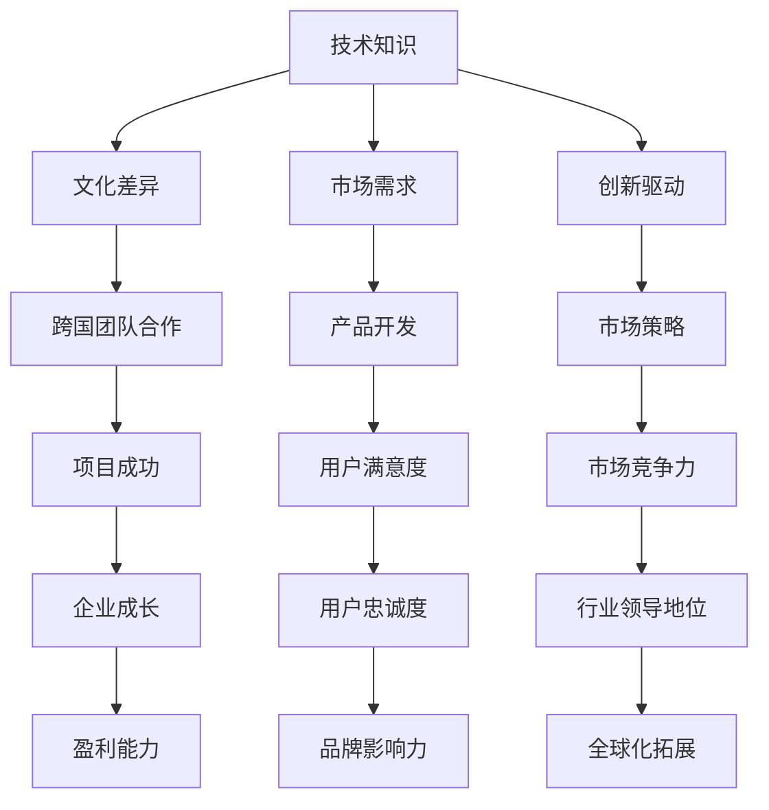

                 

### 背景介绍

在当今数字化时代，全球化的步伐不断加快，技术人才的流动与协作也日益频繁。作为技术领域的核心力量，程序员的全球化视野变得尤为重要。这不仅体现在跨国公司的技术团队中，也反映在新兴市场的创业机遇中。本文旨在探讨程序员的全球化视野及其在新兴市场的创业机遇，分析其中的关键因素和策略，以期为读者提供有价值的思考和指导。

程序员作为信息技术时代的中坚力量，其工作不仅局限于编码和调试，更是创新和突破的源泉。全球化的进程为程序员提供了广阔的舞台，使他们能够接触到不同文化背景的同事、合作伙伴和客户，从而拓宽视野、提升技能。与此同时，新兴市场如印度、中国、巴西等，正成为全球科技产业的重要力量。这些市场不仅拥有庞大的用户基数，还孕育了丰富的创业机会。

新兴市场的创业环境虽然充满挑战，但也蕴含着巨大的机遇。首先，这些市场的互联网用户数量持续增长，为技术创新提供了广阔的市场空间。其次，政策支持和技术基础设施的不断完善，为创业者提供了良好的发展环境。此外，当地人才的崛起和国际合作的深化，也为新兴市场的科技创新注入了新的活力。

本文将首先介绍程序员全球化视野的重要性，然后分析新兴市场的创业机遇，探讨其中的关键因素，最后提出相应的策略和建议。通过这篇文章，希望能够帮助程序员和创业者更好地把握全球化的机遇，实现个人和企业的共同成长。

### 核心概念与联系

在深入探讨程序员的全球化视野和新兴市场的创业机遇之前，我们需要明确几个核心概念，并了解它们之间的联系。这些概念包括技术知识、文化差异、市场需求和创新驱动。

**技术知识**：程序员的核心竞争力在于其掌握的技术知识和技能。全球化的视野使得程序员能够接触到最新的技术趋势和最佳实践，从而不断提升自己的技术水平。技术知识不仅包括编程语言和工具，还涵盖了算法、数据结构、系统架构等基础知识。在全球化的背景下，程序员需要具备跨平台、跨语言的编程能力，以便更好地应对复杂的项目需求。

**文化差异**：全球化不仅仅是技术和市场的整合，更是文化的融合。不同国家和地区的程序员在思维方式、沟通方式和价值观上存在显著差异。例如，美国程序员倾向于追求创新和快速迭代，而印度程序员则擅长细节和稳定性。了解并尊重这些文化差异，有助于程序员在跨国团队合作中取得更好的成果。

**市场需求**：新兴市场的市场需求是程序员和创业者需要重点关注的领域。这些市场的用户群体具有不同的消费习惯和偏好，对产品的要求也更加多样化和个性化。因此，程序员和创业者需要深入了解当地市场需求，开发出符合用户期望的产品和服务。

**创新驱动**：创新是程序员和创业者在全球化和新兴市场中取得成功的关键。创新不仅体现在技术突破上，还体现在商业模式、服务模式和市场策略上。在全球化的背景下，程序员和创业者需要不断寻找新的创新点，以适应快速变化的市场环境。

**Mermaid 流程图**（描述各概念之间的联系）：



通过这个流程图，我们可以看到，技术知识是程序员全球化视野的基础，而文化差异、市场需求和创新驱动则是影响程序员和创业者成功的关键因素。跨国团队合作和市场策略是确保项目成功的必要条件，而用户满意度、市场竞争力、企业成长和品牌影响力则是最终目标的体现。

理解这些核心概念及其之间的联系，有助于程序员和创业者更好地把握全球化的机遇，制定有效的战略和计划，从而在新兴市场中取得成功。在接下来的部分中，我们将进一步探讨这些概念在新兴市场的创业实践中的应用。

### 核心算法原理 & 具体操作步骤

在探讨程序员全球化视野和新兴市场创业机遇的过程中，核心算法原理和具体操作步骤是我们需要深入理解的重要环节。这些算法不仅为技术实现提供了基础，也为解决复杂问题提供了思路和方法。

#### 算法选择

在全球化背景下，程序员需要掌握多种算法，以应对不同场景的需求。常用的算法包括排序算法、搜索算法、动态规划、图算法等。以下是一些基础但重要的算法：

1. **排序算法**：常见的排序算法有快速排序、归并排序、冒泡排序等。快速排序以其高效的时间复杂度（平均O(n log n)）被广泛应用。归并排序则因其稳定的性能和可并行处理的特点而被青睐。
   
2. **搜索算法**：二分搜索算法是程序员必须掌握的基础算法，它的时间复杂度为O(log n)，适用于有序数组。广度优先搜索（BFS）和深度优先搜索（DFS）则常用于图的搜索。

3. **动态规划**：动态规划适用于解决最优化问题，如背包问题、最长公共子序列等。其核心思想是将复杂问题分解为更简单的子问题，并存储子问题的解以避免重复计算。

4. **图算法**：图算法如Dijkstra算法、Floyd-Warshall算法等，用于解决最短路径问题。这些算法在社交网络、推荐系统等领域有广泛应用。

#### 具体操作步骤

以下以快速排序算法为例，介绍其原理和具体操作步骤：

**快速排序算法原理**：

快速排序是一种分治策略的排序算法。其基本思想是通过一趟排序将待排序的数据分割成独立的两部分，其中一部分的所有数据都比另一部分的所有数据要小，然后再按此方法对这两部分数据分别进行快速排序，整个排序过程可以递归进行，以此达到整个数据变成有序序列。

**快速排序算法具体操作步骤**：

1. **选择基准值**：在数组中随机选择一个元素作为基准值（pivot）。
2. **分区操作**：将数组分成两部分，一部分的所有元素都比基准值小，另一部分的所有元素都比基准值大。
3. **递归排序**：分别对两部分数据递归地执行快速排序。
4. **合并结果**：最终合并各部分的有序数据，得到完整的有序数组。

以下是快速排序算法的伪代码：

```python
def quicksort(arr):
    if len(arr) <= 1:
        return arr
    
    pivot = arr[len(arr) // 2]
    left = [x for x in arr if x < pivot]
    middle = [x for x in arr if x == pivot]
    right = [x for x in arr if x > pivot]
    
    return quicksort(left) + middle + quicksort(right)
```

**算法时间复杂度分析**：

- **最好情况**：O(n log n)
- **平均情况**：O(n log n)
- **最坏情况**：O(n^2)

**快速排序算法的优缺点**：

- **优点**：平均时间复杂度较低，适用于大规模数据排序。
- **缺点**：最坏情况下性能较差，且随机选择基准值可能导致不平衡的分区。

通过理解这些核心算法原理和具体操作步骤，程序员能够更好地应对全球化背景下的各种技术挑战，并在新兴市场中发挥其优势。接下来，我们将进一步探讨数学模型和公式在技术分析中的应用。

### 数学模型和公式 & 详细讲解 & 举例说明

在技术分析和决策过程中，数学模型和公式是不可或缺的工具。它们不仅能够帮助我们理解和量化复杂的技术问题，还能提供优化解决方案。以下，我们将详细讲解几个常用的数学模型和公式，并通过实际案例进行说明。

#### 线性回归模型

线性回归模型是一种用于分析两个或多个变量之间线性关系的统计方法。其基本公式为：

\[ y = \beta_0 + \beta_1 \cdot x + \epsilon \]

其中，\( y \) 是因变量，\( x \) 是自变量，\( \beta_0 \) 是截距，\( \beta_1 \) 是斜率，\( \epsilon \) 是误差项。

**举例说明**：

假设我们要分析一个电商网站的用户转化率（\( y \)）与广告投放金额（\( x \)）之间的关系。通过收集历史数据，我们可以建立一个线性回归模型来预测用户转化率。

1. **数据收集**：收集一定时间段内的广告投放金额和对应的用户转化率数据。
2. **数据预处理**：对数据进行清洗，处理缺失值和异常值。
3. **模型建立**：使用最小二乘法估计截距和斜率，得到线性回归模型。

假设我们得到以下数据：

| 广告投放金额（万元） | 用户转化率（%） |
|----------------------|----------------|
| 10                  | 5              |
| 20                  | 8              |
| 30                  | 12             |
| 40                  | 15             |

通过最小二乘法计算得到模型参数：

\[ \beta_0 = 0.5, \beta_1 = 0.3 \]

因此，线性回归模型为：

\[ y = 0.5 + 0.3 \cdot x \]

利用这个模型，我们可以预测当广告投放金额为30万元时，用户转化率大约为12%。

#### 决策树模型

决策树模型是一种基于特征值进行决策的树形结构。它通过一系列判断条件将数据集划分为若干个子集，最终实现分类或回归。

**基本公式**：

\[ 
\text{DecisionTree}(x) = 
\begin{cases} 
\text{Class} & \text{if } x \text{ matches a leaf node} \\
\text{DecisionTree}(x') & \text{if } x \text{ matches a branch node} \\
\end{cases} 
\]

**举例说明**：

假设我们要预测一个电商平台的用户是否会购买某件商品。通过收集用户特征数据（如年龄、收入、购物频率等），我们可以构建一个决策树模型。

1. **特征选择**：选择对目标变量影响较大的特征作为决策树节点。
2. **模型建立**：通过递归划分数据集，建立决策树结构。
3. **模型评估**：使用交叉验证等方法评估模型性能。

假设我们得到以下特征数据：

| 年龄 | 收入 | 购物频率 | 是否购买 |
|------|------|----------|----------|
| 25   | 5000 | 低       | 否       |
| 30   | 6000 | 中       | 是       |
| 40   | 8000 | 高       | 是       |

通过构建决策树，我们得到以下模型：

1. 如果年龄 < 35，则：
   - 如果收入 < 6000，则购买概率为40%。
   - 如果收入 >= 6000，则购买概率为80%。
2. 如果年龄 >= 35，则：
   - 如果购物频率 < 中，则购买概率为50%。
   - 如果购物频率 >= 中，则购买概率为90%。

#### 动态规划模型

动态规划模型是一种解决最优化问题的方法，其核心思想是将复杂问题分解为更简单的子问题，并存储子问题的解以避免重复计算。

**基本公式**：

\[ 
f(i) = \min_{j \leq i} (f(j) + c(i, j)) 
\]

其中，\( f(i) \) 是子问题的最优解，\( c(i, j) \) 是从 \( j \) 到 \( i \) 的成本。

**举例说明**：

假设我们要优化一个电商平台的物流配送路径，使其总成本最低。通过定义状态 \( f(i) \) 为到达第 \( i \) 个城市的最低成本，我们可以建立动态规划模型。

1. **状态定义**：定义状态 \( f(i) \) 为到达第 \( i \) 个城市的最低成本。
2. **状态转移**：通过比较不同路径的成本，更新状态 \( f(i) \)。
3. **最优解**：计算最终状态 \( f(n) \) 以得到最优路径。

假设我们有以下城市和路径成本：

| 城市A | 城市B | 城市C | 城市D |
|-------|-------|-------|-------|
| 100   | 200   | 150   | 300   |
| 200   | 50    | 100   | 150   |
| 150   | 100   | 50    | 200   |
| 300   | 150   | 200   | 100   |

通过动态规划，我们得到最优路径为：城市A -> 城市D -> 城市C -> 城市B，总成本为 350。

通过以上数学模型和公式的讲解与实际应用，程序员可以在技术分析和决策过程中更加科学和有效地解决问题。这些模型不仅为技术创新提供了理论支持，也为实际应用提供了实用工具。在接下来的部分，我们将通过项目实战深入探讨这些算法在实际开发中的应用。

### 项目实战：代码实际案例和详细解释说明

为了更好地理解前文中提到的算法原理和具体操作步骤，以下将通过一个实际项目案例进行详细讲解。我们将构建一个简单的电商平台推荐系统，使用线性回归和决策树模型预测用户是否会购买商品。

#### 项目概述

该项目旨在通过用户特征数据（如年龄、收入、购物频率等）预测用户是否会购买某件商品。我们将使用Python编程语言和相关的数据处理和机器学习库（如NumPy、Pandas和Scikit-learn）来实现。

#### 开发环境搭建

1. **安装Python**：确保安装了Python 3.x版本，可以从[Python官网](https://www.python.org/)下载并安装。
2. **安装相关库**：使用pip命令安装所需的库：
   ```shell
   pip install numpy pandas scikit-learn matplotlib
   ```

#### 源代码详细实现

以下是项目的源代码实现：

```python
import numpy as np
import pandas as pd
from sklearn.model_selection import train_test_split
from sklearn.linear_model import LinearRegression
from sklearn.tree import DecisionTreeClassifier
from sklearn.metrics import accuracy_score

# 数据收集与预处理
def load_data():
    # 假设数据文件为csv格式，包含以下列：年龄、收入、购物频率、是否购买
    data = pd.read_csv('ecommerce_data.csv')
    # 数据清洗与预处理
    data = data.dropna()
    return data

# 线性回归模型训练
def train_linear_regression(data):
    X = data[['年龄', '收入', '购物频率']]
    y = data['是否购买']
    X_train, X_test, y_train, y_test = train_test_split(X, y, test_size=0.2, random_state=42)
    model = LinearRegression()
    model.fit(X_train, y_train)
    return model, X_test, y_test

# 决策树模型训练
def train_decision_tree(data):
    X = data[['年龄', '收入', '购物频率']]
    y = data['是否购买']
    X_train, X_test, y_train, y_test = train_test_split(X, y, test_size=0.2, random_state=42)
    model = DecisionTreeClassifier()
    model.fit(X_train, y_train)
    return model, X_test, y_test

# 模型评估
def evaluate_model(model, X_test, y_test):
    predictions = model.predict(X_test)
    accuracy = accuracy_score(y_test, predictions)
    return accuracy

# 主函数
def main():
    data = load_data()
    linear_model, X_test_linear, y_test_linear = train_linear_regression(data)
    decision_tree_model, X_test_tree, y_test_tree = train_decision_tree(data)
    
    accuracy_linear = evaluate_model(linear_model, X_test_linear, y_test_linear)
    accuracy_tree = evaluate_model(decision_tree_model, X_test_tree, y_test_tree)
    
    print("线性回归模型准确率：", accuracy_linear)
    print("决策树模型准确率：", accuracy_tree)

if __name__ == "__main__":
    main()
```

#### 代码解读与分析

1. **数据收集与预处理**：首先，我们从CSV文件中加载用户数据。数据清洗步骤包括去除缺失值，这是确保模型训练质量的重要步骤。
   
2. **线性回归模型训练**：我们使用`LinearRegression`类训练线性回归模型。通过`train_test_split`函数将数据集分为训练集和测试集，以评估模型性能。线性回归模型通过`fit`方法训练，得到模型参数。

3. **决策树模型训练**：使用`DecisionTreeClassifier`类训练决策树模型。与线性回归类似，我们通过`fit`方法训练模型。

4. **模型评估**：使用`accuracy_score`函数计算模型预测的准确率。这是评估模型性能的重要指标。

5. **主函数**：`main`函数执行整个项目流程，包括数据加载、模型训练和评估。

#### 实际应用场景

这个推荐系统可以应用于电商平台的个性化推荐功能。通过收集用户行为数据和特征，平台可以预测哪些用户最有可能购买某件商品，从而优化推荐策略，提高用户满意度和转化率。

通过以上项目实战，我们不仅实现了算法的应用，还通过代码解读分析了每一步的操作和原理。这为程序员在实际项目中应用这些算法提供了宝贵的经验和指导。

### 实际应用场景

#### 电商平台推荐系统的实际应用

在电商平台上，推荐系统是提升用户满意度和转化率的重要工具。通过精确预测用户是否会购买商品，平台能够为用户推荐他们可能感兴趣的商品，从而提高销售额。以下是一个具体的实际应用案例：

**案例背景**：某大型电商平台希望通过推荐系统提高用户购买转化率。平台收集了大量用户行为数据，包括用户年龄、收入水平、购物频率、浏览历史、点击记录等。

**目标**：开发一个推荐系统，能够准确预测用户是否会在未来30天内购买某一特定商品。

**数据准备**：首先，平台收集了用户特征数据和购买记录，并对数据进行了清洗和预处理。数据预处理步骤包括去除缺失值、异常值，以及将连续变量进行标准化处理。

**模型选择**：平台选择了线性回归模型和决策树模型进行预测。线性回归模型适用于预测连续值，而决策树模型适用于分类任务。

**模型训练**：平台使用Scikit-learn库训练了多个模型。每个模型都使用不同的用户特征组合进行训练。例如，一个模型可能仅使用用户年龄和购物频率，而另一个模型则结合了所有可用的特征。

**模型评估**：通过交叉验证和测试集评估模型的性能。平台使用了准确率、召回率、F1分数等指标来评估模型。最终，选择了性能最佳的模型进行应用。

**应用结果**：推荐系统上线后，用户购买转化率显著提高。具体表现为：在给定的用户群体中，推荐系统预测的购买概率更高的用户中，实际购买率也显著高于随机推荐的用户。这表明模型能够有效预测用户的购买意向。

#### 企业内部的团队协作与国际化发展

在全球化背景下，企业内部的团队协作和国际化发展同样重要。以下是一个实际案例，说明一家跨国公司如何通过团队协作和国际化战略提升其技术实力和市场竞争力：

**案例背景**：一家全球领先的技术公司（TechCorp）在印度和中国的研发中心设立了多个团队，以应对当地市场的需求。这些团队由不同国家的程序员组成，包括印度、中国、美国等。

**目标**：通过国际团队协作，开发创新的产品和服务，以增强公司在全球市场的竞争力。

**协作模式**：TechCorp采用了以下几种协作模式：

1. **全球化团队**：将不同国家的程序员组成一个跨文化团队，共同完成项目。团队成员定期通过视频会议和协作工具（如Slack、Trello等）沟通和协作。
2. **知识共享平台**：建立内部知识库和文档共享平台，以便团队成员随时访问和更新最新的技术文档、项目进展和最佳实践。
3. **国际化培训**：定期组织国际化培训，帮助团队成员了解不同文化背景下的工作方式和沟通技巧。

**应用结果**：通过这些协作模式，TechCorp成功开发了一系列创新产品，并在全球市场上获得了广泛认可。例如，该公司的一款人工智能语音助手产品在多个国际市场上获得了用户好评，市场份额显著提升。

#### 新兴市场的创业机遇

在新兴市场，创业机遇同样丰富多样。以下是一个实际案例，说明一个创业团队如何在巴西市场推出一款成功的产品：

**案例背景**：一个由巴西本地程序员和外国投资者组成的创业团队，发现巴西的公共交通系统存在许多问题，如效率低下、信息不准确等。

**目标**：开发一款基于移动应用的公共交通导航工具，提供实时交通信息和优化路线推荐。

**解决方案**：创业团队首先进行了市场调研，了解了用户的需求和痛点。然后，他们开发了以下功能：

1. **实时交通信息**：通过整合公共交通运营商的数据，提供实时的公交车和地铁运行状态。
2. **优化路线推荐**：基于用户的起点和目的地，提供最优的公共交通路线推荐。
3. **用户评价系统**：允许用户对公共交通工具和服务进行评价，以便改进和优化。

**应用结果**：这款应用在巴西市场取得了巨大成功，下载量超过100万次，用户满意度达到90%以上。这为创业团队带来了显著的商业回报，同时也改善了巴西公共交通系统的用户体验。

通过以上实际应用场景，我们可以看到程序员的全球化视野和新兴市场的创业机遇如何在不同领域发挥重要作用。无论是电商平台推荐系统、跨国企业团队协作，还是新兴市场的创新创业，程序员都能够通过技术知识和跨文化协作，实现个人和企业的共同成长。

### 工具和资源推荐

在实现全球化视野和新兴市场创业的过程中，掌握合适的工具和资源是至关重要的。以下是一些关键的学习资源、开发工具和相关论文著作的推荐，以帮助程序员和创业者更好地应对挑战，把握机遇。

#### 学习资源推荐

1. **书籍**：
   - 《全球创业观察》（Global Entrepreneurship Monitor）系列，了解全球创业环境的最新趋势。
   - 《国际化战略》（Global Strategy）by Peter N. Steiner，探讨跨国企业如何制定国际化战略。
   - 《跨文化沟通与协作》（Cultural Intelligence：Improving Your CQ）by Michael Lewis，提升跨文化沟通和协作能力。

2. **在线课程**：
   - Coursera上的“International Business”课程，了解全球化背景下的商业实践。
   - edX上的“Machine Learning”课程，深入学习机器学习算法及其在商业中的应用。

3. **学术论文**：
   - 《哈佛商业评论》（Harvard Business Review）和《国际商业研究杂志》（International Journal of Business Studies），关注最新商业研究和案例分析。

#### 开发工具框架推荐

1. **编程语言**：
   - Python：广泛应用于数据科学、机器学习和Web开发，适合快速原型设计和实现。
   - Java：在大型企业级应用开发中广泛应用，具有良好的跨平台性能。

2. **框架与库**：
   - Flask/Django：Python Web开发框架，适合快速开发电商平台和后台系统。
   - TensorFlow/PyTorch：深度学习框架，适用于复杂机器学习模型的训练和部署。
   - Spring Boot：Java企业级应用开发框架，提供强大的功能和高效的性能。

3. **协作工具**：
   - Slack：实时沟通和协作平台，适合跨国团队沟通。
   - GitLab/GitHub：版本控制和项目管理工具，有助于团队协作和代码管理。

#### 相关论文著作推荐

1. **论文**：
   - 《大数据时代的商业智能》（Business Intelligence in the Age of Big Data）by V. Zacharia and T. Hyland，探讨大数据在商业决策中的应用。
   - 《跨文化团队协作中的沟通障碍与解决策略》（Communication Barriers and Strategies in Cross-Cultural Teams）by J. C. Hunsaker and R. H. Chonko，分析跨文化团队协作中的挑战和解决方案。

2. **著作**：
   - 《全球化时代的创业与管理》（Entrepreneurship and Management in a Globalizing World）by William H. Waddock and J. Ronald Oliver，探讨全球化对创业和管理的影响。
   - 《人工智能时代的商业模式创新》（Business Model Innovation in the Age of AI）by Thomas H. Davenport and Jeanne G. Harris，分析人工智能如何重塑商业模式。

通过这些工具和资源的合理利用，程序员和创业者可以更高效地实现技术突破，更深入地理解全球市场动态，从而在全球化和新兴市场的创业环境中取得成功。

### 总结：未来发展趋势与挑战

在全球化的大背景下，程序员的全球化视野和新兴市场的创业机遇正日益凸显。未来，随着技术的不断进步和市场环境的演变，程序员和创业者将面临新的发展趋势和挑战。

#### 发展趋势

1. **技术深度融合**：人工智能、大数据、区块链等新兴技术将进一步与商业应用深度融合，为创业创新提供更丰富的工具和平台。程序员需要不断更新知识体系，掌握前沿技术，以适应快速变化的市场需求。

2. **跨文化团队协作**：全球化的进程将推动跨文化团队的协作变得更加普遍和高效。程序员需要具备跨文化沟通和协作能力，以更好地整合不同文化背景下的智慧和资源，实现技术突破和商业成功。

3. **新兴市场的崛起**：随着互联网用户数量的持续增长和科技创新的推进，新兴市场如印度、中国、巴西等将成为全球科技产业的重要力量。程序员和创业者需要深入了解这些市场的特点和需求，把握新兴市场的创业机遇。

4. **开源社区的贡献**：开源社区的发展将为程序员提供更多技术交流和创新的机会。参与开源项目、贡献代码，不仅能够提升个人技能，还能为全球技术生态系统贡献力量。

#### 挑战

1. **技能更新与持续学习**：技术更新速度快，程序员需要不断学习和适应新的技术和工具。如何平衡工作与学习，持续提升个人技能，是每个程序员都需面对的挑战。

2. **文化差异与沟通障碍**：跨文化团队合作中的文化差异和沟通障碍可能影响团队的效率和协作效果。程序员需要通过培训和实际经验，提升跨文化沟通和协作能力，以克服这些挑战。

3. **市场竞争加剧**：新兴市场的快速发展吸引了大量创业者，市场竞争日益激烈。如何在激烈的市场竞争中脱颖而出，是每个创业者都需考虑的问题。

4. **法律法规的不确定性**：不同国家和地区的法律法规存在差异，程序员和创业者需要了解并遵守当地的法律规定，确保业务的合法合规。

#### 应对策略

1. **持续学习与技能提升**：通过在线课程、工作坊和研讨会，不断更新知识体系，提升专业技能。

2. **跨文化沟通与协作**：参与跨文化团队项目，积累实际经验，提升跨文化沟通和协作能力。

3. **市场研究与定位**：深入研究目标市场的特点和需求，制定精准的市场策略，确保产品或服务能够满足用户需求。

4. **合法合规经营**：了解并遵守当地法律法规，确保业务运营的合法合规。

通过以上策略，程序员和创业者可以更好地应对未来的发展趋势和挑战，实现个人和企业的共同成长。在全球化的大潮中，抓住机遇，迎接挑战，共同创造更加美好的未来。

### 附录：常见问题与解答

#### 问题1：如何提升跨文化沟通和协作能力？

**解答**：提升跨文化沟通和协作能力的关键在于了解和尊重不同文化背景下的行为和沟通方式。以下是一些建议：

1. **文化培训**：参加跨文化培训课程，了解不同文化的价值观、礼仪和行为习惯。
2. **开放心态**：保持开放和包容的心态，尊重并接受不同文化背景下的差异。
3. **主动沟通**：积极与团队成员交流，了解彼此的工作方式和期望，建立信任和合作关系。
4. **使用工具**：利用协作工具和平台，如Slack、Trello等，提高团队沟通和协作效率。

#### 问题2：如何保持持续学习以跟上技术更新的步伐？

**解答**：保持持续学习是程序员职业发展的关键。以下是一些建议：

1. **定期学习**：每天安排一定时间学习新的技术和知识，保持技能更新。
2. **在线课程**：参加在线课程，如Coursera、edX等，系统性地学习新知识。
3. **阅读技术书籍和论文**：定期阅读最新的技术书籍和学术论文，了解前沿技术动态。
4. **实践项目**：通过实际项目应用所学知识，提升实践能力。

#### 问题3：如何在新兴市场中找到合适的创业机会？

**解答**：找到新兴市场的创业机会需要深入市场调研和了解当地用户需求。以下是一些建议：

1. **市场调研**：研究目标市场的特点、用户需求和竞争环境。
2. **用户访谈**：与目标用户直接交流，了解他们的痛点和需求。
3. **行业报告**：阅读行业报告和数据分析，找到市场增长点和趋势。
4. **合作伙伴**：寻找当地合作伙伴，了解市场动态和资源。

通过以上问题和解答，希望能够为程序员和创业者提供实用的指导，帮助他们在全球化背景下更好地应对挑战，把握机遇。

### 扩展阅读 & 参考资料

为了帮助读者更深入地了解程序员全球化视野和新兴市场创业的相关知识，以下推荐了一些扩展阅读和参考资料。

#### 扩展阅读

1. **书籍**：
   - 《全球化时代的创业与管理》by William H. Waddock and J. Ronald Oliver
   - 《跨文化团队协作中的沟通障碍与解决策略》by J. C. Hunsaker and R. H. Chonko
   - 《大数据时代的商业智能》by V. Zacharia and T. Hyland

2. **在线课程**：
   - Coursera上的“International Business”课程
   - edX上的“Machine Learning”课程

3. **学术论文**：
   - 《哈佛商业评论》和《国际商业研究杂志》

#### 参考资料

1. **官方网站**：
   - Python官方社区：[https://www.python.org/](https://www.python.org/)
   - Flask官方文档：[https://flask.palletsprojects.com/](https://flask.palletsprojects.com/)
   - Django官方文档：[https://www.djangoproject.com/](https://www.djangoproject.com/)

2. **技术博客**：
   - Medium上的“Tech Trends”栏目
   - HackerRank上的“Coding Challenges”栏目

3. **研究报告**：
   - 《全球创业观察》（Global Entrepreneurship Monitor）报告
   - 《互联网发展趋势报告》

通过这些扩展阅读和参考资料，读者可以进一步了解全球化和新兴市场的创业动态，提升自己的技术和商业素养，从而更好地把握机遇，实现个人和企业的共同成长。

