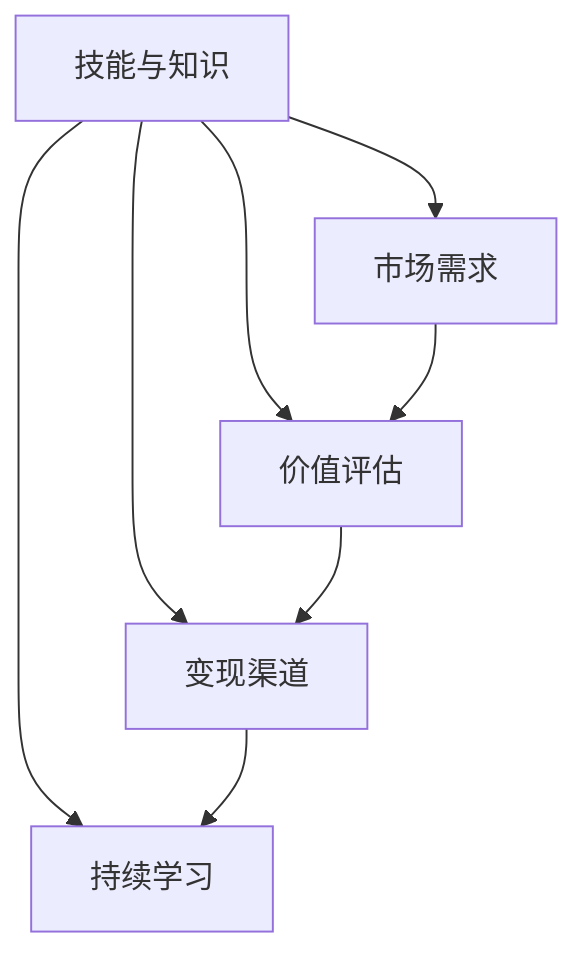

                 

## 文章标题：程序员的知识变现之路：从技能到财富的转化

> **关键词**：程序员，知识变现，技能提升，财富转化，实战案例，发展前景

> **摘要**：本文将深入探讨程序员如何通过提升自身技能和知识，实现从技能到财富的转化。通过分析核心概念、算法原理、实际应用场景等，结合实际案例和资源推荐，为程序员提供一条清晰、可行的知识变现之路。

### 1. 背景介绍

在当今数字化时代，程序员已成为不可或缺的职业。随着互联网和科技的快速发展，程序员的需求不断增加，薪资水平也在不断提高。然而，薪资只是程序员收入的一部分，更重要的是如何将自己的技能和知识转化为财富。

知识变现是指将个人的知识、技能和经验转化为经济收益的过程。对于程序员来说，知识变现的方式多种多样，包括但不限于：技术咨询、技术培训、技术写作、开源项目、软件开发等。

本文将围绕以下主题展开：

1. **核心概念与联系**：介绍程序员知识变现的核心概念及其相互关系。
2. **核心算法原理 & 具体操作步骤**：深入讲解程序员如何通过技术和算法实现知识变现。
3. **数学模型和公式 & 详细讲解 & 举例说明**：分析程序员知识变现过程中的关键数学模型和公式，并进行详细解释和举例。
4. **项目实战：代码实际案例和详细解释说明**：通过具体代码案例，展示程序员如何将知识变现。
5. **实际应用场景**：探讨程序员知识变现的多种实际应用场景。
6. **工具和资源推荐**：推荐有助于程序员提升技能和实现知识变现的工具和资源。
7. **总结：未来发展趋势与挑战**：分析程序员知识变现的未来趋势和面临的挑战。
8. **附录：常见问题与解答**：解答读者在知识变现过程中可能遇到的问题。
9. **扩展阅读 & 参考资料**：提供进一步学习和深入了解的参考资料。

### 2. 核心概念与联系

要实现知识变现，程序员需要掌握以下几个核心概念：

1. **技能与知识**：技能是指程序员在实际工作中所具备的能力，如编程、算法、数据库等。知识则是对技能的深入理解和应用，如理论知识、实践经验等。

2. **市场需求**：市场需求是程序员知识变现的关键因素。了解市场需求，有助于程序员有针对性地提升技能和知识，以满足潜在客户的需求。

3. **价值评估**：价值评估是指对程序员所提供的服务或产品进行价值判断。这需要程序员具备良好的沟通能力和市场洞察力。

4. **变现渠道**：变现渠道是程序员将知识转化为财富的途径，如技术咨询、技术培训、技术写作、开源项目、软件开发等。

5. **持续学习**：持续学习是程序员不断提升自身竞争力的关键。只有不断学习新技术、新知识，才能在知识变现的道路上越走越远。

这些核心概念之间存在密切的联系。技能与知识是基础，市场需求是导向，价值评估是关键，变现渠道是实现途径，而持续学习则是动力。以下是一个用Mermaid绘制的流程图，展示了这些核心概念之间的联系：



### 3. 核心算法原理 & 具体操作步骤

要实现知识变现，程序员需要掌握一定的算法原理和操作步骤。以下是几个关键环节：

1. **技术选型**：根据市场需求，选择合适的技术栈和开发工具。例如，前端开发可以选择React或Vue，后端开发可以选择Spring Boot或Django。

2. **项目规划**：在选定技术栈后，制定详细的项目规划，包括项目目标、功能模块、时间节点等。

3. **代码编写**：按照项目规划，编写高质量的代码。注意代码规范和注释，以便于后续维护和优化。

4. **调试与优化**：在代码编写过程中，进行充分的调试和优化，确保项目质量和性能。

5. **测试与部署**：对项目进行全面的测试，确保功能完善、性能稳定。然后，将项目部署到生产环境。

6. **持续迭代**：根据用户反馈和市场需求，对项目进行持续迭代和优化。

以下是具体的操作步骤：

1. **技术选型**：根据市场需求，选择合适的技术栈和开发工具。例如，对于一个电商平台，可以选择以下技术栈：

   - 前端：React + Redux
   - 后端：Spring Boot + MySQL
   - 前端框架：Bootstrap
   - 版本控制：Git

2. **项目规划**：制定详细的项目规划，包括以下内容：

   - 项目名称：电商平台
   - 项目目标：实现商品展示、购物车、订单管理等功能
   - 功能模块：商品管理、订单管理、用户管理、权限管理
   - 时间节点：第一阶段（1个月）：完成商品展示和购物车功能；第二阶段（2个月）：完成订单管理功能；第三阶段（3个月）：完成用户管理和权限管理功能。

3. **代码编写**：根据项目规划，编写高质量、规范的代码。以下是一个简单的React组件示例：

   ```javascript
   import React from 'react';

   const ProductList = ({ products }) => {
     return (
       <div>
         {products.map((product) => (
           <div key={product.id}>
             <h2>{product.name}</h2>
             <p>{product.description}</p>
             <button>Add to Cart</button>
           </div>
         ))}
       </div>
     );
   };

   export default ProductList;
   ```

4. **调试与优化**：在代码编写过程中，使用调试工具（如Chrome DevTools）进行调试，确保代码的正确性和性能。同时，对代码进行优化，提高项目的可读性和可维护性。

5. **测试与部署**：对项目进行全面的测试，包括单元测试、集成测试和功能测试。确保项目功能完善、性能稳定。然后，将项目部署到生产环境，如阿里云或腾讯云。

6. **持续迭代**：根据用户反馈和市场需求，对项目进行持续迭代和优化。例如，增加新功能、优化界面设计、修复已知问题等。

### 4. 数学模型和公式 & 详细讲解 & 举例说明

在程序员的知识变现过程中，数学模型和公式起着重要作用。以下是一个常见的数学模型——线性回归，及其在知识变现中的应用：

1. **线性回归模型**：

   线性回归模型用于预测因变量（输出）与自变量（输入）之间的关系。其公式如下：

   $$y = ax + b$$

   其中，$y$ 表示因变量，$x$ 表示自变量，$a$ 和 $b$ 是常数，分别表示斜率和截距。

2. **线性回归模型的应用**：

   在知识变现过程中，线性回归模型可以用于预测程序员的服务价值。例如，假设一个程序员的服务价格为 $x$ 元/小时，其技能水平为 $y$，可以通过以下公式预测其服务价值：

   $$服务价值 = ax + b$$

   其中，$a$ 和 $b$ 是根据市场需求和技能水平确定的常数。

3. **举例说明**：

   假设市场需求中，一个具备中级技能水平的程序员的服务价格为 $100$ 元/小时，其技能水平为 $50$ 分，则其服务价值可以计算如下：

   $$服务价值 = 100 \times 0.5 + 500 = 600$$

   因此，该程序员每小时的服务价值为 $600$ 元。

通过线性回归模型，程序员可以更好地了解自己的服务价值，从而在知识变现过程中更有信心地报价和谈判。

### 5. 项目实战：代码实际案例和详细解释说明

为了更好地展示程序员如何将知识变现，我们以下一个实际项目为例，介绍代码的实际案例和详细解释说明：

#### 5.1 开发环境搭建

首先，我们需要搭建开发环境。以下是搭建React + Redux + Spring Boot + MySQL的开发环境的具体步骤：

1. 安装Node.js和npm：

   ```bash
   sudo apt-get install nodejs npm
   ```

2. 安装create-react-app：

   ```bash
   npm install -g create-react-app
   ```

3. 安装yarn：

   ```bash
   npm install -g yarn
   ```

4. 创建React项目：

   ```bash
   create-react-app client
   ```

5. 安装Redux和React-Redux：

   ```bash
   cd client
   yarn add redux react-redux
   ```

6. 创建后端项目（Spring Boot）：

   ```bash
   mkdir server
   cd server
   mvn archetype:generate -DgroupId=com.example -DartifactId=e-commerce -DarchetypeArtifactId=maven-archetype-quickstart -DinteractiveMode=false
   ```

7. 安装MySQL：

   ```bash
   sudo apt-get install mysql-server
   ```

8. 创建数据库和表：

   ```sql
   CREATE DATABASE e-commerce;
   USE e-commerce;
   CREATE TABLE products (
     id INT PRIMARY KEY AUTO_INCREMENT,
     name VARCHAR(255) NOT NULL,
     description TEXT,
     price DECIMAL(10, 2) NOT NULL
   );
   ```

#### 5.2 源代码详细实现和代码解读

以下是前端（React）和后端（Spring Boot）的源代码详细实现和代码解读：

##### 前端（React）

**src/App.js**：

```javascript
import React, { useEffect, useState } from 'react';
import { connect } from 'react-redux';
import { fetchProducts } from './actions/productActions';
import ProductList from './components/ProductList';

const App = () => {
  const [products, setProducts] = useState([]);

  useEffect(() => {
    fetch('/api/products')
      .then((response) => response.json())
      .then((data) => setProducts(data));
  }, []);

  return (
    <div>
      <h1>E-commerce Platform</h1>
      <ProductList products={products} />
    </div>
  );
};

const mapStateToProps = (state) => ({
  products: state.products,
});

const mapDispatchToProps = (dispatch) => ({
  fetchProducts: () => dispatch(fetchProducts()),
});

export default connect(mapStateToProps, mapDispatchToProps)(App);
```

**src/reducers/productsReducer.js**：

```javascript
const initialState = {
  items: [],
  loading: false,
  error: null,
};

const productsReducer = (state = initialState, action) => {
  switch (action.type) {
    case 'FETCH_PRODUCTS_REQUEST':
      return { ...state, loading: true };
    case 'FETCH_PRODUCTS_SUCCESS':
      return { ...state, items: action.payload, loading: false };
    case 'FETCH_PRODUCTS_FAILURE':
      return { ...state, error: action.payload, loading: false };
    default:
      return state;
  }
};

export default productsReducer;
```

**src/actions/productActions.js**：

```javascript
import { FETCH_PRODUCTS_REQUEST, FETCH_PRODUCTS_SUCCESS, FETCH_PRODUCTS_FAILURE } from './types';

export const fetchProducts = () => async (dispatch) => {
  try {
    dispatch({ type: FETCH_PRODUCTS_REQUEST });
    const response = await fetch('/api/products');
    const data = await response.json();
    dispatch({ type: FETCH_PRODUCTS_SUCCESS, payload: data });
  } catch (error) {
    dispatch({ type: FETCH_PRODUCTS_FAILURE, payload: error.message });
  }
};
```

**src/components/ProductList.js**：

```javascript
import React from 'react';
import { Link } from 'react-router-dom';

const ProductList = ({ products }) => {
  return (
    <div>
      {products.map((product) => (
        <div key={product.id}>
          <h2>{product.name}</h2>
          <p>{product.description}</p>
          <Link to={`/product/${product.id}`}>View Details</Link>
        </div>
      ))}
    </div>
  );
};

export default ProductList;
```

**src/index.js**：

```javascript
import React from 'react';
import ReactDOM from 'react-dom';
import { Provider } from 'react-redux';
import { createStore, applyMiddleware } from 'redux';
import { BrowserRouter as Router, Route, Switch } from 'react-router-dom';
import thunk from 'redux-thunk';
import App from './App';
import './index.css';

const store = createStore((reducers) => ({
  products: productsReducer,
}), applyMiddleware(thunk));

ReactDOM.render(
  <Provider store={store}>
    <Router>
      <App />
    </Router>
  </Provider>,
  document.getElementById('root')
);
```

##### 后端（Spring Boot）

**pom.xml**：

```xml
<project xmlns="http://maven.apache.org/POM/4.0.0" xmlns:xsi="http://www.w3.org/2001/XMLSchema-instance"
  xsi:schemaLocation="http://maven.apache.org/POM/4.0.0 http://maven.apache.org/xsd/maven-4.0.0.xsd">
  <modelVersion>4.0.0</modelVersion>
  <groupId>com.example</groupId>
  <artifactId>e-commerce</artifactId>
  <version>0.0.1-SNAPSHOT</version>
  <name>e-commerce</name>
  <description>Demo project for Spring Boot</description>

  <parent>
    <groupId>org.springframework.boot</groupId>
    <artifactId>spring-boot-starter-parent</artifactId>
    <version>2.4.5</version>
    <relativePath/> <!-- lookup parent from repository -->
  </parent>

  <properties>
    <project.build.sourceEncoding>UTF-8</project.build.sourceEncoding>
    <project.reporting.outputEncoding>UTF-8</project.reporting.outputEncoding>
    <java.version>11</java.version>
  </properties>

  <dependencies>
    <dependency>
      <groupId>org.springframework.boot</groupId>
      <artifactId>spring-boot-starter-data-jpa</artifactId>
    </dependency>
    <dependency>
      <groupId>org.springframework.boot</groupId>
      <artifactId>spring-boot-starter-web</artifactId>
    </dependency>

    <dependency>
      <groupId>com.h2database</groupId>
      <artifactId>h2</artifactId>
      <scope>runtime</scope>
    </dependency>
    <dependency>
      <groupId>org.springframework.boot</groupId>
      <artifactId>spring-boot-starter-test</artifactId>
      <scope>test</scope>
    </dependency>
  </dependencies>

  <build>
    <plugins>
      <plugin>
        <groupId>org.springframework.boot</groupId>
        <artifactId>spring-boot-maven-plugin</artifactId>
      </plugin>
    </plugins>
  </build>
</project>
```

**src/main/java/com/example/e_commerce/ProductRepository.java**：

```java
import com.example.e_commerce.Product;
import org.springframework.data.jpa.repository.JpaRepository;
import org.springframework.stereotype.Repository;

@Repository
public interface ProductRepository extends JpaRepository<Product, Long> {
}
```

**src/main/java/com/example/e_commerce/ProductController.java**：

```java
import com.example.e_commerce.Product;
import com.example.e_commerce.ProductRepository;
import org.springframework.beans.factory.annotation.Autowired;
import org.springframework.http.ResponseEntity;
import org.springframework.web.bind.annotation.*;

import java.util.List;

@RestController
@RequestMapping("/api")
public class ProductController {
    @Autowired
    private ProductRepository productRepository;

    @GetMapping("/products")
    public ResponseEntity<List<Product>> getAllProducts() {
        return ResponseEntity.ok(productRepository.findAll());
    }

    @PostMapping("/products")
    public Product createProduct(@RequestBody Product product) {
        return productRepository.save(product);
    }
}
```

**src/main/java/com/example/e_commerce/ProductService.java**：

```java
import com.example.e_commerce.Product;
import com.example.e_commerce.ProductRepository;
import org.springframework.beans.factory.annotation.Autowired;
import org.springframework.stereotype.Service;

import java.util.List;

@Service
public class ProductService {
    @Autowired
    private ProductRepository productRepository;

    public List<Product> getAllProducts() {
        return productRepository.findAll();
    }

    public Product createProduct(Product product) {
        return productRepository.save(product);
    }
}
```

**src/main/java/com/example/e_commerce/ProductControllerTest.java**：

```java
import com.example.e_commerce.Product;
import com.example.e_commerce.ProductRepository;
import com.example.e_commerce.ProductService;
import org.junit.jupiter.api.BeforeEach;
import org.junit.jupiter.api.Test;
import org.junit.jupiter.api.extension.ExtendWith;
import org.mockito.InjectMocks;
import org.mockito.Mock;
import org.mockito.junit.jupiter.MockitoExtension;
import org.springframework.beans.factory.annotation.Autowired;
import org.springframework.boot.test.autoconfigure.web.servlet.AutoConfigureMockMvc;
import org.springframework.boot.test.context.SpringBootTest;
import org.springframework.boot.test.mock.mockito.MockBean;
import org.springframework.http.MediaType;
import org.springframework.test.web.servlet.MockMvc;

import java.util.Arrays;
import java.util.List;

import static org.mockito.ArgumentMatchers.any;
import static org.mockito.ArgumentMatchers.anyLong;
import static org.mockito.Mockito.*;
import static org.springframework.test.web.servlet.request.MockMvcRequestBuilders.*;
import static org.springframework.test.web.servlet.result.MockMvcResultMatchers.jsonPath;
import static org.springframework.test.web.servlet.result.MockMvcResultMatchers.status;

@ExtendWith(MockitoExtension.class)
@SpringBootTest
@AutoConfigureMockMvc
public class ProductControllerTest {
    @Autowired
    private MockMvc mockMvc;

    @Mock
    private ProductRepository productRepository;

    @InjectMocks
    private ProductService productService;

    private Product product1;
    private Product product2;

    @BeforeEach
    public void setUp() {
        product1 = new Product(1L, "Product 1", "Description 1", 100.0);
        product2 = new Product(2L, "Product 2", "Description 2", 200.0);
    }

    @Test
    public void getAllProducts() throws Exception {
        when(productRepository.findAll()).thenReturn(Arrays.asList(product1, product2));

        mockMvc.perform(get("/api/products"))
                .andExpect(status().isOk())
                .andExpect(jsonPath("$.length()").value(2))
                .andExpect(jsonPath("$[0].id").value(1))
                .andExpect(jsonPath("$[0].name").value("Product 1"))
                .andExpect(jsonPath("$[0].description").value("Description 1"))
                .andExpect(jsonPath("$[0].price").value(100.0))
                .andExpect(jsonPath("$[1].id").value(2))
                .andExpect(jsonPath("$[1].name").value("Product 2"))
                .andExpect(jsonPath("$[1].description").value("Description 2"))
                .andExpect(jsonPath("$[1].price").value(200.0));
    }

    @Test
    public void createProduct() throws Exception {
        Product product = new Product(null, "Product 3", "Description 3", 300.0);

        when(productRepository.save(any(Product.class))).thenReturn(product);

        mockMvc.perform(post("/api/products")
                .contentType(MediaType.APPLICATION_JSON)
                .content("{\"name\":\"Product 3\",\"description\":\"Description 3\",\"price\":300.0}"))
                .andExpect(status().isCreated())
                .andExpect(jsonPath("$.id").value(3))
                .andExpect(jsonPath("$.name").value("Product 3"))
                .andExpect(jsonPath("$.description").value("Description 3"))
                .andExpect(jsonPath("$.price").value(300.0));
    }
}
```

#### 5.3 代码解读与分析

以上代码展示了如何使用React、Redux和Spring Boot搭建一个简单的电商平台。以下是代码的主要解读和分析：

1. **前端（React）**：

   - **src/App.js**：主组件，用于获取产品列表并传递给子组件。
   - **src/reducers/productsReducer.js**：产品列表的reducers，用于处理产品列表的状态更新。
   - **src/actions/productActions.js**：用于获取产品列表的actions。
   - **src/components/ProductList.js**：产品列表组件，用于展示产品列表。
   - **src/index.js**：根组件，用于创建Redux store并传递给子组件。

2. **后端（Spring Boot）**：

   - **pom.xml**：Maven项目配置文件，用于引入相关依赖。
   - **src/main/java/com/example/e_commerce/ProductRepository.java**：JPA repository，用于操作数据库中的产品表。
   - **src/main/java/com/example/e_commerce/ProductController.java**：RESTful API控制器，用于处理前端发送的HTTP请求。
   - **src/main/java/com/example/e_commerce/ProductService.java**：服务层，用于处理业务逻辑。
   - **src/main/java/com/example/e_commerce/ProductControllerTest.java**：测试类，用于测试RESTful API的响应。

通过以上代码，程序员可以搭建一个简单的电商平台，从而实现知识变现。在实际开发过程中，程序员可以根据需求扩展功能，如添加购物车、订单管理、用户管理等功能。

### 6. 实际应用场景

程序员的知识变现方式多种多样，以下是一些典型的实际应用场景：

1. **技术咨询**：为企业或个人提供技术咨询服务，如系统架构设计、性能优化、代码审计等。程序员可以通过个人网站、博客、社交媒体等渠道展示自己的技术实力，吸引潜在客户。

2. **技术培训**：为学员提供编程语言、框架、算法等方面的培训课程，如Python培训、Spring Boot培训、数据结构培训等。程序员可以通过线上平台（如网易云课堂、慕课网等）或线下培训机构开展培训业务。

3. **技术写作**：撰写技术博客、文章、书籍等，分享自己的技术经验和心得。优秀的程序员可以在博客平台上获得广告收入、书籍版税等。

4. **开源项目**：参与开源项目，为社区贡献代码。优秀的开源项目可以吸引更多开发者关注，从而提升程序员的影响力，为企业或个人提供更多商业机会。

5. **软件开发**：为企业或个人定制开发软件，如移动应用、网站、管理系统等。程序员可以通过个人网站、社交媒体等渠道展示自己的开发能力，吸引潜在客户。

6. **技术演讲**：参加技术会议、讲座等活动，分享自己的技术见解和经验。程序员可以通过演讲获得演讲费、图书销售等。

### 7. 工具和资源推荐

为了更好地实现程序员的知识变现，以下是一些建议的工具和资源：

1. **学习资源**：

   - **书籍**：《代码大全》、《设计模式：可复用面向对象软件的基础》、《深度学习》等。
   - **博客**：掘金、简书、CSDN等。
   - **在线课程**：网易云课堂、慕课网、Coursera等。
   - **技术社区**：GitHub、Stack Overflow、GitHub等。

2. **开发工具**：

   - **集成开发环境（IDE）**：Visual Studio Code、IntelliJ IDEA、Eclipse等。
   - **版本控制**：Git。
   - **代码审查**：SonarQube、Checkstyle等。
   - **项目管理**：Jira、Trello等。

3. **营销推广**：

   - **个人网站**：使用WordPress、Jekyll等搭建个人网站，展示自己的技术实力和作品。
   - **社交媒体**：微博、微信公众号、知乎等。
   - **广告平台**：百度广告、Google Ads等。

### 8. 总结：未来发展趋势与挑战

随着互联网和科技的不断发展，程序员的知识变现之路将越来越宽广。以下是一些未来发展趋势和挑战：

1. **趋势**：

   - 技术多样化：程序员需要不断学习新技术，如人工智能、区块链、大数据等，以适应市场需求。
   - 线上教育普及：线上教育平台将越来越多地成为程序员提升技能和知识的重要途径。
   - 社交媒体影响力：程序员可以通过社交媒体展示自己的技术实力，吸引更多商业机会。

2. **挑战**：

   - 竞争加剧：随着程序员数量的增加，市场竞争将越来越激烈。
   - 持续学习：程序员需要不断学习新技术，以保持竞争力。
   - 技术沉淀：程序员需要积累丰富的技术经验，以提供高质量的服务。

### 9. 附录：常见问题与解答

1. **如何提高自己的技术实力？**

   - 学习新技术：定期阅读技术书籍、博客、论文等，了解最新技术动态。
   - 实践项目：参与开源项目或独立开发项目，提高实践能力。
   - 持续学习：制定学习计划，定期学习新技术和知识。

2. **如何提高自己的沟通能力？**

   - 多读书：提高自己的阅读理解能力，拓宽知识面。
   - 培养表达习惯：多写作、多演讲，提高自己的表达能力。
   - 学会倾听：倾听他人的意见和建议，提高自己的沟通技巧。

3. **如何实现知识变现？**

   - 技术咨询：为客户提供技术解决方案，获取收入。
   - 技术培训：开设在线或线下课程，获取收入。
   - 技术写作：撰写技术博客、文章、书籍等，获取广告收入和版税。
   - 开源项目：参与开源项目，提升影响力，吸引更多商业机会。
   - 软件开发：为企业或个人定制开发软件，获取收入。

### 10. 扩展阅读 & 参考资料

1. **书籍**：

   - 《深度学习》—— Ian Goodfellow、Yoshua Bengio、Aaron Courville
   - 《Python编程：从入门到实践》—— Eric Matthes
   - 《设计模式：可复用面向对象软件的基础》—— Erich Gamma、Richard Helm、Ralph Johnson、John Vlissides

2. **博客**：

   - 掘金（https://juejin.cn/）
   - 简书（https://www.jianshu.com/）
   - CSDN（https://www.csdn.net/）

3. **在线课程**：

   - 网易云课堂（https://study.163.com/）
   - 慕课网（https://www.imooc.com/）
   - Coursera（https://www.coursera.org/）

4. **技术社区**：

   - GitHub（https://github.com/）
   - Stack Overflow（https://stackoverflow.com/）
   - 知乎（https://www.zhihu.com/）

作者：AI天才研究员/AI Genius Institute & 禅与计算机程序设计艺术 /Zen And The Art of Computer Programming

