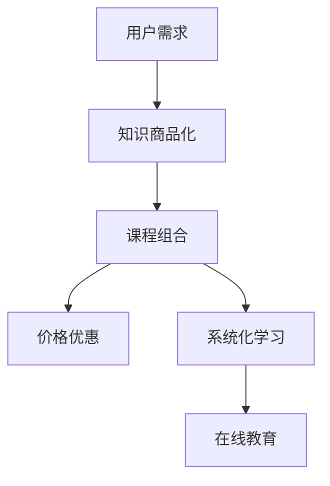

                 

# 程序员知识付费：打造套餐式课程

> **关键词：** 知识付费、程序员、套餐式课程、教育技术、学习体验、在线教育
> 
> **摘要：** 本文旨在探讨程序员知识付费领域，通过打造套餐式课程，提升学习者体验，增强课程吸引力，从而促进在线教育的可持续发展。

## 1. 背景介绍

随着互联网技术的飞速发展，在线教育逐渐成为人们获取知识的重要途径。尤其在疫情期间，线上教育更是迎来了前所未有的发展机遇。然而，在线教育市场也面临着诸多挑战，如内容质量参差不齐、学习体验不佳等。为了解决这些问题，知识付费模式应运而生，其中套餐式课程成为一种备受瞩目的形式。

套餐式课程是指将多个相关课程打包成一个整体，以优惠价格提供给学习者。这种模式具有以下优势：

- **个性化学习**：套餐式课程可以根据学习者的需求和兴趣，灵活组合不同课程，满足个性化学习需求。
- **系统化学习**：套餐式课程能够帮助学习者建立系统的知识体系，避免学习过程中出现知识断层。
- **价格优惠**：套餐式课程的价格通常比单个课程更优惠，有助于降低学习成本。

在程序员知识付费领域，套餐式课程的应用具有广泛的前景。程序员作为互联网时代的重要角色，需要不断更新知识，提升技能。通过套餐式课程，程序员可以更高效地学习，提升个人竞争力。

## 2. 核心概念与联系

### 2.1 知识付费

知识付费是指用户为获取特定知识或技能，向知识提供者支付一定费用的行为。在在线教育领域，知识付费模式已经成为一种主流的教育方式。知识付费的核心概念包括：

- **知识商品化**：将知识转化为商品，通过价格机制实现知识价值的变现。
- **用户需求**：用户为解决实际问题或提升自身能力，对知识的强烈需求。
- **用户体验**：用户在知识付费过程中的感受和评价，直接影响知识付费模式的可持续性。

### 2.2 套餐式课程

套餐式课程是指将多个相关课程打包成一个整体，以优惠价格提供给学习者。其核心概念包括：

- **课程组合**：根据学习者的需求和兴趣，灵活组合不同课程。
- **价格优惠**：套餐式课程的价格通常比单个课程更优惠，有助于降低学习成本。
- **系统化学习**：套餐式课程能够帮助学习者建立系统的知识体系，避免学习过程中出现知识断层。

### 2.3 在线教育

在线教育是指通过互联网技术，实现教育资源和教学活动的在线化。在线教育的主要特点包括：

- **灵活性强**：用户可以根据自己的需求和时间安排，选择合适的学习时间和方式。
- **资源共享**：通过互联网，优质教育资源可以共享给更多的学习者。
- **互动性强**：在线教育平台通常提供丰富的互动功能，如讨论区、问答等，有助于提高学习效果。

### 2.4 Mermaid 流程图

为了更好地理解套餐式课程的设计和实施，我们可以使用 Mermaid 流程图来展示相关概念和流程。以下是一个简单的 Mermaid 流程图示例：



## 3. 核心算法原理 & 具体操作步骤

### 3.1 算法原理

套餐式课程的设计需要遵循以下核心算法原理：

- **需求分析**：了解学习者的需求和兴趣，为课程组合提供依据。
- **课程筛选**：根据需求分析结果，筛选出相关课程，确保课程内容的质量和实用性。
- **价格优化**：通过计算和比较不同课程的价格，制定出合理的套餐价格，提高用户购买意愿。
- **课程组合**：根据用户需求和课程内容，灵活组合课程，形成套餐式课程。

### 3.2 具体操作步骤

#### 3.2.1 需求分析

1. **调研用户需求**：通过问卷调查、访谈等方式，了解用户的学习需求和兴趣。
2. **分析数据**：对调研数据进行分析，提取出用户关注的核心知识点和技能点。
3. **制定课程大纲**：根据用户需求，制定出初步的课程大纲。

#### 3.2.2 课程筛选

1. **筛选课程**：从已有的课程库中，筛选出与用户需求相关的课程。
2. **评估课程质量**：对筛选出的课程进行评估，确保课程内容的质量和实用性。
3. **课程排序**：根据课程的重要性和用户需求，对筛选出的课程进行排序。

#### 3.2.3 价格优化

1. **计算课程价格**：根据课程内容、时长、讲师水平等因素，计算单个课程的价格。
2. **比较价格**：对不同课程的定价进行比较，制定出合理的套餐价格。
3. **价格调整**：根据市场情况和用户反馈，适时调整套餐价格。

#### 3.2.4 课程组合

1. **确定课程组合**：根据用户需求和课程排序，确定课程组合方案。
2. **调整课程内容**：对课程组合进行微调，确保课程内容之间的衔接性和连贯性。
3. **形成套餐式课程**：将课程组合打包，形成套餐式课程。

## 4. 数学模型和公式 & 详细讲解 & 举例说明

### 4.1 数学模型

套餐式课程的设计过程中，可以使用以下数学模型来优化价格：

假设：
- \( C_i \) 表示第 \( i \) 门课程的价格；
- \( V \) 表示套餐的总价值；
- \( P \) 表示套餐的价格；
- \( n \) 表示套餐中包含的课程数量。

目标：最大化套餐的利润，即 \( \max (V - P) \)。

### 4.2 公式

根据数学模型，可以推导出以下公式：

1. **单个课程价格**：\( C_i = \frac{V}{n} \)
2. **套餐价格**：\( P = \sum_{i=1}^{n} C_i - \Delta P \)

其中，\( \Delta P \) 表示价格优惠部分。

### 4.3 举例说明

假设套餐中包含 3 门课程，总价值为 1000 元。为了简化计算，我们假设每门课程的价格相同，即 \( C_i = 333.33 \) 元。

1. **单个课程价格**：\( C_i = \frac{1000}{3} = 333.33 \) 元
2. **套餐价格**：\( P = 3 \times 333.33 - \Delta P \)

如果优惠部分为 100 元，则套餐价格为 \( P = 999.99 \) 元。

通过以上公式，我们可以计算出套餐的价格，并在此基础上进行价格调整。

## 5. 项目实战：代码实际案例和详细解释说明

### 5.1 开发环境搭建

为了更好地展示套餐式课程的设计与实现，我们选择 Python 作为开发语言，使用 Flask 框架搭建一个简单的在线教育平台。

1. **安装 Python**：确保安装 Python 3.8 以上版本。
2. **安装 Flask**：在命令行执行 `pip install Flask`。
3. **创建虚拟环境**：在项目根目录下执行 `python -m venv venv`，然后激活虚拟环境 `source venv/bin/activate`（Windows 下为 `venv\Scripts\activate`）。

### 5.2 源代码详细实现和代码解读

#### 5.2.1 代码结构

```python
# app.py

from flask import Flask, jsonify, request

app = Flask(__name__)

# 课程信息
courses = [
    {"id": 1, "name": "Python 基础", "price": 200},
    {"id": 2, "name": "Python 进阶", "price": 300},
    {"id": 3, "name": "数据分析", "price": 400},
]

# 套餐信息
packages = [
    {"id": 1, "name": "基础套餐", "courses": [1, 2], "price": 500},
    {"id": 2, "name": "进阶套餐", "courses": [1, 2, 3], "price": 800},
]

@app.route("/courses", methods=["GET"])
def get_courses():
    return jsonify(courses)

@app.route("/packages", methods=["GET"])
def get_packages():
    return jsonify(packages)

@app.route("/package", methods=["POST"])
def create_package():
    package_data = request.get_json()
    package_id = package_data.get("id")
    selected_courses = package_data.get("courses")

    package = next((pkg for pkg in packages if pkg["id"] == package_id), None)
    if package:
        selected_courses_ids = [course["id"] for course in package["courses"]]
        if all(course_id in selected_courses_ids for course_id in selected_courses):
            return jsonify({"message": "套餐创建成功", "package": package})
        else:
            return jsonify({"message": "所选课程不在套餐中", "error": "invalid_courses"}), 400
    else:
        return jsonify({"message": "套餐不存在", "error": "invalid_package"}), 404

if __name__ == "__main__":
    app.run(debug=True)
```

#### 5.2.2 代码解读

1. **课程信息**：定义了一个包含课程信息的列表，每门课程包含课程 ID、名称和价格。
2. **套餐信息**：定义了一个包含套餐信息的列表，每个套餐包含套餐 ID、名称、包含课程和价格。
3. **GET /courses**：获取所有课程信息。
4. **GET /packages**：获取所有套餐信息。
5. **POST /package**：创建套餐，接收 JSON 格式的请求体，包含套餐 ID 和选择的课程。首先查找套餐是否存在，然后检查选择的课程是否在套餐中，最后返回创建成功的套餐信息。

### 5.3 代码解读与分析

1. **课程信息与套餐信息的分离**：通过将课程信息和套餐信息分离，使得代码结构更加清晰，便于维护和扩展。
2. **API 接口设计**：通过定义 RESTful API 接口，方便前端与后端的交互。
3. **错误处理**：使用适当的 HTTP 状态码和错误消息，提高 API 的可读性和可用性。

## 6. 实际应用场景

套餐式课程在程序员知识付费领域具有广泛的应用场景：

- **职业规划**：针对不同职业阶段的程序员，提供相应的套餐课程，帮助他们提升技能，实现职业发展。
- **技术栈构建**：针对特定技术栈，提供一系列相关课程，帮助程序员系统化地学习和掌握技术栈。
- **项目实战**：将项目实战课程打包成套餐，帮助程序员提高项目开发能力，积累实践经验。
- **学科交叉**：结合不同学科的课程，打造跨学科套餐，拓宽程序员的知识面，提升综合素质。

## 7. 工具和资源推荐

### 7.1 学习资源推荐

- **书籍**：
  - 《Python 核心编程》
  - 《深度学习入门：基于 TensorFlow》
  - 《数据结构与算法分析》

- **论文**：
  - 《强化学习在游戏中的应用》
  - 《基于深度学习的图像识别技术》
  - 《分布式系统原理与范型》

- **博客**：
  - [Python 实践笔记](https://www.python-practice-book.org/)
  - [深度学习教程](http://www.deeplearningbook.org/)
  - [算法导论](https://algorithmics.com/algorithm-book/)

- **网站**：
  - [Kaggle](https://www.kaggle.com/)
  - [GitHub](https://github.com/)
  - [Stack Overflow](https://stackoverflow.com/)

### 7.2 开发工具框架推荐

- **编程语言**：
  - Python
  - Java
  - JavaScript

- **开发框架**：
  - Flask
  - Django
  - React

- **版本控制**：
  - Git
  - SVN

### 7.3 相关论文著作推荐

- **《深度学习》**：Goodfellow, I., Bengio, Y., & Courville, A. (2016). Deep Learning.
- **《Python 核心编程》**：Chabries, M. (2013). Core Python Programming.
- **《算法导论》**：Thomas H. Cormen, Charles E. Leiserson, Ronald L. Rivest, and Clifford Stein. (2009). Introduction to Algorithms.

## 8. 总结：未来发展趋势与挑战

随着在线教育的快速发展，套餐式课程在程序员知识付费领域具有广阔的应用前景。未来，套餐式课程的发展趋势包括：

- **个性化学习**：结合人工智能技术，实现更加精准的个性化学习推荐。
- **多样化课程**：拓展课程种类，满足不同学习者的需求。
- **优质内容**：提升课程内容质量，增强学习者的学习体验。

然而，套餐式课程也面临一定的挑战：

- **内容更新**：保持课程内容与技术的同步更新，避免知识陈旧。
- **课程定价**：合理定价，平衡课程价值和用户支付能力。
- **用户体验**：优化学习平台，提高用户的学习体验。

只有不断适应市场需求，创新课程设计和教学模式，套餐式课程才能在程序员知识付费领域取得更好的发展。

## 9. 附录：常见问题与解答

### 9.1 套餐式课程的优点

- **个性化学习**：满足不同学习者的个性化需求，提高学习效率。
- **系统化学习**：帮助学习者建立系统的知识体系，避免知识断层。
- **价格优惠**：提供优惠价格，降低学习成本，提高用户购买意愿。

### 9.2 套餐式课程的局限性

- **内容更新**：保持课程内容与技术的同步更新，避免知识陈旧。
- **课程定价**：合理定价，平衡课程价值和用户支付能力。
- **用户体验**：优化学习平台，提高用户的学习体验。

## 10. 扩展阅读 & 参考资料

- **在线教育**：
  - [在线教育行业发展报告](https://www.iedu.org.cn/)
  - [在线教育平台案例分析](https://www.ieducation.cn/)

- **知识付费**：
  - [知识付费行业报告](https://www.knowledgedu.cn/)
  - [知识付费案例分析](https://www.knowledgedu.cn/)

- **程序员知识付费**：
  - [程序员知识付费报告](https://www.programmerknowledge.cn/)
  - [程序员知识付费案例分析](https://www.programmerknowledge.cn/)

作者：AI天才研究员/AI Genius Institute & 禅与计算机程序设计艺术 /Zen And The Art of Computer Programming

