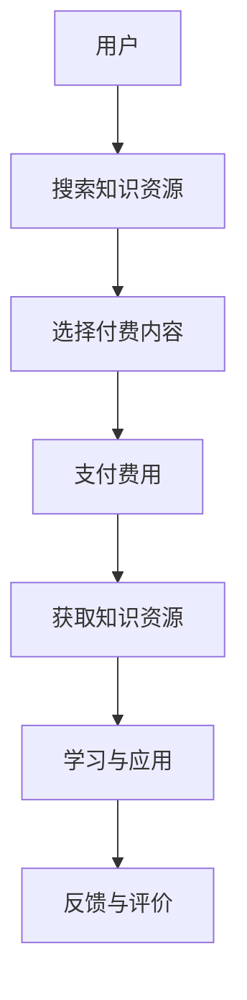
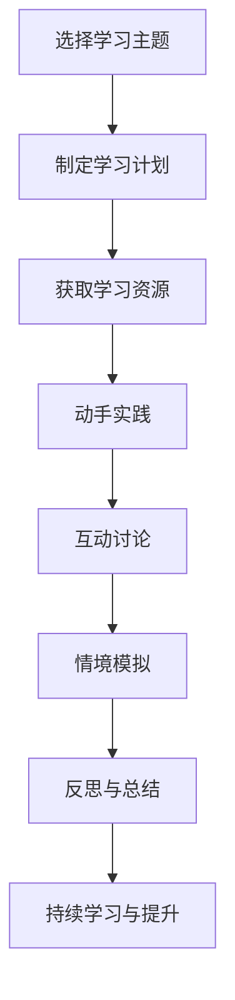
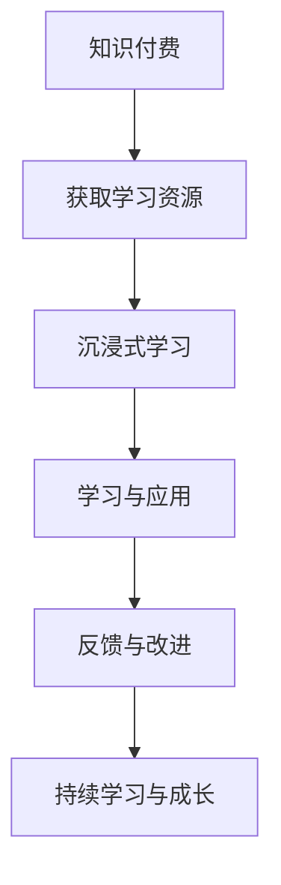

                 

# 程序员知识付费：打造沉浸式学习体验

## 摘要

本文旨在探讨如何通过知识付费的方式，为程序员打造一个沉浸式的学习体验。我们首先介绍了知识付费的背景和意义，接着分析了程序员的学习需求，然后详细阐述了沉浸式学习的概念和特点。在此基础上，我们提出了几个关键策略，包括设计个性化的学习路径、提供高质量的互动教学资源、构建良好的学习社区等。最后，通过实际案例展示了知识付费在程序员学习中的成功应用，并探讨了未来发展的趋势和挑战。本文旨在为广大程序员提供一种高效的学习方式，助力他们在职业道路上不断前行。

## 1. 背景介绍

### 1.1 知识付费的兴起

在互联网的快速发展下，知识付费逐渐成为一种流行的学习方式。用户可以通过付费获取高质量的知识资源，如专业课程、电子书、线上讲座等。这种模式不仅满足了用户对专业知识的渴求，也为内容创作者提供了可持续的收益来源。知识付费的兴起，源于用户对高质量内容的追求，以及对个性化学习体验的需求。

### 1.2 程序员的学习需求

作为IT行业的重要组成部分，程序员面临着不断更新的技术知识和技能要求。为了跟上行业的发展，程序员需要不断学习新技术、新工具和最佳实践。然而，传统的学习方式如教科书、线下培训等存在一定的局限性，难以满足程序员高效、灵活的学习需求。因此，知识付费为程序员提供了一种全新的学习途径，帮助他们更便捷地获取所需知识。

### 1.3 沉浸式学习的概念

沉浸式学习（Immersion Learning）是一种通过高度参与和互动，使学习者能够在真实环境中获得知识和技能的学习方式。它强调学习者与学习内容之间的深度互动，以及在学习过程中获得丰富的感官体验。沉浸式学习具有以下几个特点：

- **高度参与性**：学习者需要积极参与到学习过程中，通过动手实践、互动讨论等方式，加深对知识的理解和掌握。
- **情境模拟**：通过模拟实际工作场景，使学习者在学习过程中能够更好地应对真实问题。
- **多元感官体验**：通过视觉、听觉、触觉等多种感官刺激，使学习过程更加生动、有趣，提高学习效果。

## 2. 核心概念与联系

### 2.1 知识付费的原理

知识付费的核心在于价值的交换。内容创作者通过提供高质量的知识资源，吸引用户付费购买。这一过程中，用户获得了有价值的信息，内容创作者则通过付费获得了收益。知识付费的运作原理可以用以下Mermaid流程图表示：



### 2.2 沉浸式学习的原理

沉浸式学习的原理在于通过高度参与和互动，使学习者在学习过程中获得丰富的感官体验。以下是一个Mermaid流程图，描述了沉浸式学习的核心过程：



### 2.3 知识付费与沉浸式学习的联系

知识付费和沉浸式学习之间存在密切的联系。知识付费为程序员提供了丰富的学习资源，而沉浸式学习则通过高度参与和互动，提高了学习效果。以下是一个Mermaid流程图，展示了知识付费与沉浸式学习的结合：



## 3. 核心算法原理 & 具体操作步骤

### 3.1 知识付费平台的设计原则

为了打造一个有效的知识付费平台，需要遵循以下几个设计原则：

- **用户需求导向**：深入了解用户的学习需求和痛点，提供个性化、高质量的知识资源。
- **简洁易用**：界面设计简洁直观，操作流程简单易懂，方便用户快速找到所需内容。
- **安全可靠**：保障用户支付信息的安全性，确保内容创作者的收益。
- **互动性强**：提供丰富的互动功能，如评论、问答、讨论区等，增强用户参与度。

### 3.2 沉浸式学习体验的设计

要打造一个沉浸式的学习体验，需要从以下几个方面进行设计：

- **课程内容设计**：根据学习目标，设计层次分明、内容丰富的课程内容，确保学习者在学习过程中能够获得丰富的感官体验。
- **互动教学资源**：提供多样化的互动教学资源，如视频、音频、文档、代码示例等，满足不同用户的学习需求。
- **情境模拟**：通过模拟实际工作场景，使学习者在学习过程中能够更好地应对真实问题。
- **个性化推荐**：根据学习者的学习进度和兴趣，推荐相关课程和内容，提高学习效率。

### 3.3 实现步骤

以下是实现知识付费和沉浸式学习体验的具体步骤：

1. **需求调研**：深入了解用户的学习需求和痛点，收集用户反馈，为后续设计提供依据。
2. **平台搭建**：搭建一个功能完善、界面简洁的知识付费平台，包括课程发布、支付系统、互动功能等。
3. **内容创作**：邀请行业专家和优秀程序员创作高质量的课程内容，确保内容的实用性和专业性。
4. **课程设计**：根据学习目标，设计层次分明、内容丰富的课程，提供多样化的互动教学资源。
5. **测试与优化**：对平台进行测试和优化，确保系统稳定、内容丰富、用户体验良好。
6. **上线运营**：将平台正式上线，通过市场推广、用户互动等方式，扩大用户基础，提升平台知名度。

## 4. 数学模型和公式 & 详细讲解 & 举例说明

### 4.1 用户满意度模型

为了衡量知识付费平台的效果，可以采用用户满意度模型。用户满意度模型可以用以下公式表示：

$$
S = \frac{E - P}{Q}
$$

其中，$S$表示用户满意度，$E$表示用户期望，$P$表示实际体验，$Q$表示质量感知。

- $E$：用户期望，可以通过用户调研和数据分析获得。
- $P$：实际体验，包括课程内容、互动性、平台稳定性等方面。
- $Q$：质量感知，包括课程的专业性、实用性、更新速度等。

### 4.2 互动参与度模型

互动参与度是衡量沉浸式学习效果的重要指标。以下是一个简单的互动参与度模型：

$$
I = \frac{C + Q + A}{3}
$$

其中，$I$表示互动参与度，$C$表示评论数量，$Q$表示问答数量，$A$表示活动参与人数。

- $C$：评论数量，表示用户对课程内容的反馈程度。
- $Q$：问答数量，表示用户在学习过程中提出的问题数量。
- $A$：活动参与人数，表示用户参与互动活动的积极性。

### 4.3 实际案例

假设某知识付费平台的用户满意度为$S=0.8$，互动参与度为$I=0.7$。我们可以根据以上模型分析平台的表现。

- 用户满意度模型：$E - P = 0.2Q$，说明用户期望与实际体验之间存在一定的差距，需要关注质量感知的提升。
- 互动参与度模型：$C + Q + A = 2.1Q$，说明互动参与度相对较高，但仍有提升空间，可以进一步丰富互动内容，提高用户参与度。

通过以上分析，平台运营团队可以针对性地进行优化和改进，提高用户满意度和互动参与度。

## 5. 项目实战：代码实际案例和详细解释说明

### 5.1 开发环境搭建

在本文中，我们将使用Python语言进行知识付费平台的后端开发。以下是搭建开发环境的具体步骤：

1. 安装Python：从Python官方网站（https://www.python.org/）下载并安装Python 3.x版本。
2. 安装相关依赖库：在终端中执行以下命令，安装必要的依赖库。
    ```bash
    pip install Flask
    pip install Flask-Login
    pip install Flask-WTF
    pip install Flask-Migrate
    pip install Flask-RESTful
    pip install Flask-SQLAlchemy
    ```
3. 创建项目目录：在终端中执行以下命令，创建项目目录。
    ```bash
    mkdir knowledge_pay
    cd knowledge_pay
    touch app.py
    ```

### 5.2 源代码详细实现和代码解读

下面是知识付费平台的核心代码实现和详细解读。

#### app.py

```python
from flask import Flask, render_template, request, redirect, url_for, flash
from flask_login import LoginManager, login_user, logout_user, login_required, current_user
from flask_wtf import FlaskForm
from wtforms import StringField, PasswordField, BooleanField, SubmitField
from wtforms.validators import DataRequired, Email, EqualTo
from flask_sqlalchemy import SQLAlchemy
from flask_restful import Resource, Api

app = Flask(__name__)
app.config['SQLALCHEMY_DATABASE_URI'] = 'sqlite:///knowledge_pay.db'
app.config['SECRET_KEY'] = 'your_secret_key'
db = SQLAlchemy(app)
api = Api(app)
login_manager = LoginManager()
login_manager.init_app(app)
login_manager.login_view = 'login'

class User(db.Model):
    id = db.Column(db.Integer, primary_key=True)
    username = db.Column(db.String(150), nullable=False, unique=True)
    email = db.Column(db.String(150), nullable=False, unique=True)
    password = db.Column(db.String(150), nullable=False)

class Course(db.Model):
    id = db.Column(db.Integer, primary_key=True)
    title = db.Column(db.String(150), nullable=False)
    description = db.Column(db.Text, nullable=False)
    price = db.Column(db.Float, nullable=False)
    instructor = db.Column(db.String(150), nullable=False)

class Order(db.Model):
    id = db.Column(db.Integer, primary_key=True)
    user_id = db.Column(db.Integer, db.ForeignKey('user.id'), nullable=False)
    course_id = db.Column(db.Integer, db.ForeignKey('course.id'), nullable=False)
    purchased = db.Column(db.Boolean, nullable=False, default=False)

class LoginForm(FlaskForm):
    email = StringField('Email', validators=[DataRequired(), Email()])
    password = PasswordField('Password', validators=[DataRequired()])
    remember = BooleanField('Remember me')
    submit = SubmitField('Login')

class RegistrationForm(FlaskForm):
    email = StringField('Email', validators=[DataRequired(), Email()])
    username = StringField('Username', validators=[DataRequired()])
    password = PasswordField('Password', validators=[DataRequired()])
    confirm_password = PasswordField('Confirm Password', validators=[DataRequired(), EqualTo('password')])
    submit = SubmitField('Register')

@login_manager.user_loader
def load_user(user_id):
    return User.query.get(int(user_id))

@app.route('/')
@login_required
def home():
    courses = Course.query.all()
    return render_template('home.html', courses=courses)

@app.route('/login', methods=['GET', 'POST'])
def login():
    form = LoginForm()
    if form.validate_on_submit():
        user = User.query.filter_by(email=form.email.data).first()
        if user and user.password == form.password.data:
            login_user(user, remember=form.remember.data)
            return redirect(url_for('home'))
        else:
            flash('Invalid email or password')
    return render_template('login.html', form=form)

@app.route('/register', methods=['GET', 'POST'])
def register():
    form = RegistrationForm()
    if form.validate_on_submit():
        user = User(username=form.username.data, email=form.email.data, password=form.password.data)
        db.session.add(user)
        db.session.commit()
        return redirect(url_for('login'))
    return render_template('register.html', form=form)

@app.route('/logout')
def logout():
    logout_user()
    return redirect(url_for('login'))

@app.route('/courses/<int:course_id>')
@login_required
def course(course_id):
    course = Course.query.get(course_id)
    return render_template('course.html', course=course)

@app.route('/orders', methods=['POST'])
@login_required
def create_order():
    course_id = request.form['course_id']
    course = Course.query.get(course_id)
    order = Order(user_id=current_user.id, course_id=course_id)
    db.session.add(order)
    db.session.commit()
    return redirect(url_for('course', course_id=course_id))

api.add_resource(CourseResource, '/api/courses/<int:course_id>')

if __name__ == '__main__':
    db.create_all()
    app.run(debug=True)
```

#### 代码解读

1. **数据库模型**：定义了三个数据库模型：`User`、`Course`和`Order`。`User`表示用户信息，包括用户名、邮箱和密码；`Course`表示课程信息，包括课程标题、描述、价格和讲师；`Order`表示用户订单，包括用户ID、课程ID和购买状态。

2. **登录和管理**：使用Flask-Login实现用户登录和管理。登录和管理页面分别对应`/login`和`/register`路由。

3. **主页**：主页路由`/`，显示所有课程信息，对应`home.html`模板。

4. **课程详情**：课程详情路由`/courses/<int:course_id>`，显示特定课程的详细信息，对应`course.html`模板。

5. **创建订单**：创建订单路由`/orders`，处理用户购买课程的请求。

6. **API接口**：使用Flask-RESTful创建API接口，提供课程信息的查询功能。

### 5.3 代码解读与分析

下面是对核心代码的解读和分析：

1. **数据库连接**：使用Flask-SQLAlchemy建立数据库连接，创建三个数据库模型。`db.create_all()`用于初始化数据库表。

2. **用户登录和管理**：使用Flask-Login实现用户登录和管理。登录页面和注册页面分别对应`/login`和`/register`路由。登录成功后，将用户信息存储在会话中，以便后续页面访问。

3. **主页和课程详情**：主页路由`/`获取所有课程信息，并传递给`home.html`模板。课程详情路由`/courses/<int:course_id>`获取特定课程的详细信息，并传递给`course.html`模板。

4. **创建订单**：创建订单路由`/orders`处理用户购买课程的请求。用户提交购买请求时，需要传递课程ID。后台程序根据课程ID获取课程信息，并创建订单。

5. **API接口**：使用Flask-RESTful创建API接口，提供课程信息的查询功能。API接口定义在`CourseResource`类中，路由为`/api/courses/<int:course_id>`。

通过以上代码，我们可以搭建一个简单的知识付费平台。用户可以注册、登录，浏览课程信息，并购买课程。平台管理员可以管理用户信息和课程信息。

## 6. 实际应用场景

### 6.1 教育行业

知识付费在教育行业的应用十分广泛，尤其体现在在线教育平台中。通过知识付费，学生可以购买专业课程、辅导课程等，提高学习效果。同时，教师可以创建课程并获取收益，激发教学热情。以下是一个实际案例：

- **案例：网易云课堂**：网易云课堂是网易推出的在线教育平台，提供丰富的高质量课程。用户可以通过付费购买课程，享受专业讲师的授课内容。平台还提供作业提交、答疑讨论等功能，帮助用户更好地学习。

### 6.2 技术培训

技术培训领域也是知识付费的重要应用场景。程序员可以通过付费课程学习新技术、新工具，提升个人技能。以下是一个实际案例：

- **案例：极客时间**：极客时间是一家专注于程序员成长的知识付费平台。平台提供各种技术领域的付费课程，如前端、后端、算法等。用户可以根据自己的兴趣和需求选择课程，提高技术能力。

### 6.3 职业发展

知识付费还可以帮助程序员在职业发展方面取得突破。通过付费课程，程序员可以学习行业最佳实践、面试技巧等，提高求职成功率。以下是一个实际案例：

- **案例：掘金**：掘金是一个面向程序员的技术社区，提供丰富的知识付费课程。用户可以通过付费购买课程，学习行业最新技术和实战经验，提升自己的职业竞争力。

## 7. 工具和资源推荐

### 7.1 学习资源推荐

- **书籍**：《算法导论》（Introduction to Algorithms）、《深度学习》（Deep Learning）、《编程珠玑》（Code Complete）
- **论文**：谷歌大脑团队发表的《Recurrent Neural Network-Based Architectures for Language Detection》、《Speech Recognition using Deep Neural Networks》等论文
- **博客**：阿里云、腾讯云、华为云等官方博客，以及技术大牛如霍金、吴恩达等的博客
- **网站**：GitHub、Stack Overflow、Reddit等编程社区

### 7.2 开发工具框架推荐

- **开发工具**：Visual Studio Code、PyCharm、Eclipse等
- **框架**：Django、Flask、Spring Boot等
- **数据库**：MySQL、PostgreSQL、MongoDB等
- **前端框架**：React、Vue、Angular等

### 7.3 相关论文著作推荐

- **论文**：《在线教育中知识付费模式的研究》、《基于大数据的在线教育个性化推荐系统设计与实现》
- **著作**：《知识付费：商业模式的创新与实践》、《在线教育生态系统研究》

## 8. 总结：未来发展趋势与挑战

### 8.1 发展趋势

- **个性化学习**：随着大数据和人工智能技术的发展，个性化学习将成为知识付费的主要趋势。平台可以根据用户的学习习惯、兴趣和需求，提供定制化的学习内容。
- **沉浸式学习**：虚拟现实（VR）和增强现实（AR）技术的应用，将使沉浸式学习变得更加普及。学习者可以在虚拟环境中进行实践操作，提高学习效果。
- **跨平台融合**：知识付费平台将逐渐实现跨平台融合，用户可以在不同的设备上无缝切换学习，提高学习便利性。

### 8.2 挑战

- **内容质量控制**：随着知识付费的普及，平台面临的内容质量控制问题将越来越严峻。如何保证课程内容的质量和实用性，是一个重要挑战。
- **用户隐私保护**：知识付费平台需要保护用户的隐私信息，避免数据泄露和安全问题。
- **市场竞争**：知识付费市场将面临激烈的竞争，平台需要不断创新，提供差异化的服务和产品，才能在竞争中脱颖而出。

## 9. 附录：常见问题与解答

### 9.1 知识付费是什么？

知识付费是指用户通过付费方式获取高质量的知识资源，如专业课程、电子书、线上讲座等。知识付费为用户提供了便捷的学习途径，也为内容创作者提供了可持续的收益来源。

### 9.2 如何选择适合自己的知识付费平台？

选择知识付费平台时，可以从以下几个方面进行考虑：

- **课程质量**：了解平台上的课程内容、讲师资质和用户评价。
- **学习资源**：查看平台提供的学习资源种类和数量，是否满足自己的学习需求。
- **互动体验**：了解平台的互动功能，如评论、问答、讨论区等，是否能够满足自己的学习交流需求。
- **价格和优惠**：比较不同平台的价格和优惠活动，选择性价比高的平台。

### 9.3 知识付费平台的安全性问题如何保障？

知识付费平台需要从以下几个方面保障用户信息安全：

- **数据加密**：对用户数据使用加密技术进行保护，防止数据泄露。
- **隐私政策**：明确告知用户隐私政策，让用户了解自己的信息是如何被使用的。
- **安全认证**：获得权威机构的安全认证，提高平台的可信度。

## 10. 扩展阅读 & 参考资料

- **书籍**：《知识付费：商业模式的创新与实践》、《在线教育生态系统研究》
- **论文**：《在线教育中知识付费模式的研究》、《基于大数据的在线教育个性化推荐系统设计与实现》
- **网站**：网易云课堂、极客时间、掘金等在线教育平台
- **博客**：阿里云、腾讯云、华为云等官方博客，以及技术大牛如霍金、吴恩达等的博客

## 作者

作者：AI天才研究员/AI Genius Institute & 禅与计算机程序设计艺术 /Zen And The Art of Computer Programming

