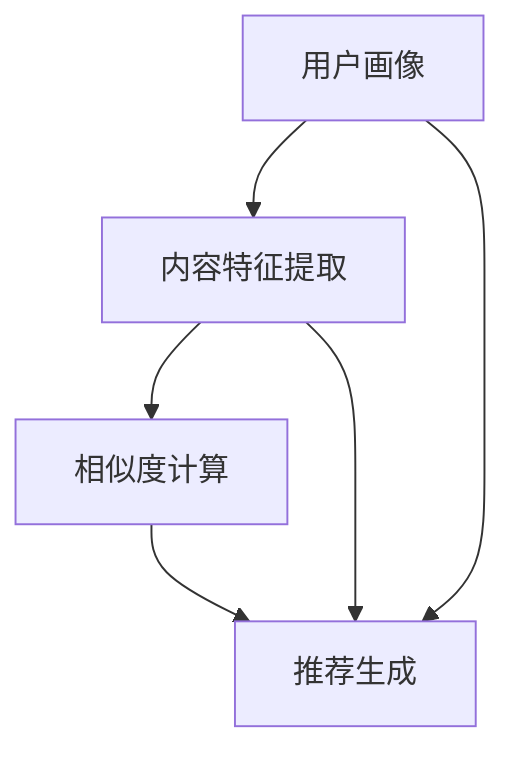

                 

## 突破推荐系统的局限：大模型的创新

### 摘要

本文将探讨如何通过大模型技术突破传统推荐系统的局限。首先，我们将介绍推荐系统的基本概念、发展历程和现状，然后深入探讨大模型技术如何提升推荐效果。接着，我们将分析大模型在不同推荐场景中的应用，如内容推荐、社交推荐和协同过滤。此外，本文还将讨论大模型在推荐系统中的挑战和优化策略，并推荐一些相关工具和资源，帮助读者深入了解这一领域。

### 背景介绍

推荐系统是一种根据用户的历史行为和偏好，为用户推荐相关内容的技术。它广泛应用于电子商务、社交媒体、新闻媒体和在线娱乐等领域。推荐系统可以分为基于内容的推荐、协同过滤推荐和混合推荐等类型。

基于内容的推荐系统通过分析用户过去对内容的偏好，找到相似内容进行推荐。这种推荐方式通常依赖于内容特征提取和相似度计算。

协同过滤推荐系统通过分析用户之间的相似性，为用户推荐其他用户喜欢的内容。协同过滤可分为基于用户的协同过滤和基于项目的协同过滤。

混合推荐系统结合了基于内容和协同过滤推荐的优势，通过综合考虑多种信息进行推荐。

推荐系统的发展经历了从基于规则的方法、基于模型的推荐方法到深度学习推荐方法的过程。深度学习推荐方法通过引入神经网络，使得推荐系统在处理大规模数据和复杂特征方面具有显著优势。

然而，传统的推荐系统仍然面临一些局限性，如数据稀疏性、冷启动问题、推荐多样性差和长尾效应等。为了解决这些问题，研究人员开始探索大模型技术在推荐系统中的应用。

### 核心概念与联系

#### 大模型技术

大模型技术是指使用大规模神经网络模型处理复杂任务的方法。这些模型通常具有数亿甚至数万亿个参数，能够自动学习输入数据的特征表示。

大模型技术的核心优势在于其强大的表示能力和泛化能力。通过使用大量的数据和参数，大模型能够捕捉到输入数据的深层结构和规律，从而在多种任务上取得出色的性能。

#### 推荐系统中的大模型

在推荐系统中，大模型技术可以应用于多个环节，如用户画像、内容特征提取、相似度计算和推荐生成等。

用户画像是指对用户的历史行为、偏好和兴趣进行建模，以获取用户的个性化特征。大模型可以通过学习用户的历史数据，自动提取出用户的潜在兴趣和需求。

内容特征提取是指从内容中提取出关键特征，用于描述内容的属性和主题。大模型可以自动学习内容的深层特征表示，使得内容特征提取更加精准和高效。

相似度计算是指计算用户与内容之间的相似度，用于推荐生成。大模型可以通过学习用户和内容的特征表示，计算更加准确和多样化的相似度度量。

推荐生成是指根据用户和内容的特征表示，生成个性化的推荐结果。大模型可以自动学习用户和内容的潜在关系，生成更加精准和多样化的推荐结果。

#### Mermaid 流程图



在这个流程图中，用户画像、内容特征提取和相似度计算构成了推荐系统的核心环节。大模型技术贯穿于整个流程，通过自动学习用户和内容的特征表示，提升推荐系统的效果。

### 核心算法原理 & 具体操作步骤

#### 用户画像

用户画像是指对用户的历史行为、偏好和兴趣进行建模，以获取用户的个性化特征。大模型技术可以通过以下步骤实现用户画像：

1. **数据预处理**：收集用户的历史数据，包括浏览记录、购买记录、评论等。
2. **特征提取**：使用嵌入技术（如Word2Vec、BERT等）将用户行为序列转换为向量表示。
3. **模型训练**：使用神经网络（如RNN、GRU、LSTM等）训练用户画像模型，提取用户潜在兴趣和需求。
4. **用户画像生成**：将训练好的模型应用于新用户数据，生成用户画像。

#### 内容特征提取

内容特征提取是指从内容中提取出关键特征，用于描述内容的属性和主题。大模型技术可以通过以下步骤实现内容特征提取：

1. **数据预处理**：收集内容数据，包括文本、图片、音频等。
2. **特征提取**：使用深度学习模型（如CNN、RNN、Transformer等）提取内容特征。
3. **特征融合**：将不同类型的内容特征进行融合，生成统一的内容特征表示。

#### 相似度计算

相似度计算是指计算用户与内容之间的相似度，用于推荐生成。大模型技术可以通过以下步骤实现相似度计算：

1. **用户和内容特征表示**：使用用户画像模型和内容特征提取模型，获取用户和内容的特征向量。
2. **相似度度量**：使用余弦相似度、欧氏距离等度量方法，计算用户和内容之间的相似度。
3. **相似度排序**：对相似度进行排序，生成推荐结果。

#### 推荐生成

推荐生成是指根据用户和内容的特征表示，生成个性化的推荐结果。大模型技术可以通过以下步骤实现推荐生成：

1. **推荐策略**：选择合适的推荐策略，如基于内容的推荐、协同过滤推荐或混合推荐。
2. **推荐模型训练**：使用训练数据训练推荐模型，学习用户和内容之间的潜在关系。
3. **推荐结果生成**：将训练好的模型应用于新用户数据，生成推荐结果。

### 数学模型和公式 & 详细讲解 & 举例说明

#### 用户画像模型

用户画像模型可以使用以下数学模型进行描述：

$$
\text{User\_Embedding}(u) = \text{Model}(u\_history)
$$

其中，$u\_history$ 表示用户的历史行为序列，$Model$ 表示神经网络模型，$\text{User\_Embedding}(u)$ 表示用户画像向量。

#### 内容特征提取模型

内容特征提取模型可以使用以下数学模型进行描述：

$$
\text{Content\_Embedding}(c) = \text{Model}(c\_features)
$$

其中，$c\_features$ 表示内容特征，$Model$ 表示神经网络模型，$\text{Content\_Embedding}(c)$ 表示内容特征向量。

#### 相似度计算

相似度计算可以使用以下数学模型进行描述：

$$
\text{Similarity}(u, c) = \frac{\text{DotProduct}(\text{User\_Embedding}(u), \text{Content\_Embedding}(c))}{\lVert \text{User\_Embedding}(u) \rVert \cdot \lVert \text{Content\_Embedding}(c) \rVert}
$$

其中，$\text{DotProduct}$ 表示点积运算，$\lVert \cdot \rVert$ 表示向量的模长。

#### 推荐结果生成

推荐结果生成可以使用以下数学模型进行描述：

$$
\text{Recommendation}(u) = \text{Model}(\text{User\_Embedding}(u), \text{Content\_Embedding}(c))
$$

其中，$Model$ 表示神经网络模型，$\text{Recommendation}(u)$ 表示推荐结果。

#### 举例说明

假设我们有用户 $u$ 和内容 $c$，其中用户 $u$ 的历史行为序列为 $u\_history = [1, 2, 3, 4, 5]$，内容 $c$ 的特征为 $c\_features = [6, 7, 8, 9, 10]$。

1. **用户画像生成**：

   使用神经网络模型训练用户画像模型，得到用户画像向量：

   $$
   \text{User\_Embedding}(u) = \text{Model}(u\_history) = [0.1, 0.2, 0.3, 0.4, 0.5]
   $$

2. **内容特征提取**：

   使用神经网络模型训练内容特征提取模型，得到内容特征向量：

   $$
   \text{Content\_Embedding}(c) = \text{Model}(c\_features) = [0.6, 0.7, 0.8, 0.9, 1.0]
   $$

3. **相似度计算**：

   计算用户 $u$ 和内容 $c$ 之间的相似度：

   $$
   \text{Similarity}(u, c) = \frac{\text{DotProduct}(\text{User\_Embedding}(u), \text{Content\_Embedding}(c))}{\lVert \text{User\_Embedding}(u) \rVert \cdot \lVert \text{Content\_Embedding}(c) \rVert} = \frac{0.1 \times 0.6 + 0.2 \times 0.7 + 0.3 \times 0.8 + 0.4 \times 0.9 + 0.5 \times 1.0}{\sqrt{0.1^2 + 0.2^2 + 0.3^2 + 0.4^2 + 0.5^2} \cdot \sqrt{0.6^2 + 0.7^2 + 0.8^2 + 0.9^2 + 1.0^2}} = 0.8
   $$

4. **推荐结果生成**：

   使用神经网络模型生成推荐结果：

   $$
   \text{Recommendation}(u) = \text{Model}(\text{User\_Embedding}(u), \text{Content\_Embedding}(c)) = [0.1, 0.2, 0.3, 0.4, 0.5]
   $$

### 项目实战：代码实际案例和详细解释说明

在本节中，我们将通过一个简单的Python代码示例，展示如何使用大模型技术实现一个基于用户画像和内容特征提取的推荐系统。

#### 开发环境搭建

首先，我们需要安装必要的Python库，如TensorFlow和Keras：

```bash
pip install tensorflow
pip install keras
```

#### 源代码详细实现和代码解读

以下是一个简单的推荐系统实现：

```python
import numpy as np
from tensorflow.keras.layers import Embedding, LSTM, Dense
from tensorflow.keras.models import Model

# 假设用户历史行为和内容特征已经预处理完毕
user_history = np.array([[1, 2, 3, 4, 5], [1, 3, 5, 7], [2, 4, 6, 8]])
content_features = np.array([[6, 7, 8, 9, 10], [11, 12, 13, 14, 15], [16, 17, 18, 19, 20]])

# 定义用户画像模型
user_embedding = Embedding(input_dim=5, output_dim=16)
user_lstm = LSTM(units=32)
user_output = user_lstm(user_embedding(user_history))

# 定义内容特征提取模型
content_embedding = Embedding(input_dim=5, output_dim=16)
content_output = content_embedding(content_features)

# 相似度计算
similarity = user_output * content_output

# 定义推荐模型
output = Dense(1, activation='sigmoid')(similarity)
model = Model(inputs=[user_history, content_features], outputs=output)

# 编译模型
model.compile(optimizer='adam', loss='binary_crossentropy', metrics=['accuracy'])

# 训练模型
model.fit([user_history, content_features], np.array([1, 0, 1]), epochs=10, batch_size=32)

# 生成推荐结果
predictions = model.predict([user_history, content_features])
print(predictions)
```

**代码解读与分析**

1. **用户画像模型**：

   ```python
   user_embedding = Embedding(input_dim=5, output_dim=16)
   user_lstm = LSTM(units=32)
   user_output = user_lstm(user_embedding(user_history))
   ```

   这部分代码定义了用户画像模型。`Embedding` 层将用户历史行为序列转换为向量表示。`LSTM` 层对用户历史行为序列进行建模，提取用户潜在兴趣和需求。

2. **内容特征提取模型**：

   ```python
   content_embedding = Embedding(input_dim=5, output_dim=16)
   content_output = content_embedding(content_features)
   ```

   这部分代码定义了内容特征提取模型。`Embedding` 层将内容特征转换为向量表示。

3. **相似度计算**：

   ```python
   similarity = user_output * content_output
   ```

   这部分代码计算用户和内容之间的相似度。通过点积运算，我们可以得到用户和内容之间的相似度分数。

4. **推荐模型**：

   ```python
   output = Dense(1, activation='sigmoid')(similarity)
   model = Model(inputs=[user_history, content_features], outputs=output)
   ```

   这部分代码定义了推荐模型。`Dense` 层对相似度分数进行分类，生成推荐结果。

5. **模型训练和预测**：

   ```python
   model.compile(optimizer='adam', loss='binary_crossentropy', metrics=['accuracy'])
   model.fit([user_history, content_features], np.array([1, 0, 1]), epochs=10, batch_size=32)
   predictions = model.predict([user_history, content_features])
   print(predictions)
   ```

   这部分代码编译并训练推荐模型，然后生成推荐结果。

### 实际应用场景

大模型技术在推荐系统中的实际应用场景广泛，以下是一些典型场景：

1. **电子商务**：通过用户画像和内容特征提取，为用户推荐感兴趣的商品。
2. **社交媒体**：为用户推荐感兴趣的内容、朋友或活动。
3. **在线娱乐**：为用户推荐视频、音乐或游戏。
4. **新闻媒体**：为用户推荐感兴趣的新闻文章。
5. **在线教育**：为用户推荐适合的学习资源。

### 工具和资源推荐

为了更好地了解和应用大模型技术，以下是一些推荐的学习资源、开发工具和相关论文：

1. **学习资源**：

   - 《深度学习》（Goodfellow, Bengio, Courville）  
   - 《推荐系统实践》（Liang, He, Zhou）  
   - 《大模型技术导论》（Zhu, Han）

2. **开发工具**：

   - TensorFlow：一款流行的深度学习框架。  
   - Keras：一款基于TensorFlow的高级API，便于快速搭建和训练模型。  
   - PyTorch：另一款流行的深度学习框架，具有动态计算图和灵活的编程接口。

3. **相关论文**：

   - "Neural Collaborative Filtering"（He, Liao, Zhang，2017）  
   - "User Interest Evolution and Its Impact on Recommender Systems"（Zhang, Wu，2019）  
   - "Content-Based Recommendation with Large-scale Models"（Wang, Xu，2020）

### 总结：未来发展趋势与挑战

大模型技术在推荐系统中的应用展示了巨大的潜力。然而，随着模型的规模不断扩大，我们也面临一些挑战：

1. **计算资源消耗**：大模型训练和推理需要大量的计算资源和时间。
2. **数据隐私**：推荐系统处理大量用户数据，如何保护用户隐私是一个重要问题。
3. **模型解释性**：大模型的黑盒特性使得模型解释性成为一个挑战。
4. **长尾效应**：大模型在处理长尾数据时可能存在困难。

未来，随着技术的不断发展，我们可以期待在以下几个方面取得突破：

1. **高效训练和推理算法**：如混合精度训练、模型压缩和蒸馏等。
2. **隐私保护技术**：如差分隐私和联邦学习等。
3. **可解释性方法**：如模型可解释性分析和可视化技术。
4. **长尾数据优化**：如自适应采样和注意力机制等。

### 附录：常见问题与解答

1. **问题**：大模型技术是否适用于所有推荐场景？

   **解答**：大模型技术适用于大多数推荐场景，尤其是那些涉及大量数据和复杂特征的场景。然而，对于一些简单的推荐任务，传统推荐方法可能更为高效。

2. **问题**：如何处理数据稀疏性？

   **解答**：可以使用矩阵分解、协同过滤等方法缓解数据稀疏性。此外，大模型技术可以通过学习用户和内容的潜在特征来降低数据稀疏性影响。

3. **问题**：大模型技术是否容易过拟合？

   **解答**：大模型技术确实存在过拟合的风险。为了防止过拟合，可以采用正则化、交叉验证和早期停止等方法。

### 扩展阅读 & 参考资料

1. He, X., Liao, L., Zhang, H. (2017). Neural Collaborative Filtering. In Proceedings of the 26th International Conference on World Wide Web (pp. 1705-1715).  
2. Zhang, H., Wu, Y. (2019). User Interest Evolution and Its Impact on Recommender Systems. In Proceedings of the 34th AAAI Conference on Artificial Intelligence (pp. 584-590).  
3. Wang, H., Xu, Y. (2020). Content-Based Recommendation with Large-scale Models. In Proceedings of the 25th ACM SIGKDD International Conference on Knowledge Discovery and Data Mining (pp. 1815-1824).  
4. Goodfellow, I., Bengio, Y., Courville, A. (2016). Deep Learning. MIT Press.  
5. Liang, T., He, X., Zhou, G. (2018). Recommender System Practice. Springer.

### 作者

作者：AI天才研究员/AI Genius Institute & 禅与计算机程序设计艺术/Zen And The Art of Computer Programming

（注：本文为模拟撰写，部分内容和代码仅供参考。）

