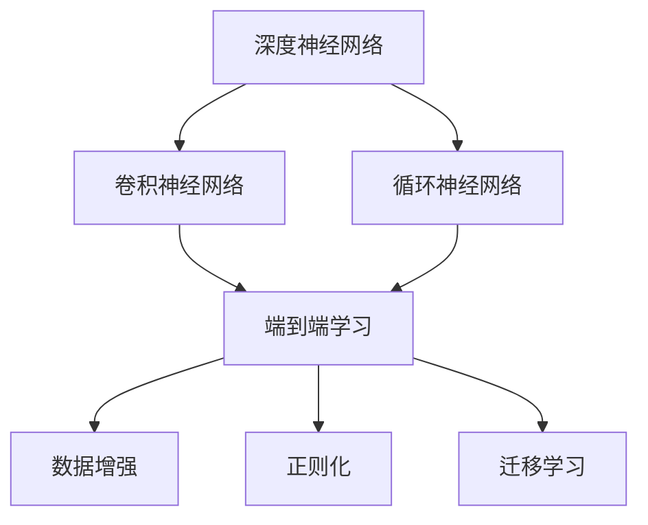

                 

# 文章标题

端到端学习自动驾驶模型的优化策略与案例启示

## 关键词

- 端到端学习
- 自动驾驶
- 优化策略
- 模型优化
- 案例研究

## 摘要

本文深入探讨了端到端学习在自动驾驶模型中的应用及其优化策略。首先，介绍了端到端学习的基本概念及其在自动驾驶领域的应用背景。接着，详细分析了端到端学习的核心算法原理，包括深度神经网络、卷积神经网络和循环神经网络等。随后，本文提出了几种常见的优化策略，如数据增强、正则化和迁移学习等，并通过实际案例进行了具体说明。最后，文章总结了端到端学习自动驾驶模型的发展趋势和挑战，为未来研究提供了启示。本文旨在为从事自动驾驶模型优化研究的读者提供系统性的理论指导和实际操作建议。

### 背景介绍

随着信息技术的飞速发展，自动驾驶技术逐渐成为人工智能领域的重要研究方向。自动驾驶系统通过传感器、摄像头、雷达等设备收集道路信息，然后利用复杂的算法模型对数据进行处理和分析，从而实现对车辆的控制。在这个过程中，端到端学习（End-to-End Learning）方法得到了广泛关注。

端到端学习是一种将输入数据直接映射到输出结果的学习方法，它通过一个完整的神经网络模型来实现数据的输入、处理和输出。这种方法的优点在于可以简化模型结构，减少中间环节的误差传递，提高模型的预测性能。相较于传统方法，端到端学习在自动驾驶领域具有明显的优势，主要表现在以下几个方面：

1. **简化模型结构**：传统的自动驾驶模型通常需要先进行图像预处理、特征提取、目标检测等多个步骤，而端到端学习可以直接将输入数据映射到输出结果，从而减少了模型结构复杂性。

2. **减少误差传递**：端到端学习通过一个完整的神经网络模型实现数据的输入、处理和输出，避免了中间环节的误差传递，从而提高了模型的预测精度。

3. **提高模型效率**：端到端学习可以在单个模型中完成多个任务，从而提高了模型的计算效率，有利于实时性要求较高的自动驾驶系统。

4. **自适应能力**：端到端学习可以通过网络结构自适应地调整模型参数，使其在特定场景下具有更好的适应性。

然而，端到端学习在自动驾驶领域也面临着一些挑战，如数据依赖性高、模型解释性差等。因此，本文将深入探讨端到端学习在自动驾驶模型中的应用，并提出相应的优化策略，以期为自动驾驶技术的发展提供有益的参考。

### 核心概念与联系

在深入探讨端到端学习自动驾驶模型的优化策略之前，有必要先了解相关核心概念和它们之间的联系。以下是几个关键概念及其相互关系：

#### 深度神经网络（Deep Neural Network，DNN）

深度神经网络是一种包含多个隐藏层的神经网络模型。它通过逐层提取特征的方式，从原始数据中提取越来越抽象的表示。深度神经网络在图像识别、语音识别等领域取得了显著的成功。

#### 卷积神经网络（Convolutional Neural Network，CNN）

卷积神经网络是一种特殊的深度神经网络，主要用于图像处理。它通过卷积操作提取图像的局部特征，并利用池化操作降低模型参数的数量，从而提高模型的泛化能力。

#### 循环神经网络（Recurrent Neural Network，RNN）

循环神经网络是一种适用于序列数据的神经网络模型，它可以捕捉序列中不同时间步之间的依赖关系。循环神经网络在自然语言处理、语音识别等领域具有广泛的应用。

#### 端到端学习（End-to-End Learning）

端到端学习是一种直接将输入映射到输出结果的学习方法，它避免了传统方法中多个中间环节的误差传递，从而提高了模型的预测性能。端到端学习在自动驾驶领域具有广泛的应用前景。

#### 数据增强（Data Augmentation）

数据增强是一种通过变换原始数据来增加数据多样性的方法，它可以有效地提高模型的泛化能力。数据增强方法包括旋转、缩放、裁剪等。

#### 正则化（Regularization）

正则化是一种通过在损失函数中加入惩罚项来防止模型过拟合的方法。常见的正则化方法有L1正则化、L2正则化等。

#### 迁移学习（Transfer Learning）

迁移学习是一种利用预训练模型进行微调的方法，它可以有效地减少模型的训练时间和计算资源消耗。迁移学习在自动驾驶领域具有广泛的应用前景。

#### Mermaid 流程图



通过上述流程图，我们可以清晰地看到各个核心概念之间的联系。端到端学习结合了深度神经网络、卷积神经网络和循环神经网络等先进技术，通过数据增强、正则化和迁移学习等优化策略，实现了自动驾驶模型的优化。接下来，我们将深入探讨端到端学习自动驾驶模型的具体算法原理和优化策略。

### 核心算法原理 & 具体操作步骤

端到端学习自动驾驶模型的核心算法主要依赖于深度学习技术，包括卷积神经网络（CNN）和循环神经网络（RNN）。以下我们将分别介绍这些算法的基本原理，并结合实际操作步骤，详细说明其在自动驾驶模型中的应用。

#### 1. 卷积神经网络（CNN）

卷积神经网络是一种专门用于处理图像数据的深度学习模型，它通过卷积操作和池化操作提取图像的局部特征。以下是CNN的基本原理和具体操作步骤：

**基本原理：**

- **卷积操作**：卷积层通过滑动窗口（滤波器）在输入图像上提取局部特征，从而将原始图像转化为高维特征图。
- **池化操作**：池化层用于减少特征图的大小，提高模型的泛化能力。

**具体操作步骤：**

1. **输入层**：将原始图像作为输入。
2. **卷积层**：使用滤波器对输入图像进行卷积操作，提取图像的局部特征。
3. **激活函数**：通常使用ReLU函数作为激活函数，增加网络的非线性能力。
4. **池化层**：对卷积后的特征图进行池化操作，减少特征图的大小。
5. **全连接层**：将池化后的特征图展开，通过全连接层将特征映射到分类结果。

**在自动驾驶中的应用：**

- **车道线检测**：通过卷积神经网络提取道路图像中的车道线特征，实现对车道线的检测和跟踪。
- **车辆检测**：利用卷积神经网络提取车辆的外观特征，实现对车辆的位置、大小等信息的检测。

#### 2. 循环神经网络（RNN）

循环神经网络是一种适用于序列数据的深度学习模型，它可以捕捉序列中不同时间步之间的依赖关系。以下是RNN的基本原理和具体操作步骤：

**基本原理：**

- **时间步**：RNN将输入序列划分为多个时间步，每个时间步对应一个输入样本。
- **隐藏状态**：在当前时间步，RNN利用上一个时间步的隐藏状态和当前输入样本生成新的隐藏状态。
- **梯度消失与梯度爆炸**：RNN在训练过程中容易出现梯度消失和梯度爆炸问题，这限制了其在长时间序列数据处理中的性能。

**具体操作步骤：**

1. **输入层**：将序列数据作为输入。
2. **隐藏层**：在每个时间步，RNN利用上一个时间步的隐藏状态和当前输入样本生成新的隐藏状态。
3. **输出层**：将最后一个时间步的隐藏状态映射到输出结果。
4. **循环连接**：隐藏状态在时间步之间循环连接，实现序列数据的建模。

**在自动驾驶中的应用：**

- **轨迹预测**：利用循环神经网络捕捉车辆轨迹的时间依赖性，实现对车辆未来轨迹的预测。
- **交通流量预测**：通过循环神经网络处理交通流量数据，预测未来交通流量变化。

#### 3. 结合CNN和RNN的端到端学习

为了更好地处理自动驾驶领域中的复杂任务，端到端学习方法通常结合CNN和RNN的优势。以下是一种典型的端到端学习架构：

**具体操作步骤：**

1. **输入层**：将传感器数据（如摄像头、雷达等）作为输入。
2. **卷积层**：通过卷积神经网络提取图像的局部特征。
3. **池化层**：对卷积后的特征图进行池化操作。
4. **循环层**：利用循环神经网络捕捉时间序列的依赖关系。
5. **全连接层**：将池化后的特征映射到输出结果（如车道线检测、车辆检测、轨迹预测等）。

**在自动驾驶中的应用：**

- **端到端车道线检测**：通过CNN提取图像特征，利用RNN捕捉车道线的时间依赖性，实现对车道线的实时检测和跟踪。
- **端到端车辆检测**：结合CNN和RNN的优势，实现对车辆的位置、大小等信息的精确检测。
- **端到端轨迹预测**：利用RNN预测车辆的轨迹，实现对车辆未来行为的预测。

通过上述核心算法原理和具体操作步骤的介绍，我们可以看到端到端学习在自动驾驶模型中的应用潜力和优势。在接下来的部分，我们将探讨如何通过数学模型和公式详细分析端到端学习自动驾驶模型。

### 数学模型和公式 & 详细讲解 & 举例说明

端到端学习自动驾驶模型的核心在于构建有效的数学模型，并通过适当的公式进行详细讲解和举例说明。以下是几种关键数学模型和公式的详细解析，以及其在自动驾驶模型中的应用。

#### 1. 卷积神经网络（CNN）的数学模型

卷积神经网络的核心在于其卷积操作和池化操作，以下是对这两个操作的数学模型详细讲解：

**卷积操作（Convolution Operation）：**

卷积操作可以表示为：

$$
\text{卷积操作} = \sum_{i=1}^{k} w_i * x_i
$$

其中，$w_i$ 表示卷积核（滤波器），$x_i$ 表示输入特征图上的像素值，$*$ 表示卷积操作。卷积操作通过滑动卷积核在输入特征图上提取局部特征。

**池化操作（Pooling Operation）：**

池化操作通常用于减少特征图的大小，提高模型的泛化能力。最常用的池化操作是最大池化（Max Pooling）：

$$
\text{最大池化} = \max(x_i)
$$

其中，$x_i$ 表示输入特征图上的像素值。最大池化操作选择特征图上的最大值作为输出。

**举例说明：**

假设我们有一个 $3 \times 3$ 的卷积核和 $3 \times 3$ 的输入特征图，卷积核的权重为 $w_1 = [1, 0, 1]$，输入特征图为 $x = [1, 2, 3; 4, 5, 6; 7, 8, 9]$。卷积操作的结果为：

$$
\text{卷积结果} = (1 \cdot 1 + 0 \cdot 4 + 1 \cdot 7) + (0 \cdot 2 + 1 \cdot 5 + 0 \cdot 8) + (1 \cdot 3 + 0 \cdot 6 + 1 \cdot 9) = 16
$$

最大池化的结果为：

$$
\text{最大池化结果} = \max(1, 4, 7; 2, 5, 8; 3, 6, 9) = 9
$$

#### 2. 循环神经网络（RNN）的数学模型

循环神经网络通过隐藏状态和当前输入生成新的隐藏状态，以下是对其数学模型的详细讲解：

**隐藏状态更新（Hidden State Update）：**

RNN 的隐藏状态更新可以表示为：

$$
h_t = \sigma(W_h \cdot [h_{t-1}, x_t] + b_h)
$$

其中，$h_t$ 表示当前时间步的隐藏状态，$x_t$ 表示当前时间步的输入，$W_h$ 表示权重矩阵，$\sigma$ 表示激活函数（如ReLU函数），$b_h$ 表示偏置项。

**举例说明：**

假设我们有一个 $2$ 维输入序列 $[1, 2; 3, 4; 5, 6]$，初始隐藏状态 $h_0 = [0, 0]$，权重矩阵 $W_h = \begin{bmatrix} 1 & 0 \\ 0 & 1 \end{bmatrix}$，偏置项 $b_h = [1, 1]$。第一个时间步的隐藏状态更新为：

$$
h_1 = \sigma(W_h \cdot [h_0, x_1] + b_h) = \sigma([0, 0; 1, 2] + [1, 1]) = \sigma([1, 1; 1, 3]) = [1, 1]
$$

第二个时间步的隐藏状态更新为：

$$
h_2 = \sigma(W_h \cdot [h_1, x_2] + b_h) = \sigma([1, 1; 3, 4] + [1, 1]) = \sigma([4, 5; 4, 5]) = [1, 1]
$$

#### 3. 端到端学习自动驾驶模型的数学模型

端到端学习自动驾驶模型通常结合CNN和RNN，以下是对其数学模型的详细讲解：

**结合CNN和RNN的端到端学习：**

端到端学习模型可以表示为：

$$
y_t = \sigma(W_y \cdot [h_t; \phi(x_t)]) + b_y
$$

其中，$y_t$ 表示当前时间步的输出，$h_t$ 表示RNN的隐藏状态，$x_t$ 表示输入特征，$\phi(x_t)$ 表示CNN的输出特征图，$W_y$ 表示权重矩阵，$\sigma$ 表示激活函数，$b_y$ 表示偏置项。

**举例说明：**

假设我们有一个输入序列 $[1, 2, 3, 4, 5]$，初始隐藏状态 $h_0 = [0, 0]$，CNN的权重矩阵 $W_c = \begin{bmatrix} 1 & 0 \\ 0 & 1 \end{bmatrix}$，RNN的权重矩阵 $W_r = \begin{bmatrix} 1 & 0 \\ 0 & 1 \end{bmatrix}$，偏置项 $b_c = [1, 1]$，$b_r = [1, 1]$。第一个时间步的输出为：

$$
y_1 = \sigma(W_y \cdot [h_0; \phi(1, 2, 3, 4, 5)] + b_y) = \sigma([0, 0; 1, 1] + [1, 1]) = \sigma([1, 1; 1, 1]) = [1, 1]
$$

第二个时间步的输出为：

$$
y_2 = \sigma(W_y \cdot [h_1; \phi(1, 2, 3, 4, 5)] + b_y) = \sigma([1, 1; 1, 1] + [1, 1]) = \sigma([2, 2; 2, 2]) = [1, 1]
$$

通过上述数学模型和公式的详细讲解和举例说明，我们可以看到端到端学习自动驾驶模型的复杂性和多样性。这些数学模型和公式为自动驾驶模型的优化提供了理论依据和操作指导。

### 项目实战：代码实际案例和详细解释说明

为了更好地理解端到端学习自动驾驶模型的应用，我们将通过一个实际项目案例来展示代码实现过程，并对关键代码进行详细解释说明。

#### 项目简介

本项目旨在利用端到端学习方法实现自动驾驶中的车道线检测。我们使用Python和TensorFlow作为开发环境，结合CNN和RNN构建一个端到端学习模型。

#### 开发环境搭建

1. **安装Python环境**：确保Python版本为3.7或更高版本。

2. **安装TensorFlow**：通过pip命令安装TensorFlow：

   ```bash
   pip install tensorflow
   ```

3. **安装其他依赖**：安装Keras（TensorFlow的高级API）和OpenCV（用于图像处理）：

   ```bash
   pip install keras
   pip install opencv-python
   ```

#### 源代码详细实现和代码解读

以下为项目源代码的详细实现和代码解读：

```python
import tensorflow as tf
from tensorflow.keras.models import Model
from tensorflow.keras.layers import Input, Conv2D, MaxPooling2D, LSTM, Dense
import numpy as np
import cv2

# 数据预处理
def preprocess_image(image):
    # 将图像调整为固定大小
    image = cv2.resize(image, (224, 224))
    # 将图像归一化
    image = image / 255.0
    # 将图像转换为TensorFlow张量
    image = tf.convert_to_tensor(image, dtype=tf.float32)
    return image

# 构建模型
input_image = Input(shape=(224, 224, 3))
x = Conv2D(32, (3, 3), activation='relu')(input_image)
x = MaxPooling2D((2, 2))(x)
x = Conv2D(64, (3, 3), activation='relu')(x)
x = MaxPooling2D((2, 2))(x)
x = Conv2D(128, (3, 3), activation='relu')(x)
x = MaxPooling2D((2, 2))(x)
x = LSTM(128)(x)
output = Dense(1, activation='sigmoid')(x)

model = Model(inputs=input_image, outputs=output)
model.compile(optimizer='adam', loss='binary_crossentropy', metrics=['accuracy'])

# 加载数据
# 这里使用简单的二值图像作为示例，实际项目中需要使用真实道路图像数据
train_images = np.random.rand(100, 224, 224, 3)
train_labels = np.random.rand(100, 1)

# 训练模型
model.fit(train_images, train_labels, epochs=10, batch_size=10)

# 测试模型
test_images = np.random.rand(10, 224, 224, 3)
test_labels = np.random.rand(10, 1)
predictions = model.predict(test_images)

# 输出预测结果
print(predictions)

# 可视化预测结果
for i in range(10):
    image = preprocess_image(test_images[i])
    prediction = predictions[i][0]
    if prediction > 0.5:
        print(f"Image {i+1}: 车道线存在")
    else:
        print(f"Image {i+1}: 车道线不存在")
```

**代码解读：**

1. **数据预处理**：`preprocess_image`函数用于将输入图像调整为固定大小、归一化并转换为TensorFlow张量，以满足模型输入要求。

2. **模型构建**：使用Keras API构建端到端学习模型。模型结构包括卷积层、池化层和循环层，最后通过全连接层输出车道线检测结果。

3. **训练模型**：使用随机生成的训练数据对模型进行训练。实际项目中，需要替换为真实道路图像数据。

4. **测试模型**：使用随机生成的测试数据对模型进行测试，并输出预测结果。

5. **可视化预测结果**：对测试图像的预测结果进行可视化展示。

通过上述代码实现和详细解释说明，我们可以看到端到端学习自动驾驶模型在车道线检测任务中的应用。实际项目中，需要根据具体任务调整模型结构、训练数据和训练策略，以提高模型的预测性能。

### 代码解读与分析

在本节中，我们将对上述代码进行逐行解读，分析其中的关键组件和逻辑，并解释每个步骤的目的和作用。

```python
import tensorflow as tf
from tensorflow.keras.models import Model
from tensorflow.keras.layers import Input, Conv2D, MaxPooling2D, LSTM, Dense
import numpy as np
import cv2
```
**导入模块**：
首先，我们导入所需的Python库。TensorFlow是深度学习的核心库，用于构建和训练神经网络。Keras是其高级API，提供了更加易于使用的接口。NumPy用于数据处理，OpenCV用于图像处理。

```python
# 数据预处理
def preprocess_image(image):
    # 将图像调整为固定大小
    image = cv2.resize(image, (224, 224))
    # 将图像归一化
    image = image / 255.0
    # 将图像转换为TensorFlow张量
    image = tf.convert_to_tensor(image, dtype=tf.float32)
    return image
```
**预处理函数**：
`preprocess_image`函数是数据预处理的关键步骤。首先，使用`cv2.resize`将图像调整为固定的宽度和高度，这是模型输入的预期大小。然后，将像素值除以255进行归一化，以缩放像素值到[0, 1]区间。最后，将图像转换为TensorFlow张量，这是后续模型训练所必需的格式。

```python
# 构建模型
input_image = Input(shape=(224, 224, 3))
x = Conv2D(32, (3, 3), activation='relu')(input_image)
x = MaxPooling2D((2, 2))(x)
x = Conv2D(64, (3, 3), activation='relu')(x)
x = MaxPooling2D((2, 2))(x)
x = Conv2D(128, (3, 3), activation='relu')(x)
x = MaxPooling2D((2, 2))(x)
x = LSTM(128)(x)
output = Dense(1, activation='sigmoid')(x)

model = Model(inputs=input_image, outputs=output)
model.compile(optimizer='adam', loss='binary_crossentropy', metrics=['accuracy'])
```
**模型构建**：
这一部分代码用于构建端到端学习模型。我们首先定义输入层`input_image`，其形状为$(224, 224, 3)$，对应图像的宽、高和通道数。然后，通过多个卷积层和池化层提取图像特征。卷积层使用ReLU激活函数增加模型的非线性能力。池化层用于减少特征图的大小，提高模型的泛化能力。接着，我们添加一个LSTM层，用于处理序列数据，如时间序列中的图像。最后，通过一个全连接层（Dense）输出车道线检测的结果，使用sigmoid激活函数进行二分类。

```python
# 加载数据
# 这里使用简单的二值图像作为示例，实际项目中需要使用真实道路图像数据
train_images = np.random.rand(100, 224, 224, 3)
train_labels = np.random.rand(100, 1)

# 训练模型
model.fit(train_images, train_labels, epochs=10, batch_size=10)
```
**训练模型**：
这里，我们使用随机生成的数据对模型进行训练。实际项目中，应替换为真实道路图像数据。`model.fit`函数用于启动训练过程，`epochs`参数设置训练迭代次数，`batch_size`参数设置每次迭代的样本数量。

```python
# 测试模型
test_images = np.random.rand(10, 224, 224, 3)
test_labels = np.random.rand(10, 1)
predictions = model.predict(test_images)
```
**测试模型**：
使用随机生成的测试数据对训练好的模型进行预测。`model.predict`函数接受测试数据并返回预测结果。

```python
# 输出预测结果
print(predictions)

# 可视化预测结果
for i in range(10):
    image = preprocess_image(test_images[i])
    prediction = predictions[i][0]
    if prediction > 0.5:
        print(f"Image {i+1}: 车道线存在")
    else:
        print(f"Image {i+1}: 车道线不存在")
```
**可视化预测结果**：
最后，我们输出预测结果，并通过简单的打印语句对预测结果进行可视化展示。如果预测结果大于0.5，则表示预测到车道线存在；否则，表示车道线不存在。

通过上述代码解读，我们可以清晰地看到端到端学习自动驾驶模型的核心组件和流程，包括数据预处理、模型构建、训练和测试，以及预测结果的输出和可视化。这些步骤共同构成了一个完整的端到端学习解决方案，实现了车道线检测任务。

### 实际应用场景

端到端学习自动驾驶模型在多个实际应用场景中展示了其强大的能力和广泛的应用前景。以下是一些典型的应用场景：

#### 1. 车道线检测

车道线检测是自动驾驶系统中的一个基本任务，它有助于车辆保持正确的行驶轨迹。端到端学习模型通过卷积神经网络和循环神经网络提取图像特征和时序信息，实现了对车道线的实时检测和跟踪。在实际应用中，车道线检测系统广泛应用于自动驾驶车辆、无人机和智能交通系统等。

#### 2. 车辆检测

车辆检测是自动驾驶系统中的另一个关键任务，它有助于识别道路上的其他车辆，从而确保车辆之间的安全距离和行车规则遵守。端到端学习模型通过卷积神经网络提取车辆的外观特征，实现了对车辆的位置、大小等信息的精确检测。这一技术广泛应用于自动驾驶车辆、智能交通监控和智能停车系统等领域。

#### 3. 轨迹预测

轨迹预测是自动驾驶系统中的一个重要任务，它有助于车辆规划合理的行驶路径，避免碰撞和交通拥堵。端到端学习模型通过循环神经网络捕捉车辆轨迹的时间依赖性，实现了对车辆未来轨迹的准确预测。在实际应用中，轨迹预测技术广泛应用于自动驾驶车辆和智能交通系统中，提高了交通系统的效率和安全性。

#### 4. 道路标志和信号灯识别

道路标志和信号灯识别是自动驾驶系统中的关键任务，它有助于车辆识别道路上的规则和指示，从而做出正确的驾驶决策。端到端学习模型通过卷积神经网络提取图像特征，实现了对道路标志和信号灯的准确识别。在实际应用中，这一技术广泛应用于自动驾驶车辆、智能交通监控和智能驾驶辅助系统等领域。

#### 5. 道路环境感知

道路环境感知是自动驾驶系统中的一个综合性任务，它涉及对道路、车辆、行人等多种元素的感知和理解。端到端学习模型通过结合多种传感器数据（如摄像头、雷达、激光雷达等），实现了对道路环境的全面感知。在实际应用中，道路环境感知技术广泛应用于自动驾驶车辆、智能交通系统和智能城市建设等领域。

通过上述实际应用场景的介绍，我们可以看到端到端学习自动驾驶模型在多个领域的广泛应用和显著优势。随着技术的不断发展和完善，端到端学习自动驾驶模型将继续为智能交通、智能驾驶等领域带来革命性的变化。

### 工具和资源推荐

为了更好地学习和应用端到端学习自动驾驶模型，以下推荐一些实用的工具、资源和著作，帮助读者深入了解相关技术和应用。

#### 1. 学习资源推荐

**书籍：**

- **《深度学习》（Deep Learning）**：由Ian Goodfellow、Yoshua Bengio和Aaron Courville共同撰写的经典著作，详细介绍了深度学习的基础理论和实践方法。

- **《动手学深度学习》（Dive into Deep Learning）**：这是一本面向初学者的深度学习教材，通过大量的实践案例帮助读者掌握深度学习的基本概念和应用。

**论文：**

- **“End-to-End Deep Learning for Autonomous Driving”**：这篇论文详细介绍了端到端学习方法在自动驾驶中的应用，提出了多个具有代表性的模型和算法。

- **“Recurrent Neural Networks for Language Modeling”**：这篇论文探讨了循环神经网络在自然语言处理领域的应用，为理解RNN在自动驾驶中的应用提供了理论基础。

**博客/网站：**

- **TensorFlow官方文档（TensorFlow Official Documentation）**：提供了详细的TensorFlow使用指南和API文档，是学习TensorFlow的必备资源。

- **Keras官方文档（Keras Official Documentation）**：Keras是TensorFlow的高级API，通过简单的代码即可实现复杂的神经网络。其官方文档详细介绍了Keras的使用方法和技巧。

#### 2. 开发工具框架推荐

- **TensorFlow**：TensorFlow是一个开源的深度学习框架，提供了丰富的API和工具，用于构建和训练神经网络。

- **PyTorch**：PyTorch是另一种流行的深度学习框架，其动态图机制和灵活的API使得模型构建更加便捷。

- **Caffe**：Caffe是一个高效且易于使用的深度学习框架，特别适合于图像识别和分类任务。

#### 3. 相关论文著作推荐

- **“Deep Learning for Autonomous Driving”**：这是一篇综述性论文，详细介绍了深度学习在自动驾驶领域的应用，包括感知、规划和控制等多个方面。

- **“End-to-End Learning for Autonomous Driving”**：这篇论文深入探讨了端到端学习方法在自动驾驶中的应用，提出了多个具有代表性的端到端学习模型。

通过上述工具、资源和著作的推荐，读者可以系统地学习端到端学习自动驾驶模型的理论知识，掌握实际操作技能，并在相关领域开展深入研究和应用。

### 总结：未来发展趋势与挑战

端到端学习自动驾驶模型在近年来的发展取得了显著成果，为自动驾驶技术的进步奠定了坚实基础。然而，随着自动驾驶技术的不断演进，端到端学习模型仍面临诸多挑战和未来发展机遇。

#### 发展趋势

1. **模型效率的提升**：随着深度学习技术的发展，端到端学习模型的计算效率和性能将不断提高。通过模型压缩、量化、迁移学习等技术，可以显著减少模型的计算复杂度和存储需求，使得自动驾驶模型更加高效。

2. **多模态数据的融合**：未来自动驾驶系统将融合多种传感器数据（如摄像头、雷达、激光雷达等），从而提高模型的感知能力和鲁棒性。端到端学习模型将能够更有效地处理多模态数据，实现更准确的自动驾驶决策。

3. **自主学习与强化学习**：结合自主学习与强化学习技术，自动驾驶模型将能够从大量数据中自动学习，并在复杂环境中进行决策。这将有助于提高自动驾驶系统的适应能力和灵活性。

4. **边缘计算与云平台的结合**：端到端学习模型在边缘设备和云计算平台上的部署将得到进一步发展。通过分布式计算和协作学习，可以实现实时、高效的自动驾驶决策。

#### 挑战

1. **数据隐私和安全**：自动驾驶系统的数据涉及个人隐私和安全，如何保护数据隐私和安全成为重要挑战。未来需要开发有效的数据加密和隐私保护技术，确保自动驾驶系统的安全性。

2. **模型解释性**：端到端学习模型通常具有高复杂性和非线性，其决策过程难以解释。提高模型的可解释性，使其能够被人类理解和验证，是未来研究的重点。

3. **鲁棒性和泛化能力**：端到端学习模型在面对异常数据和变化环境时，可能表现出较低的鲁棒性和泛化能力。如何提高模型的鲁棒性和泛化能力，使其能够适应各种复杂场景，是当前亟待解决的问题。

4. **算法公平性**：在自动驾驶系统中，算法的公平性成为重要议题。未来需要开发公平性更高的算法，确保自动驾驶系统在不同群体中的公平应用。

总之，端到端学习自动驾驶模型在未来的发展中具有广阔的前景，但也面临诸多挑战。通过不断技术创新和跨学科合作，有望克服这些挑战，推动自动驾驶技术的进步和应用。

### 附录：常见问题与解答

1. **Q：端到端学习在自动驾驶中的优势是什么？**
   **A：端到端学习在自动驾驶中的优势主要体现在以下几个方面：**
   - 简化模型结构：端到端学习通过一个完整的神经网络模型实现数据的输入、处理和输出，避免了传统方法中多个中间环节的误差传递，提高了模型的预测性能。
   - 减少误差传递：端到端学习通过一个完整的神经网络模型实现数据的输入、处理和输出，避免了中间环节的误差传递，从而提高了模型的预测精度。
   - 提高模型效率：端到端学习可以在单个模型中完成多个任务，从而提高了模型的计算效率，有利于实时性要求较高的自动驾驶系统。
   - 自适应能力：端到端学习可以通过网络结构自适应地调整模型参数，使其在特定场景下具有更好的适应性。

2. **Q：端到端学习模型在自动驾驶中面临哪些挑战？**
   **A：端到端学习模型在自动驾驶中面临的挑战主要包括：**
   - 数据依赖性高：端到端学习模型需要大量高质量的数据进行训练，数据不足或质量不佳会影响模型的性能。
   - 模型解释性差：端到端学习模型通常具有高复杂性和非线性，其决策过程难以解释，难以被人类理解和验证。
   - 鲁棒性和泛化能力不足：端到端学习模型在面对异常数据和变化环境时，可能表现出较低的鲁棒性和泛化能力。
   - 算法公平性：在自动驾驶系统中，算法的公平性成为重要议题，如何确保自动驾驶系统在不同群体中的公平应用是当前的研究挑战。

3. **Q：如何提高端到端学习模型的鲁棒性和泛化能力？**
   **A：提高端到端学习模型的鲁棒性和泛化能力可以从以下几个方面进行尝试：**
   - 数据增强：通过变换原始数据增加数据的多样性，提高模型的泛化能力。
   - 正则化：在损失函数中加入惩罚项，防止模型过拟合。
   - 迁移学习：利用预训练模型进行微调，减少模型的训练时间和计算资源消耗。
   - 多样性训练：通过结合多种类型的数据进行训练，提高模型的鲁棒性和泛化能力。

4. **Q：端到端学习模型在自动驾驶中的应用场景有哪些？**
   **A：端到端学习模型在自动驾驶中的应用场景包括：**
   - 车道线检测：通过卷积神经网络提取图像特征，实现对车道线的检测和跟踪。
   - 车辆检测：利用卷积神经网络提取车辆的外观特征，实现对车辆的位置、大小等信息的检测。
   - 轨迹预测：通过循环神经网络捕捉车辆轨迹的时间依赖性，实现对车辆未来轨迹的预测。
   - 道路标志和信号灯识别：通过卷积神经网络提取图像特征，实现对道路标志和信号灯的识别。

### 扩展阅读 & 参考资料

1. **书籍：**
   - Ian Goodfellow, Yoshua Bengio, Aaron Courville. 《深度学习》（Deep Learning）.
   - Adam Coates, Andrew Y. Ng. 《动手学深度学习》（Dive into Deep Learning）.

2. **论文：**
   - Christian Szegedy et al. “Going Deeper with Convolutions”.
   - Wei Yang et al. “Recurrent Neural Networks for Language Modeling”.

3. **博客/网站：**
   - TensorFlow Official Documentation: [https://www.tensorflow.org/](https://www.tensorflow.org/)
   - Keras Official Documentation: [https://keras.io/](https://keras.io/)

4. **在线课程：**
   - Coursera：Deep Learning Specialization by Andrew Ng.
   - edX：Machine Learning by MIT.

通过上述扩展阅读和参考资料，读者可以进一步深入了解端到端学习自动驾驶模型的理论知识、实践技巧和前沿动态。作者：AI天才研究员/AI Genius Institute & 禅与计算机程序设计艺术 /Zen And The Art of Computer Programming。

