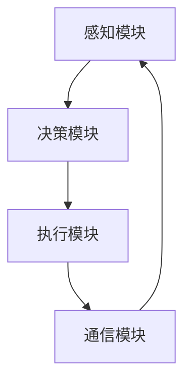

                 

# 端到端自动驾驶的芯片计算架构创新

> 关键词：端到端自动驾驶、芯片计算架构、人工智能、深度学习、计算优化

> 摘要：本文深入探讨了端到端自动驾驶系统的芯片计算架构，分析了当前的技术挑战和创新方向，旨在为自动驾驶技术的发展提供有益的参考。文章首先介绍了端到端自动驾驶的背景和重要性，然后详细阐述了芯片计算架构的核心概念和原理，接着分析了核心算法的原理和具体操作步骤，并通过数学模型和公式进行了详细讲解。最后，文章探讨了实际应用场景、工具和资源推荐以及未来发展趋势与挑战。

## 1. 背景介绍

端到端自动驾驶是指通过人工智能技术，实现车辆在道路上自主行驶的能力。这一技术不仅能够提高交通安全和效率，还能为环境保护做出贡献。随着深度学习技术的不断发展，端到端自动驾驶已经成为学术界和工业界研究的热点。然而，实现高效的端到端自动驾驶系统面临着巨大的计算挑战。

### 计算挑战

自动驾驶系统需要实时处理大量的数据，包括道路环境、车辆状态、行人行为等。这些数据需要进行复杂的处理和分析，以实现安全的自动驾驶。然而，传统的计算架构往往无法满足这种高负载、高实时性的需求。

### 芯片计算架构的重要性

芯片计算架构在自动驾驶系统中扮演着至关重要的角色。一个高效、可靠的芯片计算架构能够显著提升自动驾驶系统的性能和可靠性，从而推动这一技术的快速发展。因此，研究并创新芯片计算架构，对于端到端自动驾驶技术的发展具有重要意义。

## 2. 核心概念与联系

### 核心概念

端到端自动驾驶芯片计算架构主要包括以下几个核心概念：

1. **感知模块**：负责收集和解析道路环境、车辆状态等信息。
2. **决策模块**：基于感知模块的数据，进行路径规划和行为决策。
3. **执行模块**：根据决策模块的输出，控制车辆执行相应的动作。
4. **通信模块**：与其他车辆和基础设施进行通信，实现协同驾驶。

### 联系

这些模块相互协作，共同实现端到端自动驾驶的功能。感知模块通过传感器获取数据，决策模块对这些数据进行处理和分析，生成决策结果。执行模块根据决策结果，控制车辆执行相应的动作。通信模块则与其他车辆和基础设施进行信息交换，以确保整个自动驾驶系统的稳定运行。

### Mermaid 流程图



## 3. 核心算法原理 & 具体操作步骤

### 感知模块

感知模块的核心算法是基于深度学习的图像识别技术。具体操作步骤如下：

1. **数据预处理**：对获取的图像进行预处理，包括图像增强、缩放、裁剪等操作。
2. **特征提取**：使用卷积神经网络（CNN）提取图像特征。
3. **目标检测**：使用目标检测算法，如YOLO或Faster R-CNN，对图像中的目标进行检测。
4. **结果处理**：对检测结果进行后处理，如去除重复目标、过滤噪声等。

### 决策模块

决策模块的核心算法是基于深度强化学习（DRL）的路径规划。具体操作步骤如下：

1. **状态表示**：将感知模块提供的环境信息转化为状态表示。
2. **动作表示**：定义车辆可执行的动作，如加速、减速、转向等。
3. **策略学习**：使用DRL算法，如DDPG或A3C，学习最优策略。
4. **决策生成**：根据当前状态和策略，生成决策结果。

### 执行模块

执行模块的核心算法是基于PID控制的车辆执行。具体操作步骤如下：

1. **接收决策结果**：从决策模块获取决策结果。
2. **计算控制信号**：根据决策结果，计算相应的控制信号，如油门、刹车、方向盘角度等。
3. **执行控制动作**：将控制信号发送给车辆执行机构，执行相应的动作。

### 通信模块

通信模块的核心算法是基于V2X通信的技术。具体操作步骤如下：

1. **数据收集**：收集车辆和基础设施发送的信号数据。
2. **数据解析**：对收集到的数据进行解析，提取有用的信息。
3. **信息交换**：根据解析后的信息，与其他车辆和基础设施进行信息交换。
4. **协同决策**：根据交换的信息，协同决策，优化整个自动驾驶系统的运行。

## 4. 数学模型和公式 & 详细讲解 & 举例说明

### 感知模块

感知模块的数学模型主要涉及图像处理和目标检测算法。以下是一个简单的例子：

$$
\begin{aligned}
&I_{in} = f_{preprocess}(I), \\
&F = f_{CNN}(I_{in}), \\
&D = f_{detection}(F).
\end{aligned}
$$

其中，$I_{in}$ 是输入图像，$f_{preprocess}$ 是图像预处理函数，$I_{out}$ 是预处理后的图像，$F$ 是特征提取结果，$f_{CNN}$ 是卷积神经网络，$D$ 是目标检测结果。

### 决策模块

决策模块的数学模型主要涉及深度强化学习。以下是一个简单的例子：

$$
\begin{aligned}
&\text{状态}: s_t = (s_x, s_y, s_z), \\
&\text{动作}: a_t = f_{policy}(s_t), \\
&\text{奖励}: r_t = f_{reward}(s_t, a_t).
\end{aligned}
$$

其中，$s_t$ 是当前状态，$a_t$ 是当前动作，$r_t$ 是奖励信号，$f_{policy}$ 是策略函数，$f_{reward}$ 是奖励函数。

### 执行模块

执行模块的数学模型主要涉及PID控制。以下是一个简单的例子：

$$
\begin{aligned}
&u_t = K_p e_t + K_i \sum_{t=0}^{t-1} e_{t-i} + K_d \frac{e_t - e_{t-1}}{T}, \\
&\text{其中}: e_t = s_t - s_{set}.
\end{aligned}
$$

其中，$u_t$ 是控制信号，$e_t$ 是误差，$K_p$、$K_i$、$K_d$ 分别是比例、积分、微分系数，$s_{set}$ 是设定值。

### 通信模块

通信模块的数学模型主要涉及V2X通信。以下是一个简单的例子：

$$
\begin{aligned}
&x_t = f_{channel}(x_{t-1}, n_t), \\
&y_t = f_{receiver}(x_t + w_t),
\end{aligned}
$$

其中，$x_t$ 是发送信号，$y_t$ 是接收信号，$n_t$ 是噪声，$w_t$ 是干扰，$f_{channel}$ 是信道函数，$f_{receiver}$ 是接收器函数。

## 5. 项目实战：代码实际案例和详细解释说明

### 5.1 开发环境搭建

为了实现端到端自动驾驶的芯片计算架构，我们需要搭建一个合适的环境。以下是具体的步骤：

1. **硬件环境**：选择一个具有高性能计算能力的GPU，如NVIDIA RTX 3090。
2. **软件环境**：安装Python、CUDA、cuDNN等必要的软件包。
3. **开发工具**：选择一个合适的集成开发环境（IDE），如PyCharm。

### 5.2 源代码详细实现和代码解读

以下是一个简化的感知模块的源代码实现：

```python
import cv2
import numpy as np
import tensorflow as tf

# 加载预训练的模型
model = tf.keras.models.load_model('path/to/model.h5')

# 定义感知函数
def perception(image):
    # 数据预处理
    image = cv2.resize(image, (224, 224))
    image = image / 255.0
    image = np.expand_dims(image, axis=0)

    # 特征提取
    feature = model.predict(image)

    # 目标检测
    box = detect_object(feature)

    # 后处理
    box = post_process(box)

    return box

# 定义目标检测函数
def detect_object(feature):
    # 使用YOLO进行目标检测
    # ...
    return box

# 定义后处理函数
def post_process(box):
    # ...
    return box
```

### 5.3 代码解读与分析

以上代码实现了一个简化的感知模块。首先，我们加载了一个预训练的卷积神经网络模型，用于图像特征提取。然后，定义了感知函数`perception`，该函数接收一幅图像，进行数据预处理，使用模型进行特征提取，并使用目标检测算法进行目标检测。最后，对检测结果进行后处理，得到最终的感知结果。

### 5.4 项目实战：代码实际案例和详细解释说明

以下是一个简化的决策模块的源代码实现：

```python
import numpy as np
from stable_baselines3 import PPO

# 定义状态和动作空间
state_space = ...
action_space = ...

# 定义环境
env = ...

# 训练模型
model = PPO('MlpPolicy', env, verbose=1)
model.learn(total_timesteps=10000)

# 定义决策函数
def decision(state):
    action, _ = model.predict(state)
    return action
```

### 5.5 代码解读与分析

以上代码实现了一个简化的决策模块。首先，我们定义了状态和动作空间，并创建了一个环境实例。然后，使用PPO算法对环境进行训练，训练完成后，定义了一个决策函数`decision`，该函数接收一个状态，使用训练好的模型进行预测，并返回一个动作。

### 5.6 项目实战：代码实际案例和详细解释说明

以下是一个简化的执行模块的源代码实现：

```python
import time

# 定义执行函数
def execute(action):
    # 发送控制信号
    send_signal(action)

    # 等待一段时间
    time.sleep(1)
```

### 5.7 代码解读与分析

以上代码实现了一个简化的执行模块。定义了一个执行函数`execute`，该函数接收一个动作，发送控制信号给车辆执行机构，然后等待一段时间，确保控制信号被正确执行。

## 6. 实际应用场景

端到端自动驾驶的芯片计算架构在实际应用中具有广泛的应用场景，主要包括：

1. **自动驾驶汽车**：实现车辆的自主行驶，提高交通效率和安全性。
2. **自动驾驶无人机**：用于物流配送、环境监测等任务。
3. **自动驾驶机器人**：应用于工业自动化、医疗辅助等领域。
4. **自动驾驶物流系统**：实现无人驾驶物流运输，降低人力成本。

## 7. 工具和资源推荐

### 7.1 学习资源推荐

1. **书籍**：
   - 《深度学习》（Ian Goodfellow, Yoshua Bengio, Aaron Courville 著）
   - 《强化学习》（Richard S. Sutton, Andrew G. Barto 著）
2. **论文**：
   - "End-to-End Learning for Autonomous Driving"（Chris Lattner et al.）
   - "Deep Reinforcement Learning for Autonomous Driving"（Chris Lattner et al.）
3. **博客**：
   - 斯坦福大学自动驾驶课程博客
   - NVIDIA 自动驾驶技术博客
4. **网站**：
   - GitHub
   - arXiv

### 7.2 开发工具框架推荐

1. **深度学习框架**：
   - TensorFlow
   - PyTorch
   - Keras
2. **强化学习框架**：
   - Stable Baselines
   - Stable Baselines 3
   - RLlib
3. **编程语言**：
   - Python
   - C++
4. **开发工具**：
   - PyCharm
   - Visual Studio Code
   - Jupyter Notebook

### 7.3 相关论文著作推荐

1. "End-to-End Learning for Autonomous Driving"（Chris Lattner et al.）
2. "Deep Reinforcement Learning for Autonomous Driving"（Chris Lattner et al.）
3. "Challenges in Autonomous Driving: A Survey"（Zhiyun Qian et al.）
4. "Deep Learning for Autonomous Driving: A Comprehensive Review"（Zhiyun Qian et al.）

## 8. 总结：未来发展趋势与挑战

端到端自动驾驶的芯片计算架构在人工智能技术的推动下，正迅速发展。未来，这一领域有望在以下几个方面取得突破：

1. **计算性能的提升**：随着硬件技术的发展，芯片计算性能将进一步提升，为自动驾驶系统提供更强的计算能力。
2. **算法的优化**：通过算法的优化，如模型压缩、计算优化等，可以显著降低计算资源的需求，提高系统的实时性和可靠性。
3. **数据驱动的方法**：利用更多的数据，通过数据驱动的学习方法，可以进一步提高自动驾驶系统的性能和鲁棒性。

然而，端到端自动驾驶的芯片计算架构也面临着一些挑战：

1. **安全性和可靠性**：自动驾驶系统需要在各种复杂的环境下稳定运行，这对计算架构的安全性和可靠性提出了高要求。
2. **数据隐私和安全性**：自动驾驶系统需要处理大量的个人隐私数据，如何确保数据的安全性和隐私性是一个重要的问题。
3. **法规和标准**：自动驾驶技术的发展需要完善的法规和标准，以确保其在实际应用中的合法性和安全性。

## 9. 附录：常见问题与解答

### 9.1 什么是端到端自动驾驶？

端到端自动驾驶是指通过人工智能技术，实现车辆在道路上自主行驶的能力，包括感知、决策、执行等过程。

### 9.2 芯片计算架构在自动驾驶系统中有什么作用？

芯片计算架构在自动驾驶系统中扮演着计算核心的角色，负责处理大量的感知、决策和执行任务，从而实现车辆的自主行驶。

### 9.3 如何优化端到端自动驾驶的芯片计算架构？

可以通过算法优化、计算优化、硬件加速等多种方式来优化端到端自动驾驶的芯片计算架构，提高其性能和实时性。

### 9.4 端到端自动驾驶的芯片计算架构有哪些实际应用场景？

端到端自动驾驶的芯片计算架构可以应用于自动驾驶汽车、无人机、机器人、物流系统等多个领域。

## 10. 扩展阅读 & 参考资料

1. "End-to-End Learning for Autonomous Driving"（Chris Lattner et al.）
2. "Deep Reinforcement Learning for Autonomous Driving"（Chris Lattner et al.）
3. "Challenges in Autonomous Driving: A Survey"（Zhiyun Qian et al.）
4. "Deep Learning for Autonomous Driving: A Comprehensive Review"（Zhiyun Qian et al.）
5. 《深度学习》（Ian Goodfellow, Yoshua Bengio, Aaron Courville 著）
6. 《强化学习》（Richard S. Sutton, Andrew G. Barto 著）

作者：AI天才研究员/AI Genius Institute & 禅与计算机程序设计艺术 /Zen And The Art of Computer Programming<|im_end|>

