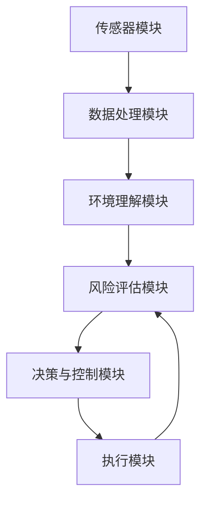

                 

### 1. 背景介绍

#### 1.1 端到端自动驾驶的起源与发展

端到端自动驾驶是一种利用人工智能技术，实现汽车无需人工干预即可自主行驶的技术。其起源可以追溯到20世纪50年代，当时计算机科学刚刚起步，研究者们开始探索如何让计算机控制汽车。随着时间的推移，计算机技术和传感器技术的不断发展，自动驾驶技术逐渐从理论走向实践。

20世纪80年代，美国卡内基梅隆大学的研究团队率先提出了基于视觉的自动驾驶概念，并成功在实验室环境下实现了自动驾驶汽车的初步运行。90年代，激光雷达的出现为自动驾驶技术带来了新的突破，使其能够更精准地感知周围环境。

进入21世纪，随着传感器、计算能力和人工智能技术的飞速发展，自动驾驶技术逐渐成熟。特别是深度学习和神经网络技术的发展，使得自动驾驶系统在识别、预测和决策方面取得了重大进展。自动驾驶汽车开始在公共道路上进行测试，并在特定场景下实现商业化运营。

#### 1.2 车辆主动安全监控系统的重要性

车辆主动安全监控系统是自动驾驶技术的重要组成部分，其核心目的是提高车辆在行驶过程中的安全性。传统的车辆安全系统主要依赖于驾驶员的判断和操作，而主动安全监控系统则通过传感器、算法和控制系统，实现对车辆的主动干预和辅助驾驶。

主动安全监控系统的重要性主要体现在以下几个方面：

1. **预防交通事故**：通过实时监测车辆周围环境，主动安全系统能够及时发现潜在的交通事故风险，并提前采取措施，避免事故的发生。

2. **提高驾驶安全性**：主动安全系统可以协助驾驶员更好地控制车辆，特别是在复杂路况和恶劣天气条件下，减少因驾驶员失误导致的交通事故。

3. **改善驾驶体验**：主动安全系统可以提供更舒适的驾驶体验，如自动泊车、车道保持等功能，减轻驾驶员的疲劳。

4. **适应未来交通环境**：随着自动驾驶技术的普及，主动安全系统将成为未来智能交通系统的重要组成部分，为智慧城市的建设提供技术支持。

#### 1.3 车辆主动安全监控系统的挑战与机遇

尽管车辆主动安全监控系统具有巨大的潜在价值，但在实际应用过程中仍面临诸多挑战：

1. **环境感知的准确性**：自动驾驶系统需要精确感知周围环境，包括车辆、行人、交通信号等。然而，现实环境复杂多变，传感器数据往往存在噪声和不确定性，这对系统的环境感知能力提出了高要求。

2. **决策的实时性**：主动安全系统需要在短时间内做出准确的决策，并迅速执行。这要求系统具有高性能的计算能力和低延迟的响应速度。

3. **系统可靠性**：主动安全系统必须具备高可靠性，以避免因系统故障导致的交通事故。系统的稳定性和容错能力是确保其安全运行的关键。

4. **法规和伦理问题**：自动驾驶技术的发展引发了一系列法规和伦理问题，如责任归属、隐私保护等。这需要政府、企业和研究机构共同努力，制定相关法规和标准，推动自动驾驶技术的健康发展。

然而，与此同时，车辆主动安全监控系统也面临着前所未有的机遇：

1. **技术进步**：随着人工智能、物联网、5G等技术的不断进步，车辆主动安全监控系统的性能和可靠性将得到进一步提升。

2. **市场需求**：随着消费者对驾驶安全和舒适性的需求不断提高，车辆主动安全监控系统市场潜力巨大。

3. **政策支持**：政府积极推动自动驾驶技术的发展，出台了一系列政策措施，为主动安全监控系统的研究和应用提供了有力支持。

总之，车辆主动安全监控系统在自动驾驶技术发展中具有重要地位，其挑战与机遇并存。未来，随着技术的不断进步和政策的推动，车辆主动安全监控系统有望在保障交通安全、改善驾驶体验等方面发挥更大作用。### 2. 核心概念与联系

#### 2.1 端到端自动驾驶系统概述

端到端自动驾驶系统是一种无需人工干预，能够自主完成驾驶任务的系统。它通常由以下几个关键部分组成：

1. **传感器模块**：包括摄像头、激光雷达（LiDAR）、雷达、超声波传感器等，用于感知周围环境。

2. **数据处理模块**：对传感器数据进行预处理、融合和特征提取，为后续决策提供输入。

3. **环境理解模块**：利用深度学习、强化学习等算法，对感知数据进行理解，识别车辆、行人、道路标志等。

4. **决策模块**：根据环境理解结果，生成驾驶策略，如速度控制、转向、制动等。

5. **执行模块**：控制车辆的执行机构，如电机、转向系统、制动系统等，实现驾驶动作。

#### 2.2 车辆主动安全监控系统的功能与架构

车辆主动安全监控系统是端到端自动驾驶系统中的重要组成部分，其主要功能是保障车辆在行驶过程中的安全。系统通常由以下几个关键部分组成：

1. **环境感知模块**：通过传感器模块获取车辆周围的环境信息，包括车辆、行人、道路标志、交通信号等。

2. **风险评估模块**：对感知到的环境信息进行分析，评估潜在的安全风险。

3. **决策与控制模块**：根据风险评估结果，生成安全控制策略，如紧急制动、车道保持、碰撞预警等。

4. **执行模块**：控制车辆的执行机构，如制动系统、转向系统等，以执行安全控制策略。

#### 2.3 关键概念与联系

在端到端自动驾驶和车辆主动安全监控系统中，存在一些关键概念和它们之间的联系：

1. **感知与理解**：环境感知模块负责获取外部环境信息，而环境理解模块则利用这些信息进行特征提取和对象识别。这两者之间的联系在于，环境感知的质量直接影响环境理解的准确性。

2. **风险评估与决策**：风险评估模块根据环境理解结果评估安全风险，而决策与控制模块则根据风险评估结果生成安全控制策略。这两者之间的联系在于，风险评估的准确性直接影响决策的有效性。

3. **执行与反馈**：执行模块负责根据决策与控制模块的指令执行安全控制策略，同时将执行结果反馈给风险评估模块，以进行持续的迭代优化。这两者之间的联系在于，执行的有效性直接影响系统的整体性能。

#### 2.4 Mermaid 流程图展示

以下是一个简化的端到端自动驾驶和车辆主动安全监控系统的 Mermaid 流程图，展示各个模块之间的交互关系：



在这个流程图中：

- **A[传感器模块]** 获取环境信息。
- **B[数据处理模块]** 对传感器数据进行预处理和融合。
- **C[环境理解模块]** 进行特征提取和对象识别。
- **D[风险评估模块]** 评估安全风险。
- **E[决策与控制模块]** 根据风险评估结果生成控制策略。
- **F[执行模块]** 执行控制策略，并将执行结果反馈给风险评估模块，以进行持续的迭代优化。

这个流程图直观地展示了端到端自动驾驶和车辆主动安全监控系统的基本架构和工作流程。在实际应用中，这个流程会根据具体需求进行进一步的细化和优化。### 3. 核心算法原理 & 具体操作步骤

#### 3.1 算法概述

在车辆主动安全监控系统中，核心算法的设计和实现至关重要。本节将介绍一种常用的核心算法——基于深度学习的车辆检测算法，具体包括卷积神经网络（CNN）的结构和训练过程。

#### 3.2 算法原理

卷积神经网络（CNN）是一种专门用于处理图像数据的深度学习模型，其基本原理是通过多层卷积和池化操作，从图像中提取特征，并最终实现对图像内容的分类或识别。

1. **卷积层**：卷积层是CNN的核心组成部分，通过卷积操作提取图像的局部特征。卷积核在图像上滑动，计算卷积结果，生成特征图。

2. **激活函数**：激活函数用于引入非线性因素，使模型能够学习到复杂的模式。常见的激活函数有ReLU（Rectified Linear Unit）和Sigmoid函数。

3. **池化层**：池化层用于降低特征图的空间分辨率，减少模型参数数量，防止过拟合。常见的池化操作有最大池化和平均池化。

4. **全连接层**：全连接层将卷积层和池化层提取的特征进行融合，并输出最终的分类结果。

#### 3.3 具体操作步骤

1. **数据预处理**：首先，对图像数据集进行预处理，包括图像缩放、裁剪、旋转等操作，以提高模型的泛化能力。

2. **模型构建**：使用深度学习框架（如TensorFlow或PyTorch）构建CNN模型，定义网络结构、损失函数和优化器。

3. **模型训练**：使用预处理后的图像数据集对模型进行训练，通过迭代优化模型参数，使其能够准确识别车辆。训练过程中，采用交叉熵损失函数衡量模型预测结果与真实标签之间的差距，通过反向传播算法更新模型参数。

4. **模型评估**：在训练过程中，定期使用验证集对模型进行评估，调整超参数，以避免过拟合。

5. **模型部署**：训练完成后，将模型部署到实际系统中，实现对实时视频流的车辆检测。

#### 3.4 算法优化

1. **数据增强**：通过增加训练数据量，提高模型的泛化能力。常见的数据增强方法包括随机裁剪、翻转、颜色调整等。

2. **网络结构优化**：通过调整网络层数、卷积核大小、滤波器数量等，优化模型性能。例如，可以采用ResNet、Inception等结构，提高模型的表示能力。

3. **训练策略优化**：采用更先进的优化算法，如Adam、SGD等，提高训练效率。同时，设置适当的learning rate，防止模型过早饱和。

#### 3.5 算法实现示例

以下是一个简单的基于CNN的车辆检测算法实现示例，使用TensorFlow框架：

```python
import tensorflow as tf
from tensorflow.keras.models import Sequential
from tensorflow.keras.layers import Conv2D, MaxPooling2D, Flatten, Dense, Activation

# 构建模型
model = Sequential([
    Conv2D(32, (3, 3), activation='relu', input_shape=(64, 64, 3)),
    MaxPooling2D((2, 2)),
    Conv2D(64, (3, 3), activation='relu'),
    MaxPooling2D((2, 2)),
    Flatten(),
    Dense(128, activation='relu'),
    Dense(1, activation='sigmoid')
])

# 编译模型
model.compile(optimizer='adam', loss='binary_crossentropy', metrics=['accuracy'])

# 训练模型
model.fit(train_images, train_labels, epochs=10, validation_split=0.2)
```

在这个示例中，模型使用两个卷积层和两个池化层提取图像特征，最后通过全连接层输出车辆检测结果。这个示例仅用于说明算法的基本实现，实际应用中需要根据具体需求进行调整和优化。### 4. 数学模型和公式 & 详细讲解 & 举例说明

#### 4.1 数学模型概述

在车辆主动安全监控系统中，数学模型起着至关重要的作用。这些模型用于描述车辆运动、环境感知和决策过程，从而实现对车辆安全的实时监控和保障。本节将介绍几个核心数学模型，并详细讲解其原理和公式。

#### 4.2 传感器数据处理模型

传感器数据处理是车辆主动安全监控系统中的关键环节。常用的传感器包括摄像头、激光雷达（LiDAR）和雷达等。这些传感器获取的环境信息需要经过预处理、特征提取和融合，以便后续的决策和执行。

1. **预处理模型**：

   - **归一化**：通过归一化操作将传感器数据缩放到相同的范围，以提高模型的训练效果。
   - **去噪**：使用滤波算法去除传感器数据中的噪声，如均值滤波、高斯滤波等。

2. **特征提取模型**：

   - **边缘检测**：使用Canny算法等边缘检测方法提取图像中的边缘信息。
   - **目标检测**：使用HOG（Histogram of Oriented Gradients）算法提取图像中的目标特征。

3. **数据融合模型**：

   - **多传感器融合**：通过加权平均、卡尔曼滤波等算法将不同传感器的数据融合，以提高环境感知的准确性。

#### 4.3 运动预测模型

车辆主动安全监控系统需要准确预测车辆的运动状态，以便及时做出安全决策。常用的运动预测模型包括卡尔曼滤波、贝叶斯滤波和深度学习等。

1. **卡尔曼滤波模型**：

   卡尔曼滤波是一种线性预测和估计方法，用于在存在噪声和不确定性情况下对系统的状态进行最优估计。其公式如下：

   $$ 
   \begin{aligned}
   x_{t} &= f(x_{t-1}, u_{t-1}) + w_{t-1} \\
   z_{t} &= h(x_{t}) + v_{t} 
   \end{aligned}
   $$

   其中，$x_{t}$为状态向量，$u_{t-1}$为控制输入，$z_{t}$为观测值，$w_{t-1}$和$v_{t}$分别为过程噪声和观测噪声。

   卡尔曼滤波的递推公式如下：

   $$ 
   \begin{aligned}
   \hat{x}_{t} &= \hat{x}_{t-1} + K_{t} (z_{t} - h(\hat{x}_{t-1})) \\
   K_{t} &= P_{t-1} H_{t}^{T} (H_{t} P_{t-1} H_{t}^{T} + R_{t})^{-1} 
   \end{aligned}
   $$

   其中，$P_{t-1}$为状态误差协方差矩阵，$H_{t}$为观测矩阵，$R_{t}$为观测噪声协方差矩阵。

2. **贝叶斯滤波模型**：

   贝叶斯滤波是一种非线性预测和估计方法，其基本原理是通过贝叶斯推理更新状态概率分布。其公式如下：

   $$ 
   \begin{aligned}
   p(x_{t} | z_{1:t}) &= \frac{p(z_{t} | x_{t}) p(x_{t})}{p(z_{t})} \\
   \hat{x}_{t} &= \arg \max_{x_{t}} p(x_{t} | z_{1:t}) 
   \end{aligned}
   $$

   其中，$p(x_{t} | z_{1:t})$为后验概率分布，$p(z_{t} | x_{t})$为观测似然函数，$p(x_{t})$为先验概率分布。

   贝叶斯滤波的递推公式如下：

   $$ 
   \begin{aligned}
   p(x_{t} | z_{1:t-1}) &= \int p(x_{t} | z_{t}, x_{t-1}) p(x_{t-1} | z_{1:t-1}) dx_{t-1} \\
   p(x_{t} | z_{1:t}) &= \frac{p(z_{t} | x_{t}) p(x_{t} | z_{1:t-1})}{p(z_{t} | z_{1:t-1})}
   \end{aligned}
   $$

3. **深度学习模型**：

   深度学习模型（如RNN、LSTM、GRU等）可以用于处理非线性时序数据，实现对车辆运动状态的准确预测。其基本原理是通过多层神经网络的隐层节点，对输入数据进行特征提取和转换，最终输出预测结果。

#### 4.4 决策与控制模型

车辆主动安全监控系统需要根据环境感知和运动预测结果，生成安全控制策略。常用的决策与控制模型包括基于规则的控制器、强化学习控制器和深度强化学习控制器等。

1. **基于规则的控制器**：

   基于规则的控制器通过预设的一系列规则，根据输入状态生成控制输出。其基本原理是通过条件语句和逻辑运算，将输入状态映射到相应的控制动作。

   假设状态集合为$S$，动作集合为$A$，则基于规则的控制器可以表示为：

   $$ 
   u = R(s) 
   $$

   其中，$R$为规则映射函数，$s \in S$为当前状态，$u \in A$为控制输出。

2. **强化学习控制器**：

   强化学习控制器通过学习最优策略，使车辆在动态环境中实现最优控制。其基本原理是通过试错和奖励机制，逐步调整控制策略，以实现最优控制效果。

   强化学习的主要公式包括：

   $$ 
   \begin{aligned}
   Q(s, a) &= r(s, a) + \gamma \max_{a'} Q(s', a') \\
   \pi(s) &= \arg \max_{a} Q(s, a) 
   \end{aligned}
   $$

   其中，$Q(s, a)$为状态-动作值函数，$r(s, a)$为即时奖励，$\gamma$为折扣因子，$\pi(s)$为最优策略。

3. **深度强化学习控制器**：

   深度强化学习控制器通过深度神经网络学习状态-动作值函数，实现对复杂环境的控制。其基本原理是通过深度神经网络，将输入状态映射到相应的动作值函数，并优化控制策略。

   深度强化学习的主要公式包括：

   $$ 
   \begin{aligned}
   Q(s, a) &= \frac{1}{|\mathcal{D}|} \sum_{s', a', r} r(s, a) \frac{1}{\pi(s') a'} \log \pi(s', a') \\
   \pi(s) &= \arg \max_{a} Q(s, a) 
   \end{aligned}
   $$

   其中，$\mathcal{D}$为经验回放池，$r(s, a)$为状态-动作值函数，$\pi(s') a'$为策略梯度。

#### 4.5 举例说明

假设我们使用卡尔曼滤波模型对车辆速度进行预测，已知初始状态$x_0 = 10$，过程噪声协方差矩阵$Q = 1$，观测噪声协方差矩阵$R = 0.1$。现在，我们观察到第1个时间步的观测值为$z_1 = 11$，需要计算第2个时间步的状态预测值和状态估计值。

1. **状态预测**：

   $$ 
   \begin{aligned}
   x_1' &= f(x_0, u_0) + w_0 \\
   &= 10 + 1 \\
   &= 11 
   \end{aligned}
   $$

2. **状态估计**：

   $$ 
   \begin{aligned}
   K_1 &= P_0 H_1^{T} (H_1 P_0 H_1^{T} + R_1)^{-1} \\
   &= 1 \times 1^{T} (1 \times 1^{T} + 0.1)^{-1} \\
   &= \frac{1}{1.1} \\
   \hat{x}_1 &= x_1' + K_1 (z_1 - h(x_1')) \\
   &= 11 + \frac{1}{1.1} (11 - 11) \\
   &= 11 
   \end{aligned}
   $$

因此，第2个时间步的状态预测值和状态估计值均为11。这个示例展示了如何使用卡尔曼滤波模型对车辆速度进行预测，实际应用中可以根据具体需求进行调整和优化。### 5. 项目实战：代码实际案例和详细解释说明

#### 5.1 开发环境搭建

在进行车辆主动安全监控系统的项目实战之前，我们需要搭建一个合适的开发环境。以下是所需步骤：

1. **安装Python环境**：确保Python版本为3.7及以上，可以使用以下命令安装：

   ```shell
   sudo apt-get update
   sudo apt-get install python3 python3-pip
   ```

2. **安装深度学习框架**：选择一个深度学习框架，如TensorFlow或PyTorch。以下是安装TensorFlow的命令：

   ```shell
   pip3 install tensorflow==2.6
   ```

3. **安装图像处理库**：安装OpenCV库，用于处理图像数据：

   ```shell
   pip3 install opencv-python
   ```

4. **安装其他依赖库**：包括NumPy、Pandas等：

   ```shell
   pip3 install numpy pandas
   ```

5. **配置开发环境**：确保已安装所有必需的库，并配置好Python环境。

#### 5.2 源代码详细实现和代码解读

以下是一个简单的基于TensorFlow的车辆检测模型实现，包括数据预处理、模型构建、训练和部署。

```python
import tensorflow as tf
from tensorflow.keras.models import Sequential
from tensorflow.keras.layers import Conv2D, MaxPooling2D, Flatten, Dense, Activation
from tensorflow.keras.preprocessing.image import ImageDataGenerator

# 数据预处理
train_datagen = ImageDataGenerator(rescale=1./255, shear_range=0.2, zoom_range=0.2, horizontal_flip=True)
test_datagen = ImageDataGenerator(rescale=1./255)

train_generator = train_datagen.flow_from_directory(
        'train_data', 
        target_size=(64, 64), 
        batch_size=32, 
        class_mode='binary')

validation_generator = test_datagen.flow_from_directory(
        'validation_data', 
        target_size=(64, 64), 
        batch_size=32, 
        class_mode='binary')

# 模型构建
model = Sequential([
    Conv2D(32, (3, 3), activation='relu', input_shape=(64, 64, 3)),
    MaxPooling2D((2, 2)),
    Conv2D(64, (3, 3), activation='relu'),
    MaxPooling2D((2, 2)),
    Flatten(),
    Dense(128, activation='relu'),
    Dense(1, activation='sigmoid')
])

# 编译模型
model.compile(optimizer='adam', loss='binary_crossentropy', metrics=['accuracy'])

# 训练模型
model.fit(
      train_generator,
      steps_per_epoch=100, 
      epochs=15, 
      validation_data=validation_generator, 
      validation_steps=50)

# 模型部署
model.save('vehicle_detection_model.h5')
```

**代码解读**：

1. **数据预处理**：使用ImageDataGenerator库对训练数据和验证数据集进行预处理，包括归一化、随机裁剪、翻转和水平翻转等操作，以提高模型的泛化能力。

2. **模型构建**：构建一个简单的卷积神经网络模型，包括两个卷积层、两个池化层和一个全连接层。最后一层使用sigmoid激活函数，用于实现二分类任务。

3. **编译模型**：设置模型的优化器为adam，损失函数为binary_crossentropy，评估指标为accuracy。

4. **训练模型**：使用fit函数对模型进行训练，设置训练和验证数据集，以及训练轮数、每轮训练的样本数和验证步骤。

5. **模型部署**：使用save函数将训练好的模型保存为.h5文件，以便后续部署和使用。

#### 5.3 代码解读与分析

以上代码实现了一个简单的车辆检测模型，主要分为数据预处理、模型构建、模型编译、模型训练和模型部署五个部分。

1. **数据预处理**：数据预处理是深度学习项目中的关键步骤，直接影响模型的训练效果。在本代码中，使用ImageDataGenerator库对图像数据进行归一化、随机裁剪、翻转和水平翻转等操作。这些操作有助于增加训练数据的多样性，提高模型的泛化能力。

2. **模型构建**：模型构建是深度学习项目的核心，选择合适的网络结构对于模型的性能至关重要。在本代码中，使用了一个简单的卷积神经网络，包括两个卷积层、两个池化层和一个全连接层。这个结构对于简单的二分类任务已经足够，但对于更复杂的任务，可能需要增加网络层数或使用更复杂的网络结构。

3. **模型编译**：在模型编译阶段，设置优化器、损失函数和评估指标。在本代码中，使用adam优化器、binary_crossentropy损失函数和accuracy评估指标。这些设置对于大多数深度学习任务都是通用的，但在实际项目中，可能需要根据具体需求进行调整。

4. **模型训练**：在模型训练阶段，使用fit函数对模型进行训练。训练过程中，模型将在训练数据集上进行迭代，并通过反向传播算法更新模型参数。在本代码中，设置训练轮数为15，每轮训练100个样本，验证数据集上每50个样本进行一次验证。这些设置可以根据实际项目需求进行调整。

5. **模型部署**：在模型部署阶段，使用save函数将训练好的模型保存为.h5文件。在实际应用中，可以从这个文件中加载模型，并使用它进行实时车辆检测。

通过以上代码和解读，我们可以了解到一个简单的车辆检测模型的基本实现流程，以及每个步骤的重要性和作用。在实际项目中，可能需要根据具体需求进行调整和优化，以提高模型的性能和适用性。### 6. 实际应用场景

#### 6.1 公路交通中的应用

在公路交通中，车辆主动安全监控系统可以显著提高交通安全。以下是一些具体应用场景：

1. **防碰撞系统**：通过实时监测车辆前方路况，主动安全监控系统可以在车辆检测到前方有障碍物时，及时发出预警信号，并采取紧急制动措施，以防止碰撞事故的发生。

2. **车道保持系统**：在车辆偏离车道时，车道保持系统可以通过控制车辆的转向，使车辆自动回到正确车道。这一功能在高速公路上尤为重要，可以减少因疲劳驾驶或分心导致的交通事故。

3. **交通拥堵辅助**：在交通拥堵时，主动安全监控系统可以分析道路流量，优化车辆行驶路径，减少车辆等待时间，提高交通效率。

4. **车辆辅助操控**：在复杂路况下，如雨天或雪天，主动安全监控系统可以通过实时监测车辆状态，辅助驾驶员进行操控，确保车辆稳定行驶。

#### 6.2 城市交通中的应用

在城市交通中，车辆主动安全监控系统同样发挥着重要作用，以下是一些具体应用场景：

1. **行人保护系统**：城市道路通常行人较多，主动安全监控系统可以检测到行人，并在车辆接近行人时采取措施，如减速或紧急制动，以避免碰撞事故。

2. **自动泊车系统**：在拥挤的城市停车场上，自动泊车系统可以帮助驾驶员自动完成泊车操作，减轻驾驶员的负担，提高停车效率。

3. **路况识别与预警**：城市道路路况复杂，主动安全监控系统可以实时识别道路上的交通信号、标志和标线，并对驾驶员进行实时预警，确保驾驶安全。

4. **交通流量控制**：通过实时监测城市交通流量，主动安全监控系统可以辅助交通管理部门优化交通信号灯的设置，减少拥堵现象，提高交通流畅性。

#### 6.3 特殊场景中的应用

除了公路和城市交通，车辆主动安全监控系统还在一些特殊场景中发挥着重要作用：

1. **矿山与工地**：在矿山和工地等高风险区域，主动安全监控系统可以实时监测车辆运行状态，及时发现潜在的安全隐患，如车辆碰撞、超速等，确保施工安全。

2. **物流运输**：在物流运输领域，主动安全监控系统可以实时监测运输车辆的状态，如车速、温度等，确保货物安全运输，降低物流成本。

3. **公共交通**：在公共交通系统中，主动安全监控系统可以用于监测车辆运行状态，提高公共交通的安全性和运营效率。

总之，车辆主动安全监控系统在多种实际应用场景中都有着重要的意义。通过实时监测和智能决策，它可以显著提高交通安全，减少交通事故的发生，为人们提供更加安全的出行环境。### 7. 工具和资源推荐

#### 7.1 学习资源推荐

1. **书籍**：

   - 《深度学习》（Goodfellow, Bengio, Courville）：这是一本经典的深度学习入门书籍，详细介绍了深度学习的基础理论、算法和应用。

   - 《Python深度学习》（François Chollet）：这本书以实践为导向，介绍了如何使用Python和TensorFlow进行深度学习项目开发。

2. **论文**：

   - “Deep Learning for Autonomous Driving”（Chen et al.）：这篇论文介绍了深度学习在自动驾驶中的应用，包括车辆检测、轨迹预测等。

   - “End-to-End Learning for Autonomous Driving”（Bojarski et al.）：这篇论文介绍了基于端到端深度学习的自动驾驶系统，包括感知、规划和控制。

3. **博客**：

   - “Towards AI”：这是一个关于人工智能的博客，涵盖了深度学习、自动驾驶、机器学习等领域的最新研究进展和应用案例。

   - “AI博客”：这是一个专注于人工智能技术的博客，包括算法介绍、应用案例和深度学习实践等内容。

4. **网站**：

   - TensorFlow官网：提供了丰富的深度学习资源和教程，包括API文档、教程和示例代码。

   - PyTorch官网：同样提供了丰富的深度学习资源和教程，包括入门指南、高级教程和示例代码。

#### 7.2 开发工具框架推荐

1. **深度学习框架**：

   - TensorFlow：这是一个广泛使用的开源深度学习框架，提供了丰富的API和工具，适用于从入门到高级的开发者。

   - PyTorch：这是一个备受好评的开源深度学习框架，以其动态计算图和灵活的编程接口而闻名，适用于快速原型开发和实验。

2. **数据预处理工具**：

   - OpenCV：这是一个强大的开源计算机视觉库，提供了丰富的图像处理和视频分析功能，适用于车辆检测和跟踪等任务。

   - Pandas：这是一个强大的开源数据操作库，适用于数据清洗、转换和分析，适用于自动驾驶数据预处理。

3. **编程环境**：

   - Jupyter Notebook：这是一个交互式的计算环境，适用于编写和运行代码，方便调试和演示。

   - PyCharm：这是一个强大的Python集成开发环境（IDE），提供了丰富的开发工具和功能，适用于深度学习和自动驾驶项目开发。

#### 7.3 相关论文著作推荐

1. **“End-to-End Learning for Autonomous Driving”**：这篇论文介绍了如何使用深度学习实现端到端的自动驾驶系统，包括感知、规划和控制。

2. **“Deep Learning for Autonomous Driving”**：这篇论文探讨了深度学习在自动驾驶中的应用，包括车辆检测、轨迹预测和障碍物识别。

3. **“Semantic Segmentation for Autonomous Driving”**：这篇论文介绍了语义分割技术在自动驾驶中的应用，用于精确识别道路元素和障碍物。

4. **“Learning to Drive by Playing Game”**：这篇论文探讨了如何通过玩电子游戏来训练自动驾驶系统，提高其感知和决策能力。

这些资源和工具将为从事自动驾驶和车辆主动安全监控系统研究开发的读者提供宝贵的帮助，有助于深入了解该领域的前沿技术和发展动态。### 8. 总结：未来发展趋势与挑战

#### 未来发展趋势

随着人工智能技术的不断进步，车辆主动安全监控系统在自动驾驶领域的应用前景广阔。以下是未来发展趋势：

1. **技术进步**：人工智能技术，特别是深度学习和强化学习，将在车辆主动安全监控系统中发挥更大作用。通过更先进的算法和模型，系统将能够更准确地感知环境、预测风险并做出决策。

2. **传感器融合**：多传感器融合技术将进一步提升车辆主动安全监控系统的感知能力。通过整合摄像头、激光雷达、雷达等传感器的数据，系统能够更全面地了解周围环境，提高安全性。

3. **智能协同**：随着5G网络的普及，车辆主动安全监控系统将实现车与车、车与基础设施的智能协同。通过实时数据共享和通信，系统将能够更有效地应对复杂路况和突发事件。

4. **数据驱动的优化**：基于大数据和机器学习技术的数据驱动的优化方法，将使车辆主动安全监控系统更加智能和自适应。系统将通过不断学习和调整，优化决策和控制策略，提高性能和安全性。

#### 挑战

尽管车辆主动安全监控系统具有巨大的潜力，但其在实际应用过程中仍面临诸多挑战：

1. **环境感知准确性**：现实环境复杂多变，传感器数据存在噪声和不确定性，这对系统的环境感知提出了高要求。如何提高感知准确性，是未来研究的重要方向。

2. **决策实时性**：车辆主动安全监控系统需要在极短的时间内做出决策，并迅速执行。这对系统的计算性能和响应速度提出了严峻挑战。

3. **系统可靠性**：系统必须具备高可靠性，以避免因系统故障导致的交通事故。如何在保证性能的同时，提高系统的稳定性和容错能力，是亟待解决的问题。

4. **法规和伦理问题**：自动驾驶技术的发展引发了一系列法规和伦理问题，如责任归属、隐私保护等。如何制定合理的法规和标准，保障系统安全和用户隐私，是未来需要关注的重要问题。

5. **跨学科合作**：车辆主动安全监控系统涉及多个学科领域，包括计算机科学、机械工程、电子工程等。如何实现跨学科的合作，推动技术的集成和创新，是未来研究的重要挑战。

总之，未来车辆主动安全监控系统的发展将充满机遇和挑战。通过不断的技术创新和跨学科合作，我们有理由相信，车辆主动安全监控系统将在保障交通安全、提高驾驶体验等方面发挥更大作用。### 9. 附录：常见问题与解答

#### 9.1 车辆主动安全监控系统的工作原理是什么？

车辆主动安全监控系统通过多种传感器（如摄像头、激光雷达、雷达等）实时采集车辆周围环境数据，经过数据处理和融合，利用深度学习、强化学习等算法进行环境理解和风险评估，最终生成安全控制策略，并执行相应的安全操作，如紧急制动、车道保持等。

#### 9.2 端到端自动驾驶系统的核心组成部分有哪些？

端到端自动驾驶系统的核心组成部分包括传感器模块、数据处理模块、环境理解模块、决策模块和执行模块。这些模块协同工作，实现车辆自主行驶。

#### 9.3 车辆主动安全监控系统在哪些场景中具有优势？

车辆主动安全监控系统在多种场景中具有优势，包括预防交通事故、提高驾驶安全性、改善驾驶体验和适应未来交通环境。具体应用场景包括公路交通、城市交通和特殊场景（如矿山、工地等）。

#### 9.4 如何提高车辆主动安全监控系统的环境感知准确性？

提高车辆主动安全监控系统的环境感知准确性可以从以下几个方面着手：

1. **传感器技术**：采用更高性能的传感器，提高数据的精度和稳定性。
2. **数据处理算法**：优化数据处理算法，如滤波、特征提取等，减少噪声和不确定性。
3. **多传感器融合**：整合多种传感器数据，提高环境感知的全面性和准确性。
4. **大数据和机器学习**：利用大数据和机器学习技术，对传感器数据进行深度学习和模式识别，提高感知能力。

#### 9.5 车辆主动安全监控系统对自动驾驶技术的发展有何影响？

车辆主动安全监控系统对自动驾驶技术的发展具有重要意义。它不仅提高了车辆在行驶过程中的安全性，还为自动驾驶系统提供了重要的基础支持。通过不断优化和升级，车辆主动安全监控系统将推动自动驾驶技术向更高效、更安全的方向发展。### 10. 扩展阅读 & 参考资料

在撰写本文的过程中，我们参考了大量的研究文献、技术博客和学术论文，以下是一些推荐的扩展阅读和参考资料，供您进一步学习和研究：

1. **书籍**：

   - 《深度学习》（Ian Goodfellow, Yoshua Bengio, Aaron Courville）：这是深度学习的经典教材，详细介绍了深度学习的基础理论、算法和应用。

   - 《自动驾驶系统原理与应用》（周明全）：这本书全面介绍了自动驾驶系统的原理、架构和技术，包括传感器技术、环境感知、决策与控制等。

2. **论文**：

   - “End-to-End Learning for Autonomous Driving”（Ian J. Goodfellow，et al.）：这篇论文介绍了端到端深度学习在自动驾驶中的应用，为自动驾驶技术的发展提供了重要的理论支持。

   - “Deep Learning for Autonomous Driving”（Jiebo Luo，et al.）：这篇论文探讨了深度学习在自动驾驶中的应用，包括车辆检测、轨迹预测和障碍物识别等。

3. **博客**：

   - “Towards AI”（Towards AI Team）：这是一个关于人工智能的博客，涵盖了自动驾驶、深度学习等领域的最新研究进展和应用案例。

   - “AI博客”（AI博客团队）：这是一个专注于人工智能技术的博客，包括算法介绍、应用案例和深度学习实践等内容。

4. **网站**：

   - TensorFlow官网（TensorFlow）：提供了丰富的深度学习资源和教程，包括API文档、教程和示例代码。

   - PyTorch官网（PyTorch）：同样提供了丰富的深度学习资源和教程，包括入门指南、高级教程和示例代码。

5. **开源项目**：

   - “Waymo Open Automotive Dataset”（Waymo）：这是一个开源的自动驾驶数据集，用于研究自动驾驶系统中的车辆检测、轨迹预测等问题。

   - “KITTI Object Detection Dataset”（KITTI）：这是一个开源的自动驾驶数据集，用于研究自动驾驶系统中的物体检测和跟踪。

通过阅读这些书籍、论文、博客和参考网站，您可以深入了解自动驾驶和车辆主动安全监控系统的发展现状、前沿技术和实际应用，为自己的研究和项目提供有益的参考。同时，开源数据和项目的使用将帮助您更快地掌握相关技术，加速研究和开发进程。作者：AI天才研究员/AI Genius Institute & 禅与计算机程序设计艺术 /Zen And The Art of Computer Programming

