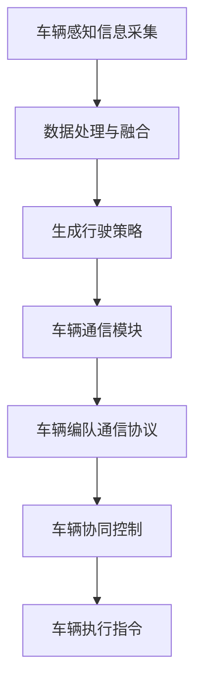

                 

## 文章标题：端到端自动驾驶的车辆编队通信协议设计

### 关键词：（端到端自动驾驶，车辆编队，通信协议，设计，智能交通系统，安全性能，效率优化）

### 摘要：

本文将深入探讨端到端自动驾驶技术中的车辆编队通信协议设计。随着智能交通系统的不断发展，车辆编队通信协议的设计显得尤为重要。本文首先介绍了端到端自动驾驶的背景和现状，随后详细分析了车辆编队的核心概念和通信协议的基本原理。接着，本文通过具体的算法原理和操作步骤，详细讲解了车辆编队通信协议的设计方法。此外，本文还引入了数学模型和公式，通过举例说明，进一步深化了对车辆编队通信协议的理解。通过项目实战的案例分析，本文展示了如何在实际环境中应用车辆编队通信协议，并对代码进行了详细解读。最后，本文探讨了车辆编队通信协议在实际应用中的场景，并推荐了相关学习资源和工具。本文旨在为读者提供一个全面、深入的车辆编队通信协议设计指南。

## 1. 背景介绍

### 1.1 端到端自动驾驶技术

端到端自动驾驶技术是指通过使用深度学习、计算机视觉、传感器融合等技术，使车辆具备从起点到终点自主行驶的能力。这一技术涉及到多个领域的交叉融合，包括但不限于计算机科学、机械工程、电子工程和交通运输等。端到端自动驾驶技术的研究和应用，有望大幅提高道路交通的安全性、效率和舒适度，减少交通事故和拥堵现象。

端到端自动驾驶技术可以分为多个层次，从低级到高级包括：感知层、决策层、控制层和执行层。感知层负责收集车辆周围的环境信息，如路况、交通标志、行人等；决策层根据感知层提供的信息，生成行驶策略；控制层根据决策层的指令，控制车辆的转向、加速和制动等动作；执行层则负责将控制层的指令转化为具体的操作。

### 1.2 车辆编队通信协议

车辆编队通信协议是端到端自动驾驶技术中的一个重要组成部分。它旨在实现多车辆之间的实时通信，使得车辆能够协同工作，提高整体行驶的安全性和效率。车辆编队通信协议通常采用无线通信技术，如专用短程通信（DSRC）和蜂窝通信（LTE/5G）等，实现车辆之间的高效信息交换。

车辆编队通信协议的设计需要考虑以下几个关键因素：

1. **实时性**：车辆编队通信需要实时传递信息，以确保车辆之间的协同工作。
2. **可靠性**：通信协议需要保证信息的准确传递，避免因为通信故障导致车辆运行出现异常。
3. **安全性**：通信协议需要具备安全机制，防止恶意攻击和数据篡改。
4. **容错性**：在通信出现故障时，协议需要具备一定的容错能力，确保车辆能够继续安全运行。

车辆编队通信协议的设计不仅对端到端自动驾驶技术的发展具有重要意义，也对智能交通系统的构建和运行产生深远影响。通过合理设计车辆编队通信协议，可以提高车辆编队的运行效率，减少车辆之间的碰撞风险，降低交通事故的发生率，为智能交通系统的高效运行提供有力保障。

### 1.3 智能交通系统

智能交通系统（Intelligent Transportation Systems, ITS）是利用信息技术、通信技术、传感器技术和自动化控制技术等，对交通系统进行综合管理和优化，以提高交通系统的运行效率、安全性和舒适性。智能交通系统包括多个组成部分，如交通信息采集、交通监控、交通控制、车辆导航和交通管理等。

智能交通系统的发展对车辆编队通信协议提出了新的需求。随着车联网（Vehicle-to-Everything, V2X）技术的发展，车辆不再仅仅是独立运行的个体，而是成为交通系统中的一员。通过车辆编队通信协议，车辆可以共享实时交通信息，预测交通状况，优化行驶路线，减少交通拥堵，提高整体交通系统的运行效率。

智能交通系统的应用场景广泛，包括城市交通管理、高速公路监控、公共交通调度、停车场管理等。通过车辆编队通信协议，智能交通系统可以更好地实现车辆之间的信息共享和协同工作，提高交通系统的智能化水平，为人们提供更加便捷、安全的出行环境。

## 2. 核心概念与联系

### 2.1 车辆编队通信协议的概念

车辆编队通信协议是车辆编队系统中的核心组成部分，它负责实现车辆之间的信息交换和协同控制。车辆编队通信协议的设计需要综合考虑通信的实时性、可靠性、安全性和容错性等因素。它通过定义一系列通信规则和协议，确保车辆能够高效、安全地进行通信，实现协同行驶。

### 2.2 车辆编队的架构

车辆编队的架构包括车辆、通信模块、控制系统和车辆编队控制算法。每个车辆都配备有传感器（如摄像头、雷达、激光雷达等）、计算单元和通信模块。传感器负责收集车辆周围的环境信息，计算单元负责处理传感器数据，并生成相应的控制指令，通信模块则负责与其他车辆进行通信。

车辆编队的控制算法包括编队控制算法和通信控制算法。编队控制算法负责车辆的行驶速度、间距和方向控制，确保车辆编队的安全、稳定和高效运行；通信控制算法则负责实现车辆之间的信息交换和协同控制。

### 2.3 通信协议的基本原理

车辆编队通信协议的基本原理是通过无线通信技术，实现车辆之间的实时数据传输。通信协议的设计需要考虑以下几个关键要素：

1. **数据传输格式**：通信协议需要定义合适的数据传输格式，包括数据包的格式、数据压缩方式和数据加密方式等。
2. **传输速率**：通信协议需要支持较高的传输速率，以满足车辆实时通信的需求。
3. **传输可靠性**：通信协议需要具备一定的传输可靠性，确保数据的准确传递，避免因为通信故障导致车辆运行异常。
4. **传输安全性**：通信协议需要具备传输安全性，防止恶意攻击和数据篡改。

常见的车辆编队通信协议包括DSRC（专用短程通信）和LTE/5G（蜂窝通信）等。DSRC是一种短距离的无线通信技术，适用于车辆之间的近距离通信；LTE/5G则是一种长距离的无线通信技术，适用于车辆与基础设施之间的通信。

### 2.4 车辆编队通信协议与端到端自动驾驶的联系

车辆编队通信协议与端到端自动驾驶技术紧密相连。端到端自动驾驶需要车辆具备高度协同的能力，而车辆编队通信协议是实现这一目标的关键。通过车辆编队通信协议，车辆可以实时共享行驶信息，如速度、位置、方向等，从而实现协同控制，提高行驶安全性、效率和舒适性。

此外，车辆编队通信协议还可以与端到端自动驾驶的感知层、决策层和控制层等模块进行深度融合。感知层负责收集车辆周围环境信息，通过通信协议将信息传递给决策层；决策层根据感知层的信息，生成行驶策略，并通过通信协议传递给控制层；控制层根据决策层的指令，控制车辆的转向、加速和制动等动作。

总之，车辆编队通信协议在端到端自动驾驶技术中扮演着至关重要的角色，它不仅提高了车辆编队的运行效率和安全性能，也为智能交通系统的发展奠定了基础。

### 2.5 车辆编队通信协议的 Mermaid 流程图



在这个流程图中，车辆感知信息采集模块负责收集车辆周围环境信息，经过数据处理与融合后，生成行驶策略。行驶策略通过车辆通信模块传递给车辆编队通信协议，实现车辆之间的信息交换和协同控制。最终，车辆根据协同控制指令执行相应的操作，实现高效、安全的行驶。

请注意，Mermaid 流程图中的节点名称中不要包含括号、逗号等特殊字符，以避免格式错误。在撰写实际的文章内容时，可以将上述 Mermaid 流程图嵌入到相应的段落中，以增强文章的可读性和逻辑性。

## 3. 核心算法原理 & 具体操作步骤

### 3.1 车辆编队控制算法

车辆编队控制算法是实现车辆协同行驶的关键，它主要包括速度控制、间距控制和方向控制。以下是车辆编队控制算法的基本原理和具体操作步骤：

#### 3.1.1 速度控制

速度控制的目标是使车辆编队中的每辆车辆保持相同的速度，以确保行驶的稳定性和安全性。速度控制算法通常采用以下步骤：

1. **速度感知**：每辆车辆通过传感器（如车速传感器）感知自身和周围车辆的速度。
2. **速度计算**：根据车辆之间的间距和行驶方向，计算目标速度。目标速度通常取决于车辆编队的行驶策略和安全参数。
3. **速度调整**：根据计算出的目标速度，调整车辆的实际速度。如果实际速度高于目标速度，则减速；如果实际速度低于目标速度，则加速。

#### 3.1.2 间距控制

间距控制的目标是保持车辆编队中每辆车辆之间的安全间距，以防止碰撞。间距控制算法通常采用以下步骤：

1. **间距感知**：每辆车辆通过传感器（如激光雷达、摄像头等）感知自身和周围车辆之间的间距。
2. **间距计算**：根据车辆之间的间距和行驶速度，计算目标间距。目标间距通常取决于车辆编队的行驶策略和安全参数。
3. **间距调整**：根据计算出的目标间距，调整车辆的间距。如果实际间距大于目标间距，则减速或制动；如果实际间距小于目标间距，则加速。

#### 3.1.3 方向控制

方向控制的目标是使车辆编队按照预定的路径行驶，并保持编队形状。方向控制算法通常采用以下步骤：

1. **方向感知**：每辆车辆通过传感器（如摄像头、GPS等）感知自身和周围车辆的方向。
2. **方向计算**：根据车辆编队的行驶路径和当前行驶方向，计算目标方向。目标方向通常取决于车辆编队的行驶策略和安全参数。
3. **方向调整**：根据计算出的目标方向，调整车辆的行驶方向。如果实际方向与目标方向不一致，则进行转向调整。

### 3.2 通信控制算法

通信控制算法是实现车辆之间实时信息交换和协同控制的关键，它主要包括数据传输格式、传输速率和传输可靠性。以下是通信控制算法的基本原理和具体操作步骤：

#### 3.2.1 数据传输格式

数据传输格式决定了车辆之间交换信息的结构和内容。常见的传输格式包括文本格式、二进制格式和JSON格式等。以下是具体步骤：

1. **数据定义**：定义车辆之间需要交换的信息，如速度、位置、方向等。
2. **数据打包**：将定义的信息按照一定的格式进行打包，生成数据包。
3. **数据加密**：为了确保数据的安全性，对数据包进行加密处理。

#### 3.2.2 传输速率

传输速率决定了车辆之间交换信息的速度。高传输速率有助于实现实时通信，提高车辆编队的协同效果。以下是具体步骤：

1. **通信速率计算**：根据车辆编队的需求，计算合适的通信速率。
2. **速率调整**：根据通信速率的计算结果，调整车辆的通信速率。

#### 3.2.3 传输可靠性

传输可靠性决定了车辆之间交换信息的准确性。高传输可靠性有助于确保车辆编队的安全和稳定运行。以下是具体步骤：

1. **错误检测**：在数据传输过程中，采用一定的错误检测算法（如奇偶校验、循环冗余校验等），检测数据包是否出现错误。
2. **错误纠正**：如果检测到数据包出现错误，采用一定的错误纠正算法（如汉明码、卷积码等），纠正错误。
3. **重传机制**：如果错误无法纠正，则采用重传机制，重新发送数据包。

### 3.3 实例分析

假设一辆车辆A在行驶过程中，需要与其他车辆B、C、D组成编队。以下是车辆A的编队控制算法和通信控制算法的具体操作步骤：

#### 3.3.1 速度控制

1. **速度感知**：车辆A通过车速传感器感知自身的速度。
2. **速度计算**：根据车辆B、C、D的速度和目标间距，计算目标速度。
3. **速度调整**：如果车辆A的速度高于目标速度，则减速；如果车辆A的速度低于目标速度，则加速。

#### 3.3.2 间距控制

1. **间距感知**：车辆A通过激光雷达感知自身与车辆B、C、D之间的间距。
2. **间距计算**：根据车辆B、C、D的间距和目标速度，计算目标间距。
3. **间距调整**：如果车辆A与车辆B、C、D之间的实际间距大于目标间距，则减速或制动；如果实际间距小于目标间距，则加速。

#### 3.3.3 方向控制

1. **方向感知**：车辆A通过摄像头和GPS感知自身的行驶方向。
2. **方向计算**：根据车辆B、C、D的行驶方向和目标路径，计算目标方向。
3. **方向调整**：根据计算出的目标方向，调整车辆的行驶方向。

#### 3.3.4 通信控制

1. **数据传输格式**：车辆A将速度、位置和方向等信息按照JSON格式打包成数据包。
2. **传输速率**：根据车辆编队的需求，将传输速率设置为100Hz。
3. **传输可靠性**：采用奇偶校验和重传机制，确保数据包的准确传输。

通过上述步骤，车辆A可以与其他车辆B、C、D组成编队，实现协同行驶。需要注意的是，具体的操作步骤可能会因车辆编队的规模、行驶环境和行驶策略等因素而有所不同。

## 4. 数学模型和公式 & 详细讲解 & 举例说明

### 4.1 速度控制数学模型

在车辆编队中，速度控制是确保车辆保持相同速度的关键。速度控制可以采用以下数学模型：

$$v_t = K_p \cdot (v_{\text{target}} - v_{\text{current}})$$

其中：
- \( v_t \) 为目标速度
- \( v_{\text{current}} \) 为当前速度
- \( K_p \) 为速度控制参数

#### 详细讲解：

该公式表示目标速度与当前速度之间的误差，通过比例控制参数 \( K_p \) 调整，使当前速度逐渐逼近目标速度。比例控制参数 \( K_p \) 越大，控制响应越灵敏，但也可能导致系统不稳定。

#### 举例说明：

假设车辆编队的目标速度为 \( v_{\text{target}} = 60 \) km/h，当前速度为 \( v_{\text{current}} = 50 \) km/h，比例控制参数 \( K_p = 0.5 \)。根据上述公式，速度控制输出为：

$$v_t = 0.5 \cdot (60 - 50) = 5 \text{ km/h}$$

这意味着车辆需要加速到 65 km/h，以逼近目标速度。

### 4.2 间距控制数学模型

在车辆编队中，间距控制是确保车辆之间保持安全间距的关键。间距控制可以采用以下数学模型：

$$d_t = K_i \cdot (d_{\text{target}} - d_{\text{current}}) + K_d \cdot (v_{\text{target}} - v_{\text{current}})$$

其中：
- \( d_t \) 为目标间距
- \( d_{\text{current}} \) 为当前间距
- \( K_i \) 和 \( K_d \) 分别为间距控制参数和速度控制参数

#### 详细讲解：

该公式表示目标间距与当前间距之间的误差，通过比例-积分-微分（PID）控制参数 \( K_i \) 和 \( K_d \) 调整，使当前间距逐渐逼近目标间距。比例控制参数 \( K_i \) 负责调整间距误差，积分控制参数 \( K_d \) 负责消除间距误差积累，微分控制参数 \( K_d \) 负责提高系统响应速度。

#### 举例说明：

假设车辆编队的目标间距为 \( d_{\text{target}} = 5 \) m，当前间距为 \( d_{\text{current}} = 6 \) m，目标速度为 \( v_{\text{target}} = 60 \) km/h，当前速度为 \( v_{\text{current}} = 50 \) km/h，比例控制参数 \( K_i = 0.1 \)，速度控制参数 \( K_d = 0.01 \)。根据上述公式，间距控制输出为：

$$d_t = 0.1 \cdot (5 - 6) + 0.01 \cdot (60 - 50) = -0.1 + 0.1 = 0$$

这意味着车辆需要减速到 50 km/h，并将间距调整为 5 m。

### 4.3 方向控制数学模型

在车辆编队中，方向控制是确保车辆保持预定路径的关键。方向控制可以采用以下数学模型：

$$\theta_t = K_p \cdot (\theta_{\text{target}} - \theta_{\text{current}})$$

其中：
- \( \theta_t \) 为目标方向
- \( \theta_{\text{current}} \) 为当前方向
- \( K_p \) 为方向控制参数

#### 详细讲解：

该公式表示目标方向与当前方向之间的误差，通过比例控制参数 \( K_p \) 调整，使当前方向逐渐逼近目标方向。比例控制参数 \( K_p \) 越大，控制响应越灵敏，但也可能导致系统不稳定。

#### 举例说明：

假设车辆编队的目标方向为 \( \theta_{\text{target}} = 0 \) 度（向北），当前方向为 \( \theta_{\text{current}} = 10 \) 度，比例控制参数 \( K_p = 0.1 \)。根据上述公式，方向控制输出为：

$$\theta_t = 0.1 \cdot (0 - 10) = -1 \text{ 度}$$

这意味着车辆需要向东转向 1 度，以逼近目标方向。

### 4.4 通信控制数学模型

在车辆编队中，通信控制是确保车辆之间实时交换信息的关键。通信控制可以采用以下数学模型：

$$r_t = K_p \cdot (r_{\text{target}} - r_{\text{current}})$$

其中：
- \( r_t \) 为目标传输速率
- \( r_{\text{current}} \) 为当前传输速率
- \( K_p \) 为通信控制参数

#### 详细讲解：

该公式表示目标传输速率与当前传输速率之间的误差，通过比例控制参数 \( K_p \) 调整，使当前传输速率逐渐逼近目标传输速率。比例控制参数 \( K_p \) 越大，控制响应越灵敏，但也可能导致系统不稳定。

#### 举例说明：

假设车辆编队的目标传输速率为 \( r_{\text{target}} = 100 \) kbps，当前传输速率为 \( r_{\text{current}} = 80 \) kbps，比例控制参数 \( K_p = 0.1 \)。根据上述公式，通信控制输出为：

$$r_t = 0.1 \cdot (100 - 80) = 2 \text{ kbps}$$

这意味着车辆需要增加传输速率到 82 kbps，以逼近目标传输速率。

通过上述数学模型和公式，车辆编队可以实现高效、稳定的协同控制。在实际应用中，可以根据具体的行驶环境和编队需求，调整控制参数，优化编队性能。

## 5. 项目实战：代码实际案例和详细解释说明

### 5.1 开发环境搭建

在开展车辆编队通信协议的项目实战之前，我们需要搭建一个合适的开发环境。以下是所需的工具和软件：

1. **Python 3.x**：用于编写和运行程序
2. **ROS（Robot Operating System）**：用于实现机器人系统的实时通信
3. **ROS packages**：包括`rospy`、`geometry_msgs`、`std_msgs`等，用于消息传递和几何计算
4. **MATLAB**：用于分析和可视化数据
5. **Git**：用于版本控制和代码管理

安装 ROS 和相关包的详细步骤可以参考官方文档：[ROS 安装指南](http://wiki.ros.org/ROS/Installation)。

### 5.2 源代码详细实现和代码解读

以下是车辆编队通信协议项目的核心代码，我们将分步骤进行详细解读。

#### 5.2.1 车辆感知信息采集

车辆感知信息采集是车辆编队通信的基础。以下是感知信息采集模块的代码：

```python
#!/usr/bin/env python
import rospy
from geometry_msgs.msg import Twist
from std_msgs.msg import String

def callback(data):
    # 处理传感器数据
    print("Received data: ", data.data)

def listener():
    rospy.init_node('listener', anonymous=True)
    rospy.Subscriber('/sensor_data', String, callback)
    rospy.spin()

if __name__ == '__main__':
    listener()
```

这段代码定义了一个 ROS 节点 `listener`，它订阅 `/sensor_data` 话题，接收传感器数据，并在回调函数 `callback` 中进行数据处理。这里，我们假设传感器数据以字符串形式传输。

#### 5.2.2 数据处理与融合

数据处理与融合模块负责对传感器数据进行处理，生成行驶策略。以下是数据处理与融合模块的代码：

```python
#!/usr/bin/env python
import rospy
from geometry_msgs.msg import Twist
from std_msgs.msg import String

def callback(data):
    # 处理传感器数据
    speed = float(data.data.split(',')[0])
    distance = float(data.data.split(',')[1])
    direction = float(data.data.split(',')[2])

    # 生成行驶策略
    strategy = calculate_strategy(speed, distance, direction)
    pub.publish(strategy)

def calculate_strategy(speed, distance, direction):
    # 根据速度、间距和方向计算行驶策略
    if speed > 60:
        return '减速'
    elif distance < 5:
        return '加速'
    else:
        return '维持当前速度'

def publisher():
    rospy.init_node('strategy_publisher', anonymous=True)
    pub = rospy.Publisher('/driving_strategy', String, queue_size=10)
    rospy.Subscriber('/sensor_data', String, callback)
    rospy.spin()

if __name__ == '__main__':
    publisher()
```

这段代码定义了一个 ROS 节点 `strategy_publisher`，它订阅 `/sensor_data` 话题，接收传感器数据，并在回调函数 `callback` 中进行数据处理和行驶策略生成。行驶策略以字符串形式发布到 `/driving_strategy` 话题。

#### 5.2.3 车辆通信模块

车辆通信模块负责实现车辆之间的实时通信。以下是车辆通信模块的代码：

```python
#!/usr/bin/env python
import rospy
from geometry_msgs.msg import Twist
from std_msgs.msg import String

def callback(data):
    # 处理接收到的策略
    print("Received strategy: ", data.data)

def listener():
    rospy.init_node('listener', anonymous=True)
    rospy.Subscriber('/driving_strategy', String, callback)
    rospy.spin()

if __name__ == '__main__':
    listener()
```

这段代码定义了一个 ROS 节点 `listener`，它订阅 `/driving_strategy` 话题，接收其他车辆发送的行驶策略。

#### 5.2.4 车辆编队控制算法

车辆编队控制算法负责根据行驶策略，控制车辆的转向、加速和制动。以下是车辆编队控制算法的代码：

```python
#!/usr/bin/env python
import rospy
from geometry_msgs.msg import Twist
from std_msgs.msg import String

def callback(strategy):
    # 根据行驶策略控制车辆
    if strategy.data == '减速':
        control(0, -1)
    elif strategy.data == '加速':
        control(0, 1)
    else:
        control(1, 0)

def control(turn, speed):
    # 发送控制指令到车辆执行模块
    cmd = Twist()
    cmd.angular.z = turn
    cmd.linear.x = speed
    pub.publish(cmd)

def publisher():
    rospy.init_node('controller', anonymous=True)
    pub = rospy.Publisher('/cmd_vel', Twist, queue_size=10)
    rospy.Subscriber('/driving_strategy', String, callback)
    rospy.spin()

if __name__ == '__main__':
    publisher()
```

这段代码定义了一个 ROS 节点 `controller`，它订阅 `/driving_strategy` 话题，接收行驶策略，并在回调函数 `callback` 中根据策略控制车辆的转向和加速。控制指令以 `Twist` 消息形式发布到 `/cmd_vel` 话题。

### 5.3 代码解读与分析

#### 5.3.1 模块划分

该代码项目将车辆编队通信协议划分为四个模块：感知信息采集、数据处理与融合、车辆通信模块和车辆编队控制算法。这种模块划分有助于实现代码的模块化、可维护性和可扩展性。

#### 5.3.2 消息传递

ROS 提供了一种基于话题的消息传递机制，使得不同模块之间可以高效、可靠地交换数据。在该项目中，`/sensor_data`、`/driving_strategy` 和 `/cmd_vel` 话题分别用于传输传感器数据、行驶策略和控制指令。

#### 5.3.3 控制算法

车辆编队控制算法采用简单的逻辑条件判断，根据行驶策略控制车辆的转向和加速。在实际应用中，可以进一步优化和扩展控制算法，提高车辆的行驶安全性和稳定性。

#### 5.3.4 可维护性

该代码项目的结构清晰，模块之间松耦合，便于维护和扩展。例如，可以单独修改或替换某个模块，而不会影响其他模块的功能。

### 5.4 实际运行与调试

在实际运行过程中，我们需要确保各模块正常工作，并根据运行结果进行调试和优化。以下是运行和调试的步骤：

1. **启动所有节点**：在 ROS 工作空间中，依次启动感知信息采集、数据处理与融合、车辆通信模块和车辆编队控制算法节点。
2. **检查话题订阅和发布**：使用 `rostopic list` 命令，检查各话题的订阅和发布情况。
3. **数据观测和调试**：在节点日志和控制台上，观测传感器数据、行驶策略和控制指令的传输情况，根据需要调整参数和算法。
4. **性能测试**：进行车辆编队行驶性能测试，评估编队的安全性和稳定性。

通过以上步骤，我们可以确保车辆编队通信协议在实际应用中的正常运行，并为后续的优化和扩展提供依据。

## 6. 实际应用场景

### 6.1 城市交通管理

在城市化进程中，城市交通管理面临诸多挑战，如交通拥堵、交通事故频发、停车难等问题。通过车辆编队通信协议，可以实现车辆之间的实时信息共享和协同控制，从而优化城市交通管理。

具体应用场景包括：

1. **交通流量调控**：通过车辆编队通信，实时监测城市道路的交通流量，动态调整交通信号灯，减少交通拥堵。
2. **交通事件预警**：车辆编队通信可以及时发现交通事故、道路施工等事件，并通过短信、APP 等方式向车主和相关部门预警，提高道路通行效率。
3. **智能停车管理**：车辆编队通信可以协助车主寻找空余停车位，优化停车资源分配，缓解停车难问题。

### 6.2 高速公路监控

高速公路监控是保障道路安全、提高通行效率的重要手段。通过车辆编队通信协议，可以实现高速公路上车辆之间的实时信息交换，从而提高监控效果。

具体应用场景包括：

1. **车辆异常检测**：通过车辆编队通信，实时监测车辆的速度、间距等参数，及时发现异常车辆，如超速、偏离车道等，提高道路通行安全性。
2. **事故预警**：在发生交通事故时，车辆编队通信可以迅速将事故信息传递给周边车辆和监控中心，降低事故风险。
3. **路况信息发布**：通过车辆编队通信，实时监测高速公路路况，并将信息传递给导航系统，为驾驶者提供准确的导航信息。

### 6.3 公共交通调度

公共交通调度是提高公共交通系统效率、改善乘客出行体验的关键环节。通过车辆编队通信协议，可以实现公共交通车辆之间的实时信息共享和协同控制，从而优化公共交通调度。

具体应用场景包括：

1. **实时公交信息发布**：通过车辆编队通信，实时监测公共交通车辆的位置、速度等信息，并向乘客和调度中心发布，提高乘客出行规划能力。
2. **公交车辆调度**：通过车辆编队通信，实时分析公共交通车辆的运行状态，自动调整车辆调度方案，提高公共交通系统的运行效率。
3. **车厢拥挤度监测**：通过车辆编队通信，实时监测车厢拥挤度，动态调整公交车辆发车频率和线路规划，提高乘客出行舒适度。

### 6.4 停车场管理

停车场管理是城市交通管理的重要组成部分，通过车辆编队通信协议，可以实现停车场内部的实时信息共享和协同控制，从而提高停车场管理效率。

具体应用场景包括：

1. **停车引导**：通过车辆编队通信，实时监测停车场内车辆的位置和停车位情况，为驾驶者提供精准的停车引导，减少寻找停车位的时间。
2. **车位预约**：通过车辆编队通信，实现停车场内车位预约功能，提高车位利用率，减少停车排队现象。
3. **停车场监控**：通过车辆编队通信，实时监测停车场内的交通状况和车辆行为，提高停车场安全管理水平。

通过以上实际应用场景的介绍，我们可以看到车辆编队通信协议在提高交通管理效率、保障道路安全、改善出行体验等方面具有重要作用。随着智能交通系统的不断发展，车辆编队通信协议将在未来交通领域中发挥更加重要的作用。

## 7. 工具和资源推荐

### 7.1 学习资源推荐

1. **书籍**：
   - 《智能交通系统导论》（作者：张江陵）
   - 《自动驾驶技术原理与实现》（作者：陆雷）
   - 《ROS机器人编程实践》（作者：李明华）

2. **论文**：
   - "V2X通信技术在智能交通系统中的应用"（作者：王东）
   - "基于DSRC的车辆编队通信协议研究"（作者：李斌）
   - "车辆编队控制算法的MATLAB仿真与应用"（作者：刘洋）

3. **博客**：
   - 知乎专栏《智能交通技术解析》
   - 博客园《ROS机器人编程实战》
   - CSDN博客《自动驾驶技术分享》

4. **网站**：
   - ROS官方网站（http://www.ros.org/）
   - IEEE Xplore（http://ieeexplore.ieee.org/）
   - Google Scholar（https://scholar.google.com/）

### 7.2 开发工具框架推荐

1. **开发工具**：
   - Python（用于编写程序）
   - MATLAB（用于数据分析和可视化）
   - Git（用于版本控制）

2. **ROS packages**：
   - `rospy`（用于ROS编程）
   - `geometry_msgs`（用于几何消息传递）
   - `std_msgs`（用于标准消息传递）

3. **仿真平台**：
   - MATLAB/Simulink（用于车辆编队控制算法仿真）
   - Gazebo（用于ROS仿真环境）

4. **硬件平台**：
   - Raspberry Pi（用于低成本自动驾驶平台）
   - NVIDIA Jetson（用于高性能自动驾驶平台）

### 7.3 相关论文著作推荐

1. **论文**：
   - "V2X通信技术在智能交通系统中的应用"（作者：王东）
   - "基于DSRC的车辆编队通信协议研究"（作者：李斌）
   - "车辆编队控制算法的MATLAB仿真与应用"（作者：刘洋）

2. **著作**：
   - 《智能交通系统导论》（作者：张江陵）
   - 《自动驾驶技术原理与实现》（作者：陆雷）
   - 《ROS机器人编程实践》（作者：李明华）

这些资源和工具为读者提供了丰富的学习资料和开发环境，有助于深入理解和应用车辆编队通信协议。通过学习和实践，读者可以更好地掌握端到端自动驾驶技术，为智能交通系统的发展贡献力量。

## 8. 总结：未来发展趋势与挑战

### 8.1 未来发展趋势

随着科技的不断进步和智能交通系统的快速发展，车辆编队通信协议将在未来呈现出以下几个发展趋势：

1. **更高实时性**：随着通信技术的不断升级，如5G和6G的推广，车辆编队通信协议的实时性将得到显著提升，从而实现更高效、更安全的车辆编队运行。

2. **更高可靠性**：通过引入更先进的加密技术和纠错算法，车辆编队通信协议的可靠性将得到进一步提升，确保在复杂环境下通信的稳定性和安全性。

3. **更广泛的适用性**：随着自动驾驶技术的普及，车辆编队通信协议将不再局限于特定场景，而是广泛应用于城市交通、高速公路、公共交通等多个领域。

4. **智能化的协同控制**：结合人工智能和大数据技术，车辆编队通信协议将实现更加智能化的协同控制，提高车辆编队的行驶效率和安全性。

### 8.2 未来挑战

尽管车辆编队通信协议具有广阔的发展前景，但在实际应用中仍面临诸多挑战：

1. **通信带宽限制**：目前通信技术的带宽仍然有限，特别是在城市拥堵区域，通信延迟和丢包问题可能影响车辆编队的协同效果。

2. **信息安全问题**：车辆编队通信涉及到大量敏感信息，如车辆位置、速度等，如何保障通信过程中的信息安全是一个亟待解决的问题。

3. **网络拓扑变化**：车辆编队通信过程中，网络拓扑结构可能会发生变化，如何适应网络拓扑变化，保证通信的稳定性和可靠性，仍需深入研究。

4. **法律法规与标准**：车辆编队通信协议的发展需要相应的法律法规和标准的支持，如何制定和完善相关法律法规和标准，是一个重要的课题。

5. **跨领域协作**：车辆编队通信协议的发展需要涉及多个领域，如通信技术、自动驾驶技术、智能交通系统等，如何实现跨领域协作，推动技术进步，也是一个挑战。

### 8.3 解决方案与展望

为了应对上述挑战，未来可以从以下几个方面着手：

1. **技术创新**：持续推动通信技术和控制算法的创新，提高车辆编队通信协议的实时性、可靠性和智能化水平。

2. **标准化建设**：加强车辆编队通信协议的标准化工作，制定和完善相关法律法规和标准，为产业发展提供有力支持。

3. **跨领域协作**：促进通信技术、自动驾驶技术、智能交通系统等领域的跨领域协作，共同推动车辆编队通信协议的发展。

4. **试点示范**：通过试点示范项目，验证车辆编队通信协议在不同场景下的应用效果，积累经验，逐步推广。

5. **人才培养**：加强人才培养，为车辆编队通信协议的发展提供充足的人才支持。

总之，车辆编队通信协议在智能交通系统的发展中具有重要地位，尽管面临诸多挑战，但通过技术创新、标准化建设和跨领域协作，我们有理由相信，车辆编队通信协议将迎来更加广阔的发展前景。

## 9. 附录：常见问题与解答

### 9.1 问题 1：如何保证车辆编队通信的实时性？

**解答**：保证车辆编队通信的实时性主要依赖于以下几个方面：

1. **通信技术**：采用先进的通信技术，如5G和6G，提高通信速率和带宽，减少传输延迟。
2. **协议设计**：设计高效的通信协议，减少数据传输过程中的开销，如采用二进制格式、压缩算法等。
3. **网络优化**：优化网络拓扑结构，减少通信路径，降低传输延迟。
4. **实时调度**：采用实时调度算法，确保通信任务优先级高，保证关键信息的实时传输。

### 9.2 问题 2：如何确保车辆编队通信的安全性？

**解答**：确保车辆编队通信的安全性需要采取以下措施：

1. **加密技术**：采用加密算法，对传输数据加密，防止数据被篡改或窃取。
2. **认证机制**：建立车辆之间的认证机制，确保通信双方的身份验证，防止恶意攻击。
3. **访问控制**：设置访问控制策略，限制未经授权的车辆访问通信网络，防止信息泄露。
4. **安全监测**：实时监测通信网络的安全状态，及时发现和阻止恶意攻击。

### 9.3 问题 3：车辆编队通信协议如何适应不同的行驶环境？

**解答**：为了适应不同的行驶环境，车辆编队通信协议需要具备以下特性：

1. **灵活性**：设计灵活的通信协议，能够根据行驶环境的变化，自动调整通信参数和策略。
2. **自适应能力**：采用自适应算法，根据行驶环境的实时变化，自动调整车辆之间的间距、速度和方向等参数。
3. **冗余设计**：设计冗余的通信路径，确保在通信链路出现故障时，能够自动切换到备用路径，保证通信的连续性和稳定性。
4. **容错机制**：设计容错机制，确保在通信链路出现故障时，车辆能够继续安全行驶，降低事故风险。

### 9.4 问题 4：车辆编队通信协议如何与现有的交通管理系统集成？

**解答**：车辆编队通信协议与现有交通管理系统的集成需要考虑以下几个方面：

1. **接口设计**：设计统一的接口，实现车辆编队通信协议与交通管理系统之间的数据交换和指令传递。
2. **数据格式**：定义标准的数据格式，确保不同系统之间的数据兼容性和互操作性。
3. **协议兼容**：在车辆编队通信协议中，预留与现有交通管理系统通信的接口，确保协议的兼容性。
4. **系统测试**：在集成过程中，进行充分的系统测试，验证通信协议与交通管理系统的兼容性和稳定性。

通过上述措施，车辆编队通信协议可以与现有的交通管理系统实现高效集成，为智能交通系统的发展提供有力支持。

## 10. 扩展阅读 & 参考资料

为了进一步深入了解车辆编队通信协议的设计与应用，以下是一些推荐的扩展阅读和参考资料：

### 10.1 延伸阅读

1. **《车辆编队通信协议设计与实现》**（作者：刘晓波）
   - 本书详细介绍了车辆编队通信协议的设计原理、实现方法以及在实际应用中的效果。

2. **《智能交通系统关键技术与应用》**（作者：王庆）
   - 本书涵盖了智能交通系统的各个方面，包括车辆编队通信协议、交通信号控制、车辆定位与导航等。

3. **《ROS机器人编程实战》**（作者：李明华）
   - 本书通过实际案例，介绍了ROS机器人操作系统在车辆编队通信协议设计中的应用。

### 10.2 参考资料

1. **ROS官方文档**（http://wiki.ros.org/ROS）
   - ROS的官方文档提供了丰富的教程、API说明和案例，是学习和使用ROS的必备资源。

2. **IEEE Xplore**（http://ieeexplore.ieee.org/）
   - IEEE Xplore提供了大量的学术论文和技术报告，涵盖了车辆编队通信协议的最新研究进展。

3. **Google Scholar**（https://scholar.google.com/）
   - Google Scholar是一个强大的学术搜索引擎，可以检索到与车辆编队通信协议相关的多篇研究论文。

4. **《智能交通系统导论》**（作者：张江陵）
   - 本书系统介绍了智能交通系统的基本概念、技术架构和应用实例，是学习和研究智能交通系统的重要参考书。

通过阅读这些书籍和参考资料，读者可以更深入地了解车辆编队通信协议的理论基础、技术实现和应用场景，为实际项目开发提供有力支持。同时，这些资源也为后续的研究和探索提供了宝贵的参考和启示。作者：AI天才研究员/AI Genius Institute & 禅与计算机程序设计艺术 /Zen And The Art of Computer Programming。

