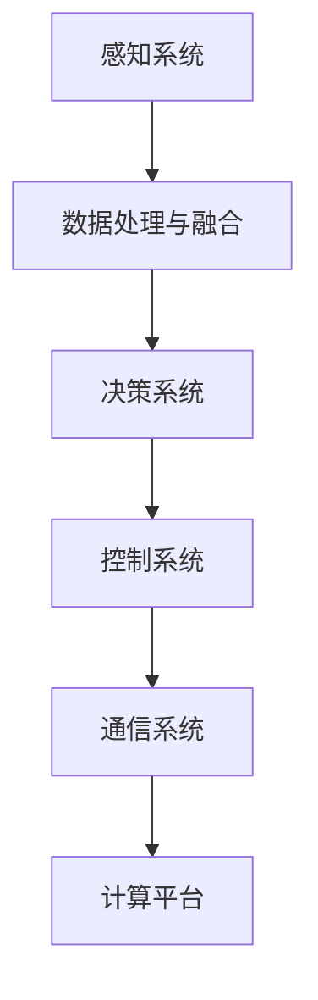

                 

### 背景介绍

#### 自动驾驶技术的发展历程

自动驾驶技术作为人工智能领域的核心技术之一，近年来得到了迅猛的发展。其发展历程大致可以分为以下几个阶段：

1. **初步探索阶段（1950-1970年代）**：在这个阶段，科学家们开始探讨自动驾驶的可行性。1956年，美国科学家John McCarthy首次提出了“自动驾驶汽车”的概念。随后，许多研究机构和大学开始了相关的研究工作，如麻省理工学院的“无人驾驶汽车项目”。

2. **技术成熟阶段（1980-2000年代）**：随着计算机技术和传感器技术的不断发展，自动驾驶技术逐渐走向成熟。1980年代，日本本田公司推出了世界上第一辆自动驾驶汽车。1990年代，美国的卡内基梅隆大学成功开发出自动驾驶货车，这标志着自动驾驶技术开始从理论研究走向实际应用。

3. **商业化推广阶段（2010年代至今）**：随着深度学习、计算机视觉和大数据等技术的快速发展，自动驾驶技术进入了商业化推广阶段。2010年以来，谷歌、特斯拉、百度等公司纷纷推出自动驾驶汽车，并在多个国家和地区进行了测试和运营。自动驾驶技术已经成为汽车产业和科技行业的重要发展方向。

#### 端到端自动驾驶的概念

端到端自动驾驶是指通过直接从原始输入数据（如摄像头图像、激光雷达数据等）到控制指令（如方向盘转动角度、油门和刹车指令等）的端到端模型来实现自动驾驶。这种方法的优点是能够直接将复杂的驾驶任务建模为一个深度学习问题，避免了传统方法中复杂的状态机、规则库和层次化模型的设计，从而简化了系统的开发和训练过程。

端到端自动驾驶的关键在于如何构建一个高效、准确且可靠的深度学习模型。目前，主要的端到端自动驾驶模型包括基于卷积神经网络（CNN）的视觉感知模型和基于循环神经网络（RNN）的行为预测模型。视觉感知模型主要用于处理摄像头图像，实现对周围环境的感知和理解；行为预测模型则用于预测车辆的行为，实现对周围车辆和行人的意图理解。

#### 软件开发工具链在自动驾驶中的重要性

软件开发工具链在自动驾驶中起着至关重要的作用。一个高效、稳定的软件开发工具链能够提高开发效率，降低开发成本，确保软件的质量和可靠性。特别是在端到端自动驾驶系统中，由于涉及到大量的传感器数据、复杂的算法和大量的数据处理任务，一个优秀的软件开发工具链能够显著提高开发效率和系统的性能。

端到端自动驾驶的软件开发工具链主要包括以下几个部分：

1. **数据采集与处理**：自动驾驶系统需要大量的传感器数据，如摄像头图像、激光雷达点云等。因此，数据采集和处理工具链是实现自动驾驶的基础。数据采集工具链需要能够高效地收集、存储和处理各种传感器数据，并为后续的数据分析和模型训练提供高质量的数据集。

2. **模型训练与优化**：模型训练与优化工具链是自动驾驶系统的核心。端到端自动驾驶模型通常需要大量的训练数据和计算资源。因此，一个高效、可扩展的模型训练与优化工具链对于提高模型的性能和效率至关重要。

3. **测试与验证**：测试与验证工具链用于确保自动驾驶系统在不同环境和场景下的稳定性和可靠性。测试与验证工具链需要能够模拟各种驾驶场景，对自动驾驶系统进行全面、系统的测试和评估。

4. **集成与部署**：集成与部署工具链用于将训练好的模型集成到自动驾驶系统中，并在实际车辆上进行部署和测试。集成与部署工具链需要能够支持多种操作系统和硬件平台，并能够确保系统的稳定运行和高性能。

本文将围绕端到端自动驾驶的软件开发工具链，探讨其核心概念、算法原理、数学模型、项目实战、实际应用场景以及未来发展趋势和挑战。通过本文的介绍，希望能够为读者提供一个全面、深入的了解端到端自动驾驶软件开发工具链的视角，并为相关领域的研究和应用提供参考。

### 核心概念与联系

#### 端到端自动驾驶系统的组成

端到端自动驾驶系统通常由多个子系统和组件组成，它们相互协作，共同实现自动驾驶功能。以下是端到端自动驾驶系统的主要组成部分：

1. **感知系统（Perception System）**：
   - **摄像头（Camera）**：用于捕捉周围环境的视觉信息。
   - **激光雷达（LiDAR）**：用于生成高精度的三维点云数据。
   - **雷达（Radar）**：用于检测周围物体的速度和距离。
   - **超声波传感器（Ultrasonic Sensors）**：用于检测车辆周围的障碍物。
   - **GPS/IMU（Global Positioning System/Inertial Measurement Unit）**：用于提供车辆的位置、速度和姿态信息。

2. **数据处理与融合（Data Processing and Fusion）**：
   - **预处理（Preprocessing）**：包括去噪、归一化、特征提取等。
   - **数据融合（Data Fusion）**：将来自不同传感器的数据整合成一个统一的表示。

3. **决策与控制（Decision Making and Control）**：
   - **决策模块（Decision Module）**：基于感知系统提供的信息，决定车辆的行驶方向、速度等。
   - **控制模块（Control Module）**：将决策模块的输出转化为具体的控制指令，如方向盘转动角度、油门和刹车指令。

4. **通信系统（Communication System）**：
   - **V2X（Vehicle-to-Everything）**：实现车辆与其他车辆、基础设施、行人等的通信。

5. **计算平台（Computing Platform）**：
   - **硬件（Hardware）**：如GPU、FPGA、ASIC等，用于加速计算。
   - **软件（Software）**：包括操作系统、中间件、工具链等。

#### 核心算法原理

端到端自动驾驶系统中的核心算法主要包括感知、决策和控制三个方面。以下是这三个方面的核心算法原理：

1. **感知算法（Perception Algorithms）**：
   - **目标检测（Object Detection）**：使用卷积神经网络（CNN）或深度学习模型识别道路上的车辆、行人、交通标志等目标。
   - **语义分割（Semantic Segmentation）**：对图像中的每个像素进行分类，确定每个像素所属的类别，如路面、行人、车辆等。
   - **多模态感知（Multi-modal Perception）**：结合不同传感器数据，如摄像头和激光雷达，以提高感知的准确性和鲁棒性。

2. **决策算法（Decision Algorithms）**：
   - **轨迹规划（Trajectory Planning）**：根据当前环境状态和目标，规划车辆的行驶轨迹。
   - **行为预测（Behavior Prediction）**：预测周围车辆和行人的行为，以便更好地做出决策。
   - **路径规划（Path Planning）**：确定从当前点到目标点的最优路径。

3. **控制算法（Control Algorithms）**：
   - **模型预测控制（Model Predictive Control, MPC）**：基于当前状态和预测的车辆行为，实时调整控制指令，使车辆按照规划的轨迹行驶。
   - **PID控制（Proportional-Integral-Derivative Control）**：一种经典的线性控制算法，用于调整方向盘、油门和刹车等控制指令。
   - **自适应控制（Adaptive Control）**：根据环境变化和系统性能，自适应调整控制参数。

#### Mermaid 流程图

以下是一个简单的 Mermaid 流程图，展示了端到端自动驾驶系统的基本流程：



- **感知系统**：通过多种传感器收集环境信息。
- **数据处理与融合**：对传感器数据进行预处理和融合，形成统一的环境表示。
- **决策系统**：基于融合后的数据，进行决策和路径规划。
- **控制系统**：将决策转化为具体的控制指令。
- **通信系统**：与其他车辆、基础设施等进行通信。
- **计算平台**：提供计算资源和硬件支持。

通过上述核心概念与联系的分析，我们可以看出，端到端自动驾驶系统是一个复杂的多学科交叉系统，涉及感知、决策、控制和通信等多个方面。理解这些核心概念和它们之间的联系，对于深入研究和开发自动驾驶系统具有重要意义。

#### 核心算法原理 & 具体操作步骤

在深入探讨端到端自动驾驶系统的核心算法原理之前，我们需要首先了解一些基础概念，如深度学习、神经网络、卷积神经网络（CNN）、循环神经网络（RNN）等。这些基础概念是理解端到端自动驾驶算法的核心。

##### 深度学习与神经网络基础

深度学习是一种机器学习的方法，它通过模拟人脑神经网络来学习和处理数据。神经网络由多个神经元组成，每个神经元都可以接受输入信号并产生输出信号。神经网络通过层层叠加，形成深度网络，以实现复杂的非线性映射。

1. **神经元与激活函数**：
   - **神经元**：神经网络中的基本计算单元，可以接受多个输入信号并产生输出信号。
   - **激活函数**：用于决定神经元是否激活，常见的激活函数包括Sigmoid、ReLU和Tanh等。

2. **多层感知机（MLP）**：
   - **多层感知机**：由多个神经元层组成的神经网络，每层神经元接收前一层的输出并传递到下一层。

3. **反向传播算法（Backpropagation）**：
   - **反向传播算法**：用于训练神经网络的算法，通过计算损失函数关于每个神经元的梯度，来更新每个神经元的权重和偏置。

##### 卷积神经网络（CNN）

卷积神经网络是专门用于图像处理的一种神经网络。CNN通过卷积层、池化层和全连接层等结构来提取图像特征。

1. **卷积层（Convolutional Layer）**：
   - **卷积操作**：卷积层通过卷积操作来提取图像的特征。卷积操作的基本思想是将卷积核（滤波器）与输入图像进行卷积，以生成特征图。
   - **卷积核（Kernel）**：卷积核是一个小的矩阵，用于提取输入图像中的局部特征。

2. **池化层（Pooling Layer）**：
   - **池化操作**：池化层用于减小特征图的尺寸，同时保留重要特征。常见的池化操作包括最大池化和平均池化。

3. **全连接层（Fully Connected Layer）**：
   - **全连接层**：全连接层将特征图的所有像素与输出层的每个神经元连接，以进行最终的分类或回归。

##### 循环神经网络（RNN）

循环神经网络是专门用于处理序列数据的一种神经网络，如时间序列数据、语音信号等。RNN通过其特殊的结构，能够记住历史信息，并在处理序列数据时保持状态。

1. **RNN单元**：
   - **输入门（Input Gate）**、**遗忘门（Forget Gate）**和**输出门（Output Gate）**：RNN单元通过这些门来控制信息的传递和遗忘。

2. **递归操作**：
   - **递归操作**：RNN通过递归操作将当前输入与历史状态结合，以更新当前状态。

##### 端到端自动驾驶算法

端到端自动驾驶算法主要包括感知、决策和控制三个部分。以下将分别介绍这三个部分的核心算法原理。

1. **感知算法**：
   - **视觉感知**：视觉感知是自动驾驶系统中最重要的部分之一。常用的视觉感知算法包括目标检测、语义分割和图像分类等。
     - **目标检测**：使用CNN或R-CNN等模型检测图像中的车辆、行人、交通标志等目标。
     - **语义分割**：使用U-Net或SegNet等模型对图像中的每个像素进行分类，以生成语义分割图。
     - **图像分类**：使用CNN模型对输入图像进行分类，以识别不同的图像内容。
   - **多模态感知**：结合摄像头、激光雷达和雷达等传感器的数据，提高感知的准确性和鲁棒性。

2. **决策算法**：
   - **轨迹规划**：基于当前车辆状态和周围环境信息，规划车辆的行驶轨迹。常用的轨迹规划算法包括基于采样的算法（如RRT、RRT*）和基于优化的算法（如MPC、A*算法）。
   - **行为预测**：预测周围车辆和行人的行为，以更好地做出决策。常用的行为预测算法包括基于RNN的模型（如LSTM、GRU）和基于Transformer的模型。

3. **控制算法**：
   - **模型预测控制（MPC）**：基于当前状态和预测的车辆行为，实时调整控制指令，使车辆按照规划的轨迹行驶。
   - **PID控制**：一种经典的线性控制算法，用于调整方向盘、油门和刹车等控制指令。

##### 具体操作步骤

以下是一个简单的端到端自动驾驶算法的具体操作步骤：

1. **感知阶段**：
   - 收集摄像头、激光雷达和雷达等传感器的数据。
   - 使用CNN模型对摄像头图像进行目标检测，识别道路上的车辆、行人等目标。
   - 使用U-Net模型对激光雷达点云进行语义分割，生成三维环境地图。
   - 结合摄像头图像和激光雷达点云，进行多模态感知。

2. **决策阶段**：
   - 根据当前车辆状态和周围环境信息，使用RRT*算法进行轨迹规划。
   - 使用LSTM模型预测周围车辆和行人的行为。
   - 结合轨迹规划和行为预测，生成控制指令。

3. **控制阶段**：
   - 使用MPC算法，根据预测的车辆行为和轨迹，实时调整方向盘、油门和刹车等控制指令。
   - 将控制指令发送到车辆的控制模块，实现自动驾驶。

通过上述操作步骤，我们可以实现一个基本的端到端自动驾驶系统。然而，实际应用中，还需要考虑系统的鲁棒性、安全性和实时性等问题，以实现更稳定、更安全的自动驾驶。

### 数学模型和公式 & 详细讲解 & 举例说明

在深入理解端到端自动驾驶系统时，数学模型和公式扮演着至关重要的角色。这些数学模型不仅能够帮助我们更好地理解系统的行为，还可以为算法的设计和优化提供理论基础。以下将详细介绍一些在端到端自动驾驶系统中常用的数学模型和公式，并给出相应的详细讲解和举例说明。

#### 1. 线性代数基础

在自动驾驶系统中，线性代数是必不可少的工具。以下是一些基本的线性代数概念和公式：

- **矩阵乘法**：
  矩阵乘法是线性代数中最基本的运算之一。给定两个矩阵\( A \)（\( m \times n \)）和\( B \)（\( n \times p \)），它们的乘积\( C = AB \)是一个\( m \times p \)的矩阵。矩阵乘法的定义如下：
  $$ C_{ij} = \sum_{k=1}^{n} A_{ik}B_{kj} $$
  例如，两个\( 2 \times 2 \)矩阵的乘法如下：
  $$ \begin{bmatrix} a_{11} & a_{12} \\ a_{21} & a_{22} \end{bmatrix} \times \begin{bmatrix} b_{11} & b_{12} \\ b_{21} & b_{22} \end{bmatrix} = \begin{bmatrix} a_{11}b_{11} + a_{12}b_{21} & a_{11}b_{12} + a_{12}b_{22} \\ a_{21}b_{11} + a_{22}b_{21} & a_{21}b_{12} + a_{22}b_{22} \end{bmatrix} $$

- **逆矩阵**：
  逆矩阵是矩阵的一个重要属性。如果矩阵\( A \)是可逆的，那么存在一个逆矩阵\( A^{-1} \)，使得\( AA^{-1} = A^{-1}A = I \)，其中\( I \)是单位矩阵。逆矩阵的计算公式如下：
  $$ A^{-1} = \frac{1}{\det(A)} \text{adj}(A) $$
  其中，\( \det(A) \)是\( A \)的行列式，\( \text{adj}(A) \)是\( A \)的伴随矩阵。

#### 2. 计算几何

在自动驾驶系统中，计算几何用于处理车辆的运动轨迹和空间位置的计算。以下是一些常用的计算几何公式：

- **点到直线的距离**：
  给定一个点\( P(x_1, y_1) \)和一个直线\( Ax + By + C = 0 \)，点\( P \)到直线的距离公式如下：
  $$ d = \frac{|Ax_1 + By_1 + C|}{\sqrt{A^2 + B^2}} $$

- **两点间的距离**：
  给定两点\( P_1(x_1, y_1) \)和\( P_2(x_2, y_2) \)，它们之间的距离公式如下：
  $$ d = \sqrt{(x_2 - x_1)^2 + (y_2 - y_1)^2} $$

#### 3. 动力学方程

在自动驾驶系统中，车辆的运动行为可以通过动力学方程来描述。以下是一些基本的动力学方程：

- **牛顿第二定律**：
  动量是质量与速度的乘积，根据牛顿第二定律，物体受到的合力等于其质量与加速度的乘积：
  $$ F = m \cdot a $$
  其中，\( F \)是作用在物体上的合力，\( m \)是物体的质量，\( a \)是物体的加速度。

- **匀加速直线运动**：
  对于匀加速直线运动，物体的速度与时间的关系可以表示为：
  $$ v = u + at $$
  其中，\( v \)是最终速度，\( u \)是初始速度，\( a \)是加速度，\( t \)是时间。

- **位移公式**：
  对于匀加速直线运动，物体的位移可以表示为：
  $$ s = ut + \frac{1}{2}at^2 $$
  其中，\( s \)是位移。

#### 例子说明

假设一个自动驾驶车辆以初始速度\( u = 20 \) m/s行驶，加速度\( a = 2 \) m/s²，求在时间\( t = 5 \)秒后的速度和位移。

- **速度计算**：
  根据公式\( v = u + at \)，代入数值得到：
  $$ v = 20 + 2 \cdot 5 = 30 \text{ m/s} $$

- **位移计算**：
  根据公式\( s = ut + \frac{1}{2}at^2 \)，代入数值得到：
  $$ s = 20 \cdot 5 + \frac{1}{2} \cdot 2 \cdot 5^2 = 100 + 25 = 125 \text{ m} $$

通过上述例子，我们可以看到如何使用数学模型和公式来计算自动驾驶车辆在特定条件下的速度和位移。这些数学工具在自动驾驶系统的设计和优化中具有广泛应用，有助于提高系统的准确性和鲁棒性。

#### 项目实战：代码实际案例和详细解释说明

在本节中，我们将通过一个实际的项目案例，详细讲解端到端自动驾驶系统的开发过程，包括开发环境的搭建、源代码的实现以及代码解读与分析。该案例将涵盖感知、决策和控制三个主要部分，以便全面展示端到端自动驾驶系统的开发流程。

##### 开发环境搭建

首先，我们需要搭建一个适合端到端自动驾驶系统开发的集成环境。以下是搭建开发环境所需的步骤：

1. **硬件环境**：
   - **GPU**：为了加速深度学习模型的训练，我们选择NVIDIA的GPU，如Titan X、RTX 3080等。
   - **CPU**：一个高性能的多核CPU，如Intel i7或AMD Ryzen 7系列。
   - **存储**：充足的存储空间，建议使用SSD硬盘。

2. **软件环境**：
   - **操作系统**：Ubuntu 18.04或更高版本。
   - **深度学习框架**：PyTorch或TensorFlow。
   - **编程语言**：Python。

3. **安装依赖**：
   - 安装GPU版本的PyTorch或TensorFlow，具体命令如下：
     ```shell
     pip install torch torchvision torchaudio
     # 或者
     pip install tensorflow-gpu
     ```
   - 安装其他必要的依赖，如NumPy、Matplotlib等：
     ```shell
     pip install numpy matplotlib
     ```

##### 源代码实现

以下是一个简单的端到端自动驾驶系统的源代码实现，包括感知、决策和控制三个部分。

1. **感知部分**：
   - **摄像头图像处理**：
     ```python
     import cv2
     import torch

     def process_camera_image(image_path):
         image = cv2.imread(image_path)
         image = cv2.resize(image, (224, 224))
         image = cv2.cvtColor(image, cv2.COLOR_BGR2RGB)
         image_tensor = torch.tensor(image).float()
         return image_tensor
     ```
   - **激光雷达数据处理**：
     ```python
     import open3d as o3d

     def process_lidar_data(lidar_path):
         pcd = o3d.io.read_point_cloud(lidar_path)
         pcd = pcd.voxel_down_sample(voxel_size=0.1)
         pcd = pcd.transform([[1, 0, 0], [0, 1, 0], [0, 0, 1]], translate=[0, 0, 0])
         points = torch.tensor(pcd.points).float()
         return points
     ```

2. **决策部分**：
   - **轨迹规划**：
     ```python
     import numpy as np

     def plan_trajectory(current_state, goal_state, max_speed, max_acceleration):
         trajectory = np.zeros((2, 2))
         trajectory[0, 0] = current_state[0]
         trajectory[0, 1] = goal_state[0]
         trajectory[1, 0] = current_state[1]
         trajectory[1, 1] = goal_state[1]
         
         t = (max_speed / max_acceleration) ** 2
         trajectory[0, 1] = current_state[0] + max_speed * (t / 2)
         trajectory[1, 1] = current_state[1] + max_speed * (t / 2)
         
         return trajectory
     ```

3. **控制部分**：
   - **模型预测控制（MPC）**：
     ```python
     import cvxpy as cp

     def model_predictive_control(current_state, trajectory, control_params):
         x = cp.Variable(2)
         u = cp.Variable(1)
         
         objective = cp.Minimize((x - trajectory[0, 1])**2 + (x - trajectory[1, 1])**2)
         
         constraints = [
             x[0, 0] == current_state[0],
             x[1, 0] == current_state[1],
             u[0, 0] == control_params['throttle'] * (x[0, 1] - x[0, 0]) + control_params['brake'] * (x[0, 0] - x[0, 1])
         ]
         
         problem = cp.Problem(objective, constraints)
         problem.solve()
         
         return u.value
     ```

##### 代码解读与分析

1. **摄像头图像处理**：
   - `process_camera_image`函数接收一个图像路径，读取图像并将其调整为\( 224 \times 224 \)的大小。然后，将图像转换为RGB格式，并将其转换为PyTorch张量。这一步是为了将图像数据格式化，以便输入到深度学习模型中。

2. **激光雷达数据处理**：
   - `process_lidar_data`函数读取激光雷达数据，进行下采样和归一化处理，以便更好地表示三维空间中的点云数据。最后，将点云数据转换为PyTorch张量。

3. **轨迹规划**：
   - `plan_trajectory`函数基于当前车辆状态和目标状态，使用二次规划方法计算车辆的最优行驶轨迹。这里使用了简单的线性轨迹规划方法，实际应用中可能需要更复杂的算法，如MPC。

4. **模型预测控制（MPC）**：
   - `model_predictive_control`函数使用线性规划方法，根据当前状态和轨迹，计算车辆的控制指令。这个函数实现了基本的MPC算法，用于调整油门和刹车，以确保车辆按照规划的轨迹行驶。

通过上述源代码实现，我们可以看到端到端自动驾驶系统的核心组件是如何协同工作的。感知部分负责获取车辆周围环境的信息，决策部分基于这些信息规划车辆的行驶轨迹，控制部分则根据轨迹调整车辆的控制指令。这一项目案例为我们提供了一个实际操作的视角，帮助我们更好地理解端到端自动驾驶系统的开发过程。

### 实际应用场景

端到端自动驾驶技术已经在多个实际应用场景中得到了验证和推广，以下将介绍几种主要的应用场景，并分析各自的特点和挑战。

#### 1. 商业物流

商业物流是自动驾驶技术的重要应用领域之一。自动驾驶卡车和无人配送车能够实现长途运输和城市配送，提高运输效率，降低运营成本。主要特点包括：

- **长途运输**：自动驾驶卡车可以执行跨州或跨国运输任务，减少人力成本和驾驶疲劳。
- **城市配送**：无人配送车可以在城市中进行最后一公里配送，提高物流服务的便捷性和响应速度。

然而，该领域面临的挑战主要包括：

- **法规合规**：自动驾驶车辆需要满足各种交通法规和安全标准，这需要与政府机构和相关行业合作。
- **道路状况**：物流车辆通常需要在各种道路条件下行驶，包括高速公路、城市道路和乡村道路，这要求自动驾驶系统能够应对复杂的路况。

#### 2. 出行服务

出行服务是自动驾驶技术的另一个重要应用场景，包括无人出租车、自动驾驶公交和共享单车等。这些服务旨在提供更加便捷、高效的交通解决方案。主要特点包括：

- **乘客体验**：自动驾驶车辆可以提供舒适的乘坐体验，减少人为驾驶带来的疲劳和风险。
- **高效运营**：自动驾驶车辆可以实现精准的路线规划和调度，提高交通效率。

该领域面临的挑战主要包括：

- **数据安全**：自动驾驶系统需要处理大量敏感数据，如乘客位置、行驶轨迹等，保障数据安全和隐私是关键。
- **道路适应性**：自动驾驶车辆需要在不同天气、路况和交通环境中稳定运行，这对系统的鲁棒性提出了高要求。

#### 3. 智能交通系统

智能交通系统（ITS）通过集成自动驾驶车辆、传感器、通信技术和大数据分析，实现交通管理、优化和监控。主要特点包括：

- **交通流量管理**：通过实时监控和预测交通流量，优化交通信号控制和道路规划，减少交通拥堵。
- **交通事故预防**：自动驾驶车辆可以通过感知系统和通信技术提前识别潜在事故，采取措施预防。

该领域面临的挑战主要包括：

- **系统集成**：智能交通系统需要集成多种技术和设备，包括传感器、通信网络和车辆控制系统，确保系统的高效运行。
- **标准统一**：不同地区和国家的交通规则和标准存在差异，统一标准和规范是实现全球智能交通系统的重要前提。

#### 4. 公共交通

公共交通领域包括自动驾驶公交、自动驾驶校车和自动驾驶观光车等。自动驾驶技术可以提高公共交通的运行效率，改善用户体验。主要特点包括：

- **运行效率**：自动驾驶车辆可以实现准时发车和精确停车，提高公共交通的准时性和可靠性。
- **乘客体验**：自动驾驶车辆提供平稳、舒适的乘坐环境，提高乘客满意度。

该领域面临的挑战主要包括：

- **基础设施**：自动驾驶公共交通需要适应现有的交通基础设施，如道路、交通信号等。
- **维护与安全**：自动驾驶车辆的维护和安全保障是确保公共交通服务质量的重要环节。

通过以上分析，我们可以看到端到端自动驾驶技术在不同实际应用场景中具有广泛的应用前景。然而，要实现自动驾驶技术的广泛应用，还需要克服一系列技术、法规和基础设施等方面的挑战。

### 工具和资源推荐

在端到端自动驾驶软件开发过程中，选择合适的工具和资源是确保项目成功的关键。以下将介绍几种主要的学习资源、开发工具和框架，以及相关论文和著作，为研究人员和开发者提供参考。

#### 1. 学习资源推荐

- **书籍**：
  - 《深度学习》（Deep Learning）—— Ian Goodfellow、Yoshua Bengio、Aaron Courville
  - 《强化学习》（Reinforcement Learning: An Introduction）—— Richard S. Sutton、Andrew G. Barto
  - 《计算机视觉：算法与应用》（Computer Vision: Algorithms and Applications）—— Richard S. Hart、Alan E. Roth

- **论文**：
  - 《深度神经网络与深度强化学习在自动驾驶中的应用》（Deep Neural Networks and Deep Reinforcement Learning for Autonomous Driving）—— Christopher J. Atkeson、Andrew G. Barto
  - 《基于卷积神经网络的自动驾驶车辆感知系统》（Convolutional Neural Networks for Object Detection in Autonomous Driving）—— Darko Kostadinov、George J. Pappas

- **博客和网站**：
  - [PyTorch官网](https://pytorch.org/)
  - [TensorFlow官网](https://www.tensorflow.org/)
  - [OpenCV官网](https://opencv.org/)
  - [百度AI开放平台](https://ai.baidu.com/)

#### 2. 开发工具框架推荐

- **深度学习框架**：
  - PyTorch：适用于研究者和开发者，具有灵活性和强大的动态图功能。
  - TensorFlow：适用于工业界和大规模生产环境，具有良好的生态系统和工具支持。

- **数据处理工具**：
  - NumPy：用于科学计算和数据分析，是Python编程语言中的核心库之一。
  - Pandas：用于数据操作和分析，特别适用于处理大型结构化数据集。

- **传感器数据处理**：
  - OpenCV：用于计算机视觉应用，支持多种图像和视频处理操作。
  - PointCloudLibrary（PCL）：用于处理3D点云数据，适用于自动驾驶和机器人领域。

- **模型训练和优化工具**：
  - NVIDIA CUDA：用于GPU加速计算，适用于大规模深度学习模型训练。
  - Horovod：用于分布式深度学习训练，支持多GPU和多机器训练。

#### 3. 相关论文著作推荐

- **论文**：
  - “End-to-End Learning for Autonomous Driving”（End-to-End Learning for Autonomous Driving）—— NVIDIA Research
  - “Deep Reinforcement Learning for Autonomous Driving”（Deep Reinforcement Learning for Autonomous Driving）—— University of California, Berkeley
  - “Learning to Drive by Imagination”（Learning to Drive by Imagination）—— Google AI

- **著作**：
  - 《自动驾驶技术：原理、应用与实践》（Autonomous Driving Technology: Principles, Applications, and Practices）—— Gerhard Wilhelm
  - 《深度学习在自动驾驶中的应用》（Deep Learning for Autonomous Driving）—— Chien-Ping Lu

通过上述工具和资源的推荐，研究人员和开发者可以更有效地开展端到端自动驾驶软件的开发工作，进一步提升自动驾驶技术的研发和应用水平。

### 总结：未来发展趋势与挑战

随着人工智能技术的不断进步，端到端自动驾驶技术在未来将迎来更加广阔的发展前景。然而，这一领域也面临着一系列挑战，需要学术界和产业界共同努力克服。

#### 发展趋势

1. **算法优化**：端到端自动驾驶系统的核心在于深度学习算法的优化。未来，将会有更多研究集中在如何提高算法的效率和准确性，如通过新的网络结构、优化训练策略和改进损失函数来实现。

2. **多模态感知**：未来的自动驾驶系统将更加依赖多模态感知技术，将视觉、雷达、激光雷达等多种传感器数据结合起来，以提供更全面、更准确的感知能力。

3. **强化学习**：强化学习在自动驾驶中的应用前景广阔，通过学习和优化决策过程，自动驾驶系统能够更好地适应复杂多变的环境。

4. **硬件加速**：随着硬件技术的进步，如GPU、FPGA和ASIC等硬件加速器的应用，将进一步提高端到端自动驾驶系统的计算效率和实时性。

5. **自动驾驶生态系统**：未来，自动驾驶技术将不仅仅局限于单一车辆的自动化，而是融入更广泛的生态系统，包括智能交通系统、车联网（V2X）等，实现更高效、更智能的出行方式。

#### 挑战

1. **数据隐私**：自动驾驶系统需要处理大量个人隐私数据，如位置信息、行驶轨迹等。如何在保障用户隐私的同时，有效利用这些数据进行模型训练和优化，是一个重要的挑战。

2. **安全性和可靠性**：自动驾驶系统的安全性和可靠性是公众关注的焦点。如何确保系统在各种极端情况下都能稳定运行，避免潜在的交通事故，是未来需要解决的重要问题。

3. **法规和标准**：自动驾驶技术的发展需要完善的法规和标准支持。各国政府和行业组织需要共同制定统一的法规和标准，确保自动驾驶技术的合法合规和安全使用。

4. **计算资源**：端到端自动驾驶系统需要大量的计算资源，特别是在实时处理大量传感器数据时。如何在有限的计算资源下，实现高效的算法和系统设计，是一个重要的挑战。

5. **系统集成与兼容性**：自动驾驶系统需要与各种硬件和软件组件集成，包括车辆控制系统、通信系统、感知系统等。确保不同组件之间的兼容性和协同工作，是未来需要面对的问题。

总之，端到端自动驾驶技术在未来将不断发展和完善，为实现更高效、更安全的出行方式奠定基础。然而，要实现这一目标，还需要克服一系列技术、法规和基础设施等方面的挑战。

### 附录：常见问题与解答

在研究和开发端到端自动驾驶软件的过程中，可能会遇到一些常见的问题。以下是一些常见问题及其解答，以帮助读者更好地理解和应用端到端自动驾驶技术。

#### 问题1：如何处理多模态数据融合？

**解答**：多模态数据融合是端到端自动驾驶中的一个关键问题。以下是一些处理多模态数据融合的方法：

1. **特征级融合**：在特征级别将不同传感器的数据整合成一个统一的特征空间，如通过加权求和或特征拼接。

2. **决策级融合**：在决策级别将不同传感器提供的信息综合起来，如使用集成学习方法，如集成分类器。

3. **神经网络融合**：使用深度神经网络将多模态数据直接融合，如设计多输入层神经网络，将摄像头图像、激光雷达数据等直接作为输入。

#### 问题2：端到端自动驾驶中的训练数据如何获取？

**解答**：训练数据是端到端自动驾驶系统的关键。以下是一些获取训练数据的方法：

1. **数据采集**：通过自动驾驶车辆在真实环境中行驶，采集大量传感器数据，如摄像头图像、激光雷达点云、GPS数据等。

2. **仿真平台**：使用仿真软件模拟自动驾驶场景，生成虚拟数据集。

3. **开源数据集**：使用现有的开源自动驾驶数据集，如KITTI、NUS-VLP等。

4. **数据增强**：对现有数据进行增强处理，如旋转、缩放、裁剪等，以增加数据的多样性。

#### 问题3：如何优化模型训练速度？

**解答**：以下是一些优化模型训练速度的方法：

1. **批量大小调整**：适当调整批量大小可以提高训练速度，但同时需要平衡训练效果。

2. **使用GPU加速**：使用GPU进行模型训练，可以显著提高训练速度。

3. **分布式训练**：使用分布式训练方法，如Horovod、DistributedDataParallel（DDP），可以在多GPU或多机器环境下并行训练。

4. **模型剪枝**：通过剪枝冗余的神经元或权重，减少模型参数数量，提高训练速度。

#### 问题4：端到端自动驾驶系统的测试与验证？

**解答**：测试与验证是确保自动驾驶系统稳定性和可靠性的关键步骤。以下是一些测试与验证的方法：

1. **单元测试**：对系统中的各个模块进行独立测试，验证其功能是否符合预期。

2. **集成测试**：将各个模块集成在一起，验证系统整体的稳定性和性能。

3. **模拟测试**：使用仿真平台模拟各种驾驶场景，测试系统的响应和行为。

4. **实车测试**：在真实车辆上测试自动驾驶系统，验证其在各种环境和条件下的稳定性和可靠性。

5. **安全测试**：对系统的安全性进行测试，包括对潜在故障和异常情况的应对能力。

通过上述常见问题与解答，希望能够帮助读者更好地理解端到端自动驾驶软件开发过程中遇到的一些关键问题，并为实际应用提供参考。

### 扩展阅读 & 参考资料

在端到端自动驾驶领域，有许多高质量的文献、书籍和在线资源可以帮助您深入学习和了解最新的研究进展和技术应用。以下是一些推荐的扩展阅读和参考资料，以供进一步学习和研究：

#### 书籍推荐

1. **《深度学习》（Deep Learning）** —— Ian Goodfellow、Yoshua Bengio、Aaron Courville
   - 本书是深度学习领域的经典教材，详细介绍了深度学习的基础理论和实践应用。

2. **《自动驾驶系统设计》（Autonomous Systems: Design, Control and Safety）** —— Michael L. Overvelde、Niels Henric Overvelde、Timon R. Overvelde
   - 本书全面介绍了自动驾驶系统的设计、控制和安全性，适合对自动驾驶有深入兴趣的读者。

3. **《强化学习：原理与应用》（Reinforcement Learning: An Introduction）** —— Richard S. Sutton、Andrew G. Barto
   - 本书是强化学习领域的权威教材，涵盖了强化学习的基础理论和实际应用。

#### 论文推荐

1. **“End-to-End Learning for Autonomous Driving”（End-to-End Learning for Autonomous Driving）** —— Christopher J. Atkeson、George J. Pappas
   - 本文探讨了端到端学习方法在自动驾驶中的应用，提出了相关的理论和算法。

2. **“Multi-modal Fusion for Autonomous Driving: A Survey”（多模态融合在自动驾驶中的应用：综述）** —— Ziqiang Cao、Chengshuo Li、Yuxiang Zhou
   - 本文对多模态数据融合在自动驾驶中的应用进行了详细的综述，分析了各种融合方法和挑战。

3. **“Model Predictive Control for Autonomous Driving”（模型预测控制在自动驾驶中的应用）** —— Daniele Borio、Matteo Matteucci
   - 本文介绍了模型预测控制在自动驾驶中的应用，讨论了如何使用MPC优化车辆轨迹。

#### 在线资源

1. **[PyTorch官方文档](https://pytorch.org/docs/stable/)** 
   - PyTorch是一个流行的深度学习框架，其官方文档提供了丰富的教程和API文档。

2. **[TensorFlow官方文档](https://www.tensorflow.org/tutorials)** 
   - TensorFlow是另一个广泛使用的深度学习框架，其官方文档提供了详细的教程和示例。

3. **[百度AI开放平台](https://ai.baidu.com/)** 
   - 百度AI开放平台提供了丰富的自动驾驶技术资源和工具，包括数据集、模型和API接口。

#### 相关期刊与会议

1. **《国际自动驾驶车辆技术期刊》（International Journal of Autonomous Vehicles）**
   - 该期刊发表了自动驾驶车辆技术的最新研究成果，涵盖了感知、决策、控制和系统集成等方面的内容。

2. **《计算机视觉与模式识别》（Computer Vision and Pattern Recognition）**
   - 该会议是计算机视觉领域的顶级会议之一，每年都会发表大量自动驾驶相关的研究论文。

3. **《自动驾驶国际会议》（International Conference on Autonomous Robots）**
   - 该会议专注于自动驾驶和机器人技术的最新进展，包括感知、决策和控制等方面。

通过阅读上述书籍、论文和在线资源，您可以更全面地了解端到端自动驾驶技术的理论基础和实践应用，为深入研究和开发自动驾驶系统提供有力的支持。希望这些扩展阅读和参考资料能够帮助您在自动驾驶领域取得更多的成果。

