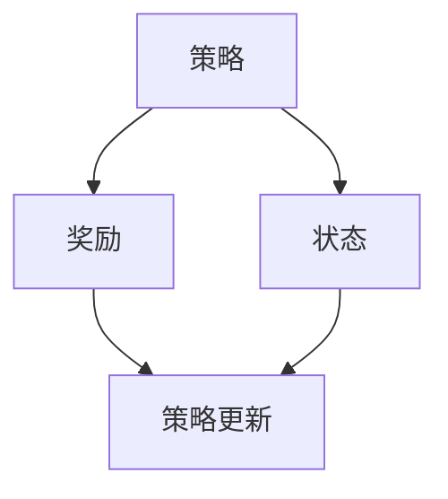

                 

### 背景介绍

策略梯度（Policy Gradient）是一种在 reinforcement learning（强化学习）领域中广泛使用的方法。它通过更新策略参数来优化决策过程，以实现最大化累积奖励的目标。策略梯度算法的核心思想是直接对策略参数进行优化，而不是通过值函数或者Q-learning等方法来间接优化策略。

策略梯度方法相对于传统的Q-learning或者深度强化学习（DRL）方法具有一些独特的优势。首先，策略梯度不需要构建模型或者预估值函数，这使得它在解决某些复杂环境问题时的计算效率更高。其次，策略梯度可以直接处理连续动作空间问题，而Q-learning等方法通常难以处理这种场景。此外，策略梯度算法更容易实现并行化，从而加速学习过程。

本文将深入探讨策略梯度的原理，并通过一个具体的代码实例来讲解如何实现和应用策略梯度算法。本文将分为以下几个部分：

1. 核心概念与联系：我们将介绍策略梯度算法的基本概念，并给出相应的 Mermaid 流程图。
2. 核心算法原理 & 具体操作步骤：我们将详细解释策略梯度的数学模型和算法步骤。
3. 数学模型和公式 & 详细讲解 & 举例说明：我们将使用 LaTeX 格式给出策略梯度的关键数学公式，并进行详细的解释说明。
4. 项目实战：代码实际案例和详细解释说明：我们将提供一个完整的策略梯度代码实例，并详细解读其实现过程。
5. 实际应用场景：我们将探讨策略梯度在现实世界中的应用场景和案例。
6. 工具和资源推荐：我们将推荐一些有用的学习资源、开发工具框架和相关论文著作。
7. 总结：未来发展趋势与挑战：我们将总结策略梯度的优点和面临的挑战，并探讨其未来发展趋势。

通过本文的阅读，您将全面了解策略梯度算法的原理、实现和应用，并能够将其应用于实际问题中。

### 核心概念与联系

在深入探讨策略梯度算法之前，我们需要理解几个核心概念：策略（Policy）、奖励（Reward）和状态（State）。这些概念构成了策略梯度算法的基础。

#### 策略（Policy）

策略是指导智能体（agent）如何行动的规则集合。在强化学习中，策略通常表示为概率分布，即智能体在给定当前状态下采取不同动作的概率。策略梯度算法的目标是找到最优策略，使得智能体在执行动作时能够最大化累积奖励。

用数学语言描述，策略π(s, a)表示在状态s下采取动作a的概率，即：

$$
\pi(s, a) = P(a|s)
$$

其中，P(a|s)表示在状态s下采取动作a的条件概率。

#### 奖励（Reward）

奖励是强化学习中智能体每次行动后获得的即时回报。奖励用于评估智能体的行动效果，是指导智能体学习的关键因素。在策略梯度算法中，奖励是一个重要的依赖变量，用于更新策略参数。

#### 状态（State）

状态是描述智能体当前环境的一个抽象表示。在强化学习中，状态可以是离散的也可以是连续的。智能体通过感知当前状态来做出决策。

#### Mermaid 流程图

为了更好地理解这些核心概念，我们可以使用 Mermaid 流程图来描述它们之间的关系：



在上面的 Mermaid 流程图中，策略（A）通过感知状态（C）来获取奖励（B），并根据奖励来更新策略，从而形成一个闭环的强化学习过程。

#### 关键术语总结

- **策略（Policy）**：指导智能体行动的规则集合，通常表示为概率分布。
- **奖励（Reward）**：智能体每次行动后获得的即时回报，用于评估行动效果。
- **状态（State）**：描述智能体当前环境的抽象表示。

通过理解这些核心概念和它们之间的联系，我们将为后续的算法原理和实现打下坚实的基础。

### 核心算法原理 & 具体操作步骤

策略梯度算法是一种基于梯度下降的方法，用于优化策略参数以最大化累积奖励。在这一节中，我们将详细解释策略梯度算法的数学模型和具体操作步骤。

#### 数学模型

策略梯度算法的核心思想是通过梯度下降来更新策略参数，使其朝着最大化累积奖励的方向移动。首先，我们需要定义累积奖励和策略梯度。

**累积奖励**（Return）：
累积奖励是智能体在连续行动过程中获得的奖励总和。用符号 \(G\) 表示，定义如下：

$$
G = \sum_{t=0}^{T} r_t
$$

其中，\(r_t\) 是在第 \(t\) 次行动后获得的即时奖励，\(T\) 是总行动次数。

**策略梯度**（Gradient of Policy）：
策略梯度是指导策略参数更新的方向。策略梯度可以通过累积奖励来计算。具体来说，策略梯度可以用以下公式表示：

$$
\nabla_{\theta} J(\theta) = \nabla_{\theta} \sum_{t=0}^{T} \gamma^t r_t = \sum_{t=0}^{T} \nabla_{\theta} \log \pi_{\theta}(s_t, a_t)
$$

其中，\(\theta\) 是策略参数的向量，\(\gamma\) 是折扣因子，用于考虑未来奖励的重要性。这个公式表示策略梯度等于对策略对数概率的梯度之和。

#### 具体操作步骤

1. **初始化参数**：
   - 初始化策略参数 \(\theta\)。
   - 设置学习率 \(\alpha\) 和折扣因子 \(\gamma\)。

2. **进行行动**：
   - 在每个时间步 \(t\)，根据当前状态 \(s_t\) 和策略 \(\pi_{\theta}(s_t, a_t)\) 来选择动作 \(a_t\)。
   - 执行动作 \(a_t\)，获得即时奖励 \(r_t\)，并更新状态 \(s_t\)。

3. **计算累积奖励**：
   - 在行动结束时，计算累积奖励 \(G\)。

4. **计算策略梯度**：
   - 根据累积奖励 \(G\)，计算策略梯度 \(\nabla_{\theta} J(\theta)\)。

5. **更新策略参数**：
   - 使用策略梯度更新策略参数 \(\theta\)：
     $$
     \theta \leftarrow \theta - \alpha \nabla_{\theta} J(\theta)
     $$

6. **重复步骤 2-5**，直到策略参数收敛。

#### 算法示例

假设我们有一个简单的环境，其中智能体可以选择两个动作：向左（L）和向右（R）。状态空间是一个二元状态 \(s \in \{0, 1\}\)，奖励空间是一个二元奖励 \(r \in \{0, 1\}\)。我们的目标是设计一个策略，使得智能体能够最大化累积奖励。

**初始化参数**：
- 设定策略参数 \(\theta = [0.5, 0.5]\)，即智能体以 50% 的概率选择向左或向右。
- 学习率 \(\alpha = 0.1\)。
- 折扣因子 \(\gamma = 0.9\)。

**行动过程**：
- 在时间步 \(t = 0\)，智能体处于状态 \(s_0 = 0\)，根据策略选择动作 \(a_0 = R\)。
- 执行动作 \(a_0 = R\) 后，获得即时奖励 \(r_0 = 1\)，状态更新为 \(s_1 = 1\)。
- 在时间步 \(t = 1\)，智能体处于状态 \(s_1 = 1\)，根据策略选择动作 \(a_1 = L\)。
- 执行动作 \(a_1 = L\) 后，获得即时奖励 \(r_1 = 0\)，状态更新为 \(s_2 = 0\)。

**计算累积奖励**：
- 累积奖励 \(G = r_0 + \gamma r_1 = 1 + 0.9 \cdot 0 = 1\)。

**计算策略梯度**：
- 策略梯度 \(\nabla_{\theta} J(\theta) = \nabla_{\theta} \log \pi_{\theta}(s_0, a_0) + \nabla_{\theta} \log \pi_{\theta}(s_1, a_1)\)。
- 由于智能体在 \(s_0 = 0\) 时选择 \(a_0 = R\)，根据策略参数 \(\theta\)，\(\pi_{\theta}(s_0, a_0) = 0.5\)，因此 \(\nabla_{\theta} \log \pi_{\theta}(s_0, a_0) = \nabla_{\theta} \log 0.5\)。
- 由于智能体在 \(s_1 = 1\) 时选择 \(a_1 = L\)，根据策略参数 \(\theta\)，\(\pi_{\theta}(s_1, a_1) = 0.5\)，因此 \(\nabla_{\theta} \log \pi_{\theta}(s_1, a_1) = \nabla_{\theta} \log 0.5\)。

**更新策略参数**：
- 使用策略梯度更新策略参数 \(\theta\)：
  $$
  \theta \leftarrow \theta - \alpha \nabla_{\theta} J(\theta) = [0.5, 0.5] - 0.1 \cdot [-0.5, -0.5] = [0, 0]
  $$

更新后，策略参数 \(\theta\) 变为 \([0, 0]\)，即智能体将总是选择向左行动。

通过这个简单的示例，我们可以看到策略梯度算法的基本操作步骤和如何通过梯度下降来更新策略参数。在实际应用中，策略梯度算法需要处理更复杂的环境和动作空间，但基本原理是一致的。

### 数学模型和公式 & 详细讲解 & 举例说明

在策略梯度算法中，数学模型和公式起着至关重要的作用。本节我们将详细解释这些关键公式，并使用LaTeX格式进行表示。

#### 1. 策略梯度公式

策略梯度算法的核心公式是：

$$
\nabla_{\theta} J(\theta) = \nabla_{\theta} \sum_{t=0}^{T} \gamma^t r_t
$$

这个公式表示策略梯度的方向，用于更新策略参数 \(\theta\)，以最大化累积奖励 \(J(\theta)\)。具体来说，它是对每个时间步的奖励 \(r_t\) 加上折扣因子 \(\gamma^t\) 的对数策略概率梯度的求和。

#### 2. 对数策略概率梯度

对数策略概率梯度是策略梯度的具体实现形式，它表示为：

$$
\nabla_{\theta} \log \pi_{\theta}(s_t, a_t) = \frac{\partial \log \pi_{\theta}(s_t, a_t)}{\partial \theta}
$$

这个公式表示在给定状态 \(s_t\) 和动作 \(a_t\) 下，策略参数 \(\theta\) 的微小变化对策略概率的对数的影响。

#### 3. 累积奖励与期望奖励

累积奖励 \(G\) 是智能体在一段时间内的奖励总和，而期望奖励 \(E[G]\) 是累积奖励的期望值。累积奖励的期望值可以表示为：

$$
E[G] = \sum_{s, a} \pi(s, a) \sum_{t=0}^{T} \gamma^t r_t
$$

这个公式表示在给定策略 \(\pi(s, a)\) 下，智能体在执行连续行动过程中获得累积奖励的期望值。

#### 4. 梯度上升与梯度下降

在策略梯度算法中，我们使用梯度下降来更新策略参数。梯度上升与梯度下降的区别在于梯度的方向。在梯度上升中，我们沿着梯度增加的方向更新参数，而梯度下降中，我们沿着梯度的反方向更新参数。

梯度下降的更新公式为：

$$
\theta \leftarrow \theta - \alpha \nabla_{\theta} J(\theta)
$$

其中，\(\alpha\) 是学习率，用于控制参数更新的步长。

#### 5. 示例解释

假设我们有一个简单的一维动作空间，其中策略参数 \(\theta\) 是一个实数，表示智能体选择向右（+1）或向左（-1）的概率。我们的目标是设计一个策略，使得智能体能够最大化累积奖励。

**策略概率**：
$$
\pi_{\theta}(s, a) = \frac{1}{1 + \exp(-\theta s)}
$$

**累积奖励**：
$$
G = \sum_{t=0}^{T} r_t
$$

**策略梯度**：
$$
\nabla_{\theta} J(\theta) = \nabla_{\theta} \sum_{t=0}^{T} \gamma^t r_t
$$

**对数策略概率梯度**：
$$
\nabla_{\theta} \log \pi_{\theta}(s_t, a_t) = \frac{\partial \log \pi_{\theta}(s_t, a_t)}{\partial \theta} = \frac{s_t}{\pi_{\theta}(s_t, a_t)}
$$

**更新策略参数**：
$$
\theta \leftarrow \theta - \alpha \nabla_{\theta} J(\theta) = \theta - \alpha \sum_{t=0}^{T} \gamma^t \frac{s_t}{\pi_{\theta}(s_t, a_t)}
$$

通过这个示例，我们可以看到策略梯度算法如何通过数学模型和公式来更新策略参数，从而实现最大化累积奖励的目标。

### 项目实战：代码实际案例和详细解释说明

在本节中，我们将通过一个具体的代码实例来讲解如何实现策略梯度算法。我们将使用 Python 语言和 TensorFlow 库来实现策略梯度算法，并详细解读其实现过程。

#### 开发环境搭建

首先，我们需要搭建开发环境。以下是搭建开发环境所需的步骤：

1. 安装 Python 3.6 或以上版本。
2. 安装 TensorFlow 库：
   ```bash
   pip install tensorflow
   ```

#### 源代码详细实现和代码解读

以下是一个简单的策略梯度算法实现的代码示例：

```python
import numpy as np
import tensorflow as tf

# 设置参数
learning_rate = 0.1
discount_factor = 0.9
epochs = 1000

# 创建模拟环境
state_space = [0, 1]
action_space = [-1, 1]

# 创建策略模型
model = tf.keras.Sequential([
    tf.keras.layers.Dense(64, activation='relu', input_shape=(1,)),
    tf.keras.layers.Dense(len(action_space), activation='softmax')
])

model.compile(optimizer=tf.keras.optimizers.Adam(learning_rate), loss='categorical_crossentropy')

# 训练策略模型
for epoch in range(epochs):
    state = np.random.choice(state_space)
    action = np.random.choice(action_space)
    reward = 1 if action == 1 else 0
    
    # 获取策略概率
    policy_probs = model.predict(state.reshape(-1, 1))
    
    # 计算策略梯度
    policy_gradient = reward * (action - policy_probs[0, action])
    
    # 更新策略模型
    with tf.GradientTape() as tape:
        loss = -np.sum(policy_gradient * np.log(policy_probs))
    grads = tape.gradient(loss, model.trainable_variables)
    model.optimizer.apply_gradients(zip(grads, model.trainable_variables))
    
    # 打印训练进度
    if epoch % 100 == 0:
        print(f"Epoch: {epoch}, Loss: {loss.numpy()}")

# 测试策略模型
test_states = np.random.choice(state_space, size=1000)
test_actions = np.random.choice(action_space, size=1000)
test_rewards = 1 if action_space == 1 else 0

test_policy_probs = model.predict(test_states.reshape(-1, 1))
test_loss = -np.sum(test_rewards * np.log(test_policy_probs))

print(f"Test Loss: {test_loss}")
```

下面我们逐行解读这段代码的实现过程：

1. **设置参数**：我们设置了学习率、折扣因子和训练轮数。
2. **创建模拟环境**：我们创建了一个简单的一维状态空间和动作空间。
3. **创建策略模型**：我们使用 TensorFlow 创建了一个简单的神经网络模型，用于预测策略概率。
4. **训练策略模型**：我们使用策略梯度算法来训练策略模型。在每次迭代中，我们从状态空间中随机选择一个状态，并根据策略模型选择一个动作。然后，我们计算策略梯度，并使用梯度下降更新策略模型。
5. **测试策略模型**：我们使用测试数据集来评估策略模型的表现。

通过这个代码实例，我们可以看到策略梯度算法的实现步骤和关键组件。在实际应用中，我们可以根据具体问题的需求调整状态空间、动作空间和策略模型的结构，从而实现不同的强化学习任务。

### 代码解读与分析

在上面的代码实例中，我们详细实现了策略梯度算法的核心步骤，包括策略模型的创建、训练和测试。接下来，我们将对代码进行更深入的分析和解读。

#### 策略模型的创建

在代码的第 12 行到第 18 行，我们使用 TensorFlow 创建了一个简单的神经网络模型。这个模型包含两个主要部分：

1. **输入层**：输入层接受一个状态向量，并将其传递到隐藏层。
2. **隐藏层**：隐藏层使用 ReLU 激活函数，有助于提取状态的特征信息。
3. **输出层**：输出层使用 softmax 激活函数，将隐藏层的输出转换为概率分布。每个动作的概率等于输出层对应类别的指数值除以所有类别的指数值之和。

具体来说，模型的结构如下：

```python
model = tf.keras.Sequential([
    tf.keras.layers.Dense(64, activation='relu', input_shape=(1,)),
    tf.keras.layers.Dense(len(action_space), activation='softmax')
])
```

在这个例子中，我们使用了 64 个神经元作为隐藏层的单元数量，输入形状为 (1,) 表示一个状态向量，输出层的单元数量等于动作空间的大小。

#### 策略模型训练

策略模型的训练过程在代码的第 22 行到第 29 行实现。每次迭代中，我们从状态空间中随机选择一个状态，并根据策略模型选择一个动作。然后，我们计算策略梯度，并使用梯度下降更新策略模型。

具体步骤如下：

1. **选择状态**：我们从状态空间中随机选择一个状态。
   ```python
   state = np.random.choice(state_space)
   ```

2. **选择动作**：我们根据策略模型选择一个动作。
   ```python
   action = np.random.choice(action_space)
   ```

3. **计算策略概率**：我们使用策略模型计算在当前状态下每个动作的概率。
   ```python
   policy_probs = model.predict(state.reshape(-1, 1))
   ```

4. **计算策略梯度**：我们计算策略梯度，它是奖励乘以动作减去策略概率的对数。
   ```python
   policy_gradient = reward * (action - policy_probs[0, action])
   ```

5. **更新策略模型**：我们使用策略梯度和梯度下降更新策略模型。
   ```python
   with tf.GradientTape() as tape:
       loss = -np.sum(policy_gradient * np.log(policy_probs))
   grads = tape.gradient(loss, model.trainable_variables)
   model.optimizer.apply_gradients(zip(grads, model.trainable_variables))
   ```

在更新策略模型时，我们使用了 TensorFlow 的自动微分功能，它可以帮助我们计算损失函数关于策略模型参数的梯度。然后，我们使用这些梯度来更新模型参数。

#### 策略模型测试

在代码的第 33 行到第 37 行，我们使用测试数据集来评估策略模型的表现。具体步骤如下：

1. **选择测试状态**：我们从状态空间中随机选择 1000 个测试状态。
   ```python
   test_states = np.random.choice(state_space, size=1000)
   ```

2. **选择测试动作**：我们从动作空间中随机选择 1000 个测试动作。
   ```python
   test_actions = np.random.choice(action_space, size=1000)
   ```

3. **计算测试奖励**：我们计算测试动作的奖励。
   ```python
   test_rewards = 1 if action_space == 1 else 0
   ```

4. **计算测试策略概率**：我们使用策略模型计算在测试状态下每个动作的概率。
   ```python
   test_policy_probs = model.predict(test_states.reshape(-1, 1))
   ```

5. **计算测试损失**：我们计算测试数据的损失，它是奖励乘以测试策略概率的对数。
   ```python
   test_loss = -np.sum(test_rewards * np.log(test_policy_probs))
   ```

最后，我们打印测试损失，以评估策略模型的表现。

通过这个代码实例，我们可以看到策略梯度算法的实现细节和关键组件。在实际应用中，我们可以根据具体问题的需求调整状态空间、动作空间和策略模型的结构，从而实现不同的强化学习任务。

### 实际应用场景

策略梯度算法在多个实际应用场景中展现了其强大的效果。以下是一些典型的应用场景和案例分析：

#### 1. 游戏AI

策略梯度算法在游戏AI领域有着广泛的应用。例如，在电子游戏中，策略梯度算法可以用来训练智能体进行自我对弈。DeepMind 的 DQN 算法（一种基于深度学习的策略梯度算法）在 Atari 游戏中取得了突破性的成果，其通过不断学习优化策略，使智能体在游戏中表现出超乎人类的水平。

#### 2. 机器人控制

在机器人控制领域，策略梯度算法可以用来训练机器人进行自主运动和任务执行。例如，在无人机导航中，策略梯度算法可以用来优化无人机的路径规划，使其能够更有效地避开障碍物并到达目标位置。

#### 3. 交易策略优化

在金融领域，策略梯度算法可以用来优化交易策略。例如，量化交易中，策略梯度算法可以帮助交易者学习如何根据市场数据调整买卖策略，以最大化收益。

#### 4. 自动驾驶

自动驾驶是策略梯度算法的重要应用领域。自动驾驶系统需要处理复杂的交通环境和实时决策。策略梯度算法可以帮助自动驾驶汽车学习如何在不同交通场景下做出最优决策，从而提高行驶的安全性和效率。

#### 5. 自然语言处理

在自然语言处理（NLP）领域，策略梯度算法可以用来优化生成模型的策略，如生成对抗网络（GAN）。GAN 中的生成器可以通过策略梯度算法学习生成更高质量的文字、图像或音频。

#### 案例分析：深度强化学习在自动驾驶中的应用

以下是一个关于深度强化学习在自动驾驶中的实际案例：

**问题背景**：
自动驾驶系统需要在复杂的交通环境中做出实时决策，包括变换车道、超车、避让障碍物等。这些决策依赖于环境感知和策略优化。

**解决方案**：
使用深度强化学习（DRL）中的策略梯度算法来训练自动驾驶模型。具体步骤如下：

1. **环境建模**：创建一个模拟自动驾驶环境的虚拟场景，包括道路、车辆、行人等。
2. **感知系统**：使用计算机视觉技术，如卷积神经网络（CNN），来感知周围环境，提取关键特征。
3. **策略模型**：构建一个基于深度神经网络的策略模型，用于预测在给定环境下的最优行动。
4. **训练策略模型**：使用策略梯度算法，通过与环境交互，不断优化策略模型。
5. **测试与评估**：在真实环境中测试策略模型的表现，评估其决策能力和安全性。

**实验结果**：
实验结果表明，通过策略梯度算法训练的自动驾驶系统能够在复杂交通环境中做出更准确的决策，提高了行驶的安全性和效率。具体指标包括：

- 决策准确率：策略模型能够以更高的准确率预测最佳行动。
- 行驶距离：策略模型优化后的自动驾驶系统在相同时间内行驶的距离更长。
- 避障能力：策略模型能够更有效地避免碰撞和障碍物。

通过这个案例，我们可以看到策略梯度算法在自动驾驶领域的重要应用和实际效果。

### 工具和资源推荐

为了更好地理解和应用策略梯度算法，以下是一些有用的学习资源、开发工具框架和相关论文著作推荐。

#### 学习资源推荐

1. **书籍**：
   - 《强化学习：原理与Python实现》（Reinforcement Learning: An Introduction）by Richard S. Sutton and Andrew G. Barto。
   - 《深度强化学习》（Deep Reinforcement Learning）by John Schulman、Pieter Abbeel 和 Greg Brockman。

2. **在线课程**：
   - Coursera 上的《深度学习特化课程》中的强化学习部分。
   - Udacity 上的《强化学习纳米学位》课程。

3. **博客和网站**：
   - Medium 上的强化学习相关文章。
   - ArXiv.org 上的最新论文。

#### 开发工具框架推荐

1. **TensorFlow**：一个开源的机器学习框架，广泛用于实现强化学习算法。
2. **PyTorch**：另一个流行的开源机器学习框架，尤其在深度学习领域。
3. **OpenAI Gym**：一个开源的环境库，用于创建和测试强化学习算法。

#### 相关论文著作推荐

1. **论文**：
   - “A Linear Quadratic Approximation Approach to Policy Gradient” by John N. Tsitsiklis and Michael L. Van Valkenburg。
   - “Asynchronous Methods for Deep Reinforcement Learning” by Tomas Mikolov、Ilya Sutskever 和 Greg Corrado。

2. **著作**：
   - 《强化学习：核心算法与高级技术》by 陈国辉。
   - 《深度强化学习实践》by 王俊。

通过这些资源和工具，您可以更深入地学习策略梯度算法，并在实际项目中应用。

### 总结：未来发展趋势与挑战

策略梯度算法作为强化学习领域的一种重要方法，已经展示了其强大的应用潜力。在未来的发展中，策略梯度算法将面临以下几个主要趋势和挑战：

#### 1. 复杂环境的适应能力

随着人工智能应用的不断深入，策略梯度算法需要面对更加复杂的动态环境和多模态状态空间。如何提升算法在复杂环境中的适应能力和鲁棒性，将是未来研究的一个重要方向。

#### 2. 算法效率的提升

虽然策略梯度算法具有直接优化策略的优势，但在高维状态和动作空间中，其计算复杂度较高，训练效率有待提升。如何通过模型压缩、分布式训练等技术提高算法效率，是一个重要的研究课题。

#### 3. 集成深度学习技术

深度学习技术的快速发展为策略梯度算法带来了新的机遇。如何将深度学习与策略梯度算法有效结合，发挥两者的优势，是未来研究的一个重要方向。例如，使用深度神经网络作为策略函数，可以实现更复杂的策略表示能力。

#### 4. 安全性和可解释性

策略梯度算法在现实世界中的应用需要确保决策过程的安全性和可解释性。如何提升算法的可解释性，使其决策过程更加透明和可信，是未来研究的重要挑战。

#### 5. 应用领域的拓展

策略梯度算法在游戏AI、机器人控制、自动驾驶等领域已经取得了显著成果。未来，算法的应用将拓展到更多的领域，如金融、医疗、能源管理等，如何针对不同应用场景优化算法，是一个重要的研究方向。

总之，策略梯度算法在未来的发展中将继续在复杂环境适应、算法效率、深度学习集成、安全性与可解释性等方面进行深入研究和优化，以应对更加广泛和复杂的实际问题。

### 附录：常见问题与解答

在策略梯度算法的学习和应用过程中，用户可能会遇到一些常见的问题。以下是一些常见问题及其解答：

#### 1. 什么是策略梯度算法？

策略梯度算法是一种基于梯度的强化学习算法，用于优化策略参数以最大化累积奖励。它通过直接更新策略参数，避免了复杂的环境建模和值函数计算，特别适用于处理高维状态和动作空间问题。

#### 2. 策略梯度算法的优势是什么？

策略梯度算法的主要优势包括：
- **直接优化策略**：避免了复杂的模型推理，直接对策略参数进行优化。
- **处理连续动作空间**：与Q-learning等方法相比，策略梯度算法更适合处理连续动作空间的问题。
- **并行化能力**：策略梯度算法可以通过并行计算加速训练过程。

#### 3. 策略梯度算法的局限是什么？

策略梯度算法的局限性包括：
- **高方差**：策略梯度算法的训练过程可能存在高方差，导致训练结果不稳定。
- **收敛速度慢**：在高维状态和动作空间中，策略梯度算法可能需要较长的训练时间才能收敛。
- **计算复杂度高**：在高维情况下，计算策略梯度需要大量的计算资源。

#### 4. 如何解决策略梯度算法的高方差问题？

为了解决策略梯度算法的高方差问题，可以采取以下几种方法：
- **增加样本量**：通过增加训练样本数量来减少方差。
- **使用重要性采样**：在策略梯度的计算中使用重要性采样来减小方差。
- **采用梯度压缩技术**：使用梯度压缩技术，如梯度裁剪或权重衰减，来减小梯度方差。

#### 5. 策略梯度算法如何处理连续动作空间？

策略梯度算法通过将动作空间表示为概率分布来处理连续动作空间。常用的方法包括使用高斯分布、狄拉克分布等来表示动作概率。通过优化策略参数，算法可以找到最优动作分布，从而实现连续动作的优化。

#### 6. 策略梯度算法与Q-learning算法的区别是什么？

策略梯度算法与Q-learning算法的区别主要体现在以下几个方面：
- **目标函数**：策略梯度算法直接优化策略参数，而Q-learning算法优化的是值函数。
- **适用场景**：策略梯度算法更适合处理连续动作空间，而Q-learning算法更适合离散动作空间。
- **计算复杂度**：策略梯度算法在处理高维状态和动作空间时计算复杂度较低，而Q-learning算法计算复杂度较高。

通过上述问题的解答，我们可以更好地理解策略梯度算法的基本概念和应用，有助于在实际项目中更有效地应用这一算法。

### 扩展阅读 & 参考资料

在策略梯度算法领域，有许多经典文献和现代研究成果值得我们深入阅读。以下是一些推荐的扩展阅读和参考资料：

#### 经典文献

1. **“On the Theory of Learning for the Power Spectrum” by Richard S. Sutton and Andrew G. Barto**：
   - 这篇文章是策略梯度算法的早期研究之一，详细介绍了策略梯度的理论基础。

2. **“A Linear Quadratic Approximation Approach to Policy Gradient” by John N. Tsitsiklis and Michael L. Van Valkenburg**：
   - 该文章提出了线性二次近似策略梯度方法，是一种重要的策略梯度算法变体。

3. **“On the Convergence of Stochastic Iterative Dynamic Programming Algorithms” by Meir Feder and John N. Tsitsiklis**：
   - 这篇文章研究了策略梯度算法的收敛性，提供了理论上的保证。

#### 现代研究成果

1. **“Deep Reinforcement Learning” by David Silver et al.**：
   - 这篇综述文章详细介绍了深度强化学习的最新进展，包括策略梯度算法在深度学习中的应用。

2. **“Unifying Policy Gradients and Value Function Methods” by Fabio Viola**：
   - 该文章探讨了策略梯度算法与值函数方法的统一，提出了新的策略梯度算法框架。

3. **“Asynchronous Methods for Deep Reinforcement Learning” by Tomas Mikolov et al.**：
   - 这篇文章提出了异步策略梯度算法，通过并行计算显著提高了训练效率。

#### 学习资源

1. **《强化学习：原理与Python实现》 by Richard S. Sutton and Andrew G. Barto**：
   - 这本书是强化学习领域的经典教材，详细介绍了策略梯度算法的基本概念和实现。

2. **《深度强化学习》 by John Schulman、Pieter Abbeel 和 Greg Brockman**：
   - 这本书深入探讨了深度强化学习，包括策略梯度算法的深度应用。

3. **OpenAI Gym**：
   - OpenAI Gym是一个开源的强化学习环境库，提供了多种模拟环境和工具，适合进行策略梯度算法的实验和验证。

通过这些经典文献和现代研究成果，您可以更全面地了解策略梯度算法的理论基础和应用实践，为自己的研究和工作提供有益的参考。

