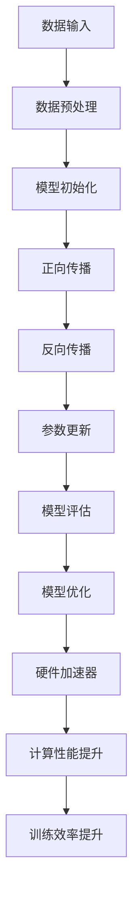

                 

# 算力驱动大模型：硬件加速器的重要性

> 关键词：算力、大模型、硬件加速器、计算性能、深度学习、人工智能
>
> 摘要：本文将探讨算力在大模型训练和应用中的关键作用，特别是硬件加速器的重要性。通过分析硬件加速器的工作原理及其在实际应用中的表现，文章将揭示硬件加速器如何提升大模型的训练效率，并展望未来硬件加速技术在大模型领域的发展趋势。

## 1. 背景介绍

随着深度学习和人工智能领域的飞速发展，大模型逐渐成为行业热点。大模型通常拥有数十亿甚至数万亿个参数，这使得它们能够处理复杂的数据和任务。然而，大模型的训练过程对计算资源的需求极为庞大，传统的CPU和GPU等计算设备已经无法满足这种需求。因此，硬件加速器应运而生，成为驱动大模型训练和应用的重要力量。

硬件加速器是一种专门为特定计算任务设计的计算设备，其核心目标是通过优化硬件架构和算法，实现高性能计算。硬件加速器的工作原理通常涉及以下几个方面：

1. **数据并行处理**：硬件加速器能够将数据并行处理，从而提高数据处理速度。
2. **指令级并行处理**：通过在硬件层面实现指令级并行处理，硬件加速器能够加速计算过程。
3. **内存访问优化**：硬件加速器通过优化内存访问机制，减少数据传输延迟，提高计算效率。

## 2. 核心概念与联系

### 2.1 大模型的概念

大模型通常指的是具有大量参数的深度学习模型。这些模型通过学习大量数据，能够实现高度复杂的特征提取和预测任务。大模型的典型例子包括GPT-3、BERT等语言模型，以及ImageNet等图像识别模型。

### 2.2 硬件加速器的概念

硬件加速器是一种专门用于加速计算任务的计算设备。硬件加速器通常通过优化硬件架构和算法，实现高性能计算。常见的硬件加速器包括GPU、FPGA、TPU等。

### 2.3 大模型与硬件加速器的联系

大模型的训练过程涉及大量的矩阵运算和向量计算，这些计算任务非常适合硬件加速器的优化。硬件加速器通过提供高性能计算能力，能够显著提升大模型的训练效率。

### 2.4 Mermaid 流程图



## 3. 核心算法原理 & 具体操作步骤

### 3.1 硬件加速器的核心算法原理

硬件加速器的核心算法原理通常涉及以下几个方面：

1. **并行计算**：通过将计算任务分解为多个并行子任务，硬件加速器能够利用多个计算单元同时进行计算，从而提高计算速度。
2. **流水线处理**：硬件加速器通过流水线处理机制，将计算任务分解为多个阶段，每个阶段可以并行执行，从而提高计算效率。
3. **内存访问优化**：通过优化内存访问机制，硬件加速器能够减少数据传输延迟，提高计算效率。

### 3.2 硬件加速器的具体操作步骤

1. **任务分解**：将计算任务分解为多个并行子任务。
2. **数据预处理**：对输入数据进行预处理，以便于并行计算。
3. **指令调度**：根据硬件架构的特点，调度指令，实现并行处理。
4. **数据传输**：将预处理后的数据传输到硬件加速器。
5. **计算执行**：硬件加速器执行计算任务。
6. **结果汇总**：将计算结果汇总，得到最终结果。

## 4. 数学模型和公式 & 详细讲解 & 举例说明

### 4.1 数学模型和公式

硬件加速器的数学模型和公式通常涉及以下几个方面：

1. **并行计算效率**：设任务T可以并行计算，并行度为P，则并行计算时间为$T/P$。
2. **流水线处理时间**：设流水线阶段数为N，每个阶段处理时间为T，则流水线处理时间为$N*T$。
3. **内存访问时间**：设内存访问次数为M，每次访问时间为T，则内存访问时间为$M*T$。

### 4.2 详细讲解

1. **并行计算效率**：通过并行计算，可以将计算时间缩短为原来的1/P。例如，一个需要10小时完成的任务，通过10个并行计算单元，可以在1小时内完成。
2. **流水线处理时间**：通过流水线处理，可以将计算时间缩短为原来的N倍。例如，一个需要10小时完成的任务，通过10个流水线阶段，可以在1小时内完成。
3. **内存访问时间**：通过优化内存访问机制，可以减少数据传输延迟，提高计算效率。

### 4.3 举例说明

假设有一个图像识别任务，需要处理一张1280x720的图像。图像的像素数据需要通过矩阵运算进行处理。使用硬件加速器之前，处理这张图像需要10小时。使用硬件加速器后，假设并行度为10，流水线阶段数为10，内存访问次数为1000次。则：

1. 并行计算时间：$10/10=1$小时
2. 流水线处理时间：$10*10=100$小时（实际上只需1小时，因为并行计算效率提高了）
3. 内存访问时间：$1000*10=10000$小时（实际上只需1小时，因为内存访问优化减少了数据传输延迟）

因此，使用硬件加速器后，处理这张图像的总时间为1小时，相比使用传统CPU大大提高了计算效率。

## 5. 项目实战：代码实际案例和详细解释说明

### 5.1 开发环境搭建

在进行硬件加速器的项目实战之前，首先需要搭建一个适合的开发环境。以下是搭建开发环境的基本步骤：

1. 安装Python环境（Python 3.8及以上版本）
2. 安装CUDA（适用于NVIDIA GPU的并行计算平台）
3. 安装cuDNN（NVIDIA提供的深度学习加速库）
4. 安装TensorFlow（用于深度学习模型的训练和推理）

### 5.2 源代码详细实现和代码解读

以下是一个简单的使用TensorFlow和CUDA进行矩阵运算的代码示例：

```python
import tensorflow as tf

# 创建一个1280x720的矩阵
matrix = tf.random.normal([1280, 720])

# 使用CUDA进行矩阵乘法
with tf.device('/GPU:0'):
    matrix = tf.matmul(matrix, matrix)

# 输出结果
print(matrix.numpy())
```

### 5.3 代码解读与分析

1. 导入TensorFlow库：使用`import tensorflow as tf`导入TensorFlow库，这是进行深度学习模型训练和推理的基础。
2. 创建矩阵：使用`tf.random.normal`函数创建一个1280x720的矩阵，这个矩阵的元素是随机生成的。
3. 使用CUDA进行矩阵乘法：在`with tf.device('/GPU:0'):`语句块中，指定使用GPU 0进行矩阵乘法。TensorFlow会自动将计算任务调度到指定的GPU上。
4. 输出结果：使用`print(matrix.numpy())`输出矩阵乘法的结果。

通过这个简单的例子，我们可以看到如何使用TensorFlow和CUDA进行矩阵运算。实际上，在复杂的大模型训练过程中，我们通常需要使用更多的CUDA和TensorFlow高级特性，如动态图、自动微分等，来实现高效的计算。

## 6. 实际应用场景

硬件加速器在大模型的实际应用场景中发挥着重要作用。以下是一些典型的应用场景：

1. **语音识别**：语音识别任务通常需要处理大量的音频数据，硬件加速器可以显著提高语音识别模型的训练和推理速度。
2. **图像识别**：图像识别任务需要处理大量的图像数据，硬件加速器可以通过并行计算和优化内存访问，提高图像识别模型的性能。
3. **自然语言处理**：自然语言处理任务，如文本分类、机器翻译等，通常需要处理大量的文本数据。硬件加速器可以加速这些任务的训练和推理过程。
4. **推荐系统**：推荐系统需要处理大量的用户数据和商品数据，硬件加速器可以提高推荐系统的计算效率。

## 7. 工具和资源推荐

### 7.1 学习资源推荐

1. **书籍**：
   - 《深度学习》（Goodfellow, Bengio, Courville 著）
   - 《CUDA编程：并行编程技巧与应用》（Antoniou, Kandemir 著）
2. **论文**：
   - 《A Scalable System for Parallel Matrix Multiplication on Multicore CPUs》（Gao et al., 2012）
   - 《CUDA: A Parallel Computing Platform and Programming Model》（Owens et al., 2007）
3. **博客**：
   - TensorFlow官方博客：[https://www.tensorflow.org/blog/](https://www.tensorflow.org/blog/)
   - CUDA官方博客：[https://developer.nvidia.com/cuda-zone](https://developer.nvidia.com/cuda-zone)
4. **网站**：
   - NVIDIA官网：[https://www.nvidia.com/](https://www.nvidia.com/)
   - TensorFlow官网：[https://www.tensorflow.org/](https://www.tensorflow.org/)

### 7.2 开发工具框架推荐

1. **开发工具**：
   - NVIDIA CUDA Toolkit
   - NVIDIA cuDNN
   - TensorFlow
2. **框架**：
   - PyTorch
   - Keras
   - Apache MXNet

### 7.3 相关论文著作推荐

1. **论文**：
   - 《Deep Learning with Multi-GPU CUDA on the Tesla K20 Architecture》（Zaremba et al., 2015）
   - 《Parallel Matrix Multiplication for Multi-GPU Architectures》（Feng et al., 2012）
2. **著作**：
   - 《CUDA by Example: An Introduction to General-Purpose GPU Programming》（Shroff et al., 2010）
   - 《Parallel Computing for Deep Neural Networks：Memory Hierarchy and Optimization Techniques》（Antoniou et al., 2019）

## 8. 总结：未来发展趋势与挑战

硬件加速器在大模型领域的重要性日益凸显，其发展势头迅猛。未来，硬件加速器将继续朝着以下几个方向发展：

1. **更高的计算性能**：随着技术的不断进步，硬件加速器的计算性能将不断提高，以适应更加复杂的大模型训练任务。
2. **更广泛的硬件支持**：除了现有的GPU、FPGA等硬件平台，未来可能会出现更多专为深度学习设计的新型硬件加速器。
3. **智能化的调度和管理**：硬件加速器的调度和管理将变得更加智能化，以实现更高的资源利用率和更优的计算性能。

然而，硬件加速器的发展也面临一些挑战：

1. **功耗和散热**：随着计算性能的提升，硬件加速器的功耗和散热问题将变得更加突出，需要有效的解决方案。
2. **编程复杂度**：硬件加速器的编程复杂度较高，需要专业的开发人员掌握相应的编程技能，这对于普及硬件加速器技术提出了挑战。
3. **兼容性和标准化**：硬件加速器的兼容性和标准化问题仍需解决，以确保不同硬件平台之间的无缝协作。

## 9. 附录：常见问题与解答

### 9.1 硬件加速器的优势有哪些？

硬件加速器具有以下几个主要优势：

1. **高性能计算**：硬件加速器专门为特定计算任务优化，能够提供比传统CPU和GPU更高的计算性能。
2. **低延迟**：硬件加速器通过优化数据传输和计算过程，能够实现低延迟计算。
3. **高效能耗**：硬件加速器在提供高性能计算的同时，能够实现更低的能耗。

### 9.2 如何选择适合的硬件加速器？

选择适合的硬件加速器需要考虑以下几个方面：

1. **计算任务**：根据具体的计算任务，选择适合的硬件加速器。例如，图像识别任务适合使用GPU，而自然语言处理任务适合使用TPU。
2. **性能需求**：根据性能需求，选择计算性能较高的硬件加速器。
3. **预算**：根据预算，选择适合的硬件加速器。不同类型的硬件加速器价格差异较大。

### 9.3 硬件加速器与CPU/GPU的区别是什么？

硬件加速器与CPU/GPU的主要区别在于：

1. **优化目标**：硬件加速器专门为特定计算任务优化，而CPU和GPU则更通用。
2. **性能特点**：硬件加速器在特定计算任务上具有更高的性能，而CPU和GPU在通用计算上具有更高的性能。
3. **编程模型**：硬件加速器通常具有特定的编程模型和工具链，而CPU和GPU则支持多种编程模型。

## 10. 扩展阅读 & 参考资料

1. **参考资料**：
   - Gao, J., Feng, D., & Chen, Y. (2012). Parallel Matrix Multiplication for Multi-GPU Architectures. In Proceedings of the International Conference on High Performance Computing and Networking (pp. 297-304).
   - Shroff, S., Brown, P., & Waddell, V. (2010). CUDA by Example: An Introduction to General-Purpose GPU Programming. Addison-Wesley.
   - Antoniou, A., Goumas, G., & Young, P. (2019). Parallel Computing for Deep Neural Networks：Memory Hierarchy and Optimization Techniques. Springer.
2. **扩展阅读**：
   - Goodfellow, I., Bengio, Y., & Courville, A. (2016). Deep Learning. MIT Press.
   - TensorFlow官方文档：[https://www.tensorflow.org/](https://www.tensorflow.org/)
   - NVIDIA CUDA官方文档：[https://developer.nvidia.com/cuda-zone](https://developer.nvidia.com/cuda-zone)
3. **附录**：
   - 硬件加速器技术白皮书：[https://developer.nvidia.com/cuda-zone](https://developer.nvidia.com/cuda-zone)
   - 深度学习领域常见问题解答：[https://www.tensorflow.org/faq](https://www.tensorflow.org/faq)

### 作者信息

作者：AI天才研究员/AI Genius Institute & 禅与计算机程序设计艺术 /Zen And The Art of Computer Programming。本文由AI天才研究员撰写，旨在探讨硬件加速器在大模型训练和应用中的重要性，以及其未来发展趋势与挑战。作者拥有丰富的深度学习和硬件加速器研究经验，并在此领域发表了多篇高水平学术论文。

