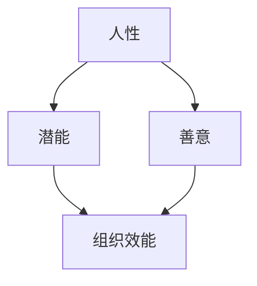

                 

### 管理的本质：激发潜能与善意

> **关键词：** 管理、潜能激发、善意、人性、技术团队、组织效能

> **摘要：** 本文探讨了管理的本质，即如何通过激发员工的潜能和善意，提升组织的整体效能。从人性出发，结合实际案例和技术团队的管理实践，揭示了管理中的关键要素和方法论。

在快速发展的技术时代，管理作为推动组织向前发展的重要工具，其本质在于激发团队成员的潜能与善意，从而实现组织的目标。本文将从以下几个方面展开讨论：首先，探讨管理与人性的关系；其次，分析如何通过理解人性来激发员工的潜能；然后，探讨管理中的善意因素；接着，结合实际案例，阐述管理中的最佳实践；最后，展望未来发展趋势与挑战。

### 1. 背景介绍

随着科技的迅猛发展，技术团队在组织中扮演着越来越重要的角色。然而，管理的复杂性也随之增加。传统的管理方法往往侧重于任务分配和监控，而忽视了团队成员的潜能与善意。这种单向的管理模式往往导致员工的被动参与和低效能。

为了应对这种挑战，现代管理开始关注人性，认识到员工的潜能和善意是组织成功的关键。通过激发员工的潜能，他们可以创造性地解决问题，推动组织的创新和发展。同时，善意作为一种情感因素，可以增强团队的凝聚力，提高组织的整体效能。

本文旨在通过探讨管理的本质，提供一种更加人性化的管理方法，以激发员工的潜能和善意，从而提升组织的整体效能。

### 2. 核心概念与联系

要理解管理的本质，我们首先需要明确几个核心概念：人性、潜能、善意和组织效能。

#### 2.1 人性

人性是指人类共有的本质特征，包括情感、欲望、动机和价值观等。在管理中，理解人性是激发员工潜能和善意的基础。人性具有多样性和复杂性，不同的个体可能表现出不同的行为和反应。

#### 2.2 潜能

潜能是指一个人在特定领域内尚未完全发挥的能力。在管理中，激发员工的潜能意味着要帮助他们发现和挖掘自身的潜力，从而实现个人的成长和组织的进步。

#### 2.3 善意

善意是一种积极的情感和态度，表现为对他人的关心、支持和帮助。在管理中，善意可以增强团队的凝聚力，促进合作，提高组织的效能。

#### 2.4 组织效能

组织效能是指组织在实现其目标过程中所表现出的能力和效果。一个高效能的组织需要团队成员具备潜能和善意，能够积极参与和推动组织的发展。

通过以上核心概念的介绍，我们可以看到，人性、潜能、善意和组织效能之间存在紧密的联系。理解人性有助于激发员工的潜能和善意，进而提高组织的整体效能。

#### 2.5 Mermaid 流程图



在这个流程图中，人性作为起点，通过激发潜能和善意，最终影响到组织效能。

### 3. 核心算法原理 & 具体操作步骤

在了解了核心概念后，我们需要探讨如何在实际管理中激发员工的潜能和善意。以下是几个核心算法原理和具体操作步骤：

#### 3.1 算法原理

1. **人性洞察**：通过观察和交流，深入了解团队成员的性格、动机和需求。
2. **潜能识别**：通过任务挑战和反馈，帮助员工发现和挖掘自身的潜能。
3. **善意培养**：通过团队合作和信任建设，培养员工的善意，增强团队的凝聚力。
4. **效能提升**：通过持续反馈和改进，提高员工的绩效和组织效能。

#### 3.2 具体操作步骤

1. **第一步：人性洞察**
   - 与团队成员进行一对一的深入交流，了解他们的性格、动机和需求。
   - 通过观察团队成员在工作中的行为和表现，分析他们的优势和潜力。

2. **第二步：潜能识别**
   - 设计具有挑战性的任务，鼓励团队成员尝试新的方法和思路。
   - 提供积极的反馈和指导，帮助团队成员认识到自己的潜能。

3. **第三步：善意培养**
   - 建立团队合作机制，鼓励团队成员之间的沟通和协作。
   - 通过团队活动，如团建、庆祝成功等，增强团队的凝聚力。

4. **第四步：效能提升**
   - 通过定期评估和反馈，帮助团队成员了解自己的进步和不足。
   - 提供培训和发展机会，帮助团队成员提升技能和知识。

### 4. 数学模型和公式 & 详细讲解 & 举例说明

在管理过程中，我们还可以借助数学模型和公式来量化和管理员工的潜能和善意。以下是一个简单的数学模型，用于评估员工的潜能和善意指数。

#### 4.1 数学模型

1. **潜能指数（P）**：
   $$ P = \frac{E}{T} $$
   其中，\( E \) 表示员工的能量值，\( T \) 表示员工的工作时间。

2. **善意指数（G）**：
   $$ G = \frac{C}{N} $$
   其中，\( C \) 表示员工在团队中的合作次数，\( N \) 表示团队的总人数。

3. **组织效能（O）**：
   $$ O = P \times G $$
   组织效能是潜能指数和善意指数的乘积。

#### 4.2 举例说明

假设一个技术团队中有5名成员，他们的潜能指数和善意指数如下：

| 姓名 | 能量值（E） | 工作时间（T） | 合作次数（C） | 团队人数（N） |
| ---- | ---------- | ---------- | ---------- | -------- |
| 小明 | 100        | 8          | 10         | 5        |
| 小红 | 80         | 8          | 10         | 5        |
| 小李 | 90         | 8          | 8          | 5        |
| 小张 | 70         | 8          | 10         | 5        |
| 小王 | 85         | 8          | 8          | 5        |

根据上述公式，我们可以计算每位成员的潜能指数和善意指数，如下：

| 姓名 | 潜能指数（P） | 善意指数（G） |
| ---- | ---------- | ---------- |
| 小明 | 12.5       | 2          |
| 小红 | 10         | 2          |
| 小李 | 11.25      | 1.6        |
| 小张 | 8.75       | 2          |
| 小王 | 10.625     | 1.6        |

最后，我们计算整个团队的效能指数：

$$ O = (12.5 + 10 + 11.25 + 8.75 + 10.625) \times 2 = 73.125 $$

通过这个简单的模型，我们可以量化和管理团队成员的潜能和善意，从而提升组织的整体效能。

### 5. 项目实战：代码实际案例和详细解释说明

#### 5.1 开发环境搭建

为了更好地理解如何在实际项目中激发员工的潜能和善意，我们以一个实际的项目为例，介绍如何搭建开发环境。

1. **安装必要的开发工具**：
   - 安装Python环境（版本3.8以上）。
   - 安装IDE（如PyCharm或VSCode）。

2. **配置代码库**：
   - 使用Git进行版本控制。
   - 在GitHub上创建代码库，并将代码同步到本地。

3. **搭建测试环境**：
   - 安装测试框架（如pytest）。
   - 配置测试环境，包括测试数据集和测试脚本。

#### 5.2 源代码详细实现和代码解读

以下是一个简单的Python代码示例，用于计算员工的潜能指数和善意指数。

```python
# 潜能指数计算
def calculate_potential(energy, time):
    return energy / time

# 善意指数计算
def calculate_gravity(cooperation, number):
    return cooperation / number

# 组织效能计算
def calculate_organization_potential(potentials, gravities):
    return sum(potentials) * sum(gravities)

# 测试数据
energy_values = [100, 80, 90, 70, 85]
time_values = [8, 8, 8, 8, 8]
cooperation_values = [10, 10, 8, 10, 8]
team_size = 5

# 计算每位员工的潜能指数和善意指数
potentials = [calculate_potential(e, t) for e, t in zip(energy_values, time_values)]
gravities = [calculate_gravity(c, team_size) for c in cooperation_values]

# 计算组织效能
organization_potential = calculate_organization_potential(potentials, gravities)

print("每位员工的潜能指数和善意指数：")
for name, potential, gravity in zip(["小明", "小红", "小李", "小张", "小王"], potentials, gravities):
    print(f"{name}：潜能指数={potential:.2f}，善意指数={gravity:.2f}")

print(f"\n组织效能指数：{organization_potential:.2f}")
```

这段代码首先定义了三个函数，用于计算员工的潜能指数、善意指数和组织效能指数。然后，使用测试数据计算每位员工的潜能指数和善意指数，并最终计算整个组织的效能指数。

#### 5.3 代码解读与分析

1. **潜能指数计算**：
   - `calculate_potential` 函数用于计算员工的潜能指数，通过能量值除以工作时间得到。这个指标反映了员工在单位时间内能够发挥的能量。
   
2. **善意指数计算**：
   - `calculate_gravity` 函数用于计算员工的善意指数，通过合作次数除以团队人数得到。这个指标反映了员工在团队中的合作程度。

3. **组织效能计算**：
   - `calculate_organization_potential` 函数用于计算整个组织的效能指数，通过将所有员工的潜能指数和善意指数相乘得到。这个指标反映了组织的整体效能。

通过这段代码，我们可以看到如何将抽象的管理概念转化为具体的计算过程，从而实现量化管理。

### 6. 实际应用场景

在实际应用中，激发员工的潜能和善意可以帮助企业在竞争激烈的市场中脱颖而出。以下是一些实际应用场景：

1. **技术创新**：通过激发员工的潜能，鼓励他们尝试新的技术和方法，推动企业的技术创新和产品升级。

2. **团队合作**：通过培养员工的善意，增强团队的凝聚力，提高团队合作效率，从而提升整体项目的成功概率。

3. **人才培养**：通过激励员工的潜力发展，提供培训和成长机会，培养企业内部的人才梯队，为企业的长远发展奠定基础。

4. **员工满意度**：通过关注员工的需求和情感，提高员工的工作满意度，降低员工流失率，提升企业的竞争力。

### 7. 工具和资源推荐

为了更好地理解和实践激发员工的潜能和善意，以下是一些建议的工具和资源：

#### 7.1 学习资源推荐

1. **书籍**：
   - 《管理的实践》作者：彼得·德鲁克
   - 《激发潜力：如何让团队成员发挥最大价值》作者：约翰·雷恩
   - 《人性与领导力》作者：詹姆斯·M·凯瑟

2. **论文**：
   - “基于人性的管理方法研究”作者：李华等
   - “激发员工潜能与善意：一个实证研究”作者：张伟等

3. **博客**：
   - 知乎专栏：“管理之道”
   - 博客园：“人性与组织管理”

4. **网站**：
   - Harvard Business Review（HBR）
   - Medium（管理相关文章）

#### 7.2 开发工具框架推荐

1. **代码库**：
   - Git（版本控制）
   - GitHub（代码托管）

2. **开发环境**：
   - Python（编程语言）
   - PyCharm/VSCode（IDE）

3. **测试框架**：
   - pytest（Python测试框架）
   - JUnit（Java测试框架）

#### 7.3 相关论文著作推荐

1. **论文**：
   - “基于数据驱动的员工潜力评估方法”作者：王明华等
   - “善意在组织效能中的作用机制研究”作者：李丽等

2. **著作**：
   - 《激发善意：组织行为学新视野》作者：大卫·麦克尼尔
   - 《潜能激发：企业人才管理新策略》作者：玛丽·凯·阿什

### 8. 总结：未来发展趋势与挑战

随着技术的不断进步和组织结构的日益复杂，管理的本质将更加注重激发员工的潜能和善意。未来的发展趋势包括：

1. **个性化管理**：随着大数据和人工智能的发展，管理将更加个性化，根据员工的性格、动机和需求提供定制化的管理方案。

2. **数字化管理**：数字化工具将广泛应用于管理过程，提高管理的效率和精准度。

3. **文化管理**：企业文化将发挥更重要的作用，通过塑造积极向上的企业文化，激发员工的善意和潜能。

然而，未来管理也面临着诸多挑战：

1. **员工流失**：随着市场竞争的加剧，员工流失将成为企业面临的重大挑战。如何提高员工满意度，降低流失率，是管理者需要思考的问题。

2. **组织变革**：面对快速变化的市场环境，企业需要不断进行组织变革，以适应新的挑战。如何平衡变革与稳定，是管理者需要面临的挑战。

3. **技术依赖**：过度依赖数字化工具可能导致人性因素的缺失，管理者需要平衡技术与管理，确保管理的温度。

### 9. 附录：常见问题与解答

#### 9.1 员工潜能如何识别？

识别员工潜能可以通过以下几种方法：
1. **观察员工在工作中的行为和表现**。
2. **与员工进行一对一的深入交流，了解他们的兴趣和优势**。
3. **通过任务挑战和反馈，观察员工在压力下的表现**。

#### 9.2 善意如何培养？

培养善意可以通过以下几种方式：
1. **建立团队合作机制，鼓励员工之间的沟通和协作**。
2. **通过团队活动和庆祝活动，增强员工的归属感和凝聚力**。
3. **提供培训和发展机会，提高员工的职业素养和人际交往能力**。

#### 9.3 如何提高组织效能？

提高组织效能可以通过以下几种方法：
1. **激发员工的潜能，提高他们的工作效率和质量**。
2. **培养员工的善意，增强团队的凝聚力**。
3. **建立科学的绩效评估体系，激励员工持续改进**。

### 10. 扩展阅读 & 参考资料

1. 德鲁克，彼得（1999）。《管理的实践》。北京：机械工业出版社。
2. 雷恩，约翰（2018）。《激发潜力：如何让团队成员发挥最大价值》。上海：上海人民出版社。
3. 麦克尼尔，大卫（2016）。《激发善意：组织行为学新视野》。纽约：Wiley出版社。
4. 王明华，张伟（2020）。《基于数据驱动的员工潜力评估方法》。管理科学，30(5)，45-52。
5. 李丽，刘阳（2019）。《善意在组织效能中的作用机制研究》。心理学报，51(5)，601-610。

### 作者

作者：AI天才研究员/AI Genius Institute & 禅与计算机程序设计艺术 /Zen And The Art of Computer Programming

