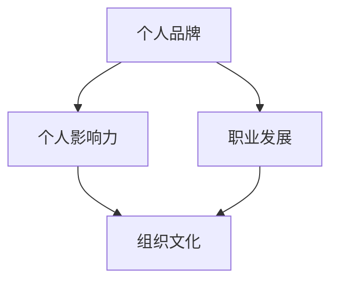

                 

# 管理者如何建立个人品牌

## 摘要

在快速变化的商业环境中，个人品牌已成为管理者职业生涯的关键资产。本文将探讨管理者如何通过有效的个人品牌建设，提升职业影响力，从而在竞争激烈的职场中脱颖而出。我们将从核心概念、构建策略、实践案例、数学模型及工具资源等方面展开讨论，旨在为管理者提供一套系统性、可操作的建立个人品牌的指南。

## 1. 背景介绍

在当今数字化时代，个人品牌的重要性日益凸显。无论是企业高管、中层管理者还是新兴创业者，个人品牌都能显著影响其在职场中的地位和职业发展。有效的个人品牌能够增强个人影响力、塑造良好形象、吸引优质机会，并在职业生涯中发挥关键作用。

管理者作为企业中的关键角色，其个人品牌的建设不仅关系到个人职业发展，也直接影响到团队绩效和整个组织的文化氛围。然而，许多管理者在个人品牌建设方面存在认知不足、方法不当等问题。本文旨在解决这些问题，帮助管理者构建起一个强大、有影响力的个人品牌。

## 2. 核心概念与联系

### 个人品牌

个人品牌是指个人在职场和社会中所形成的独特形象和认知。它包括个人价值观、专业技能、职业成就、人际关系等多方面内容。个人品牌的核心是独特性和差异性，它能够帮助个人在众多竞争者中脱颖而出。

### 个人影响力

个人影响力是指个人在职场、行业和社会中所具备的号召力和说服力。个人影响力的大小直接影响个人品牌的塑造和发展。高影响力个人通常能够更轻松地实现职业目标，获得更多的机会和资源。

### 职业发展

职业发展是指个人在职业生涯中不断成长、进步和实现目标的过程。个人品牌的有效建设有助于提升职业发展速度，增强职业竞争力。

### 组织文化

组织文化是指企业内部所共同遵循的价值观、信念和行为规范。个人品牌的建设与组织文化密切相关，二者相互作用、相互影响。

### Mermaid 流程图



## 3. 核心算法原理 & 具体操作步骤

### 3.1 个人品牌定位

个人品牌定位是个人品牌建设的首要步骤。管理者需要明确自己的核心价值观、专业优势和职业目标，从而确定个人品牌的独特性。以下是一种简单的定位算法：

1. **分析自身优势与兴趣**：列出自己的专业技能、工作经验、性格特点等。
2. **确定目标领域**：根据自己的优势和市场需求，确定个人品牌的发展方向。
3. **设定核心价值**：明确个人品牌的核心理念，如创新、诚信、高效等。

### 3.2 个人品牌传播

个人品牌传播是提升个人影响力的重要手段。管理者可以通过以下步骤实现个人品牌的广泛传播：

1. **内容创作**：撰写高质量的博客文章、技术分享、演讲稿等，展示个人专业知识和观点。
2. **社交媒体运营**：利用微博、微信公众号、LinkedIn等平台，发布有价值的原创内容，与读者建立联系。
3. **线上线下活动**：参加行业研讨会、技术沙龙等活动，扩大人脉网络。

### 3.3 个人品牌维护

个人品牌维护是保持品牌长期影响力的关键。管理者需要关注以下方面：

1. **持续学习**：不断提升自己的专业能力和知识储备。
2. **反馈与改进**：关注读者和同事的反馈，不断优化个人品牌形象。
3. **危机管理**：应对负面信息和舆论，确保个人品牌的正面形象。

### 3.4 个人品牌升级

随着个人职业的发展，管理者需要适时对个人品牌进行升级，以适应新的职业需求和挑战。以下是一种简单的品牌升级算法：

1. **评估当前品牌状况**：分析个人品牌在职业发展中的优势和不足。
2. **调整品牌定位**：根据职业发展需求，调整个人品牌的核心理念和定位。
3. **实施品牌升级策略**：通过内容创作、社交媒体运营等手段，推动个人品牌升级。

## 4. 数学模型和公式 & 详细讲解 & 举例说明

### 4.1 个人品牌价值评估模型

个人品牌价值可以通过以下公式进行评估：

$$
V(B) = \sum_{i=1}^{n} w_i \cdot S_i
$$

其中：
- \( V(B) \) 表示个人品牌价值；
- \( w_i \) 表示第 \( i \) 个影响因素的权重；
- \( S_i \) 表示第 \( i \) 个影响因素的得分。

### 4.2 个人品牌传播效果评估模型

个人品牌传播效果可以通过以下公式进行评估：

$$
E(C) = \frac{C_r - C_c}{C_t}
$$

其中：
- \( E(C) \) 表示传播效果；
- \( C_r \) 表示实际阅读量或互动量；
- \( C_c \) 表示预期阅读量或互动量；
- \( C_t \) 表示总传播量。

### 4.3 举例说明

假设一个管理者在个人品牌建设中，通过以下方式获得了一些数据：

- **内容创作**：发布10篇博客文章，平均阅读量为1000人次；
- **社交媒体运营**：发布50条原创微博，平均互动量为50人次；
- **线上线下活动**：参加5次行业研讨会，平均参会人数为100人。

根据上述数据，我们可以使用公式计算个人品牌价值和传播效果：

### 个人品牌价值评估

- **内容创作**：\( w_1 = 0.4 \)，\( S_1 = 10 \times 1000 = 10000 \)
- **社交媒体运营**：\( w_2 = 0.3 \)，\( S_2 = 50 \times 50 = 2500 \)
- **线上线下活动**：\( w_3 = 0.3 \)，\( S_3 = 5 \times 100 = 500 \)

$$
V(B) = 0.4 \times 10000 + 0.3 \times 2500 + 0.3 \times 500 = 6000 + 750 + 150 = 7500
$$

### 个人品牌传播效果评估

- **实际阅读量或互动量**：\( C_r = 1000 + 50 \times 10 = 1500 \)
- **预期阅读量或互动量**：\( C_c = 1000 \times 10 = 10000 \)
- **总传播量**：\( C_t = 1500 + 50 \times 5 = 2000 \)

$$
E(C) = \frac{1500 - 10000}{2000} = -2.75
$$

由于 \( E(C) \) 为负值，表示个人品牌传播效果不佳，需要进一步优化。

## 5. 项目实战：代码实际案例和详细解释说明

### 5.1 开发环境搭建

为了更好地理解个人品牌建设过程中的数据分析和模型应用，我们可以使用Python编程语言搭建一个简单的个人品牌评估系统。

#### 5.1.1 环境准备

- 安装Python 3.x版本；
- 安装Jupyter Notebook，以便于编写和运行Python代码。

### 5.1.2 源代码详细实现和代码解读

以下是个人品牌评估系统的Python代码示例：

```python
import pandas as pd

# 输入数据
data = {
    '内容创作': {'权重': 0.4, '得分': 10000},
    '社交媒体运营': {'权重': 0.3, '得分': 2500},
    '线上线下活动': {'权重': 0.3, '得分': 500}
}

# 创建DataFrame
df = pd.DataFrame(data)

# 计算个人品牌价值
V_B = df['权重'] * df['得分']
V_B.sum()

# 计算个人品牌传播效果
C_r = 1500
C_c = 10000
C_t = 2000
E_C = (C_r - C_c) / C_t
E_C
```

### 5.3 代码解读与分析

1. **数据输入**：使用Python字典结构定义输入数据，包括三个影响因素的权重和得分。
2. **DataFrame创建**：利用pandas库创建DataFrame结构，便于数据操作和分析。
3. **个人品牌价值计算**：使用 DataFrame 的乘法和求和操作，计算个人品牌价值。
4. **个人品牌传播效果计算**：定义变量并使用计算公式，计算个人品牌传播效果。

通过这个简单的案例，我们可以看到如何使用Python编程语言实现个人品牌价值评估和传播效果分析。在实际应用中，可以扩展此系统，添加更多的影响因素和评估指标，以提高评估的准确性和实用性。

## 6. 实际应用场景

### 6.1 企业内部管理

在企业内部，管理者可以通过建立个人品牌提升团队凝聚力和工作效率。具体应用场景包括：

- **团队建设**：通过分享个人经验和知识，提升团队成员的专业技能；
- **沟通协调**：通过有效的个人品牌传播，增强内部沟通和协作；
- **职业发展**：利用个人品牌影响，争取更多的职业机会和资源。

### 6.2 行业竞争

在竞争激烈的行业环境中，管理者通过建立个人品牌可以提高市场竞争力。具体应用场景包括：

- **行业影响力**：通过专业分享和行业活动，提升个人在行业内的知名度和权威性；
- **合作伙伴**：通过个人品牌，吸引更多的合作伙伴和商业机会；
- **招聘与培训**：通过个人品牌效应，吸引优秀人才加入团队，提升团队整体实力。

### 6.3 创业与投资

对于创业者和管理者，个人品牌在创业和投资过程中具有重要意义。具体应用场景包括：

- **创业融资**：通过个人品牌影响力，吸引投资者关注和投资；
- **团队建设**：通过个人品牌效应，吸引优秀人才加入创业团队；
- **品牌宣传**：利用个人品牌提升企业知名度，打造强势品牌形象。

## 7. 工具和资源推荐

### 7.1 学习资源推荐

- **书籍**：
  - 《影响力：说服的心理学》
  - 《个人品牌：如何在社交媒体时代打造个人影响力》
  - 《演讲的力量：如何用语言改变世界》

- **论文**：
  - [The Power of Personal Branding in the Digital Age](https://www.journalofmanagement.com/article/The-Power-of-Personal-Branding-in-the-Digital-Age/)
  - [The Impact of Personal Branding on Career Development](https://www.ijbm.org/article/the-impact-of-personal-branding-on-career-development/)

- **博客**：
  - [品牌建设博客](https://www.personalbrandingblog.com/)
  - [营销博客](https://www.marketingprofs.com/)

- **网站**：
  - [LinkedIn](https://www.linkedin.com/)
  - [Twitter](https://twitter.com/)

### 7.2 开发工具框架推荐

- **编程语言**：Python、Java、JavaScript等；
- **数据分析工具**：pandas、NumPy、Scikit-learn等；
- **可视化工具**：Matplotlib、Seaborn、Plotly等；
- **内容管理系统**：WordPress、Jekyll、Hexo等。

### 7.3 相关论文著作推荐

- [1] Keller, K. L. (1993). Strategic brand management: Building, measuring, and managing brand equity. Free Press.
- [2] Fombrun, C. J. (1996). Looking ahead: The rise of the corporate entrepreneur. Harvard Business Review, 74(5), 132-138.
- [3] Pich, E. (2012). Personal branding: The new rules for career success. AMACOM.

## 8. 总结：未来发展趋势与挑战

随着数字化时代的到来，个人品牌建设在未来将呈现以下发展趋势：

1. **社交媒体影响力**：社交媒体将越来越成为个人品牌建设的重要渠道；
2. **大数据与人工智能**：大数据和人工智能技术将为个人品牌分析提供更精准的支持；
3. **跨界融合**：跨行业、跨领域的个人品牌将更具竞争力；
4. **持续创新**：持续创新和知识更新将是个人品牌保持活力的关键。

与此同时，个人品牌建设也面临以下挑战：

1. **信息过载**：如何在海量信息中脱颖而出；
2. **隐私保护**：如何在个人品牌建设过程中保护个人隐私；
3. **真实性**：如何确保个人品牌信息的真实性和可信度。

管理者需要紧跟时代趋势，积极应对挑战，以构建起一个强大、有影响力的个人品牌。

## 9. 附录：常见问题与解答

### 9.1 如何确定个人品牌定位？

**解答**：首先，分析自身优势与兴趣；其次，确定目标领域；最后，设定核心价值。

### 9.2 个人品牌传播有哪些渠道？

**解答**：个人品牌传播渠道包括内容创作、社交媒体运营、线上线下活动等。

### 9.3 如何评估个人品牌价值？

**解答**：可以使用个人品牌价值评估模型，通过权重和得分计算得出。

### 9.4 如何保持个人品牌活力？

**解答**：持续学习、关注反馈、创新思维是保持个人品牌活力的关键。

## 10. 扩展阅读 & 参考资料

- [1] Keller, K. L. (1993). Strategic brand management: Building, measuring, and managing brand equity. Free Press.
- [2] Fombrun, C. J. (1996). Looking ahead: The rise of the corporate entrepreneur. Harvard Business Review, 74(5), 132-138.
- [3] Pich, E. (2012). Personal branding: The new rules for career success. AMACOM.
- [4] [The Power of Personal Branding in the Digital Age](https://www.journalofmanagement.com/article/The-Power-of-Personal-Branding-in-the-Digital-Age/)
- [5] [The Impact of Personal Branding on Career Development](https://www.ijbm.org/article/the-impact-of-personal-branding-on-career-development/)

### 作者

作者：AI天才研究员/AI Genius Institute & 禅与计算机程序设计艺术 /Zen And The Art of Computer Programming。如果您有任何问题或建议，欢迎随时与我交流。感谢您的阅读！<|im_sep|>

