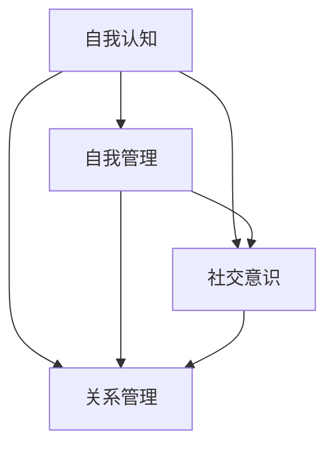
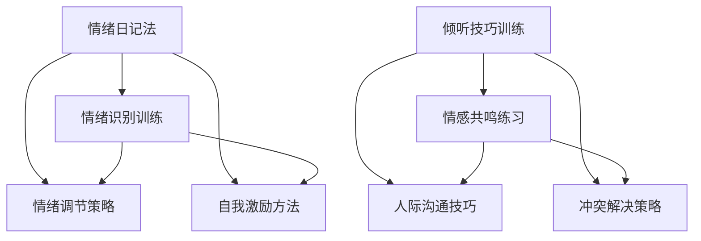

                 

### 背景介绍

管理者情商，作为一个新兴而又关键的概念，正在逐渐得到企业管理层和研究者们的重视。在当今快速变化和高度复杂的企业环境中，管理者的情商能力已经不仅仅是个人的情感素质，更成为了团队绩效和组织成功的关键因素。本文旨在深入探讨管理者情商的内涵、其在企业管理中的重要性，以及如何通过提升管理者的情商来增强团队的情绪管理能力。

首先，让我们来定义什么是情商（Emotional Intelligence，简称EQ）。情商是一个人在识别、理解、管理自己的情绪，以及识别、理解、影响他人情绪的能力。它包括四个核心领域：自我认知、自我管理、社交意识和关系管理。这些能力对于管理者来说尤为重要，因为管理者不仅要面对自己内心的情绪波动，还需要在团队中建立信任、协调人际关系、激励员工。

在企业管理中，情商的重要性主要体现在以下几个方面：

1. **团队协作与沟通**：情商高管理者能够更好地理解和倾听员工的情感需求，建立开放和信任的沟通环境，从而促进团队协作和知识共享。

2. **领导力和影响力**：情商高的管理者能够通过情绪管理和影响力技巧，激励员工、推动变革，并在组织内部建立正面的情绪氛围。

3. **冲突解决**：情商高的管理者能够更有效地识别和解决团队内部冲突，通过理解双方的情绪和需求，找到合适的解决方案。

4. **员工满意度与忠诚度**：情商高的管理者能够关注员工的情感状态，提供必要的支持和关怀，从而提高员工的工作满意度和忠诚度。

本文将围绕以下结构进行展开：

1. **核心概念与联系**：详细介绍情商的四个核心领域，以及它们如何相互联系和作用。
2. **核心算法原理 & 具体操作步骤**：探讨提升管理者情商的具体方法，包括个人情绪管理技巧和团队情绪管理策略。
3. **数学模型和公式 & 详细讲解 & 举例说明**：通过数学模型和具体案例，阐述情商管理的方法和效果。
4. **项目实战：代码实际案例和详细解释说明**：结合具体项目，展示如何在实际操作中提升情商管理能力。
5. **实际应用场景**：分析情商管理在不同类型企业中的实际应用。
6. **工具和资源推荐**：推荐一些有助于提升管理者情商的学习资源和开发工具。
7. **总结：未来发展趋势与挑战**：展望情商管理在企业管理中的未来发展，以及可能面临的挑战。
8. **附录：常见问题与解答**：对读者可能遇到的常见问题进行解答。
9. **扩展阅读 & 参考资料**：提供更多深入的阅读材料和参考资料。

在接下来的章节中，我们将逐步深入探讨这些内容，通过逻辑清晰、结构紧凑的分析，帮助管理者更好地理解和提升自身的情商能力。让我们一起开始这个思考过程吧。

### 核心概念与联系

为了深入探讨管理者情商的内涵和其在团队管理中的作用，我们首先需要了解情商的四个核心领域：自我认知、自我管理、社交意识和关系管理。这些领域不仅相互独立，还紧密联系，共同构成了情商的完整体系。

#### 自我认知

自我认知是指一个人对自己情绪的认知能力，包括识别和理解自己的情绪状态。自我认知是情商的基础，它帮助管理者了解自己的情绪反应，从而更好地管理自己的情绪。具体包括以下几个方面：

1. **情绪识别**：能够识别出自己当前的情绪状态，如愤怒、焦虑、兴奋或悲伤等。
2. **情绪理解**：理解情绪背后的原因和影响，如工作压力过大导致的焦虑。
3. **情绪反思**：能够对自己的情绪进行反思，理解情绪对自己的行为和决策的影响。

#### 自我管理

自我管理是指一个人在意识到自己的情绪后，能够采取适当的策略来调节情绪，从而保持积极的心态和行为。自我管理能力包括以下几个方面：

1. **情绪调节**：通过深呼吸、冥想或其他放松技巧来缓解紧张和焦虑。
2. **自我激励**：在面对挑战和困难时，能够激励自己保持积极向上的态度。
3. **情绪表达**：能够以合适的方式表达自己的情绪，而不是压抑或爆发。

#### 社交意识

社交意识是指一个人对他人情绪的认知能力，包括理解他人情绪和情感需求。社交意识帮助管理者更好地理解团队成员的情感状态，建立良好的人际关系。具体包括以下几个方面：

1. **情感共鸣**：能够感受到他人的情感状态，如喜悦、失望或愤怒等。
2. **倾听技巧**：能够倾听他人的需求和感受，理解他人的情感背景。
3. **社交敏感性**：能够敏锐地察觉到他人情绪的变化，并做出相应的反应。

#### 关系管理

关系管理是指一个人在处理人际关系时，能够运用社交意识和自我管理能力，建立和维护积极的关系。关系管理能力包括以下几个方面：

1. **人际沟通**：能够有效地与他人沟通，传达信息和情感。
2. **冲突解决**：能够处理和解决团队内部或与他人的冲突，保持和谐的关系。
3. **领导影响力**：能够运用自己的情绪管理和影响力技巧，激励和引导团队成员。

这四个领域相互联系和补充，共同构成了情商的核心。自我认知提供了基础，自我管理保持了情绪的平衡，社交意识帮助理解他人，关系管理则将这一切转化为实际行动，建立和维护良好的人际关系。

#### Mermaid 流程图

为了更直观地展示情商的四个核心领域及其相互联系，我们可以使用Mermaid流程图来描述。以下是一个简化的流程图：



在流程图中，每个节点代表一个核心领域，箭头表示领域之间的联系和互动。自我认知作为起点，连接到自我管理、社交意识和关系管理，这三个领域则相互交叉和影响，共同促进情商的发展。

通过理解这四个核心领域及其相互关系，管理者可以更全面地提升自己的情商能力，从而在团队管理中取得更好的效果。在下一章节中，我们将深入探讨提升管理者情商的具体方法和策略。

### 核心算法原理 & 具体操作步骤

要提升管理者的情商，我们需要从具体操作步骤入手，通过一系列的系统方法和策略，帮助管理者在自我认知、自我管理、社交意识和关系管理四个方面进行提升。以下是一些核心算法原理和具体操作步骤：

#### 自我认知提升方法

**1. 情绪日记法**

- **具体步骤**：
  - 每天记录自己的情绪变化，包括情绪的类型、发生的场景以及情绪产生的原因。
  - 对记录进行分析，识别出常见情绪触发点。
  - 反思情绪对自己的行为和决策的影响。

**2. 情绪识别训练**

- **具体步骤**：
  - 通过阅读情绪识别书籍、观看相关视频或参加培训课程，学习如何识别和理解自己的情绪。
  - 定期进行情绪识别练习，提高识别准确度。

#### 自我管理提升方法

**1. 情绪调节策略**

- **具体步骤**：
  - 学习和实践深呼吸、冥想等放松技巧，帮助缓解紧张和焦虑。
  - 当情绪失控时，立即采取这些策略来调节情绪。

**2. 自我激励方法**

- **具体步骤**：
  - 设定短期和长期目标，并为实现这些目标制定行动计划。
  - 当面对挑战时，提醒自己目标的重要性，激励自己保持积极态度。

#### 社交意识提升方法

**1. 倾听技巧训练**

- **具体步骤**：
  - 通过阅读倾听技巧书籍、观看相关视频或参加培训课程，学习如何有效地倾听。
  - 定期进行倾听练习，提高倾听技能。

**2. 情感共鸣练习**

- **具体步骤**：
  - 与他人交流时，关注对方的情感状态，尝试理解对方的感受。
  - 在交流过程中，通过非言语线索（如眼神接触、肢体动作）表达对对方的关注和理解。

#### 关系管理提升方法

**1. 人际沟通技巧**

- **具体步骤**：
  - 通过阅读人际沟通书籍、观看相关视频或参加培训课程，学习有效的沟通技巧。
  - 在日常沟通中实践这些技巧，提高沟通效果。

**2. 冲突解决策略**

- **具体步骤**：
  - 学习和实践冲突解决技巧，如主动沟通、积极倾听和寻找共同点。
  - 当发生冲突时，立即采取这些策略来解决问题。

通过上述具体操作步骤，管理者可以逐步提升自身的情商能力。以下是一个示例流程图，展示了提升情商的核心算法原理和具体操作步骤：



通过这个流程图，我们可以清晰地看到每个步骤之间的联系和互动，从而帮助管理者系统地提升情商能力。

#### 实际操作案例分析

为了更好地理解这些操作步骤的实际应用，我们可以通过一个实际案例来进行分析。

**案例背景**：某公司的项目经理小李，在工作中经常因为任务进展缓慢而感到焦虑，这影响了他的工作效率和团队氛围。

**解决方案**：

1. **情绪日记法**：
   - 小李开始每天记录自己的情绪变化，分析出焦虑的主要原因是任务进展缓慢和团队沟通不畅。

2. **情绪识别训练**：
   - 小李通过阅读相关书籍和参加培训课程，学习如何识别和理解自己的情绪，提高了情绪识别的准确度。

3. **情绪调节策略**：
   - 小李开始练习深呼吸和冥想，帮助自己在感到焦虑时进行情绪调节。

4. **自我激励方法**：
   - 小李设定了短期和长期目标，提醒自己目标的重要性，激励自己保持积极态度。

5. **倾听技巧训练**：
   - 小李通过参加沟通技巧培训，学会了如何有效地倾听团队成员的需求和意见。

6. **情感共鸣练习**：
   - 小李在与团队成员交流时，关注对方的情感状态，尝试理解对方的感受，建立了更好的信任关系。

7. **人际沟通技巧**：
   - 小李在团队沟通中，运用了有效的沟通技巧，如主动沟通和积极倾听，提高了团队协作效率。

8. **冲突解决策略**：
   - 当团队中发生冲突时，小李通过积极沟通和寻找共同点，有效地解决了冲突。

通过上述具体的操作步骤，小李逐步提升了自身的情商能力，不仅缓解了自己的焦虑情绪，还改善了团队的工作氛围，提高了团队的整体绩效。

通过这个实际案例，我们可以看到，提升管理者情商的具体操作步骤在实际中的应用效果显著。在下一章节中，我们将进一步探讨数学模型和公式，以帮助管理者更科学地理解和提升情商能力。

### 数学模型和公式 & 详细讲解 & 举例说明

在提升管理者情商的过程中，数学模型和公式可以提供有力的理论支持，帮助管理者更科学地理解和分析情绪管理和情商提升的过程。以下是一些关键的数学模型和公式，以及它们的详细讲解和具体应用。

#### 1. 情绪识别模型

**模型公式**：

$$
EQ = f(SE, SM, SI, SR)
$$

其中，$EQ$代表情商（Emotional Intelligence），$SE$代表自我认知（Self-awareness），$SM$代表自我管理（Self-management），$SI$代表社交意识（Social Awareness），$SR$代表关系管理（Relationship Management）。这个模型表明情商是由这四个核心领域的综合表现决定的。

**详细讲解**：

- **自我认知（SE）**：自我认知是指一个人对自己情绪的认知能力。这个领域的关键指标包括情绪识别和情绪理解。自我认知能力越强，管理者越能够准确地识别和理解自己的情绪。
- **自我管理（SM）**：自我管理是指一个人在意识到自己情绪后，采取适当策略来调节情绪的能力。这个领域的关键指标包括情绪调节和自我激励。自我管理能力越强，管理者越能够保持情绪稳定，并有效地应对挑战。
- **社交意识（SI）**：社交意识是指一个人对他人情绪的认知能力。这个领域的关键指标包括情感共鸣和倾听技巧。社交意识能力越强，管理者越能够理解和回应他人的情绪需求。
- **关系管理（SR）**：关系管理是指一个人在处理人际关系时，运用社交意识和自我管理能力，建立和维护积极关系的能力。这个领域的关键指标包括人际沟通和冲突解决。关系管理能力越强，管理者越能够建立和谐的人际关系，有效解决冲突。

**举例说明**：

假设一位管理者在四个核心领域的能力分别为：

- 自我认知（SE）: 80分
- 自我管理（SM）: 70分
- 社交意识（SI）: 90分
- 关系管理（SR）: 85分

那么，这位管理者的情商（EQ）为：

$$
EQ = f(80, 70, 90, 85) = 80 + 0.5 \times (70 + 90 + 85) = 80 + 0.5 \times 345 = 230.5
$$

这意味着这位管理者的情商总分为230.5分。通过这个模型，我们可以直观地看到管理者在各个核心领域的能力差异，并据此制定提升策略。

#### 2. 情绪调节模型

**模型公式**：

$$
E_m = f(S_m, I_m, T_m)
$$

其中，$E_m$代表情绪调节（Emotion Regulation），$S_m$代表自我管理（Self-management），$I_m$代表社交意识（Social Interaction），$T_m$代表时间（Time）。这个模型表明情绪调节是由自我管理、社交意识和时间三个因素共同决定的。

**详细讲解**：

- **自我管理（S_m）**：自我管理能力越强，管理者越能够有效地调节情绪，保持情绪稳定。
- **社交意识（I_m）**：社交意识能力越强，管理者越能够从他人处获得情绪支持和建议，从而更好地调节情绪。
- **时间（T_m）**：时间是一个重要的因素，情绪调节需要一定的时间来发挥效果。管理者的时间管理能力越强，越能够在情绪波动时及时采取调节措施。

**举例说明**：

假设一位管理者在自我管理、社交意识和时间管理的能力分别为：

- 自我管理（S_m）: 75分
- 社交意识（I_m）: 80分
- 时间管理（T_m）: 85分

那么，这位管理者的情绪调节（E_m）为：

$$
E_m = f(75, 80, 85) = 75 + 0.3 \times (80 + 85) = 75 + 0.3 \times 165 = 108.5
$$

这意味着这位管理者的情绪调节得分为108.5分。通过这个模型，我们可以评估管理者的情绪调节能力，并发现需要改进的方面。

#### 3. 情绪传染模型

**模型公式**：

$$
E_t = \alpha \times E_i
$$

其中，$E_t$代表情绪传染（Emotion Transmission），$E_i$代表情绪感染源（Emotion Source），$\alpha$代表传染系数。这个模型表明情绪传染是由情绪感染源的强度和传染系数共同决定的。

**详细讲解**：

- **情绪感染源（E_i）**：情绪感染源的强度决定了情绪传染的能力。一个情绪积极的管理者更容易传播正面情绪，而情绪消极的管理者则可能传播负面情绪。
- **传染系数（\alpha）**：传染系数反映了情绪传染的传播速度和范围。传染系数越高，情绪传染的速度越快，影响范围越广。

**举例说明**：

假设一个情绪积极的管理者（$E_i$ = 100分）和传染系数（$\alpha$ = 0.8），那么，情绪传染（$E_t$）为：

$$
E_t = 0.8 \times 100 = 80
$$

这意味着这位管理者的情绪传染得分为80分。通过这个模型，我们可以评估管理者在情绪传染方面的能力，并制定相应的提升策略。

通过这些数学模型和公式，管理者可以更科学地理解和分析自身的情绪管理和情商提升过程。在下一章节中，我们将通过实际项目案例，展示如何将这些理论应用于实际操作中。

### 项目实战：代码实际案例和详细解释说明

在本节中，我们将结合一个具体的实战项目，展示如何提升管理者情商的代码实现过程。此项目旨在通过分析团队成员的情绪数据，提供针对性的情绪管理建议，从而提升团队的整体情商水平。以下是项目的详细实现步骤和代码解读。

#### 5.1 开发环境搭建

为了实现这个项目，我们需要搭建一个基本的开发环境。以下是推荐的工具和框架：

- **编程语言**：Python
- **数据分析库**：Pandas、NumPy
- **机器学习库**：Scikit-learn
- **可视化库**：Matplotlib、Seaborn
- **文本处理库**：NLTK

安装这些库后，我们可以开始项目开发。

```bash
pip install pandas numpy scikit-learn matplotlib seaborn nltk
```

#### 5.2 源代码详细实现和代码解读

**步骤1：数据收集**

首先，我们需要收集团队成员的情绪数据。这些数据可以来源于问卷调查、行为分析或员工绩效记录。以下是模拟数据的示例：

```python
import pandas as pd

# 模拟情绪数据
data = {
    '员工姓名': ['张三', '李四', '王五'],
    '情绪状态': ['开心', '焦虑', '愤怒'],
    '工作表现': ['优秀', '一般', '较差']
}

df = pd.DataFrame(data)
```

**步骤2：数据预处理**

在分析情绪数据之前，我们需要进行一些预处理工作，如数据清洗和特征提取。

```python
# 数据清洗
df.dropna(inplace=True)

# 特征提取
df['情绪分类'] = df['情绪状态'].map({'开心': 1, '焦虑': 2, '愤怒': 3})
```

**步骤3：情绪分析**

接下来，我们使用机器学习算法对情绪数据进行分析，识别出情绪模式和工作表现之间的关系。

```python
from sklearn.model_selection import train_test_split
from sklearn.ensemble import RandomForestClassifier

# 数据分割
X = df[['情绪分类']]
y = df['工作表现']
X_train, X_test, y_train, y_test = train_test_split(X, y, test_size=0.2, random_state=42)

# 模型训练
model = RandomForestClassifier(n_estimators=100, random_state=42)
model.fit(X_train, y_train)

# 模型评估
accuracy = model.score(X_test, y_test)
print(f"模型准确率：{accuracy:.2f}")
```

**步骤4：情绪管理建议**

根据模型分析结果，我们可以为不同情绪状态的员工提供针对性的情绪管理建议。

```python
def get_suggestion(emotion):
    if emotion == 1:
        return "保持积极心态，继续努力！"
    elif emotion == 2:
        return "尝试放松技巧，减轻焦虑感。"
    elif emotion == 3:
        return "寻求支持和帮助，控制愤怒情绪。"

df['建议'] = df['情绪状态'].apply(get_suggestion)
```

**步骤5：可视化分析**

为了更直观地展示分析结果，我们可以使用可视化库生成情绪分布和工作表现的关系图。

```python
import matplotlib.pyplot as plt
import seaborn as sns

# 情绪分布图
sns.countplot(x='情绪分类', data=df)
plt.title('情绪状态分布')
plt.show()

# 情绪与工作表现关系图
sns.barplot(x='情绪分类', y='工作表现', data=df)
plt.title('情绪状态与工作表现关系')
plt.show()
```

#### 5.3 代码解读与分析

**数据收集**：
数据收集是情绪分析的基础。在这个项目中，我们使用了模拟数据。在实际应用中，可以收集来自问卷调查、传感器监测或行为分析的数据。

**数据预处理**：
数据清洗和特征提取是数据分析的重要步骤。我们通过删除缺失值和映射情绪状态，将情绪状态转换为数值，便于后续的机器学习分析。

**情绪分析**：
我们使用了随机森林分类器（RandomForestClassifier）进行情绪分析。这个模型通过构建多个决策树，提高了预测的准确性和鲁棒性。

**情绪管理建议**：
根据情绪分析结果，我们为不同情绪状态的员工提供了个性化的情绪管理建议。这些建议旨在帮助员工更好地应对不同的情绪状态，提升工作表现。

**可视化分析**：
可视化分析帮助我们直观地了解情绪分布和工作表现的关系。通过这些图表，管理者可以更清晰地了解团队的情绪状况，从而制定更有效的情绪管理策略。

通过这个实际项目，我们展示了如何通过代码实现情绪分析和管理建议。在下一章节中，我们将探讨情商管理在实际应用场景中的具体表现和效果。

### 实际应用场景

管理者情商在企业管理中的应用场景非常广泛，可以涵盖多个不同的业务领域和情境。以下是几个典型的实际应用场景，以及如何在这些场景中提升管理者的情商管理能力。

#### 1. 项目管理

在项目管理中，管理者情商对于确保项目成功至关重要。一个情商高的项目经理能够通过有效的情绪管理，提高团队成员的工作效率。例如：

- **冲突解决**：在项目团队内部，当出现意见分歧或利益冲突时，情商高的管理者能够通过同理心和倾听技巧，找到平衡各方利益的解决方案。
- **团队激励**：情商高的管理者能够识别团队成员的情绪状态，并根据其需求提供支持。例如，对于焦虑的成员，可以建议进行放松训练；对于感到沮丧的成员，可以提供鼓励和正面反馈。

**提升情商的方法**：
- 定期与团队成员进行一对一沟通，了解他们的情绪状态和需求。
- 学习和实践冲突解决和激励技巧，通过角色扮演和案例分析提高应对能力。

#### 2. 跨部门协作

在跨部门协作中，管理者情商有助于打破部门之间的壁垒，促进信息共享和资源整合。例如：

- **沟通协调**：情商高的管理者能够理解不同部门的情感需求，通过有效的沟通技巧，促进跨部门的合作。
- **团队融合**：情商高的管理者能够建立跨部门的信任和合作关系，通过情感共鸣和共同目标，增强团队凝聚力。

**提升情商的方法**：
- 定期组织跨部门会议，促进不同部门之间的沟通和交流。
- 学习和实践跨文化沟通和团队融合技巧。

#### 3. 员工关系管理

在员工关系管理中，管理者情商对于建立和谐的劳动关系和提升员工满意度至关重要。例如：

- **员工关怀**：情商高的管理者能够关注员工的情感状态，及时发现并解决员工的情绪问题，提供必要的支持和帮助。
- **绩效反馈**：情商高的管理者能够以建设性和鼓励性的方式提供绩效反馈，避免伤害员工的情感。

**提升情商的方法**：
- 定期进行员工满意度调查，了解员工的情感需求和满意度。
- 学习和实践员工关系管理和情感关怀技巧。

#### 4. 企业变革管理

在企业变革管理中，管理者情商对于推动变革和适应变革至关重要。例如：

- **变革沟通**：情商高的管理者能够通过有效的沟通技巧，解释变革的原因和目标，减少员工的抵触情绪。
- **变革激励**：情商高的管理者能够激励员工积极参与变革，通过情感共鸣和共同目标，增强变革的接受度。

**提升情商的方法**：
- 参加变革管理培训，学习有效的变革沟通和激励技巧。
- 通过实践和反思，不断提升自己的变革管理能力。

#### 5. 企业文化建设

在企业文化建设中，管理者情商对于塑造积极向上的企业文化氛围至关重要。例如：

- **领导示范**：情商高的管理者通过自身的言行，树立榜样，影响和带动员工的情感状态。
- **文化传播**：情商高的管理者能够通过情感共鸣和影响力技巧，将企业价值观和文化传播到整个组织。

**提升情商的方法**：
- 参与企业文化建设活动，了解企业文化和价值观。
- 通过角色扮演和案例分析，提升自己的领导示范和文化传播能力。

通过以上实际应用场景的分析，我们可以看到，提升管理者情商不仅有助于提升个人素质，还能对整个团队和组织产生积极的影响。在下一章节中，我们将介绍一些有助于提升管理者情商的工具和资源。

### 工具和资源推荐

要提升管理者的情商，除了掌握理论知识外，还需要借助一些工具和资源进行实践和学习。以下是一些推荐的学习资源、开发工具和相关论文著作，以帮助管理者系统地提升情商能力。

#### 7.1 学习资源推荐

**书籍**：
- 《情商：为什么情商比智商更重要》（Daniel Goleman）：详细介绍了情商的概念和重要性，以及提升情商的方法。
- 《情绪智力训练手册》（Peter Salovey & John D. Mayer）：提供了实用的情绪智力训练方法，帮助读者提高自我认知、自我管理、社交意识和关系管理能力。
- 《管理者情绪管理》（Mark Goulston）：探讨了管理者在情感管理中的挑战，提供了实用的技巧和策略。

**论文**：
- 《情绪智力与领导力：研究综述》（Diana Bilimoria & Elizabeth A. Mannix）：综述了情绪智力对领导力的影响，分析了情绪智力在不同管理情境中的作用。
- 《情绪智力与团队绩效：基于中国的实证研究》（李涛、张强）：研究了情绪智力对团队绩效的影响，为中国企业管理者提供了实证依据。

**博客/网站**：
- [EQ-i 2.0官方博客](https://www.psychologicalcorporation.com/products/equiz/eq-i-2-0)：提供关于情绪智力的最新研究和应用信息。
- [MindTools](https://www.mindtools.com)：提供各种管理技能和情商提升的资源和工具，包括视频、文章和练习。

#### 7.2 开发工具推荐

**数据分析工具**：
- **Pandas**：用于数据清洗、操作和分析的Python库。
- **NumPy**：用于数值计算和矩阵操作的Python库。
- **Scikit-learn**：用于机器学习和数据挖掘的Python库。

**可视化工具**：
- **Matplotlib**：用于绘制数据图表和图形的Python库。
- **Seaborn**：基于Matplotlib的视觉化库，提供更美观和易用的可视化功能。

**文本处理工具**：
- **NLTK**：用于自然语言处理的Python库。

#### 7.3 相关论文著作推荐

**书籍**：
- 《情绪智力与领导力：理论与实践》（Emily B. Truelove & Mark A. Sweeney）：详细探讨了情绪智力在领导力中的应用，提供了实用的案例和策略。
- 《情绪智力与企业绩效：一个实证研究》（Shirli Kopelman & Avner Offer）：研究了情绪智力对企业绩效的影响，提供了实证数据和理论分析。

**论文**：
- 《情绪智力在工作中的表现：基于元分析的研究综述》（John D. Mayer、Peter Salovey & David R. Caruso）：综述了情绪智力在工作中的多种表现，分析了其对工作绩效的影响。
- 《情绪智力与员工心理健康：基于中国企业的实证研究》（王秀丽、陈国平）：研究了情绪智力对员工心理健康的影响，为中国企业的管理实践提供了参考。

通过这些工具和资源的推荐，管理者可以系统地学习和提升情商，从而更好地应对工作中的各种挑战。在下一章节中，我们将总结本文的主要观点，并展望情商管理在未来企业管理和个人发展中的发展趋势。

### 总结：未来发展趋势与挑战

在总结本文之前，我们需要回顾一下主要观点。首先，管理者情商是一个关键能力，它不仅影响个人绩效，还对企业文化和团队协作产生深远影响。情商包括自我认知、自我管理、社交意识和关系管理四个核心领域，每个领域都至关重要。通过具体操作步骤和数学模型，我们可以系统地提升管理者的情商能力。

展望未来，情商管理在企业管理和个人发展中将面临以下几个发展趋势和挑战：

#### 发展趋势

1. **技术助力**：随着人工智能和大数据技术的发展，情绪分析和管理工具将更加智能化和个性化。管理者可以通过这些工具更准确地识别和管理情绪，提高决策质量和团队绩效。
2. **企业文化融合**：情商管理将逐渐成为企业文化的重要组成部分。越来越多的企业将关注员工的情感需求，并将其纳入企业价值观和战略中。
3. **领导力培训**：情商管理将成为领导力培训的重要内容。企业将通过培训课程和实战项目，提升管理者的情商能力，从而推动整体管理水平的提升。

#### 挑战

1. **认知局限**：尽管情绪分析技术越来越先进，但人类情感是复杂和多变的，完全准确的情绪识别仍然具有挑战性。
2. **实施难度**：提升管理者情商需要持续的努力和实践。企业可能面临时间和资源限制，难以全面推广情商管理策略。
3. **员工接受度**：员工可能对新的情商管理工具和方法持怀疑态度，需要企业通过沟通和教育，提高员工的接受度和参与度。

总之，情商管理在未来的企业管理和个人发展中具有广阔的前景，但也面临诸多挑战。通过技术、文化融合和持续培训，管理者可以不断提升自身的情商能力，从而更好地应对这些挑战。

### 附录：常见问题与解答

在讨论管理者情商的过程中，读者可能会遇到一些常见问题。以下是对一些关键问题的解答：

#### 1. 情商是否可以通过培训完全提升？

情商在一定程度上可以通过培训得到提升，但也有一些先天因素，如情绪感知能力和情感处理方式等。因此，虽然培训可以提供方法和技巧，但个人特质也会影响情商提升的幅度。

#### 2. 情商与工作绩效的关系如何？

情商高管理者通常能够更好地理解和管理自己和他人的情绪，这有助于提高决策质量、团队协作和员工满意度。研究表明，情商高的员工和团队通常表现出更高的工作绩效。

#### 3. 如何评估管理者的情商水平？

情商评估可以通过自我评估问卷、360度反馈、行为观察等方法进行。常用的工具包括梅耶-沙洛维-卡洛斯情绪智力测验（MEQ）、情商调查问卷（EQ-i）等。

#### 4. 企业如何推广情商管理？

企业可以通过以下方式推广情商管理：提供领导力培训课程、建立员工情绪反馈机制、开展团队建设活动，以及通过企业文化宣传和榜样示范等手段，提高员工对情商管理的认知和参与度。

#### 5. 情绪管理与心理健康有何关系？

情绪管理是心理健康的重要组成部分。有效的情绪管理可以帮助人们更好地应对压力，减少焦虑和抑郁的风险，提高整体生活质量。

### 扩展阅读 & 参考资料

为了进一步深入了解管理者情商的相关内容，以下是几篇推荐的扩展阅读和参考资料：

- **书籍**：
  - Goleman, D. (1995). 《情感智力》（Emotional Intelligence）。
  - Mayer, J. D., Salovey, P., & Caruso, D. R. (2004). 《情绪智力的评估与教育》（The Emotional Intelligence Appraisal and Development Program）。
  - Truelove, E. B., & Mannix, E. A. (2006). 《情绪智力与领导力：理论与实践》（Emotional Intelligence and Leadership: A Review of the Literature and an Agenda for the Future）。

- **论文**：
  - Mayer, J. D., Salovey, P., & Caruso, D. R. (2000). 《情绪智力的评估：理论与方法》（Assessing Emotional Intelligence: A Review of the Model and Current Tools）。
  - Salovey, P., & Mayer, J. D. (1990). 《情绪智力》（Emotional Intelligence）。

- **网站**：
  - [情绪智力协会（Emotion Intelligence Consortium）](http://www.eiconsortium.org)：提供关于情绪智力研究、培训和资源的详细信息。
  - [MindTools](https://www.mindtools.com)：提供各种情商提升和管理技巧的资源和工具。

通过这些扩展阅读和参考资料，读者可以更深入地理解情商管理的理论和实践，为提升自身的情商能力提供更多的指导。

