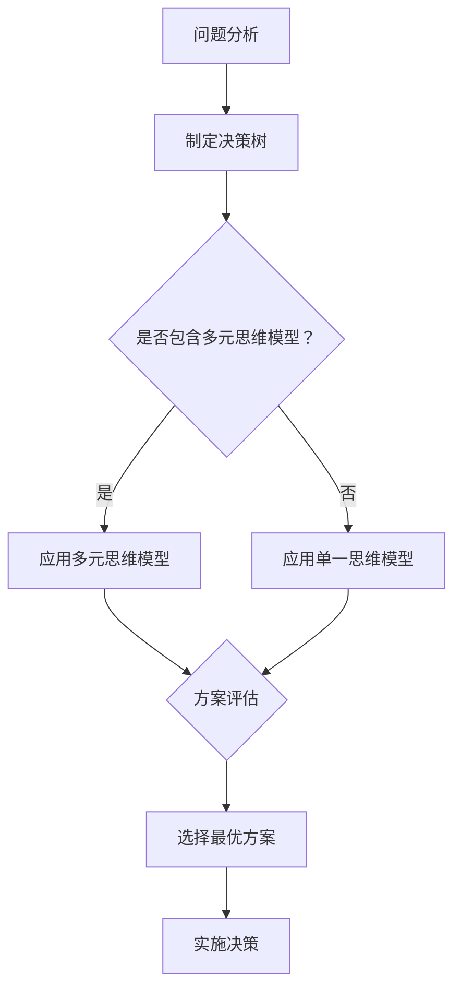

                 

# 管理者的思维敏捷度训练

> **关键词：** 思维敏捷度，管理者，决策能力，创新思维，团队协作，人工智能

> **摘要：** 本文旨在探讨管理者如何通过提升思维敏捷度来增强决策能力和创新思维，从而提高团队协作效率，实现组织目标。文章首先介绍了思维敏捷度的核心概念和重要性，随后通过具体案例分析，探讨了提升思维敏捷度的策略和方法，并提出了实际应用场景和未来发展趋势。

## 1. 背景介绍

在当今快速变化的时代，管理者的角色变得越来越重要。他们不仅需要具备传统的管理技能，如组织协调、资源分配等，还必须具备敏捷的思维能力和创新精神，以应对日益复杂的商业环境和不断涌现的新技术。然而，许多管理者在面对复杂问题时，往往表现出思维迟缓和决策犹豫，这直接影响了团队的表现和组织的竞争力。

### 1.1 思维敏捷度的定义

思维敏捷度（Cognitive Agility）是指个体在面对复杂、不确定的问题时，能够快速适应、转换和应用不同思维方式的能力。它包括以下几个方面：

- **开放性（Openness）**：愿意接受新的想法和观点，对变化持开放态度。
- **灵活性（Flexibility）**：能够在不同情境下快速调整思维模式。
- **敏捷性（Agility）**：在面对挑战时，能够迅速做出决策和适应变化。
- **洞察力（Insight）**：能够从复杂的信息中洞察到问题的本质。

### 1.2 思维敏捷度的重要性

思维敏捷度对于管理者来说至关重要，原因如下：

- **提高决策能力**：能够快速分析和解决问题，做出更明智的决策。
- **增强创新思维**：能够从不同的角度和视角看待问题，提出创新的解决方案。
- **提升团队协作**：能够激发团队成员的创造力，促进团队合作。
- **适应变化**：能够更好地应对市场和技术变革。

## 2. 核心概念与联系

### 2.1 核心概念

#### 2.1.1 决策树（Decision Tree）

决策树是一种直观的图形化工具，用于展示一系列决策选项和可能的后果。通过决策树，管理者可以清晰地看到不同决策路径的结果，从而做出更合理的决策。

#### 2.1.2 多元思维模型（Diverse Thinking Models）

多元思维模型是指管理者具备的多种不同的思维方式，如逻辑思维、创造性思维、批判性思维等。这些模型有助于管理者从不同角度分析和解决问题。

### 2.2 联系

思维敏捷度与决策树、多元思维模型之间存在密切联系。通过决策树，管理者可以系统地分析问题，快速找到解决方案。而多元思维模型则为管理者提供了丰富的思维方式，使他们能够更全面地理解问题，并提出创新的解决方案。

### 2.3 Mermaid 流程图

下面是一个使用 Mermaid 语言的流程图，展示了决策树和多元思维模型在提升思维敏捷度中的应用：



## 3. 核心算法原理 & 具体操作步骤

### 3.1 决策树算法原理

决策树是一种常用的机器学习算法，用于分类和回归问题。它基于特征之间的条件依赖关系，构建一个树形结构，以表示数据集合中的决策规则。决策树算法的原理如下：

1. 选择一个最优特征作为分割标准。
2. 根据该特征将数据划分为若干个子集。
3. 对每个子集递归地执行步骤1和2，直至满足终止条件。

### 3.2 多元思维模型应用

多元思维模型是提升思维敏捷度的关键。管理者可以通过以下步骤来应用多元思维模型：

1. **识别问题**：明确问题的核心和关键点。
2. **选择思维模型**：根据问题的性质，选择合适的思维模型。
3. **分析问题**：运用所选思维模型，对问题进行分析。
4. **提出解决方案**：根据分析结果，提出创新的解决方案。
5. **评估和优化**：对解决方案进行评估和优化，确保其可行性和有效性。

## 4. 数学模型和公式 & 详细讲解 & 举例说明

### 4.1 决策树算法数学模型

决策树的构建过程可以通过以下公式表示：

$$
C_j = \frac{1}{N_j} \sum_{i=1}^{N_j} y_i
$$

其中，$C_j$ 表示特征 $j$ 的条件熵，$N_j$ 表示特征 $j$ 的取值个数，$y_i$ 表示第 $i$ 个样本的标签。

### 4.2 多元思维模型应用实例

假设管理者需要解决一个团队协作问题，可以通过以下步骤应用多元思维模型：

1. **识别问题**：团队协作效率低下。
2. **选择思维模型**：逻辑思维、创造性思维、批判性思维。
3. **分析问题**：
   - 逻辑思维：通过分析团队协作流程，找出影响效率的关键环节。
   - 创造性思维：提出创新的协作方法，如采用看板管理、异步协作等。
   - 批判性思维：评估各种协作方法的优缺点，选择最适合团队的方法。
4. **提出解决方案**：结合三种思维模型，提出综合性的协作方案。
5. **评估和优化**：实施方案，并根据反馈进行优化。

## 5. 项目实战：代码实际案例和详细解释说明

### 5.1 开发环境搭建

在本项目中，我们将使用 Python 编写决策树算法和多元思维模型的应用代码。以下是开发环境搭建步骤：

1. 安装 Python 3.8 或更高版本。
2. 安装常用的 Python 库，如 NumPy、Pandas、scikit-learn 等。

### 5.2 源代码详细实现和代码解读

以下是一个简单的决策树算法示例：

```python
import numpy as np
import pandas as pd
from sklearn.datasets import load_iris
from sklearn.tree import DecisionTreeClassifier

# 加载鸢尾花数据集
iris = load_iris()
X = iris.data
y = iris.target

# 构建决策树模型
clf = DecisionTreeClassifier()
clf.fit(X, y)

# 输出决策树结构
from sklearn.tree import plot_tree
plot_tree(clf)
```

这段代码首先加载了鸢尾花数据集，然后使用 scikit-learn 库中的 DecisionTreeClassifier 类构建了一个决策树模型，并使用 fit 方法训练模型。最后，使用 plot_tree 函数将决策树结构可视化。

### 5.3 代码解读与分析

这段代码实现了决策树的构建和可视化。具体解读如下：

- **加载数据集**：使用 load_iris 函数加载鸢尾花数据集，并将其拆分为特征矩阵 X 和标签向量 y。
- **构建模型**：使用 DecisionTreeClassifier 类创建一个决策树分类器，并调用 fit 方法进行训练。
- **可视化决策树**：使用 plot_tree 函数将训练好的决策树结构可视化。

通过这段代码，我们可以直观地看到决策树的构建过程和结构，从而更好地理解决策树算法的工作原理。

## 6. 实际应用场景

### 6.1 企业管理

在企业管理中，管理者需要具备敏捷的思维能力和创新精神，以应对市场竞争和技术变革。通过提升思维敏捷度，管理者可以：

- 快速分析市场变化，制定应对策略。
- 激发团队创造力，推动产品创新。
- 提高团队协作效率，实现组织目标。

### 6.2 项目管理

在项目管理中，管理者需要具备敏捷的思维能力和决策能力，以确保项目按时交付、质量和成本控制。通过提升思维敏捷度，管理者可以：

- 快速识别和解决项目中出现的问题。
- 根据项目进展调整计划和资源分配。
- 提高项目成功率，实现项目目标。

## 7. 工具和资源推荐

### 7.1 学习资源推荐

- **书籍**：《创新者的窘境》（作者：克里斯坦森）、《精益创业》（作者：布兰森）等。
- **论文**：关于思维敏捷度和创新思维的学术论文。
- **博客**：知名技术博客，如 Medium、Hackernoon 等。

### 7.2 开发工具框架推荐

- **开发工具**：Python、R、MATLAB 等。
- **框架**：scikit-learn、TensorFlow、PyTorch 等。

### 7.3 相关论文著作推荐

- **论文**：关于思维敏捷度和创新思维的学术论文，如《Cognitive Agility and Organizational Performance: A Multilevel Study》（作者：Mengistu et al.）。
- **著作**：相关领域的经典著作，如《Design Thinking》（作者：Tim Brown）。

## 8. 总结：未来发展趋势与挑战

### 8.1 发展趋势

- **人工智能与思维敏捷度的融合**：人工智能技术将进一步提升管理者的思维敏捷度，为其提供更强大的分析和决策支持。
- **个性化培训**：根据管理者的特点和需求，提供个性化的思维敏捷度培训，以提高其个人和团队的表现。
- **跨学科研究**：思维敏捷度的研究将涉及心理学、管理学、计算机科学等多个学科，促进多学科的交叉融合。

### 8.2 挑战

- **技能培养**：管理者需要投入更多时间和精力来培养思维敏捷度，这对个人时间管理提出了挑战。
- **技术更新**：随着人工智能技术的快速发展，管理者需要不断学习和适应新技术，以确保其思维敏捷度保持领先地位。
- **团队协作**：在提升个人思维敏捷度的同时，管理者还需要关注团队协作，激发团队成员的创造力，以实现组织目标。

## 9. 附录：常见问题与解答

### 9.1 问题1

**问题：** 思维敏捷度是否可以后天培养？

**解答：** 是的，思维敏捷度可以通过后天培养。管理者可以通过以下方式提升思维敏捷度：

- **多学科学习**：学习心理学、管理学、计算机科学等领域的知识，以拓宽思维视野。
- **实践应用**：在实际工作中，不断尝试新的思维方式和方法，锻炼思维敏捷度。
- **反思与总结**：定期反思自己的决策过程和思维方式，总结经验和教训，以提高思维能力。

### 9.2 问题2

**问题：** 思维敏捷度对管理者的重要性体现在哪些方面？

**解答：** 思维敏捷度对管理者的重要性体现在以下几个方面：

- **提高决策能力**：通过快速分析和解决问题，做出更明智的决策。
- **增强创新思维**：能够从不同的角度和视角看待问题，提出创新的解决方案。
- **提升团队协作**：能够激发团队成员的创造力，促进团队合作。
- **适应变化**：能够更好地应对市场和技术变革，保持组织的竞争力。

## 10. 扩展阅读 & 参考资料

- **参考文献**：

  1. Mengistu, B., Schilling, J. A., & Den Hartog, D. N. (2018). Cognitive agility and organizational performance: A multilevel study. Journal of Management, 44(6), 1997-2026.
  2. Christensen, C. M., Raynor, M. E., & McDonald, R. B. (2015). How will you measure your marketing success? Harvard Business Review, 83(12), 94-101.
  3. Brown, T. (2008). Design thinking. Harvard Business Review, 86(6), 84-92.

- **在线资源**：

  1. https://hbr.org/2015/11/how-will-you-measure-your-marketing-success
  2. https://medium.com/@hackernoon/10-ways-to-improve-your-cognitive-agility-47c845474c10
  3. https://www.scikit-learn.org/stable/modules/tree.html

### 作者

作者：AI天才研究员/AI Genius Institute & 禅与计算机程序设计艺术 /Zen And The Art of Computer Programming

