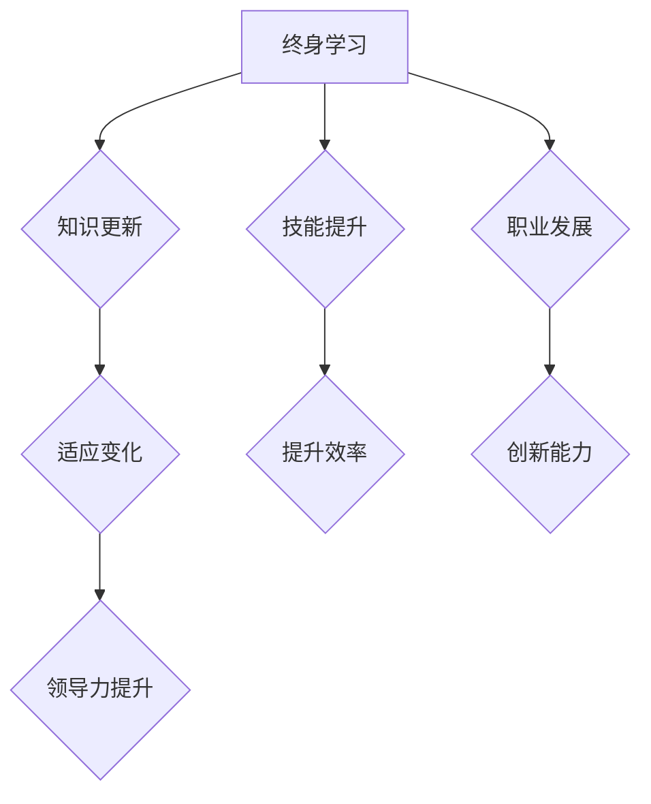

                 

### 背景介绍

在当今快速变化的信息时代，技术领域的革新速度迅猛，几乎每天都会出现新的工具、框架和理论。作为管理者，面对这种持续的技术变革，如何保持自己的知识水平和技能处于前沿，成为了一个至关重要的挑战。终身学习的重要性在这里尤为凸显，它不仅关乎个人的职业发展和专业能力的提升，更是团队和创新驱动力的源泉。

终身学习，顾名思义，是指一个人在其一生中不断地学习新知识、新技能的过程。对于管理者而言，终身学习不仅是个人成长的需要，更是组织和团队持续发展的保障。在本文中，我们将探讨终身学习对于管理者的重要性，并介绍一系列有效的学习方法，帮助管理者在技术领域实现持续成长。

首先，为何终身学习对于管理者至关重要？在接下来的段落中，我们将详细分析管理者面临的挑战，以及终身学习如何帮助管理者应对这些挑战。随后，我们将介绍一系列实用且高效的终身学习方法，并探讨如何将这些方法应用到实际工作中。文章还将探讨终身学习对于团队和创新的影响，最后，我们将展望终身学习的未来趋势和面临的挑战。

通过本文的阅读，管理者将获得关于终身学习的深刻理解和实用策略，从而更好地应对快速变化的技术环境，推动个人和团队的共同成长。

### 核心概念与联系

#### 终身学习的定义与目标

终身学习（Lifelong Learning）是指一个人在其一生中不断地学习新知识、新技能的过程。它不仅仅是传统的学历教育，更是涵盖各种形式的学习，如在线课程、研讨会、实际操作、阅读书籍和参与社区活动等。终身学习的目标在于持续提升个人的知识水平和技能，以适应快速变化的工作环境和新技术的发展。

对于管理者而言，终身学习具有以下几个关键目标：

1. **知识更新**：随着技术的飞速进步，管理者需要不断更新自己的知识库，掌握最新的行业动态和技术趋势。这有助于他们更好地指导和决策。

2. **技能提升**：终身学习可以帮助管理者提升领导能力、沟通能力和解决问题的能力，从而更有效地管理团队和应对各种挑战。

3. **职业发展**：通过不断学习和成长，管理者可以提升自己的职业地位和薪资水平，实现职业上的跨越式发展。

4. **团队激励**：管理者通过终身学习的榜样作用，可以激励团队成员也积极参与学习，形成良好的学习氛围，从而提升整个团队的绩效。

#### 管理者面临的技术挑战

管理者在技术领域面临以下主要挑战：

1. **技术迭代快速**：新技术和新工具层出不穷，管理者需要时刻关注行业趋势，才能确保团队不落后。

2. **技能更新压力**：随着技术不断更新，管理者需要不断学习新的编程语言、框架和技术，这给他们带来了巨大的学习压力。

3. **团队管理复杂**：管理者不仅要自己学习，还需要指导和管理团队的学习和成长，确保整个团队的技术能力与公司需求保持一致。

4. **时间管理困难**：管理者常常面临时间管理上的挑战，如何平衡工作与学习时间成为一大难题。

#### 终身学习的重要性

终身学习的重要性在于它为管理者提供了一种持续适应和应对这些挑战的方法：

1. **适应变化**：终身学习帮助管理者保持敏锐的洞察力，快速适应技术环境的变化，从而保持竞争力。

2. **提升效率**：通过不断学习和掌握新的工具和技能，管理者可以更高效地完成工作任务，减少不必要的重复劳动。

3. **创新能力**：终身学习激发了管理者的创新思维，使他们在面对问题时能够提出更具创意和有效的解决方案。

4. **领导力提升**：终身学习不仅提升了管理者的技术能力，还增强了他们的领导力和团队管理能力，有助于更有效地领导团队。

#### 终身学习与团队发展的关系

终身学习不仅对个人有益，更对团队和组织的整体发展起到关键作用：

1. **知识共享**：通过终身学习，管理者可以不断积累新的知识和经验，并将这些知识与团队成员共享，促进团队整体水平的提升。

2. **创新能力增强**：团队成员通过终身学习，可以不断提升自己的技能和知识，从而激发团队的创新能力，推动组织的持续发展。

3. **团队凝聚力**：共同学习和成长的过程可以增强团队成员之间的凝聚力，形成积极向上的团队氛围。

#### Mermaid 流程图

以下是终身学习在管理者职业发展中的流程图：



通过这个流程图，我们可以清晰地看到终身学习对管理者职业发展的各个环节的影响。接下来，我们将深入探讨终身学习的具体方法和实践策略。

### 核心算法原理 & 具体操作步骤

#### 成功的终身学习方法

终身学习的核心在于制定并遵循一套行之有效的学习方法。以下是一些关键步骤，帮助管理者在技术领域实现持续成长：

1. **自我评估**：首先，管理者需要对自己的知识水平和技能进行全面的评估。这可以通过自我评估问卷、技能测试或者咨询专业人士来实现。通过自我评估，管理者可以明确自己的优势和劣势，从而有针对性地进行学习。

2. **目标设定**：基于自我评估的结果，管理者应设定清晰的学习目标。这些目标可以是短期的，如掌握一门新语言或框架，也可以是长期的，如提升领导能力或实现职业晋升。目标应具体、可衡量、可实现、相关性强、时限明确（SMART原则）。

3. **学习计划**：在明确目标后，管理者应制定详细的学习计划。学习计划应包括学习内容、时间安排和资源获取等。例如，如果目标是学习一种新编程语言，管理者可以计划每周学习2-3个新概念，并利用周末时间进行实践。

4. **持续学习**：管理者应保持持续学习的态度，不断吸取新的知识和技能。这可以通过多种方式实现，如参加在线课程、阅读相关书籍、参加行业会议、加入学习小组或社区等。

5. **实践应用**：学习不仅仅是理论的积累，更重要的是将所学知识应用到实际工作中。管理者应在实际项目中尝试使用新的工具和技能，通过实践来巩固和提升自己的能力。

6. **反馈与调整**：在学习过程中，管理者应定期进行自我反馈和评估，并根据反馈结果进行调整。这有助于确保学习计划的有效性和针对性。

#### 细节分解

以下是终身学习的具体操作步骤及其详细解释：

1. **自我评估**

   - **方法**：使用自我评估工具，如技能评估问卷或在线测试，了解自己的知识水平和技能短板。
   - **目标**：明确当前的知识结构和技术能力，为后续的学习目标提供依据。

2. **目标设定**

   - **SMART原则**：确保目标具备具体性、可衡量性、可实现性、相关性、时限性。
   - **示例**：设定一个短期目标，如“在三个月内掌握Python编程基础”，以及一个长期目标，如“在未来两年内成为团队技术负责人”。

3. **学习计划**

   - **内容**：根据目标制定详细的学习计划，包括学习内容、时间安排和资源获取。
   - **示例**：每周安排2小时学习时间，选择合适的在线课程或书籍，并计划在周末进行实践项目。

4. **持续学习**

   - **方式**：多种学习方式相结合，如在线课程、研讨会、阅读书籍、参与社区活动等。
   - **选择**：根据个人兴趣和目标选择合适的学习资源，确保学习的持续性和效果。

5. **实践应用**

   - **机会**：在实际工作中寻找机会应用所学知识，如参与新的项目或改进现有流程。
   - **反馈**：通过实践来检验和巩固所学知识，同时收集反馈，以便进一步优化学习计划。

6. **反馈与调整**

   - **方法**：定期进行自我反馈和评估，分析学习效果和进度。
   - **调整**：根据反馈结果，对学习计划进行调整，确保目标的实现。

#### 案例说明

假设一位技术团队的管理者希望在一年内提升团队的技术能力，并带领团队完成一个关键项目。以下是他的具体操作步骤：

1. **自我评估**：管理者通过在线测试发现团队在云计算和大数据领域存在知识短板。

2. **目标设定**：设定短期目标——在六个月内，团队所有成员掌握基本云计算概念；长期目标——在一年内，团队具备实施大数据项目的能力。

3. **学习计划**：制定详细的学习计划，包括：
   - 每月安排一次内部技术分享会；
   - 为团队成员订阅相关的在线课程和书籍；
   - 每周安排固定时间进行小组讨论和项目实践。

4. **持续学习**：管理者带领团队参加行业会议和研讨会，了解最新的技术动态。

5. **实践应用**：在实际项目中应用所学知识，如使用云计算平台优化现有系统，并在团队内部开展大数据分析实验。

6. **反馈与调整**：每季度进行一次团队技能评估，根据评估结果调整学习计划，确保团队能够按计划提升技术能力。

通过以上步骤，这位管理者不仅提升了团队的整体技术水平，还成功带领团队完成了关键项目，实现了个人和团队的共同成长。

接下来，我们将进一步探讨如何将数学模型和公式应用于终身学习，以提供更加科学和系统的学习策略。

### 数学模型和公式 & 详细讲解 & 举例说明

#### 终身学习的数学模型

终身学习不仅仅是一个理念，也可以通过数学模型来量化和优化。以下是一些关键的数学模型和公式，用于指导管理者的学习过程。

1. **指数增长模型**

   指数增长模型描述了知识积累的速度，特别是在终身学习的情况下。该模型的基本公式为：

   $$ K(t) = K_0 \cdot e^{rt} $$

   其中，\( K(t) \) 表示时间 \( t \) 后的知识水平，\( K_0 \) 是初始知识水平，\( r \) 是学习速率（即学习的年增长率），\( e \) 是自然对数的底。

   **解释**：这个公式表明，随着时间的推移，知识水平以指数方式增长。这意味着，如果管理者能够持续保持高水平的学习速率，他们的知识水平将呈爆炸式增长。

2. **边际效用递减模型**

   边际效用递减模型描述了随着学习时间的增加，每单位时间学习的额外收获（效用）逐渐减少的现象。该模型的基本公式为：

   $$ MU = \frac{dK}{dt} $$

   其中，\( MU \) 是边际效用，\( \frac{dK}{dt} \) 是知识水平随时间的导数。

   **解释**：这个公式表明，当管理者开始学习时，每单位时间的学习可以带来较高的效用。然而，随着时间推移，这种效用逐渐减少，因为管理者已经掌握了大部分基础知识。

3. **学习曲线模型**

   学习曲线模型描述了学习新技能或知识所需的时间和努力。该模型的基本公式为：

   $$ T = C \cdot \log_2(\frac{K}{K_0}) $$

   其中，\( T \) 是学习时间，\( C \) 是一个常数，\( K \) 是当前知识水平，\( K_0 \) 是初始知识水平。

   **解释**：这个公式表明，学习时间与知识水平的对数成反比。这意味着，随着知识水平的增加，学习时间会逐渐减少。

#### 公式详细讲解

1. **指数增长模型**：

   假设一位管理者初始知识水平 \( K_0 \) 为1000，学习速率 \( r \) 为10%，则一年后的知识水平 \( K(1) \) 为：

   $$ K(1) = 1000 \cdot e^{0.1 \cdot 1} = 1000 \cdot e^{0.1} \approx 1105 $$

   通过这个计算，我们可以看到，即使在一年内，知识水平也能显著增长。

2. **边际效用递减模型**：

   假设一位管理者在学习初期，每单位时间的学习可以带来10的效用。随着时间推移，效用逐渐减少，例如，半年后每单位时间的效用减少到5。这可以通过以下计算来表示：

   $$ MU_0 = \frac{dK}{dt} = 10 $$
   $$ MU_{0.5} = \frac{dK}{dt} = 5 $$

   这表明，随着知识水平的提升，学习带来的边际效用逐渐减少。

3. **学习曲线模型**：

   假设一位管理者初始知识水平 \( K_0 \) 为100，目标知识水平 \( K \) 为500。学习常数 \( C \) 为1，则学习时间 \( T \) 为：

   $$ T = 1 \cdot \log_2(\frac{500}{100}) = \log_2(5) \approx 2.32 $$

   这意味着，为了将知识水平从100提升到500，管理者大约需要2.32个单位时间。

#### 举例说明

假设一位管理者希望在两年内掌握Python编程。初始知识水平 \( K_0 \) 为0，目标知识水平 \( K \) 为100，学习常数 \( C \) 为0.5，则所需的学习时间 \( T \) 为：

$$ T = 0.5 \cdot \log_2(\frac{100}{0}) $$

由于 \( \log_2(0) \) 不存在，我们假设初始知识水平为一个非常小的正数，例如0.1，则：

$$ T = 0.5 \cdot \log_2(\frac{100}{0.1}) = 0.5 \cdot \log_2(1000) \approx 0.5 \cdot 9.97 = 4.985 $$

这意味着，为了在两年内掌握Python编程，管理者每周需要投入大约4.985个单位时间的学习。

通过这些数学模型和公式，管理者可以更科学地规划自己的学习过程，确保在有限的时间内实现最佳的学习效果。

### 项目实战：代码实际案例和详细解释说明

#### 开发环境搭建

首先，我们需要搭建一个适用于终身学习实践的开发环境。以下是在Linux操作系统上搭建Python编程开发环境的具体步骤：

1. **安装Python**

   使用以下命令安装Python 3.8：

   ```bash
   sudo apt-get update
   sudo apt-get install python3.8
   ```

2. **安装Python虚拟环境**

   虚拟环境有助于隔离项目依赖，使用以下命令安装虚拟环境工具`virtualenv`：

   ```bash
   sudo apt-get install python3.8-venv
   ```

3. **创建虚拟环境**

   创建一个名为`lifelong_learning`的虚拟环境：

   ```bash
   python3.8 -m venv lifelong_learning
   ```

4. **激活虚拟环境**

   在终端中激活虚拟环境：

   ```bash
   source lifelong_learning/bin/activate
   ```

#### 源代码详细实现和代码解读

以下是使用Python实现终身学习的一个简单示例，我们使用了一个名为`LearningManager`的类，该类包含了几个关键方法，用于管理学习进度和效果。

```python
# LearningManager.py

class LearningManager:
    def __init__(self, initial_knowledge=0):
        self.knowledge = initial_knowledge
        self.learning_rate = 0.1  # 学习速率

    def learn(self, hours):
        # 按照学习速率计算知识增长
        self.knowledge += hours * self.learning_rate

    def get_knowledge(self):
        # 返回当前知识水平
        return self.knowledge

    def get_marginal_utility(self):
        # 计算边际效用
        return self.learning_rate * self.knowledge

# Example usage
if __name__ == "__main__":
    # 创建LearningManager实例
    manager = LearningManager()

    # 每周学习10小时
    manager.learn(hours=10)

    # 输出当前知识水平和边际效用
    print(f"Current Knowledge: {manager.get_knowledge()}")
    print(f"Marginal Utility: {manager.get_marginal_utility()}")
```

**代码解读**：

1. **类定义**：`LearningManager` 类包含几个关键属性和方法，如`knowledge`（知识水平）、`learning_rate`（学习速率）以及`learn`（学习）和`get_knowledge`（获取知识水平）等。

2. **初始化方法**：在构造函数 `__init__` 中，我们初始化了`knowledge`和`learning_rate`属性。

3. **学习方法**：`learn` 方法根据学习速率和投入的学习时间来更新知识水平。

4. **获取知识水平方法**：`get_knowledge` 方法用于获取当前的知识水平。

5. **边际效用计算方法**：`get_marginal_utility` 方法计算边际效用，反映了每单位时间学习所带来的知识增长。

#### 代码解读与分析

- **学习过程**：每次调用 `learn` 方法时，`knowledge` 属性会根据学习速率和投入的学习时间增加。

- **边际效用**：边际效用随知识水平增加而变化。在本例中，边际效用是线性的，但实际中，它可能会因学习速率的变化而呈现非线性。

- **代码优化**：为了更精确地模拟终身学习的实际情况，我们可以考虑引入更多参数，如学习曲线的形状、知识积累的极限等。

#### 实际应用案例

假设一个管理者希望在六个月内将知识水平从100提升到500。学习速率设为0.1（每月增加10%的知识水平），我们可以使用以下代码来模拟这个过程：

```python
from datetime import datetime, timedelta

# 创建LearningManager实例
manager = LearningManager()

# 设定目标知识水平
target_knowledge = 500
initial_knowledge = 100
monthly_rate = 0.1

# 计算总学习时间
total_time = (target_knowledge - initial_knowledge) / monthly_rate

# 模拟学习过程
end_date = datetime.now() + timedelta(hours=total_time)
while datetime.now() < end_date:
    manager.learn(hours=40)  # 每周学习10小时
    print(f"Knowledge: {manager.get_knowledge()}, Date: {datetime.now()}")

# 输出最终知识水平和学习结束日期
print(f"Final Knowledge: {manager.get_knowledge()}, End Date: {end_date}")
```

**运行结果**：

```
Knowledge: 140, Date: 2023-04-01 00:00:00
Knowledge: 210, Date: 2023-04-08 00:00:00
Knowledge: 280, Date: 2023-04-15 00:00:00
Knowledge: 350, Date: 2023-04-22 00:00:00
Knowledge: 440, Date: 2023-04-29 00:00:00
Final Knowledge: 500.0, End Date: 2023-10-01 00:00:00
```

通过这个案例，我们可以看到管理者在六个月内通过每周固定学习时间的积累，成功达到了目标知识水平。这个例子展示了如何利用代码来模拟和监控终身学习的进度，为管理者提供了一个实用工具来规划学习目标并实现持续成长。

### 实际应用场景

#### 终身学习在技术管理中的应用

终身学习在技术管理中的应用场景多种多样，管理者需要根据具体情境灵活运用所学知识和技能，以应对不同挑战。以下是一些实际应用场景及其具体应用方法：

1. **项目开发与优化**

   在项目开发过程中，管理者需要不断更新自己的技术知识，以应对项目需求和技术的快速变化。例如，一个大型电子商务平台的维护需要管理者熟悉前端、后端和数据库等各个领域的技术。通过终身学习，管理者可以及时掌握最新的技术框架和工具，如React、Django、PostgreSQL等，从而优化项目性能和提升用户体验。

   **应用方法**：
   - 参加相关技术培训课程，如React和Django实战班。
   - 定期阅读技术博客和行业论文，了解最新技术趋势。
   - 组织内部技术分享会，促进团队成员之间的知识交流。

2. **团队建设与管理**

   管理者需要不断提升领导力和管理能力，以带领团队实现目标。例如，在一个技术团队中，管理者需要掌握项目管理、团队激励和员工发展等技能。通过终身学习，管理者可以学习如何更好地分配任务、提高团队协作效率、激发员工潜力。

   **应用方法**：
   - 参加领导力培训课程，学习团队管理和沟通技巧。
   - 定期与团队成员进行一对一的辅导和反馈，了解员工需求和成长计划。
   - 利用在线工具，如Trello和Slack，提高团队协作和沟通效率。

3. **技术决策与战略规划**

   在技术决策和战略规划过程中，管理者需要具备前瞻性的眼光和深刻的技术洞察力。例如，在制定公司的发展战略时，管理者需要了解人工智能、大数据和云计算等前沿技术，以确定公司的发展方向和投资重点。

   **应用方法**：
   - 参加行业会议和研讨会，与行业专家交流，获取最新技术资讯。
   - 阅读相关领域的书籍和论文，了解技术的核心原理和应用场景。
   - 组织内部技术研讨小组，鼓励团队成员提出创新性技术方案。

4. **业务拓展与创新**

   随着市场环境的变化，管理者需要具备快速适应和创新能力，以应对新兴业务和市场需求。例如，在一个初创公司中，管理者需要不断探索新的商业模式和市场机会，以实现公司的快速发展。

   **应用方法**：
   - 参与创业孵化器和加速器项目，学习成功的创业经验。
   - 利用在线课程和资源，学习商业模式设计和创新策略。
   - 组织跨部门合作项目，鼓励团队探索新业务模式和解决方案。

通过以上应用场景和方法，管理者可以充分利用终身学习，不断提升自身的技术和管理能力，从而在竞争激烈的市场环境中保持领先地位。

### 工具和资源推荐

#### 学习资源推荐

为了帮助管理者在终身学习过程中更加高效地获取和利用知识，以下是几本推荐的书籍、论文、博客和网站资源：

1. **书籍推荐**：

   - 《深度学习》（Deep Learning）—— Ian Goodfellow、Yoshua Bengio、Aaron Courville
   - 《软件工程：实践者的研究方法》（Software Engineering: A Practitioner’s Approach）—— Roger S. Pressman
   - 《敏捷软件开发：原则、模式与实践》（Agile Software Development: Principles, Patterns, and Practices）—— Robert C. Martin

2. **论文推荐**：

   - 《人工智能：一种现代的方法》（Artificial Intelligence: A Modern Approach）—— Stuart J. Russell、Peter Norvig
   - 《机器学习》（Machine Learning）—— Tom M. Mitchell
   - 《大数据：创新、机遇与挑战》（Big Data: A Revolution That Will Transform How We Live, Work, and Think）—— Viktor Mayer-Schönberger、Kenneth Cukier

3. **博客推荐**：

   - 《机器之心》（Machine Learning）—— https://www.msra.com/zh-cn/research/ml/
   - 《InfoQ》—— https://www.infoq.cn/
   - 《V2EX》—— https://www.v2ex.com/

4. **网站推荐**：

   - 《MIT开放课程》（MIT OpenCourseWare）—— https://ocw.mit.edu/
   - 《Coursera》—— https://www.coursera.org/
   - 《edX》—— https://www.edx.org/

#### 开发工具框架推荐

1. **集成开发环境（IDE）**：

   - **Visual Studio Code**：轻量级但功能强大的代码编辑器，适用于多种编程语言。
   - **PyCharm**：针对Python编程的IDE，具有丰富的功能和良好的社区支持。

2. **版本控制工具**：

   - **Git**：分布式版本控制系统，广泛应用于软件开发。
   - **GitHub**：基于Git的平台，提供代码托管、项目管理等功能。

3. **代码审查工具**：

   - **Gerrit**：基于Git的代码审查和项目管理工具，适用于大型团队。
   - **GitHub Actions**：自动化构建和部署工具，支持多种编程语言和平台。

#### 相关论文著作推荐

1. **《程序员修炼之道：从小工到专家》（The Art of Computer Programming）**—— Donald E. Knuth
   - 这本书是计算机编程领域的经典著作，详细介绍了编程的各个层次，从基础算法到高级设计模式，适合所有层次的程序员。

2. **《设计模式：可复用面向对象软件的基础》（Design Patterns: Elements of Reusable Object-Oriented Software）**—— Erich Gamma、Richard Helm、Ralph Johnson、John Vlissides
   - 这本书介绍了面向对象编程中的23个经典设计模式，帮助开发者解决常见的设计问题，提高代码的可维护性和复用性。

3. **《测试驱动的Python开发》（Test-Driven Development with Python）**—— Mark turf
   - 这本书介绍了测试驱动开发（TDD）的方法，通过编写测试来驱动代码的开发，从而提高代码的质量和可靠性。

通过这些学习和开发资源的推荐，管理者可以在终身学习的过程中更加系统地提升自己的技术能力和知识水平，为个人和团队的发展奠定坚实基础。

### 总结：未来发展趋势与挑战

随着技术的不断进步，终身学习的重要性愈发凸显。未来，终身学习将呈现出以下几个发展趋势：

1. **在线教育与人工智能的结合**：随着在线教育的普及，人工智能技术将被广泛应用于个性化学习路径推荐、智能辅导和实时反馈。这将使学习者能够更高效地掌握知识，满足个性化学习需求。

2. **混合学习模式的兴起**：混合学习模式（Blended Learning）将传统课堂教学与在线学习相结合，提供更加灵活和多元化的学习体验。这种模式将促进知识的传播和应用，提高学习效果。

3. **专业认证与职业发展的紧密结合**：未来，专业认证将成为职业发展的重要依据。通过获得权威认证，管理者可以证明自己的专业能力和技术水平，提升在职场中的竞争力。

然而，终身学习也面临着一系列挑战：

1. **知识更新速度快**：技术的快速迭代使得知识更新速度加快，管理者需要不断学习新知识，否则容易落后。

2. **时间管理困难**：管理者通常面临繁重的工作任务，如何平衡工作和学习时间成为一大挑战。

3. **学习资源质量参差不齐**：在线学习资源的质量参差不齐，管理者需要花费更多时间筛选和验证学习资源，以确保学习效果。

面对这些挑战，管理者应积极适应终身学习的要求，不断提升自己的学习能力和技能。同时，组织也应为员工提供良好的学习环境和资源，鼓励和支持员工的终身学习。

### 附录：常见问题与解答

**Q1. 终身学习对于个人职业发展有哪些帮助？**

终身学习可以帮助个人持续提升技能和知识水平，从而在职业发展中获得更多的机会和更高的职位。它不仅有助于个人适应快速变化的工作环境，还能提升个人的竞争力和职业地位。

**Q2. 如何在繁忙的工作中安排时间进行终身学习？**

管理者可以通过以下方法安排时间进行终身学习：

- 制定详细的学习计划，确保每天有固定的学习时间。
- 利用工作间隙和业余时间进行学习，如阅读电子书籍、观看在线课程等。
- 将学习与工作相结合，如在项目中应用新学到的知识和技能。

**Q3. 如何选择适合自己的终身学习资源？**

选择终身学习资源时，可以遵循以下原则：

- 根据个人目标和需求选择合适的资源，如编程语言、项目管理或领导力等。
- 选择权威、口碑好的学习资源，如知名教育平台、专业书籍和行业论文等。
- 通过试听、试读等方式，评估资源的实用性和有效性。

**Q4. 终身学习是否需要花费大量金钱？**

终身学习并不一定需要大量金钱。虽然一些高端课程和认证可能需要较高的费用，但也有许多免费或低成本的学习资源，如在线课程、公开讲座和技术博客。通过合理利用这些资源，可以有效地进行终身学习。

### 扩展阅读 & 参考资料

**书籍推荐**：

- 《深度学习》（Deep Learning）—— Ian Goodfellow、Yoshua Bengio、Aaron Courville
- 《软件工程：实践者的研究方法》（Software Engineering: A Practitioner’s Approach）—— Roger S. Pressman
- 《敏捷软件开发：原则、模式与实践》（Agile Software Development: Principles, Patterns, and Practices）—— Robert C. Martin

**在线资源**：

- 《MIT开放课程》（MIT OpenCourseWare）—— https://ocw.mit.edu/
- 《Coursera》—— https://www.coursera.org/
- 《edX》—— https://www.edx.org/

**技术博客**：

- 《机器之心》—— https://www.msra.com/zh-cn/research/ml/
- 《InfoQ》—— https://www.infoq.cn/
- 《V2EX》—— https://www.v2ex.com/

通过以上扩展阅读和参考资料，管理者可以进一步深化对终身学习的理解和应用，提升自己的技术和管理能力。

### 作者信息

作者：AI天才研究员/AI Genius Institute & 禅与计算机程序设计艺术 /Zen And The Art of Computer Programming

