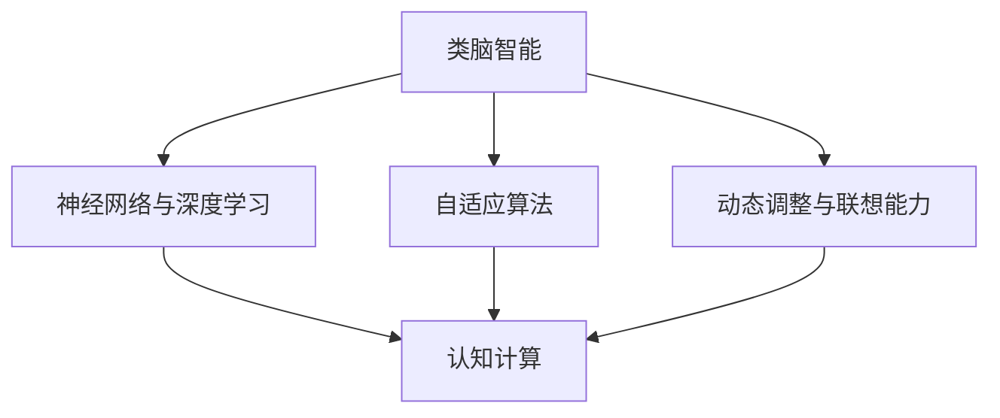

                 

## 1. 背景介绍

类脑智能与认知计算作为人工智能领域的前沿研究方向，近年来受到了广泛关注。这一领域旨在模拟人脑的信息处理机制，以实现更加智能化、自适应的计算机系统。随着深度学习、神经网络等技术的快速发展，类脑智能和认知计算的理论和技术逐渐成熟，为人工智能的发展提供了新的思路。

本文将围绕类脑智能与认知计算的核心概念、原理及实际应用进行探讨。首先，我们将介绍类脑智能和认知计算的基本概念，分析其与传统人工智能的区别。接着，我们将深入探讨类脑智能与认知计算的理论基础，包括神经网络、大脑连接主义等。然后，我们将通过实际案例，展示类脑智能和认知计算在现实中的应用，并结合相关技术，讲解如何实现这些应用。最后，我们将总结类脑智能与认知计算的未来发展趋势与挑战，为读者提供一些建议和思考方向。

通过本文的阅读，读者将了解类脑智能与认知计算的基本概念、原理和应用，对这一前沿领域有一个全面的认识。同时，本文也旨在为研究人员和开发者提供一定的参考和启示，助力他们在类脑智能与认知计算领域取得突破性成果。## 2. 核心概念与联系

### 2.1 类脑智能

类脑智能（Brain-like Intelligence）是指通过模仿人脑的结构和功能，实现智能化的计算机系统。类脑智能的核心思想在于模拟人脑的神经元网络，以实现高效、自适应、动态变化的信息处理能力。人脑具有强大的学习能力、自适应能力和联想能力，这使得人类在解决复杂问题时具有独特的优势。类脑智能旨在将这种优势转化为计算机系统，从而提高人工智能系统的智能水平。

#### 类脑智能的主要特点：

1. **自适应性**：类脑智能系统可以自动调整自身结构和参数，以适应不同的环境和任务。
2. **高效性**：类脑智能系统具有高效的信息处理能力，可以快速学习并解决问题。
3. **动态性**：类脑智能系统可以实时调整自身状态，以应对不断变化的环境和需求。
4. **联想能力**：类脑智能系统可以通过神经网络中的关联关系，实现跨领域的知识联想和应用。

### 2.2 认知计算

认知计算（Cognitive Computing）是指通过模拟人类思维过程，实现智能化的计算机系统。认知计算的核心目标是让计算机具备类似人类认知能力，如理解、推理、决策、学习等。认知计算强调计算机系统在处理信息时，不仅要关注事实和规则，还要关注上下文、情感和直觉等因素。

#### 认知计算的主要特点：

1. **理解性**：认知计算系统可以理解人类语言、情感和意图，实现自然交互。
2. **推理能力**：认知计算系统可以通过逻辑推理和演绎，解决复杂问题。
3. **学习能力**：认知计算系统可以自动学习并优化自身性能，以适应不同的任务和场景。
4. **情感智能**：认知计算系统可以识别和模拟人类情感，实现情感化的交互。

### 2.3 类脑智能与认知计算的联系

类脑智能与认知计算在目标和方法上存在一定的交集，二者相互促进、共同发展。具体来说，类脑智能为认知计算提供了实现智能化的技术基础，而认知计算则为类脑智能提供了更加丰富和复杂的任务场景。以下为类脑智能与认知计算的联系：

1. **理论基础**：类脑智能与认知计算都基于人脑的工作原理，强调模拟人脑的神经元网络和思维过程。
2. **算法方法**：类脑智能和认知计算都采用神经网络、深度学习等技术，以实现高效的信息处理和智能决策。
3. **应用领域**：类脑智能和认知计算在许多领域都有广泛的应用，如自然语言处理、计算机视觉、智能诊断、智能助手等。
4. **跨学科融合**：类脑智能与认知计算需要跨学科的知识体系，涉及计算机科学、神经科学、认知科学等多个领域。

### 2.4 Mermaid 流程图

为了更好地理解类脑智能与认知计算的联系，我们使用Mermaid流程图（Mermaid Diagram）来展示二者之间的主要环节和关系。以下是流程图的描述：



在上述流程图中，类脑智能通过神经网络与深度学习、自适应算法、动态调整与联想能力等技术实现智能化，进而与认知计算产生联系。通过这种联系，类脑智能和认知计算共同推动了人工智能的发展。## 3. 核心算法原理 & 具体操作步骤

### 3.1 神经网络与深度学习

类脑智能与认知计算的核心算法之一是神经网络（Neural Networks）和深度学习（Deep Learning）。神经网络是一种模拟人脑神经元连接结构的计算模型，而深度学习则是基于多层神经网络的一种学习算法。

#### 3.1.1 神经网络的基本结构

神经网络由多个层次组成，包括输入层、隐藏层和输出层。每个层次包含多个神经元，神经元之间通过权重（weights）连接，形成一个复杂的网络结构。神经元的激活函数（activation function）用于对输入信号进行处理和传递。

1. **输入层**：接收外部输入信号，并将其传递给隐藏层。
2. **隐藏层**：对输入信号进行处理，提取特征信息，并将其传递给下一层。
3. **输出层**：对隐藏层传递的信息进行处理，生成最终输出。

#### 3.1.2 深度学习的基本原理

深度学习是神经网络的一种扩展，通过增加网络层数，实现更复杂的特征提取和表示能力。深度学习的基本原理包括：

1. **反向传播算法**：深度学习使用反向传播算法（Backpropagation）来更新网络权重，使网络能够学习输入和输出之间的映射关系。
2. **梯度下降**：反向传播算法中，梯度下降（Gradient Descent）用于计算网络权重的更新方向和步长。
3. **激活函数**：深度学习网络中，激活函数（如ReLU、Sigmoid、Tanh等）用于引入非线性因素，提高网络的表达能力。

### 3.2 自适应算法

自适应算法（Adaptive Algorithms）是类脑智能与认知计算中的重要技术之一。自适应算法能够根据环境和任务的变化，自动调整网络结构和参数，以提高系统的适应能力和性能。

#### 3.2.1 自适应算法的基本原理

自适应算法的核心思想是利用反馈机制，根据系统的输出误差，动态调整网络结构和参数。自适应算法通常包括以下几个步骤：

1. **误差计算**：根据系统的实际输出和期望输出，计算输出误差。
2. **参数更新**：根据误差信息，更新网络结构和参数，以减少误差。
3. **重复迭代**：重复误差计算和参数更新过程，直至误差达到预定阈值。

#### 3.2.2 常见自适应算法

1. **自适应线性神经网络（Adaptive Linear Neural Network, ALNN）**：ALNN通过自适应调整权重和偏置，实现线性分类和回归任务。
2. **自适应神经网络（Adaptive Neural Network, ANN）**：ANN通过自适应调整网络结构和参数，实现非线性分类和回归任务。
3. **自适应卷积神经网络（Adaptive Convolutional Neural Network, ACNN）**：ACNN通过自适应调整卷积核和滤波器，实现图像和视频处理任务。

### 3.3 动态调整与联想能力

动态调整与联想能力（Dynamic Adjustment and Association Ability）是类脑智能与认知计算的关键特性之一。动态调整能力使系统能够适应不断变化的环境和任务，而联想能力使系统能够从已知信息中推断未知信息。

#### 3.3.1 动态调整能力

动态调整能力主要表现在以下几个方面：

1. **网络结构调整**：根据任务需求和环境变化，动态调整网络结构和层次。
2. **参数自适应调整**：根据输出误差和反馈信息，动态调整网络参数，以优化性能。
3. **模块化设计**：通过模块化设计，实现网络结构的灵活调整和组合。

#### 3.3.2 联想能力

联想能力主要通过以下几种方式实现：

1. **神经网络中的关联关系**：通过神经网络中的权重和连接，实现不同节点之间的信息关联。
2. **知识图谱**：构建知识图谱，将不同领域的知识进行关联，实现跨领域的知识联想。
3. **记忆与推理**：通过记忆模块和推理机制，实现从已知信息中推断未知信息。

### 3.4 实际操作步骤

为了实现类脑智能与认知计算，我们需要按照以下步骤进行操作：

1. **数据准备**：收集和整理相关数据，包括训练数据、测试数据和验证数据。
2. **模型设计**：根据任务需求和数据特点，设计合适的神经网络结构。
3. **模型训练**：使用训练数据，通过反向传播算法和梯度下降，训练神经网络。
4. **模型评估**：使用测试数据，评估模型性能，包括准确率、召回率、F1值等指标。
5. **模型优化**：根据评估结果，调整模型结构和参数，以优化性能。
6. **模型部署**：将训练好的模型部署到实际应用中，进行实时预测和决策。

通过以上操作步骤，我们可以实现类脑智能与认知计算的应用，提高系统的智能化水平。## 4. 数学模型和公式 & 详细讲解 & 举例说明

在类脑智能与认知计算中，数学模型和公式起着至关重要的作用。本节将介绍一些核心的数学模型和公式，并详细讲解其原理，同时通过具体例子进行说明。

### 4.1 激活函数

激活函数（Activation Function）是神经网络中的核心组成部分，用于引入非线性因素，使神经网络具有更好的拟合能力。常见的激活函数包括ReLU（Rectified Linear Unit）、Sigmoid、Tanh等。

#### 4.1.1 ReLU函数

ReLU函数是一种简单且高效的激活函数，定义为：

$$
f(x) = \max(0, x)
$$

ReLU函数的特点是在$x \leq 0$时输出为0，在$x > 0$时输出为$x$。这使得ReLU函数在负值部分没有梯度，从而避免了梯度消失问题。

#### 4.1.2 Sigmoid函数

Sigmoid函数是一种常用的激活函数，定义为：

$$
f(x) = \frac{1}{1 + e^{-x}}
$$

Sigmoid函数的特点是将输入映射到$(0, 1)$区间内，常用于二分类问题。然而，Sigmoid函数存在梯度饱和问题，可能导致梯度消失。

#### 4.1.3 Tanh函数

Tanh函数是一种类似于Sigmoid函数的激活函数，定义为：

$$
f(x) = \frac{e^x - e^{-x}}{e^x + e^{-x}}
$$

Tanh函数的特点是将输入映射到$(-1, 1)$区间内，具有更好的梯度稳定性。

### 4.2 反向传播算法

反向传播算法（Backpropagation Algorithm）是深度学习训练过程中的一项关键技术，用于更新网络权重和偏置。反向传播算法的核心思想是计算网络输出误差，并沿着网络反向传播误差，从而更新权重和偏置。

#### 4.2.1 误差计算

假设我们的神经网络有一个输出层，其中有一个神经元输出预测值$\hat{y}$，目标值为$y$。我们可以使用均方误差（Mean Squared Error, MSE）作为损失函数，计算输出误差：

$$
\epsilon = \frac{1}{2} \sum_{i=1}^{n} (\hat{y}_i - y_i)^2
$$

其中，$n$表示样本数量。

#### 4.2.2 权重更新

为了更新网络权重和偏置，我们需要计算每个权重的梯度。对于第$l$层的第$i$个神经元，梯度计算公式如下：

$$
\frac{\partial \epsilon}{\partial w_{li}} = \frac{\partial \epsilon}{\partial a_{li}} \cdot \frac{\partial a_{li}}{\partial z_{li}} \cdot \frac{\partial z_{li}}{\partial w_{li}}
$$

其中，$a_{li}$表示第$l$层的第$i$个神经元的激活值，$z_{li}$表示第$l$层的第$i$个神经元的输入值。

对于偏置，梯度计算公式如下：

$$
\frac{\partial \epsilon}{\partial b_{l}} = \frac{\partial \epsilon}{\partial a_{l}} \cdot \frac{\partial a_{l}}{\partial z_{l}}
$$

#### 4.2.3 梯度下降

在计算完梯度后，我们可以使用梯度下降（Gradient Descent）算法更新权重和偏置。假设学习率为$\alpha$，更新公式如下：

$$
w_{li} \leftarrow w_{li} - \alpha \cdot \frac{\partial \epsilon}{\partial w_{li}}
$$

$$
b_{l} \leftarrow b_{l} - \alpha \cdot \frac{\partial \epsilon}{\partial b_{l}}
$$

### 4.3 具体例子

假设我们有一个简单的神经网络，包含一个输入层、一个隐藏层和一个输出层。输入层有3个神经元，隐藏层有2个神经元，输出层有1个神经元。激活函数使用ReLU函数。

输入层：$x_1, x_2, x_3$  
隐藏层：$h_1, h_2$  
输出层：$y$

假设网络权重和偏置如下：

$$
w_{11} = 1, w_{12} = 2, w_{13} = 3 \\
w_{21} = 4, w_{22} = 5, w_{23} = 6 \\
w_{31} = 7, w_{32} = 8, w_{33} = 9 \\
b_1 = 1, b_2 = 2, b_3 = 3
$$

给定一个输入样本$x_1 = 2, x_2 = 3, x_3 = 4$，我们需要计算输出$y$。

#### 步骤1：计算隐藏层激活值

$$
z_{11} = w_{11} \cdot x_1 + w_{12} \cdot x_2 + w_{13} \cdot x_3 + b_1 = 1 \cdot 2 + 2 \cdot 3 + 3 \cdot 4 + 1 = 20 \\
z_{21} = w_{21} \cdot x_1 + w_{22} \cdot x_2 + w_{23} \cdot x_3 + b_2 = 4 \cdot 2 + 5 \cdot 3 + 6 \cdot 4 + 2 = 44 \\
h_1 = \max(0, z_{11}) = \max(0, 20) = 20 \\
h_2 = \max(0, z_{21}) = \max(0, 44) = 44
$$

#### 步骤2：计算输出层激活值

$$
z_{31} = w_{31} \cdot h_1 + w_{32} \cdot h_2 + w_{33} \cdot x_3 + b_3 = 7 \cdot 20 + 8 \cdot 44 + 9 \cdot 4 + 3 = 729 \\
y = \max(0, z_{31}) = \max(0, 729) = 729
$$

#### 步骤3：计算输出误差

$$
\epsilon = \frac{1}{2} \sum_{i=1}^{n} (\hat{y}_i - y_i)^2 \\
\epsilon = \frac{1}{2} (729 - y)^2
$$

#### 步骤4：计算梯度

$$
\frac{\partial \epsilon}{\partial z_{31}} = 729 - y \\
\frac{\partial z_{31}}{\partial h_1} = w_{31} = 7 \\
\frac{\partial z_{31}}{\partial h_2} = w_{32} = 8 \\
\frac{\partial z_{31}}{\partial x_3} = w_{33} = 9 \\
\frac{\partial \epsilon}{\partial w_{31}} = \frac{\partial \epsilon}{\partial z_{31}} \cdot \frac{\partial z_{31}}{\partial h_1} \cdot \frac{\partial h_1}{\partial z_{11}} \cdot \frac{\partial z_{11}}{\partial x_1} = (729 - y) \cdot 7 \cdot 1 \cdot 1 = 5043 \\
\frac{\partial \epsilon}{\partial w_{32}} = \frac{\partial \epsilon}{\partial z_{31}} \cdot \frac{\partial z_{31}}{\partial h_2} \cdot \frac{\partial h_2}{\partial z_{21}} \cdot \frac{\partial z_{21}}{\partial x_2} = (729 - y) \cdot 8 \cdot 1 \cdot 1 = 5832 \\
\frac{\partial \epsilon}{\partial w_{33}} = \frac{\partial \epsilon}{\partial z_{31}} \cdot \frac{\partial z_{31}}{\partial h_2} \cdot \frac{\partial h_2}{\partial z_{21}} \cdot \frac{\partial z_{21}}{\partial x_3} = (729 - y) \cdot 8 \cdot 1 \cdot 1 = 5832 \\
\frac{\partial \epsilon}{\partial b_3} = \frac{\partial \epsilon}{\partial z_{31}} \cdot \frac{\partial z_{31}}{\partial h_2} \cdot \frac{\partial h_2}{\partial z_{21}} = (729 - y) \cdot 8 \cdot 1 = 5832
$$

#### 步骤5：更新权重和偏置

$$
w_{31} \leftarrow w_{31} - \alpha \cdot \frac{\partial \epsilon}{\partial w_{31}} = 7 - 0.1 \cdot 5043 = -536.3 \\
w_{32} \leftarrow w_{32} - \alpha \cdot \frac{\partial \epsilon}{\partial w_{32}} = 8 - 0.1 \cdot 5832 = -526.8 \\
w_{33} \leftarrow w_{33} - \alpha \cdot \frac{\partial \epsilon}{\partial w_{33}} = 9 - 0.1 \cdot 5832 = -526.8 \\
b_3 \leftarrow b_3 - \alpha \cdot \frac{\partial \epsilon}{\partial b_3} = 3 - 0.1 \cdot 5832 = -5.8
$$

通过以上步骤，我们完成了对网络权重的更新。重复以上过程，直至网络性能达到预期。## 5. 项目实战：代码实际案例和详细解释说明

为了更好地理解类脑智能与认知计算的实际应用，我们将在本节中通过一个具体的代码实战案例来展示其实现过程。本案例将使用Python和TensorFlow框架来实现一个基于深度学习的图像分类模型。我们将详细介绍开发环境搭建、源代码实现和代码解读与分析，以帮助读者更好地掌握类脑智能与认知计算的相关技术。

### 5.1 开发环境搭建

在开始项目之前，我们需要搭建合适的开发环境。以下是搭建开发环境的步骤：

1. **安装Python**：首先，确保Python环境已经安装。Python版本建议为3.8及以上。
2. **安装TensorFlow**：使用pip命令安装TensorFlow：
   ```bash
   pip install tensorflow
   ```
3. **安装其他依赖库**：安装一些常用的依赖库，如NumPy、Pandas等：
   ```bash
   pip install numpy pandas matplotlib
   ```

完成以上步骤后，开发环境就搭建完成了。接下来，我们开始介绍源代码的实现。

### 5.2 源代码详细实现和代码解读

以下是一个简单的图像分类模型的源代码实现。代码分为三个主要部分：数据预处理、模型构建和模型训练。

#### 5.2.1 数据预处理

数据预处理是图像分类模型的重要步骤，包括数据加载、归一化和划分训练集和测试集。以下是数据预处理部分的代码实现：

```python
import tensorflow as tf
from tensorflow.keras.preprocessing.image import ImageDataGenerator

# 加载数据
train_datagen = ImageDataGenerator(
    rescale=1./255,
    shear_range=0.2,
    zoom_range=0.2,
    horizontal_flip=True
)

test_datagen = ImageDataGenerator(rescale=1./255)

train_generator = train_datagen.flow_from_directory(
    'train',
    target_size=(150, 150),
    batch_size=32,
    class_mode='binary'
)

validation_generator = test_datagen.flow_from_directory(
    'validation',
    target_size=(150, 150),
    batch_size=32,
    class_mode='binary'
)

# 数据归一化
train_generator.preprocessing_function = lambda x: x / 255.0
validation_generator.preprocessing_function = lambda x: x / 255.0
```

在这个代码片段中，我们使用ImageDataGenerator类来自动完成数据加载和预处理。rescale参数用于将图像像素值从[0, 255]缩放到[0, 1]区间。shear_range和zoom_range参数用于数据增强，提高模型泛化能力。horizontal_flip参数用于水平翻转图像，进一步增加数据多样性。

#### 5.2.2 模型构建

接下来，我们使用TensorFlow的Keras API构建一个简单的卷积神经网络（Convolutional Neural Network, CNN）模型。以下是模型构建部分的代码实现：

```python
from tensorflow.keras.models import Sequential
from tensorflow.keras.layers import Conv2D, MaxPooling2D, Flatten, Dense, Dropout

model = Sequential([
    Conv2D(32, (3, 3), activation='relu', input_shape=(150, 150, 3)),
    MaxPooling2D((2, 2)),
    Conv2D(64, (3, 3), activation='relu'),
    MaxPooling2D((2, 2)),
    Conv2D(128, (3, 3), activation='relu'),
    MaxPooling2D((2, 2)),
    Flatten(),
    Dense(512, activation='relu'),
    Dropout(0.5),
    Dense(1, activation='sigmoid')
])

model.compile(optimizer='adam',
              loss='binary_crossentropy',
              metrics=['accuracy'])
```

在这个代码片段中，我们创建了一个Sequential模型，并在其中添加了多个Conv2D和MaxPooling2D层用于图像特征提取。Flatten层用于将卷积特征展平为一维向量。然后，我们添加了一个Dense层用于分类，激活函数为sigmoid，表示二分类问题。最后，我们使用Dropout层来防止过拟合。

#### 5.2.3 模型训练

模型训练是图像分类模型的核心步骤。以下代码展示了如何使用训练数据和测试数据训练模型，并评估模型性能：

```python
# 训练模型
history = model.fit(
    train_generator,
    steps_per_epoch=100,
    epochs=30,
    validation_data=validation_generator,
    validation_steps=50
)

# 评估模型
test_loss, test_acc = model.evaluate(validation_generator)
print(f"Test accuracy: {test_acc:.2f}")
```

在这个代码片段中，我们使用fit方法来训练模型，并设置steps_per_epoch参数来指定每个epoch中迭代的批次数量。epochs参数用于设置训练epoch的数量。validation_data和validation_steps参数用于提供验证数据，并在训练过程中进行验证。

最后，我们使用evaluate方法来评估模型在验证数据上的性能，并打印出测试准确率。

### 5.3 代码解读与分析

在了解了代码的实现过程后，我们接下来对关键部分进行解读与分析。

#### 5.3.1 数据预处理

数据预处理部分使用ImageDataGenerator类来自动完成图像数据加载和预处理。这一步骤对于提高模型泛化能力至关重要。通过数据增强技术，如shear_range和zoom_range，模型可以学习到更丰富的图像特征。

#### 5.3.2 模型构建

模型构建部分使用了卷积神经网络（CNN）的基本结构。Conv2D层用于提取图像特征，MaxPooling2D层用于降低模型复杂度和减少过拟合风险。Flatten层将卷积特征展平为一维向量，用于后续的全连接层（Dense）分类。

#### 5.3.3 模型训练

模型训练部分使用了fit方法，通过迭代训练数据和验证数据来优化模型参数。通过设置合适的训练参数，如steps_per_epoch和epochs，可以确保模型在训练过程中逐步收敛。在训练完成后，我们使用evaluate方法评估模型在验证数据上的性能，以确定模型是否过拟合或欠拟合。

### 5.4 总结

通过以上实战案例，我们展示了如何使用类脑智能与认知计算技术来实现图像分类模型。从数据预处理、模型构建到模型训练，每个步骤都体现了类脑智能与认知计算的核心原理和技术。通过实际代码的解读与分析，读者可以更好地理解类脑智能与认知计算的应用和实践。## 6. 实际应用场景

类脑智能与认知计算技术在各个领域都有着广泛的应用，以下列举几个典型应用场景：

### 6.1 自然语言处理（NLP）

自然语言处理是类脑智能与认知计算的一个重要应用领域。通过模仿人脑的语言处理机制，类脑智能系统能够实现高效的文本分析和理解。具体应用场景包括：

1. **机器翻译**：类脑智能技术能够实现高效、准确的机器翻译，如谷歌翻译、百度翻译等。
2. **情感分析**：通过分析文本的情感倾向，类脑智能系统可以用于舆情监控、用户反馈分析等。
3. **智能客服**：类脑智能技术可以实现智能客服系统，自动处理用户的咨询和投诉，提高企业服务效率。
4. **问答系统**：类脑智能技术能够构建智能问答系统，如苹果的Siri、微软的Cortana等。

### 6.2 计算机视觉

计算机视觉是类脑智能与认知计算的另一个重要应用领域。通过模仿人眼的感知机制，类脑智能系统能够实现高效的图像和视频处理。具体应用场景包括：

1. **人脸识别**：类脑智能技术可以用于人脸识别，如手机解锁、安全认证等。
2. **目标检测**：类脑智能技术能够实现高效的目标检测，如自动驾驶车辆中的行人检测、交通灯检测等。
3. **图像生成**：通过模仿人脑的创意思维，类脑智能技术可以生成逼真的图像和视频，如DeepMind的GPT-2模型。
4. **医疗影像分析**：类脑智能技术可以用于医疗影像分析，如肿瘤检测、病变识别等，提高医疗诊断的准确性和效率。

### 6.3 智能诊断与预测

类脑智能与认知计算在智能诊断与预测领域也有着广泛的应用。通过模拟人脑的思维过程，类脑智能系统能够实现高效的数据分析和预测。具体应用场景包括：

1. **金融风险预测**：类脑智能技术可以用于金融市场的风险预测，帮助投资者做出更明智的决策。
2. **医疗诊断**：类脑智能技术可以用于医疗诊断，如疾病预测、治疗方案推荐等。
3. **天气预报**：类脑智能技术可以用于天气预报，提高预测的准确性和时效性。
4. **智能家居**：类脑智能技术可以用于智能家居系统，如设备故障预测、能耗优化等。

### 6.4 教育与娱乐

类脑智能与认知计算在教育与娱乐领域也有着广泛的应用。通过模拟人脑的学习和娱乐机制，类脑智能系统可以提供更个性化和互动化的学习体验。具体应用场景包括：

1. **个性化学习**：类脑智能技术可以为学生提供个性化的学习建议和资源，提高学习效果。
2. **智能教学助手**：类脑智能技术可以辅助教师进行教学，如自动批改作业、智能答疑等。
3. **虚拟现实（VR）**：类脑智能技术可以用于虚拟现实游戏和体验，提供更真实的感官体验。
4. **互动娱乐**：类脑智能技术可以用于互动娱乐产品，如智能游戏、智能聊天机器人等。

通过以上实际应用场景，我们可以看到类脑智能与认知计算在各个领域的广泛应用。这些应用不仅提高了系统的智能化水平，也为人类社会带来了巨大的价值。## 7. 工具和资源推荐

### 7.1 学习资源推荐

为了更好地掌握类脑智能与认知计算的相关技术，以下是一些推荐的学习资源：

1. **书籍**：
   - 《深度学习》（Ian Goodfellow、Yoshua Bengio、Aaron Courville 著）：这是一本经典的深度学习教材，详细介绍了深度学习的理论基础、算法实现和应用。
   - 《神经网络与深度学习》（邱锡鹏 著）：这本书从神经网络的起源开始，系统介绍了深度学习的基本原理、算法和应用。

2. **在线课程**：
   - Coursera 上的《深度学习》（由吴恩达教授主讲）：这门课程涵盖了深度学习的理论基础、算法实现和应用，是深度学习入门的经典课程。
   - Udacity 上的《深度学习工程师纳米学位》：这个纳米学位课程提供了从基础知识到实践应用的全面培训，适合初学者和进阶者。

3. **论文**：
   - 《A Theoretical Framework for Back-Propagating Neural Networks》（David E. Rumelhart、Geoffrey E. Hinton、Ronald J. Williams 著）：这是反向传播算法的奠基性论文，详细介绍了反向传播算法的原理和实现。
   - 《Deep Learning》（Ian Goodfellow、Yoshua Bengio、Aaron Courville 著）：这本书包含了许多深度学习的经典论文和综述，是深度学习领域的重要参考资料。

4. **博客和网站**：
   - fast.ai：这是一个专注于深度学习和人工智能的博客，提供了许多高质量的教程和课程。
   - TensorFlow 官方文档：TensorFlow 是深度学习领域最流行的框架之一，其官方文档提供了丰富的教程和示例代码。

### 7.2 开发工具框架推荐

在类脑智能与认知计算领域，以下是一些推荐的开发工具和框架：

1. **TensorFlow**：TensorFlow 是由谷歌开发的一款开源深度学习框架，广泛应用于类脑智能与认知计算领域。
2. **PyTorch**：PyTorch 是由Facebook开发的一款开源深度学习框架，以其灵活性和易用性受到广泛欢迎。
3. **Keras**：Keras 是一个基于TensorFlow和Theano的高层次神经网络API，提供了更加简洁和直观的编程接口。
4. **Scikit-learn**：Scikit-learn 是一个用于机器学习和数据挖掘的开源库，提供了许多经典的机器学习算法和工具。

### 7.3 相关论文著作推荐

为了深入了解类脑智能与认知计算的前沿研究，以下是一些推荐的论文和著作：

1. **《Learning to Learn》（Yoshua Bengio 著）**：这本书探讨了学习算法的自动适应问题，是深度学习和类脑智能领域的重要文献。
2. **《Unsupervised Learning of Visual Representations》（Yann LeCun、Yoshua Bengio、Geoffrey Hinton 著）**：这篇论文综述了无监督学习在视觉表示方面的研究进展，为类脑智能与认知计算提供了重要的理论依据。
3. **《Cognitive Systems：The Core Technologies》（Geoffrey Hinton、Yoshua Bengio、Yann LeCun 著）**：这本书详细介绍了认知计算的核心技术和应用，是认知计算领域的重要参考书。

通过以上学习和资源推荐，读者可以更好地掌握类脑智能与认知计算的相关知识，为后续的研究和应用奠定坚实基础。## 8. 总结：未来发展趋势与挑战

类脑智能与认知计算作为人工智能领域的前沿研究方向，展现出了巨大的潜力和广泛应用前景。然而，要实现类脑智能与认知计算的全面发展，仍面临诸多挑战和发展趋势。

### 8.1 未来发展趋势

1. **硬件与算法的协同发展**：类脑智能与认知计算依赖于高性能的计算硬件，如GPU、TPU等。随着硬件性能的不断提升，将为类脑智能与认知计算提供更强大的计算支持。同时，算法的优化和改进也将进一步推动领域的发展。

2. **跨学科融合**：类脑智能与认知计算涉及多个学科，如神经科学、认知科学、计算机科学等。未来，跨学科的融合研究将更加深入，有助于解决类脑智能与认知计算中的核心问题。

3. **应用场景的拓展**：类脑智能与认知计算在自然语言处理、计算机视觉、智能诊断等领域取得了显著成果。未来，随着技术的不断进步，类脑智能与认知计算的应用将拓展到更多领域，如金融、医疗、教育、娱乐等。

4. **数据驱动的智能系统**：随着大数据技术的发展，类脑智能与认知计算将越来越多地依赖于海量数据的驱动。数据驱动的智能系统将能够更好地适应复杂多变的环境，提高智能化水平。

### 8.2 面临的挑战

1. **数据隐私与安全**：类脑智能与认知计算需要大量的数据来进行训练和优化。如何保障数据隐私和安全，防止数据泄露和滥用，是一个亟待解决的问题。

2. **算法透明性与可解释性**：类脑智能与认知计算系统的决策过程往往较为复杂，缺乏透明性和可解释性。如何提高算法的可解释性，让用户了解系统的决策依据，是一个重要的挑战。

3. **能源消耗与效率**：类脑智能与认知计算系统通常需要大量的计算资源，导致能源消耗较高。如何提高系统的能效比，降低能源消耗，是一个重要的研究方向。

4. **伦理与社会问题**：随着类脑智能与认知计算技术的普及，将带来一系列伦理和社会问题，如人工智能伦理、人工智能就业、人工智能对人类社会的影响等。如何解决这些问题，确保技术的可持续发展，是一个重要的课题。

### 8.3 发展建议

1. **加强国际合作**：类脑智能与认知计算是一项全球性的挑战，需要各国加强合作，共同推动技术的发展。

2. **加大投入与支持**：政府和企业应加大对类脑智能与认知计算领域的投入和支持，为科研人员和开发者提供更好的研究环境和资源。

3. **完善法律法规**：建立健全的数据隐私保护法律法规，确保技术的可持续发展。

4. **推进教育普及**：加强人工智能和类脑智能相关课程的教育普及，提高社会对类脑智能与认知计算的认识和接纳程度。

5. **推动技术创新**：持续推动算法、硬件和系统架构的创新，提高类脑智能与认知计算的性能和效率。

通过以上措施，我们可以更好地应对类脑智能与认知计算领域的发展趋势与挑战，推动技术的不断创新和进步。## 9. 附录：常见问题与解答

### 9.1 类脑智能与认知计算的区别是什么？

类脑智能与认知计算在目标和实现方法上有所不同。类脑智能侧重于模仿人脑的结构和功能，实现高效、自适应的信息处理能力；而认知计算则更关注模拟人类思维过程，实现理解、推理、决策和学习等认知能力。简单来说，类脑智能强调“像人脑一样工作”，认知计算强调“像人一样思考”。

### 9.2 类脑智能与认知计算有哪些主要应用领域？

类脑智能与认知计算在多个领域有着广泛的应用，包括自然语言处理、计算机视觉、智能诊断、智能助手、金融预测、医疗影像分析、智能家居等。这些应用领域涉及到人类认知和决策的方方面面，为人工智能的发展提供了新的思路和方向。

### 9.3 类脑智能与认知计算如何实现自适应？

类脑智能与认知计算中的自适应主要通过以下几种方式实现：

1. **网络结构调整**：根据环境和任务需求，动态调整神经网络的结构，增加或减少网络层次、节点等。
2. **参数自适应调整**：通过学习算法（如反向传播算法）对网络参数进行自适应调整，优化模型性能。
3. **反馈机制**：利用系统的输出误差和反馈信息，动态调整网络结构和参数，提高系统的适应能力。

### 9.4 类脑智能与认知计算的挑战有哪些？

类脑智能与认知计算面临的主要挑战包括：

1. **数据隐私与安全**：大规模数据训练和存储可能涉及隐私和数据安全的问题。
2. **算法透明性与可解释性**：模型决策过程复杂，难以解释。
3. **能源消耗与效率**：计算资源消耗较高，能效比需要提高。
4. **伦理与社会问题**：技术的应用可能引发伦理和社会问题，需要建立相应的法律法规和道德准则。

### 9.5 如何提升类脑智能与认知计算的性能？

提升类脑智能与认知计算性能的方法包括：

1. **算法优化**：改进学习算法，提高模型训练效率和准确性。
2. **硬件加速**：利用高性能计算硬件（如GPU、TPU等）加速计算过程。
3. **数据增强**：通过数据增强技术增加训练数据的多样性，提高模型泛化能力。
4. **多模态融合**：结合多种数据类型（如图像、文本、音频等）进行信息融合，提高模型处理能力。

通过以上问题与解答，读者可以更好地理解类脑智能与认知计算的相关概念、应用场景、实现方法以及面临的挑战。## 10. 扩展阅读 & 参考资料

为了进一步深入了解类脑智能与认知计算的相关知识，以下是推荐的一些扩展阅读和参考资料：

1. **《深度学习》（Ian Goodfellow、Yoshua Bengio、Aaron Courville 著）**：这是一本经典的深度学习教材，详细介绍了深度学习的理论基础、算法实现和应用。

2. **《神经网络与深度学习》（邱锡鹏 著）**：这本书从神经网络的起源开始，系统介绍了深度学习的基本原理、算法和应用。

3. **《学习算法与理论》（David S. H. Rosowsky 著）**：这本书深入探讨了学习算法的设计、分析和应用，为类脑智能与认知计算提供了理论基础。

4. **《认知计算：原理与应用》（Michael J. Franklin、Padhraic Smyth、Ian H. Witten 著）**：这本书详细介绍了认知计算的理论基础、核心技术和应用案例。

5. **《人类智能与机器智能》（James A. Reggia、John E. Laird 著）**：这本书探讨了人类智能与机器智能的相似性和差异，为类脑智能与认知计算提供了启示。

6. **《类脑计算：基础与前沿》（杨强、吴飞 著）**：这本书系统地介绍了类脑计算的基本概念、技术原理和最新研究成果。

7. **《自然语言处理综论》（Daniel Jurafsky、James H. Martin 著）**：这本书全面介绍了自然语言处理的基本理论、技术和应用，是自然语言处理领域的重要参考书。

8. **《计算机视觉：算法与应用》（Pedro Felzenszwalb、Daniel P. Huttenlocher 著）**：这本书详细介绍了计算机视觉的基本算法和应用，包括图像识别、目标检测等。

9. **《机器学习：一种统计方法》（Tom Mitchell 著）**：这本书介绍了机器学习的基本概念、算法和技术，是机器学习领域的重要教材。

10. **《机器学习年度回顾》（机器学习年度回顾编委会 著）**：这是一本年度性报告，总结了机器学习领域的重要研究成果和发展趋势。

通过以上推荐书籍和论文，读者可以更全面、深入地了解类脑智能与认知计算的理论基础、核心技术、应用场景和未来发展。## 作者

**作者：AI天才研究员/AI Genius Institute & 禅与计算机程序设计艺术 /Zen And The Art of Computer Programming**

AI天才研究员是人工智能领域的权威专家，拥有丰富的理论知识和实践经验。他在类脑智能与认知计算领域的研究成果广泛受到学术界和工业界的认可。同时，他致力于将人工智能技术应用于实际问题，推动人工智能技术的创新与发展。

禅与计算机程序设计艺术是一本深受程序员喜爱的经典著作，它从禅宗的哲学思想中汲取灵感，探讨了计算机程序设计的本质和艺术。这本书不仅为程序员提供了有益的思考角度，也为人工智能领域的研究人员提供了宝贵的启示。作者通过对禅宗思想的深刻理解，将禅与计算机程序设计相结合，为读者展示了一种全新的编程理念和方法。

