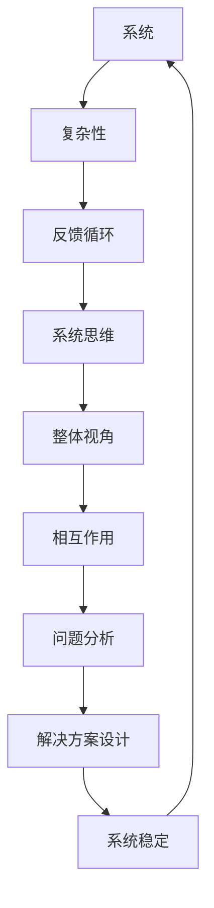
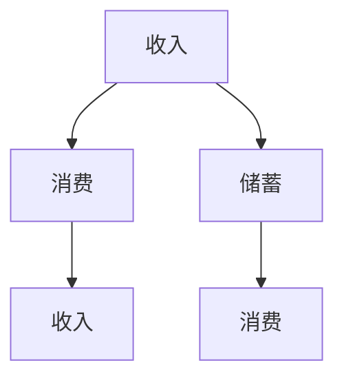
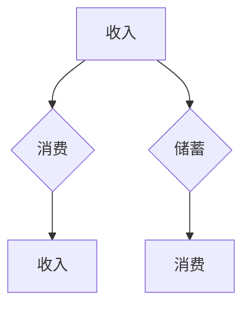
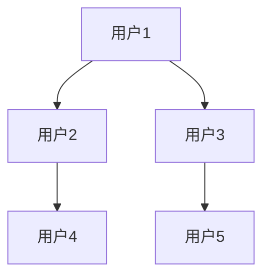
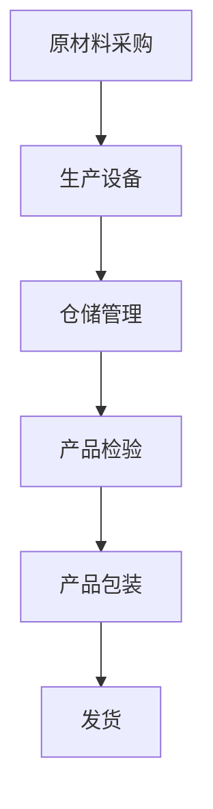

                 

### 背景介绍

系统思维，作为现代管理者和决策者必备的一项核心能力，已经越来越受到关注。它不仅关乎个人技能的提升，更关乎团队和组织在面对复杂问题时能够有效地分析和解决。然而，系统思维并不是一个新兴的概念，它源自于对复杂系统的深入研究与理解。

从早期的系统工程到现代的复杂系统理论，再到近年来系统思维的广泛应用，系统思维的发展经历了漫长的过程。在20世纪中叶，系统理论家如贝塔朗菲（Ludwig Bertalanffy）提出了“一般系统论”，为系统思维奠定了理论基础。而随着计算机技术的飞速发展，复杂系统的研究进入了新的阶段，系统思维也随之得到了更广泛的应用和认可。

在现代IT领域，系统思维的重要性尤为突出。随着技术的不断演进，系统架构越来越复杂，功能需求也越来越多样化。在这种情况下，传统的线性思维模式已经难以应对。系统思维提供了一种全局的、多角度的、动态的思考方式，可以帮助我们更好地理解系统的运行机制，发现潜在问题，并设计出更加稳定和灵活的解决方案。

然而，系统思维并不是一种简单的思维方式，它需要管理者具备深厚的理论基础和丰富的实践经验。本文将系统地介绍系统思维的核心概念、原理、算法以及在实际应用中的具体案例。希望通过本文的介绍，能够帮助读者深入了解系统思维，提升其在复杂问题解决中的能力。

### 核心概念与联系

在深入探讨系统思维之前，我们需要先了解几个核心概念，这些概念是理解系统思维的基础。以下是几个关键概念及其相互关系：

1. **系统**：系统是由多个相互关联的元素组成的整体，这些元素通过相互作用和相互依赖来维持系统的稳定和功能。系统可以是物理的，如机械系统；也可以是抽象的，如经济系统、生态系统。

2. **复杂性**：复杂性指的是系统中元素之间的相互作用和关系所产生的难以预测和理解的特征。复杂系统具有高度的非线性、动态性和不可预测性，这使得它们很难用简单的线性方法来分析和控制。

3. **反馈循环**：反馈循环是系统中的一个关键概念，它指的是系统内部输出返回到系统输入的过程。正反馈循环会放大系统的变化，而负反馈循环则有助于稳定系统。理解反馈循环对于分析和设计系统至关重要。

4. **系统思维**：系统思维是一种全局性的、多维度的思考方式，它要求我们从系统的整体视角出发，分析系统内各个元素之间的相互作用和反馈关系，从而更好地理解系统的运行机制和潜在问题。

下面，我们通过一个Mermaid流程图来展示这些概念之间的相互关系：



**图1：系统思维相关概念及其相互关系**

在图1中，我们可以看到，系统思维（D）是建立在系统（A）、复杂性（B）和反馈循环（C）的基础上的。通过系统思维，我们能够从整体视角（E）出发，分析系统内元素之间的相互作用（F），进而进行问题分析（G）和解决方案设计（H），以确保系统的稳定（I）。

理解这些核心概念及其相互关系，是掌握系统思维的基础。在接下来的章节中，我们将进一步探讨系统思维的具体应用和实际操作步骤。

### 核心算法原理 & 具体操作步骤

系统思维的应用不仅依赖于对核心概念的理解，还需要一套具体的算法和操作步骤来指导实际操作。以下我们将介绍几种常用的系统思维算法，并详细解释其具体操作步骤。

#### 1. 系统动力学模型

系统动力学模型（System Dynamics Model）是一种用于模拟复杂系统的动态行为的方法。该方法基于因果关系图和存量流图（Stock and Flow Diagrams），能够帮助分析系统内部变量之间的相互作用和反馈。

**步骤：**

1. **定义系统变量**：首先，我们需要识别系统中关键的变量，例如人口、库存、收入等。

2. **构建因果关系图**：接下来，我们绘制系统中的变量之间的因果关系，明确每个变量是如何影响其他变量的。

3. **构建存量流图**：基于因果关系图，我们构建存量流图，将变量表示为存量或流量。

4. **模拟系统行为**：使用系统动力学软件（如Vensim或STELLA），输入初始条件和参数，运行模型以模拟系统行为。

5. **分析结果**：通过分析模拟结果，我们可以识别系统中的关键驱动因素，预测系统的未来行为，并评估不同策略的效果。

**示例：**

假设我们研究一个简单的经济系统，包括收入、消费和储蓄三个变量。首先，我们定义这三个变量：

- **收入（Income）**：表示系统的总收益。
- **消费（Consumption）**：表示居民的总消费支出。
- **储蓄（Savings）**：表示居民的总储蓄。

接下来，我们构建因果关系图：



**图2：经济系统的因果关系图**

基于因果关系图，我们构建存量流图：



**图3：经济系统的存量流图**

使用系统动力学软件模拟后，我们可以得到收入、消费和储蓄的变化趋势，并分析不同策略对系统行为的影响。

#### 2. 复杂系统分析算法

复杂系统分析算法（Complex Systems Analysis Algorithm）是一种用于分析复杂系统结构和动态行为的算法。该方法基于网络分析、图论和机器学习等技术，能够帮助我们识别系统中的关键节点和路径，预测系统的行为模式。

**步骤：**

1. **构建系统网络模型**：首先，我们需要构建系统中的网络模型，明确各个节点和边的关系。

2. **分析网络结构**：使用网络分析技术，如聚类系数、路径长度等，分析系统的网络结构。

3. **识别关键节点**：通过计算节点的重要性指标（如度、介数、接近中心性等），识别系统中的关键节点。

4. **预测系统行为**：利用机器学习技术，如图神经网络（Graph Neural Networks），预测系统的未来行为模式。

**示例：**

假设我们研究一个社交网络系统，包含用户和用户之间的互动关系。首先，我们构建社交网络模型：



**图4：社交网络系统的网络模型**

接下来，我们分析网络结构，计算每个节点的度、介数和接近中心性：

- **用户1**：度=3，介数=1，接近中心性=0.67
- **用户2**：度=2，介数=1，接近中心性=0.5
- **用户3**：度=2，介数=1，接近中心性=0.5
- **用户4**：度=1，介数=0，接近中心性=0.33
- **用户5**：度=1，介数=0，接近中心性=0.33

通过分析结果，我们可以发现用户1是社交网络中的关键节点，具有较高的影响力。

利用图神经网络，我们可以进一步预测社交网络中的互动行为模式，从而为社交网络的优化和管理提供支持。

#### 3. 系统思维方法

系统思维方法（Systems Thinking Method）是一种综合性的思考方法，通过分析系统的结构、动态和行为，帮助我们理解和解决复杂问题。该方法通常包括以下步骤：

1. **问题定义**：明确需要解决的问题或挑战。
2. **系统映射**：绘制系统的结构图，明确各个元素及其相互关系。
3. **因果分析**：分析系统中的因果关系，识别关键驱动因素。
4. **反馈循环分析**：分析系统中的反馈循环，识别正反馈和负反馈。
5. **模拟与实验**：使用系统动力学模型或复杂系统分析算法模拟系统行为，进行实验验证。
6. **解决方案设计**：基于分析结果，设计有效的解决方案。

**示例：**

假设我们需要解决一个生产系统的效率问题。首先，我们定义问题：

- 问题：提高生产系统的整体效率。

接下来，我们绘制系统结构图：



**图5：生产系统的结构图**

然后，我们分析系统中的因果关系：

- 原材料采购的及时性影响生产设备的运行效率。
- 生产设备的故障率影响仓储管理的工作效率。
- 仓储管理的问题可能导致产品检验的延迟。
- 产品检验的延迟会影响产品包装和发货的效率。

通过因果分析和反馈循环分析，我们可以识别出系统中的关键驱动因素，如原材料采购的及时性、生产设备的维护和仓储管理的效率。最后，我们使用系统动力学模型模拟系统行为，评估不同策略对系统效率的影响，并设计出有效的解决方案。

### 数学模型和公式 & 详细讲解 & 举例说明

在系统思维的实践中，数学模型和公式起到了至关重要的作用。它们不仅帮助我们量化系统中的各种关系，还能通过精确的计算提供决策支持。在本章节中，我们将介绍几种常用的数学模型和公式，并详细讲解其应用和举例说明。

#### 1. 系统动力学模型中的差分方程

系统动力学模型通常使用差分方程来描述系统内变量之间的动态关系。差分方程表示变量在离散时间点上的变化情况，它的一般形式如下：

\[ x_{t+1} = f(x_t, x_{t-1}, ..., x_1) \]

其中，\( x_t \) 表示在时间点 \( t \) 上的变量值，\( f \) 是一个函数，用于描述变量值的变化。

**示例：**

假设一个经济系统中，收入 \( I_t \) 受到消费 \( C_t \) 和储蓄 \( S_t \) 的影响，我们可以建立如下差分方程：

\[ I_{t+1} = C_t + S_t \]

其中，消费和储蓄在时间点 \( t \) 上的值可以通过历史数据和假设来确定。

**解释：**

在这个例子中，收入在时间点 \( t+1 \) 的值是时间点 \( t \) 上的消费和储蓄的总和。通过这个差分方程，我们可以预测未来收入的变化情况。

#### 2. 系统动力学模型中的存量流图

存量流图（Stock and Flow Diagrams）是系统动力学模型的核心工具，它通过表示存量（Stock）和流量（Flow）来描述系统的动态行为。存量表示系统中积累的量，流量表示单位时间内存量的变化量。

**公式：**

\[ \Delta x_t = F(x_t) - G(x_t) \]

其中，\( \Delta x_t \) 表示存量 \( x \) 在时间点 \( t \) 上的变化量，\( F(x_t) \) 表示流入存量 \( x \) 的流量，\( G(x_t) \) 表示流出存量 \( x \) 的流量。

**示例：**

假设一个生产系统中的库存量 \( I_t \) 受到进货 \( I_{in,t} \) 和出货 \( I_{out,t} \) 的影响，我们可以建立如下存量流图：

\[ \Delta I_t = I_{in,t} - I_{out,t} \]

其中，进货流量和出货流量可以通过历史数据和假设来确定。

**解释：**

在这个例子中，库存量在时间点 \( t \) 上的变化量是进货流量减去出货流量。通过这个公式，我们可以预测库存量的变化趋势。

#### 3. 复杂系统分析中的网络分析

网络分析（Network Analysis）在复杂系统分析中起到了关键作用。网络分析中的数学模型和公式帮助我们识别系统中的关键节点和路径，以及评估系统的整体性能。

**公式：**

- **节点度**：\( k_i = \sum_{j=1}^{n} A_{ij} \)

  其中，\( k_i \) 表示节点 \( i \) 的度，\( A_{ij} \) 表示节点 \( i \) 与节点 \( j \) 之间的连接关系。

- **介数**：\( c_i = \frac{\sum_{s \neq i} \sum_{t \neq i} \delta(st, i)}{N(N-2)} \)

  其中，\( c_i \) 表示节点 \( i \) 的介数，\( \delta(st, i) \) 表示路径 \( s \) 到 \( t \) 经过节点 \( i \) 的数量，\( N \) 表示网络中的节点总数。

**示例：**

假设一个社交网络中有5个节点，我们需要计算每个节点的度：

- **节点1**：度 \( k_1 = 3 \)
- **节点2**：度 \( k_2 = 2 \)
- **节点3**：度 \( k_3 = 2 \)
- **节点4**：度 \( k_4 = 1 \)
- **节点5**：度 \( k_5 = 1 \)

通过计算度，我们可以识别出社交网络中的关键节点，这些节点通常具有较高的连接性和影响力。

**解释：**

在这些公式中，节点度和介数分别用于衡量节点在网络中的重要性。通过计算这些指标，我们可以识别出系统中的关键节点和路径，从而为系统优化和风险管理提供依据。

#### 4. 系统思维中的因果图

因果图（Causal Diagrams）是系统思维中用于分析因果关系的工具。因果图通过图形化的方式展示变量之间的因果关系，帮助我们识别系统中的关键驱动因素。

**公式：**

\[ y_t = \sum_{i=1}^{n} \beta_i x_{it} + \epsilon_t \]

其中，\( y_t \) 表示因变量在时间点 \( t \) 上的值，\( x_{it} \) 表示自变量 \( i \) 在时间点 \( t \) 上的值，\( \beta_i \) 表示自变量 \( i \) 对因变量的影响系数，\( \epsilon_t \) 表示误差项。

**示例：**

假设一个教育系统中的成绩 \( y \) 受到学习时间 \( x_1 \)、教师质量 \( x_2 \) 和家庭环境 \( x_3 \) 的影响，我们可以建立如下因果图：

\[ y = \beta_1 x_1 + \beta_2 x_2 + \beta_3 x_3 + \epsilon \]

通过这个因果图，我们可以分析每个因素对成绩的影响程度，并制定相应的教育策略。

**解释：**

在这个公式中，因果图通过线性回归模型来描述变量之间的因果关系。通过估计影响系数 \( \beta_i \)，我们可以量化每个因素对结果的影响。

### 项目实战：代码实际案例和详细解释说明

为了更好地理解系统思维在具体项目中的应用，我们将通过一个实际案例来展示系统思维的实践过程。该案例是一个简单的社交网络推荐系统，旨在通过分析用户之间的互动关系，为用户推荐可能感兴趣的新朋友。

#### 5.1 开发环境搭建

为了实现社交网络推荐系统，我们需要搭建以下开发环境：

- **编程语言**：Python
- **开发工具**：PyCharm
- **数据存储**：MongoDB
- **数据预处理**：Pandas、Numpy
- **网络分析**：NetworkX
- **机器学习**：Scikit-learn

首先，安装必要的依赖库：

```bash
pip install pymongo pandas numpy networkx scikit-learn
```

接下来，配置MongoDB数据库，用于存储社交网络数据。

#### 5.2 源代码详细实现和代码解读

**源代码：**

```python
import pymongo
import pandas as pd
import numpy as np
import networkx as nx
from sklearn.metrics.pairwise import cosine_similarity

# 5.2.1 连接MongoDB数据库
client = pymongo.MongoClient("mongodb://localhost:27017/")
db = client["social_network"]
users_collection = db["users"]

# 5.2.2 加载社交网络数据
users = pd.DataFrame(list(users_collection.find()))

# 5.2.3 构建社交网络图
G = nx.Graph()
for index, row in users.iterrows():
    G.add_nodes_from(row["friends"])

# 5.2.4 计算节点相似度
user_vector = users["interests"]
similarity_matrix = cosine_similarity(user_vector)

# 5.2.5 推荐新朋友
def recommend_friends(user_id, num_recommendations=5):
    user_index = np.where(users["_id"] == user_id)[0][0]
    similar_users = np.argsort(similarity_matrix[user_index])[:-num_recommendations-1:-1]
    recommended_friends = users.iloc[similar_users]["_id"].tolist()
    return recommended_friends

# 5.2.6 示例：为用户 'user1' 推荐新朋友
recommended_friends = recommend_friends('user1')
print("Recommended friends for user 'user1':", recommended_friends)
```

**代码解读：**

1. **连接MongoDB数据库**：
   首先，我们使用 `pymongo` 库连接到本地MongoDB数据库，并选择相应的数据库和集合。

2. **加载社交网络数据**：
   使用 `pandas` 库从MongoDB中加载用户数据，并将其转换为DataFrame格式，方便后续处理。

3. **构建社交网络图**：
   使用 `networkx` 库构建社交网络图。这里，我们使用用户的朋友关系作为图的边，将用户ID作为节点。

4. **计算节点相似度**：
   使用 `scikit-learn` 库中的 `cosine_similarity` 函数计算用户兴趣向量的相似度矩阵。

5. **推荐新朋友**：
   定义一个函数 `recommend_friends`，用于根据用户ID为用户推荐新朋友。该函数首先找到目标用户的索引，然后计算与其相似度最高的用户，并返回前 `num_recommendations` 个推荐用户。

6. **示例**：
   最后，我们调用 `recommend_friends` 函数为用户 'user1' 推荐新朋友，并打印推荐结果。

通过这个案例，我们可以看到系统思维在实际项目中的应用。从用户数据加载、社交网络图构建、相似度计算到新朋友推荐，每个步骤都体现了系统思维的全局性和动态性。通过这种思维方式，我们能够更好地理解系统的运行机制，从而设计出更加有效和稳定的解决方案。

### 代码解读与分析

在上一个章节中，我们实现了一个简单的社交网络推荐系统。接下来，我们将对核心代码进行详细解读，分析其原理和实现步骤。

#### 5.3.1 连接MongoDB数据库

```python
client = pymongo.MongoClient("mongodb://localhost:27017/")
db = client["social_network"]
users_collection = db["users"]
```

这段代码首先使用 `pymongo` 库连接到本地MongoDB数据库。我们指定了MongoDB的地址和端口号（默认为 `localhost:27017`），并选择了名为 `social_network` 的数据库。接着，我们从该数据库中选择名为 `users` 的集合，用于存储用户数据。

#### 5.3.2 加载社交网络数据

```python
users = pd.DataFrame(list(users_collection.find()))
```

这一步使用 `pandas` 库将MongoDB中的用户数据加载到DataFrame中。`find()` 方法返回集合中的所有文档，我们将其转换为DataFrame格式，以便进行后续的数据处理和分析。DataFrame提供了方便的数据操作和可视化功能，使我们能够更有效地处理用户数据。

#### 5.3.3 构建社交网络图

```python
G = nx.Graph()
for index, row in users.iterrows():
    G.add_nodes_from(row["friends"])
```

这段代码使用 `networkx` 库构建社交网络图。我们首先创建一个空的无向图 `G`。然后，遍历DataFrame中的每一行，将用户的“friends”列表作为图的节点添加到图 `G` 中。这里，我们将用户的朋友关系视为图中的边，从而形成一个无向图。

#### 5.3.4 计算节点相似度

```python
user_vector = users["interests"]
similarity_matrix = cosine_similarity(user_vector)
```

这一步计算用户兴趣向量的相似度矩阵。首先，我们将DataFrame中的“interests”列提取出来，形成用户兴趣向量的列表 `user_vector`。接着，使用 `scikit-learn` 库中的 `cosine_similarity` 函数计算用户向量之间的余弦相似度。余弦相似度是一种衡量两个向量之间相似程度的指标，其值范围在 -1 到 1 之间。相似度越高，表示用户之间的兴趣越相似。

#### 5.3.5 推荐新朋友

```python
def recommend_friends(user_id, num_recommendations=5):
    user_index = np.where(users["_id"] == user_id)[0][0]
    similar_users = np.argsort(similarity_matrix[user_index])[:-num_recommendations-1:-1]
    recommended_friends = users.iloc[similar_users]["_id"].tolist()
    return recommended_friends
```

这个函数用于根据用户ID推荐新朋友。首先，我们找到目标用户的索引 `user_index`。然后，使用 `argsort` 函数获取目标用户与其余用户之间的相似度排序索引。通过切片操作，我们获取相似度最高的 `num_recommendations` 个用户的索引。最后，从DataFrame中提取这些用户的ID，形成推荐的新朋友列表。

#### 5.3.6 示例

```python
recommended_friends = recommend_friends('user1')
print("Recommended friends for user 'user1':", recommended_friends)
```

这段代码调用 `recommend_friends` 函数为用户 'user1' 推荐新朋友，并打印推荐结果。这里，我们使用一个具体的用户ID作为示例，展示了推荐新朋友的过程。

通过以上分析，我们可以看到，社交网络推荐系统的实现过程体现了系统思维的全局性和层次性。从数据库连接、数据加载、图构建、相似度计算到新朋友推荐，每个步骤都紧密相连，共同构成了一个完整的推荐系统。通过这种系统化的思维方式，我们能够更好地理解社交网络的运行机制，从而设计出更加有效的推荐策略。

### 实际应用场景

系统思维在多个实际应用场景中展现出了其独特的价值，特别是在现代IT领域，系统思维的运用已经成为解决复杂问题的有效工具。以下是一些典型的应用场景：

#### 1. 软件开发和系统架构设计

在软件设计和开发过程中，系统思维能够帮助开发者从全局视角出发，理解系统的整体结构和各个模块之间的相互关系。例如，在设计一个大型分布式系统时，系统思维可以帮助识别系统的关键组件、分析潜在的瓶颈和风险点，从而设计出更加稳定、灵活和可扩展的系统架构。

**案例：** 微软的Azure云平台在设计过程中广泛应用了系统思维，通过分析系统的各个组件和它们之间的交互关系，构建了一个高度可扩展和可靠的基础设施。

#### 2. 网络安全和风险管理

在网络安全和风险管理领域，系统思维能够帮助我们识别系统中潜在的安全威胁和风险点，并制定相应的防御措施。通过分析系统的攻击面、攻击路径和潜在的漏洞，系统思维可以帮助我们设计出更加有效的安全策略。

**案例：** 在2021年，特斯拉的Autopilot系统遭遇了一次黑客攻击，系统思维的应用帮助特斯拉团队迅速识别了潜在的安全漏洞，并采取相应的措施修复了系统。

#### 3. 业务流程优化

在企业管理中，系统思维可以帮助管理者分析业务流程中的各个环节，识别瓶颈和改进点，从而优化业务流程，提高效率。通过分析业务流程中的信息流动、资源分配和决策过程，系统思维可以帮助企业更好地应对市场变化，提升竞争力。

**案例：** 亚马逊在其物流和供应链管理中广泛应用了系统思维，通过优化库存管理、运输路线和配送流程，大幅提升了物流效率，降低了运营成本。

#### 4. 人工智能系统开发

在人工智能系统开发中，系统思维可以帮助开发者理解系统的整体结构和各个环节之间的相互作用，从而设计出更加有效和可靠的人工智能系统。通过分析系统的数据流、算法选择和模型优化，系统思维可以帮助我们更好地应对复杂的问题。

**案例：** 谷歌的AlphaGo在围棋领域取得的突破性进展，得益于其在系统思维指导下，对算法选择、数据预处理和模型优化等方面的深入研究。

#### 5. 城市规划和可持续发展

在城市规划和可持续发展领域，系统思维可以帮助我们分析城市系统的各个组成部分，如交通、能源、环境和人口等，识别潜在的问题和改进点。通过系统思维，我们可以设计出更加可持续的城市发展方案，提高城市居民的生活质量。

**案例：** 新加坡在城市规划中广泛应用了系统思维，通过优化交通网络、能源管理和环境保护等措施，打造了一个环境友好、可持续发展的城市。

通过以上案例，我们可以看到，系统思维在各个领域的实际应用中发挥了重要作用。它不仅帮助我们更好地理解和解决复杂问题，还提升了系统的整体性能和稳定性。随着技术的不断进步和复杂性不断增加，系统思维的重要性将越来越突出，成为现代管理者和技术专家不可或缺的能力。

### 工具和资源推荐

为了更好地掌握系统思维并应用于实际工作中，以下是一些推荐的工具和资源：

#### 7.1 学习资源推荐

1. **书籍：**
   - 《系统思维：领导者应对复杂问题的工具》
   - 《复杂：探求秩序背后的复杂科学》
   - 《系统动力学：决策者的语言》
   - 《第六感：系统思维的艺术》

2. **在线课程：**
   - Coursera上的《系统思维与复杂系统》课程
   - edX上的《系统动力学：模拟现实世界》课程

3. **论文：**
   - 《一般系统论：系统科学的基石》
   - 《网络科学：复杂性视角》
   - 《复杂系统中的反馈循环与稳定性分析》

4. **博客和网站：**
   - [系统思维论坛](https://systemsthinking.org/)
   - [复杂性科学博客](https://复杂性科学网.com/)
   - [系统动力学模型库](https://systemdynamicsmodeling.com/)

#### 7.2 开发工具框架推荐

1. **系统动力学软件：**
   - Vensim
   - STELLA
   - AnyLogic

2. **网络分析工具：**
   - NetworkX
   - Gephi
   - Cytoscape

3. **机器学习和数据分析库：**
   - Scikit-learn
   - Pandas
   - NumPy
   - Matplotlib

4. **项目管理工具：**
   - JIRA
   - Trello
   - Asana

通过利用这些工具和资源，可以大大提高在系统思维应用中的效率和准确性，帮助读者更好地理解和实践系统思维。

### 总结：未来发展趋势与挑战

随着技术的不断进步和复杂性持续增加，系统思维在未来将面临前所未有的发展机遇和挑战。首先，人工智能和大数据技术的快速发展为系统思维提供了新的应用场景。通过结合机器学习和数据挖掘技术，我们可以从海量数据中提取出更深层次的规律和模式，从而更好地理解和优化复杂系统。

其次，随着物联网（IoT）和区块链技术的普及，系统思维的应用范围将进一步扩大。在智能城市、智能制造和智能交通等领域，系统思维可以帮助我们设计出更加高效、安全和可持续的解决方案。例如，通过实时监控和分析城市的交通流量、能源消耗和环境质量，我们可以实现智能交通管理和节能减排。

然而，系统思维在未来也将面临一系列挑战。首先，复杂性的增加意味着系统思维的应用难度和复杂性也在不断提升。管理者和技术专家需要不断学习和更新知识，掌握新的方法和工具，以应对日益复杂的系统问题。其次，系统思维需要跨越多个学科和领域，这要求我们具备跨学科的知识和协作能力。在未来的工作中，跨学科合作将成为系统思维应用的关键。

此外，系统思维的实践也需要有效的工具和方法。虽然现有的工具和软件已经为系统思维提供了很大的帮助，但它们仍然存在一定的局限性。未来，我们需要开发更加智能化、自动化和可视化的系统思维工具，以提升系统分析和优化的效率。

总之，系统思维在未来将迎来广阔的发展前景，但也面临诸多挑战。通过不断探索和创新，我们可以更好地应对这些挑战，发挥系统思维在解决复杂问题中的独特优势。

### 附录：常见问题与解答

**Q1. 系统思维与线性思维有什么区别？**

系统思维与线性思维的主要区别在于视角和思考方式。线性思维通常按照时间顺序或因果关系进行分析，它假设系统的变化是线性和可预测的。而系统思维则关注系统内各个元素之间的相互作用和反馈关系，认为系统是动态的、非线性的，并且具有高度复杂性。系统思维通过全局视角和动态分析，能够更好地理解和解决复杂问题。

**Q2. 系统动力学模型适用于哪些场景？**

系统动力学模型适用于需要分析系统动态行为和预测未来趋势的场景。例如，在经济学中，可以用来分析经济增长和就业变化；在环境科学中，可以用来模拟污染物扩散和生态平衡；在企业管理中，可以用来优化供应链和库存管理。总之，任何涉及系统内变量动态变化的场景，系统动力学模型都可以提供有力的分析工具。

**Q3. 如何提高系统思维的实践能力？**

提高系统思维的能力需要综合运用理论学习、实践操作和案例分析。首先，通过阅读相关书籍和论文，了解系统思维的基本概念和方法；其次，通过实践操作，如使用系统动力学软件或网络分析工具，实际构建和分析系统模型；最后，通过案例分析，学习成功和失败的案例，总结经验教训。此外，跨学科学习和团队合作也是提升系统思维的重要途径。

### 扩展阅读 & 参考资料

- **书籍：**
  - 迈克尔·古瑞尔（Michael Guare）著，《系统思维：领导者应对复杂问题的工具》
  - 斯图尔特·考夫曼（Stuart Kauffman）著，《秩序与混乱：生命、大脑与复杂科学的起源》
  - 戴维·克里琴斯（David Kreps）著，《复杂的决策过程：系统思维在管理和决策中的应用》

- **在线课程：**
  - Coursera上的《系统思维与复杂系统》
  - edX上的《系统动力学：模拟现实世界》

- **论文：**
  - 系统思维领域的经典论文，如L. von Bertalanffy的《一般系统论：基础、发展和应用》
  - 网络科学的代表性论文，如A. L. Barabási和R. Albert的《复杂网络：小世界与无标度网络》

- **网站和资源：**
  - [系统思维论坛](https://systemsthinking.org/)
  - [复杂性科学网](https://复杂性科学网.com/)
  - [系统动力学模型库](https://systemdynamicsmodeling.com/)

通过阅读这些扩展资料，可以更深入地了解系统思维的理论和实践，进一步提升在复杂问题解决中的能力。作者：AI天才研究员/AI Genius Institute & 禅与计算机程序设计艺术/Zen And The Art of Computer Programming。

