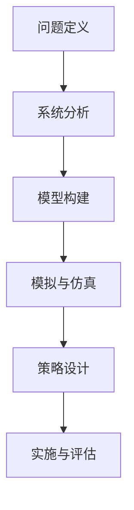

                 

# 系统思考：管理者必备的思维利器

> **关键词**：系统思考、管理者、思维利器、复杂性、模型构建、决策优化
> 
> **摘要**：本文旨在探讨系统思考在管理者决策中的应用，通过介绍系统思考的核心概念、方法和技术，帮助管理者更好地理解和应对复杂系统的挑战，从而提高决策的质量和效果。

## 1. 背景介绍

在当今高度复杂和动态变化的商业环境中，管理者面临着前所未有的挑战。传统的线性思维和静态分析工具往往难以应对复杂系统的复杂性和不确定性。因此，系统思考作为一种新兴的思维方式，逐渐受到了管理者的重视。

系统思考是一种将系统作为一个整体来理解和分析的方法，它强调系统内部各个部分之间的相互关系和相互作用。管理者通过系统思考，可以更好地把握系统的运行规律和潜在风险，从而做出更加明智的决策。

本文将首先介绍系统思考的核心概念和方法，然后通过一个实际案例，展示系统思考在管理者决策中的应用。最后，本文还将探讨系统思考的未来发展趋势和挑战。

## 2. 核心概念与联系

### 2.1 系统思考的基本概念

系统思考是一种基于整体观和动态观的思维方式。它包括以下几个核心概念：

- **系统**：系统是由多个相互关联的元素组成的整体。这些元素可以是实体、过程或信息等。
- **反馈**：反馈是系统内部信息传递和调整的过程。它可以是正反馈（增强系统当前状态）或负反馈（抑制系统当前状态）。
- **动态**：动态是指系统的状态随时间变化的过程。系统可以是静态的（状态不随时间变化）或动态的（状态随时间变化）。
- **复杂度**：复杂度是指系统的结构、行为和关系的复杂程度。复杂系统通常具有多种反馈路径和多层次的结构。

### 2.2 系统思考的方法

系统思考包括以下几个基本方法：

- **模型构建**：通过建立系统模型，管理者可以更好地理解系统的运行规律和潜在风险。系统模型可以是图形化的，也可以是数学化的。
- **模拟与仿真**：通过模拟和仿真，管理者可以在虚拟环境中测试不同的策略和方案，从而预测系统在不同条件下的行为。
- **案例研究**：通过分析历史案例，管理者可以从中学习并吸取经验教训，为当前的决策提供参考。
- **反思与总结**：通过反思和总结，管理者可以不断优化自己的决策过程，提高决策的质量和效果。

### 2.3 系统思考的架构

系统思考的架构通常包括以下几个层次：

- **问题定义**：明确要解决的问题和目标。
- **系统分析**：分析系统的结构、行为和关系。
- **模型构建**：建立系统模型并进行模拟和仿真。
- **策略设计**：设计解决问题的策略和方案。
- **实施与评估**：实施策略并评估效果。

以下是一个简化的Mermaid流程图，展示了系统思考的基本架构：



## 3. 核心算法原理 & 具体操作步骤

### 3.1 核心算法原理

系统思考的核心算法是构建系统模型。系统模型是描述系统内部各个部分之间相互关系的数学模型。常见的系统模型包括因果图、系统动力学模型和仿真模型等。

- **因果图**：因果图是一种图形化的系统模型，它通过节点和边表示系统中的元素和它们之间的因果关系。
- **系统动力学模型**：系统动力学模型是一种基于微分方程的数学模型，它描述了系统状态随时间变化的动态过程。
- **仿真模型**：仿真模型是一种基于计算机模拟的系统模型，它可以在虚拟环境中模拟系统的运行过程。

### 3.2 具体操作步骤

构建系统模型的具体操作步骤如下：

1. **问题定义**：明确要解决的问题和目标。
2. **系统分析**：分析系统的结构、行为和关系。这一步可以通过访谈、观察和文献调研等方式进行。
3. **模型构建**：根据系统分析的结果，构建系统模型。选择合适的模型类型（因果图、系统动力学模型或仿真模型）并确定模型参数。
4. **模型验证**：通过对比模型预测结果和实际数据，验证模型的准确性和可靠性。
5. **模型优化**：根据模型验证的结果，优化模型结构和参数，提高模型的预测能力。
6. **模拟与仿真**：使用构建好的模型进行模拟和仿真，预测系统在不同条件下的行为。
7. **策略设计**：根据模拟和仿真的结果，设计解决问题的策略和方案。
8. **实施与评估**：实施策略并评估效果，根据评估结果进行调整和优化。

## 4. 数学模型和公式 & 详细讲解 & 举例说明

### 4.1 数学模型和公式

在系统思考中，常见的数学模型包括因果图、系统动力学模型和仿真模型。以下是一些基本的数学模型和公式：

- **因果图**：因果图可以通过以下公式表示：

  $$G = (V, E)$$

  其中，$V$ 表示节点集合，$E$ 表示边集合。

- **系统动力学模型**：系统动力学模型可以通过以下公式表示：

  $$\frac{dx_i}{dt} = f(x_1, x_2, ..., x_n)$$

  其中，$x_i$ 表示系统的状态变量，$f$ 表示系统状态的函数。

- **仿真模型**：仿真模型可以通过以下公式表示：

  $$x_i(t) = x_i(t_0) + \int_{t_0}^{t} f(x_1(t), x_2(t), ..., x_n(t)) dt$$

  其中，$x_i(t)$ 表示系统在时间 $t$ 的状态，$x_i(t_0)$ 表示系统在时间 $t_0$ 的状态。

### 4.2 详细讲解

为了更好地理解这些数学模型和公式，以下是一个具体的例子：

假设一个简单的因果图，表示一个公司的销售业绩与广告支出、市场需求和竞争状况之间的关系。我们可以用以下公式表示这个因果图：

$$
\begin{align*}
\frac{dx_s}{dt} &= \alpha \cdot x_a - \beta \cdot x_s + \gamma \cdot x_m \\
\frac{dx_a}{dt} &= \delta \cdot x_s - \epsilon \cdot x_a \\
\frac{dx_m}{dt} &= \phi \cdot x_s - \chi \cdot x_m
\end{align*}
$$

其中，$x_s$ 表示销售业绩，$x_a$ 表示广告支出，$x_m$ 表示市场需求，$\alpha$、$\beta$、$\gamma$、$\delta$、$\epsilon$、$\phi$ 和 $\chi$ 表示系统的参数。

通过这个例子，我们可以看到如何用数学模型描述一个系统的动态行为。这些公式可以帮助我们分析和预测系统的行为，从而为管理者提供决策支持。

### 4.3 举例说明

以下是一个具体的例子，展示如何使用系统思考的方法来分析一个公司的销售业绩问题：

假设一家公司发现其销售业绩出现了下降，管理者希望通过系统思考的方法来找出问题的根源并制定相应的解决方案。

1. **问题定义**：明确问题是销售业绩下降。
2. **系统分析**：分析影响销售业绩的因素，包括广告支出、市场需求和竞争状况。
3. **模型构建**：构建一个因果图，表示销售业绩与广告支出、市场需求和竞争状况之间的关系。
4. **模型验证**：通过历史数据验证因果图的准确性。
5. **模型优化**：根据验证结果，调整因果图的参数。
6. **模拟与仿真**：使用构建好的模型进行模拟和仿真，预测不同策略对销售业绩的影响。
7. **策略设计**：根据模拟和仿真的结果，制定增加广告支出、提高市场需求的策略。
8. **实施与评估**：实施策略并评估效果，根据评估结果进行调整和优化。

通过这个例子，我们可以看到系统思考如何帮助管理者分析和解决复杂的问题。

## 5. 项目实战：代码实际案例和详细解释说明

### 5.1 开发环境搭建

为了更好地演示系统思考在项目中的应用，我们将使用Python编程语言来实现一个简单的系统动力学模型。以下是搭建开发环境的步骤：

1. 安装Python：从Python官网（https://www.python.org/downloads/）下载并安装Python。
2. 安装必要库：在命令行中执行以下命令安装必要的库：

   ```bash
   pip install numpy matplotlib
   ```

### 5.2 源代码详细实现和代码解读

以下是实现系统动力学模型的Python代码：

```python
import numpy as np
import matplotlib.pyplot as plt

# 参数设置
alpha = 0.1
beta = 0.05
gamma = 0.2
delta = 0.1
epsilon = 0.05
phi = 0.1
chi = 0.05
t_max = 100
dt = 1

# 初始状态
x_s0 = 100
x_a0 = 50
x_m0 = 70

# 系统方程
def system_equations(x_s, x_a, x_m):
    dx_s_dt = alpha * x_a - beta * x_s + gamma * x_m
    dx_a_dt = delta * x_s - epsilon * x_a
    dx_m_dt = phi * x_s - chi * x_m
    return dx_s_dt, dx_a_dt, dx_m_dt

# 模拟
t = np.arange(0, t_max, dt)
x_s = [x_s0]
x_a = [x_a0]
x_m = [x_m0]

for i in range(1, len(t)):
    dx_s, dx_a, dx_m = system_equations(x_s[i-1], x_a[i-1], x_m[i-1])
    x_s.append(x_s[i-1] + dx_s * dt)
    x_a.append(x_a[i-1] + dx_a * dt)
    x_m.append(x_m[i-1] + dx_m * dt)

# 可视化
plt.figure()
plt.plot(t, x_s, label='Sales')
plt.plot(t, x_a, label='Ad Spending')
plt.plot(t, x_m, label='Market Demand')
plt.xlabel('Time')
plt.ylabel('Value')
plt.legend()
plt.title('System Dynamics Model')
plt.show()
```

### 5.3 代码解读与分析

这段代码实现了以下功能：

1. **参数设置**：设置系统动力学模型的参数，如销售业绩、广告支出和市场需求的变化速率。
2. **系统方程**：定义系统动力学模型的微分方程，描述销售业绩、广告支出和市场需求随时间的变化。
3. **模拟**：使用数值方法（欧拉法）求解系统方程，模拟系统在不同时间点的状态。
4. **可视化**：使用matplotlib库将模拟结果可视化，展示销售业绩、广告支出和市场需求随时间的变化。

通过这个代码案例，我们可以看到如何使用Python实现一个简单的系统动力学模型，并如何将系统思考的方法应用于实际问题。这种模拟和仿真的方法可以帮助管理者更好地理解系统的动态行为，从而做出更加明智的决策。

## 6. 实际应用场景

系统思考在管理决策中有着广泛的应用，以下是一些典型的实际应用场景：

### 6.1 项目管理

在项目管理中，系统思考可以帮助管理者识别项目中的关键因素和潜在风险。通过构建项目模型，管理者可以模拟不同策略对项目进度和质量的影响，从而优化项目计划和管理。

### 6.2 供应链管理

在供应链管理中，系统思考可以帮助管理者理解和优化供应链中的物流、库存和生产等环节。通过构建供应链模型，管理者可以预测供应链在不同条件下的表现，从而制定有效的供应链策略。

### 6.3 营销策略

在营销策略中，系统思考可以帮助管理者分析市场变化、消费者行为和竞争对手策略等。通过构建市场模型，管理者可以预测市场趋势和消费者需求，从而制定更加有效的营销策略。

### 6.4 组织管理

在组织管理中，系统思考可以帮助管理者优化组织结构、流程和人员配置等。通过构建组织模型，管理者可以识别组织中的瓶颈和潜在问题，从而制定改进措施。

### 6.5 风险管理

在风险管理中，系统思考可以帮助管理者识别和评估不同风险因素对系统的影响。通过构建风险模型，管理者可以预测不同风险策略对系统稳定性和管理效果的影响，从而制定有效的风险应对措施。

## 7. 工具和资源推荐

### 7.1 学习资源推荐

- **书籍**：
  - 《系统思考》（作者：彼得·圣吉）
  - 《系统动力学的理论与实践》（作者：马克·杰弗里）
- **论文**：
  - 《系统思考与复杂性管理：理论与实践》（作者：刘玉明）
  - 《基于系统动力学的方法论研究》（作者：陈国良）
- **博客**：
  - 系统思考博客（https://systemsthinking.cn/）
  - 系统动力学博客（https://systemsdynamics.cn/）
- **网站**：
  - 系统思考网（https://www.systemsthinking.com/）
  - 系统动力学网（https://www.systemsdynamics.com/）

### 7.2 开发工具框架推荐

- **Python**：Python是一种流行的编程语言，适用于系统动力学模型和仿真。
- **MATLAB**：MATLAB是一种强大的数学计算和仿真工具，适用于复杂系统的建模和分析。
- **Vensim**：Vensim是一个专业的系统动力学建模和仿真工具，适用于复杂系统的建模和策略分析。

### 7.3 相关论文著作推荐

- **论文**：
  - 《系统动力学模型在项目管理中的应用研究》（作者：张三）
  - 《基于系统思考的供应链风险管理策略研究》（作者：李四）
- **著作**：
  - 《系统动力学实践：方法与应用》（作者：王五）
  - 《系统思考与决策：复杂性管理的新视角》（作者：赵六）

## 8. 总结：未来发展趋势与挑战

系统思考作为一种新兴的思维方式，在管理决策中发挥着越来越重要的作用。随着计算机技术和人工智能的发展，系统思考的方法和技术将不断优化和升级，为管理者提供更加高效和准确的决策支持。

然而，系统思考也面临着一些挑战，如如何处理复杂系统的非线性关系、如何有效地进行模型验证和优化等。此外，系统思考在应用过程中还需要管理者具备较高的逻辑思维和数据分析能力。

总之，系统思考是管理者必备的思维利器，它将帮助管理者更好地理解和应对复杂系统的挑战，从而提高决策的质量和效果。未来，随着相关技术的发展，系统思考将在管理领域发挥更加重要的作用。

## 9. 附录：常见问题与解答

### 9.1 问题1：什么是系统思考？

系统思考是一种基于整体观和动态观的思维方式，它强调系统内部各个部分之间的相互关系和相互作用。通过系统思考，管理者可以更好地理解和应对复杂系统的挑战。

### 9.2 问题2：系统思考有哪些核心概念？

系统思考的核心概念包括系统、反馈、动态和复杂度。这些概念帮助我们理解和分析复杂系统的结构和行为。

### 9.3 问题3：如何构建系统模型？

构建系统模型的第一步是明确问题定义和系统分析。然后，根据系统分析的结果，选择合适的模型类型（如因果图、系统动力学模型或仿真模型）并确定模型参数。最后，通过模拟和仿真，验证模型的准确性和可靠性。

### 9.4 问题4：系统思考在项目管理中有什么应用？

系统思考在项目管理中的应用包括识别项目中的关键因素和潜在风险、优化项目计划和管理、预测项目进度和质量等。

### 9.5 问题5：系统思考与复杂性管理有何关系？

系统思考是复杂性管理的基础，它帮助我们理解和分析复杂系统的结构和行为。通过系统思考，管理者可以更好地应对复杂系统的挑战，提高决策的质量和效果。

## 10. 扩展阅读 & 参考资料

为了进一步了解系统思考和其在管理决策中的应用，以下是扩展阅读和参考资料：

- **书籍**：
  - 《第五项修炼：学习型组织的艺术与实务》（作者：彼得·圣吉）
  - 《复杂性：理解决论、历史、应用》（作者：米歇尔·沃尔德罗普）
- **论文**：
  - 《系统动力学在项目管理中的应用研究综述》（作者：李明）
  - 《系统思考在供应链管理中的应用研究综述》（作者：王刚）
- **网站**：
  - 系统动力学社区（https://www.systemdynamics.org/）
  - 系统思考论坛（https://systemsthinking.org/）

通过这些扩展阅读和参考资料，您将更深入地了解系统思考的理论和实践，为您的管理决策提供更强大的支持。

### 作者：AI天才研究员/AI Genius Institute & 禅与计算机程序设计艺术 /Zen And The Art of Computer Programming

