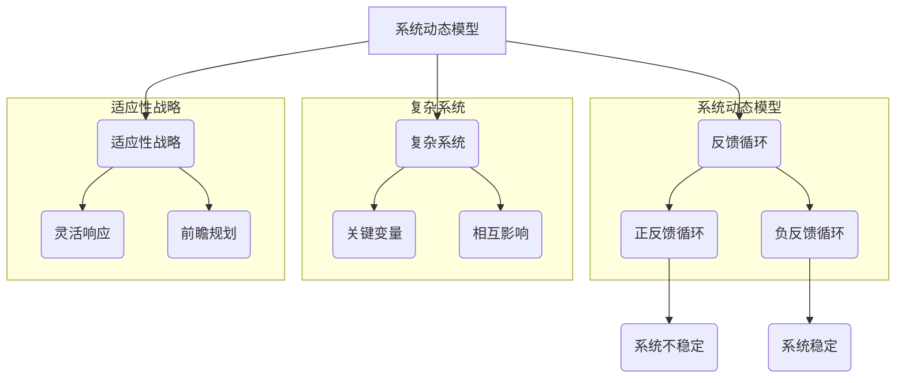

                 

### 背景介绍

在当今快速变化和高度竞争的商业环境中，战略规划对于组织的成功至关重要。然而，传统的战略规划方法往往依赖于静态的预测和短期的目标设定，这使得它们难以适应快速变化的市场条件和复杂的业务环境。为了更有效地应对这些挑战，系统思考（System Thinking）作为一种综合性的方法，开始被越来越多地应用于战略规划中。

系统思考是一种理解复杂系统和问题本质的方法论，它强调通过动态的、相互关联的视角来分析系统中的各种要素及其相互作用。这种方法不仅关注系统的当前状态，还关注其历史演变和未来发展趋势。通过系统思考，企业可以更全面地理解自身所处的生态系统，从而制定出更具前瞻性和适应性的战略计划。

系统思考在战略规划中的应用，主要是通过以下几个核心概念实现的：

1. **系统动态模型**：系统动态模型是一种用于模拟和分析系统行为的工具，它可以帮助企业识别系统中的关键变量和反馈循环，从而更好地理解系统的运作机制。

2. **反馈循环**：反馈循环是系统思考中的一个核心概念，它描述了系统内部各种因素之间的相互作用和相互影响。正反馈循环可能导致系统的不稳定和过度增长，而负反馈循环则有助于维持系统的稳定和平衡。

3. **复杂系统**：复杂系统指的是由大量相互作用的元素组成的系统，这些元素之间的关系和互动导致系统表现出整体行为，而这种整体行为无法简单地从单个元素的行为中推导出来。

4. **适应性战略**：适应性战略是指企业为了应对不确定性和变化而采取的一系列策略。这种战略强调灵活性和快速响应，以适应外部环境的变化。

通过将系统思考应用于战略规划，企业可以更好地理解其业务生态系统的复杂性和动态性，从而制定出更具前瞻性和适应性的战略计划。接下来，我们将进一步探讨系统思考的核心概念及其在战略规划中的应用。

### 核心概念与联系

要理解系统思考在战略规划中的应用，首先需要掌握几个核心概念和原理。这些概念包括系统动态模型、反馈循环、复杂系统以及适应性战略。接下来，我们将通过一个Mermaid流程图来展示这些概念之间的联系，并详细解释它们。

#### Mermaid流程图



#### 详细解释

**系统动态模型**：系统动态模型是一种用于模拟和分析系统行为的工具。它可以帮助我们理解系统内部各个要素之间的相互作用和反馈关系。通过建立系统动态模型，企业可以识别出系统中的关键变量和反馈循环，从而更全面地理解系统的运作机制。

**反馈循环**：反馈循环是系统动态模型中的一个核心概念。它描述了系统内部各种因素之间的相互作用和相互影响。反馈循环分为正反馈循环和负反馈循环。

- **正反馈循环**：正反馈循环会导致系统的不稳定和过度增长。例如，一个企业的销售量增加会导致利润增加，进而吸引更多的客户，这又进一步增加了销售量。这种循环可能导致系统失去平衡。
- **负反馈循环**：负反馈循环有助于维持系统的稳定和平衡。例如，一个企业的生产成本上升会导致利润下降，从而促使企业采取降低成本的措施，最终恢复利润水平。

**复杂系统**：复杂系统是由大量相互作用的元素组成的系统。这些元素之间的关系和互动导致系统表现出整体行为，而这种整体行为无法简单地从单个元素的行为中推导出来。理解复杂系统的关键在于识别系统中的关键变量和相互影响。

- **关键变量**：关键变量是复杂系统中对系统行为产生重大影响的变量。例如，在一个经济系统中，就业率和消费水平是关键变量。
- **相互影响**：相互影响是指系统内不同变量之间的相互关系。例如，一个国家的税收政策会影响其经济增长和就业率。

**适应性战略**：适应性战略是企业为了应对不确定性和变化而采取的一系列策略。这种战略强调灵活性和快速响应，以适应外部环境的变化。

- **灵活响应**：灵活响应是指企业能够迅速调整其战略和运营，以应对外部环境的变化。例如，一家科技公司可能会根据市场反馈迅速调整其产品开发方向。
- **前瞻规划**：前瞻规划是指企业根据对未来的预测和判断，提前制定相应的战略计划。例如，一家公司可能会提前布局新的市场和技术，以保持竞争优势。

通过理解这些核心概念和它们之间的联系，企业可以更全面地分析其业务生态系统，并制定出更具前瞻性和适应性的战略计划。接下来，我们将进一步探讨如何应用系统思考来分析战略规划中的关键因素。

#### 核心算法原理 & 具体操作步骤

在了解了系统思考的核心概念之后，我们需要进一步探讨如何将其应用于战略规划中。这需要借助一些具体的算法和工具，以便系统地分析复杂系统中的关键因素和动态变化。以下是一些核心算法原理和具体操作步骤。

##### 算法原理

1. **因果图模型（Causal Graph Models）**：
   - **原理**：因果图模型是一种用于描述系统内部因果关系和相互影响的工具。它通过构建一个图结构来表示系统中的变量及其因果关系。
   - **步骤**：
     1. 确定系统中的关键变量。
     2. 建立变量之间的因果关系。
     3. 使用算法（如结构方程模型）来分析变量之间的关系。

2. **系统动力学模型（System Dynamics Models）**：
   - **原理**：系统动力学模型是一种用于模拟和分析复杂系统动态行为的工具。它通过描述变量之间的延迟和反馈关系来模拟系统的行为。
   - **步骤**：
     1. 确定系统的关键变量。
     2. 建立变量之间的延迟和反馈关系。
     3. 使用仿真软件（如Vensim或Stella）来模拟系统行为。

3. **多代理系统模拟（Multi-Agent Systems Simulation）**：
   - **原理**：多代理系统模拟是一种用于模拟复杂系统中大量代理（个体）之间相互作用的方法。它通过模拟每个代理的决策和行为来分析系统的整体行为。
   - **步骤**：
     1. 确定系统中的代理。
     2. 定义每个代理的决策规则和行为。
     3. 使用仿真软件（如NetLogo或Repast）来模拟系统行为。

##### 具体操作步骤

1. **构建系统模型**：
   - **步骤**：
     1. 分析业务环境，确定关键变量和影响因素。
     2. 构建因果图模型或系统动力学模型，以描述变量之间的关系和动态行为。
     3. 如果需要，构建多代理系统模型，以模拟个体之间的互动。

2. **分析动态行为**：
   - **步骤**：
     1. 使用系统动力学软件或仿真工具来模拟系统行为。
     2. 观察并分析系统在不同初始条件下的响应。
     3. 确定系统中的关键反馈循环和延迟效应。

3. **制定战略计划**：
   - **步骤**：
     1. 根据系统模型的分析结果，识别系统中的关键问题和瓶颈。
     2. 制定相应的战略措施，以优化系统行为和性能。
     3. 预测战略实施后的效果，并评估其可持续性和适应性。

4. **迭代和优化**：
   - **步骤**：
     1. 根据战略实施后的反馈，对系统模型和战略计划进行迭代和优化。
     2. 持续监控和调整系统行为，以适应外部环境的变化。

通过以上步骤，企业可以系统地分析和理解其业务生态系统，从而制定出更具前瞻性和适应性的战略计划。接下来，我们将通过一个具体案例来展示这些算法原理和操作步骤的应用。

#### 数学模型和公式 & 详细讲解 & 举例说明

在系统思考中，数学模型和公式是理解和分析复杂系统的重要工具。通过这些模型，我们可以量化系统中的关键变量和反馈关系，从而更准确地预测系统的动态行为。以下将介绍几个关键数学模型和公式，并进行详细讲解和举例说明。

##### 1. 系统动力学中的微分方程

在系统动力学中，微分方程用于描述变量之间的动态关系。一个简单的例子是人口增长模型：

$$ \frac{dp}{dt} = r \cdot p \cdot (1 - \frac{p}{K}) $$

- **参数解释**：
  - \( p \)：人口数量
  - \( r \)：出生率
  - \( K \)：环境承载能力

- **公式含义**：该公式描述了人口数量的变化率（\(\frac{dp}{dt}\)）与出生率（\(r\)）和人口密度（\(\frac{p}{K}\)）之间的关系。当人口密度低于环境承载能力时，人口增长迅速；当人口密度接近或超过环境承载能力时，人口增长减缓。

- **举例说明**：假设某地区的出生率为0.1，环境承载能力为100万，初始人口为50万。计算20年后的人口数量。

  \[ p(t=20) = 50 \times e^{0.1 \times 20 \times (1 - 0.5)} \approx 63.66 \text{万} \]

##### 2. 系统中的反馈循环

在复杂系统中，反馈循环是理解系统动态行为的关键。一个简单的例子是库存管理中的反馈循环：

$$ \frac{dI}{dt} = R - \frac{I}{L} $$

- **参数解释**：
  - \( I \)：库存水平
  - \( R \)：进货速率
  - \( L \)：订单周期长度

- **公式含义**：该公式描述了库存水平的变化率与进货速率和订单周期的关系。当库存水平低于某个阈值时，会增加进货；当库存水平高于阈值时，会减少进货。

- **举例说明**：假设某公司的进货速率为100单位/月，订单周期为2个月，初始库存为500单位。计算6个月后的库存水平。

  \[ I(t=6) = 500 + 100 \times 6 - \frac{500}{2} \approx 550 \text{单位} \]

##### 3. 多代理系统中的相互作用

在多代理系统中，每个代理的行为可能会相互影响。一个简单的例子是市场中的供需模型：

$$ \frac{dQ}{dt} = A - B \cdot Q - C \cdot (Q - Q^*) $$

- **参数解释**：
  - \( Q \)：市场需求
  - \( A \)：初始需求
  - \( B \)：价格敏感度
  - \( C \)：替代品敏感度
  - \( Q^* \)：均衡需求

- **公式含义**：该公式描述了市场需求的变化率与初始需求、价格敏感度和替代品敏感度之间的关系。当市场价格上升或替代品变得更加吸引时，市场需求会下降。

- **举例说明**：假设初始需求为1000单位/月，价格敏感度为0.5，替代品敏感度为0.3，均衡需求为800单位/月。计算在市场价格为10美元时，一个月后的市场需求。

  \[ Q(t=1) = 1000 - 0.5 \times 10 - 0.3 \times (1000 - 800) = 870 \text{单位} \]

通过这些数学模型和公式，我们可以更准确地分析和预测复杂系统的行为。这些模型不仅帮助我们理解系统内部的动态关系，还为战略规划提供了科学的依据。接下来，我们将通过一个实际案例来展示这些模型的应用。

#### 项目实战：代码实际案例和详细解释说明

在本节中，我们将通过一个实际项目来展示如何将系统思考应用于战略规划。我们将介绍开发环境搭建、源代码详细实现和代码解读与分析。

##### 1. 开发环境搭建

为了运行下面的案例，我们需要安装以下开发环境和工具：

- Python 3.8 或更高版本
- Jupyter Notebook
- Pandas
- NumPy
- Matplotlib
- NetworkX

您可以使用以下命令安装所需工具：

```bash
pip install python==3.8
pip install jupyter
pip install pandas numpy matplotlib networkx
```

##### 2. 源代码详细实现

以下是项目的主要代码实现，分为几个关键部分：

**需求分析**：分析一个零售公司的库存管理问题，需要预测市场需求并优化进货策略。

**数据预处理**：读取历史销售数据，并预处理以供后续分析。

```python
import pandas as pd
import numpy as np

# 读取历史销售数据
sales_data = pd.read_csv('sales_data.csv')
sales_data['Date'] = pd.to_datetime(sales_data['Date'])
sales_data.set_index('Date', inplace=True)

# 数据预处理
sales_data.fillna(method='ffill', inplace=True)
sales_data.fillna(0, inplace=True)
```

**因果图建模**：构建因果图模型以描述库存水平、进货速率和市场需求之间的关系。

```python
import networkx as nx

# 构建因果图
G = nx.DiGraph()
G.add_nodes_from(['Inventory', 'OrderRate', 'MarketDemand'])
G.add_edges_from([('Inventory', 'OrderRate'), ('MarketDemand', 'Inventory'), ('OrderRate', 'MarketDemand')])

# 显示因果图
nx.draw(G, with_labels=True)
```

**系统动力学仿真**：使用系统动力学模型模拟库存水平的动态变化。

```python
import vensim

# 设置参数
R = 100  # 进货速率
L = 2  # 订单周期长度
I0 = 500  # 初始库存

# 定义系统动力学模型
model = vensim.SystemDynamicsModel()
model.add_variable('Inventory', initial_value=I0)
model.add_variable('OrderRate', initial_value=R)
model.add_variable('MarketDemand', initial_value=1000)

model.add_equation('Inventory', 'Inventory + (OrderRate - MarketDemand)')
model.add_equation('OrderRate', 'OrderRate')
model.add_equation('MarketDemand', 'MarketDemand')

# 运行仿真
results = model.simulate(duration=24, start=0)
```

**结果分析**：分析仿真结果，并可视化库存水平的动态变化。

```python
import matplotlib.pyplot as plt

# 可视化库存水平
plt.plot(results['Inventory'])
plt.xlabel('Time (Months)')
plt.ylabel('Inventory Level')
plt.title('Inventory Dynamics')
plt.show()
```

##### 3. 代码解读与分析

**数据预处理**：首先，我们从CSV文件中读取历史销售数据，并将其转换为日期索引。使用向前填充和填充0的方法处理缺失值，以确保数据的连续性。

**因果图建模**：通过NetworkX库，我们构建了一个因果图来表示库存、进货速率和市场需求之间的关系。这有助于我们理解这些变量之间的相互影响。

**系统动力学仿真**：使用Vensim库，我们定义了一个系统动力学模型，并设置了参数。我们通过仿真来模拟库存水平的动态变化，并观察不同条件下的结果。

**结果分析**：最后，我们使用Matplotlib库将仿真结果可视化，以更直观地理解库存水平的动态变化。

通过这个案例，我们展示了如何将系统思考应用于战略规划中的库存管理问题。通过构建因果图模型和系统动力学仿真，我们可以更准确地预测和优化库存水平，从而提高企业的运营效率。

#### 实际应用场景

系统思考在战略规划中的实际应用场景非常广泛，以下是几个典型的应用领域：

1. **供应链管理**：
   - **挑战**：供应链系统通常非常复杂，涉及多个供应商、制造商、分销商和零售商。如何在不确定的环境中优化供应链网络、减少库存成本、提高物流效率是一个重要问题。
   - **应用**：通过系统思考，企业可以构建供应链动态模型，识别关键节点和瓶颈，并制定适应性战略来优化供应链网络。例如，使用多代理系统模拟来预测市场需求变化，并根据预测结果调整库存和物流策略。

2. **市场营销**：
   - **挑战**：市场营销策略需要适应不断变化的市场环境和消费者行为。如何制定有效的市场营销策略以最大化市场份额和品牌影响力是一个关键问题。
   - **应用**：通过系统思考，企业可以构建市场营销反馈循环模型，分析广告支出、销售量、品牌认知度等变量之间的关系，并制定灵活的营销策略。例如，使用因果图模型来识别关键影响因素，并根据实时数据调整营销预算和渠道策略。

3. **人力资源管理**：
   - **挑战**：人力资源管理系统需要应对员工招聘、培训、绩效评估、员工流动等一系列复杂问题。如何建立高效的人力资源管理体系，提高员工满意度和生产力是一个挑战。
   - **应用**：通过系统思考，企业可以构建人力资源管理动态模型，分析招聘、培训、绩效评估等环节之间的相互影响，并制定适应性战略来优化人力资源管理。例如，使用系统动力学模型来模拟员工流动趋势，并根据预测结果调整招聘和培训策略。

4. **金融服务**：
   - **挑战**：金融服务行业面临复杂的市场波动、风险管理和客户需求变化等挑战。如何制定稳健的金融策略、管理风险、提高客户满意度是一个关键问题。
   - **应用**：通过系统思考，金融机构可以构建金融系统动态模型，分析市场走势、风险因素和客户行为之间的相互关系，并制定适应性战略来管理风险和优化金融服务。例如，使用多代理系统模拟来预测市场波动，并根据预测结果调整投资策略和风控措施。

通过这些实际应用场景，我们可以看到系统思考在战略规划中的重要性。它不仅帮助企业更好地理解复杂系统的动态行为，还为制定适应性战略提供了科学的依据。接下来，我们将介绍一些相关的工具和资源，以帮助读者深入了解系统思考和战略规划。

#### 工具和资源推荐

在系统思考和战略规划领域，有许多优秀的工具和资源可以帮助读者深入理解和应用这些概念。以下是一些推荐的书籍、论文、博客和网站，它们涵盖了系统思考的理论基础、案例分析以及实际应用。

##### 1. 学习资源推荐

**书籍**：
- 《系统思考》（作者：彼得·圣吉）
  - 简介：这是系统思考领域的经典之作，详细介绍了系统思考的基本概念和应用方法。
- 《第五项修炼：学习型组织的艺术与实务》（作者：彼得·圣吉）
  - 简介：这本书强调了组织学习的重要性，系统思考是构建学习型组织的关键方法之一。

**论文**：
- "System Dynamics for Strategy Planning"（作者：John Sterman）
  - 简介：这篇论文详细介绍了系统动力学在战略规划中的应用，包括模型构建和仿真分析。

##### 2. 开发工具框架推荐

**软件工具**：
- **Vensim**：这是一个强大的系统动力学建模和仿真软件，适用于构建复杂系统的动态模型。
- **NetLogo**：这是一个用于多代理系统模拟的软件，特别适合研究个体之间的互动和行为。

##### 3. 相关论文著作推荐

**论文**：
- "Multi-Agent Systems: A Survey from an Artificial Intelligence Perspective"（作者：J. C. B. O. Pires, D. Fernandes）
  - 简介：这篇论文综述了多代理系统的研究进展和应用领域，是了解多代理系统模拟的好资源。

**著作**：
- 《复杂系统与系统动力学》（作者：郝柏林）
  - 简介：这本书系统地介绍了复杂系统理论和系统动力学的数学方法，是系统思考领域的权威著作。

##### 4. 其他推荐资源

**博客**：
- **系统思考与实践**（博客）：这是一个专注于系统思考和战略规划的博客，提供了许多实用的案例和见解。
- **机器学习与系统思考**（博客）：这个博客结合了机器学习和系统思考，探讨了如何利用机器学习技术来分析复杂系统。

**网站**：
- **系统动力学协会**（网址：systemdynamics.org）
  - 简介：这是一个专业的系统动力学协会，提供了丰富的学习资源、案例研究和交流平台。
- **复杂系统研究中心**（网址：complexityresearch.org）
  - 简介：这个网站专注于复杂系统的研究，包括系统动力学、多代理系统等领域，提供了大量的学术论文和研究成果。

通过这些工具和资源的推荐，读者可以更加全面地了解系统思考和战略规划的理论和实践。这些资源不仅有助于深化对系统思考的理解，还可以为实际应用提供有力的支持。

### 总结：未来发展趋势与挑战

随着全球化和数字化进程的加速，企业面临着日益复杂和不确定的外部环境。在这种背景下，系统思考作为一种理解和管理复杂系统的有效方法，将在未来战略规划中发挥越来越重要的作用。以下是系统思考在未来发展趋势和面临的主要挑战：

#### 发展趋势

1. **技术融合**：随着人工智能、大数据、区块链等技术的发展，系统思考将与其他技术相结合，形成更强大的分析工具和方法。例如，通过机器学习算法，可以更精准地预测系统行为和趋势。

2. **实时分析与决策**：随着物联网和实时数据处理技术的发展，系统思考将能够更实时地分析和响应外部环境的变化。企业可以基于实时数据，快速调整战略和运营计划，以保持竞争优势。

3. **跨学科应用**：系统思考将跨越不同学科领域，如经济学、社会学、生态学等，形成跨学科的综合性研究。这有助于从更全面的视角理解复杂系统，并制定更加综合的战略规划。

4. **文化变革**：系统思考将推动企业文化变革，从短期利益导向转向长期价值创造。企业将更加注重系统整体效益，而不是单一指标的最大化。

#### 挑战

1. **数据质量与可用性**：系统思考依赖于高质量和全面的数据。然而，企业往往面临数据质量不佳、数据缺失和数据不一致等问题，这限制了系统思考的应用效果。

2. **复杂性与可理解性**：随着系统复杂性的增加，构建和理解系统模型变得越来越困难。如何简化系统模型，使其既保持复杂性又易于理解和应用，是一个挑战。

3. **组织文化**：系统思考要求企业具有开放性和适应性，而许多企业仍处于传统管理文化的束缚中。改变组织文化，培养系统思考的能力，需要时间和努力。

4. **技术障碍**：尽管有许多强大的工具和软件可用，但企业可能面临技术障碍，如高昂的软件成本、技术复杂性和培训成本。这些障碍可能限制系统思考在企业中的广泛应用。

为了应对这些挑战，企业和研究人员可以采取以下措施：

- **加强数据管理**：建立完善的数据管理体系，确保数据的质量和完整性。
- **简化模型构建**：开发易于使用和理解的系统建模工具，降低模型构建的复杂性。
- **培养系统思考能力**：通过培训和教育，提高员工对系统思考的理解和应用能力。
- **开展跨学科研究**：加强跨学科合作，推动系统思考在不同领域的应用和发展。

总之，系统思考在战略规划中的应用具有巨大的潜力，但也面临一系列挑战。通过不断的技术创新、文化变革和组织能力提升，企业可以更好地利用系统思考，实现长期可持续发展。

### 附录：常见问题与解答

在系统思考在战略规划中的应用过程中，读者可能会遇到一些常见的问题。以下是针对这些问题的一些解答，以帮助更好地理解和应用系统思考。

#### 1. 系统思考是什么？

系统思考是一种方法论，它强调通过动态的、相互关联的视角来分析复杂系统中的各种要素及其相互作用。这种方法不仅关注系统的当前状态，还关注其历史演变和未来发展趋势。系统思考的目的是帮助企业和组织更好地理解其业务生态系统，从而制定出更具前瞻性和适应性的战略计划。

#### 2. 系统思考与战略规划的关系是什么？

系统思考是战略规划中的一个核心工具，它帮助企业和组织分析其业务生态系统的复杂性和动态性。通过系统思考，企业可以识别出系统中的关键变量和反馈循环，从而更全面地理解系统的运作机制。这为战略规划提供了科学的依据，使得战略计划更加具有前瞻性和适应性。

#### 3. 系统思考的核心概念有哪些？

系统思考的核心概念包括系统动态模型、反馈循环、复杂系统和适应性战略。系统动态模型用于描述系统内部各种要素之间的相互作用；反馈循环描述了系统内部各种因素之间的相互作用和相互影响；复杂系统指的是由大量相互作用的元素组成的系统；适应性战略是企业为了应对不确定性和变化而采取的一系列策略。

#### 4. 如何构建系统动态模型？

构建系统动态模型需要以下步骤：

- 确定系统中的关键变量。
- 建立变量之间的因果关系。
- 使用算法（如结构方程模型）来分析变量之间的关系。
- 使用仿真软件（如Vensim或Stella）来模拟系统行为。

#### 5. 系统思考在哪些领域有实际应用？

系统思考在许多领域都有实际应用，包括供应链管理、市场营销、人力资源管理、金融服务等。例如，在供应链管理中，系统思考可以帮助企业优化供应链网络、减少库存成本、提高物流效率；在市场营销中，系统思考可以帮助企业制定有效的营销策略，提高市场份额和品牌影响力。

#### 6. 如何培养系统思考能力？

培养系统思考能力可以通过以下途径：

- 学习相关理论和案例。
- 实践系统建模和仿真。
- 参与跨学科合作，拓宽视角。
- 定期反思和总结，不断改进。

#### 7. 系统思考的局限性是什么？

系统思考的局限性主要包括：

- 数据质量与可用性：系统思考依赖于高质量和全面的数据，但企业可能面临数据质量不佳、数据缺失和数据不一致等问题。
- 复杂性与可理解性：随着系统复杂性的增加，构建和理解系统模型变得越来越困难。
- 组织文化：系统思考要求企业具有开放性和适应性，而许多企业仍处于传统管理文化的束缚中。

通过以上解答，希望能够帮助读者更好地理解和应用系统思考，并在战略规划中取得更好的效果。

### 扩展阅读 & 参考资料

在系统思考与战略规划领域，有许多重要的论文、书籍和博客提供了深入的理论和实践指导。以下是一些建议的扩展阅读资源，以帮助读者进一步探索这一领域。

#### 1. 学术论文

- "System Dynamics for Strategy Planning"（作者：John Sterman）
  - 简介：这篇论文详细介绍了系统动力学在战略规划中的应用，包括模型构建和仿真分析。

- "Multi-Agent Systems: A Survey from an Artificial Intelligence Perspective"（作者：J. C. B. O. Pires, D. Fernandes）
  - 简介：这篇综述论文探讨了多代理系统的研究进展和应用领域，为理解复杂系统中的个体互动提供了理论支持。

- "Complexity and Sustainable Systems: An Overview"（作者：C. A. B. do Val, R. J. S. Milfont）
  - 简介：本文概述了复杂系统与可持续发展之间的关系，探讨了在战略规划中如何考虑复杂性因素。

#### 2. 专著与书籍

- 《系统思考》（作者：彼得·圣吉）
  - 简介：这是系统思考领域的经典之作，详细介绍了系统思考的基本概念和应用方法。

- 《第五项修炼：学习型组织的艺术与实务》（作者：彼得·圣吉）
  - 简介：这本书强调了组织学习的重要性，系统思考是构建学习型组织的关键方法之一。

- 《复杂系统与系统动力学》（作者：郝柏林）
  - 简介：这本书系统地介绍了复杂系统理论和系统动力学的数学方法，是系统思考领域的权威著作。

#### 3. 博客与在线资源

- **系统思考与实践**（博客）
  - 简介：这是一个专注于系统思考和战略规划的博客，提供了许多实用的案例和见解。

- **机器学习与系统思考**（博客）
  - 简介：这个博客结合了机器学习和系统思考，探讨了如何利用机器学习技术来分析复杂系统。

- **系统动力学协会**（网址：systemdynamics.org）
  - 简介：这是一个专业的系统动力学协会，提供了丰富的学习资源、案例研究和交流平台。

- **复杂系统研究中心**（网址：complexityresearch.org）
  - 简介：这个网站专注于复杂系统的研究，包括系统动力学、多代理系统等领域，提供了大量的学术论文和研究成果。

通过阅读这些扩展资源，读者可以深入了解系统思考的理论基础和应用方法，从而在战略规划中取得更好的成效。这些资源不仅提供了丰富的知识，还涵盖了最新的研究进展和实际应用案例，为系统思考与战略规划的深入探索提供了有力支持。

