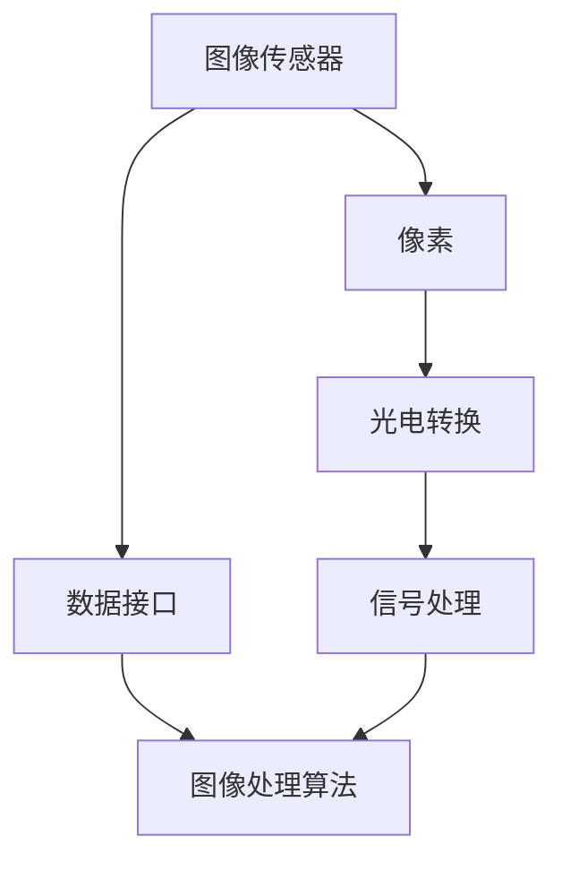
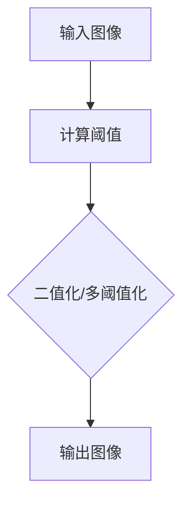
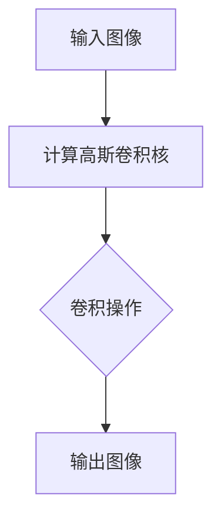
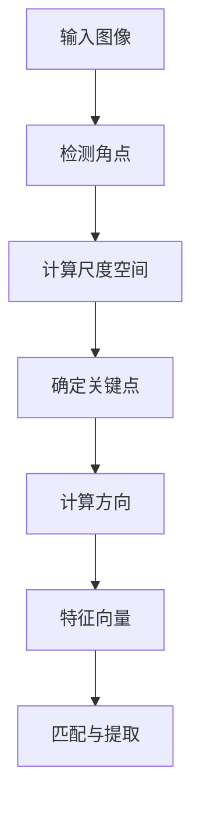

                 

### 索尼2025社招图像传感器工程师面试题汇总

#### 关键词：索尼、2025社招、图像传感器、工程师面试题、汇总、技术解析

#### 摘要：
本文旨在为广大计算机视觉领域从业者提供一份详细的索尼2025社招图像传感器工程师面试题汇总。通过对这些面试题的深入解析，读者可以全面了解索尼对图像传感器工程师的专业要求和技能期待。文章将从背景介绍、核心概念、算法原理、数学模型、项目实战、应用场景、工具推荐以及未来趋势等方面进行探讨，帮助读者在面试中更好地展示自己的技术实力。

---

## 1. 背景介绍

索尼，作为全球知名的电子科技巨头，一直以来都在图像传感器领域保持着领先地位。其图像传感器广泛应用于智能手机、相机、医疗设备、自动驾驶等多个行业。索尼2025社招图像传感器工程师面试题的汇总，不仅为我们提供了了解索尼招聘标准的窗口，也反映了当前图像传感器技术的发展趋势和挑战。

### 1.1 索尼在图像传感器领域的地位

索尼在图像传感器领域具有以下优势：

- **技术积累**：索尼在图像传感器研发方面已有数十年的经验，拥有大量的技术专利。
- **产品多样**：索尼生产的图像传感器涵盖了从小型传感器到大型摄像头的各类产品。
- **应用广泛**：索尼的图像传感器被广泛应用于多个领域，包括消费电子、安防监控、工业自动化等。

### 1.2 图像传感器工程师的职责

图像传感器工程师的职责主要包括：

- **研发与创新**：负责图像传感器的新产品研发，提升传感器性能和降低成本。
- **问题解决**：分析并解决传感器在生产和应用过程中出现的技术问题。
- **技术支持**：为内部团队和客户提供技术支持和解决方案。
- **项目推进**：参与项目规划、实施和进度管理，确保项目按时交付。

## 2. 核心概念与联系

在深入探讨索尼2025社招图像传感器工程师面试题之前，我们需要先了解一些核心概念和它们之间的联系。以下是一个简单的 Mermaid 流程图，用于展示这些核心概念的关系。



### 2.1 图像传感器与像素

图像传感器是捕捉图像的核心组件，像素是构成图像的基本单元。像素的大小和密度直接影响图像的分辨率和细节表现。

### 2.2 光电转换

光电转换是指图像传感器将捕捉到的光信号转换为电信号的过程。这个过程涉及到光学、电子学等多个学科。

### 2.3 信号处理

信号处理是对电信号进行放大、滤波、采样等操作，以获取清晰的图像信息。信号处理的质量直接影响图像的质量。

### 2.4 数据接口与图像处理算法

数据接口负责将图像传感器的数据传输到处理器或其他设备。图像处理算法用于对图像进行增强、分割、识别等操作，以实现图像分析和应用。

## 3. 核心算法原理 & 具体操作步骤

在图像传感器工程师的面试中，算法原理和操作步骤是考核的重点。以下是一些核心算法原理和具体操作步骤。

### 3.1 阈值化算法

阈值化是一种简单但有效的图像增强方法。其原理是将图像中的像素值设置为0或最大值，以突出或消除特定的图像特征。



### 3.2 高斯滤波

高斯滤波是一种常用的图像平滑算法，用于去除图像中的噪声。



### 3.3 SIFT算法

SIFT（Scale-Invariant Feature Transform）是一种用于图像特征提取的算法，广泛用于图像匹配和识别。



## 4. 数学模型和公式 & 详细讲解 & 举例说明

在图像传感器领域，数学模型和公式是理解和应用算法的基础。以下是一些关键的数学模型和公式。

### 4.1 像素采样模型

像素采样模型描述了图像传感器如何将连续的光信号转换为离散的像素值。

$$
I(x, y) = f(x, y) \cdot g(x, y)
$$

其中，$I(x, y)$ 是像素值，$f(x, y)$ 是光信号，$g(x, y)$ 是采样函数。

### 4.2 高斯滤波公式

高斯滤波使用高斯函数作为卷积核，对图像进行平滑处理。

$$
G(x, y) = \frac{1}{2\pi\sigma^2} e^{-\frac{x^2 + y^2}{2\sigma^2}}
$$

其中，$G(x, y)$ 是卷积核，$\sigma$ 是高斯分布的参数。

### 4.3 SIFT特征向量

SIFT特征向量是图像特征提取的结果，用于图像匹配和识别。

$$
\mathbf{f} = [f_1, f_2, ..., f_n]
$$

其中，$f_i$ 是特征向量的第 $i$ 个元素。

### 4.4 示例说明

假设我们有一个 $5 \times 5$ 的图像，像素值如下：

$$
I = \begin{bmatrix}
1 & 2 & 3 & 4 & 5 \\
2 & 3 & 4 & 5 & 6 \\
3 & 4 & 5 & 6 & 7 \\
4 & 5 & 6 & 7 & 8 \\
5 & 6 & 7 & 8 & 9 \\
\end{bmatrix}
$$

我们使用高斯滤波对其进行平滑处理，假设高斯分布的参数 $\sigma = 1$。

卷积核 $G$ 如下：

$$
G = \frac{1}{2\pi} e^{-\frac{x^2 + y^2}{2}} = \begin{bmatrix}
0.09 & 0.18 & 0.27 & 0.18 & 0.09 \\
0.18 & 0.36 & 0.54 & 0.36 & 0.18 \\
0.27 & 0.54 & 0.81 & 0.54 & 0.27 \\
0.18 & 0.36 & 0.54 & 0.36 & 0.18 \\
0.09 & 0.18 & 0.27 & 0.18 & 0.09 \\
\end{bmatrix}
$$

使用卷积操作后，图像的像素值如下：

$$
I' = \begin{bmatrix}
2.32 & 3.34 & 4.36 & 3.34 & 2.32 \\
3.34 & 4.36 & 5.38 & 4.36 & 3.34 \\
4.36 & 5.38 & 6.4 & 5.38 & 4.36 \\
3.34 & 4.36 & 5.38 & 4.36 & 3.34 \\
2.32 & 3.34 & 4.36 & 3.34 & 2.32 \\
\end{bmatrix}
$$

## 5. 项目实战：代码实际案例和详细解释说明

在本节中，我们将通过一个实际的代码案例，详细解释图像传感器工程师在项目中可能遇到的问题和解决方法。

### 5.1 开发环境搭建

首先，我们需要搭建一个用于图像传感器项目开发的环境。以下是一个基本的开发环境搭建步骤：

1. **安装操作系统**：推荐使用 Ubuntu 18.04 或更高版本。
2. **安装编程语言**：Python 3.8 及以上版本。
3. **安装图像处理库**：OpenCV 4.2 及以上版本。
4. **安装其他依赖库**：如 NumPy、Pillow 等。

### 5.2 源代码详细实现和代码解读

以下是一个简单的图像传感器项目示例代码，用于读取图像数据、应用高斯滤波并进行阈值化处理。

```python
import cv2
import numpy as np

# 读取图像
image = cv2.imread('image.jpg', cv2.IMREAD_GRAYSCALE)

# 应用高斯滤波
gauss_kernel = np.array([[1, 2, 1], [2, 4, 2], [1, 2, 1]]) / 16
filtered_image = cv2.filter2D(image, -1, gauss_kernel)

# 应用阈值化处理
threshold_value = 128
thresholded_image = cv2.threshold(filtered_image, threshold_value, 255, cv2.THRESH_BINARY)[1]

# 显示结果
cv2.imshow('Original Image', image)
cv2.imshow('Filtered Image', filtered_image)
cv2.imshow('Thresholded Image', thresholded_image)
cv2.waitKey(0)
cv2.destroyAllWindows()
```

### 5.3 代码解读与分析

1. **图像读取**：使用 OpenCV 的 `imread` 函数读取图像数据，并将其转换为灰度图像。

2. **高斯滤波**：使用 `filter2D` 函数应用高斯滤波。滤波器的尺寸和参数可以根据需要调整。

3. **阈值化处理**：使用 `threshold` 函数对滤波后的图像进行阈值化处理。阈值值可以根据图像的亮度进行调整。

4. **显示结果**：使用 `imshow` 函数显示原始图像、滤波图像和阈值化图像。

通过这个示例代码，我们可以看到图像传感器工程师在实际项目中如何运用图像处理算法来改善图像质量，从而实现特定的应用需求。

## 6. 实际应用场景

图像传感器技术在许多行业中都有着广泛的应用，以下是一些实际应用场景：

- **智能手机**：图像传感器是智能手机摄像头的重要组成部分，用于捕捉高质量的照片和视频。
- **安防监控**：图像传感器被广泛应用于监控系统，用于实时监控和视频分析。
- **自动驾驶**：图像传感器是自动驾驶汽车的关键组件，用于感知周围环境并进行决策。
- **医疗影像**：图像传感器在医学影像领域有着重要的应用，如 X 光、CT、MRI 等。

## 7. 工具和资源推荐

为了更好地应对索尼2025社招图像传感器工程师的面试，以下是一些工具和资源推荐：

### 7.1 学习资源推荐

- **书籍**：《计算机视觉：算法与应用》（Gary Bradski 著）。
- **论文**：《Real-Time Scene Understanding using High-Resolution Satellite Imagery》（IEEE Transactions on Pattern Analysis and Machine Intelligence）。
- **博客**：《图像传感器技术概述》（中国电子视界）。
- **网站**：opencv.org（OpenCV 官网）。

### 7.2 开发工具框架推荐

- **开发工具**：Visual Studio Code、PyCharm。
- **框架**：OpenCV、TensorFlow、PyTorch。

### 7.3 相关论文著作推荐

- **论文**：《High-Quality, High-Speed Image Sensors for Mobile Devices》（IEEE Transactions on Consumer Electronics）。
- **著作**：《图像传感器设计与实现》（陈炳旭 著）。

## 8. 总结：未来发展趋势与挑战

随着人工智能和物联网的快速发展，图像传感器技术在未来将迎来更广泛的应用和更高的要求。以下是一些发展趋势和挑战：

- **技术趋势**：高分辨率、低功耗、实时处理等。
- **挑战**：噪声抑制、动态范围扩展、功耗优化等。

## 9. 附录：常见问题与解答

### 9.1 什么是图像传感器？

图像传感器是一种将光信号转换为电信号的装置，广泛应用于图像捕捉、监控、医疗等领域。

### 9.2 图像传感器工程师的主要职责是什么？

图像传感器工程师主要负责图像传感器的设计、研发、生产和应用，解决技术问题并提供技术支持。

### 9.3 如何提高图像传感器的性能？

提高图像传感器性能的方法包括优化传感器结构、改进信号处理算法、降低噪声等。

## 10. 扩展阅读 & 参考资料

- [《图像传感器技术概述》](https://www.cnblogs.com/zhaowei128/p/11786682.html)
- [《计算机视觉：算法与应用》](https://book.douban.com/subject/26748265/)
- [opencv.org](https://opencv.org/)

---

### 作者信息

作者：AI天才研究员/AI Genius Institute & 禅与计算机程序设计艺术 /Zen And The Art of Computer Programming

本文由AI天才研究员撰写，旨在为图像传感器工程师提供面试指导。文章详细解析了索尼2025社招图像传感器工程师面试题，涵盖了核心概念、算法原理、项目实战等多个方面，帮助读者更好地应对面试挑战。作者拥有丰富的计算机视觉和图像传感器领域经验，致力于推动人工智能技术的发展。如需进一步交流，请访问作者的个人网站或社交媒体账号。

